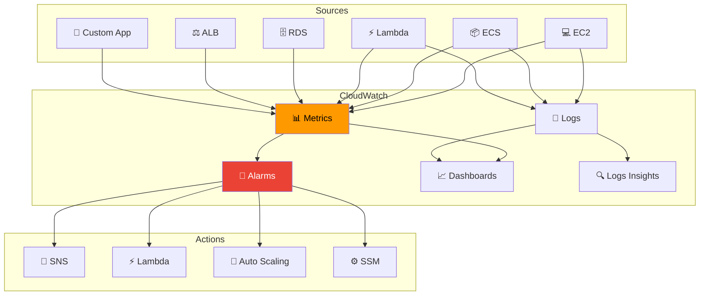

---
tags:
  - formation
  - aws
  - cloudwatch
  - monitoring
  - observability
---

# Module 10 : Observability - CloudWatch & X-Ray

## Objectifs du Module

À la fin de ce module, vous serez capable de :

- :fontawesome-solid-chart-line: Configurer CloudWatch Metrics et Dashboards
- :fontawesome-solid-file-lines: Gérer les logs avec CloudWatch Logs et Insights
- :fontawesome-solid-bell: Créer des alarmes et des notifications
- :fontawesome-solid-route: Tracer les requêtes avec X-Ray
- :fontawesome-solid-bullseye: Implémenter des SLOs avec CloudWatch Synthetics

---

## 1. CloudWatch Metrics

### 1.1 Architecture Observabilité



### 1.2 Custom Metrics

```bash
# Publier une métrique custom
aws cloudwatch put-metric-data \
    --namespace "MyApp" \
    --metric-name "OrdersProcessed" \
    --value 42 \
    --unit Count \
    --dimensions Environment=production,Service=orders

# Publier plusieurs métriques
aws cloudwatch put-metric-data \
    --namespace "MyApp" \
    --metric-data '[
        {
            "MetricName": "RequestLatency",
            "Value": 125.5,
            "Unit": "Milliseconds",
            "Dimensions": [
                {"Name": "Endpoint", "Value": "/api/orders"},
                {"Name": "Method", "Value": "POST"}
            ]
        },
        {
            "MetricName": "ErrorCount",
            "Value": 3,
            "Unit": "Count",
            "Dimensions": [
                {"Name": "Endpoint", "Value": "/api/orders"},
                {"Name": "ErrorType", "Value": "5xx"}
            ]
        }
    ]'

# Publier avec statistiques (high resolution)
aws cloudwatch put-metric-data \
    --namespace "MyApp" \
    --metric-data '[
        {
            "MetricName": "RequestLatency",
            "StatisticValues": {
                "SampleCount": 100,
                "Sum": 12500,
                "Minimum": 50,
                "Maximum": 500
            },
            "Unit": "Milliseconds",
            "StorageResolution": 1
        }
    ]'
```

### 1.3 Metric Math et Anomaly Detection

```bash
# Créer une alarme avec Metric Math
aws cloudwatch put-metric-alarm \
    --alarm-name "HighErrorRate" \
    --evaluation-periods 3 \
    --comparison-operator GreaterThanThreshold \
    --threshold 5 \
    --metrics '[
        {
            "Id": "errors",
            "MetricStat": {
                "Metric": {
                    "Namespace": "AWS/ApplicationELB",
                    "MetricName": "HTTPCode_Target_5XX_Count",
                    "Dimensions": [{"Name": "LoadBalancer", "Value": "app/my-alb/xxx"}]
                },
                "Period": 60,
                "Stat": "Sum"
            },
            "ReturnData": false
        },
        {
            "Id": "requests",
            "MetricStat": {
                "Metric": {
                    "Namespace": "AWS/ApplicationELB",
                    "MetricName": "RequestCount",
                    "Dimensions": [{"Name": "LoadBalancer", "Value": "app/my-alb/xxx"}]
                },
                "Period": 60,
                "Stat": "Sum"
            },
            "ReturnData": false
        },
        {
            "Id": "error_rate",
            "Expression": "(errors / requests) * 100",
            "Label": "Error Rate (%)",
            "ReturnData": true
        }
    ]' \
    --alarm-actions arn:aws:sns:eu-west-1:123456789012:alerts

# Anomaly Detection
aws cloudwatch put-anomaly-detector \
    --namespace "MyApp" \
    --metric-name "RequestLatency" \
    --stat "Average" \
    --configuration '{
        "ExcludedTimeRanges": [
            {"StartTime": "2024-12-25T00:00:00Z", "EndTime": "2024-12-26T00:00:00Z"}
        ]
    }'

# Alarme basée sur anomaly detection
aws cloudwatch put-metric-alarm \
    --alarm-name "LatencyAnomaly" \
    --evaluation-periods 3 \
    --comparison-operator GreaterThanUpperThreshold \
    --threshold-metric-id "ad1" \
    --metrics '[
        {
            "Id": "m1",
            "MetricStat": {
                "Metric": {
                    "Namespace": "MyApp",
                    "MetricName": "RequestLatency"
                },
                "Period": 300,
                "Stat": "Average"
            }
        },
        {
            "Id": "ad1",
            "Expression": "ANOMALY_DETECTION_BAND(m1, 2)"
        }
    ]'
```

---

## 2. CloudWatch Logs

### 2.1 Configuration des Logs

```bash
# Créer un log group
aws logs create-log-group \
    --log-group-name /myapp/production \
    --tags Environment=production,Application=myapp

# Configurer la rétention
aws logs put-retention-policy \
    --log-group-name /myapp/production \
    --retention-in-days 30

# Créer un log stream
aws logs create-log-stream \
    --log-group-name /myapp/production \
    --log-stream-name api-server-1

# Envoyer des logs
aws logs put-log-events \
    --log-group-name /myapp/production \
    --log-stream-name api-server-1 \
    --log-events '[
        {"timestamp": 1704067200000, "message": "{\"level\":\"INFO\",\"message\":\"Server started\"}"},
        {"timestamp": 1704067201000, "message": "{\"level\":\"ERROR\",\"message\":\"Database connection failed\"}"}
    ]'
```

### 2.2 CloudWatch Logs Insights

```bash
# Requête simple
aws logs start-query \
    --log-group-name /myapp/production \
    --start-time $(date -d '1 hour ago' +%s) \
    --end-time $(date +%s) \
    --query-string '
        fields @timestamp, @message
        | filter @message like /ERROR/
        | sort @timestamp desc
        | limit 50
    '

# Requête avec parsing JSON
aws logs start-query \
    --log-group-names /myapp/production \
    --start-time $(date -d '24 hours ago' +%s) \
    --end-time $(date +%s) \
    --query-string '
        fields @timestamp, @message
        | parse @message /.*"level":"(?<level>\w+)".*"endpoint":"(?<endpoint>[^"]+)".*"latency":(?<latency>\d+)/
        | filter level = "ERROR"
        | stats count(*) as error_count by endpoint
        | sort error_count desc
    '

# Récupérer les résultats
aws logs get-query-results --query-id xxx
```

### 2.3 Metric Filters

```bash
# Créer un metric filter pour compter les erreurs
aws logs put-metric-filter \
    --log-group-name /myapp/production \
    --filter-name ErrorCount \
    --filter-pattern '[timestamp, level="ERROR", ...]' \
    --metric-transformations '[
        {
            "metricName": "ErrorCount",
            "metricNamespace": "MyApp/Logs",
            "metricValue": "1",
            "defaultValue": 0
        }
    ]'

# Filter pour extraire la latence
aws logs put-metric-filter \
    --log-group-name /myapp/production \
    --filter-name RequestLatency \
    --filter-pattern '[timestamp, level, endpoint, latency, ...]' \
    --metric-transformations '[
        {
            "metricName": "RequestLatency",
            "metricNamespace": "MyApp/Logs",
            "metricValue": "$latency",
            "unit": "Milliseconds"
        }
    ]'
```

---

## 3. CloudWatch Alarms

### 3.1 Composite Alarms

```bash
# Créer des alarmes de base
aws cloudwatch put-metric-alarm \
    --alarm-name "HighCPU" \
    --metric-name CPUUtilization \
    --namespace AWS/EC2 \
    --statistic Average \
    --period 300 \
    --threshold 80 \
    --comparison-operator GreaterThanThreshold \
    --evaluation-periods 2 \
    --dimensions Name=InstanceId,Value=i-xxx

aws cloudwatch put-metric-alarm \
    --alarm-name "HighMemory" \
    --metric-name mem_used_percent \
    --namespace CWAgent \
    --statistic Average \
    --period 300 \
    --threshold 85 \
    --comparison-operator GreaterThanThreshold \
    --evaluation-periods 2 \
    --dimensions Name=InstanceId,Value=i-xxx

# Composite alarm
aws cloudwatch put-composite-alarm \
    --alarm-name "InstanceUnhealthy" \
    --alarm-rule "ALARM(HighCPU) OR ALARM(HighMemory)" \
    --alarm-actions arn:aws:sns:eu-west-1:123456789012:critical-alerts \
    --ok-actions arn:aws:sns:eu-west-1:123456789012:resolved-alerts \
    --alarm-description "Instance is under stress - high CPU or memory"
```

### 3.2 Actions Automatiques

```bash
# Alarm avec action EC2 (reboot)
aws cloudwatch put-metric-alarm \
    --alarm-name "InstanceUnresponsive" \
    --metric-name StatusCheckFailed_System \
    --namespace AWS/EC2 \
    --statistic Maximum \
    --period 60 \
    --threshold 1 \
    --comparison-operator GreaterThanOrEqualToThreshold \
    --evaluation-periods 2 \
    --dimensions Name=InstanceId,Value=i-xxx \
    --alarm-actions arn:aws:automate:eu-west-1:ec2:reboot

# Alarm avec action Systems Manager
aws cloudwatch put-metric-alarm \
    --alarm-name "DiskFull" \
    --metric-name disk_used_percent \
    --namespace CWAgent \
    --statistic Average \
    --period 300 \
    --threshold 90 \
    --comparison-operator GreaterThanThreshold \
    --evaluation-periods 1 \
    --dimensions Name=InstanceId,Value=i-xxx,Name=path,Value=/ \
    --alarm-actions arn:aws:ssm:eu-west-1:123456789012:opsitem:severity#MEDIUM
```

---

## 4. CloudWatch Dashboards

```bash
# Créer un dashboard
aws cloudwatch put-dashboard \
    --dashboard-name MyAppDashboard \
    --dashboard-body '{
        "widgets": [
            {
                "type": "metric",
                "x": 0, "y": 0, "width": 12, "height": 6,
                "properties": {
                    "title": "Request Latency",
                    "metrics": [
                        ["MyApp", "RequestLatency", {"stat": "p50", "label": "p50"}],
                        [".", ".", {"stat": "p95", "label": "p95"}],
                        [".", ".", {"stat": "p99", "label": "p99"}]
                    ],
                    "period": 60,
                    "region": "eu-west-1"
                }
            },
            {
                "type": "metric",
                "x": 12, "y": 0, "width": 12, "height": 6,
                "properties": {
                    "title": "Error Rate",
                    "metrics": [
                        [{"expression": "(m2/m1)*100", "label": "Error Rate %", "id": "e1"}],
                        ["AWS/ApplicationELB", "HTTPCode_Target_5XX_Count", "LoadBalancer", "app/my-alb/xxx", {"id": "m2", "visible": false}],
                        [".", "RequestCount", ".", ".", {"id": "m1", "visible": false}]
                    ],
                    "period": 60,
                    "yAxis": {"left": {"min": 0, "max": 10}}
                }
            },
            {
                "type": "log",
                "x": 0, "y": 6, "width": 24, "height": 6,
                "properties": {
                    "title": "Recent Errors",
                    "query": "SOURCE '\''/myapp/production'\'' | fields @timestamp, @message | filter @message like /ERROR/ | sort @timestamp desc | limit 20",
                    "region": "eu-west-1"
                }
            },
            {
                "type": "alarm",
                "x": 0, "y": 12, "width": 12, "height": 4,
                "properties": {
                    "title": "Alarm Status",
                    "alarms": [
                        "arn:aws:cloudwatch:eu-west-1:123456789012:alarm:HighCPU",
                        "arn:aws:cloudwatch:eu-west-1:123456789012:alarm:HighErrorRate",
                        "arn:aws:cloudwatch:eu-west-1:123456789012:alarm:HighLatency"
                    ]
                }
            }
        ]
    }'
```

---

## 5. AWS X-Ray

### 5.1 Instrumentation

```python
# Python avec X-Ray SDK
from aws_xray_sdk.core import xray_recorder
from aws_xray_sdk.core import patch_all
import boto3

# Patcher automatiquement les librairies AWS
patch_all()

@xray_recorder.capture('process_order')
def process_order(order_id):
    # Ajouter des annotations (indexées, recherchables)
    xray_recorder.current_segment().put_annotation('order_id', order_id)

    # Ajouter des métadonnées (non indexées)
    xray_recorder.current_segment().put_metadata('order_details', {'items': 5})

    # Créer un sous-segment
    with xray_recorder.capture('validate_order') as subsegment:
        validate_order(order_id)
        subsegment.put_annotation('validation_status', 'passed')

    with xray_recorder.capture('charge_payment') as subsegment:
        charge_payment(order_id)

    return {'status': 'success'}
```

```bash
# Configurer X-Ray daemon (EC2)
curl https://s3.dualstack.eu-west-1.amazonaws.com/aws-xray-assets.eu-west-1/xray-daemon/aws-xray-daemon-3.x.rpm -o xray.rpm
sudo yum install -y xray.rpm
sudo systemctl enable xray
sudo systemctl start xray

# ECS Task Definition avec X-Ray sidecar
{
    "containerDefinitions": [
        {
            "name": "app",
            "image": "my-app:latest",
            "environment": [
                {"name": "AWS_XRAY_DAEMON_ADDRESS", "value": "localhost:2000"}
            ]
        },
        {
            "name": "xray-daemon",
            "image": "amazon/aws-xray-daemon",
            "portMappings": [
                {"containerPort": 2000, "protocol": "udp"}
            ],
            "essential": false
        }
    ]
}
```

### 5.2 Service Map et Traces

```bash
# Obtenir le service graph
aws xray get-service-graph \
    --start-time $(date -d '1 hour ago' --utc +%Y-%m-%dT%H:%M:%SZ) \
    --end-time $(date --utc +%Y-%m-%dT%H:%M:%SZ)

# Rechercher des traces
aws xray get-trace-summaries \
    --start-time $(date -d '1 hour ago' --utc +%Y-%m-%dT%H:%M:%SZ) \
    --end-time $(date --utc +%Y-%m-%dT%H:%M:%SZ) \
    --filter-expression 'annotation.order_id = "12345" AND responsetime > 2'

# Obtenir une trace complète
aws xray batch-get-traces --trace-ids 1-xxx-yyy
```

---

## 6. CloudWatch Synthetics

### 6.1 Canary pour Monitoring

```javascript
// canary-script.js
const synthetics = require('Synthetics');
const log = require('SyntheticsLogger');

const apiCanary = async function () {
    const page = await synthetics.getPage();

    // Test de l'endpoint API
    const response = await page.evaluate(async () => {
        const res = await fetch('https://api.myapp.com/health');
        return {
            status: res.status,
            body: await res.json()
        };
    });

    if (response.status !== 200) {
        throw new Error(`Health check failed: ${response.status}`);
    }

    log.info(`Health check passed: ${JSON.stringify(response.body)}`);

    // Test d'une transaction
    const orderResponse = await page.evaluate(async () => {
        const res = await fetch('https://api.myapp.com/orders', {
            method: 'POST',
            headers: {'Content-Type': 'application/json'},
            body: JSON.stringify({item: 'test', quantity: 1})
        });
        return {status: res.status, latency: res.headers.get('x-response-time')};
    });

    // Publier des métriques custom
    await synthetics.addExecutionError('OrderLatency', parseInt(orderResponse.latency));
};

exports.handler = async () => {
    return await apiCanary();
};
```

```bash
# Créer le canary
aws synthetics create-canary \
    --name api-health-canary \
    --artifact-s3-location s3://my-canary-artifacts/api-health/ \
    --execution-role-arn arn:aws:iam::123456789012:role/CloudWatchSyntheticsRole \
    --schedule Expression="rate(5 minutes)" \
    --runtime-version syn-nodejs-puppeteer-6.0 \
    --code S3Bucket=my-canary-code,S3Key=canary-script.zip \
    --run-config TimeoutInSeconds=60,MemoryInMB=1024 \
    --success-retention-period-in-days 7 \
    --failure-retention-period-in-days 31

# Démarrer le canary
aws synthetics start-canary --name api-health-canary
```

---

## 7. Exercices Pratiques

### Exercice 1 : Stack Observabilité Complète

!!! example "Objectif"
    Implémenter une solution de monitoring complète avec alerting.

??? quote "Solution"

    ```bash
    # 1. Configurer CloudWatch Agent sur EC2
    # 2. Créer les dashboards
    # 3. Configurer les alarmes avec actions
    # 4. Implémenter X-Ray tracing
    # 5. Créer des canaries Synthetics

    # Voir les sections précédentes pour le code détaillé
    ```

---

## 8. Résumé

| Service | Description | Use Case |
|---------|-------------|----------|
| **CloudWatch Metrics** | Métriques temps réel | KPIs, performance |
| **CloudWatch Logs** | Centralisation logs | Debug, audit |
| **CloudWatch Alarms** | Alerting | Incidents, auto-remediation |
| **CloudWatch Dashboards** | Visualisation | NOC, SRE |
| **X-Ray** | Distributed tracing | Debug microservices |
| **Synthetics** | Tests externes | Uptime, SLOs |

---

## Navigation

| Précédent | Suivant |
|-----------|---------|
| [← Module 9 : Security](09-module.md) | [↩️ Retour au syllabus](index.md) |

---

## Navigation

| | |
|:---|---:|
| [← Module 9 : Security - WAF, Secrets Ma...](09-module.md) | [Programme →](index.md) |

[Retour au Programme](index.md){ .md-button }
