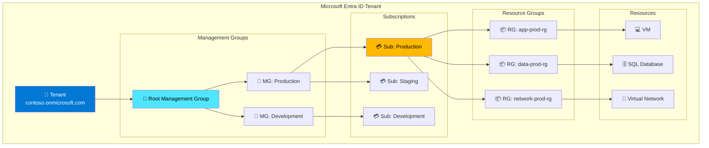
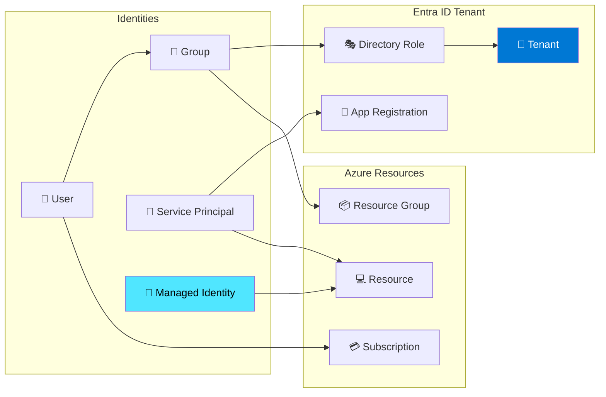
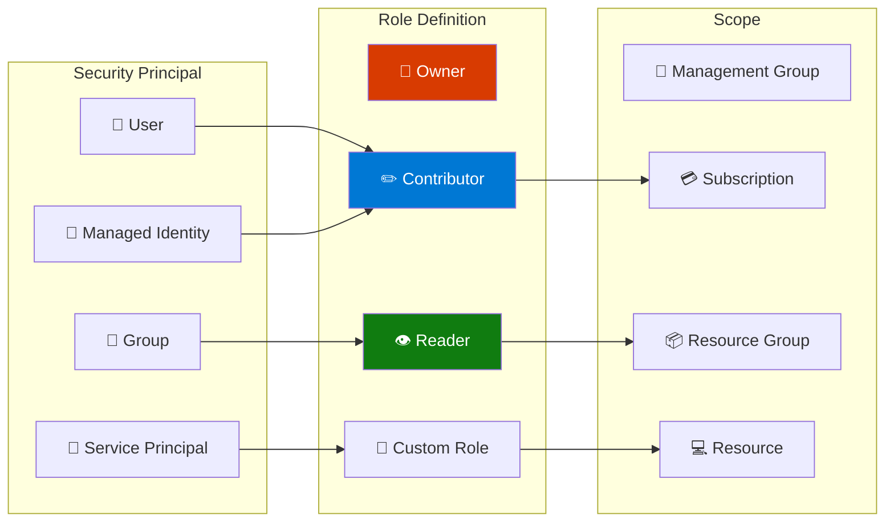

---
tags:
  - formation
  - azure
  - microsoft
  - cloud
  - entra-id
  - rbac
---

# Module 1 : Portail Azure, Subscriptions & Entra ID

## Objectifs du Module

À la fin de ce module, vous serez capable de :

- :material-microsoft-azure: Naviguer efficacement dans le Portail Azure
- :fontawesome-solid-sitemap: Comprendre la hiérarchie Azure (Tenants, Subscriptions, Resource Groups)
- :fontawesome-solid-user-shield: Configurer Microsoft Entra ID (ex-Azure AD)
- :fontawesome-solid-shield-halved: Implémenter Azure RBAC (Role-Based Access Control)
- :fontawesome-solid-terminal: Utiliser Azure CLI et PowerShell

## Prérequis

- Compte Azure avec accès administrateur
- Connaissances Windows/Linux de base
- Familiarité avec les concepts d'authentification

---

## 1. Découverte du Portail Azure

### 1.1 Accès au Portail

Le Portail Azure est l'interface web principale pour gérer vos ressources.

**URL :** [https://portal.azure.com](https://portal.azure.com)

```text
Types de connexion :
├── Microsoft Account (personnel)        → @outlook.com, @hotmail.com
├── Work/School Account (Entra ID)       → @company.onmicrosoft.com
├── B2B Guest (invité)                   → Accès via invitation
└── Federated (ADFS/SAML)               → SSO entreprise
```

### 1.2 Navigation dans le Portail

**Éléments clés :**

| Élément | Description |
|---------|-------------|
| **Home** | Dashboard personnalisable |
| **All services** | Catalogue de tous les services Azure (200+) |
| **Resource groups** | Conteneurs logiques pour les ressources |
| **Cloud Shell** | Terminal intégré (Bash/PowerShell) |
| **Subscriptions** | Conteneurs de facturation |
| **Microsoft Entra ID** | Gestion des identités |

### 1.3 Azure Cloud Shell

Cloud Shell est un terminal basé navigateur avec Azure CLI et PowerShell préinstallés :

```bash
# Vérifier l'identité connectée
az account show

# Lister les subscriptions
az account list --output table

# Changer de subscription
az account set --subscription "My Subscription"

# Lister les resource groups
az group list --output table

# Outils disponibles
az --version
pwsh --version
terraform --version
kubectl version --client
```

---

## 2. Hiérarchie Azure

### 2.1 Structure Organisationnelle



### 2.2 Créer des Resource Groups

```bash
# Créer un resource group
az group create \
    --name app-prod-rg \
    --location westeurope \
    --tags Environment=Production Team=DevOps

# Lister les resources dans un groupe
az resource list \
    --resource-group app-prod-rg \
    --output table

# Appliquer des tags
az group update \
    --name app-prod-rg \
    --tags Environment=Production Team=DevOps CostCenter=IT001

# Supprimer un resource group (et toutes ses resources !)
az group delete --name app-prod-rg --yes --no-wait
```

### 2.3 Azure Policy

```bash
# Lister les policy definitions built-in
az policy definition list \
    --query "[?policyType=='BuiltIn'].{Name:displayName, Description:description}" \
    --output table

# Assigner une policy (ex: Require tag on resources)
az policy assignment create \
    --name "require-environment-tag" \
    --display-name "Require Environment tag on resources" \
    --policy "/providers/Microsoft.Authorization/policyDefinitions/871b6d14-10aa-478d-b590-94f262ecfa99" \
    --scope "/subscriptions/xxxxxxxx-xxxx-xxxx-xxxx-xxxxxxxxxxxx" \
    --params '{"tagName": {"value": "Environment"}}'

# Vérifier la compliance
az policy state list \
    --resource-group app-prod-rg \
    --query "[].{Resource:resourceId, Compliance:complianceState}" \
    --output table
```

---

## 3. Microsoft Entra ID (ex-Azure AD)

### 3.1 Concepts Fondamentaux



### 3.2 Gérer les Utilisateurs

```bash
# Créer un utilisateur
az ad user create \
    --display-name "John Doe" \
    --user-principal-name "john.doe@contoso.onmicrosoft.com" \
    --password "TempPassword123!" \
    --force-change-password-next-sign-in true

# Lister les utilisateurs
az ad user list \
    --query "[].{Name:displayName, UPN:userPrincipalName, ObjectId:id}" \
    --output table

# Créer un groupe
az ad group create \
    --display-name "Developers" \
    --mail-nickname "developers"

# Ajouter un membre au groupe
az ad group member add \
    --group "Developers" \
    --member-id $(az ad user show --id "john.doe@contoso.onmicrosoft.com" --query id -o tsv)

# Lister les membres d'un groupe
az ad group member list \
    --group "Developers" \
    --query "[].displayName" \
    --output table
```

### 3.3 Service Principals et Managed Identities

```bash
# Créer un Service Principal
az ad sp create-for-rbac \
    --name "sp-github-actions" \
    --role Contributor \
    --scopes /subscriptions/xxxxxxxx-xxxx-xxxx-xxxx-xxxxxxxxxxxx

# Sortie :
# {
#   "appId": "xxxxxxxx-xxxx-xxxx-xxxx-xxxxxxxxxxxx",
#   "displayName": "sp-github-actions",
#   "password": "xxxxxxxxxxxxxxxxxxxxxxxxxxxxxxxx",
#   "tenant": "xxxxxxxx-xxxx-xxxx-xxxx-xxxxxxxxxxxx"
# }

# Créer une Managed Identity (User-Assigned)
az identity create \
    --name mi-app-identity \
    --resource-group app-prod-rg \
    --location westeurope

# Lister les Managed Identities
az identity list \
    --resource-group app-prod-rg \
    --output table
```

---

## 4. Azure RBAC

### 4.1 Modèle RBAC



### 4.2 Rôles Intégrés Courants

| Rôle | Description | Actions |
|------|-------------|---------|
| **Owner** | Accès complet + gestion RBAC | `*` |
| **Contributor** | Accès complet sauf RBAC | `*` sauf `Authorization/*` |
| **Reader** | Lecture seule | `*/read` |
| **User Access Administrator** | Gestion RBAC uniquement | `Authorization/*` |
| **Virtual Machine Contributor** | Gérer les VMs | `Microsoft.Compute/*` |
| **Storage Blob Data Contributor** | Accès données Blob | `Microsoft.Storage/*/read,write,delete` |

### 4.3 Assigner des Rôles

```bash
# Assigner un rôle à un utilisateur sur une subscription
az role assignment create \
    --assignee "john.doe@contoso.onmicrosoft.com" \
    --role "Contributor" \
    --scope "/subscriptions/xxxxxxxx-xxxx-xxxx-xxxx-xxxxxxxxxxxx"

# Assigner un rôle à un groupe sur un resource group
az role assignment create \
    --assignee $(az ad group show --group "Developers" --query id -o tsv) \
    --role "Virtual Machine Contributor" \
    --scope "/subscriptions/xxx/resourceGroups/app-prod-rg"

# Assigner un rôle à une Managed Identity
az role assignment create \
    --assignee $(az identity show --name mi-app-identity --resource-group app-prod-rg --query principalId -o tsv) \
    --role "Storage Blob Data Contributor" \
    --scope "/subscriptions/xxx/resourceGroups/app-prod-rg/providers/Microsoft.Storage/storageAccounts/mystorageaccount"

# Lister les assignments
az role assignment list \
    --resource-group app-prod-rg \
    --output table

# Supprimer un assignment
az role assignment delete \
    --assignee "john.doe@contoso.onmicrosoft.com" \
    --role "Contributor" \
    --scope "/subscriptions/xxx"
```

### 4.4 Créer un Rôle Custom

```bash
# Définition du rôle custom
cat > custom-role.json << 'EOF'
{
    "Name": "VM Operator",
    "Description": "Can start, stop and restart VMs but not create or delete",
    "Actions": [
        "Microsoft.Compute/virtualMachines/read",
        "Microsoft.Compute/virtualMachines/start/action",
        "Microsoft.Compute/virtualMachines/restart/action",
        "Microsoft.Compute/virtualMachines/deallocate/action",
        "Microsoft.Compute/virtualMachines/powerOff/action"
    ],
    "NotActions": [],
    "DataActions": [],
    "NotDataActions": [],
    "AssignableScopes": [
        "/subscriptions/xxxxxxxx-xxxx-xxxx-xxxx-xxxxxxxxxxxx"
    ]
}
EOF

# Créer le rôle
az role definition create --role-definition custom-role.json

# Assigner le rôle custom
az role assignment create \
    --assignee "operator@contoso.onmicrosoft.com" \
    --role "VM Operator" \
    --scope "/subscriptions/xxx/resourceGroups/app-prod-rg"
```

---

## 5. Azure CLI et PowerShell

### 5.1 Installation Azure CLI

=== "Linux"

    ```bash
    # Ubuntu/Debian
    curl -sL https://aka.ms/InstallAzureCLIDeb | sudo bash

    # RHEL/CentOS
    sudo rpm --import https://packages.microsoft.com/keys/microsoft.asc
    sudo dnf install -y https://packages.microsoft.com/config/rhel/9.0/packages-microsoft-prod.rpm
    sudo dnf install -y azure-cli
    ```

=== "macOS"

    ```bash
    brew update && brew install azure-cli
    ```

=== "Windows"

    ```powershell
    # Via MSI
    Invoke-WebRequest -Uri https://aka.ms/installazurecliwindows -OutFile .\AzureCLI.msi
    Start-Process msiexec.exe -Wait -ArgumentList '/I AzureCLI.msi /quiet'

    # Via winget
    winget install -e --id Microsoft.AzureCLI
    ```

### 5.2 Authentification

```bash
# Login interactif (navigateur)
az login

# Login avec Service Principal
az login --service-principal \
    --username $APP_ID \
    --password $CLIENT_SECRET \
    --tenant $TENANT_ID

# Login avec Managed Identity (depuis une VM Azure)
az login --identity

# Vérifier le contexte actuel
az account show

# Changer de subscription
az account set --subscription "Production"
```

### 5.3 Azure PowerShell

```powershell
# Installer le module
Install-Module -Name Az -Repository PSGallery -Force

# Se connecter
Connect-AzAccount

# Lister les subscriptions
Get-AzSubscription

# Changer de contexte
Set-AzContext -Subscription "Production"

# Lister les resource groups
Get-AzResourceGroup | Format-Table Name, Location, Tags

# Créer un resource group
New-AzResourceGroup -Name "app-prod-rg" -Location "West Europe" -Tag @{Environment="Production"}
```

---

## 6. Exercices Pratiques

### Exercice 1 : Configuration IAM de Base

!!! example "Objectif"
    Configurer un environnement Entra ID sécurisé pour une équipe.

**Tâches :**

1. Créer 3 utilisateurs : `dev-alice`, `dev-bob`, `ops-charlie`
2. Créer 2 groupes : `Developers` et `Operations`
3. Assigner les utilisateurs aux groupes appropriés
4. Créer un rôle custom `VM Operator`
5. Assigner les rôles sur un resource group de test

??? quote "Solution"

    ```bash
    # 1. Créer les utilisateurs
    DOMAIN="contoso.onmicrosoft.com"
    for user in dev-alice dev-bob ops-charlie; do
        az ad user create \
            --display-name "$user" \
            --user-principal-name "${user}@${DOMAIN}" \
            --password "ChangeMe123!" \
            --force-change-password-next-sign-in true
    done

    # 2. Créer les groupes
    az ad group create --display-name "Developers" --mail-nickname "developers"
    az ad group create --display-name "Operations" --mail-nickname "operations"

    # 3. Assigner aux groupes
    DEV_GROUP=$(az ad group show --group "Developers" --query id -o tsv)
    OPS_GROUP=$(az ad group show --group "Operations" --query id -o tsv)

    az ad group member add --group "Developers" --member-id $(az ad user show --id "dev-alice@${DOMAIN}" --query id -o tsv)
    az ad group member add --group "Developers" --member-id $(az ad user show --id "dev-bob@${DOMAIN}" --query id -o tsv)
    az ad group member add --group "Operations" --member-id $(az ad user show --id "ops-charlie@${DOMAIN}" --query id -o tsv)

    # 4. Créer le resource group de test
    az group create --name rbac-test-rg --location westeurope

    # 5. Assigner les rôles
    RG_SCOPE="/subscriptions/$(az account show --query id -o tsv)/resourceGroups/rbac-test-rg"

    az role assignment create \
        --assignee $DEV_GROUP \
        --role "Contributor" \
        --scope $RG_SCOPE

    az role assignment create \
        --assignee $OPS_GROUP \
        --role "Reader" \
        --scope $RG_SCOPE

    # Vérifier
    az role assignment list --resource-group rbac-test-rg --output table
    ```

### Exercice 2 : Service Principal pour CI/CD

!!! example "Objectif"
    Créer un Service Principal pour GitHub Actions avec les permissions minimales.

??? quote "Solution"

    ```bash
    # Créer le SP avec permissions limitées
    SP_OUTPUT=$(az ad sp create-for-rbac \
        --name "sp-github-actions-prod" \
        --role "Contributor" \
        --scopes "/subscriptions/xxx/resourceGroups/app-prod-rg" \
        --sdk-auth)

    echo "$SP_OUTPUT"

    # Configurer dans GitHub Secrets :
    # AZURE_CREDENTIALS = $SP_OUTPUT (JSON complet)

    # Pour plus de sécurité, utiliser Federated Credentials (OIDC)
    APP_ID=$(echo $SP_OUTPUT | jq -r .clientId)

    az ad app federated-credential create \
        --id $APP_ID \
        --parameters '{
            "name": "github-main-branch",
            "issuer": "https://token.actions.githubusercontent.com",
            "subject": "repo:myorg/myrepo:ref:refs/heads/main",
            "audiences": ["api://AzureADTokenExchange"]
        }'
    ```

---

## 7. Résumé

| Concept | Description | Commande clé |
|---------|-------------|--------------|
| **Tenant** | Répertoire Entra ID | `az account show` |
| **Subscription** | Conteneur de facturation | `az account list` |
| **Resource Group** | Conteneur logique | `az group create` |
| **User** | Identité utilisateur | `az ad user create` |
| **Group** | Groupe d'utilisateurs | `az ad group create` |
| **Service Principal** | Identité application | `az ad sp create-for-rbac` |
| **Managed Identity** | Identité managée Azure | `az identity create` |
| **RBAC Role** | Définition de permissions | `az role assignment create` |

---

## Navigation

| Précédent | Suivant |
|-----------|---------|
| [↩️ Introduction](index.md) | [Module 2 : VMs & Compute →](02-module.md) |
