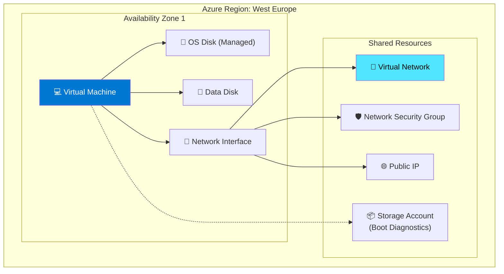
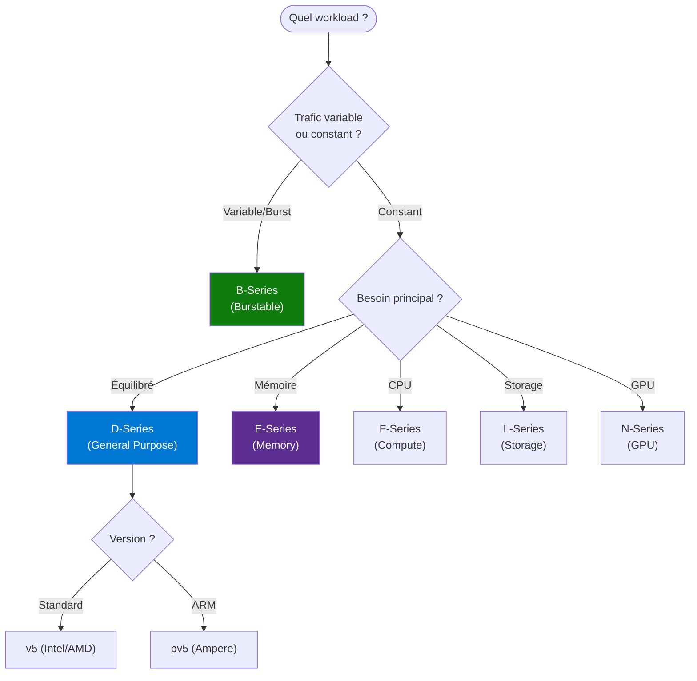
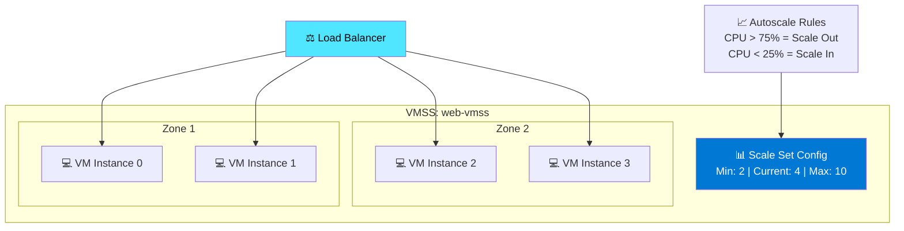
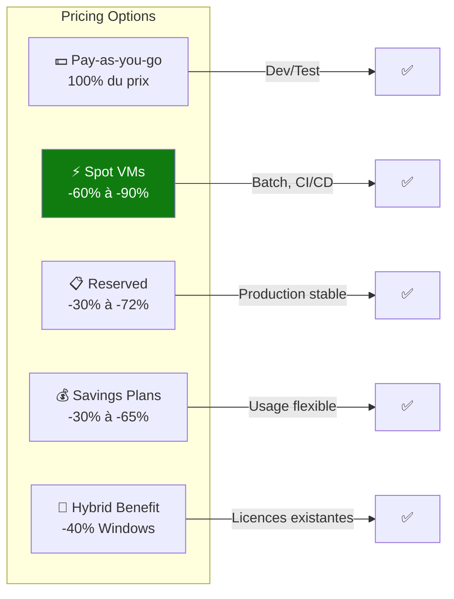

---
tags:
  - formation
  - azure
  - virtual-machines
  - compute
  - cloud
---

# Module 2 : Virtual Machines & Compute

## Objectifs du Module

À la fin de ce module, vous serez capable de :

- :fontawesome-solid-server: Créer et configurer des Virtual Machines Azure
- :fontawesome-solid-hard-drive: Gérer les disques managés (Managed Disks)
- :fontawesome-solid-image: Créer des images et utiliser Azure Compute Gallery
- :fontawesome-solid-layer-group: Configurer Virtual Machine Scale Sets (VMSS)
- :fontawesome-solid-money-bill: Optimiser les coûts (Spot, Reserved, Savings Plans)

## Prérequis

- Module 1 complété (Portail Azure, RBAC)
- Compréhension des concepts de virtualisation
- Notions de networking (IP, ports, SSH/RDP)

---

## 1. Concepts Fondamentaux

### 1.1 Architecture VM Azure



### 1.2 Familles de VMs

| Série | Type | Use Cases | Exemple |
|-------|------|-----------|---------|
| **B** | Burstable | Dev/Test, faible trafic | B2s, B4ms |
| **D** | General Purpose | Production, web apps | D4s_v5, D8s_v5 |
| **E** | Memory Optimized | Databases, caching | E4s_v5, E16s_v5 |
| **F** | Compute Optimized | Batch, gaming | F4s_v2, F16s_v2 |
| **L** | Storage Optimized | Big data, NoSQL | L8s_v3, L32s_v3 |
| **N** | GPU | ML, rendering | NC6s_v3, ND40rs_v2 |

### 1.3 Arbre de Décision



---

## 2. Créer une Virtual Machine

### 2.1 Via le Portail

1. **Create a resource** → Virtual Machine
2. **Basics** : Subscription, RG, Name, Region, Availability, Image, Size
3. **Disks** : OS disk type, Data disks
4. **Networking** : VNet, Subnet, Public IP, NSG
5. **Management** : Boot diagnostics, Auto-shutdown
6. **Advanced** : Extensions, Cloud-init
7. **Review + Create**

### 2.2 Via Azure CLI

```bash
# Créer un resource group
az group create --name vm-demo-rg --location westeurope

# Créer une VM Linux
az vm create \
    --resource-group vm-demo-rg \
    --name my-linux-vm \
    --image Ubuntu2204 \
    --size Standard_D2s_v5 \
    --admin-username azureuser \
    --generate-ssh-keys \
    --public-ip-sku Standard \
    --nsg-rule SSH \
    --os-disk-size-gb 64 \
    --storage-sku Premium_LRS \
    --tags Environment=Development Team=DevOps

# Créer une VM Windows
az vm create \
    --resource-group vm-demo-rg \
    --name my-windows-vm \
    --image Win2022Datacenter \
    --size Standard_D4s_v5 \
    --admin-username azureuser \
    --admin-password "SecurePassword123!" \
    --public-ip-sku Standard \
    --nsg-rule RDP

# Ouvrir un port
az vm open-port \
    --resource-group vm-demo-rg \
    --name my-linux-vm \
    --port 80 \
    --priority 1010

# Lister les VMs
az vm list \
    --resource-group vm-demo-rg \
    --output table

# Obtenir l'IP publique
az vm show \
    --resource-group vm-demo-rg \
    --name my-linux-vm \
    --show-details \
    --query publicIps \
    --output tsv
```

### 2.3 Cloud-Init (Linux)

```bash
# Fichier cloud-init.yaml
cat > cloud-init.yaml << 'EOF'
#cloud-config
package_update: true
package_upgrade: true

packages:
  - nginx
  - docker.io

runcmd:
  - systemctl enable nginx
  - systemctl start nginx
  - systemctl enable docker
  - usermod -aG docker azureuser

write_files:
  - path: /var/www/html/index.html
    content: |
      <!DOCTYPE html>
      <html>
      <head><title>Azure VM</title></head>
      <body><h1>Hello from Azure!</h1></body>
      </html>
EOF

# Créer la VM avec cloud-init
az vm create \
    --resource-group vm-demo-rg \
    --name web-server \
    --image Ubuntu2204 \
    --size Standard_B2s \
    --admin-username azureuser \
    --generate-ssh-keys \
    --custom-data cloud-init.yaml
```

---

## 3. Managed Disks

### 3.1 Types de Disques

| Type | IOPS max | Throughput | Use Case | Prix/GB |
|------|----------|------------|----------|---------|
| **Standard HDD** | 500 | 60 MB/s | Backup, Dev | ~$0.04 |
| **Standard SSD** | 6,000 | 750 MB/s | Web servers | ~$0.075 |
| **Premium SSD** | 20,000 | 900 MB/s | Production | ~$0.13 |
| **Premium SSD v2** | 80,000 | 1,200 MB/s | High perf DB | Variable |
| **Ultra Disk** | 160,000 | 4,000 MB/s | SAP HANA | Variable |

### 3.2 Gestion des Disques

```bash
# Créer un disque managé
az disk create \
    --resource-group vm-demo-rg \
    --name data-disk-01 \
    --size-gb 256 \
    --sku Premium_LRS \
    --location westeurope

# Attacher à une VM
az vm disk attach \
    --resource-group vm-demo-rg \
    --vm-name my-linux-vm \
    --name data-disk-01 \
    --lun 0

# Sur la VM Linux : formater et monter
# ssh azureuser@<ip>
# sudo fdisk -l
# sudo mkfs.ext4 /dev/sdc
# sudo mkdir /data
# sudo mount /dev/sdc /data
# echo "/dev/sdc /data ext4 defaults,nofail 0 2" | sudo tee -a /etc/fstab

# Étendre un disque (VM arrêtée)
az vm deallocate --resource-group vm-demo-rg --name my-linux-vm
az disk update \
    --resource-group vm-demo-rg \
    --name data-disk-01 \
    --size-gb 512
az vm start --resource-group vm-demo-rg --name my-linux-vm

# Créer un snapshot
az snapshot create \
    --resource-group vm-demo-rg \
    --name data-disk-01-snapshot \
    --source data-disk-01

# Créer un disque depuis snapshot
az disk create \
    --resource-group vm-demo-rg \
    --name data-disk-restored \
    --source data-disk-01-snapshot \
    --sku Premium_LRS
```

---

## 4. Images et Compute Gallery

### 4.1 Créer une Image Custom

```bash
# 1. Généraliser la VM source
# SSH sur la VM Linux :
# sudo waagent -deprovision+user -force
# exit

# Deallocate et generalize
az vm deallocate --resource-group vm-demo-rg --name my-linux-vm
az vm generalize --resource-group vm-demo-rg --name my-linux-vm

# 2. Créer l'image
az image create \
    --resource-group vm-demo-rg \
    --name golden-image-v1 \
    --source my-linux-vm

# 3. Créer une VM depuis l'image
az vm create \
    --resource-group vm-demo-rg \
    --name new-vm-from-image \
    --image golden-image-v1 \
    --admin-username azureuser \
    --generate-ssh-keys
```

### 4.2 Azure Compute Gallery

```bash
# Créer une gallery
az sig create \
    --resource-group vm-demo-rg \
    --gallery-name myGallery

# Créer une image definition
az sig image-definition create \
    --resource-group vm-demo-rg \
    --gallery-name myGallery \
    --gallery-image-definition ubuntu-web-server \
    --publisher MyCompany \
    --offer UbuntuServer \
    --sku 22.04-LTS-WebServer \
    --os-type Linux \
    --os-state Generalized

# Créer une image version
az sig image-version create \
    --resource-group vm-demo-rg \
    --gallery-name myGallery \
    --gallery-image-definition ubuntu-web-server \
    --gallery-image-version 1.0.0 \
    --managed-image golden-image-v1 \
    --target-regions westeurope=2 northeurope=1 \
    --replica-count 2

# Utiliser l'image de la gallery
az vm create \
    --resource-group vm-demo-rg \
    --name vm-from-gallery \
    --image "/subscriptions/xxx/resourceGroups/vm-demo-rg/providers/Microsoft.Compute/galleries/myGallery/images/ubuntu-web-server/versions/1.0.0" \
    --admin-username azureuser \
    --generate-ssh-keys
```

---

## 5. Virtual Machine Scale Sets (VMSS)

### 5.1 Architecture VMSS



### 5.2 Créer un VMSS

```bash
# Créer un VMSS avec autoscale
az vmss create \
    --resource-group vm-demo-rg \
    --name web-vmss \
    --image Ubuntu2204 \
    --vm-sku Standard_B2s \
    --instance-count 2 \
    --admin-username azureuser \
    --generate-ssh-keys \
    --load-balancer web-lb \
    --backend-pool-name web-backend \
    --upgrade-policy-mode Automatic \
    --zones 1 2 3 \
    --custom-data cloud-init.yaml

# Configurer l'autoscale
az monitor autoscale create \
    --resource-group vm-demo-rg \
    --resource web-vmss \
    --resource-type Microsoft.Compute/virtualMachineScaleSets \
    --name web-vmss-autoscale \
    --min-count 2 \
    --max-count 10 \
    --count 2

# Règle scale-out (CPU > 75%)
az monitor autoscale rule create \
    --resource-group vm-demo-rg \
    --autoscale-name web-vmss-autoscale \
    --condition "Percentage CPU > 75 avg 5m" \
    --scale out 2

# Règle scale-in (CPU < 25%)
az monitor autoscale rule create \
    --resource-group vm-demo-rg \
    --autoscale-name web-vmss-autoscale \
    --condition "Percentage CPU < 25 avg 5m" \
    --scale in 1

# Vérifier les instances
az vmss list-instances \
    --resource-group vm-demo-rg \
    --name web-vmss \
    --output table

# Scale manuel
az vmss scale \
    --resource-group vm-demo-rg \
    --name web-vmss \
    --new-capacity 5
```

---

## 6. Optimisation des Coûts

### 6.1 Options de Pricing



### 6.2 Spot VMs

```bash
# Créer une Spot VM
az vm create \
    --resource-group vm-demo-rg \
    --name spot-vm \
    --image Ubuntu2204 \
    --size Standard_D4s_v5 \
    --priority Spot \
    --eviction-policy Deallocate \
    --max-price 0.1 \
    --admin-username azureuser \
    --generate-ssh-keys

# VMSS avec Spot
az vmss create \
    --resource-group vm-demo-rg \
    --name spot-vmss \
    --image Ubuntu2204 \
    --vm-sku Standard_D2s_v5 \
    --instance-count 5 \
    --priority Spot \
    --eviction-policy Delete \
    --max-price -1 \
    --admin-username azureuser \
    --generate-ssh-keys

# Vérifier les prix Spot
az vm list-skus \
    --location westeurope \
    --size Standard_D4s_v5 \
    --output table
```

### 6.3 Auto-Shutdown

```bash
# Activer l'auto-shutdown
az vm auto-shutdown \
    --resource-group vm-demo-rg \
    --name my-linux-vm \
    --time 1900 \
    --timezone "Romance Standard Time" \
    --email "admin@contoso.com"
```

---

## 7. Exercice : À Vous de Jouer

!!! example "Mise en Pratique"
    **Objectif** : Déployer une infrastructure web scalable avec VMs et VMSS

    **Contexte** : Vous devez déployer une application web pour une startup qui anticipe une forte croissance. L'infrastructure doit être capable de gérer une charge variable et optimiser les coûts. Vous allez créer un environnement avec des VMs pour les services statiques et un VMSS pour le frontend web qui doit scale automatiquement.

    **Tâches à réaliser** :

    1. Créer une VM de bastion pour l'administration (B2s, pas d'IP publique)
    2. Créer une VM de base de données (E4s_v5 avec data disk 256GB Premium)
    3. Créer une image personnalisée avec NGINX préinstallé
    4. Déployer un VMSS de 2-10 instances derrière un Load Balancer
    5. Configurer l'autoscaling basé sur CPU (scale out à 75%, scale in à 25%)
    6. Ajouter un node pool Spot pour le traitement batch nocturne
    7. Configurer l'auto-shutdown pour toutes les VMs à 19h00
    8. Activer boot diagnostics sur toutes les ressources

    **Critères de validation** :

    - [ ] La VM bastion est accessible uniquement depuis Azure Bastion
    - [ ] La VM database a un disque data de 256GB monté sur /data
    - [ ] L'image personnalisée contient NGINX et répond sur le port 80
    - [ ] Le VMSS est déployé avec minimum 2 instances dans des zones différentes
    - [ ] Le Load Balancer distribue le trafic HTTP sur le port 80
    - [ ] L'autoscaling fonctionne (testable avec stress-ng)
    - [ ] Les VMs s'éteignent automatiquement à 19h00
    - [ ] Boot diagnostics est actif et les logs sont visibles

??? quote "Solution"

    **Étape 1 : Préparer l'environnement**

    ```bash
    # Variables
    LOCATION="westeurope"
    RG_NAME="vm-infrastructure-rg"
    VNET_NAME="infra-vnet"

    # Créer le resource group
    az group create --name $RG_NAME --location $LOCATION

    # Créer le VNet et subnets
    az network vnet create \
        --resource-group $RG_NAME \
        --name $VNET_NAME \
        --address-prefix 10.0.0.0/16 \
        --subnet-name bastion-subnet \
        --subnet-prefix 10.0.1.0/24

    az network vnet subnet create \
        --resource-group $RG_NAME \
        --vnet-name $VNET_NAME \
        --name database-subnet \
        --address-prefix 10.0.2.0/24

    az network vnet subnet create \
        --resource-group $RG_NAME \
        --vnet-name $VNET_NAME \
        --name web-subnet \
        --address-prefix 10.0.3.0/24
    ```

    **Étape 2 : Créer la VM Bastion**

    ```bash
    # VM Bastion (sans IP publique)
    az vm create \
        --resource-group $RG_NAME \
        --name bastion-vm \
        --image Ubuntu2204 \
        --size Standard_B2s \
        --vnet-name $VNET_NAME \
        --subnet bastion-subnet \
        --admin-username azureuser \
        --generate-ssh-keys \
        --public-ip-address "" \
        --nsg bastion-nsg

    # NSG pour bastion (SSH depuis Azure Bastion uniquement)
    az network nsg rule create \
        --resource-group $RG_NAME \
        --nsg-name bastion-nsg \
        --name AllowSSHFromAzureBastion \
        --priority 100 \
        --source-address-prefixes AzureBastionSubnet \
        --destination-port-ranges 22 \
        --access Allow \
        --protocol Tcp
    ```

    **Étape 3 : Créer la VM Database avec data disk**

    ```bash
    # Créer la VM database
    az vm create \
        --resource-group $RG_NAME \
        --name database-vm \
        --image Ubuntu2204 \
        --size Standard_E4s_v5 \
        --vnet-name $VNET_NAME \
        --subnet database-subnet \
        --admin-username azureuser \
        --generate-ssh-keys \
        --public-ip-address "" \
        --storage-sku Premium_LRS

    # Créer et attacher le data disk
    az vm disk attach \
        --resource-group $RG_NAME \
        --vm-name database-vm \
        --name database-data-disk \
        --new \
        --size-gb 256 \
        --sku Premium_LRS

    # Configurer auto-shutdown
    az vm auto-shutdown \
        --resource-group $RG_NAME \
        --name database-vm \
        --time 1900 \
        --timezone "Romance Standard Time"
    ```

    **Étape 4 : Créer une image personnalisée avec NGINX**

    ```bash
    # Créer une VM temporaire pour l'image
    az vm create \
        --resource-group $RG_NAME \
        --name template-vm \
        --image Ubuntu2204 \
        --size Standard_B2s \
        --admin-username azureuser \
        --generate-ssh-keys

    # Récupérer l'IP et installer NGINX
    TEMPLATE_IP=$(az vm show -g $RG_NAME -n template-vm --show-details --query publicIps -o tsv)

    # Se connecter et installer NGINX
    ssh azureuser@$TEMPLATE_IP << 'EOF'
    sudo apt-get update
    sudo apt-get install -y nginx
    sudo systemctl enable nginx
    echo "<h1>Azure VMSS - $(hostname)</h1>" | sudo tee /var/www/html/index.html
    exit
    EOF

    # Généraliser la VM
    ssh azureuser@$TEMPLATE_IP "sudo waagent -deprovision+user -force"
    az vm deallocate --resource-group $RG_NAME --name template-vm
    az vm generalize --resource-group $RG_NAME --name template-vm

    # Créer l'image
    az image create \
        --resource-group $RG_NAME \
        --name nginx-web-image \
        --source template-vm

    # Supprimer la VM template
    az vm delete --resource-group $RG_NAME --name template-vm --yes
    ```

    **Étape 5 : Créer le Load Balancer**

    ```bash
    # IP publique pour le Load Balancer
    az network public-ip create \
        --resource-group $RG_NAME \
        --name web-lb-pip \
        --sku Standard \
        --allocation-method Static

    # Load Balancer
    az network lb create \
        --resource-group $RG_NAME \
        --name web-lb \
        --sku Standard \
        --public-ip-address web-lb-pip \
        --frontend-ip-name web-frontend \
        --backend-pool-name web-backend

    # Health probe
    az network lb probe create \
        --resource-group $RG_NAME \
        --lb-name web-lb \
        --name http-probe \
        --protocol Http \
        --port 80 \
        --path /

    # Load balancing rule
    az network lb rule create \
        --resource-group $RG_NAME \
        --lb-name web-lb \
        --name http-rule \
        --protocol Tcp \
        --frontend-port 80 \
        --backend-port 80 \
        --frontend-ip-name web-frontend \
        --backend-pool-name web-backend \
        --probe-name http-probe
    ```

    **Étape 6 : Déployer le VMSS avec autoscaling**

    ```bash
    # Créer le VMSS
    az vmss create \
        --resource-group $RG_NAME \
        --name web-vmss \
        --image nginx-web-image \
        --vm-sku Standard_B2s \
        --instance-count 2 \
        --admin-username azureuser \
        --generate-ssh-keys \
        --vnet-name $VNET_NAME \
        --subnet web-subnet \
        --lb web-lb \
        --backend-pool-name web-backend \
        --upgrade-policy-mode Automatic \
        --zones 1 2 3

    # Configurer l'autoscaling
    az monitor autoscale create \
        --resource-group $RG_NAME \
        --resource web-vmss \
        --resource-type Microsoft.Compute/virtualMachineScaleSets \
        --name web-vmss-autoscale \
        --min-count 2 \
        --max-count 10 \
        --count 2

    # Règle scale-out (CPU > 75%)
    az monitor autoscale rule create \
        --resource-group $RG_NAME \
        --autoscale-name web-vmss-autoscale \
        --condition "Percentage CPU > 75 avg 5m" \
        --scale out 2

    # Règle scale-in (CPU < 25%)
    az monitor autoscale rule create \
        --resource-group $RG_NAME \
        --autoscale-name web-vmss-autoscale \
        --condition "Percentage CPU < 25 avg 5m" \
        --scale in 1
    ```

    **Étape 7 : Ajouter un node pool Spot pour batch**

    ```bash
    # Créer un VMSS Spot séparé pour batch
    az vmss create \
        --resource-group $RG_NAME \
        --name batch-vmss-spot \
        --image Ubuntu2204 \
        --vm-sku Standard_D4s_v5 \
        --instance-count 0 \
        --priority Spot \
        --eviction-policy Deallocate \
        --max-price -1 \
        --admin-username azureuser \
        --generate-ssh-keys \
        --vnet-name $VNET_NAME \
        --subnet web-subnet

    # Configurer autoscale pour batch (actif la nuit)
    az monitor autoscale create \
        --resource-group $RG_NAME \
        --resource batch-vmss-spot \
        --resource-type Microsoft.Compute/virtualMachineScaleSets \
        --name batch-autoscale \
        --min-count 0 \
        --max-count 10 \
        --count 0
    ```

    **Étape 8 : Activer boot diagnostics**

    ```bash
    # Créer un storage account pour diagnostics
    DIAG_STORAGE="diagstorage$(openssl rand -hex 4)"
    az storage account create \
        --resource-group $RG_NAME \
        --name $DIAG_STORAGE \
        --sku Standard_LRS

    # Activer boot diagnostics sur la VM database
    az vm boot-diagnostics enable \
        --resource-group $RG_NAME \
        --name database-vm \
        --storage $DIAG_STORAGE

    # Pour le VMSS
    az vmss diagnostics set \
        --resource-group $RG_NAME \
        --vmss-name web-vmss \
        --settings "{\"storageAccount\":\"$DIAG_STORAGE\"}"
    ```

    **Validation**

    ```bash
    # Tester le Load Balancer
    LB_IP=$(az network public-ip show -g $RG_NAME -n web-lb-pip --query ipAddress -o tsv)
    echo "Load Balancer IP: $LB_IP"
    curl http://$LB_IP

    # Vérifier les instances VMSS
    az vmss list-instances \
        --resource-group $RG_NAME \
        --name web-vmss \
        --output table

    # Tester l'autoscaling (générer de la charge)
    # Se connecter à une instance et lancer stress-ng
    az vmss list-instance-connection-info \
        --resource-group $RG_NAME \
        --name web-vmss

    # Observer le scaling
    watch -n 10 "az vmss list-instances -g $RG_NAME -n web-vmss --output table"
    ```

---

## 8. Exercices Pratiques Additionnels

### Exercice 1 : Déployer un Web Server

!!! example "Objectif"
    Déployer un serveur web NGINX avec cloud-init et IP publique.

??? quote "Solution"

    ```bash
    # Cloud-init
    cat > web-init.yaml << 'EOF'
    #cloud-config
    package_update: true
    packages:
      - nginx
    runcmd:
      - systemctl enable nginx
      - systemctl start nginx
      - echo "<h1>Hello from $(hostname)</h1>" > /var/www/html/index.html
    EOF

    # Créer la VM
    az vm create \
        --resource-group vm-demo-rg \
        --name web-server \
        --image Ubuntu2204 \
        --size Standard_B2s \
        --admin-username azureuser \
        --generate-ssh-keys \
        --custom-data web-init.yaml \
        --public-ip-sku Standard

    # Ouvrir le port 80
    az vm open-port \
        --resource-group vm-demo-rg \
        --name web-server \
        --port 80

    # Tester
    IP=$(az vm show -g vm-demo-rg -n web-server --show-details --query publicIps -o tsv)
    curl http://$IP
    ```

### Exercice 2 : VMSS avec Autoscale

!!! example "Objectif"
    Créer un VMSS qui scale automatiquement basé sur le CPU.

??? quote "Solution"

    Voir section 5.2 pour la solution complète.

---

## 8. Résumé

| Concept | Description | Commande clé |
|---------|-------------|--------------|
| **VM** | Machine virtuelle | `az vm create` |
| **Managed Disk** | Stockage persistant | `az disk create` |
| **Image** | Template de VM | `az image create` |
| **Compute Gallery** | Registry d'images | `az sig create` |
| **VMSS** | Scale Set | `az vmss create` |
| **Spot VM** | VM à prix réduit | `--priority Spot` |

---

## Navigation

| Précédent | Suivant |
|-----------|---------|
| [← Module 1 : Portail & IAM](01-module.md) | [Module 3 : Virtual Network →](03-module.md) |
