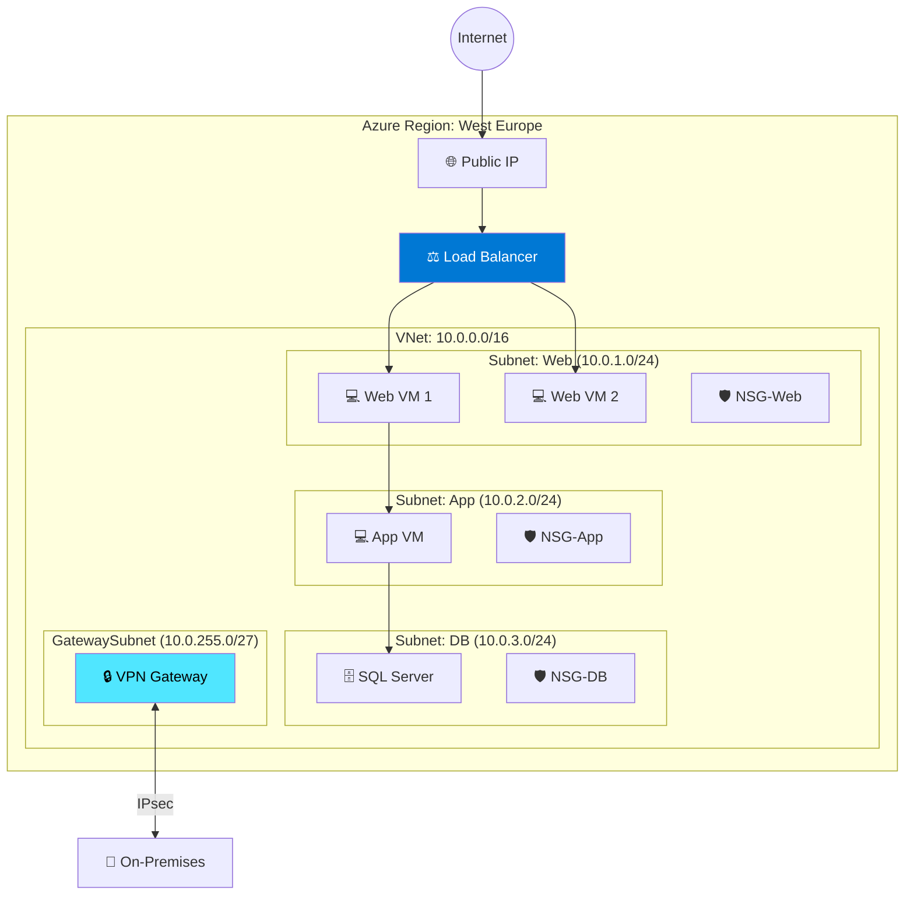
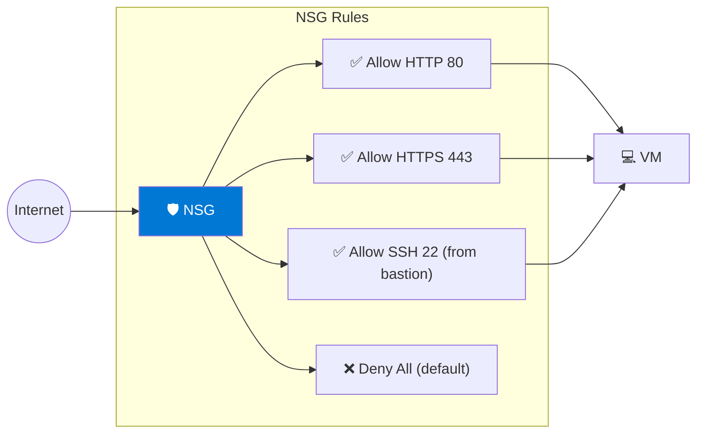

---
tags:
  - formation
  - azure
  - virtual-network
  - networking
  - cloud
---

# Module 3 : Virtual Network & Networking

## Objectifs du Module

À la fin de ce module, vous serez capable de :

- :fontawesome-solid-network-wired: Créer et configurer des Virtual Networks (VNet)
- :fontawesome-solid-shield-halved: Configurer les Network Security Groups (NSG)
- :fontawesome-solid-route: Gérer le routage et les passerelles
- :fontawesome-solid-link: Implémenter VNet Peering et VPN Gateway
- :fontawesome-solid-balance-scale: Configurer Azure Load Balancer et Application Gateway

---

## 1. Concepts Fondamentaux VNet

### 1.1 Architecture VNet



### 1.2 Composants Clés

| Composant | Description | Scope |
|-----------|-------------|-------|
| **VNet** | Réseau virtuel isolé | Région |
| **Subnet** | Segment réseau | VNet |
| **NSG** | Firewall stateful | Subnet/NIC |
| **Route Table** | Règles de routage | Subnet |
| **NAT Gateway** | Accès sortant | Subnet |
| **VNet Peering** | Connexion inter-VNet | Global |
| **VPN Gateway** | VPN site-to-site | VNet |
| **Private Endpoint** | Accès privé aux services | Subnet |

---

## 2. Créer un Virtual Network

### 2.1 Via Azure CLI

```bash
# Créer un resource group
az group create --name network-rg --location westeurope

# Créer un VNet avec subnets
az network vnet create \
    --resource-group network-rg \
    --name prod-vnet \
    --address-prefix 10.0.0.0/16 \
    --subnet-name web-subnet \
    --subnet-prefix 10.0.1.0/24 \
    --location westeurope

# Ajouter des subnets supplémentaires
az network vnet subnet create \
    --resource-group network-rg \
    --vnet-name prod-vnet \
    --name app-subnet \
    --address-prefix 10.0.2.0/24

az network vnet subnet create \
    --resource-group network-rg \
    --vnet-name prod-vnet \
    --name db-subnet \
    --address-prefix 10.0.3.0/24

# Subnet pour Gateway (obligatoire: GatewaySubnet)
az network vnet subnet create \
    --resource-group network-rg \
    --vnet-name prod-vnet \
    --name GatewaySubnet \
    --address-prefix 10.0.255.0/27

# Lister les subnets
az network vnet subnet list \
    --resource-group network-rg \
    --vnet-name prod-vnet \
    --output table
```

---

## 3. Network Security Groups

### 3.1 Concept NSG



### 3.2 Créer et Configurer un NSG

```bash
# Créer un NSG
az network nsg create \
    --resource-group network-rg \
    --name web-nsg

# Autoriser HTTP
az network nsg rule create \
    --resource-group network-rg \
    --nsg-name web-nsg \
    --name Allow-HTTP \
    --priority 100 \
    --direction Inbound \
    --access Allow \
    --protocol Tcp \
    --destination-port-ranges 80

# Autoriser HTTPS
az network nsg rule create \
    --resource-group network-rg \
    --nsg-name web-nsg \
    --name Allow-HTTPS \
    --priority 110 \
    --direction Inbound \
    --access Allow \
    --protocol Tcp \
    --destination-port-ranges 443

# Autoriser SSH depuis un range spécifique
az network nsg rule create \
    --resource-group network-rg \
    --nsg-name web-nsg \
    --name Allow-SSH-Bastion \
    --priority 120 \
    --direction Inbound \
    --access Allow \
    --protocol Tcp \
    --source-address-prefixes 10.0.10.0/24 \
    --destination-port-ranges 22

# Associer le NSG au subnet
az network vnet subnet update \
    --resource-group network-rg \
    --vnet-name prod-vnet \
    --name web-subnet \
    --network-security-group web-nsg

# Lister les règles
az network nsg rule list \
    --resource-group network-rg \
    --nsg-name web-nsg \
    --output table
```

### 3.3 Application Security Groups (ASG)

```bash
# Créer des ASG
az network asg create \
    --resource-group network-rg \
    --name web-servers-asg

az network asg create \
    --resource-group network-rg \
    --name db-servers-asg

# Règle NSG utilisant des ASG
az network nsg rule create \
    --resource-group network-rg \
    --nsg-name app-nsg \
    --name Allow-Web-to-DB \
    --priority 100 \
    --direction Inbound \
    --access Allow \
    --protocol Tcp \
    --source-asgs web-servers-asg \
    --destination-asgs db-servers-asg \
    --destination-port-ranges 1433
```

---

## 4. Load Balancing

### 4.1 Azure Load Balancer (Layer 4)

```bash
# Créer une IP publique pour le LB
az network public-ip create \
    --resource-group network-rg \
    --name lb-public-ip \
    --sku Standard \
    --allocation-method Static

# Créer le Load Balancer
az network lb create \
    --resource-group network-rg \
    --name web-lb \
    --sku Standard \
    --public-ip-address lb-public-ip \
    --frontend-ip-name lb-frontend \
    --backend-pool-name web-backend

# Health probe
az network lb probe create \
    --resource-group network-rg \
    --lb-name web-lb \
    --name http-probe \
    --protocol Http \
    --port 80 \
    --path /health

# Load balancing rule
az network lb rule create \
    --resource-group network-rg \
    --lb-name web-lb \
    --name http-rule \
    --protocol Tcp \
    --frontend-port 80 \
    --backend-port 80 \
    --frontend-ip-name lb-frontend \
    --backend-pool-name web-backend \
    --probe-name http-probe \
    --idle-timeout 15

# Ajouter des VMs au backend pool
az network nic ip-config address-pool add \
    --resource-group network-rg \
    --nic-name vm1-nic \
    --ip-config-name ipconfig1 \
    --lb-name web-lb \
    --address-pool web-backend
```

### 4.2 Application Gateway (Layer 7)

```bash
# Créer l'Application Gateway
az network application-gateway create \
    --resource-group network-rg \
    --name app-gateway \
    --location westeurope \
    --sku Standard_v2 \
    --capacity 2 \
    --vnet-name prod-vnet \
    --subnet appgw-subnet \
    --public-ip-address appgw-pip \
    --frontend-port 443 \
    --http-settings-cookie-based-affinity Disabled \
    --http-settings-port 80 \
    --http-settings-protocol Http

# Ajouter un backend pool
az network application-gateway address-pool create \
    --resource-group network-rg \
    --gateway-name app-gateway \
    --name web-pool \
    --servers 10.0.1.4 10.0.1.5

# Ajouter un certificat SSL
az network application-gateway ssl-cert create \
    --resource-group network-rg \
    --gateway-name app-gateway \
    --name ssl-cert \
    --cert-file cert.pfx \
    --cert-password "password"

# Routing rule
az network application-gateway rule create \
    --resource-group network-rg \
    --gateway-name app-gateway \
    --name https-rule \
    --http-listener https-listener \
    --address-pool web-pool \
    --http-settings web-settings
```

---

## 5. Connectivité Hybride

### 5.1 VNet Peering

```bash
# Peering VNet A → VNet B
az network vnet peering create \
    --resource-group network-rg \
    --name vnetA-to-vnetB \
    --vnet-name vnetA \
    --remote-vnet /subscriptions/xxx/resourceGroups/rg-b/providers/Microsoft.Network/virtualNetworks/vnetB \
    --allow-vnet-access \
    --allow-forwarded-traffic

# Peering VNet B → VNet A (bidirectionnel)
az network vnet peering create \
    --resource-group network-rg-b \
    --name vnetB-to-vnetA \
    --vnet-name vnetB \
    --remote-vnet /subscriptions/xxx/resourceGroups/network-rg/providers/Microsoft.Network/virtualNetworks/vnetA \
    --allow-vnet-access \
    --allow-forwarded-traffic

# Vérifier le statut
az network vnet peering show \
    --resource-group network-rg \
    --vnet-name vnetA \
    --name vnetA-to-vnetB \
    --query peeringState
```

### 5.2 VPN Gateway

```bash
# Créer une IP publique pour le VPN Gateway
az network public-ip create \
    --resource-group network-rg \
    --name vpn-gw-pip \
    --allocation-method Static \
    --sku Standard

# Créer le VPN Gateway (prend ~45 min)
az network vnet-gateway create \
    --resource-group network-rg \
    --name vpn-gateway \
    --vnet prod-vnet \
    --public-ip-addresses vpn-gw-pip \
    --gateway-type Vpn \
    --vpn-type RouteBased \
    --sku VpnGw2 \
    --generation Generation2

# Créer le Local Network Gateway (représente votre on-premises)
az network local-gateway create \
    --resource-group network-rg \
    --name onprem-gateway \
    --gateway-ip-address 203.0.113.50 \
    --local-address-prefixes 192.168.0.0/16

# Créer la connexion VPN
az network vpn-connection create \
    --resource-group network-rg \
    --name azure-to-onprem \
    --vnet-gateway1 vpn-gateway \
    --local-gateway2 onprem-gateway \
    --shared-key "SuperSecretPSK123!"
```

---

## 6. Private Endpoints

```bash
# Créer un Private Endpoint pour un Storage Account
az network private-endpoint create \
    --resource-group network-rg \
    --name storage-private-endpoint \
    --vnet-name prod-vnet \
    --subnet app-subnet \
    --private-connection-resource-id /subscriptions/xxx/resourceGroups/rg/providers/Microsoft.Storage/storageAccounts/mystorageaccount \
    --group-id blob \
    --connection-name storage-connection

# Créer une Private DNS Zone
az network private-dns zone create \
    --resource-group network-rg \
    --name privatelink.blob.core.windows.net

# Lier au VNet
az network private-dns link vnet create \
    --resource-group network-rg \
    --zone-name privatelink.blob.core.windows.net \
    --name storage-dns-link \
    --virtual-network prod-vnet \
    --registration-enabled false

# Créer le DNS record
az network private-endpoint dns-zone-group create \
    --resource-group network-rg \
    --endpoint-name storage-private-endpoint \
    --name storage-dns-group \
    --private-dns-zone privatelink.blob.core.windows.net \
    --zone-name privatelink.blob.core.windows.net
```

---

## 7. Exercice : À Vous de Jouer

!!! example "Mise en Pratique"
    **Objectif** : Déployer une architecture réseau complète 3-tier avec Load Balancer et VPN Gateway

    **Contexte** : Vous êtes architecte réseau pour une entreprise qui migre vers Azure. Vous devez créer une architecture 3-tier sécurisée (Web, Application, Database) avec un Load Balancer pour la haute disponibilité et une connexion VPN vers le datacenter on-premise. L'architecture doit respecter le principe du moindre privilège réseau.

    **Tâches à réaliser** :

    1. Créer un VNet avec 4 subnets (Web, App, Database, Gateway)
    2. Créer des NSG pour chaque tier avec les règles appropriées
    3. Créer des Application Security Groups (ASG) pour faciliter la gestion
    4. Déployer un Azure Load Balancer Standard avec 2 VMs web
    5. Configurer un VNet Peering vers un second VNet (simulation multi-region)
    6. Déployer un Private Endpoint pour un Storage Account
    7. Créer un VPN Gateway pour la connexion on-premise
    8. Configurer une Route Table personnalisée pour forcer le trafic sortant

    **Critères de validation** :

    - [ ] Le VNet est créé avec les 4 subnets et les ranges IP appropriés
    - [ ] Les NSG autorisent uniquement les flux nécessaires (Web→Internet, App→Web, DB→App)
    - [ ] Les ASG sont correctement associés aux NICs des VMs
    - [ ] Le Load Balancer distribue le trafic HTTP sur les VMs web
    - [ ] Le VNet Peering est établi et fonctionnel (ping entre VNets)
    - [ ] Le Storage Account est accessible uniquement via Private Endpoint
    - [ ] Le VPN Gateway est créé (même si non connecté)
    - [ ] La Route Table force le trafic sortant via une appliance virtuelle

??? quote "Solution"

    **Étape 1 : Créer le VNet et les subnets**

    ```bash
    # Variables
    LOCATION="westeurope"
    RG_NAME="network-3tier-rg"
    VNET_NAME="enterprise-vnet"

    # Créer le resource group
    az group create --name $RG_NAME --location $LOCATION

    # Créer le VNet
    az network vnet create \
        --resource-group $RG_NAME \
        --name $VNET_NAME \
        --address-prefix 10.0.0.0/16 \
        --location $LOCATION

    # Créer les subnets
    az network vnet subnet create \
        --resource-group $RG_NAME \
        --vnet-name $VNET_NAME \
        --name web-subnet \
        --address-prefix 10.0.1.0/24

    az network vnet subnet create \
        --resource-group $RG_NAME \
        --vnet-name $VNET_NAME \
        --name app-subnet \
        --address-prefix 10.0.2.0/24

    az network vnet subnet create \
        --resource-group $RG_NAME \
        --vnet-name $VNET_NAME \
        --name database-subnet \
        --address-prefix 10.0.3.0/24

    az network vnet subnet create \
        --resource-group $RG_NAME \
        --vnet-name $VNET_NAME \
        --name GatewaySubnet \
        --address-prefix 10.0.255.0/27
    ```

    **Étape 2 : Créer les NSG avec règles de sécurité**

    ```bash
    # NSG pour le tier Web
    az network nsg create \
        --resource-group $RG_NAME \
        --name web-nsg

    az network nsg rule create \
        --resource-group $RG_NAME \
        --nsg-name web-nsg \
        --name Allow-HTTP-Internet \
        --priority 100 \
        --direction Inbound \
        --access Allow \
        --protocol Tcp \
        --source-address-prefixes Internet \
        --destination-port-ranges 80 443

    az network nsg rule create \
        --resource-group $RG_NAME \
        --nsg-name web-nsg \
        --name Allow-SSH-Management \
        --priority 110 \
        --direction Inbound \
        --access Allow \
        --protocol Tcp \
        --source-address-prefixes 10.0.254.0/24 \
        --destination-port-ranges 22

    # NSG pour le tier App
    az network nsg create \
        --resource-group $RG_NAME \
        --name app-nsg

    az network nsg rule create \
        --resource-group $RG_NAME \
        --nsg-name app-nsg \
        --name Allow-From-Web \
        --priority 100 \
        --direction Inbound \
        --access Allow \
        --protocol Tcp \
        --source-address-prefixes 10.0.1.0/24 \
        --destination-port-ranges 8080

    # NSG pour le tier Database
    az network nsg create \
        --resource-group $RG_NAME \
        --name database-nsg

    az network nsg rule create \
        --resource-group $RG_NAME \
        --nsg-name database-nsg \
        --name Allow-From-App \
        --priority 100 \
        --direction Inbound \
        --access Allow \
        --protocol Tcp \
        --source-address-prefixes 10.0.2.0/24 \
        --destination-port-ranges 5432

    # Associer les NSG aux subnets
    az network vnet subnet update \
        --resource-group $RG_NAME \
        --vnet-name $VNET_NAME \
        --name web-subnet \
        --network-security-group web-nsg

    az network vnet subnet update \
        --resource-group $RG_NAME \
        --vnet-name $VNET_NAME \
        --name app-subnet \
        --network-security-group app-nsg

    az network vnet subnet update \
        --resource-group $RG_NAME \
        --vnet-name $VNET_NAME \
        --name database-subnet \
        --network-security-group database-nsg
    ```

    **Étape 3 : Créer les Application Security Groups**

    ```bash
    # Créer les ASG
    az network asg create \
        --resource-group $RG_NAME \
        --name web-servers-asg \
        --location $LOCATION

    az network asg create \
        --resource-group $RG_NAME \
        --name app-servers-asg \
        --location $LOCATION

    az network asg create \
        --resource-group $RG_NAME \
        --name db-servers-asg \
        --location $LOCATION

    # Ajouter une règle NSG utilisant les ASG
    az network nsg rule create \
        --resource-group $RG_NAME \
        --nsg-name app-nsg \
        --name Allow-Web-to-App-ASG \
        --priority 110 \
        --direction Inbound \
        --access Allow \
        --protocol Tcp \
        --source-asgs web-servers-asg \
        --destination-asgs app-servers-asg \
        --destination-port-ranges 8080
    ```

    **Étape 4 : Déployer le Load Balancer avec VMs**

    ```bash
    # Créer l'IP publique
    az network public-ip create \
        --resource-group $RG_NAME \
        --name web-lb-pip \
        --sku Standard \
        --allocation-method Static

    # Créer le Load Balancer
    az network lb create \
        --resource-group $RG_NAME \
        --name web-lb \
        --sku Standard \
        --public-ip-address web-lb-pip \
        --frontend-ip-name web-frontend \
        --backend-pool-name web-backend

    # Health probe
    az network lb probe create \
        --resource-group $RG_NAME \
        --lb-name web-lb \
        --name http-probe \
        --protocol Http \
        --port 80 \
        --path /health

    # Load balancing rule
    az network lb rule create \
        --resource-group $RG_NAME \
        --lb-name web-lb \
        --name http-rule \
        --protocol Tcp \
        --frontend-port 80 \
        --backend-port 80 \
        --frontend-ip-name web-frontend \
        --backend-pool-name web-backend \
        --probe-name http-probe

    # Créer 2 VMs web
    for i in 1 2; do
        az vm create \
            --resource-group $RG_NAME \
            --name web-vm-${i} \
            --image Ubuntu2204 \
            --size Standard_B2s \
            --vnet-name $VNET_NAME \
            --subnet web-subnet \
            --nsg "" \
            --public-ip-address "" \
            --admin-username azureuser \
            --generate-ssh-keys

        # Associer au backend pool du LB
        NIC_ID=$(az vm show -g $RG_NAME -n web-vm-${i} --query 'networkProfile.networkInterfaces[0].id' -o tsv)
        NIC_NAME=$(basename $NIC_ID)

        az network nic ip-config address-pool add \
            --resource-group $RG_NAME \
            --nic-name $NIC_NAME \
            --ip-config-name ipconfig1 \
            --lb-name web-lb \
            --address-pool web-backend

        # Associer l'ASG
        az network nic ip-config update \
            --resource-group $RG_NAME \
            --nic-name $NIC_NAME \
            --name ipconfig1 \
            --application-security-groups web-servers-asg
    done
    ```

    **Étape 5 : Créer un VNet Peering**

    ```bash
    # Créer un second VNet (simulation autre région)
    az network vnet create \
        --resource-group $RG_NAME \
        --name secondary-vnet \
        --address-prefix 10.1.0.0/16 \
        --subnet-name default \
        --subnet-prefix 10.1.0.0/24

    # Créer le peering bidirectionnel
    az network vnet peering create \
        --resource-group $RG_NAME \
        --name enterprise-to-secondary \
        --vnet-name $VNET_NAME \
        --remote-vnet secondary-vnet \
        --allow-vnet-access \
        --allow-forwarded-traffic

    az network vnet peering create \
        --resource-group $RG_NAME \
        --name secondary-to-enterprise \
        --vnet-name secondary-vnet \
        --remote-vnet $VNET_NAME \
        --allow-vnet-access \
        --allow-forwarded-traffic
    ```

    **Étape 6 : Créer un Private Endpoint pour Storage**

    ```bash
    # Créer un Storage Account
    STORAGE_NAME="stprivate$(openssl rand -hex 4)"
    az storage account create \
        --resource-group $RG_NAME \
        --name $STORAGE_NAME \
        --sku Standard_LRS \
        --allow-blob-public-access false \
        --public-network-access Disabled

    # Créer le subnet pour private endpoints
    az network vnet subnet create \
        --resource-group $RG_NAME \
        --vnet-name $VNET_NAME \
        --name private-endpoints-subnet \
        --address-prefix 10.0.4.0/24 \
        --disable-private-endpoint-network-policies true

    # Créer le Private Endpoint
    STORAGE_ID=$(az storage account show -g $RG_NAME -n $STORAGE_NAME --query id -o tsv)

    az network private-endpoint create \
        --resource-group $RG_NAME \
        --name storage-private-endpoint \
        --vnet-name $VNET_NAME \
        --subnet private-endpoints-subnet \
        --private-connection-resource-id $STORAGE_ID \
        --group-id blob \
        --connection-name storage-connection

    # Créer la Private DNS Zone
    az network private-dns zone create \
        --resource-group $RG_NAME \
        --name privatelink.blob.core.windows.net

    az network private-dns link vnet create \
        --resource-group $RG_NAME \
        --zone-name privatelink.blob.core.windows.net \
        --name storage-dns-link \
        --virtual-network $VNET_NAME \
        --registration-enabled false

    az network private-endpoint dns-zone-group create \
        --resource-group $RG_NAME \
        --endpoint-name storage-private-endpoint \
        --name storage-dns-group \
        --private-dns-zone privatelink.blob.core.windows.net \
        --zone-name privatelink.blob.core.windows.net
    ```

    **Étape 7 : Créer le VPN Gateway**

    ```bash
    # Créer l'IP publique pour le VPN Gateway
    az network public-ip create \
        --resource-group $RG_NAME \
        --name vpn-gw-pip \
        --allocation-method Static \
        --sku Standard

    # Créer le VPN Gateway (cette commande prend environ 45 minutes)
    echo "Création du VPN Gateway (environ 45 min)..."
    az network vnet-gateway create \
        --resource-group $RG_NAME \
        --name enterprise-vpn-gw \
        --vnet $VNET_NAME \
        --public-ip-addresses vpn-gw-pip \
        --gateway-type Vpn \
        --vpn-type RouteBased \
        --sku VpnGw1 \
        --generation Generation1 \
        --no-wait
    ```

    **Étape 8 : Créer une Route Table**

    ```bash
    # Créer la Route Table
    az network route-table create \
        --resource-group $RG_NAME \
        --name app-route-table

    # Ajouter une route pour forcer le trafic sortant vers une appliance
    az network route-table route create \
        --resource-group $RG_NAME \
        --route-table-name app-route-table \
        --name to-internet-via-firewall \
        --address-prefix 0.0.0.0/0 \
        --next-hop-type VirtualAppliance \
        --next-hop-ip-address 10.0.254.4

    # Associer la route table au subnet app
    az network vnet subnet update \
        --resource-group $RG_NAME \
        --vnet-name $VNET_NAME \
        --name app-subnet \
        --route-table app-route-table
    ```

    **Validation**

    ```bash
    # Vérifier le Load Balancer
    LB_IP=$(az network public-ip show -g $RG_NAME -n web-lb-pip --query ipAddress -o tsv)
    echo "Load Balancer IP: http://$LB_IP"

    # Vérifier le VNet Peering
    az network vnet peering show \
        --resource-group $RG_NAME \
        --vnet-name $VNET_NAME \
        --name enterprise-to-secondary \
        --query peeringState

    # Vérifier le Private Endpoint
    az network private-endpoint show \
        --resource-group $RG_NAME \
        --name storage-private-endpoint \
        --query 'customDnsConfigs[0].fqdn'

    # Lister toutes les ressources réseau
    echo "=== NSGs ==="
    az network nsg list -g $RG_NAME --output table

    echo "=== Subnets ==="
    az network vnet subnet list -g $RG_NAME --vnet-name $VNET_NAME --output table

    echo "=== Route Tables ==="
    az network route-table list -g $RG_NAME --output table
    ```

---

## 8. Exercices Pratiques Additionnels

### Exercice 1 : Architecture 3-Tier

!!! example "Objectif"
    Créer un VNet avec 3 subnets (Web, App, DB) et les NSG appropriés.

??? quote "Solution"

    ```bash
    # Créer le VNet et subnets
    az network vnet create \
        --resource-group network-rg \
        --name three-tier-vnet \
        --address-prefix 10.0.0.0/16

    for tier in web app db; do
        case $tier in
            web) prefix="10.0.1.0/24" ;;
            app) prefix="10.0.2.0/24" ;;
            db)  prefix="10.0.3.0/24" ;;
        esac

        az network vnet subnet create \
            --resource-group network-rg \
            --vnet-name three-tier-vnet \
            --name ${tier}-subnet \
            --address-prefix $prefix

        az network nsg create \
            --resource-group network-rg \
            --name ${tier}-nsg

        az network vnet subnet update \
            --resource-group network-rg \
            --vnet-name three-tier-vnet \
            --name ${tier}-subnet \
            --network-security-group ${tier}-nsg
    done

    # NSG Rules
    # Web: Allow HTTP/HTTPS from Internet
    az network nsg rule create -g network-rg --nsg-name web-nsg -n AllowHTTP --priority 100 --destination-port-ranges 80 443 --access Allow --protocol Tcp

    # App: Allow from Web subnet only
    az network nsg rule create -g network-rg --nsg-name app-nsg -n AllowFromWeb --priority 100 --source-address-prefixes 10.0.1.0/24 --destination-port-ranges 8080 --access Allow --protocol Tcp

    # DB: Allow from App subnet only
    az network nsg rule create -g network-rg --nsg-name db-nsg -n AllowFromApp --priority 100 --source-address-prefixes 10.0.2.0/24 --destination-port-ranges 1433 --access Allow --protocol Tcp
    ```

---

## 8. Résumé

| Composant | Description | Commande clé |
|-----------|-------------|--------------|
| **VNet** | Réseau virtuel | `az network vnet create` |
| **Subnet** | Segment réseau | `az network vnet subnet create` |
| **NSG** | Firewall L4 | `az network nsg create` |
| **Load Balancer** | LB Layer 4 | `az network lb create` |
| **App Gateway** | LB Layer 7/WAF | `az network application-gateway create` |
| **VNet Peering** | Connexion VNets | `az network vnet peering create` |
| **VPN Gateway** | VPN site-to-site | `az network vnet-gateway create` |
| **Private Endpoint** | Accès privé PaaS | `az network private-endpoint create` |

---

## Navigation

| Précédent | Suivant |
|-----------|---------|
| [← Module 2 : VMs & Compute](02-module.md) | [Module 4 : Storage & Databases →](04-module.md) |
