---
tags:
  - formation
  - azure
  - virtual-network
  - networking
  - cloud
---

# Module 3 : Virtual Network & Networking

## Objectifs du Module

À la fin de ce module, vous serez capable de :

- :fontawesome-solid-network-wired: Créer et configurer des Virtual Networks (VNet)
- :fontawesome-solid-shield-halved: Configurer les Network Security Groups (NSG)
- :fontawesome-solid-route: Gérer le routage et les passerelles
- :fontawesome-solid-link: Implémenter VNet Peering et VPN Gateway
- :fontawesome-solid-balance-scale: Configurer Azure Load Balancer et Application Gateway

---

## 1. Concepts Fondamentaux VNet

### 1.1 Architecture VNet

```mermaid
graph TB
    subgraph "Azure Region: West Europe"
        subgraph "VNet: 10.0.0.0/16"
            subgraph "Subnet: Web (10.0.1.0/24)"
                VM_WEB1["💻 Web VM 1"]
                VM_WEB2["💻 Web VM 2"]
                NSG_WEB["🛡️ NSG-Web"]
            end

            subgraph "Subnet: App (10.0.2.0/24)"
                VM_APP["💻 App VM"]
                NSG_APP["🛡️ NSG-App"]
            end

            subgraph "Subnet: DB (10.0.3.0/24)"
                VM_DB["🗄️ SQL Server"]
                NSG_DB["🛡️ NSG-DB"]
            end

            subgraph "GatewaySubnet (10.0.255.0/27)"
                VPN_GW["🔒 VPN Gateway"]
            end
        end

        LB["⚖️ Load Balancer"]
        PIP["🌐 Public IP"]
    end

    INTERNET((Internet)) --> PIP
    PIP --> LB
    LB --> VM_WEB1
    LB --> VM_WEB2
    VM_WEB1 --> VM_APP
    VM_APP --> VM_DB
    VPN_GW <-->|IPsec| ONPREM["🏢 On-Premises"]

    style LB fill:#0078d4,color:#fff
    style VPN_GW fill:#50e6ff,color:#000
```



### 1.2 Composants Clés

| Composant | Description | Scope |
|-----------|-------------|-------|
| **VNet** | Réseau virtuel isolé | Région |
| **Subnet** | Segment réseau | VNet |
| **NSG** | Firewall stateful | Subnet/NIC |
| **Route Table** | Règles de routage | Subnet |
| **NAT Gateway** | Accès sortant | Subnet |
| **VNet Peering** | Connexion inter-VNet | Global |
| **VPN Gateway** | VPN site-to-site | VNet |
| **Private Endpoint** | Accès privé aux services | Subnet |

---

## 2. Créer un Virtual Network

### 2.1 Via Azure CLI

```bash
# Créer un resource group
az group create --name network-rg --location westeurope

# Créer un VNet avec subnets
az network vnet create \
    --resource-group network-rg \
    --name prod-vnet \
    --address-prefix 10.0.0.0/16 \
    --subnet-name web-subnet \
    --subnet-prefix 10.0.1.0/24 \
    --location westeurope

# Ajouter des subnets supplémentaires
az network vnet subnet create \
    --resource-group network-rg \
    --vnet-name prod-vnet \
    --name app-subnet \
    --address-prefix 10.0.2.0/24

az network vnet subnet create \
    --resource-group network-rg \
    --vnet-name prod-vnet \
    --name db-subnet \
    --address-prefix 10.0.3.0/24

# Subnet pour Gateway (obligatoire: GatewaySubnet)
az network vnet subnet create \
    --resource-group network-rg \
    --vnet-name prod-vnet \
    --name GatewaySubnet \
    --address-prefix 10.0.255.0/27

# Lister les subnets
az network vnet subnet list \
    --resource-group network-rg \
    --vnet-name prod-vnet \
    --output table
```

---

## 3. Network Security Groups

### 3.1 Concept NSG

```mermaid
graph LR
    INTERNET((Internet)) --> NSG

    subgraph "NSG Rules"
        NSG["🛡️ NSG"]
        RULE1["✅ Allow HTTP 80"]
        RULE2["✅ Allow HTTPS 443"]
        RULE3["✅ Allow SSH 22 (from bastion)"]
        RULE4["❌ Deny All (default)"]
    end

    NSG --> RULE1
    NSG --> RULE2
    NSG --> RULE3
    NSG --> RULE4

    RULE1 --> VM["💻 VM"]
    RULE2 --> VM
    RULE3 --> VM

    style NSG fill:#0078d4,color:#fff
```



### 3.2 Créer et Configurer un NSG

```bash
# Créer un NSG
az network nsg create \
    --resource-group network-rg \
    --name web-nsg

# Autoriser HTTP
az network nsg rule create \
    --resource-group network-rg \
    --nsg-name web-nsg \
    --name Allow-HTTP \
    --priority 100 \
    --direction Inbound \
    --access Allow \
    --protocol Tcp \
    --destination-port-ranges 80

# Autoriser HTTPS
az network nsg rule create \
    --resource-group network-rg \
    --nsg-name web-nsg \
    --name Allow-HTTPS \
    --priority 110 \
    --direction Inbound \
    --access Allow \
    --protocol Tcp \
    --destination-port-ranges 443

# Autoriser SSH depuis un range spécifique
az network nsg rule create \
    --resource-group network-rg \
    --nsg-name web-nsg \
    --name Allow-SSH-Bastion \
    --priority 120 \
    --direction Inbound \
    --access Allow \
    --protocol Tcp \
    --source-address-prefixes 10.0.10.0/24 \
    --destination-port-ranges 22

# Associer le NSG au subnet
az network vnet subnet update \
    --resource-group network-rg \
    --vnet-name prod-vnet \
    --name web-subnet \
    --network-security-group web-nsg

# Lister les règles
az network nsg rule list \
    --resource-group network-rg \
    --nsg-name web-nsg \
    --output table
```

### 3.3 Application Security Groups (ASG)

```bash
# Créer des ASG
az network asg create \
    --resource-group network-rg \
    --name web-servers-asg

az network asg create \
    --resource-group network-rg \
    --name db-servers-asg

# Règle NSG utilisant des ASG
az network nsg rule create \
    --resource-group network-rg \
    --nsg-name app-nsg \
    --name Allow-Web-to-DB \
    --priority 100 \
    --direction Inbound \
    --access Allow \
    --protocol Tcp \
    --source-asgs web-servers-asg \
    --destination-asgs db-servers-asg \
    --destination-port-ranges 1433
```

---

## 4. Load Balancing

### 4.1 Azure Load Balancer (Layer 4)

```bash
# Créer une IP publique pour le LB
az network public-ip create \
    --resource-group network-rg \
    --name lb-public-ip \
    --sku Standard \
    --allocation-method Static

# Créer le Load Balancer
az network lb create \
    --resource-group network-rg \
    --name web-lb \
    --sku Standard \
    --public-ip-address lb-public-ip \
    --frontend-ip-name lb-frontend \
    --backend-pool-name web-backend

# Health probe
az network lb probe create \
    --resource-group network-rg \
    --lb-name web-lb \
    --name http-probe \
    --protocol Http \
    --port 80 \
    --path /health

# Load balancing rule
az network lb rule create \
    --resource-group network-rg \
    --lb-name web-lb \
    --name http-rule \
    --protocol Tcp \
    --frontend-port 80 \
    --backend-port 80 \
    --frontend-ip-name lb-frontend \
    --backend-pool-name web-backend \
    --probe-name http-probe \
    --idle-timeout 15

# Ajouter des VMs au backend pool
az network nic ip-config address-pool add \
    --resource-group network-rg \
    --nic-name vm1-nic \
    --ip-config-name ipconfig1 \
    --lb-name web-lb \
    --address-pool web-backend
```

### 4.2 Application Gateway (Layer 7)

```bash
# Créer l'Application Gateway
az network application-gateway create \
    --resource-group network-rg \
    --name app-gateway \
    --location westeurope \
    --sku Standard_v2 \
    --capacity 2 \
    --vnet-name prod-vnet \
    --subnet appgw-subnet \
    --public-ip-address appgw-pip \
    --frontend-port 443 \
    --http-settings-cookie-based-affinity Disabled \
    --http-settings-port 80 \
    --http-settings-protocol Http

# Ajouter un backend pool
az network application-gateway address-pool create \
    --resource-group network-rg \
    --gateway-name app-gateway \
    --name web-pool \
    --servers 10.0.1.4 10.0.1.5

# Ajouter un certificat SSL
az network application-gateway ssl-cert create \
    --resource-group network-rg \
    --gateway-name app-gateway \
    --name ssl-cert \
    --cert-file cert.pfx \
    --cert-password "password"

# Routing rule
az network application-gateway rule create \
    --resource-group network-rg \
    --gateway-name app-gateway \
    --name https-rule \
    --http-listener https-listener \
    --address-pool web-pool \
    --http-settings web-settings
```

---

## 5. Connectivité Hybride

### 5.1 VNet Peering

```bash
# Peering VNet A → VNet B
az network vnet peering create \
    --resource-group network-rg \
    --name vnetA-to-vnetB \
    --vnet-name vnetA \
    --remote-vnet /subscriptions/xxx/resourceGroups/rg-b/providers/Microsoft.Network/virtualNetworks/vnetB \
    --allow-vnet-access \
    --allow-forwarded-traffic

# Peering VNet B → VNet A (bidirectionnel)
az network vnet peering create \
    --resource-group network-rg-b \
    --name vnetB-to-vnetA \
    --vnet-name vnetB \
    --remote-vnet /subscriptions/xxx/resourceGroups/network-rg/providers/Microsoft.Network/virtualNetworks/vnetA \
    --allow-vnet-access \
    --allow-forwarded-traffic

# Vérifier le statut
az network vnet peering show \
    --resource-group network-rg \
    --vnet-name vnetA \
    --name vnetA-to-vnetB \
    --query peeringState
```

### 5.2 VPN Gateway

```bash
# Créer une IP publique pour le VPN Gateway
az network public-ip create \
    --resource-group network-rg \
    --name vpn-gw-pip \
    --allocation-method Static \
    --sku Standard

# Créer le VPN Gateway (prend ~45 min)
az network vnet-gateway create \
    --resource-group network-rg \
    --name vpn-gateway \
    --vnet prod-vnet \
    --public-ip-addresses vpn-gw-pip \
    --gateway-type Vpn \
    --vpn-type RouteBased \
    --sku VpnGw2 \
    --generation Generation2

# Créer le Local Network Gateway (représente votre on-premises)
az network local-gateway create \
    --resource-group network-rg \
    --name onprem-gateway \
    --gateway-ip-address 203.0.113.50 \
    --local-address-prefixes 192.168.0.0/16

# Créer la connexion VPN
az network vpn-connection create \
    --resource-group network-rg \
    --name azure-to-onprem \
    --vnet-gateway1 vpn-gateway \
    --local-gateway2 onprem-gateway \
    --shared-key "SuperSecretPSK123!"
```

---

## 6. Private Endpoints

```bash
# Créer un Private Endpoint pour un Storage Account
az network private-endpoint create \
    --resource-group network-rg \
    --name storage-private-endpoint \
    --vnet-name prod-vnet \
    --subnet app-subnet \
    --private-connection-resource-id /subscriptions/xxx/resourceGroups/rg/providers/Microsoft.Storage/storageAccounts/mystorageaccount \
    --group-id blob \
    --connection-name storage-connection

# Créer une Private DNS Zone
az network private-dns zone create \
    --resource-group network-rg \
    --name privatelink.blob.core.windows.net

# Lier au VNet
az network private-dns link vnet create \
    --resource-group network-rg \
    --zone-name privatelink.blob.core.windows.net \
    --name storage-dns-link \
    --virtual-network prod-vnet \
    --registration-enabled false

# Créer le DNS record
az network private-endpoint dns-zone-group create \
    --resource-group network-rg \
    --endpoint-name storage-private-endpoint \
    --name storage-dns-group \
    --private-dns-zone privatelink.blob.core.windows.net \
    --zone-name privatelink.blob.core.windows.net
```

---

## 7. Exercices Pratiques

### Exercice 1 : Architecture 3-Tier

!!! example "Objectif"
    Créer un VNet avec 3 subnets (Web, App, DB) et les NSG appropriés.

??? quote "Solution"

    ```bash
    # Créer le VNet et subnets
    az network vnet create \
        --resource-group network-rg \
        --name three-tier-vnet \
        --address-prefix 10.0.0.0/16

    for tier in web app db; do
        case $tier in
            web) prefix="10.0.1.0/24" ;;
            app) prefix="10.0.2.0/24" ;;
            db)  prefix="10.0.3.0/24" ;;
        esac

        az network vnet subnet create \
            --resource-group network-rg \
            --vnet-name three-tier-vnet \
            --name ${tier}-subnet \
            --address-prefix $prefix

        az network nsg create \
            --resource-group network-rg \
            --name ${tier}-nsg

        az network vnet subnet update \
            --resource-group network-rg \
            --vnet-name three-tier-vnet \
            --name ${tier}-subnet \
            --network-security-group ${tier}-nsg
    done

    # NSG Rules
    # Web: Allow HTTP/HTTPS from Internet
    az network nsg rule create -g network-rg --nsg-name web-nsg -n AllowHTTP --priority 100 --destination-port-ranges 80 443 --access Allow --protocol Tcp

    # App: Allow from Web subnet only
    az network nsg rule create -g network-rg --nsg-name app-nsg -n AllowFromWeb --priority 100 --source-address-prefixes 10.0.1.0/24 --destination-port-ranges 8080 --access Allow --protocol Tcp

    # DB: Allow from App subnet only
    az network nsg rule create -g network-rg --nsg-name db-nsg -n AllowFromApp --priority 100 --source-address-prefixes 10.0.2.0/24 --destination-port-ranges 1433 --access Allow --protocol Tcp
    ```

---

## 8. Résumé

| Composant | Description | Commande clé |
|-----------|-------------|--------------|
| **VNet** | Réseau virtuel | `az network vnet create` |
| **Subnet** | Segment réseau | `az network vnet subnet create` |
| **NSG** | Firewall L4 | `az network nsg create` |
| **Load Balancer** | LB Layer 4 | `az network lb create` |
| **App Gateway** | LB Layer 7/WAF | `az network application-gateway create` |
| **VNet Peering** | Connexion VNets | `az network vnet peering create` |
| **VPN Gateway** | VPN site-to-site | `az network vnet-gateway create` |
| **Private Endpoint** | Accès privé PaaS | `az network private-endpoint create` |

---

## Navigation

| Précédent | Suivant |
|-----------|---------|
| [← Module 2 : VMs & Compute](02-module.md) | [Module 4 : Storage & Databases →](04-module.md) |
