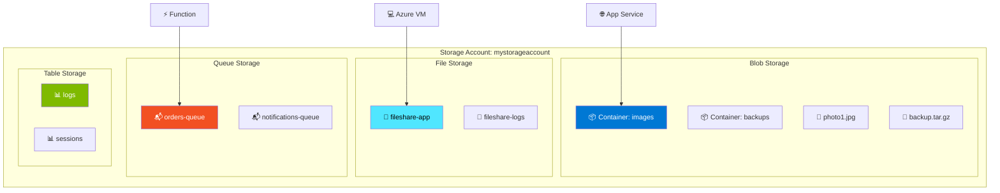
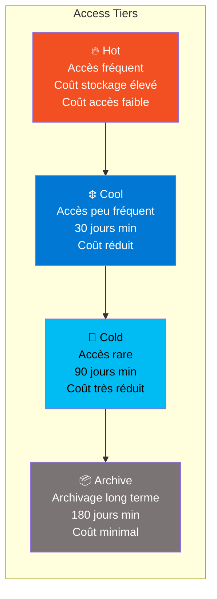
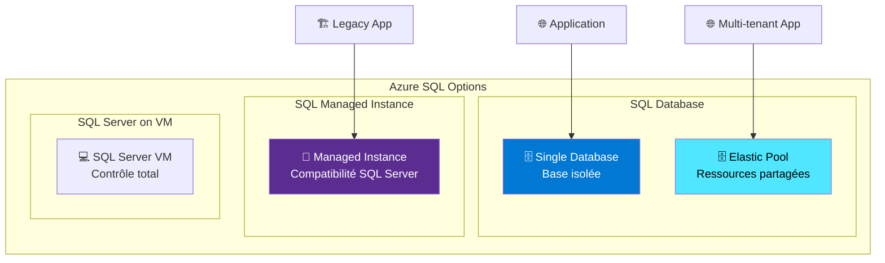
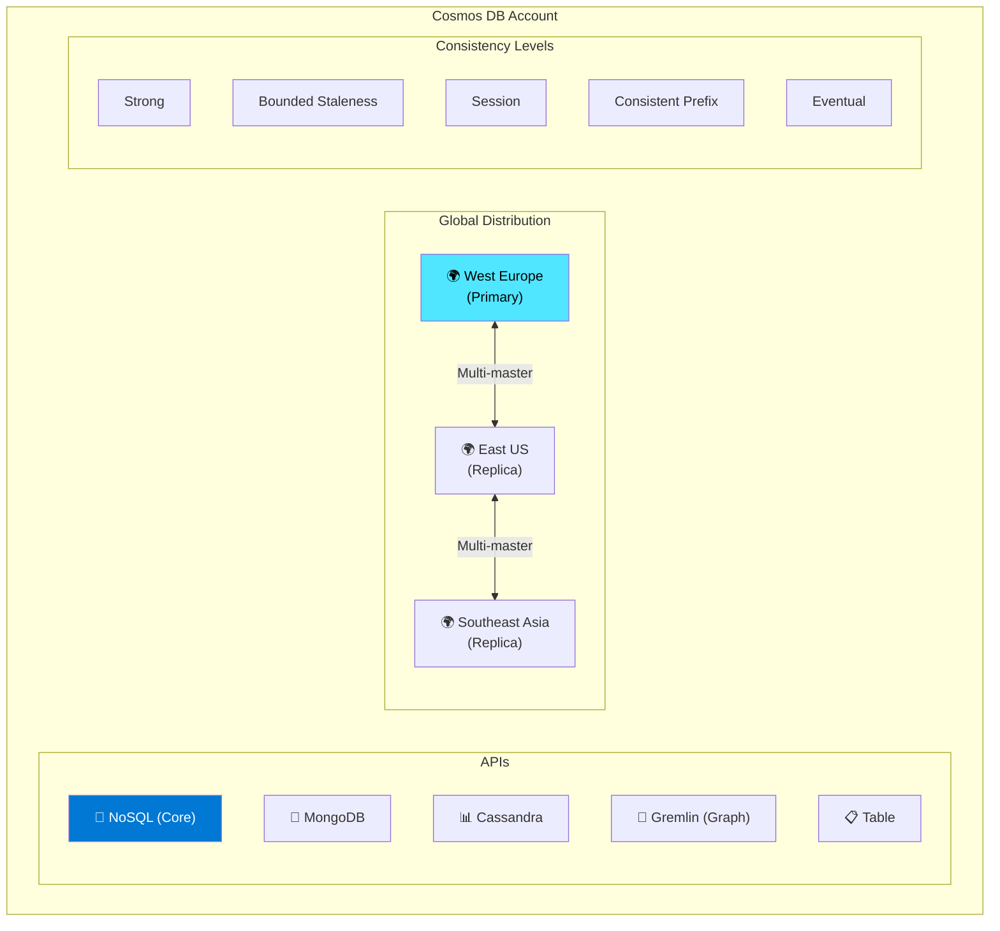

---
tags:
  - formation
  - azure
  - storage
  - databases
  - cloud
---

# Module 4 : Storage & Databases

## Objectifs du Module

À la fin de ce module, vous serez capable de :

- :fontawesome-solid-database: Créer et gérer des Storage Accounts
- :fontawesome-solid-hard-drive: Utiliser Blob, File, Queue et Table Storage
- :fontawesome-solid-server: Déployer Azure SQL Database et Managed Instance
- :fontawesome-solid-globe: Configurer Cosmos DB multi-modèle
- :fontawesome-solid-shield-halved: Sécuriser l'accès aux données

---

## 1. Azure Storage Account

### 1.1 Architecture Storage



### 1.2 Types de Storage

| Type | Usage | Protocoles |
|------|-------|------------|
| **Blob** | Objets non structurés | REST, SDK |
| **Files** | Partages SMB/NFS | SMB 3.0, NFS 4.1 |
| **Queues** | Messages asynchrones | REST |
| **Tables** | NoSQL clé-valeur | REST, OData |

### 1.3 Créer un Storage Account

```bash
# Créer le resource group
az group create --name storage-rg --location westeurope

# Créer un Storage Account
az storage account create \
    --name mystorageaccount2024 \
    --resource-group storage-rg \
    --location westeurope \
    --sku Standard_LRS \
    --kind StorageV2 \
    --access-tier Hot \
    --min-tls-version TLS1_2 \
    --allow-blob-public-access false

# Récupérer la clé d'accès
STORAGE_KEY=$(az storage account keys list \
    --account-name mystorageaccount2024 \
    --resource-group storage-rg \
    --query "[0].value" -o tsv)

# Ou utiliser la connexion string
CONNECTION_STRING=$(az storage account show-connection-string \
    --name mystorageaccount2024 \
    --resource-group storage-rg \
    --query connectionString -o tsv)
```

---

## 2. Blob Storage

### 2.1 Tiers d'Accès



### 2.2 Opérations Blob

```bash
# Créer un container
az storage container create \
    --name images \
    --account-name mystorageaccount2024 \
    --account-key $STORAGE_KEY \
    --public-access off

# Upload un fichier
az storage blob upload \
    --account-name mystorageaccount2024 \
    --account-key $STORAGE_KEY \
    --container-name images \
    --file ./photo.jpg \
    --name photos/2024/photo.jpg

# Upload un dossier entier
az storage blob upload-batch \
    --account-name mystorageaccount2024 \
    --account-key $STORAGE_KEY \
    --destination images \
    --source ./local-folder \
    --pattern "*.jpg"

# Lister les blobs
az storage blob list \
    --account-name mystorageaccount2024 \
    --account-key $STORAGE_KEY \
    --container-name images \
    --output table

# Télécharger un blob
az storage blob download \
    --account-name mystorageaccount2024 \
    --account-key $STORAGE_KEY \
    --container-name images \
    --name photos/2024/photo.jpg \
    --file ./downloaded-photo.jpg

# Changer le tier d'accès
az storage blob set-tier \
    --account-name mystorageaccount2024 \
    --account-key $STORAGE_KEY \
    --container-name images \
    --name photos/2024/photo.jpg \
    --tier Cool
```

### 2.3 Lifecycle Management

```bash
# Créer une politique de lifecycle (JSON)
cat > lifecycle-policy.json << 'EOF'
{
  "rules": [
    {
      "enabled": true,
      "name": "move-to-cool",
      "type": "Lifecycle",
      "definition": {
        "actions": {
          "baseBlob": {
            "tierToCool": {
              "daysAfterModificationGreaterThan": 30
            },
            "tierToArchive": {
              "daysAfterModificationGreaterThan": 90
            },
            "delete": {
              "daysAfterModificationGreaterThan": 365
            }
          }
        },
        "filters": {
          "blobTypes": ["blockBlob"],
          "prefixMatch": ["logs/", "backups/"]
        }
      }
    }
  ]
}
EOF

# Appliquer la politique
az storage account management-policy create \
    --account-name mystorageaccount2024 \
    --resource-group storage-rg \
    --policy @lifecycle-policy.json
```

---

## 3. Azure Files

### 3.1 Créer un File Share

```bash
# Créer un file share
az storage share create \
    --name appdata \
    --account-name mystorageaccount2024 \
    --account-key $STORAGE_KEY \
    --quota 100

# Créer un répertoire
az storage directory create \
    --name config \
    --share-name appdata \
    --account-name mystorageaccount2024 \
    --account-key $STORAGE_KEY

# Upload un fichier
az storage file upload \
    --share-name appdata \
    --source ./app.config \
    --path config/app.config \
    --account-name mystorageaccount2024 \
    --account-key $STORAGE_KEY
```

### 3.2 Monter sur une VM

```bash
# Script de montage Linux
STORAGE_ACCOUNT="mystorageaccount2024"
SHARE_NAME="appdata"
MOUNT_POINT="/mnt/azure/appdata"

# Installer cifs-utils
sudo apt-get install -y cifs-utils

# Créer le point de montage
sudo mkdir -p $MOUNT_POINT

# Créer le fichier credentials
sudo bash -c "cat > /etc/smbcredentials/${STORAGE_ACCOUNT}.cred << EOF
username=${STORAGE_ACCOUNT}
password=${STORAGE_KEY}
EOF"
sudo chmod 600 /etc/smbcredentials/${STORAGE_ACCOUNT}.cred

# Monter le share
sudo mount -t cifs \
    //${STORAGE_ACCOUNT}.file.core.windows.net/${SHARE_NAME} \
    ${MOUNT_POINT} \
    -o vers=3.0,credentials=/etc/smbcredentials/${STORAGE_ACCOUNT}.cred,dir_mode=0777,file_mode=0777

# Ajouter au fstab pour montage automatique
echo "//${STORAGE_ACCOUNT}.file.core.windows.net/${SHARE_NAME} ${MOUNT_POINT} cifs vers=3.0,credentials=/etc/smbcredentials/${STORAGE_ACCOUNT}.cred,dir_mode=0777,file_mode=0777 0 0" | sudo tee -a /etc/fstab
```

---

## 4. Azure SQL Database

### 4.1 Architecture SQL



### 4.2 Créer un SQL Server et Database

```bash
# Créer le serveur SQL
az sql server create \
    --name sqlserver-prod-2024 \
    --resource-group storage-rg \
    --location westeurope \
    --admin-user sqladmin \
    --admin-password 'P@ssw0rd123!'

# Configurer le firewall (autoriser Azure services)
az sql server firewall-rule create \
    --resource-group storage-rg \
    --server sqlserver-prod-2024 \
    --name AllowAzureServices \
    --start-ip-address 0.0.0.0 \
    --end-ip-address 0.0.0.0

# Autoriser votre IP
MY_IP=$(curl -s ifconfig.me)
az sql server firewall-rule create \
    --resource-group storage-rg \
    --server sqlserver-prod-2024 \
    --name AllowMyIP \
    --start-ip-address $MY_IP \
    --end-ip-address $MY_IP

# Créer une database (Basic tier)
az sql db create \
    --resource-group storage-rg \
    --server sqlserver-prod-2024 \
    --name appdb \
    --edition Basic \
    --capacity 5

# Créer une database (Standard tier avec DTU)
az sql db create \
    --resource-group storage-rg \
    --server sqlserver-prod-2024 \
    --name appdb-standard \
    --edition Standard \
    --capacity 20

# Créer une database (vCore model)
az sql db create \
    --resource-group storage-rg \
    --server sqlserver-prod-2024 \
    --name appdb-vcore \
    --edition GeneralPurpose \
    --family Gen5 \
    --capacity 2 \
    --compute-model Serverless \
    --auto-pause-delay 60

# Obtenir la connection string
az sql db show-connection-string \
    --server sqlserver-prod-2024 \
    --name appdb \
    --client ado.net
```

### 4.3 Elastic Pool

```bash
# Créer un Elastic Pool
az sql elastic-pool create \
    --resource-group storage-rg \
    --server sqlserver-prod-2024 \
    --name app-pool \
    --edition Standard \
    --dtu 100 \
    --db-dtu-max 50 \
    --db-dtu-min 10

# Créer une database dans le pool
az sql db create \
    --resource-group storage-rg \
    --server sqlserver-prod-2024 \
    --name tenant1-db \
    --elastic-pool app-pool

# Déplacer une database existante dans le pool
az sql db update \
    --resource-group storage-rg \
    --server sqlserver-prod-2024 \
    --name appdb \
    --elastic-pool app-pool
```

---

## 5. Cosmos DB

### 5.1 Architecture Multi-Modèle



### 5.2 Créer un Compte Cosmos DB

```bash
# Créer un compte Cosmos DB (API NoSQL)
az cosmosdb create \
    --name cosmos-prod-2024 \
    --resource-group storage-rg \
    --locations regionName=westeurope failoverPriority=0 isZoneRedundant=true \
    --locations regionName=northeurope failoverPriority=1 isZoneRedundant=false \
    --default-consistency-level Session \
    --enable-automatic-failover true

# Créer une database
az cosmosdb sql database create \
    --account-name cosmos-prod-2024 \
    --resource-group storage-rg \
    --name appdb

# Créer un container avec partition key
az cosmosdb sql container create \
    --account-name cosmos-prod-2024 \
    --resource-group storage-rg \
    --database-name appdb \
    --name orders \
    --partition-key-path "/customerId" \
    --throughput 400

# Créer avec autoscale
az cosmosdb sql container create \
    --account-name cosmos-prod-2024 \
    --resource-group storage-rg \
    --database-name appdb \
    --name products \
    --partition-key-path "/category" \
    --max-throughput 4000

# Obtenir les clés
az cosmosdb keys list \
    --name cosmos-prod-2024 \
    --resource-group storage-rg

# Obtenir la connection string
az cosmosdb keys list \
    --name cosmos-prod-2024 \
    --resource-group storage-rg \
    --type connection-strings
```

### 5.3 Cosmos DB avec MongoDB API

```bash
# Créer un compte avec API MongoDB
az cosmosdb create \
    --name cosmos-mongo-2024 \
    --resource-group storage-rg \
    --kind MongoDB \
    --server-version 4.2 \
    --locations regionName=westeurope failoverPriority=0

# Créer une database MongoDB
az cosmosdb mongodb database create \
    --account-name cosmos-mongo-2024 \
    --resource-group storage-rg \
    --name mydb

# Créer une collection
az cosmosdb mongodb collection create \
    --account-name cosmos-mongo-2024 \
    --resource-group storage-rg \
    --database-name mydb \
    --name users \
    --shard "_id" \
    --throughput 400
```

---

## 6. Sécurité des Données

### 6.1 Private Endpoints pour Storage

```bash
# Désactiver l'accès public
az storage account update \
    --name mystorageaccount2024 \
    --resource-group storage-rg \
    --default-action Deny

# Créer un Private Endpoint
az network private-endpoint create \
    --name storage-private-endpoint \
    --resource-group storage-rg \
    --vnet-name prod-vnet \
    --subnet data-subnet \
    --private-connection-resource-id $(az storage account show \
        --name mystorageaccount2024 \
        --resource-group storage-rg \
        --query id -o tsv) \
    --group-id blob \
    --connection-name storage-connection

# Créer la Private DNS Zone
az network private-dns zone create \
    --resource-group storage-rg \
    --name privatelink.blob.core.windows.net

# Lier au VNet
az network private-dns link vnet create \
    --resource-group storage-rg \
    --zone-name privatelink.blob.core.windows.net \
    --name storage-dns-link \
    --virtual-network prod-vnet \
    --registration-enabled false

# Créer le DNS record automatiquement
az network private-endpoint dns-zone-group create \
    --resource-group storage-rg \
    --endpoint-name storage-private-endpoint \
    --name storage-dns-group \
    --private-dns-zone privatelink.blob.core.windows.net \
    --zone-name privatelink.blob.core.windows.net
```

### 6.2 SAS Tokens

```bash
# Générer un SAS token pour un container (lecture seule, 1 jour)
END_DATE=$(date -u -d "+1 day" '+%Y-%m-%dT%H:%MZ')

az storage container generate-sas \
    --account-name mystorageaccount2024 \
    --account-key $STORAGE_KEY \
    --name images \
    --permissions r \
    --expiry $END_DATE \
    --https-only

# Générer un SAS token pour un blob spécifique
az storage blob generate-sas \
    --account-name mystorageaccount2024 \
    --account-key $STORAGE_KEY \
    --container-name images \
    --name photos/2024/photo.jpg \
    --permissions r \
    --expiry $END_DATE \
    --https-only \
    --full-uri

# Générer un Account SAS (accès plus large)
az storage account generate-sas \
    --account-name mystorageaccount2024 \
    --account-key $STORAGE_KEY \
    --services bfqt \
    --resource-types sco \
    --permissions rwdlacup \
    --expiry $END_DATE \
    --https-only
```

### 6.3 Encryption & Customer-Managed Keys

```bash
# Créer un Key Vault pour les clés
az keyvault create \
    --name kv-storage-keys \
    --resource-group storage-rg \
    --location westeurope \
    --enable-purge-protection true

# Créer une clé
az keyvault key create \
    --vault-name kv-storage-keys \
    --name storage-encryption-key \
    --kty RSA \
    --size 2048

# Activer l'identité managée sur le storage account
az storage account update \
    --name mystorageaccount2024 \
    --resource-group storage-rg \
    --assign-identity

# Obtenir l'identity principal ID
IDENTITY_ID=$(az storage account show \
    --name mystorageaccount2024 \
    --resource-group storage-rg \
    --query identity.principalId -o tsv)

# Donner accès au Key Vault
az keyvault set-policy \
    --name kv-storage-keys \
    --object-id $IDENTITY_ID \
    --key-permissions get unwrapKey wrapKey

# Configurer l'encryption avec CMK
KEY_URI=$(az keyvault key show \
    --vault-name kv-storage-keys \
    --name storage-encryption-key \
    --query key.kid -o tsv)

az storage account update \
    --name mystorageaccount2024 \
    --resource-group storage-rg \
    --encryption-key-source Microsoft.Keyvault \
    --encryption-key-vault https://kv-storage-keys.vault.azure.net \
    --encryption-key-name storage-encryption-key
```

---

## 7. Exercice : À Vous de Jouer

!!! example "Mise en Pratique"
    **Objectif** : Concevoir une solution de stockage et base de données complète pour une application e-commerce

    **Contexte** : Vous êtes architecte pour une plateforme e-commerce qui doit gérer des images de produits, des fichiers de configuration, des transactions et des sessions utilisateurs. L'application doit être hautement disponible, performante et sécurisée. Vous devez mettre en place l'infrastructure de stockage et base de données appropriée.

    **Tâches à réaliser** :

    1. Créer un Storage Account avec tiers Hot/Cool/Archive pour les images produits
    2. Configurer une politique de lifecycle management (Hot→Cool après 30j, Archive après 90j)
    3. Créer un File Share Azure pour les fichiers de configuration partagés
    4. Implémenter une Queue Storage pour le traitement asynchrone des commandes
    5. Créer un Azure SQL Database avec zone-redundancy
    6. Configurer un failover group pour la haute disponibilité
    7. Créer un Cosmos DB pour les sessions utilisateurs (API Table)
    8. Activer les Private Endpoints pour tous les services de données

    **Critères de validation** :

    - [ ] Le Storage Account contient 3 containers (images-hot, images-cool, images-archive)
    - [ ] La lifecycle policy déplace automatiquement les blobs entre tiers
    - [ ] Le File Share est monté sur une VM de test
    - [ ] La Queue reçoit et traite les messages correctement
    - [ ] Le SQL Database est accessible et zone-redundant
    - [ ] Le failover group est configuré avec replica en lecture dans une autre région
    - [ ] Cosmos DB stocke et récupère les données de session
    - [ ] Tous les services sont accessibles uniquement via Private Endpoints

??? quote "Solution"

    **Étape 1 : Créer le Storage Account avec containers**

    ```bash
    # Variables
    LOCATION="westeurope"
    LOCATION_SECONDARY="northeurope"
    RG_NAME="ecommerce-storage-rg"
    STORAGE_NAME="ecommercest$(openssl rand -hex 4)"

    # Créer le resource group
    az group create --name $RG_NAME --location $LOCATION

    # Créer le Storage Account
    az storage account create \
        --name $STORAGE_NAME \
        --resource-group $RG_NAME \
        --location $LOCATION \
        --sku Standard_GRS \
        --kind StorageV2 \
        --access-tier Hot \
        --min-tls-version TLS1_2 \
        --allow-blob-public-access false

    # Récupérer la clé
    STORAGE_KEY=$(az storage account keys list \
        --account-name $STORAGE_NAME \
        --resource-group $RG_NAME \
        --query "[0].value" -o tsv)

    # Créer les containers pour les différents tiers
    az storage container create \
        --name images-hot \
        --account-name $STORAGE_NAME \
        --account-key $STORAGE_KEY

    az storage container create \
        --name images-cool \
        --account-name $STORAGE_NAME \
        --account-key $STORAGE_KEY

    az storage container create \
        --name images-archive \
        --account-name $STORAGE_NAME \
        --account-key $STORAGE_KEY
    ```

    **Étape 2 : Configurer lifecycle management**

    ```bash
    # Créer la politique de lifecycle
    cat > lifecycle-policy.json << 'EOF'
    {
      "rules": [
        {
          "enabled": true,
          "name": "move-old-images",
          "type": "Lifecycle",
          "definition": {
            "actions": {
              "baseBlob": {
                "tierToCool": {
                  "daysAfterModificationGreaterThan": 30
                },
                "tierToArchive": {
                  "daysAfterModificationGreaterThan": 90
                },
                "delete": {
                  "daysAfterModificationGreaterThan": 365
                }
              }
            },
            "filters": {
              "blobTypes": ["blockBlob"],
              "prefixMatch": ["images-hot/"]
            }
          }
        }
      ]
    }
    EOF

    # Appliquer la politique
    az storage account management-policy create \
        --account-name $STORAGE_NAME \
        --resource-group $RG_NAME \
        --policy @lifecycle-policy.json
    ```

    **Étape 3 : Créer le File Share**

    ```bash
    # Créer le file share
    az storage share create \
        --name app-config \
        --account-name $STORAGE_NAME \
        --account-key $STORAGE_KEY \
        --quota 10

    # Créer une VM de test et monter le share
    az vm create \
        --resource-group $RG_NAME \
        --name config-test-vm \
        --image Ubuntu2204 \
        --size Standard_B2s \
        --admin-username azureuser \
        --generate-ssh-keys

    # Script de montage (à exécuter sur la VM)
    cat > mount-fileshare.sh << EOF
    #!/bin/bash
    sudo apt-get update
    sudo apt-get install -y cifs-utils

    sudo mkdir -p /mnt/appconfig

    # Créer le fichier credentials
    sudo bash -c "cat > /etc/smbcredentials/${STORAGE_NAME}.cred << CRED
    username=${STORAGE_NAME}
    password=${STORAGE_KEY}
    CRED"
    sudo chmod 600 /etc/smbcredentials/${STORAGE_NAME}.cred

    # Monter le share
    sudo mount -t cifs \
        //${STORAGE_NAME}.file.core.windows.net/app-config \
        /mnt/appconfig \
        -o vers=3.0,credentials=/etc/smbcredentials/${STORAGE_NAME}.cred,dir_mode=0777,file_mode=0777

    # Ajouter au fstab
    echo "//${STORAGE_NAME}.file.core.windows.net/app-config /mnt/appconfig cifs vers=3.0,credentials=/etc/smbcredentials/${STORAGE_NAME}.cred,dir_mode=0777,file_mode=0777 0 0" | sudo tee -a /etc/fstab
    EOF
    ```

    **Étape 4 : Configurer Queue Storage**

    ```bash
    # Créer une queue
    az storage queue create \
        --name orders-queue \
        --account-name $STORAGE_NAME \
        --account-key $STORAGE_KEY

    # Envoyer un message test
    az storage message put \
        --queue-name orders-queue \
        --content "Order #12345" \
        --account-name $STORAGE_NAME \
        --account-key $STORAGE_KEY

    # Lire les messages
    az storage message peek \
        --queue-name orders-queue \
        --account-name $STORAGE_NAME \
        --account-key $STORAGE_KEY
    ```

    **Étape 5 : Créer Azure SQL Database**

    ```bash
    # Créer le SQL Server
    SQL_SERVER_NAME="ecommerce-sql-$(openssl rand -hex 4)"
    SQL_ADMIN="sqladmin"
    SQL_PASSWORD="P@ssw0rd$(openssl rand -hex 4)!"

    az sql server create \
        --name $SQL_SERVER_NAME \
        --resource-group $RG_NAME \
        --location $LOCATION \
        --admin-user $SQL_ADMIN \
        --admin-password $SQL_PASSWORD

    # Créer la database avec zone-redundancy
    az sql db create \
        --resource-group $RG_NAME \
        --server $SQL_SERVER_NAME \
        --name ecommerce-db \
        --edition GeneralPurpose \
        --family Gen5 \
        --capacity 2 \
        --compute-model Serverless \
        --auto-pause-delay 60 \
        --min-capacity 0.5 \
        --zone-redundant true

    # Configurer le firewall (pour tests)
    az sql server firewall-rule create \
        --resource-group $RG_NAME \
        --server $SQL_SERVER_NAME \
        --name AllowAzureServices \
        --start-ip-address 0.0.0.0 \
        --end-ip-address 0.0.0.0
    ```

    **Étape 6 : Configurer le failover group**

    ```bash
    # Créer un secondary server dans une autre région
    SQL_SERVER_SECONDARY="${SQL_SERVER_NAME}-secondary"

    az sql server create \
        --name $SQL_SERVER_SECONDARY \
        --resource-group $RG_NAME \
        --location $LOCATION_SECONDARY \
        --admin-user $SQL_ADMIN \
        --admin-password $SQL_PASSWORD

    # Créer le failover group
    az sql failover-group create \
        --name ecommerce-fg \
        --resource-group $RG_NAME \
        --server $SQL_SERVER_NAME \
        --partner-server $SQL_SERVER_SECONDARY \
        --partner-resource-group $RG_NAME \
        --failover-policy Automatic \
        --grace-period 1 \
        --add-db ecommerce-db

    # Tester le failover
    # az sql failover-group set-primary \
    #     --name ecommerce-fg \
    #     --resource-group $RG_NAME \
    #     --server $SQL_SERVER_SECONDARY
    ```

    **Étape 7 : Créer Cosmos DB**

    ```bash
    # Créer le compte Cosmos DB (Table API)
    COSMOS_ACCOUNT="ecommerce-cosmos-$(openssl rand -hex 4)"

    az cosmosdb create \
        --name $COSMOS_ACCOUNT \
        --resource-group $RG_NAME \
        --locations regionName=$LOCATION failoverPriority=0 isZoneRedundant=True \
        --locations regionName=$LOCATION_SECONDARY failoverPriority=1 isZoneRedundant=True \
        --capabilities EnableTable \
        --default-consistency-level Session

    # Créer une table
    az cosmosdb table create \
        --account-name $COSMOS_ACCOUNT \
        --resource-group $RG_NAME \
        --name UserSessions \
        --throughput 400

    # Récupérer la connection string
    az cosmosdb keys list \
        --name $COSMOS_ACCOUNT \
        --resource-group $RG_NAME \
        --type connection-strings \
        --query "connectionStrings[?description=='Primary Table Connection String'].connectionString" -o tsv
    ```

    **Étape 8 : Configurer les Private Endpoints**

    ```bash
    # Créer un VNet et subnet
    az network vnet create \
        --resource-group $RG_NAME \
        --name ecommerce-vnet \
        --address-prefix 10.0.0.0/16 \
        --subnet-name app-subnet \
        --subnet-prefix 10.0.1.0/24

    az network vnet subnet create \
        --resource-group $RG_NAME \
        --vnet-name ecommerce-vnet \
        --name private-endpoints-subnet \
        --address-prefix 10.0.2.0/24 \
        --disable-private-endpoint-network-policies true

    # Private Endpoint pour Storage (Blob)
    STORAGE_ID=$(az storage account show -g $RG_NAME -n $STORAGE_NAME --query id -o tsv)

    az network private-endpoint create \
        --resource-group $RG_NAME \
        --name storage-blob-pe \
        --vnet-name ecommerce-vnet \
        --subnet private-endpoints-subnet \
        --private-connection-resource-id $STORAGE_ID \
        --group-id blob \
        --connection-name storage-blob-connection

    # Private Endpoint pour SQL
    SQL_ID=$(az sql server show -g $RG_NAME -n $SQL_SERVER_NAME --query id -o tsv)

    az network private-endpoint create \
        --resource-group $RG_NAME \
        --name sql-pe \
        --vnet-name ecommerce-vnet \
        --subnet private-endpoints-subnet \
        --private-connection-resource-id $SQL_ID \
        --group-id sqlServer \
        --connection-name sql-connection

    # Private Endpoint pour Cosmos DB
    COSMOS_ID=$(az cosmosdb show -g $RG_NAME -n $COSMOS_ACCOUNT --query id -o tsv)

    az network private-endpoint create \
        --resource-group $RG_NAME \
        --name cosmos-pe \
        --vnet-name ecommerce-vnet \
        --subnet private-endpoints-subnet \
        --private-connection-resource-id $COSMOS_ID \
        --group-id Table \
        --connection-name cosmos-connection

    # Créer les Private DNS Zones
    az network private-dns zone create \
        --resource-group $RG_NAME \
        --name privatelink.blob.core.windows.net

    az network private-dns zone create \
        --resource-group $RG_NAME \
        --name privatelink.database.windows.net

    az network private-dns zone create \
        --resource-group $RG_NAME \
        --name privatelink.table.cosmos.azure.com

    # Lier les zones au VNet
    for zone in privatelink.blob.core.windows.net privatelink.database.windows.net privatelink.table.cosmos.azure.com; do
        az network private-dns link vnet create \
            --resource-group $RG_NAME \
            --zone-name $zone \
            --name ${zone}-link \
            --virtual-network ecommerce-vnet \
            --registration-enabled false
    done

    # Associer les DNS zones aux Private Endpoints
    az network private-endpoint dns-zone-group create \
        --resource-group $RG_NAME \
        --endpoint-name storage-blob-pe \
        --name storage-dns-group \
        --private-dns-zone privatelink.blob.core.windows.net \
        --zone-name privatelink.blob.core.windows.net

    az network private-endpoint dns-zone-group create \
        --resource-group $RG_NAME \
        --endpoint-name sql-pe \
        --name sql-dns-group \
        --private-dns-zone privatelink.database.windows.net \
        --zone-name privatelink.database.windows.net

    az network private-endpoint dns-zone-group create \
        --resource-group $RG_NAME \
        --endpoint-name cosmos-pe \
        --name cosmos-dns-group \
        --private-dns-zone privatelink.table.cosmos.azure.com \
        --zone-name privatelink.table.cosmos.azure.com
    ```

    **Validation**

    ```bash
    # Vérifier le Storage Account
    az storage account show -g $RG_NAME -n $STORAGE_NAME --query "[name,primaryEndpoints]"

    # Vérifier la lifecycle policy
    az storage account management-policy show \
        --account-name $STORAGE_NAME \
        --resource-group $RG_NAME

    # Vérifier SQL Database
    az sql db show -g $RG_NAME -s $SQL_SERVER_NAME -n ecommerce-db --query "[name,zoneRedundant,status]"

    # Vérifier le failover group
    az sql failover-group show \
        --name ecommerce-fg \
        --resource-group $RG_NAME \
        --server $SQL_SERVER_NAME

    # Vérifier Cosmos DB
    az cosmosdb show -g $RG_NAME -n $COSMOS_ACCOUNT --query "[name,documentEndpoint,enableMultipleWriteLocations]"

    # Vérifier les Private Endpoints
    az network private-endpoint list -g $RG_NAME --output table
    ```

---

## 8. Exercices Pratiques Additionnels

### Exercice 1 : Storage Multi-Tier

!!! example "Objectif"
    Créer un Storage Account avec lifecycle management et accès sécurisé.

??? quote "Solution"

    ```bash
    # 1. Créer le Storage Account
    az storage account create \
        --name storageexo2024 \
        --resource-group storage-rg \
        --location westeurope \
        --sku Standard_LRS \
        --kind StorageV2 \
        --access-tier Hot \
        --allow-blob-public-access false

    STORAGE_KEY=$(az storage account keys list \
        --account-name storageexo2024 \
        --resource-group storage-rg \
        --query "[0].value" -o tsv)

    # 2. Créer les containers
    for container in uploads archives logs; do
        az storage container create \
            --name $container \
            --account-name storageexo2024 \
            --account-key $STORAGE_KEY
    done

    # 3. Lifecycle policy
    cat > lifecycle.json << 'EOF'
    {
      "rules": [
        {
          "enabled": true,
          "name": "archive-old-data",
          "type": "Lifecycle",
          "definition": {
            "actions": {
              "baseBlob": {
                "tierToCool": {"daysAfterModificationGreaterThan": 30},
                "tierToArchive": {"daysAfterModificationGreaterThan": 90},
                "delete": {"daysAfterModificationGreaterThan": 365}
              }
            },
            "filters": {
              "blobTypes": ["blockBlob"],
              "prefixMatch": ["archives/", "logs/"]
            }
          }
        }
      ]
    }
    EOF

    az storage account management-policy create \
        --account-name storageexo2024 \
        --resource-group storage-rg \
        --policy @lifecycle.json

    # 4. Générer un SAS token pour uploads
    END=$(date -u -d "+7 days" '+%Y-%m-%dT%H:%MZ')

    SAS_TOKEN=$(az storage container generate-sas \
        --account-name storageexo2024 \
        --account-key $STORAGE_KEY \
        --name uploads \
        --permissions rwl \
        --expiry $END \
        --https-only -o tsv)

    echo "Upload URL: https://storageexo2024.blob.core.windows.net/uploads?$SAS_TOKEN"
    ```

### Exercice 2 : SQL Database avec Failover

!!! example "Objectif"
    Déployer une base SQL Database avec geo-replication.

??? quote "Solution"

    ```bash
    # 1. Créer le serveur primaire
    az sql server create \
        --name sql-primary-2024 \
        --resource-group storage-rg \
        --location westeurope \
        --admin-user sqladmin \
        --admin-password 'P@ssw0rd123!'

    # 2. Créer le serveur secondaire
    az sql server create \
        --name sql-secondary-2024 \
        --resource-group storage-rg \
        --location northeurope \
        --admin-user sqladmin \
        --admin-password 'P@ssw0rd123!'

    # 3. Créer la database
    az sql db create \
        --resource-group storage-rg \
        --server sql-primary-2024 \
        --name criticaldb \
        --edition Standard \
        --capacity 20

    # 4. Créer le failover group
    az sql failover-group create \
        --resource-group storage-rg \
        --server sql-primary-2024 \
        --partner-server sql-secondary-2024 \
        --name fg-critical \
        --failover-policy Automatic \
        --grace-period 1 \
        --add-db criticaldb

    # 5. Vérifier le statut
    az sql failover-group show \
        --resource-group storage-rg \
        --server sql-primary-2024 \
        --name fg-critical \
        --query replicationState

    # Connection string utilisant le failover group
    echo "Server: fg-critical.database.windows.net"
    ```

---

## 8. Résumé

| Service | Usage | Commande clé |
|---------|-------|--------------|
| **Storage Account** | Stockage générique | `az storage account create` |
| **Blob Storage** | Objets/fichiers | `az storage blob upload` |
| **File Storage** | Partages SMB/NFS | `az storage share create` |
| **SQL Database** | SGBD relationnel | `az sql db create` |
| **Elastic Pool** | Multi-tenant SQL | `az sql elastic-pool create` |
| **Cosmos DB** | NoSQL global | `az cosmosdb create` |
| **Private Endpoint** | Accès privé | `az network private-endpoint create` |

---

## Navigation

| Précédent | Suivant |
|-----------|---------|
| [← Module 3 : Virtual Network](03-module.md) | [Module 5 : AKS & Containers →](05-module.md) |

---

## Navigation

| | |
|:---|---:|
| [← Module 3 : Virtual Network & Networking](03-module.md) | [Module 5 : AKS & Containers →](05-module.md) |

[Retour au Programme](index.md){ .md-button }
