---
tags:
  - formation
  - azure
  - aks
  - kubernetes
  - containers
  - cloud
---

# Module 5 : AKS & Containers

## Objectifs du Module

À la fin de ce module, vous serez capable de :

- :fontawesome-solid-box: Créer et gérer Azure Container Registry (ACR)
- :material-kubernetes: Déployer un cluster AKS
- :fontawesome-solid-network-wired: Configurer le networking AKS
- :fontawesome-solid-shield-halved: Implémenter l'authentification workload identity
- :fontawesome-solid-chart-line: Configurer l'autoscaling (HPA, cluster autoscaler)

---

## 1. Azure Container Registry

### 1.1 Architecture ACR

```mermaid
graph TB
    subgraph "Azure Container Registry"
        ACR["📦 ACR: myregistry.azurecr.io"]

        subgraph "Repositories"
            REPO1["🐳 myapp/frontend"]
            REPO2["🐳 myapp/backend"]
            REPO3["🐳 myapp/api"]
        end

        subgraph "Features"
            GEO["🌍 Geo-replication"]
            SCAN["🔍 Vulnerability Scanning"]
            TASKS["⚙️ ACR Tasks (CI)"]
        end
    end

    DEV["👨‍💻 Developer"] -->|"docker push"| ACR
    PIPELINE["🔄 Azure DevOps"] -->|"ACR Tasks"| ACR
    AKS["☸️ AKS Cluster"] -->|"docker pull"| ACR

    style ACR fill:#0078d4,color:#fff
    style AKS fill:#326ce5,color:#fff
```



### 1.2 Créer un ACR

```bash
# Créer le resource group
az group create --name aks-rg --location westeurope

# Créer un ACR (Basic tier)
az acr create \
    --resource-group aks-rg \
    --name myacr2024prod \
    --sku Basic

# Créer un ACR (Premium avec geo-replication)
az acr create \
    --resource-group aks-rg \
    --name myacrpremium2024 \
    --sku Premium

# Ajouter une réplication
az acr replication create \
    --registry myacrpremium2024 \
    --location northeurope

# Activer l'admin account (pour tests)
az acr update \
    --name myacr2024prod \
    --admin-enabled true

# Récupérer les credentials
az acr credential show \
    --name myacr2024prod

# Se connecter
az acr login --name myacr2024prod
```

### 1.3 Build & Push Images

```bash
# Build localement et push
docker build -t myacr2024prod.azurecr.io/myapp:v1 .
docker push myacr2024prod.azurecr.io/myapp:v1

# Build directement dans ACR (ACR Tasks)
az acr build \
    --registry myacr2024prod \
    --image myapp:v1 \
    --file Dockerfile \
    .

# Build depuis un repo Git
az acr build \
    --registry myacr2024prod \
    --image myapp:{{.Run.ID}} \
    https://github.com/myorg/myapp.git

# Lister les repositories
az acr repository list \
    --name myacr2024prod \
    --output table

# Lister les tags
az acr repository show-tags \
    --name myacr2024prod \
    --repository myapp \
    --output table

# Supprimer une image
az acr repository delete \
    --name myacr2024prod \
    --image myapp:v1 \
    --yes
```

---

## 2. Azure Kubernetes Service

### 2.1 Architecture AKS

```mermaid
graph TB
    subgraph "Azure"
        subgraph "AKS Cluster"
            subgraph "Control Plane (Managed)"
                API["🎛️ API Server"]
                ETCD["💾 etcd"]
                SCHED["📋 Scheduler"]
                CM["⚙️ Controller Manager"]
            end

            subgraph "Node Pool: System"
                NODE1["💻 Node 1"]
                NODE2["💻 Node 2"]
            end

            subgraph "Node Pool: User (Spot)"
                NODE3["💻 Spot Node 1"]
                NODE4["💻 Spot Node 2"]
            end
        end

        ACR["📦 ACR"]
        VNET["🌐 VNet"]
        KV["🔐 Key Vault"]
        MI["🆔 Managed Identity"]
    end

    USER["👨‍💻 kubectl"] --> API
    API --> NODE1
    API --> NODE2
    NODE1 --> ACR
    NODE2 --> ACR

    style API fill:#326ce5,color:#fff
    style ACR fill:#0078d4,color:#fff
```



### 2.2 Créer un Cluster AKS

```bash
# Créer un cluster AKS basique
az aks create \
    --resource-group aks-rg \
    --name aks-prod \
    --location westeurope \
    --node-count 3 \
    --node-vm-size Standard_D2s_v3 \
    --generate-ssh-keys \
    --enable-managed-identity

# Cluster avec configuration avancée
az aks create \
    --resource-group aks-rg \
    --name aks-prod-advanced \
    --location westeurope \
    --kubernetes-version 1.28.3 \
    --node-count 2 \
    --node-vm-size Standard_D4s_v3 \
    --zones 1 2 3 \
    --enable-managed-identity \
    --enable-workload-identity \
    --enable-oidc-issuer \
    --network-plugin azure \
    --network-policy calico \
    --vnet-subnet-id /subscriptions/xxx/resourceGroups/aks-rg/providers/Microsoft.Network/virtualNetworks/aks-vnet/subnets/aks-subnet \
    --service-cidr 10.0.0.0/16 \
    --dns-service-ip 10.0.0.10 \
    --enable-cluster-autoscaler \
    --min-count 2 \
    --max-count 10 \
    --attach-acr myacr2024prod

# Récupérer les credentials kubectl
az aks get-credentials \
    --resource-group aks-rg \
    --name aks-prod \
    --overwrite-existing

# Vérifier la connexion
kubectl get nodes
kubectl cluster-info
```

### 2.3 Node Pools

```bash
# Ajouter un node pool user
az aks nodepool add \
    --resource-group aks-rg \
    --cluster-name aks-prod \
    --name userpool \
    --node-count 3 \
    --node-vm-size Standard_D4s_v3 \
    --zones 1 2 3 \
    --mode User \
    --labels workload=user

# Ajouter un node pool Spot (cost-effective)
az aks nodepool add \
    --resource-group aks-rg \
    --cluster-name aks-prod \
    --name spotpool \
    --node-count 2 \
    --node-vm-size Standard_D4s_v3 \
    --priority Spot \
    --eviction-policy Delete \
    --spot-max-price -1 \
    --labels workload=batch kubernetes.azure.com/scalesetpriority=spot \
    --node-taints kubernetes.azure.com/scalesetpriority=spot:NoSchedule

# Ajouter un node pool GPU
az aks nodepool add \
    --resource-group aks-rg \
    --cluster-name aks-prod \
    --name gpupool \
    --node-count 1 \
    --node-vm-size Standard_NC6s_v3 \
    --labels workload=gpu \
    --node-taints nvidia.com/gpu=true:NoSchedule

# Lister les node pools
az aks nodepool list \
    --resource-group aks-rg \
    --cluster-name aks-prod \
    --output table

# Scaler un node pool
az aks nodepool scale \
    --resource-group aks-rg \
    --cluster-name aks-prod \
    --name userpool \
    --node-count 5

# Mettre à jour un node pool
az aks nodepool update \
    --resource-group aks-rg \
    --cluster-name aks-prod \
    --name userpool \
    --enable-cluster-autoscaler \
    --min-count 2 \
    --max-count 10
```

---

## 3. Networking AKS

### 3.1 Network Plugins


| Plugin | IP Pods | Avantages | Inconvénients |
|--------|---------|-----------|---------------|
| **Azure CNI** | VNet IPs | Accès direct, perf | Consomme IPs |
| **Kubenet** | Overlay | Économe en IPs | NAT, pas de Network Policy native |
| **Azure CNI Overlay** | Overlay + CNI | Best of both | Preview |

### 3.2 Services et Ingress

```bash
# Déployer un service LoadBalancer (public)
kubectl apply -f - <<EOF
apiVersion: v1
kind: Service
metadata:
  name: frontend
  annotations:
    service.beta.kubernetes.io/azure-load-balancer-health-probe-request-path: /health
spec:
  type: LoadBalancer
  ports:
  - port: 80
    targetPort: 8080
  selector:
    app: frontend
EOF

# Service LoadBalancer interne
kubectl apply -f - <<EOF
apiVersion: v1
kind: Service
metadata:
  name: backend
  annotations:
    service.beta.kubernetes.io/azure-load-balancer-internal: "true"
spec:
  type: LoadBalancer
  ports:
  - port: 80
    targetPort: 8080
  selector:
    app: backend
EOF

# Installer NGINX Ingress Controller
helm repo add ingress-nginx https://kubernetes.github.io/ingress-nginx
helm repo update

helm install ingress-nginx ingress-nginx/ingress-nginx \
    --namespace ingress-nginx \
    --create-namespace \
    --set controller.service.annotations."service\.beta\.kubernetes\.io/azure-load-balancer-health-probe-request-path"=/healthz

# Ingress Resource
kubectl apply -f - <<EOF
apiVersion: networking.k8s.io/v1
kind: Ingress
metadata:
  name: app-ingress
  annotations:
    nginx.ingress.kubernetes.io/rewrite-target: /
spec:
  ingressClassName: nginx
  rules:
  - host: app.example.com
    http:
      paths:
      - path: /api
        pathType: Prefix
        backend:
          service:
            name: backend
            port:
              number: 80
      - path: /
        pathType: Prefix
        backend:
          service:
            name: frontend
            port:
              number: 80
EOF
```

### 3.3 Application Gateway Ingress Controller (AGIC)

```bash
# Activer AGIC add-on
az aks enable-addons \
    --resource-group aks-rg \
    --name aks-prod \
    --addons ingress-appgw \
    --appgw-name aks-appgw \
    --appgw-subnet-cidr 10.0.100.0/24

# Ingress avec AGIC
kubectl apply -f - <<EOF
apiVersion: networking.k8s.io/v1
kind: Ingress
metadata:
  name: app-ingress-agic
  annotations:
    kubernetes.io/ingress.class: azure/application-gateway
    appgw.ingress.kubernetes.io/ssl-redirect: "true"
spec:
  tls:
  - hosts:
    - app.example.com
    secretName: tls-secret
  rules:
  - host: app.example.com
    http:
      paths:
      - path: /
        pathType: Prefix
        backend:
          service:
            name: frontend
            port:
              number: 80
EOF
```

---

## 4. Workload Identity

### 4.1 Architecture

```mermaid
graph TB
    subgraph "AKS Cluster"
        POD["🐳 Pod<br/>ServiceAccount: app-sa"]
        OIDC["🔐 OIDC Issuer"]
    end

    subgraph "Azure AD"
        MI["🆔 Managed Identity<br/>app-identity"]
        FED["🔗 Federated Credential"]
    end

    subgraph "Azure Resources"
        KV["🔐 Key Vault"]
        STORAGE["📦 Storage"]
        SQL["🗄️ SQL Database"]
    end

    POD -->|"1. Request token"| OIDC
    OIDC -->|"2. Validate"| FED
    FED -->|"3. Exchange"| MI
    MI -->|"4. Access"| KV
    MI -->|"4. Access"| STORAGE

    style POD fill:#326ce5,color:#fff
    style MI fill:#0078d4,color:#fff
```



### 4.2 Configuration Workload Identity

```bash
# Variables
CLUSTER_NAME="aks-prod"
RG="aks-rg"
IDENTITY_NAME="app-identity"
SERVICE_ACCOUNT_NAME="app-sa"
NAMESPACE="default"

# Récupérer l'OIDC issuer
OIDC_ISSUER=$(az aks show \
    --resource-group $RG \
    --name $CLUSTER_NAME \
    --query oidcIssuerProfile.issuerUrl -o tsv)

# Créer la Managed Identity
az identity create \
    --name $IDENTITY_NAME \
    --resource-group $RG \
    --location westeurope

IDENTITY_CLIENT_ID=$(az identity show \
    --name $IDENTITY_NAME \
    --resource-group $RG \
    --query clientId -o tsv)

IDENTITY_PRINCIPAL_ID=$(az identity show \
    --name $IDENTITY_NAME \
    --resource-group $RG \
    --query principalId -o tsv)

# Créer la Federated Credential
az identity federated-credential create \
    --name ${SERVICE_ACCOUNT_NAME}-fed \
    --identity-name $IDENTITY_NAME \
    --resource-group $RG \
    --issuer $OIDC_ISSUER \
    --subject system:serviceaccount:${NAMESPACE}:${SERVICE_ACCOUNT_NAME}

# Créer le ServiceAccount Kubernetes
kubectl apply -f - <<EOF
apiVersion: v1
kind: ServiceAccount
metadata:
  name: ${SERVICE_ACCOUNT_NAME}
  namespace: ${NAMESPACE}
  annotations:
    azure.workload.identity/client-id: ${IDENTITY_CLIENT_ID}
  labels:
    azure.workload.identity/use: "true"
EOF

# Donner accès au Key Vault
az keyvault set-policy \
    --name my-keyvault \
    --object-id $IDENTITY_PRINCIPAL_ID \
    --secret-permissions get list

# Pod utilisant Workload Identity
kubectl apply -f - <<EOF
apiVersion: v1
kind: Pod
metadata:
  name: app-pod
  namespace: ${NAMESPACE}
  labels:
    azure.workload.identity/use: "true"
spec:
  serviceAccountName: ${SERVICE_ACCOUNT_NAME}
  containers:
  - name: app
    image: myacr2024prod.azurecr.io/myapp:v1
    env:
    - name: AZURE_CLIENT_ID
      value: ${IDENTITY_CLIENT_ID}
EOF
```

---

## 5. Autoscaling

### 5.1 Horizontal Pod Autoscaler (HPA)

```bash
# Installer Metrics Server (si pas déjà présent)
kubectl apply -f https://github.com/kubernetes-sigs/metrics-server/releases/latest/download/components.yaml

# Déployer une application
kubectl apply -f - <<EOF
apiVersion: apps/v1
kind: Deployment
metadata:
  name: php-apache
spec:
  replicas: 1
  selector:
    matchLabels:
      app: php-apache
  template:
    metadata:
      labels:
        app: php-apache
    spec:
      containers:
      - name: php-apache
        image: registry.k8s.io/hpa-example
        ports:
        - containerPort: 80
        resources:
          requests:
            cpu: 200m
            memory: 128Mi
          limits:
            cpu: 500m
            memory: 256Mi
---
apiVersion: v1
kind: Service
metadata:
  name: php-apache
spec:
  ports:
  - port: 80
  selector:
    app: php-apache
EOF

# Créer un HPA basé sur CPU
kubectl autoscale deployment php-apache \
    --cpu-percent=50 \
    --min=1 \
    --max=10

# HPA avec YAML (CPU et Memory)
kubectl apply -f - <<EOF
apiVersion: autoscaling/v2
kind: HorizontalPodAutoscaler
metadata:
  name: php-apache-hpa
spec:
  scaleTargetRef:
    apiVersion: apps/v1
    kind: Deployment
    name: php-apache
  minReplicas: 2
  maxReplicas: 20
  metrics:
  - type: Resource
    resource:
      name: cpu
      target:
        type: Utilization
        averageUtilization: 50
  - type: Resource
    resource:
      name: memory
      target:
        type: Utilization
        averageUtilization: 70
  behavior:
    scaleDown:
      stabilizationWindowSeconds: 300
      policies:
      - type: Percent
        value: 10
        periodSeconds: 60
    scaleUp:
      stabilizationWindowSeconds: 0
      policies:
      - type: Percent
        value: 100
        periodSeconds: 15
      - type: Pods
        value: 4
        periodSeconds: 15
      selectPolicy: Max
EOF

# Vérifier le HPA
kubectl get hpa
kubectl describe hpa php-apache-hpa
```

### 5.2 Cluster Autoscaler

```bash
# Activer le cluster autoscaler
az aks update \
    --resource-group aks-rg \
    --name aks-prod \
    --enable-cluster-autoscaler \
    --min-count 2 \
    --max-count 10

# Configurer par node pool
az aks nodepool update \
    --resource-group aks-rg \
    --cluster-name aks-prod \
    --name userpool \
    --enable-cluster-autoscaler \
    --min-count 1 \
    --max-count 20

# Configurer le profil autoscaler
az aks update \
    --resource-group aks-rg \
    --name aks-prod \
    --cluster-autoscaler-profile \
        scale-down-delay-after-add=10m \
        scale-down-unneeded-time=10m \
        scan-interval=10s \
        max-graceful-termination-sec=600

# Vérifier les events autoscaler
kubectl get events --field-selector source=cluster-autoscaler
```

### 5.3 KEDA (Kubernetes Event-Driven Autoscaling)

```bash
# Installer KEDA
helm repo add kedacore https://kedacore.github.io/charts
helm repo update

helm install keda kedacore/keda \
    --namespace keda \
    --create-namespace

# ScaledObject pour Azure Service Bus
kubectl apply -f - <<EOF
apiVersion: keda.sh/v1alpha1
kind: ScaledObject
metadata:
  name: orders-scaledobject
spec:
  scaleTargetRef:
    name: orders-processor
  pollingInterval: 30
  cooldownPeriod: 300
  minReplicaCount: 0
  maxReplicaCount: 100
  triggers:
  - type: azure-servicebus
    metadata:
      queueName: orders
      namespace: myservicebus
      messageCount: "5"
    authenticationRef:
      name: azure-servicebus-auth
---
apiVersion: keda.sh/v1alpha1
kind: TriggerAuthentication
metadata:
  name: azure-servicebus-auth
spec:
  podIdentity:
    provider: azure-workload
EOF
```

---

## 6. Exercices Pratiques

### Exercice 1 : Déploiement Complet

!!! example "Objectif"
    Déployer une application sur AKS avec ACR, Ingress et HPA.

??? quote "Solution"

    ```bash
    # 1. Build et push l'image
    az acr build \
        --registry myacr2024prod \
        --image webapp:v1 \
        --file Dockerfile \
        .

    # 2. Déployer l'application
    kubectl apply -f - <<EOF
    apiVersion: apps/v1
    kind: Deployment
    metadata:
      name: webapp
    spec:
      replicas: 2
      selector:
        matchLabels:
          app: webapp
      template:
        metadata:
          labels:
            app: webapp
        spec:
          containers:
          - name: webapp
            image: myacr2024prod.azurecr.io/webapp:v1
            ports:
            - containerPort: 8080
            resources:
              requests:
                cpu: 100m
                memory: 128Mi
              limits:
                cpu: 500m
                memory: 512Mi
            readinessProbe:
              httpGet:
                path: /health
                port: 8080
              initialDelaySeconds: 5
              periodSeconds: 10
            livenessProbe:
              httpGet:
                path: /health
                port: 8080
              initialDelaySeconds: 15
              periodSeconds: 20
    ---
    apiVersion: v1
    kind: Service
    metadata:
      name: webapp
    spec:
      type: ClusterIP
      ports:
      - port: 80
        targetPort: 8080
      selector:
        app: webapp
    ---
    apiVersion: networking.k8s.io/v1
    kind: Ingress
    metadata:
      name: webapp-ingress
      annotations:
        nginx.ingress.kubernetes.io/rewrite-target: /
    spec:
      ingressClassName: nginx
      rules:
      - host: webapp.example.com
        http:
          paths:
          - path: /
            pathType: Prefix
            backend:
              service:
                name: webapp
                port:
                  number: 80
    ---
    apiVersion: autoscaling/v2
    kind: HorizontalPodAutoscaler
    metadata:
      name: webapp-hpa
    spec:
      scaleTargetRef:
        apiVersion: apps/v1
        kind: Deployment
        name: webapp
      minReplicas: 2
      maxReplicas: 10
      metrics:
      - type: Resource
        resource:
          name: cpu
          target:
            type: Utilization
            averageUtilization: 70
    EOF

    # 3. Vérifier
    kubectl get pods,svc,ingress,hpa
    ```

---

## 7. Résumé

| Service | Usage | Commande clé |
|---------|-------|--------------|
| **ACR** | Registry containers | `az acr create` |
| **ACR Tasks** | Build CI | `az acr build` |
| **AKS** | Cluster Kubernetes | `az aks create` |
| **Node Pool** | Groupe de nœuds | `az aks nodepool add` |
| **Workload Identity** | Auth pods vers Azure | `az identity federated-credential create` |
| **HPA** | Autoscale pods | `kubectl autoscale` |
| **Cluster Autoscaler** | Autoscale nodes | `--enable-cluster-autoscaler` |

---

## Navigation

| Précédent | Suivant |
|-----------|---------|
| [← Module 4 : Storage & Databases](04-module.md) | [Module 6 : TP Final →](06-tp-final.md) |
