---
tags:
  - formation
  - azure
  - tp-final
  - projet
  - cloud
---

# Module 6 : TP Final - Infrastructure Production-Ready

## Objectifs du TP

Mettre en pratique l'ensemble des compétences acquises en déployant une **infrastructure de production complète** sur Azure :

- :fontawesome-solid-building: Architecture multi-tier
- :fontawesome-solid-shield-halved: Sécurité (NSG, Private Endpoints, Managed Identity)
- :fontawesome-solid-database: Base de données managée
- :material-kubernetes: Application containerisée sur AKS
- :fontawesome-solid-chart-line: Monitoring et alertes

---

## Scénario

Vous êtes l'architecte cloud d'une entreprise qui migre son application **"Phoenix"** vers Azure. L'application est composée de :

- **Frontend** : Application React (container)
- **Backend API** : API .NET (container)
- **Database** : SQL Server

### Exigences

1. **Haute disponibilité** : Multi-AZ
2. **Sécurité** : Accès privé aux données, pas d'IP publique sur les VMs/pods
3. **Scalabilité** : Autoscaling horizontal
4. **Coût optimisé** : Utilisation de Spot instances pour le batch

---

## Architecture Cible

```mermaid
graph TB
    subgraph "Internet"
        USER["👥 Users"]
        DEV["👨‍💻 DevOps"]
    end

    subgraph "Azure Region: West Europe"
        subgraph "Hub VNet (10.0.0.0/16)"
            BASTION["🔒 Azure Bastion"]
            FW["🛡️ Azure Firewall"]
        end

        subgraph "Spoke VNet (10.1.0.0/16)"
            subgraph "AKS Subnet (10.1.0.0/22)"
                AKS["☸️ AKS Cluster"]
                subgraph "Pods"
                    FRONT["🌐 Frontend"]
                    BACK["⚙️ Backend API"]
                end
            end

            subgraph "Data Subnet (10.1.4.0/24)"
                PE_SQL["🔗 Private Endpoint SQL"]
                PE_STORAGE["🔗 Private Endpoint Storage"]
            end

            subgraph "AppGW Subnet (10.1.5.0/24)"
                APPGW["⚖️ Application Gateway<br/>+ WAF"]
            end
        end

        subgraph "PaaS Services"
            SQL["🗄️ Azure SQL Database"]
            ACR["📦 Container Registry"]
            KV["🔐 Key Vault"]
            STORAGE["📦 Storage Account"]
        end
    end

    USER -->|HTTPS| APPGW
    APPGW --> FRONT
    FRONT --> BACK
    BACK --> PE_SQL
    PE_SQL --> SQL
    BACK --> PE_STORAGE
    PE_STORAGE --> STORAGE
    DEV -->|SSH| BASTION
    AKS --> ACR
    BACK --> KV

    style AKS fill:#326ce5,color:#fff
    style APPGW fill:#0078d4,color:#fff
    style SQL fill:#5c2d91,color:#fff
```



---

## Étape 1 : Préparation Réseau

### 1.1 Créer les Resource Groups

```bash
# Variables globales
LOCATION="westeurope"
PREFIX="phoenix"

# Resource Groups
az group create --name ${PREFIX}-network-rg --location $LOCATION
az group create --name ${PREFIX}-aks-rg --location $LOCATION
az group create --name ${PREFIX}-data-rg --location $LOCATION
az group create --name ${PREFIX}-security-rg --location $LOCATION
```

### 1.2 Créer le Hub VNet

```bash
# Hub VNet
az network vnet create \
    --resource-group ${PREFIX}-network-rg \
    --name hub-vnet \
    --address-prefix 10.0.0.0/16 \
    --location $LOCATION

# Subnet Bastion
az network vnet subnet create \
    --resource-group ${PREFIX}-network-rg \
    --vnet-name hub-vnet \
    --name AzureBastionSubnet \
    --address-prefix 10.0.1.0/26

# Subnet Firewall (optionnel)
az network vnet subnet create \
    --resource-group ${PREFIX}-network-rg \
    --vnet-name hub-vnet \
    --name AzureFirewallSubnet \
    --address-prefix 10.0.2.0/26
```

### 1.3 Créer le Spoke VNet

```bash
# Spoke VNet
az network vnet create \
    --resource-group ${PREFIX}-network-rg \
    --name spoke-vnet \
    --address-prefix 10.1.0.0/16 \
    --location $LOCATION

# Subnet AKS
az network vnet subnet create \
    --resource-group ${PREFIX}-network-rg \
    --vnet-name spoke-vnet \
    --name aks-subnet \
    --address-prefix 10.1.0.0/22

# Subnet Data (Private Endpoints)
az network vnet subnet create \
    --resource-group ${PREFIX}-network-rg \
    --vnet-name spoke-vnet \
    --name data-subnet \
    --address-prefix 10.1.4.0/24 \
    --disable-private-endpoint-network-policies true

# Subnet Application Gateway
az network vnet subnet create \
    --resource-group ${PREFIX}-network-rg \
    --vnet-name spoke-vnet \
    --name appgw-subnet \
    --address-prefix 10.1.5.0/24
```

### 1.4 VNet Peering

```bash
# Hub -> Spoke
az network vnet peering create \
    --resource-group ${PREFIX}-network-rg \
    --name hub-to-spoke \
    --vnet-name hub-vnet \
    --remote-vnet spoke-vnet \
    --allow-vnet-access \
    --allow-forwarded-traffic

# Spoke -> Hub
az network vnet peering create \
    --resource-group ${PREFIX}-network-rg \
    --name spoke-to-hub \
    --vnet-name spoke-vnet \
    --remote-vnet hub-vnet \
    --allow-vnet-access \
    --allow-forwarded-traffic
```

---

## Étape 2 : Services de Sécurité

### 2.1 Azure Bastion

```bash
# IP publique pour Bastion
az network public-ip create \
    --resource-group ${PREFIX}-security-rg \
    --name bastion-pip \
    --sku Standard \
    --allocation-method Static

# Azure Bastion
az network bastion create \
    --resource-group ${PREFIX}-security-rg \
    --name ${PREFIX}-bastion \
    --public-ip-address bastion-pip \
    --vnet-name hub-vnet \
    --location $LOCATION
```

### 2.2 Key Vault

```bash
# Créer le Key Vault
az keyvault create \
    --name ${PREFIX}-kv-2024 \
    --resource-group ${PREFIX}-security-rg \
    --location $LOCATION \
    --enable-rbac-authorization true \
    --enable-purge-protection true

# Ajouter un secret (connection string SQL)
az keyvault secret set \
    --vault-name ${PREFIX}-kv-2024 \
    --name sql-connection-string \
    --value "Server=tcp:${PREFIX}-sql.database.windows.net;Database=phoenixdb;Authentication=Active Directory Managed Identity;"
```

---

## Étape 3 : Base de Données

### 3.1 Azure SQL Database

```bash
# Créer le serveur SQL
az sql server create \
    --name ${PREFIX}-sql \
    --resource-group ${PREFIX}-data-rg \
    --location $LOCATION \
    --enable-ad-only-auth \
    --external-admin-principal-type User \
    --external-admin-name "sqladmin@contoso.com" \
    --external-admin-sid "xxxxxxxx-xxxx-xxxx-xxxx-xxxxxxxxxxxx"

# Désactiver l'accès public
az sql server update \
    --name ${PREFIX}-sql \
    --resource-group ${PREFIX}-data-rg \
    --public-network-access Disabled

# Créer la database
az sql db create \
    --resource-group ${PREFIX}-data-rg \
    --server ${PREFIX}-sql \
    --name phoenixdb \
    --edition GeneralPurpose \
    --family Gen5 \
    --capacity 2 \
    --compute-model Serverless \
    --auto-pause-delay 60 \
    --zone-redundant true

# Private Endpoint pour SQL
az network private-endpoint create \
    --name sql-private-endpoint \
    --resource-group ${PREFIX}-data-rg \
    --vnet-name spoke-vnet \
    --subnet data-subnet \
    --private-connection-resource-id $(az sql server show \
        --name ${PREFIX}-sql \
        --resource-group ${PREFIX}-data-rg \
        --query id -o tsv) \
    --group-id sqlServer \
    --connection-name sql-connection

# DNS Zone pour SQL
az network private-dns zone create \
    --resource-group ${PREFIX}-data-rg \
    --name privatelink.database.windows.net

az network private-dns link vnet create \
    --resource-group ${PREFIX}-data-rg \
    --zone-name privatelink.database.windows.net \
    --name sql-dns-link \
    --virtual-network spoke-vnet \
    --registration-enabled false

az network private-endpoint dns-zone-group create \
    --resource-group ${PREFIX}-data-rg \
    --endpoint-name sql-private-endpoint \
    --name sql-dns-group \
    --private-dns-zone privatelink.database.windows.net \
    --zone-name privatelink.database.windows.net
```

---

## Étape 4 : Container Registry

```bash
# Créer l'ACR
az acr create \
    --name ${PREFIX}acr2024 \
    --resource-group ${PREFIX}-aks-rg \
    --sku Premium \
    --location $LOCATION \
    --admin-enabled false

# Private Endpoint pour ACR
az network private-endpoint create \
    --name acr-private-endpoint \
    --resource-group ${PREFIX}-aks-rg \
    --vnet-name spoke-vnet \
    --subnet data-subnet \
    --private-connection-resource-id $(az acr show \
        --name ${PREFIX}acr2024 \
        --resource-group ${PREFIX}-aks-rg \
        --query id -o tsv) \
    --group-id registry \
    --connection-name acr-connection

# DNS Zone pour ACR
az network private-dns zone create \
    --resource-group ${PREFIX}-aks-rg \
    --name privatelink.azurecr.io

az network private-dns link vnet create \
    --resource-group ${PREFIX}-aks-rg \
    --zone-name privatelink.azurecr.io \
    --name acr-dns-link \
    --virtual-network spoke-vnet \
    --registration-enabled false

az network private-endpoint dns-zone-group create \
    --resource-group ${PREFIX}-aks-rg \
    --endpoint-name acr-private-endpoint \
    --name acr-dns-group \
    --private-dns-zone privatelink.azurecr.io \
    --zone-name privatelink.azurecr.io
```

---

## Étape 5 : Cluster AKS

### 5.1 Créer le Cluster

```bash
# Récupérer le subnet ID
AKS_SUBNET_ID=$(az network vnet subnet show \
    --resource-group ${PREFIX}-network-rg \
    --vnet-name spoke-vnet \
    --name aks-subnet \
    --query id -o tsv)

# Créer le cluster AKS
az aks create \
    --resource-group ${PREFIX}-aks-rg \
    --name ${PREFIX}-aks \
    --location $LOCATION \
    --kubernetes-version 1.28.3 \
    --node-count 2 \
    --node-vm-size Standard_D4s_v3 \
    --zones 1 2 3 \
    --enable-managed-identity \
    --enable-workload-identity \
    --enable-oidc-issuer \
    --network-plugin azure \
    --network-policy calico \
    --vnet-subnet-id $AKS_SUBNET_ID \
    --service-cidr 10.2.0.0/16 \
    --dns-service-ip 10.2.0.10 \
    --enable-cluster-autoscaler \
    --min-count 2 \
    --max-count 10 \
    --attach-acr ${PREFIX}acr2024 \
    --enable-addons monitoring

# Ajouter un node pool Spot pour le batch
az aks nodepool add \
    --resource-group ${PREFIX}-aks-rg \
    --cluster-name ${PREFIX}-aks \
    --name spotpool \
    --node-count 0 \
    --node-vm-size Standard_D4s_v3 \
    --priority Spot \
    --eviction-policy Delete \
    --spot-max-price -1 \
    --enable-cluster-autoscaler \
    --min-count 0 \
    --max-count 10 \
    --labels workload=batch \
    --node-taints kubernetes.azure.com/scalesetpriority=spot:NoSchedule

# Récupérer les credentials
az aks get-credentials \
    --resource-group ${PREFIX}-aks-rg \
    --name ${PREFIX}-aks \
    --overwrite-existing
```

### 5.2 Configurer Workload Identity

```bash
# Récupérer l'OIDC issuer
OIDC_ISSUER=$(az aks show \
    --resource-group ${PREFIX}-aks-rg \
    --name ${PREFIX}-aks \
    --query oidcIssuerProfile.issuerUrl -o tsv)

# Créer l'identité pour le backend
az identity create \
    --name backend-identity \
    --resource-group ${PREFIX}-aks-rg \
    --location $LOCATION

BACKEND_CLIENT_ID=$(az identity show \
    --name backend-identity \
    --resource-group ${PREFIX}-aks-rg \
    --query clientId -o tsv)

BACKEND_PRINCIPAL_ID=$(az identity show \
    --name backend-identity \
    --resource-group ${PREFIX}-aks-rg \
    --query principalId -o tsv)

# Federated credential
az identity federated-credential create \
    --name backend-fed \
    --identity-name backend-identity \
    --resource-group ${PREFIX}-aks-rg \
    --issuer $OIDC_ISSUER \
    --subject system:serviceaccount:phoenix:backend-sa

# Donner accès au Key Vault
az keyvault set-policy \
    --name ${PREFIX}-kv-2024 \
    --object-id $BACKEND_PRINCIPAL_ID \
    --secret-permissions get list
```

---

## Étape 6 : Déployer l'Application

### 6.1 Build des Images

```bash
# Frontend (exemple Dockerfile)
cat > Dockerfile.frontend << 'EOF'
FROM node:18-alpine AS build
WORKDIR /app
COPY package*.json ./
RUN npm ci
COPY . .
RUN npm run build

FROM nginx:alpine
COPY --from=build /app/dist /usr/share/nginx/html
EXPOSE 80
EOF

# Build et push
az acr build \
    --registry ${PREFIX}acr2024 \
    --image phoenix/frontend:v1 \
    --file Dockerfile.frontend \
    ./frontend

# Backend
az acr build \
    --registry ${PREFIX}acr2024 \
    --image phoenix/backend:v1 \
    --file Dockerfile.backend \
    ./backend
```

### 6.2 Manifests Kubernetes

```bash
# Créer le namespace
kubectl create namespace phoenix

# ServiceAccount avec Workload Identity
kubectl apply -f - <<EOF
apiVersion: v1
kind: ServiceAccount
metadata:
  name: backend-sa
  namespace: phoenix
  annotations:
    azure.workload.identity/client-id: ${BACKEND_CLIENT_ID}
  labels:
    azure.workload.identity/use: "true"
EOF

# Deployment Backend
kubectl apply -f - <<EOF
apiVersion: apps/v1
kind: Deployment
metadata:
  name: backend
  namespace: phoenix
spec:
  replicas: 2
  selector:
    matchLabels:
      app: backend
  template:
    metadata:
      labels:
        app: backend
        azure.workload.identity/use: "true"
    spec:
      serviceAccountName: backend-sa
      containers:
      - name: backend
        image: ${PREFIX}acr2024.azurecr.io/phoenix/backend:v1
        ports:
        - containerPort: 8080
        env:
        - name: AZURE_CLIENT_ID
          value: "${BACKEND_CLIENT_ID}"
        - name: KEY_VAULT_NAME
          value: "${PREFIX}-kv-2024"
        resources:
          requests:
            cpu: 100m
            memory: 256Mi
          limits:
            cpu: 500m
            memory: 512Mi
        readinessProbe:
          httpGet:
            path: /health
            port: 8080
          initialDelaySeconds: 5
          periodSeconds: 10
        livenessProbe:
          httpGet:
            path: /health
            port: 8080
          initialDelaySeconds: 15
          periodSeconds: 20
---
apiVersion: v1
kind: Service
metadata:
  name: backend
  namespace: phoenix
spec:
  type: ClusterIP
  ports:
  - port: 80
    targetPort: 8080
  selector:
    app: backend
EOF

# Deployment Frontend
kubectl apply -f - <<EOF
apiVersion: apps/v1
kind: Deployment
metadata:
  name: frontend
  namespace: phoenix
spec:
  replicas: 2
  selector:
    matchLabels:
      app: frontend
  template:
    metadata:
      labels:
        app: frontend
    spec:
      containers:
      - name: frontend
        image: ${PREFIX}acr2024.azurecr.io/phoenix/frontend:v1
        ports:
        - containerPort: 80
        env:
        - name: API_URL
          value: "http://backend"
        resources:
          requests:
            cpu: 50m
            memory: 64Mi
          limits:
            cpu: 200m
            memory: 128Mi
---
apiVersion: v1
kind: Service
metadata:
  name: frontend
  namespace: phoenix
spec:
  type: ClusterIP
  ports:
  - port: 80
    targetPort: 80
  selector:
    app: frontend
EOF

# HPA
kubectl apply -f - <<EOF
apiVersion: autoscaling/v2
kind: HorizontalPodAutoscaler
metadata:
  name: backend-hpa
  namespace: phoenix
spec:
  scaleTargetRef:
    apiVersion: apps/v1
    kind: Deployment
    name: backend
  minReplicas: 2
  maxReplicas: 10
  metrics:
  - type: Resource
    resource:
      name: cpu
      target:
        type: Utilization
        averageUtilization: 70
---
apiVersion: autoscaling/v2
kind: HorizontalPodAutoscaler
metadata:
  name: frontend-hpa
  namespace: phoenix
spec:
  scaleTargetRef:
    apiVersion: apps/v1
    kind: Deployment
    name: frontend
  minReplicas: 2
  maxReplicas: 10
  metrics:
  - type: Resource
    resource:
      name: cpu
      target:
        type: Utilization
        averageUtilization: 70
EOF

# Ingress
kubectl apply -f - <<EOF
apiVersion: networking.k8s.io/v1
kind: Ingress
metadata:
  name: phoenix-ingress
  namespace: phoenix
  annotations:
    kubernetes.io/ingress.class: azure/application-gateway
    appgw.ingress.kubernetes.io/ssl-redirect: "true"
    appgw.ingress.kubernetes.io/waf-policy-for-path: "/subscriptions/xxx/resourceGroups/${PREFIX}-network-rg/providers/Microsoft.Network/applicationGatewayWebApplicationFirewallPolicies/waf-policy"
spec:
  rules:
  - host: phoenix.example.com
    http:
      paths:
      - path: /api
        pathType: Prefix
        backend:
          service:
            name: backend
            port:
              number: 80
      - path: /
        pathType: Prefix
        backend:
          service:
            name: frontend
            port:
              number: 80
EOF
```

---

## Étape 7 : Validation

### 7.1 Checklist de Validation

```bash
# Vérifier les pods
kubectl get pods -n phoenix

# Vérifier les services
kubectl get svc -n phoenix

# Vérifier l'ingress
kubectl get ingress -n phoenix

# Vérifier les HPA
kubectl get hpa -n phoenix

# Tester la connectivité SQL depuis un pod
kubectl run test-sql --rm -it --image=mcr.microsoft.com/mssql-tools \
    --namespace phoenix \
    --overrides='{"spec":{"serviceAccountName":"backend-sa"}}' \
    -- /opt/mssql-tools/bin/sqlcmd -S ${PREFIX}-sql.database.windows.net -d phoenixdb

# Vérifier les logs
kubectl logs -l app=backend -n phoenix --tail=100 -f
```

### 7.2 Tests de Charge

```bash
# Installer un pod de test
kubectl run load-generator --image=busybox --restart=Never -- /bin/sh -c "while true; do wget -q -O- http://frontend.phoenix.svc.cluster.local; done"

# Observer le scaling
watch kubectl get hpa,pods -n phoenix

# Nettoyer
kubectl delete pod load-generator
```

---

## Livrables Attendus

!!! success "Critères de Réussite"

    1. **Architecture** :
        - [ ] Hub-Spoke VNet configuré avec peering
        - [ ] Azure Bastion fonctionnel
        - [ ] Private Endpoints pour SQL et ACR

    2. **Sécurité** :
        - [ ] Pas d'IP publique sur les ressources de données
        - [ ] Workload Identity configuré
        - [ ] Key Vault avec secrets

    3. **Application** :
        - [ ] Frontend et Backend déployés sur AKS
        - [ ] HPA configuré
        - [ ] Ingress avec Application Gateway

    4. **Base de données** :
        - [ ] Azure SQL accessible uniquement via Private Endpoint
        - [ ] Zone-redundant activé

    5. **Monitoring** :
        - [ ] Container Insights activé
        - [ ] Logs disponibles dans Log Analytics

---

## Nettoyage

```bash
# Supprimer tous les resource groups
az group delete --name ${PREFIX}-aks-rg --yes --no-wait
az group delete --name ${PREFIX}-data-rg --yes --no-wait
az group delete --name ${PREFIX}-network-rg --yes --no-wait
az group delete --name ${PREFIX}-security-rg --yes --no-wait
```

---

## Navigation

| Précédent | Suivant |
|-----------|---------|
| [← Module 5 : AKS & Containers](05-module.md) | [Module 7 : CI/CD →](07-module.md) |
