---
tags:
  - formation
  - azure
  - devops
  - cicd
  - pipelines
  - cloud
---

# Module 7 : CI/CD avec Azure DevOps

## Objectifs du Module

À la fin de ce module, vous serez capable de :

- :fontawesome-solid-rocket: Créer et configurer un projet Azure DevOps
- :fontawesome-solid-code-branch: Mettre en place des pipelines CI (Build)
- :fontawesome-solid-truck: Configurer des pipelines CD (Release)
- :fontawesome-solid-shield-halved: Implémenter des Service Connections sécurisées
- :fontawesome-solid-check-double: Gérer les environnements et les approbations

---

## 1. Azure DevOps Overview

### 1.1 Architecture

```mermaid
graph TB
    subgraph "Azure DevOps Organization"
        subgraph "Project: Phoenix"
            REPOS["📂 Repos<br/>(Git)"]
            BOARDS["📋 Boards<br/>(Work Items)"]
            PIPELINES["🔄 Pipelines<br/>(CI/CD)"]
            ARTIFACTS["📦 Artifacts<br/>(Packages)"]
            TESTS["🧪 Test Plans"]
        end

        subgraph "Service Connections"
            SC_AZURE["🔗 Azure RM"]
            SC_ACR["🔗 Docker Registry"]
            SC_K8S["🔗 Kubernetes"]
        end
    end

    subgraph "Azure Resources"
        ACR["📦 ACR"]
        AKS["☸️ AKS"]
        SQL["🗄️ SQL Database"]
    end

    REPOS -->|"Trigger"| PIPELINES
    PIPELINES -->|"Build"| ACR
    PIPELINES -->|"Deploy"| AKS
    SC_AZURE --> ACR
    SC_K8S --> AKS

    style PIPELINES fill:#0078d4,color:#fff
    style AKS fill:#326ce5,color:#fff
```



### 1.2 Composants Clés

| Composant | Description |
|-----------|-------------|
| **Organization** | Conteneur top-level |
| **Project** | Regroupe repos, pipelines, boards |
| **Repos** | Repositories Git |
| **Pipelines** | CI/CD automatisé |
| **Artifacts** | Packages NuGet, npm, etc. |
| **Service Connection** | Authentification vers Azure/K8s |

---

## 2. Configuration Initiale

### 2.1 Créer une Organisation et un Projet

```bash
# Installer l'extension Azure DevOps CLI
az extension add --name azure-devops

# Se connecter
az devops login

# Configurer l'organisation par défaut
az devops configure --defaults organization=https://dev.azure.com/myorg

# Créer un projet
az devops project create \
    --name Phoenix \
    --description "Phoenix Application" \
    --visibility private \
    --source-control git \
    --process Agile

# Configurer le projet par défaut
az devops configure --defaults project=Phoenix
```

### 2.2 Service Connections

```bash
# Créer une Service Connection Azure RM
az devops service-endpoint azurerm create \
    --name "Azure-Prod" \
    --azure-rm-service-principal-id $SP_APP_ID \
    --azure-rm-subscription-id $SUBSCRIPTION_ID \
    --azure-rm-subscription-name "Production" \
    --azure-rm-tenant-id $TENANT_ID

# Via le portail Azure DevOps (recommandé pour Workload Identity Federation)
# Project Settings > Service Connections > New > Azure Resource Manager
# Choisir "Workload Identity federation (automatic)"
```

---

## 3. Pipeline CI (Build)

### 3.1 Structure YAML

```yaml
# azure-pipelines.yml
trigger:
  branches:
    include:
      - main
      - develop
  paths:
    include:
      - src/**
      - Dockerfile

pr:
  branches:
    include:
      - main
  paths:
    include:
      - src/**

pool:
  vmImage: 'ubuntu-latest'

variables:
  - group: phoenix-variables
  - name: imageRepository
    value: 'phoenix/backend'
  - name: dockerfilePath
    value: '$(Build.SourcesDirectory)/Dockerfile'
  - name: tag
    value: '$(Build.BuildId)'

stages:
  - stage: Build
    displayName: 'Build and Test'
    jobs:
      - job: BuildJob
        displayName: 'Build Application'
        steps:
          - task: UseDotNet@2
            displayName: 'Install .NET SDK'
            inputs:
              version: '8.x'

          - task: DotNetCoreCLI@2
            displayName: 'Restore packages'
            inputs:
              command: 'restore'
              projects: '**/*.csproj'

          - task: DotNetCoreCLI@2
            displayName: 'Build'
            inputs:
              command: 'build'
              projects: '**/*.csproj'
              arguments: '--configuration Release --no-restore'

          - task: DotNetCoreCLI@2
            displayName: 'Run Tests'
            inputs:
              command: 'test'
              projects: '**/*Tests.csproj'
              arguments: '--configuration Release --no-build --collect:"XPlat Code Coverage"'

          - task: PublishCodeCoverageResults@1
            displayName: 'Publish Code Coverage'
            inputs:
              codeCoverageTool: 'Cobertura'
              summaryFileLocation: '$(Agent.TempDirectory)/**/coverage.cobertura.xml'

  - stage: Docker
    displayName: 'Build and Push Docker'
    dependsOn: Build
    condition: and(succeeded(), eq(variables['Build.SourceBranch'], 'refs/heads/main'))
    jobs:
      - job: DockerJob
        displayName: 'Docker Build & Push'
        steps:
          - task: Docker@2
            displayName: 'Build Docker Image'
            inputs:
              containerRegistry: 'ACR-Phoenix'
              repository: '$(imageRepository)'
              command: 'build'
              Dockerfile: '$(dockerfilePath)'
              tags: |
                $(tag)
                latest

          - task: Docker@2
            displayName: 'Push Docker Image'
            inputs:
              containerRegistry: 'ACR-Phoenix'
              repository: '$(imageRepository)'
              command: 'push'
              tags: |
                $(tag)
                latest
```

### 3.2 Multi-Stage Build avec Cache

```yaml
# azure-pipelines-advanced.yml
trigger:
  - main

variables:
  DOCKER_BUILDKIT: 1
  acrName: 'phoenixacr2024'

stages:
  - stage: CI
    jobs:
      - job: Build
        pool:
          vmImage: 'ubuntu-latest'
        steps:
          - task: Cache@2
            displayName: 'Cache Docker layers'
            inputs:
              key: 'docker | "$(Agent.OS)" | Dockerfile'
              path: '$(Pipeline.Workspace)/docker-cache'
              restoreKeys: |
                docker | "$(Agent.OS)"

          - task: AzureCLI@2
            displayName: 'Build with ACR Tasks'
            inputs:
              azureSubscription: 'Azure-Prod'
              scriptType: 'bash'
              scriptLocation: 'inlineScript'
              inlineScript: |
                az acr build \
                  --registry $(acrName) \
                  --image phoenix/backend:$(Build.BuildId) \
                  --image phoenix/backend:latest \
                  --file Dockerfile \
                  .

          - task: AzureCLI@2
            displayName: 'Scan Image for Vulnerabilities'
            inputs:
              azureSubscription: 'Azure-Prod'
              scriptType: 'bash'
              scriptLocation: 'inlineScript'
              inlineScript: |
                # Utiliser Microsoft Defender for Containers ou Trivy
                az acr task run \
                  --registry $(acrName) \
                  --name security-scan \
                  --context /dev/null
```

---

## 4. Pipeline CD (Release)

### 4.1 Déploiement sur AKS

```yaml
# azure-pipelines-cd.yml
trigger: none

resources:
  pipelines:
    - pipeline: CI
      source: 'Phoenix-CI'
      trigger:
        branches:
          include:
            - main

variables:
  - group: phoenix-prod-variables
  - name: aksCluster
    value: 'phoenix-aks'
  - name: aksResourceGroup
    value: 'phoenix-aks-rg'
  - name: namespace
    value: 'phoenix'

stages:
  - stage: DeployDev
    displayName: 'Deploy to Dev'
    jobs:
      - deployment: DeployDev
        displayName: 'Deploy to Dev Environment'
        environment: 'phoenix-dev'
        pool:
          vmImage: 'ubuntu-latest'
        strategy:
          runOnce:
            deploy:
              steps:
                - task: KubernetesManifest@0
                  displayName: 'Create imagePullSecret'
                  inputs:
                    action: 'createSecret'
                    kubernetesServiceConnection: 'AKS-Dev'
                    secretType: 'dockerRegistry'
                    secretName: 'acr-secret'
                    dockerRegistryEndpoint: 'ACR-Phoenix'
                    namespace: '$(namespace)'

                - task: KubernetesManifest@0
                  displayName: 'Deploy to Kubernetes'
                  inputs:
                    action: 'deploy'
                    kubernetesServiceConnection: 'AKS-Dev'
                    namespace: '$(namespace)'
                    manifests: |
                      $(Pipeline.Workspace)/CI/manifests/*.yaml
                    containers: |
                      phoenixacr2024.azurecr.io/phoenix/backend:$(resources.pipeline.CI.runID)

  - stage: DeployProd
    displayName: 'Deploy to Production'
    dependsOn: DeployDev
    condition: succeeded()
    jobs:
      - deployment: DeployProd
        displayName: 'Deploy to Production'
        environment: 'phoenix-prod'
        pool:
          vmImage: 'ubuntu-latest'
        strategy:
          canary:
            increments: [10, 50, 100]
            preDeploy:
              steps:
                - script: echo "Pre-deploy validation"
            deploy:
              steps:
                - task: KubernetesManifest@0
                  displayName: 'Deploy Canary'
                  inputs:
                    action: 'deploy'
                    kubernetesServiceConnection: 'AKS-Prod'
                    namespace: '$(namespace)'
                    strategy: 'canary'
                    percentage: '$(strategy.increment)'
                    manifests: |
                      $(Pipeline.Workspace)/CI/manifests/*.yaml
            postRouteTraffic:
              steps:
                - task: AzureCLI@2
                  displayName: 'Validate Health'
                  inputs:
                    azureSubscription: 'Azure-Prod'
                    scriptType: 'bash'
                    scriptLocation: 'inlineScript'
                    inlineScript: |
                      # Vérifier les métriques
                      ERROR_RATE=$(az monitor metrics list \
                        --resource /subscriptions/.../phoenix-appgw \
                        --metric "Failed Requests" \
                        --query "value[0].timeseries[0].data[-1].total" -o tsv)

                      if [ "$ERROR_RATE" -gt 5 ]; then
                        echo "##vso[task.logissue type=error]High error rate detected: $ERROR_RATE%"
                        exit 1
                      fi
            on:
              failure:
                steps:
                  - task: KubernetesManifest@0
                    displayName: 'Rollback'
                    inputs:
                      action: 'reject'
                      kubernetesServiceConnection: 'AKS-Prod'
                      namespace: '$(namespace)'
```

### 4.2 Environnements et Approbations

```yaml
# Configuration via l'interface Azure DevOps
# Pipelines > Environments > phoenix-prod > Approvals and checks

# Exemple de checks disponibles :
# - Approval: Requiert approbation manuelle
# - Branch control: Limite les branches autorisées
# - Business hours: Déploiement uniquement en heures ouvrées
# - Required template: Force l'utilisation d'un template
```

---

## 5. Templates et Réutilisabilité

### 5.1 Template de Job

```yaml
# templates/build-dotnet.yml
parameters:
  - name: solution
    type: string
    default: '**/*.sln'
  - name: buildConfiguration
    type: string
    default: 'Release'

jobs:
  - job: Build
    displayName: 'Build .NET Application'
    pool:
      vmImage: 'ubuntu-latest'
    steps:
      - task: UseDotNet@2
        displayName: 'Use .NET SDK'
        inputs:
          version: '8.x'

      - task: DotNetCoreCLI@2
        displayName: 'Restore'
        inputs:
          command: 'restore'
          projects: '${{ parameters.solution }}'

      - task: DotNetCoreCLI@2
        displayName: 'Build'
        inputs:
          command: 'build'
          projects: '${{ parameters.solution }}'
          arguments: '--configuration ${{ parameters.buildConfiguration }} --no-restore'

      - task: DotNetCoreCLI@2
        displayName: 'Test'
        inputs:
          command: 'test'
          projects: '**/*Tests.csproj'
          arguments: '--configuration ${{ parameters.buildConfiguration }} --no-build'
```

### 5.2 Template de Stage

```yaml
# templates/deploy-aks.yml
parameters:
  - name: environment
    type: string
  - name: aksConnection
    type: string
  - name: namespace
    type: string
  - name: imageTag
    type: string

stages:
  - stage: Deploy_${{ parameters.environment }}
    displayName: 'Deploy to ${{ parameters.environment }}'
    jobs:
      - deployment: Deploy
        environment: '${{ parameters.environment }}'
        pool:
          vmImage: 'ubuntu-latest'
        strategy:
          runOnce:
            deploy:
              steps:
                - task: KubernetesManifest@0
                  displayName: 'Deploy to AKS'
                  inputs:
                    action: 'deploy'
                    kubernetesServiceConnection: '${{ parameters.aksConnection }}'
                    namespace: '${{ parameters.namespace }}'
                    manifests: |
                      $(Pipeline.Workspace)/manifests/*.yaml
                    containers: |
                      phoenixacr2024.azurecr.io/phoenix/backend:${{ parameters.imageTag }}
```

### 5.3 Utilisation des Templates

```yaml
# azure-pipelines.yml
trigger:
  - main

extends:
  template: templates/pipeline-main.yml
  parameters:
    environments:
      - name: dev
        aksConnection: 'AKS-Dev'
      - name: staging
        aksConnection: 'AKS-Staging'
      - name: prod
        aksConnection: 'AKS-Prod'
        requiresApproval: true
```

---

## 6. Secrets et Variables

### 6.1 Variable Groups

```bash
# Créer un variable group
az pipelines variable-group create \
    --name phoenix-variables \
    --variables \
        ACR_NAME=phoenixacr2024 \
        AKS_CLUSTER=phoenix-aks

# Lier au Key Vault
az pipelines variable-group create \
    --name phoenix-secrets \
    --authorize true \
    --type Vsts \
    --variables dummy=value

# Ensuite via l'UI : Link secrets from Azure Key Vault
```

### 6.2 Secure Files

```yaml
# Utiliser un fichier sécurisé (kubeconfig, certificat)
steps:
  - task: DownloadSecureFile@1
    name: kubeconfig
    displayName: 'Download kubeconfig'
    inputs:
      secureFile: 'prod-kubeconfig'

  - script: |
      export KUBECONFIG=$(kubeconfig.secureFilePath)
      kubectl get nodes
    displayName: 'Use kubeconfig'
```

---

## 7. Exercices Pratiques

### Exercice 1 : Pipeline CI/CD Complet

!!! example "Objectif"
    Créer un pipeline complet avec build, tests, scan de sécurité et déploiement.

??? quote "Solution"

    ```yaml
    # phoenix-complete-pipeline.yml
    trigger:
      branches:
        include:
          - main
          - develop

    variables:
      - group: phoenix-variables
      - name: vmImageName
        value: 'ubuntu-latest'

    stages:
      # Stage 1: Build & Test
      - stage: Build
        displayName: 'Build & Test'
        jobs:
          - job: BuildAndTest
            pool:
              vmImage: $(vmImageName)
            steps:
              - task: UseDotNet@2
                inputs:
                  version: '8.x'

              - task: DotNetCoreCLI@2
                displayName: 'Build'
                inputs:
                  command: 'build'
                  projects: '**/*.csproj'

              - task: DotNetCoreCLI@2
                displayName: 'Test'
                inputs:
                  command: 'test'
                  projects: '**/*Tests.csproj'

      # Stage 2: Security Scan
      - stage: SecurityScan
        displayName: 'Security Scan'
        dependsOn: Build
        jobs:
          - job: Scan
            pool:
              vmImage: $(vmImageName)
            steps:
              - task: SnykSecurityScan@1
                inputs:
                  serviceConnectionEndpoint: 'Snyk'
                  testType: 'code'
                  failOnIssues: true

      # Stage 3: Build & Push Image
      - stage: Docker
        displayName: 'Build Docker Image'
        dependsOn: SecurityScan
        condition: and(succeeded(), eq(variables['Build.SourceBranch'], 'refs/heads/main'))
        jobs:
          - job: DockerBuild
            pool:
              vmImage: $(vmImageName)
            steps:
              - task: Docker@2
                inputs:
                  containerRegistry: 'ACR-Phoenix'
                  repository: 'phoenix/backend'
                  command: 'buildAndPush'
                  tags: |
                    $(Build.BuildId)
                    latest

      # Stage 4: Deploy Dev
      - stage: DeployDev
        displayName: 'Deploy to Dev'
        dependsOn: Docker
        jobs:
          - deployment: DeployDev
            environment: 'phoenix-dev'
            pool:
              vmImage: $(vmImageName)
            strategy:
              runOnce:
                deploy:
                  steps:
                    - task: KubernetesManifest@0
                      inputs:
                        action: 'deploy'
                        kubernetesServiceConnection: 'AKS-Dev'
                        namespace: 'phoenix-dev'
                        manifests: 'manifests/*.yaml'

      # Stage 5: Deploy Prod (avec approbation)
      - stage: DeployProd
        displayName: 'Deploy to Production'
        dependsOn: DeployDev
        jobs:
          - deployment: DeployProd
            environment: 'phoenix-prod'
            pool:
              vmImage: $(vmImageName)
            strategy:
              runOnce:
                deploy:
                  steps:
                    - task: KubernetesManifest@0
                      inputs:
                        action: 'deploy'
                        kubernetesServiceConnection: 'AKS-Prod'
                        namespace: 'phoenix-prod'
                        manifests: 'manifests/*.yaml'
    ```

---

## 8. Résumé

| Concept | Description | Usage |
|---------|-------------|-------|
| **Pipeline YAML** | Définition as-code | `azure-pipelines.yml` |
| **Stages** | Phases de déploiement | Build, Test, Deploy |
| **Jobs** | Unités d'exécution | Parallélisation |
| **Tasks** | Actions atomiques | Build, Push, Deploy |
| **Templates** | Réutilisabilité | DRY principle |
| **Environments** | Cibles de déploiement | Dev, Staging, Prod |
| **Service Connections** | Authentification | Azure RM, ACR, AKS |

---

## Navigation

| Précédent | Suivant |
|-----------|---------|
| [← Module 6 : TP Final](06-tp-final.md) | [Module 8 : Serverless →](08-module.md) |
