---
tags:
  - formation
  - azure
  - serverless
  - functions
  - container-apps
  - cloud
---

# Module 8 : Serverless - Azure Functions & Container Apps

## Objectifs du Module

À la fin de ce module, vous serez capable de :

- :fontawesome-solid-bolt: Créer et déployer des Azure Functions
- :fontawesome-solid-box: Configurer Azure Container Apps
- :fontawesome-solid-arrows-rotate: Implémenter des triggers et bindings
- :fontawesome-solid-expand: Configurer l'autoscaling serverless
- :fontawesome-solid-link: Intégrer avec Event Grid et Service Bus

---

## 1. Azure Functions

### 1.1 Architecture Functions

```mermaid
graph TB
    subgraph "Triggers"
        HTTP["🌐 HTTP Trigger"]
        TIMER["⏰ Timer Trigger"]
        QUEUE["📬 Queue Trigger"]
        BLOB["📦 Blob Trigger"]
        EVENT["⚡ Event Grid"]
    end

    subgraph "Azure Functions App"
        FA["⚡ Function App"]
        F1["Function 1"]
        F2["Function 2"]
        F3["Function 3"]
    end

    subgraph "Bindings (Output)"
        COSMOS["🗄️ Cosmos DB"]
        STORAGE["📦 Storage"]
        SB["📨 Service Bus"]
        SIGNALR["📡 SignalR"]
    end

    HTTP --> FA
    TIMER --> FA
    QUEUE --> FA
    BLOB --> FA
    EVENT --> FA

    FA --> F1
    FA --> F2
    FA --> F3

    F1 --> COSMOS
    F2 --> STORAGE
    F3 --> SB

    style FA fill:#0078d4,color:#fff
```



### 1.2 Plans d'Hébergement

| Plan | Scaling | Timeout | Usage |
|------|---------|---------|-------|
| **Consumption** | 0-200 instances | 5-10 min | Event-driven |
| **Premium** | 1-100 instances | Illimité | VNet, long-running |
| **Dedicated** | Manuel | Illimité | App Service existant |

### 1.3 Créer une Function App

```bash
# Créer le resource group
az group create --name functions-rg --location westeurope

# Créer le Storage Account (requis)
az storage account create \
    --name funcstorageaccount2024 \
    --resource-group functions-rg \
    --location westeurope \
    --sku Standard_LRS

# Créer la Function App (Consumption)
az functionapp create \
    --name phoenix-functions \
    --resource-group functions-rg \
    --consumption-plan-location westeurope \
    --storage-account funcstorageaccount2024 \
    --runtime dotnet-isolated \
    --runtime-version 8 \
    --functions-version 4 \
    --os-type Linux

# Créer avec Premium Plan (pour VNet)
az functionapp plan create \
    --name phoenix-premium-plan \
    --resource-group functions-rg \
    --location westeurope \
    --sku EP1 \
    --is-linux true

az functionapp create \
    --name phoenix-functions-premium \
    --resource-group functions-rg \
    --plan phoenix-premium-plan \
    --storage-account funcstorageaccount2024 \
    --runtime dotnet-isolated \
    --runtime-version 8 \
    --functions-version 4
```

### 1.4 Créer une Function (HTTP Trigger)

```bash
# Installer Azure Functions Core Tools
npm install -g azure-functions-core-tools@4 --unsafe-perm true

# Créer un projet
func init PhoenixFunctions --worker-runtime dotnet-isolated --target-framework net8.0

# Ajouter une fonction HTTP
func new --name HttpTriggerFunction --template "HTTP trigger"
```

```csharp
// HttpTriggerFunction.cs
using Microsoft.Azure.Functions.Worker;
using Microsoft.Azure.Functions.Worker.Http;
using Microsoft.Extensions.Logging;
using System.Net;

namespace PhoenixFunctions
{
    public class HttpTriggerFunction
    {
        private readonly ILogger _logger;

        public HttpTriggerFunction(ILoggerFactory loggerFactory)
        {
            _logger = loggerFactory.CreateLogger<HttpTriggerFunction>();
        }

        [Function("HttpTriggerFunction")]
        public async Task<HttpResponseData> Run(
            [HttpTrigger(AuthorizationLevel.Function, "get", "post")] HttpRequestData req)
        {
            _logger.LogInformation("C# HTTP trigger function processed a request.");

            var response = req.CreateResponse(HttpStatusCode.OK);
            response.Headers.Add("Content-Type", "application/json");

            await response.WriteAsJsonAsync(new { message = "Hello from Azure Functions!" });
            return response;
        }
    }
}
```

### 1.5 Bindings Avancés

```csharp
// QueueTriggerFunction.cs - Traitement de messages
public class QueueTriggerFunction
{
    [Function("ProcessOrder")]
    [QueueOutput("processed-orders")]
    public async Task<Order> Run(
        [QueueTrigger("incoming-orders")] Order order,
        [CosmosDBInput(
            databaseName: "phoenix",
            containerName: "customers",
            Connection = "CosmosDBConnection",
            Id = "{customerId}",
            PartitionKey = "{customerId}")] Customer customer,
        FunctionContext context)
    {
        var logger = context.GetLogger("ProcessOrder");
        logger.LogInformation($"Processing order {order.Id} for customer {customer.Name}");

        order.Status = "Processed";
        order.ProcessedAt = DateTime.UtcNow;

        return order;
    }
}

// BlobTriggerFunction.cs - Traitement d'images
public class BlobTriggerFunction
{
    [Function("ProcessImage")]
    [BlobOutput("thumbnails/{name}")]
    public async Task<byte[]> Run(
        [BlobTrigger("uploads/{name}")] byte[] imageData,
        string name,
        FunctionContext context)
    {
        var logger = context.GetLogger("ProcessImage");
        logger.LogInformation($"Processing image: {name}");

        // Traitement de l'image (redimensionnement, etc.)
        var thumbnail = await ResizeImageAsync(imageData);

        return thumbnail;
    }
}
```

### 1.6 Déployer

```bash
# Build et déployer
func azure functionapp publish phoenix-functions

# Ou via ZIP deploy
dotnet publish -c Release
cd bin/Release/net8.0/publish
zip -r ../publish.zip .

az functionapp deployment source config-zip \
    --resource-group functions-rg \
    --name phoenix-functions \
    --src ../publish.zip

# Configurer les variables d'environnement
az functionapp config appsettings set \
    --name phoenix-functions \
    --resource-group functions-rg \
    --settings \
        "CosmosDBConnection=AccountEndpoint=https://..." \
        "ServiceBusConnection=Endpoint=sb://..."
```

---

## 2. Azure Container Apps

### 2.1 Architecture Container Apps

```mermaid
graph TB
    subgraph "Container Apps Environment"
        subgraph "App 1: API"
            REV1A["Revision 1<br/>80% traffic"]
            REV1B["Revision 2<br/>20% traffic"]
        end

        subgraph "App 2: Worker"
            REV2["Active Revision"]
        end

        subgraph "App 3: Frontend"
            REV3["Active Revision"]
        end

        DAPR["🔌 Dapr Sidecar"]
        KEDA["📈 KEDA Autoscaler"]
    end

    INGRESS["🌐 Ingress"] --> REV1A
    INGRESS --> REV1B
    QUEUE["📬 Queue"] --> REV2
    REV1A --> REV2
    REV2 --> REV3

    style REV1A fill:#0078d4,color:#fff
    style INGRESS fill:#50e6ff,color:#000
```



### 2.2 Créer un Environment

```bash
# Créer le resource group
az group create --name container-apps-rg --location westeurope

# Créer un Log Analytics workspace
az monitor log-analytics workspace create \
    --resource-group container-apps-rg \
    --workspace-name phoenix-logs

LOG_ANALYTICS_WORKSPACE_ID=$(az monitor log-analytics workspace show \
    --resource-group container-apps-rg \
    --workspace-name phoenix-logs \
    --query customerId -o tsv)

LOG_ANALYTICS_KEY=$(az monitor log-analytics workspace get-shared-keys \
    --resource-group container-apps-rg \
    --workspace-name phoenix-logs \
    --query primarySharedKey -o tsv)

# Créer l'environment
az containerapp env create \
    --name phoenix-env \
    --resource-group container-apps-rg \
    --location westeurope \
    --logs-workspace-id $LOG_ANALYTICS_WORKSPACE_ID \
    --logs-workspace-key $LOG_ANALYTICS_KEY

# Créer avec VNet intégration
az containerapp env create \
    --name phoenix-env-vnet \
    --resource-group container-apps-rg \
    --location westeurope \
    --infrastructure-subnet-resource-id /subscriptions/.../subnets/container-apps-subnet \
    --internal-only true
```

### 2.3 Déployer une Container App

```bash
# Déployer depuis ACR
az containerapp create \
    --name phoenix-api \
    --resource-group container-apps-rg \
    --environment phoenix-env \
    --image phoenixacr2024.azurecr.io/phoenix/api:latest \
    --registry-server phoenixacr2024.azurecr.io \
    --registry-username phoenixacr2024 \
    --registry-password $ACR_PASSWORD \
    --target-port 8080 \
    --ingress external \
    --min-replicas 0 \
    --max-replicas 10 \
    --cpu 0.5 \
    --memory 1.0Gi \
    --env-vars \
        "ASPNETCORE_ENVIRONMENT=Production" \
        "ConnectionStrings__Database=secretref:db-connection"

# Ajouter des secrets
az containerapp secret set \
    --name phoenix-api \
    --resource-group container-apps-rg \
    --secrets \
        "db-connection=Server=tcp:phoenix-sql.database.windows.net;..." \
        "api-key=super-secret-key"

# Configurer l'autoscaling basé sur HTTP
az containerapp update \
    --name phoenix-api \
    --resource-group container-apps-rg \
    --scale-rule-name http-rule \
    --scale-rule-type http \
    --scale-rule-http-concurrency 100
```

### 2.4 Revisions et Traffic Splitting

```bash
# Créer une nouvelle revision
az containerapp update \
    --name phoenix-api \
    --resource-group container-apps-rg \
    --image phoenixacr2024.azurecr.io/phoenix/api:v2 \
    --revision-suffix v2

# Lister les revisions
az containerapp revision list \
    --name phoenix-api \
    --resource-group container-apps-rg \
    --output table

# Traffic splitting (Canary)
az containerapp ingress traffic set \
    --name phoenix-api \
    --resource-group container-apps-rg \
    --revision-weight phoenix-api--v1=80 phoenix-api--v2=20

# Blue-Green deployment
az containerapp ingress traffic set \
    --name phoenix-api \
    --resource-group container-apps-rg \
    --revision-weight phoenix-api--v2=100

# Désactiver l'ancienne revision
az containerapp revision deactivate \
    --name phoenix-api \
    --resource-group container-apps-rg \
    --revision phoenix-api--v1
```

### 2.5 Jobs (Tâches Planifiées)

```bash
# Créer un job planifié (CRON)
az containerapp job create \
    --name phoenix-cleanup-job \
    --resource-group container-apps-rg \
    --environment phoenix-env \
    --image phoenixacr2024.azurecr.io/phoenix/cleanup:latest \
    --registry-server phoenixacr2024.azurecr.io \
    --trigger-type Schedule \
    --cron-expression "0 2 * * *" \
    --cpu 0.25 \
    --memory 0.5Gi \
    --replica-timeout 3600 \
    --replica-retry-limit 3

# Créer un job déclenché par événement
az containerapp job create \
    --name phoenix-processor-job \
    --resource-group container-apps-rg \
    --environment phoenix-env \
    --image phoenixacr2024.azurecr.io/phoenix/processor:latest \
    --trigger-type Event \
    --scale-rule-name queue-rule \
    --scale-rule-type azure-queue \
    --scale-rule-metadata \
        "queueName=processing-queue" \
        "queueLength=10" \
        "accountName=phoenixstorage" \
    --scale-rule-auth \
        "connection=queue-connection-string" \
    --min-executions 0 \
    --max-executions 10

# Exécuter manuellement
az containerapp job start \
    --name phoenix-cleanup-job \
    --resource-group container-apps-rg
```

### 2.6 Dapr Integration

```bash
# Activer Dapr sur l'app
az containerapp update \
    --name phoenix-api \
    --resource-group container-apps-rg \
    --enable-dapr true \
    --dapr-app-id phoenix-api \
    --dapr-app-port 8080

# Configurer un Dapr component (State Store)
cat > state-store.yaml << 'EOF'
componentType: state.azure.cosmosdb
version: v1
metadata:
  - name: url
    value: https://phoenix-cosmos.documents.azure.com:443/
  - name: masterKey
    secretRef: cosmos-key
  - name: database
    value: phoenix
  - name: collection
    value: state
secrets:
  - name: cosmos-key
    value: "your-cosmos-key"
scopes:
  - phoenix-api
  - phoenix-worker
EOF

az containerapp env dapr-component set \
    --name phoenix-env \
    --resource-group container-apps-rg \
    --dapr-component-name statestore \
    --yaml state-store.yaml
```

---

## 3. Event Grid

### 3.1 Architecture Event Grid

```mermaid
graph LR
    subgraph "Event Sources"
        BLOB["📦 Blob Storage"]
        ACR["📦 ACR"]
        CUSTOM["🔧 Custom App"]
    end

    EG["⚡ Event Grid Topic"]

    subgraph "Event Handlers"
        FUNC["⚡ Azure Function"]
        WEBHOOK["🌐 Webhook"]
        QUEUE["📬 Queue"]
        CA["📦 Container App"]
    end

    BLOB --> EG
    ACR --> EG
    CUSTOM --> EG

    EG --> FUNC
    EG --> WEBHOOK
    EG --> QUEUE
    EG --> CA

    style EG fill:#0078d4,color:#fff
```



### 3.2 Créer et Configurer Event Grid

```bash
# Créer un Event Grid Topic
az eventgrid topic create \
    --name phoenix-events \
    --resource-group functions-rg \
    --location westeurope

# Créer une subscription vers Function
az eventgrid event-subscription create \
    --name func-subscription \
    --source-resource-id $(az eventgrid topic show \
        --name phoenix-events \
        --resource-group functions-rg \
        --query id -o tsv) \
    --endpoint-type azurefunction \
    --endpoint /subscriptions/.../resourceGroups/functions-rg/providers/Microsoft.Web/sites/phoenix-functions/functions/EventGridHandler

# Créer une subscription vers Container App
az eventgrid event-subscription create \
    --name ca-subscription \
    --source-resource-id $(az eventgrid topic show \
        --name phoenix-events \
        --resource-group functions-rg \
        --query id -o tsv) \
    --endpoint-type webhook \
    --endpoint https://phoenix-api.bluewater-xxx.westeurope.azurecontainerapps.io/api/events

# Publier un événement
TOPIC_ENDPOINT=$(az eventgrid topic show \
    --name phoenix-events \
    --resource-group functions-rg \
    --query endpoint -o tsv)

TOPIC_KEY=$(az eventgrid topic key list \
    --name phoenix-events \
    --resource-group functions-rg \
    --query key1 -o tsv)

curl -X POST $TOPIC_ENDPOINT \
    -H "aeg-sas-key: $TOPIC_KEY" \
    -H "Content-Type: application/json" \
    -d '[{
        "id": "1",
        "eventType": "Order.Created",
        "subject": "orders/123",
        "eventTime": "2024-01-15T10:00:00Z",
        "data": {"orderId": "123", "customerId": "456"},
        "dataVersion": "1.0"
    }]'
```

---

## 4. Exercices Pratiques

### Exercice 1 : Pipeline Event-Driven

!!! example "Objectif"
    Créer un pipeline de traitement d'images avec Functions et Event Grid.

??? quote "Solution"

    ```bash
    # 1. Créer le Storage Account pour les images
    az storage account create \
        --name phoeniximages2024 \
        --resource-group functions-rg \
        --location westeurope \
        --sku Standard_LRS

    az storage container create \
        --name uploads \
        --account-name phoeniximages2024

    az storage container create \
        --name thumbnails \
        --account-name phoeniximages2024

    # 2. Créer la Function App
    az functionapp create \
        --name phoenix-image-processor \
        --resource-group functions-rg \
        --consumption-plan-location westeurope \
        --storage-account funcstorageaccount2024 \
        --runtime dotnet-isolated \
        --runtime-version 8 \
        --functions-version 4

    # 3. Déployer la fonction de traitement
    # (Code de la fonction)
    ```

    ```csharp
    // ImageProcessor.cs
    public class ImageProcessor
    {
        [Function("ProcessUploadedImage")]
        [BlobOutput("thumbnails/{name}")]
        public async Task<byte[]> Run(
            [BlobTrigger("uploads/{name}")] byte[] imageData,
            string name,
            FunctionContext context)
        {
            var logger = context.GetLogger("ProcessUploadedImage");
            logger.LogInformation($"Processing: {name}");

            using var inputStream = new MemoryStream(imageData);
            using var outputStream = new MemoryStream();

            using var image = await Image.LoadAsync(inputStream);
            image.Mutate(x => x.Resize(new ResizeOptions
            {
                Size = new Size(150, 150),
                Mode = ResizeMode.Crop
            }));

            await image.SaveAsJpegAsync(outputStream);
            return outputStream.ToArray();
        }
    }
    ```

    ```bash
    # 4. Configurer Event Grid pour notifications
    az eventgrid event-subscription create \
        --name image-processed \
        --source-resource-id /subscriptions/.../storageAccounts/phoeniximages2024 \
        --included-event-types Microsoft.Storage.BlobCreated \
        --subject-begins-with /blobServices/default/containers/thumbnails \
        --endpoint-type webhook \
        --endpoint https://your-notification-endpoint.com/api/notify
    ```

---

## 5. Résumé

| Service | Usage | Scaling |
|---------|-------|---------|
| **Azure Functions** | Event-driven code | 0 to 200 instances |
| **Container Apps** | Microservices containers | 0 to 300 replicas |
| **Container Apps Jobs** | Background tasks | Event/Schedule based |
| **Event Grid** | Event routing | Millions events/sec |
| **Dapr** | Microservices patterns | Built-in |

---

## Navigation

| Précédent | Suivant |
|-----------|---------|
| [← Module 7 : CI/CD](07-module.md) | [Module 9 : Security →](09-module.md) |
