---
tags:
  - formation
  - azure
  - security
  - key-vault
  - defender
  - cloud
---

# Module 9 : Security - Key Vault, Defender & WAF

## Objectifs du Module

À la fin de ce module, vous serez capable de :

- :fontawesome-solid-key: Gérer les secrets avec Azure Key Vault
- :fontawesome-solid-shield-halved: Configurer Microsoft Defender for Cloud
- :fontawesome-solid-fire-flame-curved: Implémenter Azure WAF
- :fontawesome-solid-fingerprint: Utiliser les Managed Identities
- :fontawesome-solid-lock: Appliquer les bonnes pratiques de sécurité

---

## 1. Azure Key Vault

### 1.1 Architecture Key Vault

```mermaid
graph TB
    subgraph "Azure Key Vault"
        KV["🔐 Key Vault"]

        subgraph "Object Types"
            SECRETS["🔑 Secrets<br/>Connection strings, passwords"]
            KEYS["🗝️ Keys<br/>Encryption keys (RSA, EC)"]
            CERTS["📜 Certificates<br/>SSL/TLS, code signing"]
        end
    end

    subgraph "Access Methods"
        MI["🆔 Managed Identity"]
        SP["👤 Service Principal"]
        USER["👨‍💻 Azure AD User"]
    end

    subgraph "Consumers"
        VM["💻 VM"]
        AKS["☸️ AKS"]
        FUNC["⚡ Function"]
        APPGW["⚖️ App Gateway"]
    end

    MI --> KV
    SP --> KV
    USER --> KV

    VM --> SECRETS
    AKS --> SECRETS
    FUNC --> SECRETS
    APPGW --> CERTS

    style KV fill:#0078d4,color:#fff
    style SECRETS fill:#50e6ff,color:#000
```



### 1.2 Créer et Configurer Key Vault

```bash
# Créer le resource group
az group create --name security-rg --location westeurope

# Créer un Key Vault avec RBAC
az keyvault create \
    --name phoenix-kv-2024 \
    --resource-group security-rg \
    --location westeurope \
    --enable-rbac-authorization true \
    --enable-purge-protection true \
    --retention-days 90 \
    --sku premium

# Créer avec Vault Access Policy (legacy)
az keyvault create \
    --name phoenix-kv-legacy \
    --resource-group security-rg \
    --location westeurope \
    --enable-rbac-authorization false

# Configurer les network rules
az keyvault update \
    --name phoenix-kv-2024 \
    --resource-group security-rg \
    --default-action Deny

# Autoriser un VNet
az keyvault network-rule add \
    --name phoenix-kv-2024 \
    --resource-group security-rg \
    --vnet-name prod-vnet \
    --subnet app-subnet

# Autoriser une IP
az keyvault network-rule add \
    --name phoenix-kv-2024 \
    --resource-group security-rg \
    --ip-address 203.0.113.50/32
```

### 1.3 Gérer les Secrets

```bash
# Créer un secret
az keyvault secret set \
    --vault-name phoenix-kv-2024 \
    --name "DatabasePassword" \
    --value "SuperSecretPassword123!"

# Créer un secret avec expiration
az keyvault secret set \
    --vault-name phoenix-kv-2024 \
    --name "ApiKey" \
    --value "api-key-value" \
    --expires "2025-12-31T23:59:59Z" \
    --content-type "application/json"

# Lire un secret
az keyvault secret show \
    --vault-name phoenix-kv-2024 \
    --name "DatabasePassword" \
    --query value -o tsv

# Lister les versions
az keyvault secret list-versions \
    --vault-name phoenix-kv-2024 \
    --name "DatabasePassword" \
    --output table

# Créer une nouvelle version (rotation)
az keyvault secret set \
    --vault-name phoenix-kv-2024 \
    --name "DatabasePassword" \
    --value "NewRotatedPassword456!"

# Supprimer un secret (soft delete)
az keyvault secret delete \
    --vault-name phoenix-kv-2024 \
    --name "OldSecret"

# Récupérer un secret supprimé
az keyvault secret recover \
    --vault-name phoenix-kv-2024 \
    --name "OldSecret"
```

### 1.4 Gérer les Clés de Chiffrement

```bash
# Créer une clé RSA
az keyvault key create \
    --vault-name phoenix-kv-2024 \
    --name encryption-key \
    --kty RSA \
    --size 2048 \
    --ops encrypt decrypt wrapKey unwrapKey

# Créer une clé EC (Elliptic Curve)
az keyvault key create \
    --vault-name phoenix-kv-2024 \
    --name signing-key \
    --kty EC \
    --curve P-256 \
    --ops sign verify

# Importer une clé existante
az keyvault key import \
    --vault-name phoenix-kv-2024 \
    --name imported-key \
    --pem-file ./private-key.pem

# Créer une clé HSM-backed (Premium SKU requis)
az keyvault key create \
    --vault-name phoenix-kv-2024 \
    --name hsm-key \
    --kty RSA-HSM \
    --size 2048

# Backup d'une clé
az keyvault key backup \
    --vault-name phoenix-kv-2024 \
    --name encryption-key \
    --file ./key-backup.blob

# Rotation automatique (preview)
az keyvault key rotation-policy update \
    --vault-name phoenix-kv-2024 \
    --name encryption-key \
    --value @rotation-policy.json
```

### 1.5 Gérer les Certificats

```bash
# Créer un certificat self-signed
az keyvault certificate create \
    --vault-name phoenix-kv-2024 \
    --name app-cert \
    --policy "$(az keyvault certificate get-default-policy)"

# Créer avec une politique personnalisée
cat > cert-policy.json << 'EOF'
{
  "issuerParameters": {
    "name": "Self"
  },
  "keyProperties": {
    "exportable": true,
    "keySize": 2048,
    "keyType": "RSA",
    "reuseKey": false
  },
  "secretProperties": {
    "contentType": "application/x-pkcs12"
  },
  "x509CertificateProperties": {
    "subject": "CN=phoenix.example.com",
    "subjectAlternativeNames": {
      "dnsNames": ["phoenix.example.com", "*.phoenix.example.com"]
    },
    "validityInMonths": 12
  },
  "lifetimeActions": [
    {
      "action": { "actionType": "AutoRenew" },
      "trigger": { "daysBeforeExpiry": 30 }
    }
  ]
}
EOF

az keyvault certificate create \
    --vault-name phoenix-kv-2024 \
    --name app-cert-custom \
    --policy @cert-policy.json

# Importer un certificat PFX
az keyvault certificate import \
    --vault-name phoenix-kv-2024 \
    --name imported-cert \
    --file ./certificate.pfx \
    --password "pfx-password"

# Télécharger un certificat
az keyvault certificate download \
    --vault-name phoenix-kv-2024 \
    --name app-cert \
    --file ./app-cert.pem \
    --encoding PEM
```

---

## 2. Managed Identities

### 2.1 Types d'Identités

```mermaid
graph TB
    subgraph "System-Assigned"
        VM1["💻 VM"] --> MI1["🆔 Identity<br/>(lifecycle tied to resource)"]
    end

    subgraph "User-Assigned"
        MI2["🆔 Identity<br/>(independent lifecycle)"]
        VM2["💻 VM 1"] --> MI2
        VM3["💻 VM 2"] --> MI2
        FUNC["⚡ Function"] --> MI2
    end

    MI1 --> AZURE["☁️ Azure Resources"]
    MI2 --> AZURE

    style MI1 fill:#0078d4,color:#fff
    style MI2 fill:#50e6ff,color:#000
```



### 2.2 Configurer les Managed Identities

```bash
# System-Assigned Identity sur une VM
az vm identity assign \
    --resource-group security-rg \
    --name my-vm

# Récupérer le principal ID
PRINCIPAL_ID=$(az vm show \
    --resource-group security-rg \
    --name my-vm \
    --query identity.principalId -o tsv)

# User-Assigned Identity
az identity create \
    --name phoenix-identity \
    --resource-group security-rg \
    --location westeurope

IDENTITY_ID=$(az identity show \
    --name phoenix-identity \
    --resource-group security-rg \
    --query id -o tsv)

IDENTITY_CLIENT_ID=$(az identity show \
    --name phoenix-identity \
    --resource-group security-rg \
    --query clientId -o tsv)

# Assigner à une VM
az vm identity assign \
    --resource-group security-rg \
    --name my-vm \
    --identities $IDENTITY_ID

# Assigner à une Function App
az functionapp identity assign \
    --resource-group security-rg \
    --name phoenix-functions \
    --identities $IDENTITY_ID

# Assigner à AKS (Workload Identity)
az aks update \
    --resource-group security-rg \
    --name phoenix-aks \
    --enable-workload-identity
```

### 2.3 Donner Accès au Key Vault

```bash
# Avec RBAC (recommandé)
PRINCIPAL_ID=$(az identity show \
    --name phoenix-identity \
    --resource-group security-rg \
    --query principalId -o tsv)

# Key Vault Secrets User (lecture secrets)
az role assignment create \
    --role "Key Vault Secrets User" \
    --assignee $PRINCIPAL_ID \
    --scope /subscriptions/.../resourceGroups/security-rg/providers/Microsoft.KeyVault/vaults/phoenix-kv-2024

# Key Vault Crypto User (utilisation clés)
az role assignment create \
    --role "Key Vault Crypto User" \
    --assignee $PRINCIPAL_ID \
    --scope /subscriptions/.../resourceGroups/security-rg/providers/Microsoft.KeyVault/vaults/phoenix-kv-2024

# Key Vault Certificates Officer (gestion certificats)
az role assignment create \
    --role "Key Vault Certificates Officer" \
    --assignee $PRINCIPAL_ID \
    --scope /subscriptions/.../resourceGroups/security-rg/providers/Microsoft.KeyVault/vaults/phoenix-kv-2024

# Avec Access Policy (legacy)
az keyvault set-policy \
    --name phoenix-kv-legacy \
    --object-id $PRINCIPAL_ID \
    --secret-permissions get list \
    --key-permissions get unwrapKey wrapKey \
    --certificate-permissions get list
```

---

## 3. Microsoft Defender for Cloud

### 3.1 Architecture Defender

```mermaid
graph TB
    subgraph "Microsoft Defender for Cloud"
        CSPM["🛡️ Cloud Security Posture Management"]
        CWP["⚔️ Cloud Workload Protection"]

        subgraph "Defender Plans"
            SERVERS["💻 Defender for Servers"]
            SQL["🗄️ Defender for SQL"]
            STORAGE["📦 Defender for Storage"]
            CONTAINERS["🐳 Defender for Containers"]
            KV["🔐 Defender for Key Vault"]
            APPSERVICE["🌐 Defender for App Service"]
        end
    end

    subgraph "Outputs"
        ALERTS["🚨 Security Alerts"]
        RECS["📋 Recommendations"]
        SCORE["📊 Secure Score"]
    end

    CSPM --> RECS
    CSPM --> SCORE
    CWP --> ALERTS

    style CSPM fill:#0078d4,color:#fff
    style CWP fill:#f25022,color:#fff
```



### 3.2 Activer Defender for Cloud

```bash
# Enregistrer le provider
az provider register --namespace Microsoft.Security

# Activer les plans Defender (au niveau subscription)
az security pricing create \
    --name VirtualMachines \
    --tier Standard

az security pricing create \
    --name SqlServers \
    --tier Standard

az security pricing create \
    --name StorageAccounts \
    --tier Standard

az security pricing create \
    --name Containers \
    --tier Standard

az security pricing create \
    --name KeyVaults \
    --tier Standard

# Lister les plans actifs
az security pricing list --output table

# Configurer l'auto-provisioning
az security auto-provisioning-setting update \
    --name default \
    --auto-provision On

# Voir les alertes de sécurité
az security alert list \
    --resource-group security-rg \
    --output table

# Voir les recommandations
az security assessment list \
    --output table
```

### 3.3 Configurer les Alertes

```bash
# Créer un action group pour les notifications
az monitor action-group create \
    --name security-alerts-ag \
    --resource-group security-rg \
    --short-name SecAlerts \
    --action email security-team security@example.com

# Créer une règle d'alerte
az security automation create \
    --name auto-export-alerts \
    --resource-group security-rg \
    --scopes /subscriptions/$SUBSCRIPTION_ID \
    --sources "[{\"eventSource\":\"Alerts\"}]" \
    --actions "[{\"actionGroupResourceId\":\"/subscriptions/$SUBSCRIPTION_ID/resourceGroups/security-rg/providers/Microsoft.Insights/actionGroups/security-alerts-ag\",\"actionType\":\"ActionGroup\"}]"
```

---

## 4. Azure WAF (Web Application Firewall)

### 4.1 Architecture WAF

```mermaid
graph LR
    INTERNET["🌐 Internet"] --> WAF

    subgraph "Azure WAF"
        WAF["🛡️ WAF Policy"]
        RULES["📋 Rule Sets"]
        CUSTOM["⚙️ Custom Rules"]
        EXCLUSIONS["🚫 Exclusions"]
    end

    WAF --> APPGW["⚖️ Application Gateway"]
    WAF --> FD["🚀 Front Door"]
    WAF --> CDN["📡 CDN"]

    APPGW --> APP["🌐 Web App"]

    style WAF fill:#f25022,color:#fff
    style APPGW fill:#0078d4,color:#fff
```



### 4.2 Créer une WAF Policy

```bash
# Créer une WAF Policy
az network application-gateway waf-policy create \
    --name phoenix-waf-policy \
    --resource-group security-rg \
    --location westeurope

# Configurer les managed rule sets
az network application-gateway waf-policy managed-rule rule-set add \
    --policy-name phoenix-waf-policy \
    --resource-group security-rg \
    --type OWASP \
    --version 3.2

az network application-gateway waf-policy managed-rule rule-set add \
    --policy-name phoenix-waf-policy \
    --resource-group security-rg \
    --type Microsoft_BotManagerRuleSet \
    --version 1.0

# Configurer le mode (Detection ou Prevention)
az network application-gateway waf-policy policy-setting update \
    --policy-name phoenix-waf-policy \
    --resource-group security-rg \
    --mode Prevention \
    --state Enabled \
    --file-upload-limit-in-mb 100 \
    --max-request-body-size-in-kb 128 \
    --request-body-check true
```

### 4.3 Custom Rules

```bash
# Bloquer des IPs spécifiques
az network application-gateway waf-policy custom-rule create \
    --policy-name phoenix-waf-policy \
    --resource-group security-rg \
    --name BlockBadIPs \
    --priority 10 \
    --rule-type MatchRule \
    --action Block \
    --match-condition \
        match-variables=RemoteAddr \
        operator=IPMatch \
        values="203.0.113.0/24 198.51.100.50"

# Rate limiting
az network application-gateway waf-policy custom-rule create \
    --policy-name phoenix-waf-policy \
    --resource-group security-rg \
    --name RateLimitRule \
    --priority 20 \
    --rule-type RateLimitRule \
    --action Block \
    --rate-limit-duration OneMin \
    --rate-limit-threshold 100 \
    --match-condition \
        match-variables=RequestUri \
        operator=Contains \
        values="/api/"

# Géoblocage
az network application-gateway waf-policy custom-rule create \
    --policy-name phoenix-waf-policy \
    --resource-group security-rg \
    --name GeoBlock \
    --priority 30 \
    --rule-type MatchRule \
    --action Block \
    --match-condition \
        match-variables=RemoteAddr \
        operator=GeoMatch \
        values="CN RU KP"

# Associer au Application Gateway
az network application-gateway update \
    --name phoenix-appgw \
    --resource-group security-rg \
    --waf-policy /subscriptions/.../providers/Microsoft.Network/ApplicationGatewayWebApplicationFirewallPolicies/phoenix-waf-policy
```

### 4.4 Exclusions

```bash
# Exclure des règles pour éviter les faux positifs
az network application-gateway waf-policy managed-rule exclusion add \
    --policy-name phoenix-waf-policy \
    --resource-group security-rg \
    --match-variable RequestHeaderNames \
    --selector-match-operator Contains \
    --selector "X-Custom-Header"

# Exclure une règle spécifique
az network application-gateway waf-policy managed-rule rule-set rule update \
    --policy-name phoenix-waf-policy \
    --resource-group security-rg \
    --type OWASP \
    --version 3.2 \
    --group-name REQUEST-942-APPLICATION-ATTACK-SQLI \
    --rule-id 942100 \
    --state Disabled
```

---

## 5. Bonnes Pratiques

### 5.1 Checklist Sécurité

```mermaid
graph TB
    subgraph "Identity"
        MFA["✅ MFA Enabled"]
        PIM["✅ PIM for Admin"]
        CA["✅ Conditional Access"]
    end

    subgraph "Network"
        NSG["✅ NSG on all subnets"]
        PE["✅ Private Endpoints"]
        WAF_CHECK["✅ WAF Enabled"]
    end

    subgraph "Data"
        KV_CHECK["✅ Secrets in Key Vault"]
        ENCRYPT["✅ Encryption at rest"]
        TLS["✅ TLS 1.2+"]
    end

    subgraph "Monitoring"
        DEFENDER["✅ Defender for Cloud"]
        LOGS["✅ Diagnostic Logs"]
        ALERTS["✅ Security Alerts"]
    end
```



### 5.2 Azure Policy pour la Sécurité

```bash
# Assigner une politique built-in
az policy assignment create \
    --name require-tls-storage \
    --policy "404c3081-a854-4457-ae30-26a93ef643f9" \
    --scope /subscriptions/$SUBSCRIPTION_ID

# Politique: Key Vault should use private endpoint
az policy assignment create \
    --name kv-private-endpoint \
    --policy "a6abeaec-4d90-4a02-805f-6b26c4d3fbe9" \
    --scope /subscriptions/$SUBSCRIPTION_ID

# Politique: SQL servers should use customer-managed keys
az policy assignment create \
    --name sql-cmk \
    --policy "0a370ff3-6cab-4e85-8995-295fd854c5b8" \
    --scope /subscriptions/$SUBSCRIPTION_ID

# Lister les non-conformités
az policy state list \
    --query "[?complianceState=='NonCompliant'].{Resource:resourceId,Policy:policyAssignmentName}" \
    --output table
```

---

## 6. Exercice : À Vous de Jouer

!!! example "Mise en Pratique"
    **Objectif** : Sécuriser une infrastructure Azure complète avec Key Vault, Defender et WAF

    **Contexte** : Vous êtes responsable de la sécurité d'une application web hébergée sur Azure. Vous devez implémenter une stratégie de sécurité en profondeur incluant la gestion des secrets, la protection des applications, le monitoring de sécurité et la conformité. L'application utilise des VMs, AKS, Azure SQL et Storage Account.

    **Tâches à réaliser** :

    1. Créer un Key Vault avec RBAC et Private Endpoint
    2. Stocker tous les secrets (SQL passwords, API keys, certificates)
    3. Configurer Managed Identities pour les accès sans credentials
    4. Implémenter Certificate rotation automatique
    5. Déployer Application Gateway avec WAF (OWASP rules)
    6. Activer Microsoft Defender for Cloud sur tous les services
    7. Configurer Security Center recommendations
    8. Implémenter Just-In-Time VM Access et Adaptive Network Hardening

    **Critères de validation** :

    - [ ] Key Vault est créé avec RBAC et purge protection
    - [ ] Tous les secrets sont dans Key Vault (pas de hardcoded credentials)
    - [ ] Les Managed Identities sont configurées pour VMs et AKS
    - [ ] Les certificats SSL ont une rotation automatique de 30 jours
    - [ ] Application Gateway WAF bloque les attaques OWASP Top 10
    - [ ] Defender for Cloud est activé sur tous les services
    - [ ] Le Secure Score est supérieur à 80%
    - [ ] JIT VM Access fonctionne et requiert des approbations

??? quote "Solution"

    **Étape 1 : Créer Key Vault sécurisé** :

    ```bash
    RG_NAME="security-demo-rg"
    LOCATION="westeurope"
    KV_NAME="secure-kv-$(openssl rand -hex 4)"

    # Créer Key Vault avec RBAC
    az keyvault create \
        --name $KV_NAME \
        --resource-group $RG_NAME \
        --location $LOCATION \
        --enable-rbac-authorization true \
        --enable-purge-protection true \
        --retention-days 90 \
        --sku premium

    # Désactiver l'accès public
    az keyvault update \
        --name $KV_NAME \
        --resource-group $RG_NAME \
        --default-action Deny

    # Ajouter des secrets
    az keyvault secret set \
        --vault-name $KV_NAME \
        --name "sql-admin-password" \
        --value "$(openssl rand -base64 32)"

    az keyvault secret set \
        --vault-name $KV_NAME \
        --name "api-key" \
        --value "$(uuidgen)" \
        --expires "2025-12-31T23:59:59Z"
    ```

    **Étape 2 : Configurer Managed Identities** :

    ```bash
    # Créer une VM avec System-Assigned Identity
    az vm create \
        --resource-group $RG_NAME \
        --name secure-vm \
        --image Ubuntu2204 \
        --assign-identity \
        --role "Key Vault Secrets User" \
        --scope $(az keyvault show -n $KV_NAME --query id -o tsv)

    # Pour AKS avec Workload Identity
    az aks create \
        --resource-group $RG_NAME \
        --name secure-aks \
        --enable-managed-identity \
        --enable-workload-identity \
        --enable-oidc-issuer
    ```

    **Étape 3 : Déployer Application Gateway avec WAF** :

    ```bash
    # Créer WAF Policy
    az network application-gateway waf-policy create \
        --name phoenix-waf-policy \
        --resource-group $RG_NAME \
        --location $LOCATION

    # Configurer OWASP rules
    az network application-gateway waf-policy policy-setting update \
        --policy-name phoenix-waf-policy \
        --resource-group $RG_NAME \
        --mode Prevention \
        --state Enabled

    # Créer Application Gateway avec WAF
    az network application-gateway create \
        --name secure-appgw \
        --resource-group $RG_NAME \
        --location $LOCATION \
        --sku WAF_v2 \
        --capacity 2 \
        --waf-policy phoenix-waf-policy
    ```

    **Étape 4 : Activer Defender for Cloud** :

    ```bash
    # Activer Defender for Servers
    az security pricing create \
        --name VirtualMachines \
        --tier Standard

    # Activer Defender for Containers
    az security pricing create \
        --name Containers \
        --tier Standard

    # Activer Defender for SQL
    az security pricing create \
        --name SqlServers \
        --tier Standard

    # Activer JIT VM Access
    az security jit-policy create \
        --resource-group $RG_NAME \
        --name "jit-policy-vm" \
        --location $LOCATION \
        --virtual-machines "/subscriptions/.../resourceGroups/$RG_NAME/providers/Microsoft.Compute/virtualMachines/secure-vm"
    ```

    **Validation** :

    ```bash
    # Vérifier Key Vault
    az keyvault show -n $KV_NAME --query "[name,properties.enableRbacAuthorization,properties.enablePurgeProtection]"

    # Vérifier Defender
    az security pricing list --output table

    # Vérifier le Secure Score
    az security secure-score list --output table

    # Tester WAF (devrait être bloqué)
    curl "https://secure-appgw.example.com/?test=<script>alert('XSS')</script>"
    ```

---

## 7. Exercices Pratiques Additionnels

### Exercice 1 : Sécurisation Complète

!!! example "Objectif"
    Sécuriser une application avec Key Vault, Managed Identity et WAF.

??? quote "Solution"

    ```bash
    # 1. Créer le Key Vault
    az keyvault create \
        --name phoenix-secure-kv \
        --resource-group security-rg \
        --location westeurope \
        --enable-rbac-authorization true \
        --enable-purge-protection true

    # 2. Créer la Managed Identity
    az identity create \
        --name phoenix-app-identity \
        --resource-group security-rg

    IDENTITY_ID=$(az identity show \
        --name phoenix-app-identity \
        --resource-group security-rg \
        --query principalId -o tsv)

    # 3. Donner accès au Key Vault
    az role assignment create \
        --role "Key Vault Secrets User" \
        --assignee $IDENTITY_ID \
        --scope $(az keyvault show --name phoenix-secure-kv --resource-group security-rg --query id -o tsv)

    # 4. Stocker les secrets
    az keyvault secret set \
        --vault-name phoenix-secure-kv \
        --name "ConnectionString" \
        --value "Server=tcp:..."

    # 5. Créer la WAF Policy
    az network application-gateway waf-policy create \
        --name phoenix-waf \
        --resource-group security-rg

    az network application-gateway waf-policy managed-rule rule-set add \
        --policy-name phoenix-waf \
        --resource-group security-rg \
        --type OWASP \
        --version 3.2

    az network application-gateway waf-policy policy-setting update \
        --policy-name phoenix-waf \
        --resource-group security-rg \
        --mode Prevention \
        --state Enabled

    # 6. Activer Defender
    az security pricing create --name AppServices --tier Standard
    az security pricing create --name KeyVaults --tier Standard

    echo "Infrastructure sécurisée déployée!"
    ```

---

## 7. Résumé

| Service | Usage | Commande clé |
|---------|-------|--------------|
| **Key Vault** | Gestion secrets/clés/certs | `az keyvault create` |
| **Managed Identity** | Auth sans credentials | `az identity create` |
| **Defender for Cloud** | CSPM & CWP | `az security pricing create` |
| **WAF** | Protection web | `az network application-gateway waf-policy create` |
| **RBAC** | Contrôle d'accès | `az role assignment create` |

---

## Navigation

| Précédent | Suivant |
|-----------|---------|
| [← Module 8 : Serverless](08-module.md) | [Module 10 : Observability →](10-module.md) |

---

## Navigation

| | |
|:---|---:|
| [← Module 8 : Serverless - Azure Functio...](08-module.md) | [Module 10 : Observability - Azure Mon... →](10-module.md) |

[Retour au Programme](index.md){ .md-button }
