---
tags:
  - formation
  - azure
  - observability
  - monitoring
  - log-analytics
  - cloud
---

# Module 10 : Observability - Azure Monitor & Log Analytics

## Objectifs du Module

À la fin de ce module, vous serez capable de :

- :fontawesome-solid-chart-line: Configurer Azure Monitor et les métriques
- :fontawesome-solid-magnifying-glass: Utiliser Log Analytics et KQL
- :fontawesome-solid-bell: Créer des alertes et action groups
- :fontawesome-solid-gauge-high: Implémenter Application Insights
- :fontawesome-solid-desktop: Concevoir des dashboards

---

## 1. Azure Monitor Overview

### 1.1 Architecture

```mermaid
graph TB
    subgraph "Data Sources"
        APP["🌐 Applications"]
        VM["💻 VMs"]
        CONTAINERS["🐳 Containers"]
        NETWORK["🌐 Network"]
        AZURE["☁️ Azure Services"]
    end

    subgraph "Azure Monitor"
        METRICS["📊 Metrics<br/>(real-time)"]
        LOGS["📝 Logs<br/>(Log Analytics)"]

        subgraph "Analysis"
            ME["📈 Metrics Explorer"]
            LA["🔍 Log Analytics"]
            AI["💡 Application Insights"]
        end

        subgraph "Actions"
            ALERTS["🚨 Alerts"]
            AUTOSCALE["📈 Autoscale"]
            WORKBOOKS["📖 Workbooks"]
            DASHBOARDS["📊 Dashboards"]
        end
    end

    APP --> AI
    VM --> METRICS
    VM --> LOGS
    CONTAINERS --> METRICS
    CONTAINERS --> LOGS
    AZURE --> METRICS

    METRICS --> ME
    LOGS --> LA
    AI --> LA

    ME --> ALERTS
    LA --> ALERTS
    ALERTS --> AG["📧 Action Groups"]

    style METRICS fill:#0078d4,color:#fff
    style LOGS fill:#50e6ff,color:#000
    style AI fill:#5c2d91,color:#fff
```



### 1.2 Composants Clés

| Composant | Description | Rétention |
|-----------|-------------|-----------|
| **Metrics** | Données numériques time-series | 93 jours |
| **Logs** | Événements structurés | Configurable |
| **Application Insights** | APM pour applications | 90 jours |
| **Workbooks** | Rapports interactifs | N/A |
| **Alerts** | Notifications et actions | N/A |

---

## 2. Log Analytics Workspace

### 2.1 Créer un Workspace

```bash
# Créer le resource group
az group create --name monitoring-rg --location westeurope

# Créer le Log Analytics Workspace
az monitor log-analytics workspace create \
    --resource-group monitoring-rg \
    --workspace-name phoenix-logs \
    --location westeurope \
    --retention-time 90 \
    --sku PerGB2018

# Obtenir le Workspace ID
WORKSPACE_ID=$(az monitor log-analytics workspace show \
    --resource-group monitoring-rg \
    --workspace-name phoenix-logs \
    --query customerId -o tsv)

# Obtenir la clé
WORKSPACE_KEY=$(az monitor log-analytics workspace get-shared-keys \
    --resource-group monitoring-rg \
    --workspace-name phoenix-logs \
    --query primarySharedKey -o tsv)

echo "Workspace ID: $WORKSPACE_ID"
echo "Workspace Key: $WORKSPACE_KEY"
```

### 2.2 Configurer les Data Sources

```bash
# Activer les Diagnostic Settings sur une ressource
az monitor diagnostic-settings create \
    --name "send-to-log-analytics" \
    --resource /subscriptions/.../resourceGroups/app-rg/providers/Microsoft.Web/sites/phoenix-app \
    --workspace /subscriptions/.../resourceGroups/monitoring-rg/providers/Microsoft.OperationalInsights/workspaces/phoenix-logs \
    --logs '[
        {"category": "AppServiceHTTPLogs", "enabled": true},
        {"category": "AppServiceConsoleLogs", "enabled": true},
        {"category": "AppServiceAppLogs", "enabled": true}
    ]' \
    --metrics '[{"category": "AllMetrics", "enabled": true}]'

# Pour un Storage Account
az monitor diagnostic-settings create \
    --name "storage-diagnostics" \
    --resource /subscriptions/.../resourceGroups/app-rg/providers/Microsoft.Storage/storageAccounts/phoenixstorage \
    --workspace /subscriptions/.../resourceGroups/monitoring-rg/providers/Microsoft.OperationalInsights/workspaces/phoenix-logs \
    --logs '[
        {"category": "StorageRead", "enabled": true},
        {"category": "StorageWrite", "enabled": true},
        {"category": "StorageDelete", "enabled": true}
    ]' \
    --metrics '[{"category": "Transaction", "enabled": true}]'

# Pour AKS
az aks enable-addons \
    --resource-group app-rg \
    --name phoenix-aks \
    --addons monitoring \
    --workspace-resource-id /subscriptions/.../resourceGroups/monitoring-rg/providers/Microsoft.OperationalInsights/workspaces/phoenix-logs
```

---

## 3. KQL (Kusto Query Language)

### 3.1 Syntaxe de Base

```kql
// Structure de base
TableName
| where Condition
| project Column1, Column2
| summarize Count = count() by GroupColumn
| order by Count desc
| take 10
```

### 3.2 Requêtes Courantes

```kql
// Logs d'erreurs des dernières 24h
AppServiceHTTPLogs
| where TimeGenerated > ago(24h)
| where ScStatus >= 500
| project TimeGenerated, CsUriStem, ScStatus, TimeTaken
| order by TimeGenerated desc

// Top 10 des pages les plus lentes
AppServiceHTTPLogs
| where TimeGenerated > ago(1h)
| summarize AvgDuration = avg(TimeTaken), Count = count() by CsUriStem
| order by AvgDuration desc
| take 10

// Requêtes par code HTTP
AppServiceHTTPLogs
| where TimeGenerated > ago(24h)
| summarize Count = count() by ScStatus
| render piechart

// Tendance des erreurs par heure
AppServiceHTTPLogs
| where TimeGenerated > ago(7d)
| where ScStatus >= 400
| summarize ErrorCount = count() by bin(TimeGenerated, 1h)
| render timechart

// Recherche dans les logs de conteneurs
ContainerLogV2
| where TimeGenerated > ago(1h)
| where PodName startswith "phoenix-api"
| where LogMessage contains "error" or LogMessage contains "exception"
| project TimeGenerated, PodName, LogMessage
| order by TimeGenerated desc
```

### 3.3 Requêtes Avancées

```kql
// Percentiles de latence
AppServiceHTTPLogs
| where TimeGenerated > ago(1h)
| summarize
    P50 = percentile(TimeTaken, 50),
    P90 = percentile(TimeTaken, 90),
    P99 = percentile(TimeTaken, 99)
    by bin(TimeGenerated, 5m)
| render timechart

// Anomaly detection
let startTime = ago(7d);
let endTime = now();
AppServiceHTTPLogs
| where TimeGenerated between (startTime .. endTime)
| make-series RequestCount = count() on TimeGenerated step 1h
| extend anomalies = series_decompose_anomalies(RequestCount)
| mv-expand TimeGenerated, RequestCount, anomalies
| where anomalies == 1 or anomalies == -1
| project TimeGenerated, RequestCount, AnomalyType = iff(anomalies == 1, "Spike", "Drop")

// Corrélation entre services
let api_requests = AppServiceHTTPLogs
    | where TimeGenerated > ago(1h)
    | where CsUriStem startswith "/api"
    | project TimeGenerated, ApiLatency = TimeTaken;

let db_queries = AzureDiagnostics
    | where TimeGenerated > ago(1h)
    | where Category == "SQLSecurityAuditEvents"
    | project TimeGenerated, DbLatency = duration_s;

api_requests
| join kind=inner (db_queries) on TimeGenerated
| project TimeGenerated, ApiLatency, DbLatency
| summarize
    AvgApiLatency = avg(ApiLatency),
    AvgDbLatency = avg(DbLatency)
    by bin(TimeGenerated, 5m)
| render timechart

// Utilisation des ressources AKS
Perf
| where TimeGenerated > ago(1h)
| where ObjectName == "K8SContainer"
| where CounterName in ("cpuUsageNanoCores", "memoryWorkingSetBytes")
| summarize AvgValue = avg(CounterValue) by bin(TimeGenerated, 5m), CounterName, InstanceName
| render timechart
```

---

## 4. Application Insights

### 4.1 Créer Application Insights

```bash
# Créer Application Insights
az monitor app-insights component create \
    --app phoenix-appinsights \
    --location westeurope \
    --resource-group monitoring-rg \
    --workspace /subscriptions/.../resourceGroups/monitoring-rg/providers/Microsoft.OperationalInsights/workspaces/phoenix-logs \
    --application-type web

# Obtenir la connection string
CONNECTION_STRING=$(az monitor app-insights component show \
    --app phoenix-appinsights \
    --resource-group monitoring-rg \
    --query connectionString -o tsv)

echo "Connection String: $CONNECTION_STRING"

# Configurer sur App Service
az webapp config appsettings set \
    --name phoenix-app \
    --resource-group app-rg \
    --settings APPLICATIONINSIGHTS_CONNECTION_STRING="$CONNECTION_STRING"
```

### 4.2 Intégration .NET

```csharp
// Program.cs
var builder = WebApplication.CreateBuilder(args);

// Ajouter Application Insights
builder.Services.AddApplicationInsightsTelemetry();

// Configuration avancée
builder.Services.ConfigureTelemetryModule<DependencyTrackingTelemetryModule>((module, o) =>
{
    module.EnableSqlCommandTextInstrumentation = true;
});

var app = builder.Build();
```

```csharp
// Télémétrie personnalisée
public class OrderService
{
    private readonly TelemetryClient _telemetry;

    public OrderService(TelemetryClient telemetry)
    {
        _telemetry = telemetry;
    }

    public async Task<Order> CreateOrderAsync(OrderRequest request)
    {
        var stopwatch = Stopwatch.StartNew();

        try
        {
            // Track custom event
            _telemetry.TrackEvent("OrderCreated", new Dictionary<string, string>
            {
                ["CustomerId"] = request.CustomerId,
                ["ProductCount"] = request.Items.Count.ToString()
            });

            var order = await ProcessOrderAsync(request);

            // Track custom metric
            _telemetry.TrackMetric("OrderProcessingTime", stopwatch.ElapsedMilliseconds);
            _telemetry.TrackMetric("OrderValue", order.TotalAmount);

            return order;
        }
        catch (Exception ex)
        {
            // Track exception
            _telemetry.TrackException(ex, new Dictionary<string, string>
            {
                ["CustomerId"] = request.CustomerId
            });
            throw;
        }
    }
}
```

### 4.3 Requêtes Application Insights

```kql
// Requests avec latence élevée
requests
| where timestamp > ago(24h)
| where duration > 2000
| project timestamp, name, duration, resultCode, client_IP
| order by duration desc

// Dépendances (appels externes)
dependencies
| where timestamp > ago(1h)
| summarize
    AvgDuration = avg(duration),
    FailureRate = countif(success == false) * 100.0 / count()
    by target, type
| order by FailureRate desc

// Exceptions par type
exceptions
| where timestamp > ago(7d)
| summarize Count = count() by type
| order by Count desc
| render piechart

// Trace des utilisateurs (sessions)
pageViews
| where timestamp > ago(1d)
| summarize PageViews = count(), UniqueUsers = dcount(user_Id) by name
| order by PageViews desc

// End-to-end transaction
requests
| where timestamp > ago(1h)
| where name == "POST /api/orders"
| project timestamp, operation_Id, duration, resultCode
| join kind=inner (
    dependencies
    | where timestamp > ago(1h)
    | project operation_Id, DepName = name, DepDuration = duration, DepType = type
) on operation_Id
| project timestamp, duration, resultCode, DepName, DepDuration, DepType
```

---

## 5. Alertes et Actions

### 5.1 Créer des Action Groups

```bash
# Créer un Action Group
az monitor action-group create \
    --name phoenix-alerts-ag \
    --resource-group monitoring-rg \
    --short-name PhxAlerts \
    --action email ops-team ops@example.com \
    --action webhook slack-webhook https://hooks.slack.com/services/xxx

# Action Group avec Azure Function
az monitor action-group create \
    --name phoenix-remediation-ag \
    --resource-group monitoring-rg \
    --short-name PhxRemed \
    --action azurefunction remediate-func \
        /subscriptions/.../resourceGroups/app-rg/providers/Microsoft.Web/sites/phoenix-functions \
        RemediateFunction \
        https://phoenix-functions.azurewebsites.net/api/remediate
```

### 5.2 Créer des Alertes

```bash
# Alerte sur métrique (CPU > 80%)
az monitor metrics alert create \
    --name "High CPU Alert" \
    --resource-group monitoring-rg \
    --scopes /subscriptions/.../resourceGroups/app-rg/providers/Microsoft.Web/sites/phoenix-app \
    --condition "avg Percentage CPU > 80" \
    --window-size 5m \
    --evaluation-frequency 1m \
    --action /subscriptions/.../resourceGroups/monitoring-rg/providers/Microsoft.Insights/actionGroups/phoenix-alerts-ag \
    --severity 2 \
    --description "CPU usage is above 80%"

# Alerte sur logs (erreurs 5xx)
az monitor scheduled-query create \
    --name "5xx Errors Alert" \
    --resource-group monitoring-rg \
    --scopes /subscriptions/.../resourceGroups/monitoring-rg/providers/Microsoft.OperationalInsights/workspaces/phoenix-logs \
    --condition "count > 10" \
    --condition-query "AppServiceHTTPLogs | where ScStatus >= 500 | summarize count()" \
    --window-size 5 \
    --evaluation-frequency 5 \
    --action /subscriptions/.../resourceGroups/monitoring-rg/providers/Microsoft.Insights/actionGroups/phoenix-alerts-ag \
    --severity 1

# Alerte sur Activity Log (suppression de ressource)
az monitor activity-log alert create \
    --name "Resource Deleted Alert" \
    --resource-group monitoring-rg \
    --condition category=Administrative and operationName=Microsoft.Resources/subscriptions/resourceGroups/delete \
    --action-group /subscriptions/.../resourceGroups/monitoring-rg/providers/Microsoft.Insights/actionGroups/phoenix-alerts-ag

# Alerte Application Insights (latence P99)
az monitor metrics alert create \
    --name "High Latency Alert" \
    --resource-group monitoring-rg \
    --scopes /subscriptions/.../resourceGroups/monitoring-rg/providers/Microsoft.Insights/components/phoenix-appinsights \
    --condition "avg requests/duration > 2000" \
    --window-size 5m \
    --evaluation-frequency 1m \
    --action /subscriptions/.../resourceGroups/monitoring-rg/providers/Microsoft.Insights/actionGroups/phoenix-alerts-ag \
    --severity 2
```

---

## 6. Dashboards et Workbooks

### 6.1 Créer un Dashboard

```bash
# Créer un dashboard via ARM template
cat > dashboard.json << 'EOF'
{
  "properties": {
    "lenses": [
      {
        "parts": [
          {
            "position": {"x": 0, "y": 0, "colSpan": 6, "rowSpan": 4},
            "metadata": {
              "type": "Extension/HubsExtension/PartType/MonitorChartPart",
              "settings": {
                "content": {
                  "options": {
                    "chart": {
                      "metrics": [
                        {
                          "resourceMetadata": {"id": "/subscriptions/.../phoenix-app"},
                          "name": "CpuPercentage",
                          "aggregationType": 4
                        }
                      ],
                      "title": "CPU Usage"
                    }
                  }
                }
              }
            }
          }
        ]
      }
    ]
  },
  "name": "Phoenix Dashboard",
  "type": "Microsoft.Portal/dashboards",
  "location": "westeurope",
  "tags": {"hidden-title": "Phoenix Dashboard"}
}
EOF

az portal dashboard create \
    --resource-group monitoring-rg \
    --name phoenix-dashboard \
    --input-path dashboard.json
```

### 6.2 Workbook Template

```json
{
  "version": "Notebook/1.0",
  "items": [
    {
      "type": 1,
      "content": {
        "json": "# Phoenix Application Health\n---"
      }
    },
    {
      "type": 3,
      "content": {
        "version": "KqlItem/1.0",
        "query": "requests\n| where timestamp > ago(24h)\n| summarize Count = count(), AvgDuration = avg(duration) by bin(timestamp, 1h)\n| render timechart",
        "size": 0,
        "title": "Request Volume and Latency",
        "queryType": 0
      }
    },
    {
      "type": 3,
      "content": {
        "version": "KqlItem/1.0",
        "query": "requests\n| where timestamp > ago(24h)\n| summarize Count = count() by resultCode\n| render piechart",
        "size": 0,
        "title": "Response Codes Distribution",
        "queryType": 0
      }
    }
  ]
}
```

---

## 7. Exercices Pratiques

### Exercice 1 : Monitoring Complet

!!! example "Objectif"
    Mettre en place un monitoring complet avec alertes et dashboard.

??? quote "Solution"

    ```bash
    # 1. Créer le workspace
    az monitor log-analytics workspace create \
        --resource-group monitoring-rg \
        --workspace-name phoenix-monitoring \
        --location westeurope

    # 2. Créer Application Insights
    az monitor app-insights component create \
        --app phoenix-ai \
        --location westeurope \
        --resource-group monitoring-rg \
        --workspace /subscriptions/.../resourceGroups/monitoring-rg/providers/Microsoft.OperationalInsights/workspaces/phoenix-monitoring

    # 3. Créer l'Action Group
    az monitor action-group create \
        --name phoenix-alerts \
        --resource-group monitoring-rg \
        --short-name PhxAlerts \
        --action email ops ops@example.com

    # 4. Créer les alertes
    # CPU Alert
    az monitor metrics alert create \
        --name "Phoenix-CPU-Alert" \
        --resource-group monitoring-rg \
        --scopes /subscriptions/.../phoenix-app \
        --condition "avg Percentage CPU > 80" \
        --window-size 5m \
        --action /subscriptions/.../actionGroups/phoenix-alerts \
        --severity 2

    # Error Rate Alert
    az monitor scheduled-query create \
        --name "Phoenix-ErrorRate-Alert" \
        --resource-group monitoring-rg \
        --scopes /subscriptions/.../workspaces/phoenix-monitoring \
        --condition "count > 50" \
        --condition-query "requests | where success == false | summarize count()" \
        --window-size 15 \
        --evaluation-frequency 5 \
        --action /subscriptions/.../actionGroups/phoenix-alerts \
        --severity 1

    # 5. Configurer les diagnostics
    az monitor diagnostic-settings create \
        --name "phoenix-diagnostics" \
        --resource /subscriptions/.../phoenix-app \
        --workspace /subscriptions/.../workspaces/phoenix-monitoring \
        --logs '[{"category": "AppServiceHTTPLogs", "enabled": true}]' \
        --metrics '[{"category": "AllMetrics", "enabled": true}]'

    echo "Monitoring complet configuré!"
    ```

---

## 8. Résumé

| Service | Usage | Commande clé |
|---------|-------|--------------|
| **Log Analytics** | Stockage et analyse logs | `az monitor log-analytics workspace create` |
| **Application Insights** | APM applications | `az monitor app-insights component create` |
| **Metrics** | Données time-series | `az monitor metrics alert create` |
| **Alerts** | Notifications | `az monitor scheduled-query create` |
| **Action Groups** | Actions automatisées | `az monitor action-group create` |
| **Workbooks** | Rapports interactifs | Portal |

---

## Navigation

| Précédent | Retour au Catalogue |
|-----------|---------------------|
| [← Module 9 : Security](09-module.md) | [Catalogue des Formations](../index.md) |
