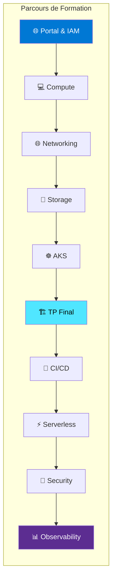
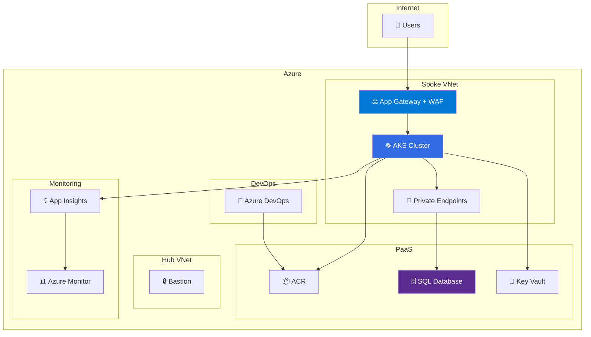

---
tags:
  - formation
  - azure
  - cloud
  - certification
---

# Azure Fundamentals : De l'On-Premise au Cloud Microsoft

## Présentation

Cette formation complète vous guide dans la maîtrise de **Microsoft Azure**, du portail aux services avancés. Conçue pour les administrateurs systèmes et DevOps venant de l'on-premise, elle couvre l'ensemble des services essentiels avec une approche pratique basée sur Azure CLI.



---

## Objectifs de la Formation

À l'issue de cette formation, vous serez capable de :

- :fontawesome-solid-cloud: Naviguer dans le portail Azure et configurer Entra ID
- :fontawesome-solid-server: Déployer et gérer des Virtual Machines et VMSS
- :fontawesome-solid-network-wired: Architecturer des réseaux avec VNet, NSG et Load Balancer
- :fontawesome-solid-database: Utiliser Storage Accounts, SQL Database et Cosmos DB
- :material-kubernetes: Déployer des applications sur AKS avec ACR
- :fontawesome-solid-rocket: Mettre en place des pipelines CI/CD avec Azure DevOps
- :fontawesome-solid-bolt: Créer des solutions serverless avec Functions et Container Apps
- :fontawesome-solid-shield-halved: Sécuriser avec Key Vault, Defender et WAF
- :fontawesome-solid-chart-line: Monitorer avec Azure Monitor et Log Analytics

---

## Public Cible

| Profil | Prérequis |
|--------|-----------|
| Administrateurs systèmes | Expérience Linux/Windows, notions réseau |
| DevOps Engineers | CI/CD, containers, Infrastructure as Code |
| Développeurs | Connaissance d'une stack applicative |
| Architectes Cloud | Expérience on-premise, notions cloud |

---

## Certifications Préparées

Cette formation prépare aux certifications Microsoft Azure :

| Certification | Code | Niveau |
|---------------|------|--------|
| **Azure Fundamentals** | AZ-900 | Débutant |
| **Azure Administrator** | AZ-104 | Intermédiaire |
| **Azure Developer** | AZ-204 | Intermédiaire |

---

## Programme Détaillé

### Semaine 1 : Fondamentaux (14h)

| Module | Titre | Durée | Contenu |
|--------|-------|-------|---------|
| **1** | [Portal & IAM](01-module.md) | 3h | Portail, Subscriptions, Entra ID, RBAC, Azure CLI |
| **2** | [Virtual Machines](02-module.md) | 4h | VM families, Managed Disks, VMSS, Spot VMs |
| **3** | [Networking](03-module.md) | 4h | VNet, NSG, Load Balancer, VPN Gateway, Private Endpoints |
| **4** | [Storage & Databases](04-module.md) | 3h | Storage Accounts, SQL Database, Cosmos DB |

### Semaine 2 : Containers & CI/CD (11h)

| Module | Titre | Durée | Contenu |
|--------|-------|-------|---------|
| **5** | [AKS & Containers](05-module.md) | 4h | ACR, AKS, Node Pools, Workload Identity, KEDA |
| **6** | [TP Final](06-tp-final.md) | 4h | Projet Phoenix : infrastructure production-ready |
| **7** | [CI/CD Azure DevOps](07-module.md) | 3h | Pipelines YAML, Templates, Environments |

### Semaine 3 : Avancé (10h)

| Module | Titre | Durée | Contenu |
|--------|-------|-------|---------|
| **8** | [Serverless](08-module.md) | 3h | Azure Functions, Container Apps, Event Grid |
| **9** | [Security](09-module.md) | 4h | Key Vault, Defender, WAF, Managed Identities |
| **10** | [Observability](10-module.md) | 3h | Azure Monitor, Log Analytics, KQL, Alertes |

---

## Architecture du TP Final

Le projet **Phoenix** intègre tous les concepts vus :



---

## Environnement Technique

### Outils Requis

```bash
# Azure CLI
curl -sL https://aka.ms/InstallAzureCLIDeb | sudo bash

# kubectl
az aks install-cli

# Helm
curl https://raw.githubusercontent.com/helm/helm/main/scripts/get-helm-3 | bash

# Azure DevOps CLI extension
az extension add --name azure-devops

# Vérifier l'installation
az --version
kubectl version --client
helm version
```

### Accès Azure

- Subscription Azure (Pay-As-You-Go ou MSDN recommandé)
- Droits Contributor ou Owner sur un Resource Group
- Azure DevOps Organization

---

## Méthode Pédagogique

Chaque module suit cette structure :

1. **Concepts** : Théorie avec diagrammes Mermaid
2. **Pratique** : Commandes Azure CLI étape par étape
3. **Exercice** : Mise en situation (`!!! example`)
4. **Solution** : Correction détaillée (`??? quote`)

!!! tip "Conseil"
    Réalisez les exercices **avant** de consulter les solutions. L'apprentissage par la pratique est la clé de la maîtrise.

---

## Ressources Complémentaires

| Ressource | Lien |
|-----------|------|
| Documentation Azure | [docs.microsoft.com/azure](https://docs.microsoft.com/azure) |
| Azure Architecture Center | [docs.microsoft.com/azure/architecture](https://docs.microsoft.com/azure/architecture) |
| Microsoft Learn | [learn.microsoft.com](https://learn.microsoft.com) |
| Azure Charts | [azurecharts.com](https://azurecharts.com) |
| Azure Price Calculator | [azure.microsoft.com/pricing/calculator](https://azure.microsoft.com/pricing/calculator) |

---

## Navigation

| Module | Suivant |
|--------|---------|
| Introduction | [Module 1 : Portal & IAM →](01-module.md) |
