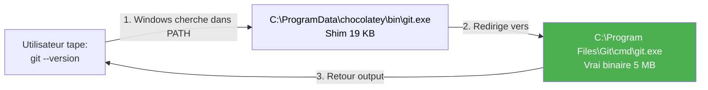
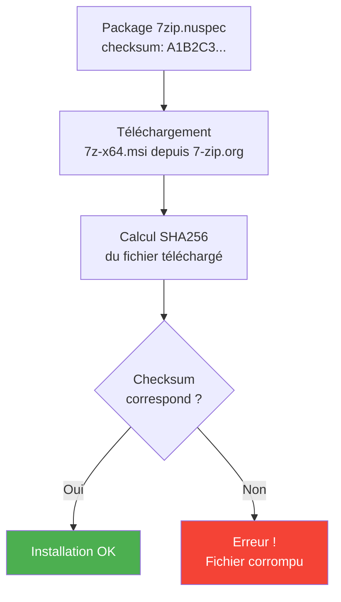

# Module 1 : Les Fondamentaux & CLI

!!! info "Objectifs du module"
    - 🍫 Comprendre l'architecture de Chocolatey (NuGet, Shims, Checksums)
    - 💻 Installer Chocolatey sur Windows
    - 🔍 Maîtriser les commandes CLI essentielles
    - 📦 Gérer les packages (search, install, upgrade, uninstall)
    - 🔒 Sécuriser avec checksums et signatures
    - ✅ Créer un setup automatisé reproductible

---

## 📘 Concept : L'Architecture Chocolatey

### ⚠️ Stop clicking Next > Next > Finish

**Scénario problématique** (Nouveau poste de travail Windows 11) :

> **Le problème** : Vous venez de recevoir un nouveau PC. Vous devez installer vos outils de travail.
>
> ❌ **Méthode manuelle** (2 heures de clics) :
> 1. Ouvrir le navigateur (Edge par défaut)
> 2. Chercher "télécharger Google Chrome"
> 3. Télécharger `ChromeSetup.exe`
> 4. Exécuter l'installer → Next > Next > Finish
> 5. Répéter pour : Firefox, 7zip, VSCode, Git, Postman, Node.js, Python, Docker Desktop...
> 6. **Résultat** : 2 heures perdues, versions aléatoires, pas de traçabilité

**La révolution : Package Manager** 🍫

Sur Linux, depuis 20 ans :
```bash
# Debian/Ubuntu
apt install git vim curl

# RedHat/CentOS
yum install git vim curl
```

Sur Windows, depuis 2011 (Chocolatey) :
```powershell
# Windows
choco install git vscode chrome firefox 7zip -y
```

✅ **Avantages** :
- **Rapidité** : 1 seule commande pour 10 apps → 5 minutes au lieu de 2 heures
- **Reproductibilité** : Même config sur 100 postes (script + packages.config)
- **Versions contrôlées** : `choco install nodejs --version 18.17.0`
- **Mises à jour centralisées** : `choco upgrade all -y`
- **Désinstallation propre** : `choco uninstall` (pas de résidus dans le registre)
- **Automation** : Ansible, GPO, Intune, SCCM

---

### 🏗️ Architecture : NuGet sous le capot

Chocolatey est construit sur **NuGet**, le gestionnaire de packages .NET.

#### 📦 Qu'est-ce qu'un package `.nupkg` ?

Un package Chocolatey (`.nupkg`) est un **fichier ZIP** qui contient :

```text
7zip.9.20.0.nupkg  (fichier ZIP renommé)
│
├── 7zip.nuspec                    # Métadonnées XML (id, version, auteurs)
└── tools/
    ├── chocolateyInstall.ps1      # Script PowerShell pour l'installation
    ├── chocolateyUninstall.ps1    # Script PowerShell pour la désinstallation
    └── 7z-x64.exe                 # (Optionnel) Binaire embarqué
```

**Exemple de `7zip.nuspec`** :

```xml
<?xml version="1.0"?>
<package xmlns="http://schemas.microsoft.com/packaging/2010/07/nuspec.xsd">
  <metadata>
    <id>7zip</id>
    <version>9.20.0</version>
    <authors>Igor Pavlov</authors>
    <description>7-Zip is a file archiver with a high compression ratio.</description>
    <projectUrl>https://www.7-zip.org/</projectUrl>
    <tags>zip compression archiver</tags>
    <licenseUrl>https://www.7-zip.org/license.txt</licenseUrl>
    <requireLicenseAcceptance>false</requireLicenseAcceptance>
    <dependencies>
      <!-- Aucune dépendance -->
    </dependencies>
  </metadata>
</package>
```

**Exemple de `chocolateyInstall.ps1`** :

```powershell
$ErrorActionPreference = 'Stop'

$packageName = '7zip'
$toolsDir = "$(Split-Path -parent $MyInvocation.MyCommand.Definition)"
$url64 = 'https://www.7-zip.org/a/7z920-x64.msi'

$packageArgs = @{
  packageName   = $packageName
  fileType      = 'MSI'
  url64bit      = $url64
  silentArgs    = '/quiet /norestart'
  validExitCodes= @(0, 3010)  # 0 = succès, 3010 = reboot requis
  checksum64    = 'A1B2C3D4E5F6...'  # SHA256
  checksumType64= 'sha256'
}

Install-ChocolateyPackage @packageArgs
```

**💡 Principe** :
1. `choco install 7zip` télécharge `7zip.9.20.0.nupkg` depuis chocolatey.org
2. Décompresse le fichier dans `C:\ProgramData\chocolatey\lib\7zip\`
3. Exécute `chocolateyInstall.ps1` (télécharge le MSI, installe silencieusement)
4. Crée un **shim** pour l'exécutable (voir section suivante)

---

### 🔗 Les Shims : Le Secret de Chocolatey

**Problème** : Comment rendre un exécutable disponible dans PATH sans polluer les variables d'environnement Windows ?

**Solution Chocolatey : Les Shims**

Un **shim** est un petit exécutable `.exe` (19 KB) qui redirige vers le vrai binaire.

**Workflow** :



**Exemple concret** :

```powershell
# Après installation de Git via Chocolatey :
choco install git -y

# Chocolatey crée un shim :
# C:\ProgramData\chocolatey\bin\git.exe  ← Shim (19 KB)

# Qui pointe vers :
# C:\Program Files\Git\cmd\git.exe       ← Vrai binaire (5 MB)

# Le dossier C:\ProgramData\chocolatey\bin est dans PATH
# Donc on peut taper directement :
git --version
# Output : git version 2.43.0.windows.1
```

**💡 Avantages** :
- ✅ **Pas de pollution du PATH** : 1 seul dossier (`C:\ProgramData\chocolatey\bin`) au lieu de 50
- ✅ **Désinstallation propre** : Supprimer le shim = retirer l'accès (sans casser le PATH)
- ✅ **Compatibilité** : Fonctionne même si l'app n'a pas d'installer MSI (juste un .exe)
- ✅ **Versioning** : Permet d'avoir plusieurs versions côte à côte (via shims différents)

**Vérification** :

```powershell
# Lister tous les shims Chocolatey
Get-ChildItem C:\ProgramData\chocolatey\bin\

# Output (exemple) :
# git.exe       (shim)
# code.exe      (shim pour VSCode)
# 7z.exe        (shim pour 7zip)
# node.exe      (shim pour Node.js)
```

---

### 🔒 Sécurité : Validation des Checksums

**Problème** : Comment s'assurer que le fichier téléchargé n'a pas été modifié (MITM attack) ?

**Solution Chocolatey : Checksums SHA256**

Chaque package Chocolatey embarque le **hash SHA256** de l'installer.

**Workflow** :



**Exemple de validation** :

```powershell
# Le script chocolateyInstall.ps1 contient :
$packageArgs = @{
  url64bit      = 'https://www.7-zip.org/a/7z920-x64.msi'
  checksum64    = 'A1B2C3D4E5F6789ABCDEF0123456789...'  # SHA256 attendu
  checksumType64= 'sha256'
}

Install-ChocolateyPackage @packageArgs

# Si le fichier téléchargé a un hash différent :
# ERROR: Checksum for 'C:\Users\...\7z920-x64.msi' did not meet expectations.
#   Expected: A1B2C3D4E5F6789ABCDEF0123456789...
#   Actual:   Z9Y8X7W6V5U4T3S2R1Q0P9O8N7M6L5K4...
# Installation aborted!
```

**💡 Avantages** :
- ✅ **Protection MITM** : Impossible d'injecter un malware si le hash ne correspond pas
- ✅ **Intégrité** : Détecte les fichiers corrompus (téléchargement incomplet)
- ✅ **Traçabilité** : Chaque version a un hash unique (audit)

**Générer un checksum** (pour créer un package) :

```powershell
# Télécharger le fichier
Invoke-WebRequest -Uri "https://www.7-zip.org/a/7z920-x64.msi" -OutFile "7z920-x64.msi"

# Calculer le SHA256
Get-FileHash -Path "7z920-x64.msi" -Algorithm SHA256

# Output :
# Algorithm       Hash
# ---------       ----
# SHA256          A1B2C3D4E5F6789ABCDEF0123456789ABCDEF0123456789ABCDEF0123456789
```

---

## 💻 Pratique : Installation & CLI

### 🚀 Étape 1 : Installation de Chocolatey

**Prérequis** :
- Windows 10/11 ou Windows Server 2016+
- PowerShell 5.1+ (vérifier avec `$PSVersionTable.PSVersion`)
- Connexion Internet (pour télécharger depuis chocolatey.org)

**Installation (One-Liner)** :

```powershell
# Ouvrir PowerShell en Administrateur (OBLIGATOIRE)
# Méthode 1 : Clic droit sur PowerShell > "Run as Administrator"
# Méthode 2 : Win+X > Windows PowerShell (Admin)

# Autoriser l'exécution de scripts (temporaire)
Set-ExecutionPolicy Bypass -Scope Process -Force

# Installer Chocolatey
[System.Net.ServicePointManager]::SecurityProtocol = [System.Net.ServicePointManager]::SecurityProtocol -bor 3072
iex ((New-Object System.Net.WebClient).DownloadString('https://community.chocolatey.org/install.ps1'))

# Durée : 10-30 secondes

# Output attendu :
# Chocolatey v2.2.2
# Chocolatey is now ready.
# You can call choco from normal powershell now.
```

**Vérification** :

```powershell
# Vérifier la version installée
choco --version
# Output : 2.2.2

# Vérifier le chemin d'installation
$env:ChocolateyInstall
# Output : C:\ProgramData\chocolatey

# Tester une recherche
choco search git --exact
# Output : git 2.43.0
```

!!! warning "PowerShell Administrateur obligatoire"
    Chocolatey nécessite des droits admin pour installer des logiciels. Sinon, erreur :
    ```text
    Access to the path 'C:\ProgramData\chocolatey' is denied.
    ```

---

### 🔍 Étape 2 : Recherche de packages

```powershell
# Rechercher un package
choco search vscode

# Output (extrait) :
# vscode 1.85.1
# vscode-insiders 1.86.0
# visualstudio2022community 17.8.3
# ...

# Recherche exacte (nom précis)
choco search vscode --exact

# Output :
# vscode 1.85.1

# Recherche avec filtre (approuvés uniquement)
choco search vscode --approved-only

# Recherche locale (packages déjà installés)
choco list --local-only
# ou
choco list -l
```

---

### ℹ️ Étape 3 : Informations sur un package

```powershell
# Obtenir des détails sur un package
choco info vscode

# Output :
# vscode 1.85.1
#  Title: Visual Studio Code
#  Authors: Microsoft
#  Summary: Visual Studio Code is a lightweight but powerful source code editor.
#  Published: 2024-01-15
#  Package url: https://community.chocolatey.org/packages/vscode
#  Download url: https://update.code.visualstudio.com/latest/win32-x64-user/stable
#  Checksum: ABC123...
#  Tags: vscode editor microsoft ide
#  Dependencies: dotnet4.5.2
```

---

### 📦 Étape 4 : Installation de packages

```powershell
# Installer un package (interactif)
choco install git

# Output :
# Do you want to run the script? ([Y]es/[A]ll - yes to all/[N]o/[P]rint):
# → Taper 'Y' pour installer

# Installer SANS confirmation (automatique)
choco install git -y

# Installer plusieurs packages
choco install git vscode firefox 7zip -y

# Installer une version spécifique
choco install nodejs --version 18.17.0 -y

# Installer en forçant (réinstaller si déjà présent)
choco install git --force -y
```

**💡 Options utiles** :

| Option | Description | Exemple |
|--------|-------------|---------|
| `-y` | Répondre 'Yes' automatiquement | `choco install git -y` |
| `--version` | Installer une version spécifique | `choco install nodejs --version 18.17.0` |
| `--force` | Forcer la réinstallation | `choco install git --force` |
| `--params` | Passer des paramètres à l'installer | `choco install vscode --params "/NoDesktopIcon"` |
| `--install-arguments` | Arguments pour l'installer MSI/EXE | `choco install 7zip --ia "/D=C:\Tools\7zip"` |

---

### 🔄 Étape 5 : Mise à jour de packages

```powershell
# Mettre à jour UN package
choco upgrade git -y

# Mettre à jour TOUS les packages (recommandé)
choco upgrade all -y

# Output (exemple) :
# Chocolatey upgraded 5/10 packages.
#  - git v2.43.0 upgraded from v2.42.0
#  - vscode v1.85.1 upgraded from v1.84.2
#  - firefox v121.0 upgraded from v120.0
#  - 7zip v23.01 upgraded from v22.01
#  - nodejs (pinned) skipped
```

**💡 Bonnes pratiques** :
- Exécuter `choco upgrade all -y` **1×/semaine** (automatiser via Scheduled Task)
- Tester les mises à jour en Dev avant Prod (éviter les régressions)

---

### 🗑️ Étape 6 : Désinstallation

```powershell
# Désinstaller un package
choco uninstall firefox -y

# Désinstaller AVEC suppression des données utilisateur (optionnel)
choco uninstall firefox -y --remove-dependencies

# Désinstaller sans confirmation
choco uninstall git vscode -y
```

---

### 📌 Étape 7 : Épingler une version (Pin)

**Problème** : Vous voulez que `nodejs` reste en version `18.17.0` (ne pas upgrader vers 20.x).

**Solution : Pin**

```powershell
# Installer Node.js 18.17.0
choco install nodejs --version 18.17.0 -y

# Épingler la version actuelle (empêche les upgrades)
choco pin add -n nodejs

# Output :
# Successful: nodejs is now pinned to version 18.17.0.

# Vérifier les packages épinglés
choco pin list

# Output :
# nodejs - 18.17.0

# Tenter une mise à jour globale
choco upgrade all -y

# Output :
# nodejs (pinned) | Skipped
```

**Retirer un pin** :

```powershell
# Retirer le pin
choco pin remove -n nodejs

# Output :
# nodejs is now unpinned.
```

**💡 Cas d'usage** :
- Applications legacy qui nécessitent une version spécifique (ex: Node.js 16 pour un projet)
- Éviter les breaking changes (ex: Python 3.11 → 3.12)

---

### 🔑 Étape 8 : Configurer une clé API (Private Repo)

**Contexte** : Vous avez un repository Chocolatey privé (voir Module 3).

```powershell
# Ajouter une source privée
choco source add -n internal -s http://choco.corp.local

# Configurer la clé API pour pousser des packages
choco apikey add -s http://choco.corp.local -k "ABC123-DEF456-GHI789"

# Vérifier les sources
choco source list

# Output :
# chocolatey - https://community.chocolatey.org/api/v2/ | Priority 0
# internal - http://choco.corp.local | Priority 0
```

---

### 📋 Étape 9 : Export/Import de configuration

**Exporter la liste des packages installés** :

```powershell
# Exporter au format XML (packages.config)
choco export C:\Temp\packages.config

# Contenu du fichier (exemple) :
# <?xml version="1.0" encoding="utf-8"?>
# <packages>
#   <package id="git" version="2.43.0" />
#   <package id="vscode" version="1.85.1" />
#   <package id="firefox" version="121.0" />
#   <package id="7zip" version="23.01" />
#   <package id="nodejs" version="18.17.0" />
# </packages>
```

**Importer sur un nouveau poste** :

```powershell
# Installer tous les packages du fichier
choco install C:\Temp\packages.config -y

# Chocolatey lit le XML et installe tous les packages avec les versions spécifiées
```

---

## 🎓 Exercice : "Mon Setup Automatisé"

### 📋 Contexte

Vous venez de recevoir un nouveau PC Windows 11 pour votre poste de développeur web. Vous devez installer rapidement tous vos outils de travail.

**Contrainte** : Vous devez pouvoir reproduire cette installation sur 10 postes identiques (équipe de développeurs).

---

### 🎯 Objectifs

1. ✅ Installer Chocolatey sur le poste
2. ✅ Installer les packages suivants :
   - **Git** (version control)
   - **Visual Studio Code** (éditeur de code)
   - **Firefox** (navigateur)
   - **7zip** (compression)
3. ✅ Installer **Node.js version 18.17.0** (projet legacy)
4. ✅ Épingler Node.js pour éviter les mises à jour automatiques
5. ✅ Exporter la configuration dans `C:\Temp\my-setup.config`
6. ✅ Créer un script `setup-dev-machine.ps1` pour automatiser tout le processus

---

### 📝 Travail à réaliser

Créez un script PowerShell qui automatise l'installation complète :

```powershell
# setup-dev-machine.ps1
# Auteur : Votre nom
# Date : 22/11/2025
# Description : Configuration automatisée d'un poste de développeur

#Requires -RunAsAdministrator

# TODO 1 : Vérifier si Chocolatey est installé (sinon, l'installer)

# TODO 2 : Installer les packages de base (git, vscode, firefox, 7zip)

# TODO 3 : Installer Node.js 18.17.0

# TODO 4 : Épingler Node.js

# TODO 5 : Exporter la configuration

# TODO 6 : Afficher un résumé (packages installés, versions)
```

---

### ✅ Critères de validation

| Critère | Vérification |
|---------|--------------|
| Chocolatey installé | `choco --version` → 2.2.2 (ou supérieur) |
| Git installé | `git --version` → git version 2.43.0 |
| VSCode installé | `code --version` → 1.85.1 |
| Firefox installé | Présent dans `choco list -l` |
| 7zip installé | `7z` accessible dans PATH |
| Node.js 18.17.0 | `node --version` → v18.17.0 |
| Node.js épinglé | `choco pin list` → nodejs - 18.17.0 |
| Config exportée | `Test-Path C:\Temp\my-setup.config` → True |

---

### 💡 Solution complète

??? quote "Cliquez pour révéler la solution"

    ```powershell
    # setup-dev-machine.ps1
    # Configuration automatisée d'un poste de développeur
    # Auteur : ShellBook Training
    # Date : 22/11/2025

    #Requires -RunAsAdministrator

    # ============================================
    # VÉRIFICATION PRÉALABLE
    # ============================================
    Write-Host "`n=========================================" -ForegroundColor Cyan
    Write-Host "  SETUP POSTE DÉVELOPPEUR - CHOCOLATEY  " -ForegroundColor Cyan
    Write-Host "=========================================`n" -ForegroundColor Cyan

    # CHECK : Droits admin
    if (-not ([Security.Principal.WindowsPrincipal][Security.Principal.WindowsIdentity]::GetCurrent()).IsInRole([Security.Principal.WindowsBuiltInRole]::Administrator)) {
        Write-Host "❌ Ce script doit être exécuté en tant qu'Administrateur." -ForegroundColor Red
        exit 1
    }
    Write-Host "✅ CHECK : Droits administrateur OK" -ForegroundColor Green

    # ============================================
    # ÉTAPE 1 : INSTALLATION CHOCOLATEY
    # ============================================
    Write-Host "`n[1/6] Vérification de Chocolatey..." -ForegroundColor Cyan

    # Vérifier si Chocolatey est installé
    $ChocoInstalled = Get-Command choco -ErrorAction SilentlyContinue

    if (-not $ChocoInstalled) {
        Write-Host "ℹ️  Chocolatey non installé. Installation en cours..." -ForegroundColor Yellow

        # Autoriser l'exécution de scripts
        Set-ExecutionPolicy Bypass -Scope Process -Force

        # Installer Chocolatey
        [System.Net.ServicePointManager]::SecurityProtocol = [System.Net.ServicePointManager]::SecurityProtocol -bor 3072
        iex ((New-Object System.Net.WebClient).DownloadString('https://community.chocolatey.org/install.ps1'))

        Write-Host "✅ Chocolatey installé avec succès" -ForegroundColor Green
    } else {
        $ChocoVersion = choco --version
        Write-Host "✅ Chocolatey déjà installé (version $ChocoVersion)" -ForegroundColor Green
    }

    # Rafraîchir l'environnement (pour rendre 'choco' disponible)
    $env:Path = [System.Environment]::GetEnvironmentVariable("Path","Machine") + ";" + [System.Environment]::GetEnvironmentVariable("Path","User")

    # ============================================
    # ÉTAPE 2 : INSTALLATION DES PACKAGES DE BASE
    # ============================================
    Write-Host "`n[2/6] Installation des packages de base..." -ForegroundColor Cyan

    $BasePackages = @("git", "vscode", "firefox", "7zip")

    foreach ($Package in $BasePackages) {
        Write-Host "  📦 Installation de $Package..." -ForegroundColor White
        choco install $Package -y --no-progress | Out-Null

        # Vérifier l'installation
        $Installed = choco list --local-only | Select-String -Pattern "^$Package "
        if ($Installed) {
            Write-Host "  ✅ $Package installé" -ForegroundColor Green
        } else {
            Write-Host "  ❌ Échec installation $Package" -ForegroundColor Red
        }
    }

    # ============================================
    # ÉTAPE 3 : INSTALLATION NODE.JS 18.17.0
    # ============================================
    Write-Host "`n[3/6] Installation de Node.js 18.17.0..." -ForegroundColor Cyan

    choco install nodejs --version 18.17.0 -y --no-progress | Out-Null

    # Vérifier la version
    $env:Path = [System.Environment]::GetEnvironmentVariable("Path","Machine") + ";" + [System.Environment]::GetEnvironmentVariable("Path","User")
    $NodeVersion = node --version 2>$null

    if ($NodeVersion -like "*18.17.0*") {
        Write-Host "✅ Node.js 18.17.0 installé" -ForegroundColor Green
    } else {
        Write-Host "⚠️  Node.js installé mais version différente : $NodeVersion" -ForegroundColor Yellow
    }

    # ============================================
    # ÉTAPE 4 : ÉPINGLER NODE.JS
    # ============================================
    Write-Host "`n[4/6] Épinglage de Node.js..." -ForegroundColor Cyan

    choco pin add -n nodejs | Out-Null
    Write-Host "✅ Node.js épinglé à la version 18.17.0" -ForegroundColor Green

    # ============================================
    # ÉTAPE 5 : EXPORT DE LA CONFIGURATION
    # ============================================
    Write-Host "`n[5/6] Export de la configuration..." -ForegroundColor Cyan

    $ConfigPath = "C:\Temp\my-setup.config"

    # Créer le dossier si nécessaire
    if (-not (Test-Path "C:\Temp")) {
        New-Item -Path "C:\Temp" -ItemType Directory -Force | Out-Null
    }

    # Exporter la config
    choco export $ConfigPath --include-version-numbers | Out-Null

    if (Test-Path $ConfigPath) {
        Write-Host "✅ Configuration exportée : $ConfigPath" -ForegroundColor Green
    } else {
        Write-Host "❌ Échec export configuration" -ForegroundColor Red
    }

    # ============================================
    # ÉTAPE 6 : RÉSUMÉ FINAL
    # ============================================
    Write-Host "`n[6/6] Génération du résumé..." -ForegroundColor Cyan

    # Récupérer la liste des packages installés
    $InstalledPackages = choco list --local-only

    Write-Host "`n=========================================" -ForegroundColor Cyan
    Write-Host "           RÉSUMÉ DE L'INSTALLATION      " -ForegroundColor Cyan
    Write-Host "=========================================`n" -ForegroundColor Cyan

    Write-Host "📦 Packages installés :" -ForegroundColor White
    Write-Host ""

    # Afficher les détails de chaque package
    $PackageDetails = @(
        @{Name="Chocolatey"; Command="choco --version"},
        @{Name="Git"; Command="git --version"},
        @{Name="VSCode"; Command="code --version"},
        @{Name="Node.js"; Command="node --version"},
        @{Name="NPM"; Command="npm --version"}
    )

    foreach ($Package in $PackageDetails) {
        $Version = try {
            & $Package.Command 2>&1 | Select-Object -First 1
        } catch {
            "Non disponible"
        }
        Write-Host "  ✅ $($Package.Name) : $Version" -ForegroundColor Green
    }

    Write-Host ""
    Write-Host "🔒 Packages épinglés :" -ForegroundColor White
    choco pin list | ForEach-Object {
        if ($_ -match "^(\w+) - (.+)$") {
            Write-Host "  📌 $($matches[1]) : $($matches[2])" -ForegroundColor Yellow
        }
    }

    Write-Host ""
    Write-Host "📄 Configuration exportée :" -ForegroundColor White
    Write-Host "  $ConfigPath" -ForegroundColor Gray

    Write-Host ""
    Write-Host "=========================================" -ForegroundColor Cyan
    Write-Host "        INSTALLATION TERMINÉE !          " -ForegroundColor Cyan
    Write-Host "=========================================`n" -ForegroundColor Cyan

    Write-Host "💡 Pour reproduire cette config sur un autre poste :" -ForegroundColor White
    Write-Host "   choco install $ConfigPath -y`n" -ForegroundColor Yellow

    Write-Host "💡 Pour mettre à jour tous les packages (sauf épinglés) :" -ForegroundColor White
    Write-Host "   choco upgrade all -y`n" -ForegroundColor Yellow
    ```

    **Exécution** :
    ```powershell
    # Ouvrir PowerShell en Administrateur
    # Win+X > Windows PowerShell (Admin)

    # Exécuter le script
    .\setup-dev-machine.ps1
    ```

    **Output attendu** :
    ```bash
    =========================================
      SETUP POSTE DÉVELOPPEUR - CHOCOLATEY
    =========================================

    ✅ CHECK : Droits administrateur OK

    [1/6] Vérification de Chocolatey...
    ✅ Chocolatey déjà installé (version 2.2.2)

    [2/6] Installation des packages de base...
      📦 Installation de git...
      ✅ git installé
      📦 Installation de vscode...
      ✅ vscode installé
      📦 Installation de firefox...
      ✅ firefox installé
      📦 Installation de 7zip...
      ✅ 7zip installé

    [3/6] Installation de Node.js 18.17.0...
    ✅ Node.js 18.17.0 installé

    [4/6] Épinglage de Node.js...
    ✅ Node.js épinglé à la version 18.17.0

    [5/6] Export de la configuration...
    ✅ Configuration exportée : C:\Temp\my-setup.config

    [6/6] Génération du résumé...

    =========================================
               RÉSUMÉ DE L'INSTALLATION
    =========================================

    📦 Packages installés :

      ✅ Chocolatey : 2.2.2
      ✅ Git : git version 2.43.0.windows.1
      ✅ VSCode : 1.85.1
      ✅ Node.js : v18.17.0
      ✅ NPM : 9.6.7

    🔒 Packages épinglés :
      📌 nodejs : 18.17.0

    📄 Configuration exportée :
      C:\Temp\my-setup.config

    =========================================
            INSTALLATION TERMINÉE !
    =========================================

    💡 Pour reproduire cette config sur un autre poste :
       choco install C:\Temp\my-setup.config -y

    💡 Pour mettre à jour tous les packages (sauf épinglés) :
       choco upgrade all -y
    ```

    **Fichier `my-setup.config` généré** :
    ```xml
    <?xml version="1.0" encoding="utf-8"?>
    <packages>
      <package id="chocolatey" version="2.2.2" />
      <package id="chocolatey-core.extension" version="1.4.0" />
      <package id="git" version="2.43.0" />
      <package id="git.install" version="2.43.0" />
      <package id="vscode" version="1.85.1" />
      <package id="vscode.install" version="1.85.1" />
      <package id="firefox" version="121.0" />
      <package id="7zip" version="23.01" />
      <package id="7zip.install" version="23.01" />
      <package id="nodejs" version="18.17.0" />
      <package id="nodejs.install" version="18.17.0" />
    </packages>
    ```

---

## 🎯 Points clés à retenir

!!! success "Checklist Module 1"
    - ✅ **Chocolatey = Package Manager pour Windows** (révolution depuis 2011)
    - ✅ **Architecture** : NuGet (`.nupkg` = ZIP + métadonnées + scripts PS1)
    - ✅ **Shims** : Redirecteurs 19 KB dans `C:\ProgramData\chocolatey\bin` (évite pollution PATH)
    - ✅ **Sécurité** : Validation checksums SHA256 (protection MITM)
    - ✅ **Installation** : One-liner PowerShell (Set-ExecutionPolicy Bypass)
    - ✅ **Workflow** : `search` → `info` → `install -y` → `upgrade all -y`
    - ✅ **Pin** : `choco pin add -n nodejs` (empêche les upgrades)
    - ✅ **Export/Import** : `choco export packages.config` (reproductibilité)
    - ✅ **Automation** : Scripts PowerShell + Scheduled Tasks

---

## 🔗 Ressources complémentaires

- [Documentation officielle Chocolatey](https://docs.chocolatey.org/)
- [Chocolatey CLI Reference](https://docs.chocolatey.org/en-us/choco/commands/)
- [Community Package Repository](https://community.chocolatey.org/packages)
- [Chocolatey Gallery (recherche packages)](https://community.chocolatey.org/)

---

## ➡️ Prochaine étape

Rendez-vous au **Module 2 : Création de Paquets (Packaging)** pour apprendre à :
- Créer un package personnalisé (`.nuspec` + `chocolateyInstall.ps1`)
- Packager une application MSI/EXE
- Générer des checksums
- Tester localement avec `choco pack`
- Gérer les dépendances entre packages

---

!!! quote "Citation du formateur"
    *"Chocolatey transforme 2 heures de clics en 5 minutes de script. Et ce script, vous pouvez le rejouer 1000 fois sans erreur."* — ShellBook Training

---

**Retour au :** [Programme de la Formation](index.md) | [Catalogue des Formations](../index.md)

---

## Navigation

| | |
|:---|---:|
| [← Programme](index.md) | [Module 2 : Création de Paquets - Deve... →](02-module.md) |

[Retour au Programme](index.md){ .md-button }
