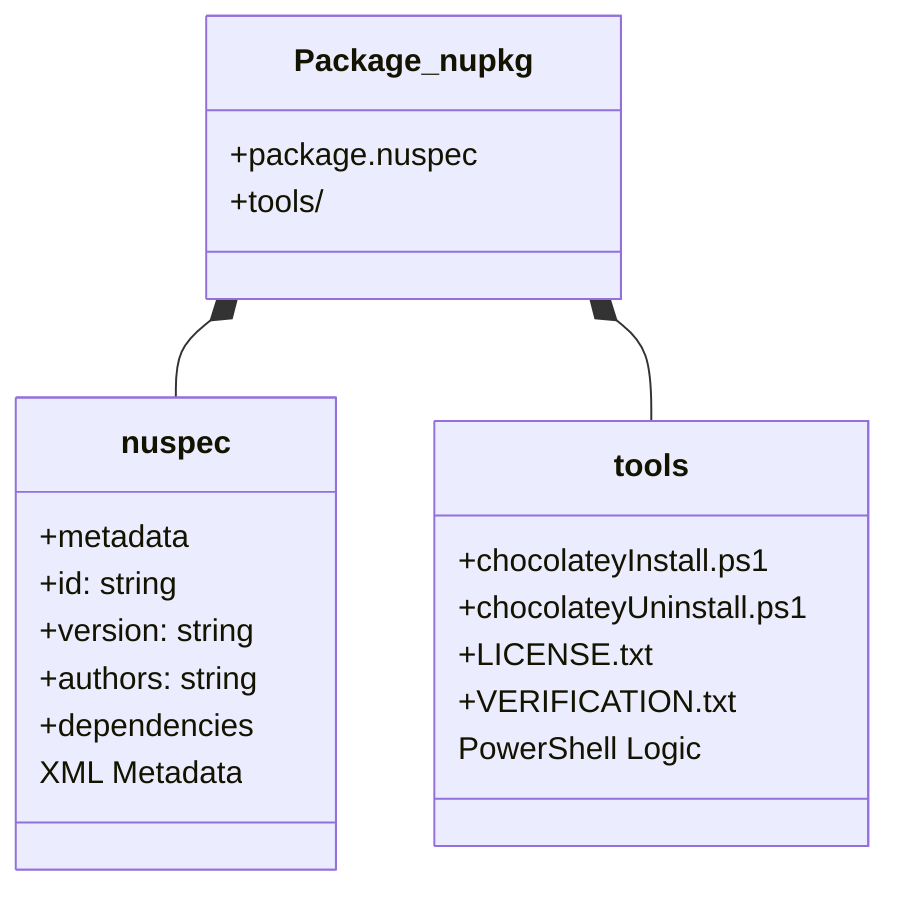

---
tags:
  - chocolatey
  - packaging
  - nuspec
  - automation
---

# Module 2 : Création de Paquets - Devenir Mainteneur

## Introduction

> **"Don't just consume packages, create them."**

Jusqu'ici, vous avez utilisé Chocolatey comme **consommateur** : installation, mise à jour, désinstallation de packages existants. Mais la vraie puissance de Chocolatey réside dans sa capacité à **standardiser n'importe quelle installation**.

**Qu'est-ce qu'un package Chocolatey ?**

Un package Chocolatey est une **archive NuGet** (`.nupkg`) qui encapsule :

- **Métadonnées** : Nom, version, auteurs, dépendances (fichier `.nuspec`)
- **Automation** : Scripts PowerShell pour installer/désinstaller l'application
- **Checksums** : Garantir l'intégrité des fichiers téléchargés

**Pourquoi créer vos propres packages ?**

| Cas d'usage | Exemple |
|-------------|---------|
| **Apps internes** | ERP maison, outils legacy sans MSI moderne |
| **Apps non communautaires** | Logiciels métier non présents sur chocolatey.org |
| **Personnalisation** | Pré-configuration d'une app (Firefox avec proxy d'entreprise) |
| **Conformité** | Versionner exactement les binaires validés par la sécurité |

Dans ce module, vous allez apprendre à :

- ✅ Comprendre l'anatomie d'un package Chocolatey
- ✅ Générer un squelette avec `choco new`
- ✅ Utiliser les helpers PowerShell (`Install-ChocolateyPackage`)
- ✅ Gérer les checksums pour la sécurité
- ✅ Packager et tester en local

---

## Concept : Anatomie d'un Package

### Structure d'un `.nupkg`

Un fichier `.nupkg` est une archive **ZIP** renommée contenant :



### Les Fichiers Clés

#### 1. `package.nuspec` (Métadonnées)

Fichier **XML** décrivant le package :

```xml
<?xml version="1.0" encoding="utf-8"?>
<package xmlns="http://schemas.microsoft.com/packaging/2015/06/nuspec.xsd">
  <metadata>
    <!-- Identité -->
    <id>corpapp</id>
    <version>1.0.0</version>
    <title>CorpApp (Install)</title>

    <!-- Authoring -->
    <authors>IT Department</authors>
    <owners>SysOps Team</owners>

    <!-- Description -->
    <summary>Internal CRM application</summary>
    <description>Legacy enterprise application for sales tracking</description>

    <!-- Legal -->
    <licenseUrl>http://intranet/corpapp/license</licenseUrl>
    <requireLicenseAcceptance>false</requireLicenseAcceptance>

    <!-- Dependencies -->
    <dependencies>
      <dependency id="dotnet-runtime" version="6.0.0" />
    </dependencies>
  </metadata>
</package>
```

**Champs critiques :**

| Champ | Importance | Exemple |
|-------|------------|---------|
| `<id>` | Identifiant unique (comme un nom de domaine) | `corpapp` |
| `<version>` | Semantic Versioning (MAJOR.MINOR.PATCH) | `1.2.5` |
| `<dependencies>` | Packages requis (installés automatiquement) | `<dependency id="vcredist140" />` |

#### 2. `tools/chocolateyInstall.ps1` (Logique d'Installation)

Script PowerShell exécuté lors de `choco install` :

```powershell
$ErrorActionPreference = 'Stop'

$packageName = 'corpapp'
$toolsDir = "$(Split-Path -parent $MyInvocation.MyCommand.Definition)"
$url = 'http://intranet/CorpApp.msi'
$checksum = 'ABC123...'
$checksumType = 'sha256'

$packageArgs = @{
  packageName   = $packageName
  fileType      = 'MSI'
  url           = $url
  checksum      = $checksum
  checksumType  = $checksumType
  silentArgs    = '/qn /norestart'
  validExitCodes= @(0, 3010, 1641)
}

Install-ChocolateyPackage @packageArgs
```

**Le Helper `Install-ChocolateyPackage` fait TOUT :**

1. ⬇️ **Télécharge** le fichier depuis `$url`
2. 🔐 **Vérifie** le checksum (si fourni)
3. 🚀 **Exécute** le MSI avec les arguments silencieux (`/qn`)
4. ✅ **Valide** le code de sortie (0 = succès, 3010 = reboot requis)

#### 3. `tools/chocolateyUninstall.ps1` (Logique de Désinstallation)

Script pour `choco uninstall` :

```powershell
$ErrorActionPreference = 'Stop'

$packageName = 'corpapp'
$softwareName = 'CorpApp*'  # Wildcard pour trouver dans Add/Remove Programs

[array]$key = Get-UninstallRegistryKey -SoftwareName $softwareName

if ($key.Count -eq 1) {
  $key | ForEach-Object {
    $packageArgs = @{
      packageName   = $packageName
      fileType      = 'MSI'
      silentArgs    = "$($_.PSChildName) /qn /norestart"
      validExitCodes= @(0, 3010, 1605, 1614, 1641)
    }

    Uninstall-ChocolateyPackage @packageArgs
  }
} elseif ($key.Count -eq 0) {
  Write-Warning "$packageName has already been uninstalled by other means."
} else {
  Write-Warning "$($key.Count) matches found!"
}
```

---

## Pratique : Le Workflow de Packaging

### Étape 1 : Scaffolding (`choco new`)

Générer un squelette de package :

```powershell
choco new corpapp
```

**Sortie :**

```text
Creating a new package specification at G:\Chocolatey\corpapp
Generating template to a file at 'G:\Chocolatey\corpapp\corpapp.nuspec'
Generating template to a file at 'G:\Chocolatey\corpapp\tools\chocolateyinstall.ps1'
Generating template to a file at 'G:\Chocolatey\corpapp\tools\chocolateyuninstall.ps1'
Successfully generated corpapp package specification files
```

**Structure créée :**

```text
corpapp/
├── corpapp.nuspec
├── tools/
│   ├── chocolateyInstall.ps1
│   ├── chocolateyUninstall.ps1
│   └── chocolateyBeforeModify.ps1
└── ReadMe.md
```

---

### Étape 2 : Éditer le `.nuspec`

Ouvrez `corpapp.nuspec` et personnalisez :

```xml
<?xml version="1.0" encoding="utf-8"?>
<package xmlns="http://schemas.microsoft.com/packaging/2015/06/nuspec.xsd">
  <metadata>
    <id>corpapp</id>
    <version>1.0.0</version>
    <title>CorpApp</title>
    <authors>IT Department</authors>
    <owners>SysOps</owners>
    <summary>Internal CRM application</summary>
    <description>Legacy enterprise application for sales tracking</description>
    <tags>internal crm corpapp</tags>
  </metadata>
</package>
```

**Points d'attention :**

- **`<id>`** : Tout en minuscules, sans espaces (utiliser `-` à la place)
- **`<version>`** : Respecter SemVer (`1.0.0`, pas `1.0`)
- **`<tags>`** : Mots-clés séparés par des espaces (pas de virgules)

---

### Étape 3 : Éditer `chocolateyInstall.ps1`

#### 3.1. Obtenir le Checksum

Téléchargez le MSI et calculez son hash :

```powershell
# Télécharger le fichier
Invoke-WebRequest -Uri "http://intranet/CorpApp.msi" -OutFile "C:\Temp\CorpApp.msi"

# Calculer le checksum SHA256
Get-FileHash "C:\Temp\CorpApp.msi" -Algorithm SHA256
```

**Sortie :**

```text
Algorithm       Hash                                                                   Path
---------       ----                                                                   ----
SHA256          E3B0C44298FC1C149AFBF4C8996FB92427AE41E4649B934CA495991B7852B855       C:\Temp\CorpApp.msi
```

Copiez la valeur `Hash`.

#### 3.2. Configurer le Script

Éditez `tools/chocolateyInstall.ps1` :

```powershell
$ErrorActionPreference = 'Stop'

$packageName = 'corpapp'
$toolsDir = "$(Split-Path -parent $MyInvocation.MyCommand.Definition)"
$url = 'http://intranet/CorpApp.msi'

# ⚠️ IMPORTANT : Remplacer par le vrai checksum
$checksum = 'E3B0C44298FC1C149AFBF4C8996FB92427AE41E4649B934CA495991B7852B855'
$checksumType = 'sha256'

$packageArgs = @{
  packageName   = $packageName
  fileType      = 'MSI'
  url           = $url
  checksum      = $checksum
  checksumType  = $checksumType

  # Arguments pour installation silencieuse MSI
  silentArgs    = "/qn /norestart /l*v `"$($env:TEMP)\$($packageName).$($env:chocolateyPackageVersion).MsiInstall.log`""
  validExitCodes= @(0, 3010, 1641)
}

Install-ChocolateyPackage @packageArgs
```

**Arguments MSI courants :**

| Argument | Description |
|----------|-------------|
| `/qn` | Mode silencieux sans UI |
| `/norestart` | Ne pas redémarrer automatiquement |
| `/l*v "file.log"` | Log verbeux |
| `INSTALLDIR="C:\Path"` | Personnaliser le répertoire d'installation |

**Exit Codes MSI :**

| Code | Signification |
|------|---------------|
| `0` | Succès |
| `3010` | Succès mais reboot requis |
| `1641` | Installation réussie, reboot initié |
| `1618` | Installation déjà en cours |

---

### Étape 4 : Packager (`choco pack`)

Créer le fichier `.nupkg` :

```powershell
cd C:\Chocolatey\corpapp
choco pack
```

**Sortie :**

```sql
Attempting to build package from 'corpapp.nuspec'.
Successfully created package 'C:\Chocolatey\corpapp\corpapp.1.0.0.nupkg'
```

**Le fichier `.nupkg` est créé !**

---

### Étape 5 : Tester en Local

Installer le package depuis le répertoire local :

```powershell
choco install corpapp -source . -y
```

**Explication :**

- `-source .` : Utiliser le répertoire courant comme source (au lieu de chocolatey.org)
- `-y` : Approuver automatiquement

**Vérifier l'installation :**

```powershell
choco list --local-only corpapp
```

**Sortie attendue :**

```text
Chocolatey v2.2.2
corpapp 1.0.0
1 packages installed.
```

---

### Étape 6 : Tester la Désinstallation

```powershell
choco uninstall corpapp -y
```

**Vérifier :**

```powershell
choco list --local-only corpapp
```

**Sortie attendue :**

```text
Chocolatey v2.2.2
0 packages installed.
```

---

## Les Helpers PowerShell Essentiels

Chocolatey fournit des **helpers** pour simplifier le packaging.

### `Install-ChocolateyPackage`

Le helper universel pour installer des binaires.

**Syntaxe :**

```powershell
Install-ChocolateyPackage `
  -PackageName 'nom' `
  -FileType 'EXE|MSI|MSU' `
  -Url 'http://url' `
  -Url64bit 'http://url64' `
  -Checksum 'ABC123...' `
  -ChecksumType 'sha256' `
  -SilentArgs '/S /VERYSILENT' `
  -ValidExitCodes @(0, 3010)
```

**Paramètres :**

| Paramètre | Description | Exemple |
|-----------|-------------|---------|
| `PackageName` | Nom du package | `'firefox'` |
| `FileType` | Type d'installeur | `'EXE'`, `'MSI'`, `'MSU'` |
| `Url` | URL 32-bit | `'http://example.com/app.exe'` |
| `Url64bit` | URL 64-bit (optionnel) | `'http://example.com/app64.exe'` |
| `Checksum` | Hash SHA256 du fichier | `'E3B0C44...'` |
| `SilentArgs` | Arguments pour installation silencieuse | `'/qn /norestart'` (MSI)<br>`'/S'` (NSIS)<br>`'/VERYSILENT'` (Inno Setup) |
| `ValidExitCodes` | Codes de retour acceptables | `@(0, 3010, 1641)` |

---

### `Install-ChocolateyZipPackage`

Pour les archives ZIP (pas d'installeur).

**Syntaxe :**

```powershell
Install-ChocolateyZipPackage `
  -PackageName 'portableapp' `
  -Url 'http://example.com/app.zip' `
  -UnzipLocation "$(Split-Path -parent $MyInvocation.MyCommand.Definition)" `
  -Checksum 'ABC123...' `
  -ChecksumType 'sha256'
```

**Exemple (7-Zip Portable) :**

```powershell
$toolsDir = "$(Split-Path -parent $MyInvocation.MyCommand.Definition)"

Install-ChocolateyZipPackage `
  -PackageName '7zip-portable' `
  -Url 'https://www.7-zip.org/a/7z2301-extra.7z' `
  -UnzipLocation $toolsDir `
  -Checksum 'F6D6F4EEB1C...' `
  -ChecksumType 'sha256'
```

---

### `Get-ChocolateyWebFile`

Télécharger un fichier sans l'installer.

**Syntaxe :**

```powershell
Get-ChocolateyWebFile `
  -PackageName 'myapp' `
  -FileFullPath 'C:\Temp\installer.exe' `
  -Url 'http://example.com/installer.exe' `
  -Checksum 'ABC123...' `
  -ChecksumType 'sha256'
```

---

### `Install-ChocolateyInstallPackage`

Pour installer un fichier **déjà téléchargé**.

**Syntaxe :**

```powershell
$fileLocation = 'C:\Temp\installer.msi'

Install-ChocolateyInstallPackage `
  -PackageName 'myapp' `
  -FileType 'MSI' `
  -File $fileLocation `
  -SilentArgs '/qn /norestart' `
  -ValidExitCodes @(0, 3010)
```

---

### `Uninstall-ChocolateyPackage`

Désinstaller en appelant l'uninstaller système.

**Syntaxe :**

```powershell
Uninstall-ChocolateyPackage `
  -PackageName 'myapp' `
  -FileType 'MSI' `
  -SilentArgs "{GUID} /qn /norestart" `
  -ValidExitCodes @(0, 3010, 1605)
```

**Note :** Pour les MSI, utilisez le **Product Code GUID** trouvé dans le registre.

---

### `Get-UninstallRegistryKey`

Chercher le Product Code d'une application installée.

**Syntaxe :**

```powershell
$softwareName = 'CorpApp*'
[array]$key = Get-UninstallRegistryKey -SoftwareName $softwareName

if ($key.Count -eq 1) {
  $msiGuid = $key[0].PSChildName
  Write-Host "Product Code: $msiGuid"
}
```

**Sortie exemple :**

```text
Product Code: {12345678-1234-1234-1234-123456789012}
```

---

## Arguments Silencieux par Type d'Installeur

### MSI (Microsoft Installer)

```powershell
silentArgs = '/qn /norestart /l*v "C:\Logs\install.log"'
```

| Argument | Description |
|----------|-------------|
| `/qn` | Mode silencieux sans UI |
| `/qb` | UI basique (barre de progression uniquement) |
| `/norestart` | Ne pas redémarrer |
| `/l*v "file.log"` | Log verbeux |

### NSIS (Nullsoft Installer)

```powershell
silentArgs = '/S'
```

- `/S` : Silent install

### Inno Setup

```powershell
silentArgs = '/VERYSILENT /SUPPRESSMSGBOXES /NORESTART /SP-'
```

| Argument | Description |
|----------|-------------|
| `/VERYSILENT` | Aucune UI |
| `/SUPPRESSMSGBOXES` | Pas de popups |
| `/NORESTART` | Ne pas redémarrer |
| `/SP-` | Désactiver la page "This will install..." |

### InstallShield

```powershell
silentArgs = '/s /v"/qn"'
```

### EXE Générique

⚠️ **Il n'y a pas de standard universel !**

Testez manuellement :

```powershell
.\installer.exe /?
.\installer.exe /help
.\installer.exe --help
```

Exemples courants :

| Argument | Type probable |
|----------|---------------|
| `/S`, `/silent`, `/quiet` | Mode silencieux |
| `/D=C:\Path` | Répertoire d'installation |
| `/NOCANCEL` | Empêcher l'annulation |

---

## Gestion des Checksums

### Pourquoi les Checksums ?

**Sécurité :** Garantir que le fichier téléchargé n'a pas été altéré (MITM attack, corruption).

**Types de hash :**

| Type | Sécurité | Vitesse | Usage |
|------|----------|---------|-------|
| **SHA256** | ✅ Forte | ⚡ Rapide | **Recommandé** |
| SHA512 | ✅✅ Très forte | 🐢 Lent | Haute sécurité |
| MD5 | ❌ Obsolète | ⚡⚡ Très rapide | **Déprécié** |

### Calculer un Checksum

```powershell
Get-FileHash -Path "C:\Temp\installer.exe" -Algorithm SHA256 | Select-Object Hash
```

**Sortie :**

```text
Hash
----
E3B0C44298FC1C149AFBF4C8996FB92427AE41E4649B934CA495991B7852B855
```

### Utiliser le Checksum

```powershell
$packageArgs = @{
  packageName   = 'myapp'
  url           = 'http://example.com/installer.exe'
  checksum      = 'E3B0C44298FC1C149AFBF4C8996FB92427AE41E4649B934CA495991B7852B855'
  checksumType  = 'sha256'
}

Install-ChocolateyPackage @packageArgs
```

**Comportement :**

1. Chocolatey télécharge le fichier
2. Calcule son SHA256
3. Compare avec la valeur fournie
4. ❌ **ABORT** si différent (erreur de sécurité)
5. ✅ **CONTINUE** si identique

---

## Versioning (Semantic Versioning)

Chocolatey utilise **SemVer** : `MAJOR.MINOR.PATCH`

**Format :**

```text
1.2.3
└─┬─┘
  └─ MAJOR : Breaking changes (incompatibilité)
    └─ MINOR : Nouvelles fonctionnalités (rétro-compatible)
      └─ PATCH : Bug fixes uniquement
```

**Exemples :**

| Version Upstream | Version Package | Notes |
|------------------|-----------------|-------|
| `1.0` | `1.0.0` | Ajouter `.0` si manquant |
| `2.5.1` | `2.5.1` | Identique |
| `2023-01-15` | `2023.1.15` | Remplacer `-` par `.` |
| `v3.2-beta` | `3.2.0-beta` | Suffixe pré-release |

**Pré-release :**

```text
1.0.0-beta
1.0.0-rc1
1.0.0-alpha.2
```

**Trier les versions :**

```text
1.0.0-alpha < 1.0.0-beta < 1.0.0-rc1 < 1.0.0
```

---

## Bonnes Pratiques

### 1. ✅ Toujours Fournir un Checksum

```powershell
# ❌ MAUVAIS (insecure)
Install-ChocolateyPackage -PackageName 'app' -Url 'http://example.com/app.exe'

# ✅ BON
Install-ChocolateyPackage `
  -PackageName 'app' `
  -Url 'http://example.com/app.exe' `
  -Checksum 'ABC123...' `
  -ChecksumType 'sha256'
```

### 2. ✅ Gérer les URLs 64-bit

```powershell
$packageArgs = @{
  packageName   = 'myapp'
  url           = 'http://example.com/app-x86.exe'
  url64bit      = 'http://example.com/app-x64.exe'
  checksum      = 'CHECKSUM_32BIT'
  checksum64    = 'CHECKSUM_64BIT'
  checksumType  = 'sha256'
}

Install-ChocolateyPackage @packageArgs
```

Chocolatey installera automatiquement la bonne version selon l'OS.

### 3. ✅ Logger les Installations MSI

```powershell
silentArgs = "/qn /norestart /l*v `"$($env:TEMP)\$($packageName).$($env:chocolateyPackageVersion).MsiInstall.log`""
```

**Variables disponibles :**

| Variable | Description | Exemple |
|----------|-------------|---------|
| `$env:chocolateyPackageVersion` | Version du package | `1.0.0` |
| `$env:chocolateyPackageName` | Nom du package | `corpapp` |
| `$env:TEMP` | Répertoire temporaire | `C:\Users\...\AppData\Local\Temp` |

### 4. ✅ Tester sur une VM Propre

**Workflow de validation :**

1. Créer un snapshot de VM Windows propre
2. Installer Chocolatey
3. Installer votre package : `choco install corpapp -source . -y`
4. Vérifier l'installation : lancer l'app, vérifier les raccourcis
5. Désinstaller : `choco uninstall corpapp -y`
6. Vérifier la désinstallation : aucun résidu
7. Restaurer le snapshot

### 5. ✅ Utiliser `$toolsDir`

Référencer le répertoire `tools/` dynamiquement :

```powershell
$toolsDir = "$(Split-Path -parent $MyInvocation.MyCommand.Definition)"
$configFile = Join-Path $toolsDir 'config.ini'

Copy-Item $configFile -Destination "C:\ProgramData\MyApp\"
```

### 6. ✅ Gérer les Dépendances

Si votre app nécessite .NET Runtime :

```xml
<dependencies>
  <dependency id="dotnet-runtime" version="6.0.0" />
</dependencies>
```

Chocolatey installera automatiquement `dotnet-runtime` avant votre package.

---

## Comparaison : Type de Packages

### Installer Package (Wrapper)

**Définition :** Télécharge et installe un binaire depuis une URL externe.

**Exemple :**

```powershell
Install-ChocolateyPackage `
  -PackageName 'firefox' `
  -Url 'https://download.mozilla.org/firefox/win64/setup.exe' `
  -Checksum 'ABC123...' `
  -SilentArgs '/S'
```

**Avantages :**

- ✅ Package léger (quelques Ko)
- ✅ Toujours la dernière version upstream

**Inconvénients :**

- ❌ Dépend de la disponibilité de l'URL
- ❌ Risque de breakage si l'éditeur change l'URL

---

### Embedded Package (Portable)

**Définition :** Le binaire est **inclus** dans le `.nupkg`.

**Exemple :**

```text
corpapp/
├── corpapp.nuspec
└── tools/
    ├── chocolateyInstall.ps1
    └── CorpApp.msi  ← Binaire inclus
```

**Script :**

```powershell
$toolsDir = "$(Split-Path -parent $MyInvocation.MyCommand.Definition)"
$fileLocation = Join-Path $toolsDir 'CorpApp.msi'

Install-ChocolateyInstallPackage `
  -PackageName 'corpapp' `
  -FileType 'MSI' `
  -File $fileLocation `
  -SilentArgs '/qn /norestart'
```

**Avantages :**

- ✅ Aucune dépendance réseau
- ✅ Fonctionne offline
- ✅ Version figée (conformité)

**Inconvénients :**

- ❌ Package volumineux (100+ Mo possible)
- ❌ Doit être republié à chaque update upstream

---

## Tableau Récapitulatif : Helpers

| Helper | Usage | Télécharge ? | Installe ? |
|--------|-------|--------------|------------|
| `Install-ChocolateyPackage` | Télécharger + Installer MSI/EXE | ✅ Oui | ✅ Oui |
| `Install-ChocolateyZipPackage` | Télécharger + Extraire ZIP | ✅ Oui | ❌ Non |
| `Get-ChocolateyWebFile` | Télécharger uniquement | ✅ Oui | ❌ Non |
| `Install-ChocolateyInstallPackage` | Installer un fichier local | ❌ Non | ✅ Oui |
| `Uninstall-ChocolateyPackage` | Désinstaller | ❌ Non | ❌ Désinstalle |

---

## Exercice : Packager CorpApp

### Contexte

Vous êtes SysOps dans **DevOps Corp** (200 workstations Windows).

Votre équipe Dev a créé une application interne `CorpApp.msi` (CRM pour le suivi des ventes). L'installeur est hébergé sur le serveur intranet :

- **URL :** `http://intranet.corp.local/apps/CorpApp.msi`
- **Version :** `1.0.0`
- **Checksum SHA256 :** `E3B0C44298FC1C149AFBF4C8996FB92427AE41E4649B934CA495991B7852B855`

**Mission :**

1. Générer un squelette de package `corpapp`
2. Éditer `corpapp.nuspec` :
    - Version : `1.0.0`
    - Auteur : `IT Department`
    - Description : `Internal CRM application for sales tracking`
3. Éditer `chocolateyInstall.ps1` :
    - Télécharger le MSI depuis l'intranet
    - Vérifier le checksum
    - Installer en mode silencieux (`/qn /norestart`)
4. Packager le fichier `.nupkg`
5. Tester l'installation en local

---

### Étapes

#### 1. Générer le Squelette

```powershell
choco new corpapp
```

#### 2. Éditer `corpapp.nuspec`

Ouvrez `corpapp\corpapp.nuspec` et remplacez le contenu par :

```xml
<?xml version="1.0" encoding="utf-8"?>
<package xmlns="http://schemas.microsoft.com/packaging/2015/06/nuspec.xsd">
  <metadata>
    <id>corpapp</id>
    <version>1.0.0</version>
    <title>CorpApp</title>
    <authors>IT Department</authors>
    <owners>SysOps</owners>
    <summary>Internal CRM application</summary>
    <description>Internal CRM application for sales tracking</description>
    <tags>internal crm corpapp</tags>
  </metadata>
</package>
```

#### 3. Éditer `chocolateyInstall.ps1`

Ouvrez `corpapp\tools\chocolateyInstall.ps1` et remplacez par :

```powershell
$ErrorActionPreference = 'Stop'

$packageName = 'corpapp'
$toolsDir = "$(Split-Path -parent $MyInvocation.MyCommand.Definition)"
$url = 'http://intranet.corp.local/apps/CorpApp.msi'
$checksum = 'E3B0C44298FC1C149AFBF4C8996FB92427AE41E4649B934CA495991B7852B855'
$checksumType = 'sha256'

$packageArgs = @{
  packageName   = $packageName
  fileType      = 'MSI'
  url           = $url
  checksum      = $checksum
  checksumType  = $checksumType
  silentArgs    = "/qn /norestart /l*v `"$($env:TEMP)\$($packageName).$($env:chocolateyPackageVersion).MsiInstall.log`""
  validExitCodes= @(0, 3010, 1641)
}

Install-ChocolateyPackage @packageArgs
```

#### 4. Packager

```powershell
cd corpapp
choco pack
```

**Sortie attendue :**

```text
Successfully created package 'C:\...\corpapp\corpapp.1.0.0.nupkg'
```

#### 5. Tester

```powershell
choco install corpapp -source . -y
```

**Vérifier :**

```powershell
choco list --local-only corpapp
```

---

### Solution Complète

??? quote "**Solution : Fichiers du Package**"

    **Fichier : `corpapp.nuspec`**

    ```xml
    <?xml version="1.0" encoding="utf-8"?>
    <package xmlns="http://schemas.microsoft.com/packaging/2015/06/nuspec.xsd">
      <metadata>
        <id>corpapp</id>
        <version>1.0.0</version>
        <title>CorpApp (Install)</title>
        <authors>IT Department</authors>
        <owners>SysOps Team</owners>
        <summary>Internal CRM application for sales tracking</summary>
        <description>
    CorpApp is an internal CRM application used by the sales department to track customer interactions, deals, and revenue.

    This package installs CorpApp 1.0.0 from the corporate intranet server.

    **Features:**
    - Silent installation (no user interaction required)
    - Automatic checksum verification (SHA256)
    - Installation logs stored in %TEMP%

    **Requirements:**
    - Windows 10/11 or Windows Server 2016+
    - .NET Framework 4.8+ (installed as dependency)

    **Support:**
    Contact IT Helpdesk at helpdesk@corp.local for assistance.
        </description>
        <projectUrl>http://intranet.corp.local/apps/corpapp</projectUrl>
        <tags>internal crm corpapp sales admin</tags>
        <licenseUrl>http://intranet.corp.local/apps/corpapp/license</licenseUrl>
        <requireLicenseAcceptance>false</requireLicenseAcceptance>
        <dependencies>
          <dependency id="dotnetfx" version="4.8.0" />
        </dependencies>
      </metadata>
    </package>
    ```

    ---

    **Fichier : `tools/chocolateyInstall.ps1`**

    ```powershell
    # chocolateyInstall.ps1
    # Installation script for CorpApp

    $ErrorActionPreference = 'Stop'

    # VARIABLES
    $packageName = 'corpapp'
    $toolsDir = "$(Split-Path -parent $MyInvocation.MyCommand.Definition)"
    $url = 'http://intranet.corp.local/apps/CorpApp.msi'
    $checksum = 'E3B0C44298FC1C149AFBF4C8996FB92427AE41E4649B934CA495991B7852B855'
    $checksumType = 'sha256'

    # PACKAGE ARGUMENTS
    $packageArgs = @{
      packageName   = $packageName
      fileType      = 'MSI'
      url           = $url
      checksum      = $checksum
      checksumType  = $checksumType

      # MSI SILENT ARGUMENTS
      # /qn          = No UI
      # /norestart   = Do not restart after installation
      # /l*v         = Verbose logging
      silentArgs    = "/qn /norestart /l*v `"$($env:TEMP)\$($packageName).$($env:chocolateyPackageVersion).MsiInstall.log`""

      # VALID EXIT CODES
      # 0    = Success
      # 3010 = Success but reboot required
      # 1641 = Success and Windows Installer initiated reboot
      validExitCodes= @(0, 3010, 1641)
    }

    # INSTALL
    Install-ChocolateyPackage @packageArgs

    # POST-INSTALL ACTIONS
    Write-Host "✅ CorpApp installed successfully!" -ForegroundColor Green
    Write-Host "Installation log: $($env:TEMP)\$($packageName).$($env:chocolateyPackageVersion).MsiInstall.log" -ForegroundColor Cyan

    # Create desktop shortcut for all users
    $desktopPath = [Environment]::GetFolderPath("CommonDesktopDirectory")
    $targetPath = "C:\Program Files (x86)\CorpApp\CorpApp.exe"
    $shortcutPath = Join-Path $desktopPath "CorpApp.lnk"

    if (Test-Path $targetPath) {
      $WScriptShell = New-Object -ComObject WScript.Shell
      $Shortcut = $WScriptShell.CreateShortcut($shortcutPath)
      $Shortcut.TargetPath = $targetPath
      $Shortcut.Description = "CorpApp CRM"
      $Shortcut.WorkingDirectory = "C:\Program Files (x86)\CorpApp"
      $Shortcut.Save()

      Write-Host "✅ Desktop shortcut created" -ForegroundColor Green
    }
    ```

    ---

    **Fichier : `tools/chocolateyUninstall.ps1`**

    ```powershell
    # chocolateyUninstall.ps1
    # Uninstallation script for CorpApp

    $ErrorActionPreference = 'Stop'

    $packageName = 'corpapp'
    $softwareName = 'CorpApp*'  # Wildcard to match the app name in Add/Remove Programs

    # FIND THE UNINSTALL KEY
    [array]$key = Get-UninstallRegistryKey -SoftwareName $softwareName

    if ($key.Count -eq 1) {
      # SINGLE MATCH FOUND
      $key | ForEach-Object {
        $packageArgs = @{
          packageName   = $packageName
          fileType      = 'MSI'
          silentArgs    = "$($_.PSChildName) /qn /norestart"
          validExitCodes= @(0, 3010, 1605, 1614, 1641)
        }

        Uninstall-ChocolateyPackage @packageArgs
      }

      Write-Host "✅ CorpApp uninstalled successfully!" -ForegroundColor Green

    } elseif ($key.Count -eq 0) {
      # NO MATCH (already uninstalled)
      Write-Warning "$packageName has already been uninstalled by other means."

    } elseif ($key.Count -gt 1) {
      # MULTIPLE MATCHES
      Write-Warning "$($key.Count) matches found!"
      Write-Warning "To prevent accidental data loss, no programs will be uninstalled."
      Write-Warning "Please alert package maintainer the following keys were matched:"
      $key | ForEach-Object {Write-Warning "- $($_.DisplayName)"}
    }

    # CLEANUP DESKTOP SHORTCUT
    $desktopPath = [Environment]::GetFolderPath("CommonDesktopDirectory")
    $shortcutPath = Join-Path $desktopPath "CorpApp.lnk"

    if (Test-Path $shortcutPath) {
      Remove-Item $shortcutPath -Force
      Write-Host "✅ Desktop shortcut removed" -ForegroundColor Green
    }
    ```

    ---

    **Structure Finale du Package :**

    ```text
    corpapp/
    ├── corpapp.nuspec
    ├── corpapp.1.0.0.nupkg  ← Fichier généré par choco pack
    └── tools/
        ├── chocolateyInstall.ps1
        ├── chocolateyUninstall.ps1
        └── chocolateyBeforeModify.ps1 (optionnel)
    ```

    ---

    **Commandes de Test :**

    ```powershell
    # 1. PACKAGER
    cd C:\Chocolatey\corpapp
    choco pack

    # 2. INSTALLER EN LOCAL
    choco install corpapp -source . -y

    # 3. VÉRIFIER L'INSTALLATION
    choco list --local-only corpapp
    # Sortie attendue : corpapp 1.0.0

    # 4. VÉRIFIER L'APP INSTALLÉE
    Get-ItemProperty HKLM:\Software\Microsoft\Windows\CurrentVersion\Uninstall\* |
      Where-Object { $_.DisplayName -like "CorpApp*" } |
      Select-Object DisplayName, DisplayVersion, Publisher

    # 5. TESTER LA DÉSINSTALLATION
    choco uninstall corpapp -y

    # 6. VÉRIFIER LA DÉSINSTALLATION
    choco list --local-only corpapp
    # Sortie attendue : 0 packages installed
    ```

    ---

    **Validation Avancée (VM Propre) :**

    1. **Créer un snapshot de VM Windows 10**
    2. **Installer Chocolatey :**

        ```powershell
        Set-ExecutionPolicy Bypass -Scope Process -Force
        iex ((New-Object System.Net.WebClient).DownloadString('https://community.chocolatey.org/install.ps1'))
        ```

    3. **Copier le `.nupkg` dans la VM** (via dossier partagé ou réseau)
    4. **Installer :**

        ```powershell
        choco install corpapp -source C:\Packages -y
        ```

    5. **Vérifications :**

        - ✅ CorpApp apparaît dans "Programmes et fonctionnalités"
        - ✅ Le raccourci Bureau fonctionne
        - ✅ L'application se lance sans erreur
        - ✅ Le log d'installation existe dans `%TEMP%`

    6. **Désinstaller :**

        ```powershell
        choco uninstall corpapp -y
        ```

    7. **Vérifications post-désinstallation :**

        - ✅ Aucun fichier résiduel dans `C:\Program Files (x86)\CorpApp`
        - ✅ Raccourci Bureau supprimé
        - ✅ Clé de registre supprimée

    8. **Restaurer le snapshot**

---

## Points Clés à Retenir

### ✅ Anatomie d'un Package

- **`.nuspec`** : Métadonnées XML (ID, version, dépendances)
- **`chocolateyInstall.ps1`** : Logique d'installation
- **`chocolateyUninstall.ps1`** : Logique de désinstallation

### ✅ Workflow de Création

1. **Scaffolding :** `choco new monpackage`
2. **Édition :** `.nuspec` + `chocolateyInstall.ps1`
3. **Checksums :** `Get-FileHash -Algorithm SHA256`
4. **Packaging :** `choco pack`
5. **Test Local :** `choco install monpackage -source . -y`

### ✅ Helpers Essentiels

- **`Install-ChocolateyPackage`** : Télécharger + Installer MSI/EXE
- **`Install-ChocolateyZipPackage`** : Télécharger + Extraire ZIP
- **`Uninstall-ChocolateyPackage`** : Désinstaller
- **`Get-UninstallRegistryKey`** : Trouver le Product Code MSI

### ✅ Arguments Silencieux

- **MSI :** `/qn /norestart`
- **NSIS :** `/S`
- **Inno Setup :** `/VERYSILENT /SUPPRESSMSGBOXES /NORESTART`

### ✅ Sécurité

- **Toujours fournir un checksum SHA256**
- Tester sur une VM propre avant déploiement
- Logger les installations MSI (`/l*v`)

---

## Prochaines Étapes

Dans le **Module 3 : Repository Interne**, vous allez apprendre à :

- Déployer un **Chocolatey Server** (serveur NuGet privé)
- Héberger vos packages `.nupkg` sur votre infrastructure
- Configurer les clients pour utiliser le repository interne
- Automatiser le déploiement avec **Ansible** / **GPO** / **Intune**

**Vous êtes maintenant capable de packager n'importe quelle application Windows !** 🍫

---

**Ressources :**

- [Chocolatey Package Creation](https://docs.chocolatey.org/en-us/create/create-packages)
- [PowerShell Helpers Reference](https://docs.chocolatey.org/en-us/create/functions)
- [Community Repository](https://community.chocolatey.org/packages)

---

**Retour au :** [Programme de la Formation](index.md) | [Catalogue des Formations](../index.md)

---

## Navigation

| | |
|:---|---:|
| [← Module 1 : Les Fondamentaux & CLI](01-module.md) | [Module 3 : Serveur Privé - L'Usine Lo... →](03-module.md) |

[Retour au Programme](index.md){ .md-button }
