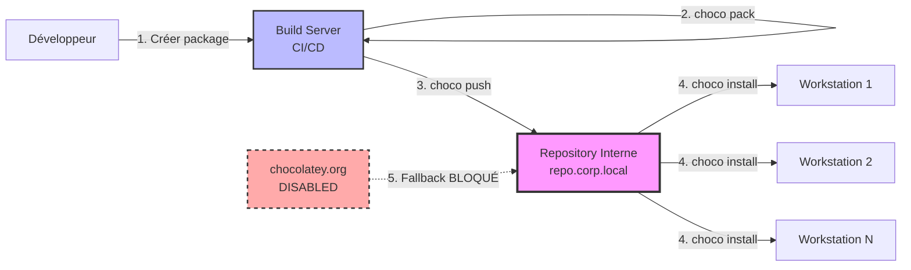

---
tags:
  - chocolatey
  - repository
  - nuget
  - chocolatey-server
---

# Module 3 : Serveur Privé - L'Usine Logicielle

## Introduction

> **"Public repos are for home. Private repos are for pros."**

Jusqu'ici, vous avez utilisé **chocolatey.org** comme source de packages. Mais dans un environnement d'entreprise, cette approche pose plusieurs problèmes :

**Pourquoi les repos publics ne suffisent pas en entreprise ?**

| Problème | Impact |
|----------|--------|
| **Dépendance Internet** | Si chocolatey.org est down, vos déploiements sont bloqués |
| **Packages non validés** | Risque sécurité : packages communautaires non audités |
| **Apps internes** | Impossible de distribuer `corpapp.nupkg` sur chocolatey.org |
| **Versions non figées** | Un package peut être supprimé/modifié en upstream |
| **Conformité** | Pas de traçabilité (qui a installé quoi, quand ?) |
| **Bande passante** | Télécharger Firefox.exe (100 Mo) × 500 postes = 50 Go |

**La solution : Repository Privé**

Un **repository Chocolatey privé** est un serveur NuGet interne qui :

- ✅ **Héberge vos packages** : Apps internes (`corpapp`, `monitoring-agent`)
- ✅ **Cache les packages publics** : Miroir local de `chocolatey.org` (proxy/cache)
- ✅ **Contrôle les versions** : Figer Firefox 115.0 (ne jamais updater automatiquement)
- ✅ **Fonctionne offline** : Aucune dépendance Internet
- ✅ **Traçabilité** : Logs d'installation, audit

**Cas d'usage typique :**

```
Client Chocolatey
    ↓ (Priority 1)
Repository Interne (repo.corp.local)
    ├── Packages internes (corpapp, tools)
    └── Cache packages publics (Firefox, Git, VSCode)
    ↓ (Si package non trouvé)
Repository Public (chocolatey.org) - DISABLED en production
```

Dans ce module, vous allez apprendre à :

- ✅ Comprendre le protocole **NuGet v2/v3** utilisé par Chocolatey
- ✅ Comparer les solutions de repository (Chocolatey Server, Nexus, Artifactory)
- ✅ Installer et configurer **Chocolatey Server Simple** (IIS)
- ✅ Pousser des packages vers le repository (`choco push`)
- ✅ Configurer les clients pour utiliser le repository interne
- ✅ Désactiver chocolatey.org en production

---

## Concept : Architecture Repository

### Le Protocole NuGet

Chocolatey utilise le protocole **NuGet** (gestionnaire de packages .NET de Microsoft).

**NuGet v2 vs v3 :**

| Protocole | API | Support Chocolatey | Performance |
|-----------|-----|-------------------|-------------|
| **NuGet v2** | OData (`/api/v2/Packages`) | ✅ Natif | 🐢 Lent (XML) |
| **NuGet v3** | JSON (`/v3/index.json`) | ✅ Depuis Chocolatey 1.0 | ⚡ Rapide (JSON) |

**Chocolatey Server Simple** utilise **NuGet v2** (suffisant pour petites/moyennes entreprises).

**Endpoints NuGet v2 :**

| Endpoint | Description | Exemple |
|----------|-------------|---------|
| `/api/v2/Packages` | Lister les packages | `GET http://repo.corp.local/chocolatey/api/v2/Packages` |
| `/api/v2/Packages()/$count` | Compter les packages | `GET http://repo.corp.local/chocolatey/api/v2/Packages()/$count` |
| `/api/v2/package/` | Télécharger un package | `GET http://repo.corp.local/chocolatey/api/v2/package/corpapp/1.0.0` |
| `/api/v2/package/` | Pousser un package | `PUT http://repo.corp.local/chocolatey/api/v2/package/` |

---

### Options de Repository

Plusieurs solutions existent pour héberger un repository NuGet/Chocolatey.

**Comparaison :**

| Solution | Type | Difficulté | Coût | Multi-formats | UI Web | Recommandation |
|----------|------|------------|------|---------------|--------|----------------|
| **Chocolatey Server Simple** | IIS (Windows) | ⭐ Facile | 🆓 Gratuit | ❌ NuGet uniquement | ⚠️ Basique | PME (<500 packages) |
| **Nexus Repository OSS** | Java (Cross-platform) | ⭐⭐ Moyen | 🆓 Gratuit | ✅ NuGet, Docker, Maven, npm | ✅ Avancée | **Recommandé** (PME/Grande entreprise) |
| **Artifactory OSS** | Java (Cross-platform) | ⭐⭐⭐ Complexe | 🆓 Gratuit (OSS)<br>💰 Payant (Pro) | ✅ Tous formats | ✅ Très avancée | Grande entreprise |
| **ProGet** | .NET (Windows/Linux) | ⭐⭐ Moyen | 💰 Payant | ✅ Tous formats | ✅ Avancée | Entreprise (support commercial) |
| **Azure Artifacts** | Cloud (Azure DevOps) | ⭐ Facile | 💰 Payant (usage) | ✅ Tous formats | ✅ Cloud | Entreprise (déjà sur Azure) |
| **MyGet** | Cloud SaaS | ⭐ Facile | 💰 Payant | ✅ NuGet, npm | ✅ Cloud | Startup/CI/CD |

**Notre choix pour ce module : Chocolatey Server Simple**

**Pourquoi ?**

- ✅ **Gratuit et Open Source**
- ✅ **Installation en 1 commande** (`choco install chocolatey-server`)
- ✅ **Basé sur IIS** (déjà présent sur Windows Server)
- ✅ **Aucune dépendance externe** (pas de Java, Docker, etc.)
- ✅ **Parfait pour débuter** (proof-of-concept)

**Inconvénients :**

- ❌ Pas de cache/proxy vers chocolatey.org (uniquement stockage local)
- ❌ Interface Web minimaliste
- ❌ Pas de gestion avancée (quotas, rétention, RBAC)

**Pour production à grande échelle : préférer Nexus Repository OSS.**

---

### Flux de Distribution



**Workflow :**

1. **Développeur** : Crée le package `corpapp.nupkg` (Module 2)
2. **CI/CD** : Package automatiquement avec `choco pack`
3. **Push** : Pousse vers le repository interne avec `choco push`
4. **Distribution** : Les clients installent depuis le repository interne
5. **Isolation** : chocolatey.org est **désactivé** (sécurité/conformité)

---

### Architecture Réseau

**Topologie recommandée :**


```
┌─────────────────────────────────────────────────────┐
│ DMZ / Subnet Admin (VLAN 10)                       │
│                                                     │
│  ┌──────────────────────────────────────┐          │
│  │ Chocolatey Repository Server         │          │
│  │ - Windows Server 2022                │          │
│  │ - IIS 10.0                           │          │
│  │ - Chocolatey Server Simple           │          │
│  │ - URL: http://repo.corp.local        │          │
│  │ - Port: 80 (HTTP) ou 443 (HTTPS)    │          │
│  └──────────────────────────────────────┘          │
│                    ▲                                │
└────────────────────┼────────────────────────────────┘
                     │
       ┌─────────────┼─────────────┐
       │             │             │
       │             │             │
┌──────▼─────┐ ┌────▼──────┐ ┌───▼───────┐
│ Client 1   │ │ Client 2  │ │ Client N  │
│ VLAN 20    │ │ VLAN 20   │ │ VLAN 20   │
└────────────┘ └───────────┘ └───────────┘
```

**Firewall Rules :**

| Source | Destination | Port | Protocole | Autoriser |
|--------|-------------|------|-----------|-----------|
| Clients (VLAN 20) | Repo Server (VLAN 10) | 80 | HTTP | ✅ |
| Clients (VLAN 20) | Repo Server (VLAN 10) | 443 | HTTPS | ✅ |
| Repo Server | Internet | 80/443 | HTTP/HTTPS | ❌ Bloquer (optionnel) |

---

## Pratique : Installation Chocolatey Server Simple

### Prérequis

**Serveur Windows :**

- Windows Server 2016+ ou Windows 10/11 Pro (avec IIS)
- 4 GB RAM minimum
- 100 GB disque (pour stocker les packages)
- PowerShell 5.1+
- Chocolatey déjà installé

**Vérifier IIS :**

```powershell
Get-WindowsFeature -Name Web-Server
```

**Si IIS n'est pas installé :**

```powershell
# Windows Server
Install-WindowsFeature -Name Web-Server -IncludeManagementTools

# Windows 10/11 Pro
Enable-WindowsOptionalFeature -Online -FeatureName IIS-WebServerRole
```

---

### Étape 1 : Installer Chocolatey Server

```powershell
choco install chocolatey-server -y
```

**Sortie attendue :**

```
Chocolatey v2.2.2
Installing the following packages:
chocolatey-server
...
The install of chocolatey-server was successful.
 Software installed to 'C:\tools\chocolatey-server'
```

**Ce qui est installé :**

- Application IIS dans `C:\tools\chocolatey-server`
- Site IIS `chocolatey-server` sur le port `80`
- Répertoire de packages : `C:\tools\chocolatey-server\App_Data\Packages`

---

### Étape 2 : Vérifier le Site IIS

Ouvrir le **Gestionnaire IIS** (`inetmgr.exe`) :

```powershell
Start-Process inetmgr
```

**Vérifier :**

- Site `chocolatey-server` est présent
- Port `80` (ou configurer un autre port/binding)
- Application Pool : `.NET v4.5`

**Tester l'accès :**

```powershell
Invoke-WebRequest -Uri http://localhost/chocolatey
```

**Sortie attendue :**

```
StatusCode        : 200
StatusDescription : OK
Content           : <html>...</html>
```

**Accéder depuis un navigateur :**

```
http://localhost/chocolatey
```

Vous devriez voir une page d'accueil basique avec un lien vers `/api/v2/Packages`.

---

### Étape 3 : Configurer l'API Key

L'API Key protège le repository : seuls ceux qui la connaissent peuvent pousser des packages.

**Éditer le fichier de configuration :**

```powershell
notepad "C:\tools\chocolatey-server\web.config"
```

**Chercher la section `<appSettings>` :**

```xml
<appSettings>
  <add key="apiKey" value="" />
</appSettings>
```

**Définir une clé (exemple : `admin123`) :**

```xml
<appSettings>
  <add key="apiKey" value="admin123" />
</appSettings>
```

**⚠️ En production : utiliser une clé forte (GUID) :**

```powershell
# Générer un GUID sécurisé
[guid]::NewGuid().ToString()
```

**Exemple de clé forte :**

```xml
<add key="apiKey" value="12345678-1234-1234-1234-123456789abc" />
```

**Sauvegarder et redémarrer IIS :**

```powershell
iisreset
```

---

### Étape 4 : Configurer les Permissions NTFS

Le compte IIS doit pouvoir écrire dans le répertoire `Packages`.

**Vérifier le compte Application Pool :**

```powershell
Import-Module WebAdministration
$appPool = Get-Item "IIS:\AppPools\chocolatey-server"
$appPool.processModel.identityType
```

**Sortie attendue :**

```
ApplicationPoolIdentity
```

**Cela correspond au compte virtuel :** `IIS AppPool\chocolatey-server`

**Donner les permissions :**

```powershell
$PackagesPath = "C:\tools\chocolatey-server\App_Data\Packages"
$ACL = Get-Acl $PackagesPath

# Ajouter Full Control pour le compte IIS
$Permission = "IIS AppPool\chocolatey-server", "FullControl", "ContainerInherit,ObjectInherit", "None", "Allow"
$AccessRule = New-Object System.Security.AccessControl.FileSystemAccessRule $Permission
$ACL.SetAccessRule($AccessRule)
Set-Acl $PackagesPath $ACL
```

**Vérifier :**

```powershell
Get-Acl $PackagesPath | Format-List
```

---

### Étape 5 : Configurer le Binding (Optionnel - HTTPS)

Par défaut, le serveur écoute sur `http://localhost/chocolatey`.

**Pour utiliser un nom DNS (ex: `repo.corp.local`) :**

1. **Créer un enregistrement DNS :**

   ```
   repo.corp.local → 192.168.1.100
   ```

2. **Ajouter un binding IIS :**

   ```powershell
   Import-Module WebAdministration
   New-WebBinding -Name "chocolatey-server" -IPAddress "*" -Port 80 -HostHeader "repo.corp.local"
   ```

**Pour HTTPS (recommandé en production) :**

1. **Obtenir un certificat SSL** (Let's Encrypt, CA interne, certificat auto-signé)

2. **Importer le certificat dans le magasin Windows :**

   ```powershell
   Import-PfxCertificate -FilePath "C:\Certs\repo.corp.local.pfx" -CertStoreLocation Cert:\LocalMachine\My -Password (ConvertTo-SecureString "password" -AsPlainText -Force)
   ```

3. **Ajouter le binding HTTPS :**

   ```powershell
   $Cert = Get-ChildItem -Path Cert:\LocalMachine\My | Where-Object {$_.Subject -like "*repo.corp.local*"}
   New-WebBinding -Name "chocolatey-server" -Protocol https -Port 443 -HostHeader "repo.corp.local" -SslFlags 1

   # Lier le certificat
   $Binding = Get-WebBinding -Name "chocolatey-server" -Protocol https
   $Binding.AddSslCertificate($Cert.Thumbprint, "my")
   ```

---

## Pratique : Pousser des Packages

### Étape 1 : Préparer le Package

Utiliser le package `corpapp.nupkg` créé dans le **Module 2**.

**Vérifier que le fichier existe :**

```powershell
Test-Path "C:\Chocolatey\corpapp\corpapp.1.0.0.nupkg"
```

---

### Étape 2 : Pousser vers le Repository

```powershell
choco push "C:\Chocolatey\corpapp\corpapp.1.0.0.nupkg" `
  --source "http://localhost/chocolatey" `
  --api-key "admin123"
```

**Paramètres :**

| Paramètre | Description |
|-----------|-------------|
| `--source` | URL du repository NuGet |
| `--api-key` | Clé API définie dans `web.config` |

**Sortie attendue :**

```
Attempting to push corpapp.1.0.0.nupkg to http://localhost/chocolatey
corpapp 1.0.0 was pushed successfully to http://localhost/chocolatey
```

---

### Étape 3 : Vérifier le Package

**Via navigateur :**

```
http://localhost/chocolatey/api/v2/Packages
```

Vous devriez voir une entrée XML pour `corpapp`.

**Via PowerShell :**

```powershell
Invoke-WebRequest -Uri "http://localhost/chocolatey/api/v2/Packages()?`$filter=Id eq 'corpapp'" | Select-Object -ExpandProperty Content
```

**Via le système de fichiers :**

```powershell
Get-ChildItem "C:\tools\chocolatey-server\App_Data\Packages"
```

**Sortie attendue :**

```
corpapp.1.0.0.nupkg
```

---

## Pratique : Configuration Client

### Étape 1 : Lister les Sources Actuelles

```powershell
choco source list
```

**Sortie attendue :**

```
Chocolatey v2.2.2
chocolatey - https://community.chocolatey.org/api/v2/ | Priority 0|Bypass Proxy - False|Self-Service - False|Admin Only - False.
```

---

### Étape 2 : Ajouter le Repository Interne

```powershell
choco source add `
  --name="internal-repo" `
  --source="http://repo.corp.local/chocolatey" `
  --priority=1
```

**Paramètres :**

| Paramètre | Description |
|-----------|-------------|
| `--name` | Nom de la source (identifiant unique) |
| `--source` | URL du repository NuGet |
| `--priority` | Priorité (0 = plus haute, 1000 = plus basse) |

**Sortie attendue :**

```
Added internal-repo - http://repo.corp.local/chocolatey (Priority 1)
```

**Vérifier :**

```powershell
choco source list
```

**Sortie attendue :**

```
internal-repo - http://repo.corp.local/chocolatey | Priority 1
chocolatey - https://community.chocolatey.org/api/v2/ | Priority 0
```

**⚠️ Attention :** Priority `0` est plus prioritaire que `1` !

**Corriger la priorité :**

```powershell
# Repository interne en priorité 0 (première source)
choco source remove --name="internal-repo"
choco source add --name="internal-repo" --source="http://repo.corp.local/chocolatey" --priority=0

# Chocolatey.org en priorité 10 (fallback)
choco source remove --name="chocolatey"
choco source add --name="chocolatey" --source="https://community.chocolatey.org/api/v2/" --priority=10
```

---

### Étape 3 : Désactiver chocolatey.org (Production)

En production, vous voulez **bloquer** l'accès à chocolatey.org pour :

- ✅ Forcer l'utilisation du repository interne
- ✅ Éviter les téléchargements non validés
- ✅ Respecter la conformité/sécurité

**Désactiver la source :**

```powershell
choco source disable --name="chocolatey"
```

**Vérifier :**

```powershell
choco source list
```

**Sortie attendue :**

```
internal-repo - http://repo.corp.local/chocolatey | Priority 0
chocolatey - https://community.chocolatey.org/api/v2/ [Disabled] | Priority 10
```

---

### Étape 4 : Tester l'Installation depuis le Repo Interne

```powershell
choco install corpapp -y
```

**Sortie attendue :**

```
Installing the following packages:
corpapp
By installing, you accept licenses for the packages.
corpapp v1.0.0
 Downloading corpapp
  from 'http://repo.corp.local/chocolatey/api/v2/package/corpapp/1.0.0'
...
The install of corpapp was successful.
```

**✅ Le package vient bien du repository interne !**

---

## Configuration Avancée

### 1. Authentification (API Key pour choco install)

Par défaut, l'API Key est requise uniquement pour `choco push`.

**Pour sécuriser aussi `choco install` :**

Éditer `C:\tools\chocolatey-server\web.config` :

```xml
<appSettings>
  <add key="apiKey" value="admin123" />
  <add key="requireApiKey" value="true" />
</appSettings>
```

**Redémarrer IIS :**

```powershell
iisreset
```

**Sur les clients, ajouter l'API Key :**

```powershell
choco source add `
  --name="internal-repo" `
  --source="http://repo.corp.local/chocolatey" `
  --user="admin" `
  --password="admin123"
```

**Note :** Le mot de passe est stocké chiffré dans `C:\ProgramData\chocolatey\config\chocolatey.config`.

---

### 2. Limitation des Tailles de Packages

Par défaut, IIS limite les uploads à **30 Mo**.

**Pour autoriser de gros packages (ex: 500 Mo) :**

Éditer `C:\tools\chocolatey-server\web.config` :

```xml
<system.web>
  <httpRuntime maxRequestLength="524288" executionTimeout="3600" />
</system.web>

<system.webServer>
  <security>
    <requestFiltering>
      <requestLimits maxAllowedContentLength="524288000" />
    </requestFiltering>
  </security>
</system.webServer>
```

**Explications :**

| Paramètre | Valeur | Description |
|-----------|--------|-------------|
| `maxRequestLength` | `524288` | Taille max (Ko) = 512 Mo |
| `maxAllowedContentLength` | `524288000` | Taille max (octets) = 500 Mo |
| `executionTimeout` | `3600` | Timeout (secondes) = 1 heure |

**Redémarrer IIS :**

```powershell
iisreset
```

---

### 3. Logging et Monitoring

**Activer les logs IIS :**

```powershell
Set-WebConfigurationProperty -Filter "system.applicationHost/sites/site[@name='chocolatey-server']/logFile" -Name "enabled" -Value $true
```

**Emplacement des logs :**

```
C:\inetpub\logs\LogFiles\W3SVC*\
```

**Analyser les logs :**

```powershell
Get-Content "C:\inetpub\logs\LogFiles\W3SVC*\*.log" | Select-String "Packages"
```

---

### 4. Sauvegarde Automatique

**Script de sauvegarde journalière :**

```powershell
# backup-chocolatey-repo.ps1
$SourcePath = "C:\tools\chocolatey-server\App_Data\Packages"
$BackupPath = "D:\Backups\ChocolateyRepo\$(Get-Date -Format 'yyyy-MM-dd')"

# Créer le répertoire de backup
New-Item -Path $BackupPath -ItemType Directory -Force

# Copier les packages
Copy-Item -Path "$SourcePath\*" -Destination $BackupPath -Recurse

# Compresser
Compress-Archive -Path $BackupPath -DestinationPath "$BackupPath.zip" -Force

# Nettoyer les backups > 30 jours
Get-ChildItem "D:\Backups\ChocolateyRepo" -Filter "*.zip" |
  Where-Object {$_.LastWriteTime -lt (Get-Date).AddDays(-30)} |
  Remove-Item -Force

Write-Host "✅ Backup terminé : $BackupPath.zip"
```

**Planifier avec Task Scheduler :**

```powershell
$Action = New-ScheduledTaskAction -Execute "PowerShell.exe" -Argument "-File C:\Scripts\backup-chocolatey-repo.ps1"
$Trigger = New-ScheduledTaskTrigger -Daily -At "02:00"
$Principal = New-ScheduledTaskPrincipal -UserId "SYSTEM" -LogonType ServiceAccount -RunLevel Highest

Register-ScheduledTask -TaskName "ChocolateyRepoBackup" -Action $Action -Trigger $Trigger -Principal $Principal
```

---

## Automatisation : Déploiement avec Ansible

### Playbook : Configurer les Clients

```yaml
# configure-chocolatey-sources.yml
---
- name: Configure Chocolatey Sources
  hosts: windows_workstations
  gather_facts: no

  vars:
    internal_repo_url: "http://repo.corp.local/chocolatey"
    internal_repo_priority: 0
    disable_public_repo: true

  tasks:
    - name: Add internal repository
      win_chocolatey_source:
        name: internal-repo
        source: "{{ internal_repo_url }}"
        priority: "{{ internal_repo_priority }}"
        state: present

    - name: Disable chocolatey.org (if required)
      win_chocolatey_source:
        name: chocolatey
        state: disabled
      when: disable_public_repo | bool

    - name: List configured sources
      win_shell: choco source list
      register: sources_output

    - name: Display sources
      debug:
        var: sources_output.stdout_lines
```

**Exécution :**

```bash
ansible-playbook configure-chocolatey-sources.yml
```

---

## Bonnes Pratiques

### 1. ✅ Utiliser HTTPS en Production

**Pourquoi ?**

- 🔐 **Sécurité** : Éviter l'interception des packages (MITM)
- 🔐 **Intégrité** : Garantir que les packages ne sont pas modifiés en transit

**Comment ?**

- Obtenir un certificat SSL (Let's Encrypt, CA interne)
- Configurer le binding HTTPS dans IIS
- Forcer HTTPS : rediriger HTTP → HTTPS

**Redirection HTTP → HTTPS (web.config) :**

```xml
<system.webServer>
  <rewrite>
    <rules>
      <rule name="HTTP to HTTPS redirect" stopProcessing="true">
        <match url="(.*)" />
        <conditions>
          <add input="{HTTPS}" pattern="off" ignoreCase="true" />
        </conditions>
        <action type="Redirect" url="https://{HTTP_HOST}/{R:1}" redirectType="Permanent" />
      </rule>
    </rules>
  </rewrite>
</system.webServer>
```

---

### 2. ✅ Séparer les Environnements (Dev/Test/Prod)

**Stratégie multi-repositories :**

| Repository | URL | Usage |
|------------|-----|-------|
| `choco-dev` | `http://repo-dev.corp.local/chocolatey` | Packages en développement/test |
| `choco-prod` | `http://repo-prod.corp.local/chocolatey` | Packages validés pour production |

**Workflow :**

1. Développeur pousse vers `choco-dev`
2. Tests automatisés (CI/CD)
3. Si OK, promouvoir vers `choco-prod` (copie manuelle ou script)

**Script de promotion :**

```powershell
# promote-package.ps1
param(
    [string]$PackageName,
    [string]$Version
)

$DevRepo = "http://repo-dev.corp.local/chocolatey"
$ProdRepo = "http://repo-prod.corp.local/chocolatey"
$ApiKey = "admin123"

# Télécharger depuis Dev
$TempPath = "$env:TEMP\$PackageName.$Version.nupkg"
Invoke-WebRequest -Uri "$DevRepo/api/v2/package/$PackageName/$Version" -OutFile $TempPath

# Pousser vers Prod
choco push $TempPath --source $ProdRepo --api-key $ApiKey

Write-Host "✅ Package $PackageName $Version promu vers Production"
```

---

### 3. ✅ Versionner les Packages Strictement

**Problème :** Un package `corpapp 1.0.0` est déployé, puis un développeur le modifie et re-pousse `1.0.0`.

**Solution :** Bloquer les overwrites (immutabilité).

**Configuration (web.config) :**

```xml
<appSettings>
  <add key="allowOverrideExistingPackageOnPush" value="false" />
</appSettings>
```

**Résultat :** Tenter de pousser deux fois `corpapp 1.0.0` → erreur.

**Forcer une nouvelle version :**

```powershell
# ❌ MAUVAIS
choco push corpapp.1.0.0.nupkg  # Deux fois = erreur

# ✅ BON
# Modifier corpapp.nuspec : <version>1.0.1</version>
choco pack
choco push corpapp.1.0.1.nupkg
```

---

### 4. ✅ Nettoyer les Anciennes Versions

**Problème :** Avec le temps, le repository accumule des centaines de versions (`firefox.100.0.0`, `firefox.101.0.0`, ..., `firefox.120.0.0`).

**Solution :** Script de rétention (garder les 3 dernières versions uniquement).

```powershell
# cleanup-old-packages.ps1
$PackagesPath = "C:\tools\chocolatey-server\App_Data\Packages"
$KeepLastVersions = 3

# Grouper par nom de package (sans version)
$Packages = Get-ChildItem $PackagesPath -Filter "*.nupkg" |
  ForEach-Object {
    if ($_.Name -match "^(.+?)\.(\d+\.\d+\.\d+.*?)\.nupkg$") {
      [PSCustomObject]@{
        Name = $matches[1]
        Version = [version]($matches[2] -replace '[^0-9.]','')
        FullName = $_.FullName
        CreationTime = $_.CreationTime
      }
    }
  } | Group-Object -Property Name

# Pour chaque package, garder les N dernières versions
foreach ($Group in $Packages) {
  $ToDelete = $Group.Group |
    Sort-Object Version -Descending |
    Select-Object -Skip $KeepLastVersions

  foreach ($File in $ToDelete) {
    Write-Host "🗑️  Suppression : $($File.FullName)"
    Remove-Item $File.FullName -Force
  }
}
```

**Planifier en tâche mensuelle.**

---

### 5. ✅ Monitorer l'Espace Disque

**Script d'alerte :**

```powershell
# check-disk-space.ps1
$Disk = Get-PSDrive -Name C
$FreeSpaceGB = [math]::Round($Disk.Free / 1GB, 2)
$ThresholdGB = 20

if ($FreeSpaceGB -lt $ThresholdGB) {
    $Subject = "⚠️  ALERTE : Espace disque faible sur Chocolatey Repository"
    $Body = "Espace libre : $FreeSpaceGB GB (seuil : $ThresholdGB GB)"

    # Envoyer un email (configurer Send-MailMessage)
    Send-MailMessage -To "admin@corp.local" -From "repo@corp.local" -Subject $Subject -Body $Body -SmtpServer "smtp.corp.local"

    Write-Host "⚠️  Alerte envoyée"
} else {
    Write-Host "✅ Espace disque OK : $FreeSpaceGB GB"
}
```

---

## Exercice : Monter le Repo

### Contexte

Vous êtes SysOps dans **TechCorp** (infrastructure 100 workstations Windows).

Votre direction veut centraliser la distribution de packages Chocolatey pour :

- Distribuer l'application interne `corpapp` (créée au Module 2)
- Bloquer l'accès à chocolatey.org (conformité sécurité)
- Avoir un point central de contrôle

**Mission :**

1. Installer **Chocolatey Server Simple** sur votre machine (ou une VM)
2. Configurer l'API Key `admin123`
3. Pousser le package `corpapp.1.0.0.nupkg` vers le repository
4. Configurer votre client pour utiliser **uniquement** le repository interne
5. Installer `corpapp` depuis le repository interne
6. Vérifier que chocolatey.org est bien désactivé

---

### Prérequis

- Windows 10/11 ou Windows Server avec IIS
- Chocolatey installé
- Package `corpapp.1.0.0.nupkg` (du Module 2)

---

### Étapes

#### 1. Installer Chocolatey Server

```powershell
choco install chocolatey-server -y
```

#### 2. Configurer l'API Key

Éditer `C:\tools\chocolatey-server\web.config` :

```xml
<appSettings>
  <add key="apiKey" value="admin123" />
</appSettings>
```

Redémarrer IIS :

```powershell
iisreset
```

#### 3. Pousser le Package

```powershell
choco push "C:\Chocolatey\corpapp\corpapp.1.0.0.nupkg" `
  --source "http://localhost/chocolatey" `
  --api-key "admin123"
```

#### 4. Configurer le Client

```powershell
# Ajouter le repository interne (priorité 0)
choco source add --name="internal-repo" --source="http://localhost/chocolatey" --priority=0

# Désactiver chocolatey.org
choco source disable --name="chocolatey"
```

#### 5. Installer corpapp

```powershell
choco install corpapp -y
```

#### 6. Vérifier

```powershell
choco list --local-only corpapp
choco source list
```

---

### Solution Complète

??? quote "**Solution : Script d'Installation Automatisé**"

    **Fichier : `setup-chocolatey-repo.ps1`**

    ```powershell
    #Requires -RunAsAdministrator
    # setup-chocolatey-repo.ps1
    # Installation et configuration complète Chocolatey Server Simple

    $ErrorActionPreference = 'Stop'

    # VARIABLES DE CONFIGURATION
    $ApiKey = "admin123"
    $RepoUrl = "http://localhost/chocolatey"
    $PackagePath = "C:\Chocolatey\corpapp\corpapp.1.0.0.nupkg"

    Write-Host "=========================================" -ForegroundColor Cyan
    Write-Host "🍫 CHOCOLATEY SERVER SETUP" -ForegroundColor Cyan
    Write-Host "=========================================" -ForegroundColor Cyan

    # STEP 1 : Vérifier les prérequis
    Write-Host ""
    Write-Host "📋 Step 1: Vérification des prérequis..." -ForegroundColor Yellow

    # Vérifier que Chocolatey est installé
    if (-not (Get-Command choco -ErrorAction SilentlyContinue)) {
        Write-Host "❌ Chocolatey n'est pas installé. Installation..." -ForegroundColor Red
        Set-ExecutionPolicy Bypass -Scope Process -Force
        [System.Net.ServicePointManager]::SecurityProtocol = [System.Net.ServicePointManager]::SecurityProtocol -bor 3072
        iex ((New-Object System.Net.WebClient).DownloadString('https://community.chocolatey.org/install.ps1'))
    } else {
        Write-Host "✅ Chocolatey est installé" -ForegroundColor Green
    }

    # Vérifier que IIS est installé
    $IIS = Get-WindowsFeature -Name Web-Server -ErrorAction SilentlyContinue
    if (-not $IIS -or $IIS.InstallState -ne "Installed") {
        Write-Host "❌ IIS n'est pas installé. Installation..." -ForegroundColor Red

        if ([Environment]::OSVersion.Version.Major -eq 10) {
            # Windows 10/11
            Enable-WindowsOptionalFeature -Online -FeatureName IIS-WebServerRole -All -NoRestart
        } else {
            # Windows Server
            Install-WindowsFeature -Name Web-Server -IncludeManagementTools
        }

        Write-Host "✅ IIS installé" -ForegroundColor Green
    } else {
        Write-Host "✅ IIS est installé" -ForegroundColor Green
    }

    # STEP 2 : Installer Chocolatey Server
    Write-Host ""
    Write-Host "📋 Step 2: Installation Chocolatey Server..." -ForegroundColor Yellow

    $ServerInstalled = choco list --local-only chocolatey-server | Select-String "chocolatey-server"

    if (-not $ServerInstalled) {
        choco install chocolatey-server -y
        Write-Host "✅ Chocolatey Server installé" -ForegroundColor Green
    } else {
        Write-Host "ℹ️  Chocolatey Server déjà installé" -ForegroundColor Cyan
    }

    # STEP 3 : Configurer l'API Key
    Write-Host ""
    Write-Host "📋 Step 3: Configuration API Key..." -ForegroundColor Yellow

    $WebConfigPath = "C:\tools\chocolatey-server\web.config"

    if (Test-Path $WebConfigPath) {
        # Lire le fichier XML
        [xml]$WebConfig = Get-Content $WebConfigPath

        # Chercher la clé apiKey
        $ApiKeyNode = $WebConfig.configuration.appSettings.add | Where-Object { $_.key -eq "apiKey" }

        if ($ApiKeyNode) {
            $ApiKeyNode.value = $ApiKey
            Write-Host "✅ API Key configurée : $ApiKey" -ForegroundColor Green
        } else {
            # Créer la clé si elle n'existe pas
            $NewNode = $WebConfig.CreateElement("add")
            $NewNode.SetAttribute("key", "apiKey")
            $NewNode.SetAttribute("value", $ApiKey)
            $WebConfig.configuration.appSettings.AppendChild($NewNode)
            Write-Host "✅ API Key créée : $ApiKey" -ForegroundColor Green
        }

        # Sauvegarder
        $WebConfig.Save($WebConfigPath)
    } else {
        Write-Host "❌ web.config introuvable : $WebConfigPath" -ForegroundColor Red
        exit 1
    }

    # STEP 4 : Configurer les permissions NTFS
    Write-Host ""
    Write-Host "📋 Step 4: Configuration permissions NTFS..." -ForegroundColor Yellow

    $PackagesPath = "C:\tools\chocolatey-server\App_Data\Packages"

    if (Test-Path $PackagesPath) {
        $ACL = Get-Acl $PackagesPath
        $Permission = "IIS AppPool\chocolatey-server", "FullControl", "ContainerInherit,ObjectInherit", "None", "Allow"
        $AccessRule = New-Object System.Security.AccessControl.FileSystemAccessRule $Permission
        $ACL.SetAccessRule($AccessRule)
        Set-Acl $PackagesPath $ACL

        Write-Host "✅ Permissions NTFS configurées" -ForegroundColor Green
    } else {
        Write-Host "⚠️  Répertoire Packages introuvable : $PackagesPath" -ForegroundColor Yellow
    }

    # STEP 5 : Redémarrer IIS
    Write-Host ""
    Write-Host "📋 Step 5: Redémarrage IIS..." -ForegroundColor Yellow

    iisreset /restart | Out-Null
    Start-Sleep -Seconds 5

    Write-Host "✅ IIS redémarré" -ForegroundColor Green

    # STEP 6 : Tester l'accès au repository
    Write-Host ""
    Write-Host "📋 Step 6: Test d'accès au repository..." -ForegroundColor Yellow

    try {
        $Response = Invoke-WebRequest -Uri "$RepoUrl/api/v2/Packages" -UseBasicParsing
        if ($Response.StatusCode -eq 200) {
            Write-Host "✅ Repository accessible : $RepoUrl" -ForegroundColor Green
        }
    } catch {
        Write-Host "❌ Impossible d'accéder au repository : $_" -ForegroundColor Red
        exit 1
    }

    # STEP 7 : Pousser le package corpapp (si disponible)
    Write-Host ""
    Write-Host "📋 Step 7: Push du package corpapp..." -ForegroundColor Yellow

    if (Test-Path $PackagePath) {
        choco push $PackagePath --source $RepoUrl --api-key $ApiKey --force

        Write-Host "✅ Package corpapp poussé vers le repository" -ForegroundColor Green
    } else {
        Write-Host "⚠️  Package corpapp introuvable : $PackagePath" -ForegroundColor Yellow
        Write-Host "   Créer le package avec le Module 2 avant de continuer." -ForegroundColor Yellow
    }

    # STEP 8 : Configurer les sources Chocolatey
    Write-Host ""
    Write-Host "📋 Step 8: Configuration des sources Chocolatey..." -ForegroundColor Yellow

    # Supprimer les sources existantes (nettoyage)
    $ExistingSources = choco source list | Select-String "internal-repo"
    if ($ExistingSources) {
        choco source remove --name="internal-repo"
    }

    # Ajouter le repository interne
    choco source add --name="internal-repo" --source=$RepoUrl --priority=0

    Write-Host "✅ Source 'internal-repo' ajoutée (priorité 0)" -ForegroundColor Green

    # Désactiver chocolatey.org
    choco source disable --name="chocolatey"

    Write-Host "✅ Source 'chocolatey' désactivée" -ForegroundColor Green

    # STEP 9 : Tester l'installation de corpapp
    Write-Host ""
    Write-Host "📋 Step 9: Test installation corpapp depuis le repository..." -ForegroundColor Yellow

    # Désinstaller si déjà présent
    $CorpAppInstalled = choco list --local-only corpapp | Select-String "corpapp"
    if ($CorpAppInstalled) {
        choco uninstall corpapp -y
    }

    # Installer depuis le repository interne
    choco install corpapp -y

    # Vérifier
    $CorpAppInstalled = choco list --local-only corpapp | Select-String "corpapp"
    if ($CorpAppInstalled) {
        Write-Host "✅ corpapp installé avec succès depuis le repository interne" -ForegroundColor Green
    } else {
        Write-Host "❌ Échec de l'installation de corpapp" -ForegroundColor Red
    }

    # STEP 10 : Afficher le récapitulatif
    Write-Host ""
    Write-Host "=========================================" -ForegroundColor Cyan
    Write-Host "✅ INSTALLATION TERMINÉE" -ForegroundColor Cyan
    Write-Host "=========================================" -ForegroundColor Cyan
    Write-Host ""
    Write-Host "🔧 Configuration :" -ForegroundColor Yellow
    Write-Host "   Repository URL  : $RepoUrl" -ForegroundColor White
    Write-Host "   API Key         : $ApiKey" -ForegroundColor White
    Write-Host "   Packages Path   : $PackagesPath" -ForegroundColor White
    Write-Host ""
    Write-Host "📦 Sources Chocolatey :" -ForegroundColor Yellow
    choco source list
    Write-Host ""
    Write-Host "📊 Packages installés :" -ForegroundColor Yellow
    choco list --local-only
    Write-Host ""
    Write-Host "🔧 Prochaines étapes :" -ForegroundColor Yellow
    Write-Host "   1. Accéder à l'interface Web : $RepoUrl" -ForegroundColor White
    Write-Host "   2. Pousser d'autres packages : choco push monpackage.nupkg --source $RepoUrl --api-key $ApiKey" -ForegroundColor White
    Write-Host "   3. Configurer d'autres clients : choco source add --name='internal-repo' --source='$RepoUrl'" -ForegroundColor White
    Write-Host "   4. Configurer HTTPS (production) : voir bonnes pratiques" -ForegroundColor White
    Write-Host ""
    ```

    **Exécution :**

    ```powershell
    # Lancer le script en tant qu'Administrateur
    .\setup-chocolatey-repo.ps1
    ```

    **Sortie attendue :**

    ```
    =========================================
    🍫 CHOCOLATEY SERVER SETUP
    =========================================

    📋 Step 1: Vérification des prérequis...
    ✅ Chocolatey est installé
    ✅ IIS est installé

    📋 Step 2: Installation Chocolatey Server...
    ✅ Chocolatey Server installé

    📋 Step 3: Configuration API Key...
    ✅ API Key configurée : admin123

    📋 Step 4: Configuration permissions NTFS...
    ✅ Permissions NTFS configurées

    📋 Step 5: Redémarrage IIS...
    ✅ IIS redémarré

    📋 Step 6: Test d'accès au repository...
    ✅ Repository accessible : http://localhost/chocolatey

    📋 Step 7: Push du package corpapp...
    ✅ Package corpapp poussé vers le repository

    📋 Step 8: Configuration des sources Chocolatey...
    ✅ Source 'internal-repo' ajoutée (priorité 0)
    ✅ Source 'chocolatey' désactivée

    📋 Step 9: Test installation corpapp depuis le repository...
    ✅ corpapp installé avec succès depuis le repository interne

    =========================================
    ✅ INSTALLATION TERMINÉE
    =========================================

    🔧 Configuration :
       Repository URL  : http://localhost/chocolatey
       API Key         : admin123
       Packages Path   : C:\tools\chocolatey-server\App_Data\Packages

    📦 Sources Chocolatey :
    internal-repo - http://localhost/chocolatey | Priority 0
    chocolatey - https://community.chocolatey.org/api/v2/ [Disabled] | Priority 10

    📊 Packages installés :
    corpapp 1.0.0

    🔧 Prochaines étapes :
       1. Accéder à l'interface Web : http://localhost/chocolatey
       2. Pousser d'autres packages : choco push monpackage.nupkg --source http://localhost/chocolatey --api-key admin123
       3. Configurer d'autres clients : choco source add --name='internal-repo' --source='http://localhost/chocolatey'
       4. Configurer HTTPS (production) : voir bonnes pratiques
    ```

---

## Points Clés à Retenir

### ✅ Repository Privé

- **Protocole NuGet v2/v3** : Standard pour Chocolatey
- **Solutions** : Chocolatey Server Simple (IIS), Nexus, Artifactory
- **Avantages** : Contrôle, offline, sécurité, conformité

### ✅ Installation Chocolatey Server Simple

- **1 commande** : `choco install chocolatey-server`
- **Configuration** : API Key dans `web.config`
- **Permissions** : NTFS pour `IIS AppPool\chocolatey-server`

### ✅ Push de Packages

- **Commande** : `choco push package.nupkg --source URL --api-key KEY`
- **Stockage** : `C:\tools\chocolatey-server\App_Data\Packages`

### ✅ Configuration Client

- **Ajouter source** : `choco source add --name internal-repo --source URL --priority 0`
- **Désactiver chocolatey.org** : `choco source disable --name chocolatey`
- **Priorité** : 0 = plus haute (utiliser en premier)

### ✅ Bonnes Pratiques

- ✅ HTTPS en production (SSL/TLS)
- ✅ Séparer Dev/Test/Prod (multi-repositories)
- ✅ Immutabilité (bloquer overwrites)
- ✅ Rétention (nettoyer anciennes versions)
- ✅ Sauvegarde automatique (backups journaliers)

---

## Prochaines Étapes

Dans le **Module 4 : Déploiement Automatisé**, vous allez apprendre à :

- Déployer des packages via **GPO** (Group Policy Objects)
- Automatiser avec **Ansible** (playbooks Windows)
- Intégrer avec **Intune/SCCM** (MDM moderne)
- Créer des **pipelines CI/CD** pour packager automatiquement

**Vous avez maintenant un repository Chocolatey privé fonctionnel !** 🍫

---

**Ressources :**

- [Chocolatey Server Setup](https://docs.chocolatey.org/en-us/guides/organizations/set-up-chocolatey-server)
- [NuGet v2 API](https://docs.microsoft.com/en-us/nuget/api/nuget-api-v2)
- [Nexus Repository Manager](https://help.sonatype.com/repomanager3/nexus-repository-administration/formats/nuget-repositories)

---

**Retour au :** [Programme de la Formation](index.md) | [Catalogue des Formations](../index.md)

---

## Navigation

| | |
|:---|---:|
| [← Module 2 : Création de Paquets - Deve...](02-module.md) | [Module 4 : Déploiement de Masse - Ind... →](04-module.md) |

[Retour au Programme](index.md){ .md-button }
