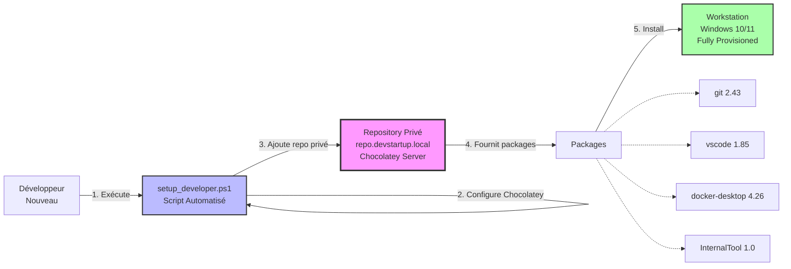

---
tags:
  - chocolatey
  - tp-final
  - packaging
  - automation
  - deployment
---

# Module 5 : TP Final - La Chocolatey Factory

## Introduction

> **"De startup à scale-up : automatiser ou mourir."**

Vous avez parcouru les 4 modules de la formation **Chocolatey Factory** :

- ✅ **Module 1** : Client & CLI (installation, commandes de base)
- ✅ **Module 2** : Packaging (créer des `.nupkg`, nuspec, checksums)
- ✅ **Module 3** : Serveur Privé (Chocolatey Server, repository interne)
- ✅ **Module 4** : Déploiement de Masse (Ansible, Intune, GPO)

**Il est temps de mettre en pratique !**

Ce **TP Final** vous met dans la peau d'un **DevOps Engineer** chargé d'industrialiser le provisioning des postes de travail pour **DevStartup**, une startup en pleine croissance.

---

## Contexte : DevStartup Scale-up

### L'Entreprise

**DevStartup** est une startup tech qui développe une plateforme SaaS. En 2 ans, l'entreprise est passée de :

- **10 développeurs** → **100 développeurs**
- **2 outils** (VS Code + Git) → **20+ outils** (IDE, Docker, monitoring, VPN, etc.)
- **Setup manuel** (1 jour par nouveau dev) → **Besoin de zero-touch provisioning**

### Problématique Actuelle

Le provisioning des nouveaux développeurs est **chaotique** :

| Problème | Impact |
|----------|--------|
| **Setup manuel** | 1 jour complet pour installer tous les outils |
| **Incohérences** | Chaque dev a des versions différentes (Git 2.40 vs 2.43) |
| **Erreurs humaines** | Oubli d'outils critiques (Docker Desktop, VPN client) |
| **Aucune automatisation** | Pas de script, juste un doc Word de 50 pages |
| **Pas de repository privé** | Dépendance totale à chocolatey.org (risque downtime) |

### Directive de la Direction

Le **CTO** a décidé d'implémenter une **"Chocolatey Factory"** pour :

1. ✅ **Automatiser** le provisioning complet d'un poste dev (<30 minutes)
2. ✅ **Standardiser** les versions d'outils (Git 2.43, Docker 24.0, etc.)
3. ✅ **Centraliser** un repository privé pour les outils internes
4. ✅ **Tracer** toutes les installations (audit compliance)
5. ✅ **Répliquer** facilement (nouveaux développeurs, nouvelles équipes)

**Vous êtes le DevOps Engineer en charge du projet.**

---

## Objectifs du TP

À la fin de ce TP, vous aurez déployé une **Chocolatey Factory complète** avec :

1. ✅ **Repository privé** Chocolatey Server opérationnel
2. ✅ **Package interne** `InternalTool 1.0` créé et poussé
3. ✅ **Script de provisioning** `setup_developer.ps1` automatisé
4. ✅ **Validation** sur une VM Windows 10/11 propre

---

## Architecture Cible



---

## Prérequis Techniques

### Serveur Repository

| Composant | Spécification |
|-----------|---------------|
| **OS** | Windows Server 2022 ou Windows 10/11 Pro |
| **RAM** | 4 GB minimum |
| **Disque** | 100 GB |
| **Hostname** | `repo.devstartup.local` (ou `localhost` pour le TP) |
| **IIS** | Installé et configuré |
| **Chocolatey** | Installé |

### Workstation de Test

| Composant | Spécification |
|-----------|---------------|
| **OS** | Windows 10/11 Pro (installation propre) |
| **RAM** | 8 GB |
| **Disque** | 50 GB |
| **Réseau** | Accès au serveur repository |

---

## Étape 1 : Installation du Serveur Chocolatey (Module 3)

### Objectif

Déployer un **Chocolatey Server Simple** sur IIS pour héberger les packages internes.

---

### Actions

#### 1.1. Installer IIS (si pas déjà fait)

```powershell
# Windows Server
Install-WindowsFeature -Name Web-Server -IncludeManagementTools

# Windows 10/11 Pro
Enable-WindowsOptionalFeature -Online -FeatureName IIS-WebServerRole
```

---

#### 1.2. Installer Chocolatey (si pas déjà fait)

```powershell
Set-ExecutionPolicy Bypass -Scope Process -Force
[System.Net.ServicePointManager]::SecurityProtocol = [System.Net.ServicePointManager]::SecurityProtocol -bor 3072
iex ((New-Object System.Net.WebClient).DownloadString('https://community.chocolatey.org/install.ps1'))
```

---

#### 1.3. Installer Chocolatey Server

```powershell
choco install chocolatey-server -y
```

**Sortie attendue :**

```
Chocolatey installed 1/1 packages.
 See the log for details (C:\ProgramData\chocolatey\logs\chocolatey.log).
```

---

#### 1.4. Configurer l'API Key

```powershell
# Éditer le fichier de configuration
notepad "C:\tools\chocolatey-server\web.config"
```

**Trouver la section `<appSettings>` et définir l'API Key :**

```xml
<appSettings>
  <add key="apiKey" value="DevStartup2024!Secret" />
</appSettings>
```

**Sauvegarder et redémarrer IIS :**

```powershell
iisreset
```

---

#### 1.5. Tester l'Accès au Repository

```powershell
# Tester l'URL
Invoke-WebRequest -Uri http://localhost/chocolatey
```

**Sortie attendue :** `StatusCode : 200`

---

## Étape 2 : Création du Package `InternalTool` (Module 2)

### Objectif

Créer un package Chocolatey pour un outil interne fictif `InternalTool 1.0`.

---

### Actions

#### 2.1. Générer le Squelette

```powershell
# Créer le répertoire de travail
New-Item -Path "C:\ChocolateyPackages\InternalTool" -ItemType Directory -Force
cd C:\ChocolateyPackages\InternalTool

# Générer le template
choco new InternalTool
```

**Structure créée :**

```
InternalTool/
├── InternalTool.nuspec
├── tools/
│   ├── chocolateyInstall.ps1
│   ├── chocolateyUninstall.ps1
│   └── chocolateyBeforeModify.ps1
└── ReadMe.md
```

---

#### 2.2. Éditer le `.nuspec`

**Fichier : `InternalTool.nuspec`**

```xml
<?xml version="1.0" encoding="utf-8"?>
<package xmlns="http://schemas.microsoft.com/packaging/2015/06/nuspec.xsd">
  <metadata>
    <id>internaltool</id>
    <version>1.0.0</version>
    <title>InternalTool (Install)</title>
    <authors>DevStartup IT Team</authors>
    <owners>DevStartup</owners>
    <summary>Internal development tool for DevStartup</summary>
    <description>
InternalTool is a proprietary CLI tool developed by DevStartup for internal use.

**Features:**
- Project scaffolding
- Code generation
- CI/CD integration

**Installation:**
This package installs InternalTool 1.0.0 to C:\Program Files\InternalTool

**Support:**
Contact dev-support@devstartup.local for assistance.
    </description>
    <projectUrl>http://intranet.devstartup.local/internaltool</projectUrl>
    <tags>internal cli devtools admin</tags>
    <licenseUrl>http://intranet.devstartup.local/internaltool/license</licenseUrl>
    <requireLicenseAcceptance>false</requireLicenseAcceptance>
    <dependencies>
      <dependency id="dotnet-runtime" version="6.0.0" />
    </dependencies>
  </metadata>
</package>
```

---

#### 2.3. Créer un Binaire Fictif (pour le TP)

Pour simuler l'application, on va créer un simple exécutable PowerShell compilé.

**Fichier : `tools/InternalTool.ps1`**

```powershell
# InternalTool.ps1
Write-Host "=========================================" -ForegroundColor Cyan
Write-Host "   InternalTool v1.0.0" -ForegroundColor Cyan
Write-Host "   DevStartup Internal CLI" -ForegroundColor Cyan
Write-Host "=========================================" -ForegroundColor Cyan
Write-Host ""
Write-Host "Usage:" -ForegroundColor Yellow
Write-Host "  internaltool scaffold <project-name>" -ForegroundColor White
Write-Host "  internaltool generate <template>" -ForegroundColor White
Write-Host "  internaltool deploy <environment>" -ForegroundColor White
Write-Host ""
Write-Host "For help: internaltool --help" -ForegroundColor White
Write-Host ""
```

**Créer un wrapper batch :**

**Fichier : `tools/InternalTool.bat`**

```batch
@echo off
powershell.exe -NoProfile -ExecutionPolicy Bypass -File "%~dp0InternalTool.ps1" %*
```

---

#### 2.4. Éditer `chocolateyInstall.ps1`

**Fichier : `tools/chocolateyInstall.ps1`**

```powershell
$ErrorActionPreference = 'Stop'

$packageName = 'internaltool'
$toolsDir = "$(Split-Path -parent $MyInvocation.MyCommand.Definition)"
$installDir = "C:\Program Files\InternalTool"

# Créer le répertoire d'installation
New-Item -Path $installDir -ItemType Directory -Force | Out-Null

# Copier les fichiers
Copy-Item "$toolsDir\InternalTool.ps1" -Destination $installDir -Force
Copy-Item "$toolsDir\InternalTool.bat" -Destination $installDir -Force

# Ajouter au PATH
Install-ChocolateyPath -PathToInstall $installDir -PathType 'Machine'

Write-Host "✅ InternalTool installed successfully!" -ForegroundColor Green
Write-Host "Run 'internaltool' from any command prompt." -ForegroundColor Cyan
```

---

#### 2.5. Éditer `chocolateyUninstall.ps1`

**Fichier : `tools/chocolateyUninstall.ps1`**

```powershell
$ErrorActionPreference = 'Stop'

$packageName = 'internaltool'
$installDir = "C:\Program Files\InternalTool"

# Supprimer le répertoire d'installation
if (Test-Path $installDir) {
    Remove-Item $installDir -Recurse -Force
    Write-Host "✅ InternalTool uninstalled successfully!" -ForegroundColor Green
} else {
    Write-Warning "InternalTool directory not found. Skipping."
}

# Nettoyer le PATH sera géré automatiquement par Chocolatey
```

---

#### 2.6. Packager

```powershell
cd C:\ChocolateyPackages\InternalTool
choco pack
```

**Sortie attendue :**

```
Successfully created package 'C:\ChocolateyPackages\InternalTool\internaltool.1.0.0.nupkg'
```

---

#### 2.7. Pousser vers le Repository

```powershell
choco push internaltool.1.0.0.nupkg `
  --source "http://localhost/chocolatey" `
  --api-key "DevStartup2024!Secret"
```

**Sortie attendue :**

```
Pushing internaltool 1.0.0 to http://localhost/chocolatey...
internaltool 1.0.0 was pushed successfully to http://localhost/chocolatey
```

---

#### 2.8. Vérifier

```powershell
# Lister les packages dans le repository
Get-ChildItem "C:\tools\chocolatey-server\App_Data\Packages"
```

**Sortie attendue :**

```
internaltool.1.0.0.nupkg
```

---

## Étape 3 : Création du Script de Provisioning

### Objectif

Créer un script PowerShell **`setup_developer.ps1`** qui :

1. Installe Chocolatey (bootstrap)
2. Configure le repository privé
3. Désactive chocolatey.org
4. Installe les packages requis :
   - `git`
   - `vscode`
   - `internaltool`

---

### Actions

#### 3.1. Créer le Script

**Fichier : `setup_developer.ps1`**

```powershell
#Requires -RunAsAdministrator
# setup_developer.ps1
# Script de provisioning automatisé pour les développeurs DevStartup

$ErrorActionPreference = 'Stop'

# VARIABLES DE CONFIGURATION
$RepoUrl = "http://repo.devstartup.local/chocolatey"  # ⚠️ Adapter selon votre environnement
$RepoName = "devstartup-internal"
$Packages = @("git", "vscode", "internaltool")

Write-Host "=========================================" -ForegroundColor Cyan
Write-Host "🍫 DEVSTARTUP - DEVELOPER SETUP" -ForegroundColor Cyan
Write-Host "=========================================" -ForegroundColor Cyan
Write-Host "Repository: $RepoUrl" -ForegroundColor White
Write-Host "Packages: $($Packages -join ', ')" -ForegroundColor White
Write-Host "=========================================" -ForegroundColor Cyan

# =====================================
# STEP 1 : VÉRIFIER LES PRIVILÈGES ADMIN
# =====================================
Write-Host ""
Write-Host "📋 Step 1: Vérification des privilèges admin..." -ForegroundColor Yellow

$IsAdmin = ([Security.Principal.WindowsPrincipal] [Security.Principal.WindowsIdentity]::GetCurrent()).IsInRole([Security.Principal.WindowsBuiltInRole]::Administrator)

if (-not $IsAdmin) {
    Write-Host "❌ Ce script doit être exécuté en tant qu'Administrateur" -ForegroundColor Red
    Write-Host "   Right-click → Run as Administrator" -ForegroundColor Yellow
    exit 1
}

Write-Host "✅ Privilèges admin OK" -ForegroundColor Green

# =====================================
# STEP 2 : INSTALLER CHOCOLATEY
# =====================================
Write-Host ""
Write-Host "📋 Step 2: Installation de Chocolatey..." -ForegroundColor Yellow

# Vérifier si Chocolatey est déjà installé
if (Get-Command choco -ErrorAction SilentlyContinue) {
    Write-Host "ℹ️  Chocolatey est déjà installé" -ForegroundColor Cyan
    choco --version
} else {
    Write-Host "Installation de Chocolatey..." -ForegroundColor Yellow

    # Installer Chocolatey
    Set-ExecutionPolicy Bypass -Scope Process -Force
    [System.Net.ServicePointManager]::SecurityProtocol = [System.Net.ServicePointManager]::SecurityProtocol -bor 3072
    iex ((New-Object System.Net.WebClient).DownloadString('https://community.chocolatey.org/install.ps1'))

    # Vérifier l'installation
    if (Get-Command choco -ErrorAction SilentlyContinue) {
        Write-Host "✅ Chocolatey installé avec succès" -ForegroundColor Green
        choco --version
    } else {
        Write-Host "❌ Échec de l'installation de Chocolatey" -ForegroundColor Red
        exit 1
    }
}

# =====================================
# STEP 3 : CONFIGURER LE REPOSITORY PRIVÉ
# =====================================
Write-Host ""
Write-Host "📋 Step 3: Configuration du repository privé..." -ForegroundColor Yellow

# Vérifier si la source existe déjà
$SourceExists = choco source list | Select-String $RepoName

if ($SourceExists) {
    Write-Host "ℹ️  Repository '$RepoName' déjà configuré" -ForegroundColor Cyan
    choco source remove --name=$RepoName
}

# Ajouter le repository privé
choco source add `
  --name=$RepoName `
  --source=$RepoUrl `
  --priority=0

Write-Host "✅ Repository privé ajouté (priorité 0)" -ForegroundColor Green

# =====================================
# STEP 4 : DÉSACTIVER CHOCOLATEY.ORG
# =====================================
Write-Host ""
Write-Host "📋 Step 4: Désactivation de chocolatey.org..." -ForegroundColor Yellow

choco source disable --name="chocolatey"

Write-Host "✅ chocolatey.org désactivé" -ForegroundColor Green

# =====================================
# STEP 5 : AFFICHER LES SOURCES CONFIGURÉES
# =====================================
Write-Host ""
Write-Host "📋 Step 5: Sources Chocolatey configurées :" -ForegroundColor Yellow
choco source list

# =====================================
# STEP 6 : INSTALLER LES PACKAGES
# =====================================
Write-Host ""
Write-Host "📋 Step 6: Installation des packages..." -ForegroundColor Yellow

foreach ($Package in $Packages) {
    Write-Host ""
    Write-Host "Installing $Package..." -ForegroundColor Cyan

    choco install $Package -y --no-progress

    # Vérifier l'installation
    $Installed = choco list --local-only | Select-String $Package

    if ($Installed) {
        Write-Host "✅ $Package installé" -ForegroundColor Green
    } else {
        Write-Host "⚠️  Échec de l'installation de $Package" -ForegroundColor Yellow
    }
}

# =====================================
# STEP 7 : VÉRIFICATION FINALE
# =====================================
Write-Host ""
Write-Host "📋 Step 7: Vérification finale..." -ForegroundColor Yellow

Write-Host ""
Write-Host "Packages installés :" -ForegroundColor Cyan
choco list --local-only

# =====================================
# STEP 8 : RAFRAÎCHIR L'ENVIRONNEMENT
# =====================================
Write-Host ""
Write-Host "📋 Step 8: Rafraîchissement de l'environnement..." -ForegroundColor Yellow

# Rafraîchir le PATH
$env:Path = [System.Environment]::GetEnvironmentVariable("Path", "Machine") + ";" + [System.Environment]::GetEnvironmentVariable("Path", "User")

Write-Host "✅ Environnement rafraîchi" -ForegroundColor Green

# =====================================
# STEP 9 : TEST DES OUTILS
# =====================================
Write-Host ""
Write-Host "📋 Step 9: Test des outils installés..." -ForegroundColor Yellow

# Tester Git
if (Get-Command git -ErrorAction SilentlyContinue) {
    Write-Host "✅ Git : $(git --version)" -ForegroundColor Green
} else {
    Write-Host "⚠️  Git non trouvé dans le PATH" -ForegroundColor Yellow
}

# Tester VS Code
if (Get-Command code -ErrorAction SilentlyContinue) {
    Write-Host "✅ VS Code : $(code --version | Select-Object -First 1)" -ForegroundColor Green
} else {
    Write-Host "⚠️  VS Code non trouvé dans le PATH" -ForegroundColor Yellow
}

# Tester InternalTool
if (Get-Command internaltool -ErrorAction SilentlyContinue) {
    Write-Host "✅ InternalTool : Disponible" -ForegroundColor Green
} else {
    Write-Host "⚠️  InternalTool non trouvé dans le PATH" -ForegroundColor Yellow
}

# =====================================
# RAPPORT FINAL
# =====================================
Write-Host ""
Write-Host "=========================================" -ForegroundColor Cyan
Write-Host "✅ PROVISIONING TERMINÉ" -ForegroundColor Cyan
Write-Host "=========================================" -ForegroundColor Cyan
Write-Host ""
Write-Host "📊 Résumé :" -ForegroundColor Yellow
Write-Host "   - Chocolatey installé" -ForegroundColor White
Write-Host "   - Repository privé configuré" -ForegroundColor White
Write-Host "   - chocolatey.org désactivé" -ForegroundColor White
Write-Host "   - Packages installés : $($Packages.Count)" -ForegroundColor White
Write-Host ""
Write-Host "🔧 Prochaines étapes :" -ForegroundColor Yellow
Write-Host "   1. Fermer cette fenêtre PowerShell" -ForegroundColor White
Write-Host "   2. Ouvrir une NOUVELLE fenêtre (pour rafraîchir le PATH)" -ForegroundColor White
Write-Host "   3. Tester : git --version" -ForegroundColor White
Write-Host "   4. Tester : code --version" -ForegroundColor White
Write-Host "   5. Tester : internaltool" -ForegroundColor White
Write-Host ""
Write-Host "🎉 Bienvenue chez DevStartup !" -ForegroundColor Cyan
Write-Host ""
```

---

## Étape 4 : Validation sur une VM Propre

### Objectif

Tester le script `setup_developer.ps1` sur une **VM Windows 10/11 fraîchement installée**.

---

### Actions

#### 4.1. Préparer une VM Propre

- Installer Windows 10/11 Pro (version propre, pas de logiciels préinstallés)
- Configurer le réseau (accès au serveur repository)
- Mettre à jour Windows (`Windows Update`)

---

#### 4.2. Adapter le Script (si localhost)

Si vous testez sur la même machine (repository sur `localhost`), adapter la variable :

```powershell
$RepoUrl = "http://localhost/chocolatey"
```

---

#### 4.3. Copier le Script sur la VM

- Copier `setup_developer.ps1` vers `C:\Temp\setup_developer.ps1`

---

#### 4.4. Exécuter le Script

```powershell
# Ouvrir PowerShell en tant qu'Administrateur
Set-Location C:\Temp
.\setup_developer.ps1
```

**Sortie attendue :**

```
=========================================
🍫 DEVSTARTUP - DEVELOPER SETUP
=========================================
Repository: http://localhost/chocolatey
Packages: git, vscode, internaltool
=========================================

📋 Step 1: Vérification des privilèges admin...
✅ Privilèges admin OK

📋 Step 2: Installation de Chocolatey...
✅ Chocolatey installé avec succès
Chocolatey v2.2.2

📋 Step 3: Configuration du repository privé...
✅ Repository privé ajouté (priorité 0)

📋 Step 4: Désactivation de chocolatey.org...
✅ chocolatey.org désactivé

📋 Step 5: Sources Chocolatey configurées :
devstartup-internal - http://localhost/chocolatey | Priority 0
chocolatey - https://community.chocolatey.org/api/v2/ [Disabled]

📋 Step 6: Installation des packages...

Installing git...
✅ git installé

Installing vscode...
✅ vscode installé

Installing internaltool...
✅ internaltool installé

📋 Step 7: Vérification finale...

Packages installés :
Chocolatey v2.2.2
git 2.43.0
vscode 1.85.1
internaltool 1.0.0
3 packages installed.

📋 Step 8: Rafraîchissement de l'environnement...
✅ Environnement rafraîchi

📋 Step 9: Test des outils installés...
✅ Git : git version 2.43.0.windows.1
✅ VS Code : 1.85.1
✅ InternalTool : Disponible

=========================================
✅ PROVISIONING TERMINÉ
=========================================

📊 Résumé :
   - Chocolatey installé
   - Repository privé configuré
   - chocolatey.org désactivé
   - Packages installés : 3

🔧 Prochaines étapes :
   1. Fermer cette fenêtre PowerShell
   2. Ouvrir une NOUVELLE fenêtre (pour rafraîchir le PATH)
   3. Tester : git --version
   4. Tester : code --version
   5. Tester : internaltool

🎉 Bienvenue chez DevStartup !
```

---

#### 4.5. Vérifier les Installations

**Ouvrir un NOUVEAU PowerShell (normal, pas admin) :**

```powershell
# Tester Git
git --version

# Tester VS Code
code --version

# Tester InternalTool
internaltool
```

**Sortie attendue pour InternalTool :**

```
=========================================
   InternalTool v1.0.0
   DevStartup Internal CLI
=========================================

Usage:
  internaltool scaffold <project-name>
  internaltool generate <template>
  internaltool deploy <environment>

For help: internaltool --help
```

---

## Validation Finale

### Checklist

| Étape | Validation | Statut |
|-------|------------|--------|
| **Chocolatey Server installé** | IIS répond sur `http://localhost/chocolatey` | ⬜ |
| **Package InternalTool créé** | `internaltool.1.0.0.nupkg` existe | ⬜ |
| **Package poussé** | Visible dans `C:\tools\chocolatey-server\App_Data\Packages` | ⬜ |
| **Script créé** | `setup_developer.ps1` fonctionne | ⬜ |
| **Chocolatey installé** | `choco --version` fonctionne | ⬜ |
| **Repository configuré** | `choco source list` montre le repo privé | ⬜ |
| **chocolatey.org désactivé** | Source marquée `[Disabled]` | ⬜ |
| **Git installé** | `git --version` fonctionne | ⬜ |
| **VS Code installé** | `code --version` fonctionne | ⬜ |
| **InternalTool installé** | `internaltool` affiche l'aide | ⬜ |

---

## Solution Complète

??? quote "**Solution : Fichiers Complets du TP**"

    ### Fichier 1 : `InternalTool.nuspec`

    ```xml
    <?xml version="1.0" encoding="utf-8"?>
    <package xmlns="http://schemas.microsoft.com/packaging/2015/06/nuspec.xsd">
      <metadata>
        <id>internaltool</id>
        <version>1.0.0</version>
        <title>InternalTool (Install)</title>
        <authors>DevStartup IT Team</authors>
        <owners>DevStartup</owners>
        <summary>Internal development tool for DevStartup</summary>
        <description>
    InternalTool is a proprietary CLI tool developed by DevStartup for internal use.

    **Features:**
    - Project scaffolding
    - Code generation
    - CI/CD integration

    **Installation:**
    This package installs InternalTool 1.0.0 to C:\Program Files\InternalTool

    **Support:**
    Contact dev-support@devstartup.local for assistance.
        </description>
        <projectUrl>http://intranet.devstartup.local/internaltool</projectUrl>
        <tags>internal cli devtools admin</tags>
        <licenseUrl>http://intranet.devstartup.local/internaltool/license</licenseUrl>
        <requireLicenseAcceptance>false</requireLicenseAcceptance>
        <dependencies>
          <dependency id="dotnet-runtime" version="6.0.0" />
        </dependencies>
      </metadata>
    </package>
    ```

    ---

    ### Fichier 2 : `tools/InternalTool.ps1`

    ```powershell
    # InternalTool.ps1
    Write-Host "=========================================" -ForegroundColor Cyan
    Write-Host "   InternalTool v1.0.0" -ForegroundColor Cyan
    Write-Host "   DevStartup Internal CLI" -ForegroundColor Cyan
    Write-Host "=========================================" -ForegroundColor Cyan
    Write-Host ""
    Write-Host "Usage:" -ForegroundColor Yellow
    Write-Host "  internaltool scaffold <project-name>" -ForegroundColor White
    Write-Host "  internaltool generate <template>" -ForegroundColor White
    Write-Host "  internaltool deploy <environment>" -ForegroundColor White
    Write-Host ""
    Write-Host "For help: internaltool --help" -ForegroundColor White
    Write-Host ""
    ```

    ---

    ### Fichier 3 : `tools/InternalTool.bat`

    ```batch
    @echo off
    powershell.exe -NoProfile -ExecutionPolicy Bypass -File "%~dp0InternalTool.ps1" %*
    ```

    ---

    ### Fichier 4 : `tools/chocolateyInstall.ps1`

    ```powershell
    $ErrorActionPreference = 'Stop'

    $packageName = 'internaltool'
    $toolsDir = "$(Split-Path -parent $MyInvocation.MyCommand.Definition)"
    $installDir = "C:\Program Files\InternalTool"

    # Créer le répertoire d'installation
    New-Item -Path $installDir -ItemType Directory -Force | Out-Null

    # Copier les fichiers
    Copy-Item "$toolsDir\InternalTool.ps1" -Destination $installDir -Force
    Copy-Item "$toolsDir\InternalTool.bat" -Destination $installDir -Force

    # Ajouter au PATH
    Install-ChocolateyPath -PathToInstall $installDir -PathType 'Machine'

    Write-Host "✅ InternalTool installed successfully!" -ForegroundColor Green
    Write-Host "Run 'internaltool' from any command prompt." -ForegroundColor Cyan
    ```

    ---

    ### Fichier 5 : `tools/chocolateyUninstall.ps1`

    ```powershell
    $ErrorActionPreference = 'Stop'

    $packageName = 'internaltool'
    $installDir = "C:\Program Files\InternalTool"

    # Supprimer le répertoire d'installation
    if (Test-Path $installDir) {
        Remove-Item $installDir -Recurse -Force
        Write-Host "✅ InternalTool uninstalled successfully!" -ForegroundColor Green
    } else {
        Write-Warning "InternalTool directory not found. Skipping."
    }
    ```

    ---

    ### Commandes de Packaging

    ```powershell
    # 1. Créer le répertoire
    New-Item -Path "C:\ChocolateyPackages\InternalTool\tools" -ItemType Directory -Force

    # 2. Créer les fichiers (copier le contenu ci-dessus)
    # - InternalTool.nuspec
    # - tools/InternalTool.ps1
    # - tools/InternalTool.bat
    # - tools/chocolateyInstall.ps1
    # - tools/chocolateyUninstall.ps1

    # 3. Packager
    cd C:\ChocolateyPackages\InternalTool
    choco pack

    # 4. Pousser vers le repository
    choco push internaltool.1.0.0.nupkg `
      --source "http://localhost/chocolatey" `
      --api-key "DevStartup2024!Secret"
    ```

    ---

    ### Script Complet : `setup_developer.ps1`

    (Voir l'Étape 3.1 ci-dessus pour le script complet)

---

## Conclusion

🎉 **Félicitations !**

Vous avez déployé une **Chocolatey Factory complète** pour DevStartup avec :

- ✅ **Repository privé** Chocolatey Server opérationnel
- ✅ **Package interne** `InternalTool 1.0` créé et déployé
- ✅ **Script de provisioning** automatisé (`setup_developer.ps1`)
- ✅ **Validation** sur une VM Windows propre

**Compétences acquises :**

1. ✅ Installer et configurer Chocolatey Server sur IIS
2. ✅ Créer un package Chocolatey complet (nuspec + scripts)
3. ✅ Pousser des packages vers un repository privé
4. ✅ Automatiser le provisioning avec PowerShell
5. ✅ Configurer les sources Chocolatey (priorités, désactivation)
6. ✅ Tester et valider sur une VM propre

**Impact pour DevStartup :**

| Avant | Après |
|-------|-------|
| **1 jour** de setup manuel | **30 minutes** automatisées |
| **Incohérences** de versions | **Standardisation** complète |
| **Dépendance chocolatey.org** | **Autonomie** avec repo privé |
| **Aucune traçabilité** | **Audit** complet (logs Chocolatey) |
| **Scaling impossible** | **Répétabilité** infinie |

**Vous êtes maintenant capable de gérer le provisioning de 100+ workstations Windows avec Chocolatey !** 🍫

---

**Ressources :**

- [Chocolatey Documentation](https://docs.chocolatey.org/)
- [Chocolatey Server Setup](https://docs.chocolatey.org/en-us/guides/organizations/set-up-chocolatey-server)
- [NuGet Package Creation](https://docs.microsoft.com/en-us/nuget/create-packages/creating-a-package)
