---
tags:
  - formation
  - cloud
  - fondamentaux
  - histoire
  - nist
---

# Module 1 : Qu'est-ce que le Cloud ?

## Objectifs du Module

À la fin de ce module, vous serez capable de :

- :fontawesome-solid-lightbulb: Définir le cloud computing avec vos propres mots
- :fontawesome-solid-clock-rotate-left: Retracer l'évolution de l'informatique vers le cloud
- :fontawesome-solid-list-check: Identifier les 5 caractéristiques essentielles du cloud (NIST)
- :fontawesome-solid-scale-balanced: Peser les avantages et inconvénients du cloud
- :fontawesome-solid-building: Reconnaître les principaux acteurs du marché

---

## 1. Le Cloud en Une Analogie

### 1.1 L'Analogie de l'Électricité

Imaginez le monde **avant l'électricité publique** :

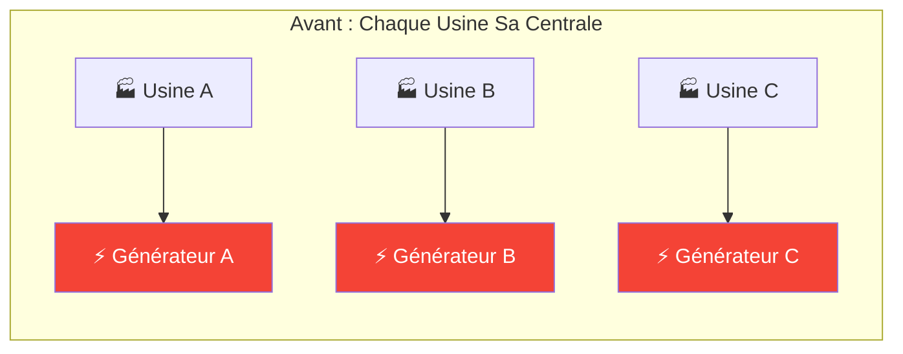

**Problèmes** :
- Chaque usine doit acheter, maintenir et faire évoluer son générateur
- Expertise électrique requise dans chaque entreprise
- Capacité gaspillée quand l'usine tourne au ralenti
- Investissement initial énorme

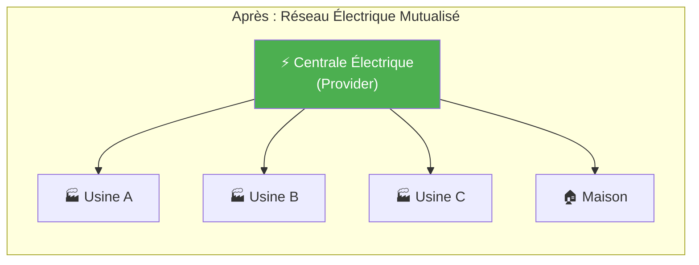

**Avantages** :
- On paie uniquement ce qu'on consomme
- Plus besoin d'expertise électrique
- Capacité quasi-illimitée disponible instantanément
- Pas d'investissement initial

!!! success "Le Cloud, c'est pareil !"
    Le cloud computing, c'est **l'électricité de l'informatique**. Au lieu d'acheter et maintenir vos propres serveurs, vous "branchez" votre application sur un réseau de ressources informatiques mutualisées.

---

## 2. Définition Officielle (NIST)

Le **NIST** (National Institute of Standards and Technology) définit le cloud computing comme :

!!! quote "Définition NIST SP 800-145"
    "Le cloud computing est un modèle permettant un accès réseau, à la demande et en libre-service, à un pool partagé de ressources informatiques configurables (réseaux, serveurs, stockage, applications et services) qui peuvent être rapidement provisionnées et libérées avec un effort de gestion minimal ou une interaction minimale avec le fournisseur de service."

### 2.1 Les 5 Caractéristiques Essentielles

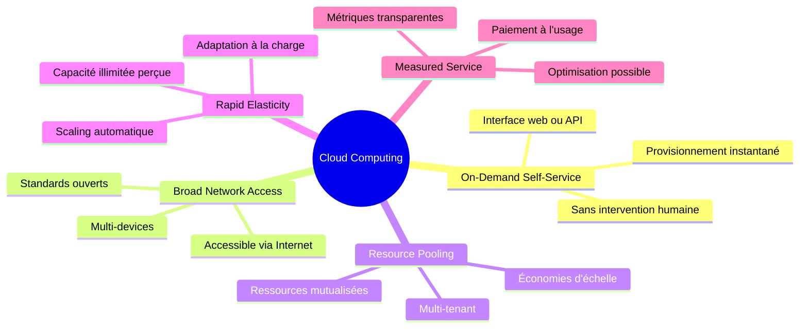

| Caractéristique | Description | Exemple concret |
|-----------------|-------------|-----------------|
| **Self-Service à la demande** | L'utilisateur peut provisionner des ressources sans intervention humaine | Créer un serveur en 3 clics dans la console AWS |
| **Accès réseau universel** | Accessible depuis n'importe où via des protocoles standards | API REST accessible depuis votre laptop ou votre téléphone |
| **Mutualisation des ressources** | Les ressources physiques sont partagées entre plusieurs clients | Votre VM tourne sur le même serveur physique que d'autres clients |
| **Élasticité rapide** | Capacité à augmenter/diminuer les ressources quasi instantanément | Passer de 2 à 200 serveurs en quelques minutes lors d'un pic |
| **Service mesuré** | Facturation basée sur l'utilisation réelle | Payer 0.10€/heure pour un serveur uniquement quand il tourne |

---

## 3. Évolution Historique

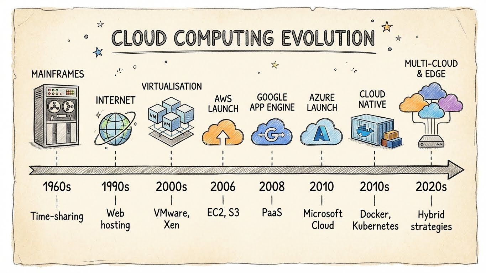

### 3.1 Timeline

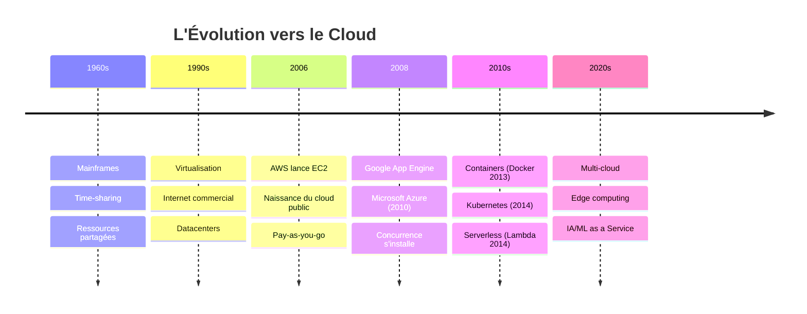

### 3.2 L'Évolution des Modèles d'Hébergement

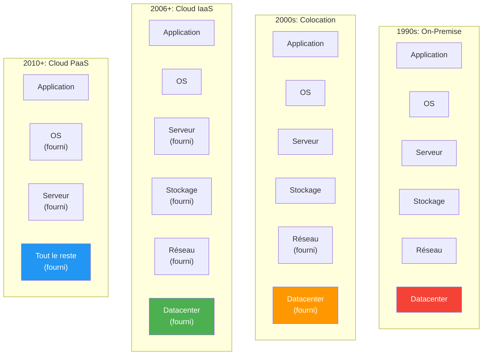

---

## 4. Avantages et Inconvénients

### 4.1 Les Avantages

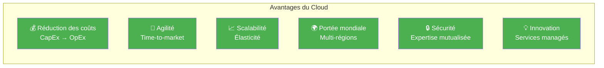

| Avantage | Explication | Impact Worldline |
|----------|-------------|------------------|
| **CapEx → OpEx** | Plus d'investissement initial massif, on paie à l'usage | Budget prévisible, pas de surprise hardware |
| **Time-to-market** | Déployer un environnement en minutes vs semaines | Nouveaux projets paiement lancés plus vite |
| **Scalabilité** | Absorber les pics (Black Friday, soldes) | Transactions x10 sans interruption |
| **Multi-régions** | Présence mondiale instantanée | Conformité locale (données en Europe) |
| **Sécurité** | Équipes de sécurité dédiées chez les providers | Certifications PCI-DSS facilitées |
| **Innovation** | Accès à l'IA, ML, IoT sans expertise interne | Détection de fraude avancée |

### 4.2 Les Inconvénients et Risques

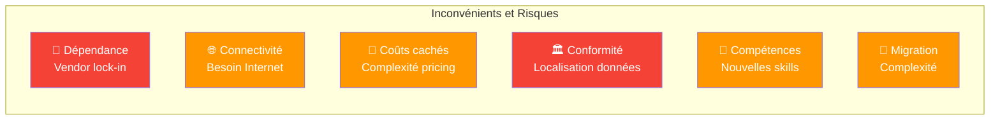

| Risque | Explication | Mitigation |
|--------|-------------|------------|
| **Vendor lock-in** | Difficulté à changer de provider | Architecture cloud-agnostic, containers |
| **Dépendance réseau** | Sans Internet, pas de cloud | Connexions redondantes, hybrid cloud |
| **Coûts imprévisibles** | Facturation complexe, surprises | FinOps, alertes budget, Reserved Instances |
| **Conformité** | Où sont mes données ? | Régions européennes, contrats DPA |
| **Compétences** | Nouvelles technologies à maîtriser | Formation (cette formation !) |
| **Migration** | Lift & shift vs re-architecture | Stratégie progressive, POC |

---

## 5. Les Modèles de Déploiement

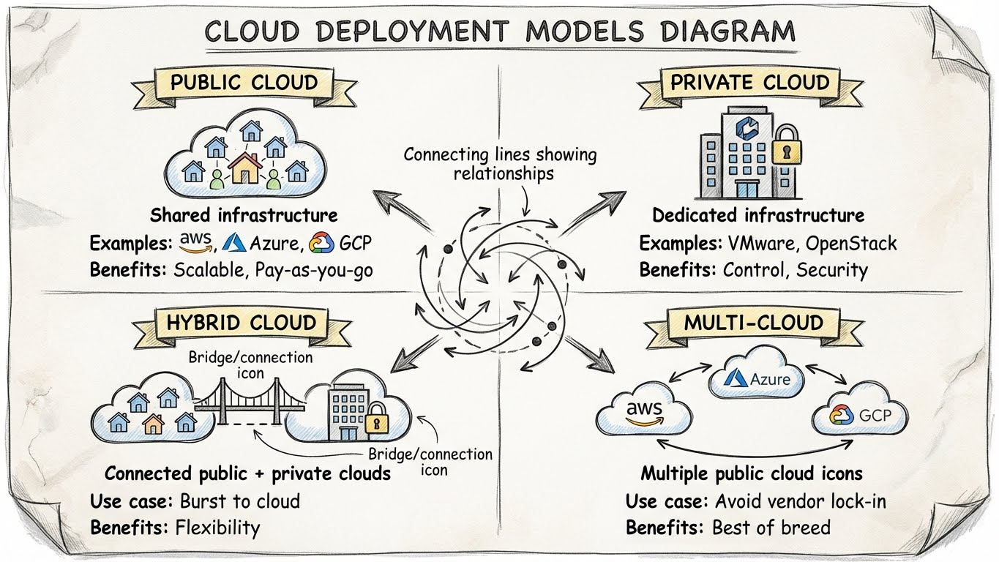

### 5.1 Les 4 Modèles

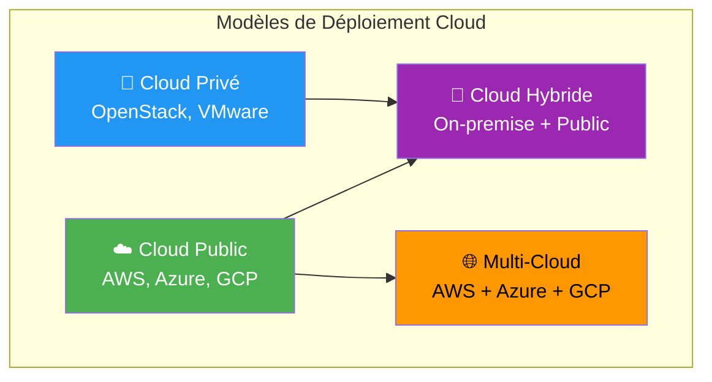

| Modèle | Description | Cas d'usage |
|--------|-------------|-------------|
| **Cloud Public** | Infrastructure partagée, accessible à tous | Startups, applications web, dev/test |
| **Cloud Privé** | Infrastructure dédiée à une organisation | Données sensibles, legacy, conformité stricte |
| **Cloud Hybride** | Combinaison public + privé | Migration progressive, burst capacity |
| **Multi-Cloud** | Utilisation de plusieurs providers publics | Résilience, best-of-breed, négociation |

### 5.2 Contexte Worldline

!!! example "Cas Worldline"
    Une architecture typique dans le secteur du paiement :

    - **Cloud Privé** : Données cartes (PAN), HSM, core banking
    - **Cloud Public** : Applications mobiles, analytics, dev/test
    - **Hybride** : Connexion sécurisée entre les deux

---

## 6. Les Acteurs du Marché

### 6.1 Parts de Marché (2024)


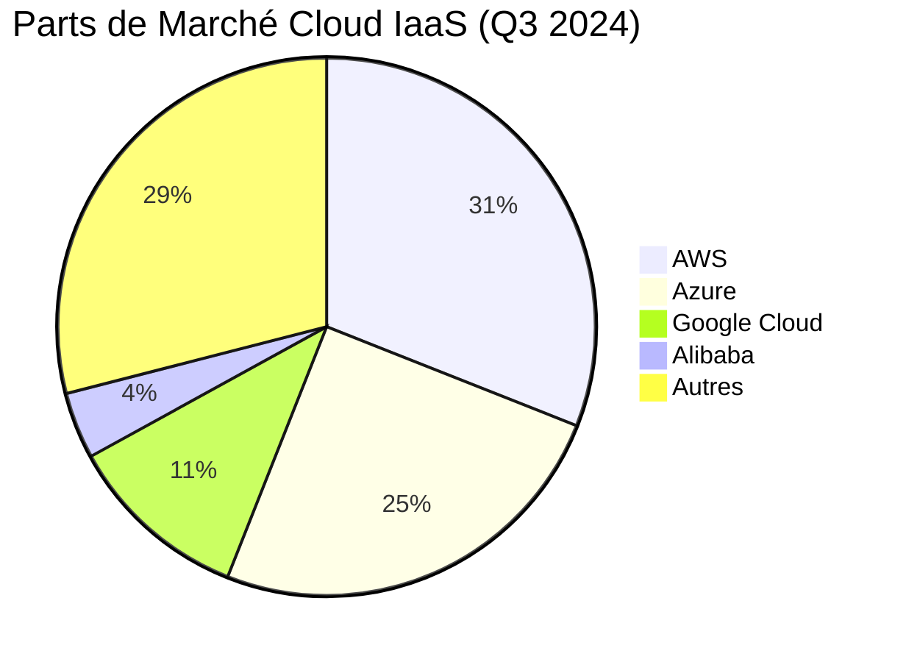

### 6.2 Comparatif des "Big 3"

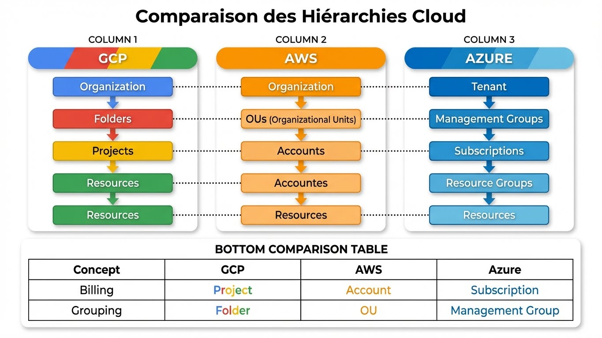

| Critère | AWS | Azure | GCP |
|---------|-----|-------|-----|
| **Lancé en** | 2006 | 2010 | 2008 |
| **Points forts** | Maturité, étendue services | Intégration Microsoft, entreprise | Data/ML, Kubernetes |
| **Régions** | 33+ | 60+ | 37+ |
| **Certifications** | PCI-DSS, ISO, SOC | PCI-DSS, ISO, SOC | PCI-DSS, ISO, SOC |
| **Pricing** | Complexe mais flexible | Intégré licences MS | Compétitif, simple |
| **Idéal pour** | Tout type de workload | Environnements Microsoft | Big Data, ML, containers |

### 6.3 Autres Acteurs

| Catégorie | Acteurs | Spécificité |
|-----------|---------|-------------|
| **Clouds souverains** | OVHcloud, Scaleway, Outscale | Données en France, RGPD |
| **Cloud chinois** | Alibaba, Tencent, Huawei | Marché asiatique |
| **Spécialisés** | DigitalOcean, Linode, Vultr | Simplicité, développeurs |
| **Private cloud** | OpenStack, VMware vSphere | On-premise cloud-like |

---

## 7. Quiz de Validation

!!! question "Question 1"
    Quelle caractéristique NIST permet de créer un serveur sans appeler le support ?

    ??? success "Réponse"
        **Self-Service à la demande** (On-Demand Self-Service)

        Cette caractéristique permet aux utilisateurs de provisionner des ressources via une interface web ou API, sans intervention humaine du fournisseur.

!!! question "Question 2"
    Quel est l'avantage financier principal du passage au cloud ?

    ??? success "Réponse"
        **Transformation du CapEx en OpEx**

        - **CapEx** (Capital Expenditure) : Investissement initial (acheter des serveurs)
        - **OpEx** (Operating Expenditure) : Coûts d'exploitation (payer à l'usage)

        Le cloud élimine les gros investissements initiaux.

!!! question "Question 3"
    Quel modèle de déploiement combine infrastructure privée et publique ?

    ??? success "Réponse"
        **Cloud Hybride**

        Il permet de garder les données sensibles on-premise tout en bénéficiant de l'élasticité du cloud public.

!!! question "Question 4"
    Quel provider cloud a été lancé en premier ?

    ??? success "Réponse"
        **AWS** (Amazon Web Services) en 2006 avec le service EC2.

        Google App Engine a suivi en 2008, puis Microsoft Azure en 2010.

---

## 8. Pour Aller Plus Loin

### Ressources Recommandées

| Ressource | Type | Lien |
|-----------|------|------|
| NIST Cloud Definition | Document officiel | [SP 800-145](https://nvlpubs.nist.gov/nistpubs/Legacy/SP/nistspecialpublication800-145.pdf) |
| AWS Cloud Practitioner | Certification gratuite | [AWS Training](https://aws.amazon.com/training/digital/aws-cloud-practitioner-essentials/) |
| Azure Fundamentals | Parcours Microsoft Learn | [AZ-900 Learning Path](https://learn.microsoft.com/training/paths/az-900-describe-cloud-concepts/) |
| GCP Digital Leader | Formation Google | [Cloud Digital Leader](https://cloud.google.com/training/cloud-digital-leader) |

---

## Exercice : À Vous de Jouer

!!! example "Mise en Pratique"
    **Objectif** : Analyser un cas concret et identifier les caractéristiques NIST du cloud

    **Contexte** : Votre entreprise utilise actuellement un datacenter on-premise pour héberger son application web. Le directeur technique souhaite comprendre concrètement ce que le cloud pourrait apporter. Vous devez présenter les bénéfices en termes des 5 caractéristiques essentielles du NIST.

    **Tâches à réaliser** :

    1. Pour chaque caractéristique NIST, donnez un exemple concret de bénéfice pour l'entreprise
    2. Identifiez quel modèle de déploiement (public, privé, hybride) serait le plus adapté pour une application de paiement
    3. Comparez les parts de marché des 3 principaux cloud providers et expliquez pourquoi AWS est leader

    **Critères de validation** :

    - [ ] Les 5 caractéristiques NIST sont expliquées avec des exemples concrets
    - [ ] Le choix du modèle de déploiement est justifié
    - [ ] La comparaison des providers inclut au moins 3 critères de différenciation

??? quote "Solution"
    **1. Exemples concrets des caractéristiques NIST :**

    - **Self-Service à la demande** : Un développeur peut créer un environnement de test complet en 5 minutes via une console web, sans attendre l'équipe infrastructure (vs plusieurs jours en on-premise)

    - **Accès réseau universel** : Les équipes peuvent travailler de n'importe où (télétravail, agences internationales) et accéder aux environnements via des APIs standard HTTPS

    - **Mutualisation des ressources** : Les coûts d'infrastructure sont partagés entre des milliers de clients, permettant des économies d'échelle impossibles en on-premise

    - **Élasticité rapide** : Lors du Black Friday, l'application peut automatiquement passer de 10 à 100 serveurs en quelques minutes, puis redescendre après le pic

    - **Service mesuré** : Facturation précise basée sur l'usage réel (par heure/seconde), avec des dashboards montrant exactement où va chaque euro dépensé

    **2. Modèle de déploiement pour une application de paiement :**

    **Recommandation : Cloud Hybride**

    ```
    ┌─────────────────────────┐     ┌─────────────────────────┐
    │   Cloud Privé/On-Prem   │     │     Cloud Public        │
    │                         │     │                         │
    │  • HSM (clés crypto)    │◄───►│  • API Gateway          │
    │  • Données PAN          │     │  • Portails web         │
    │  • Core Banking         │     │  • Analytics            │
    │  • Legacy               │     │  • Dev/Test             │
    └─────────────────────────┘     └─────────────────────────┘
             (Sécurité max)              (Agilité, scaling)
    ```

    **Justification :**
    - Données sensibles (numéros de carte) restent dans un environnement hautement sécurisé
    - Conformité PCI-DSS facilitée avec périmètre restreint
    - Applications non-critiques bénéficient de l'agilité du cloud public
    - Migration progressive possible

    **3. Comparaison des cloud providers :**

    | Critère | AWS (31%) | Azure (25%) | GCP (11%) |
    |---------|-----------|-------------|-----------|
    | **Maturité** | Leader depuis 2006, le plus d'expérience | Lancé en 2010, rattrape rapidement | Plus récent, focus innovation |
    | **Étendue services** | 200+ services, le plus complet | 100+ services, excellente intégration Microsoft | Services ciblés, excellents en data/ML |
    | **Entreprise** | Toute taille, tous secteurs | Fort sur clients Microsoft (Active Directory, Office 365) | Startups tech, data scientists |

    **Pourquoi AWS est leader ?**
    - Premier arrivé (2006) : 4 ans d'avance sur Azure
    - Écosystème mature : plus de documentation, formations, expertise disponible
    - Innovation continue : souvent premier à lancer de nouveaux services
    - Effet réseau : beaucoup d'entreprises l'utilisent déjà

---

## Navigation

| Précédent | Suivant |
|-----------|---------|
| [← Introduction](index.md) | [Module 2 : Modèles de Service →](02-module.md) |

---

## Navigation

| | |
|:---|---:|
| [← Programme](index.md) | [Module 2 : Les Modèles de Service (Ia... →](02-module.md) |

[Retour au Programme](index.md){ .md-button }
