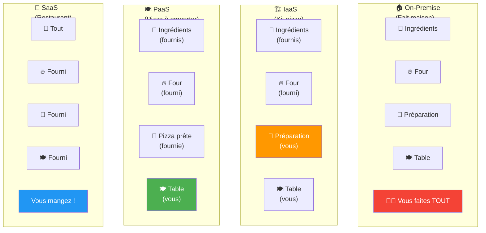
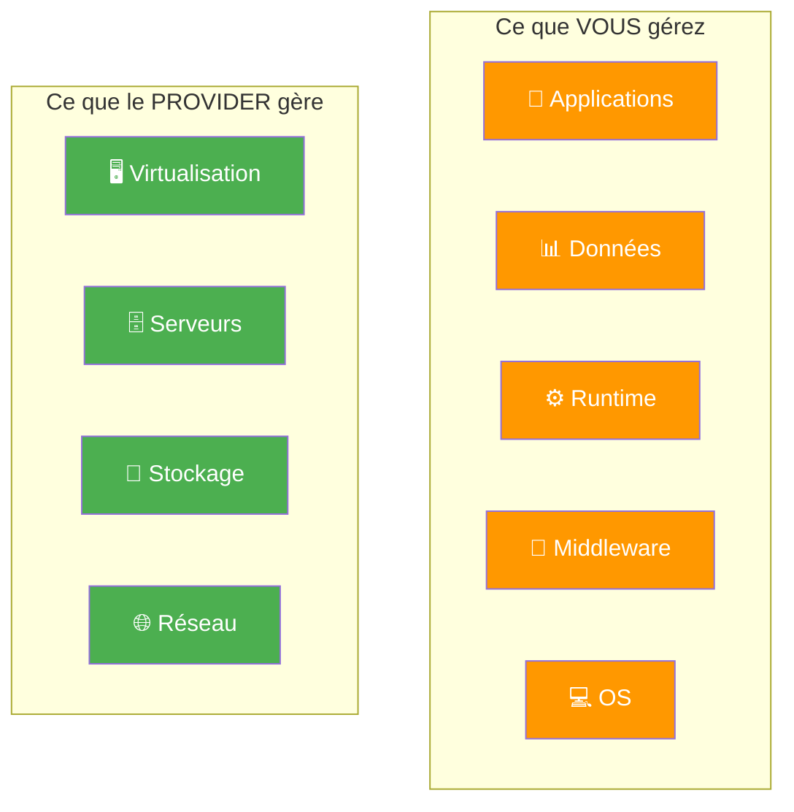
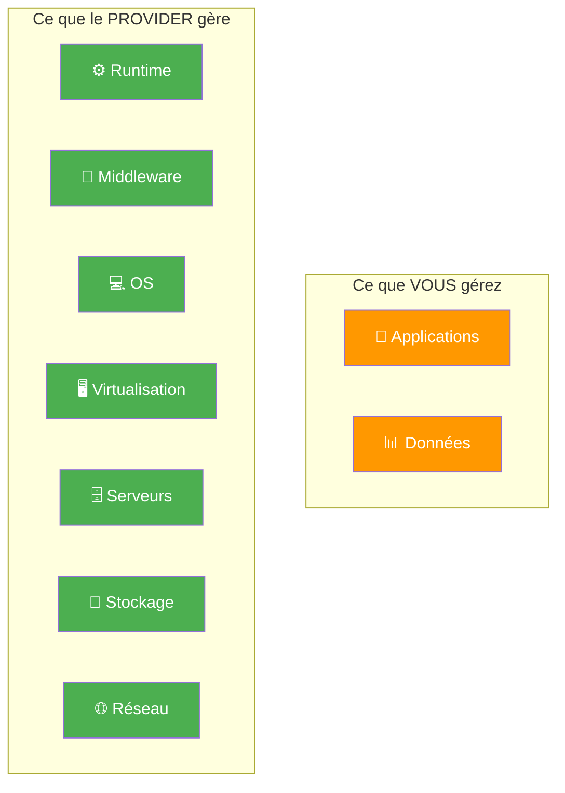
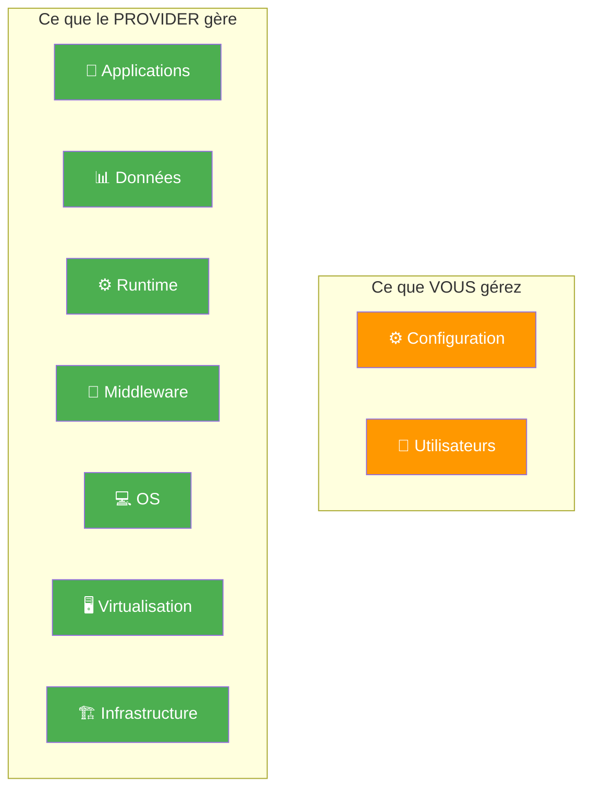
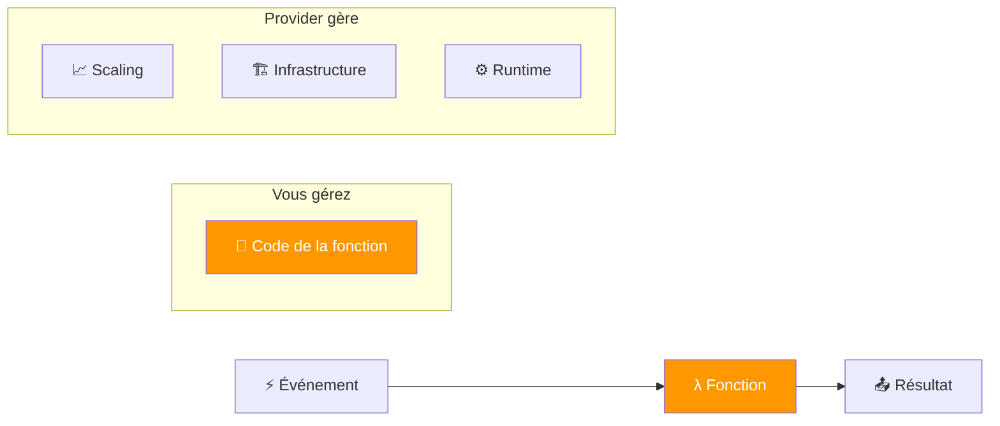
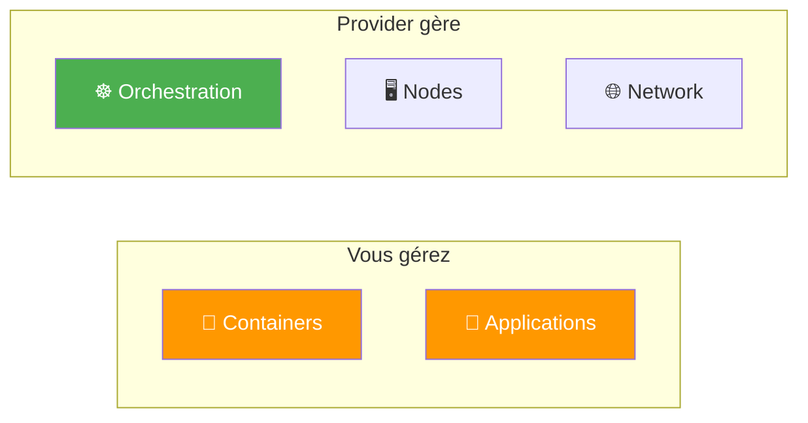
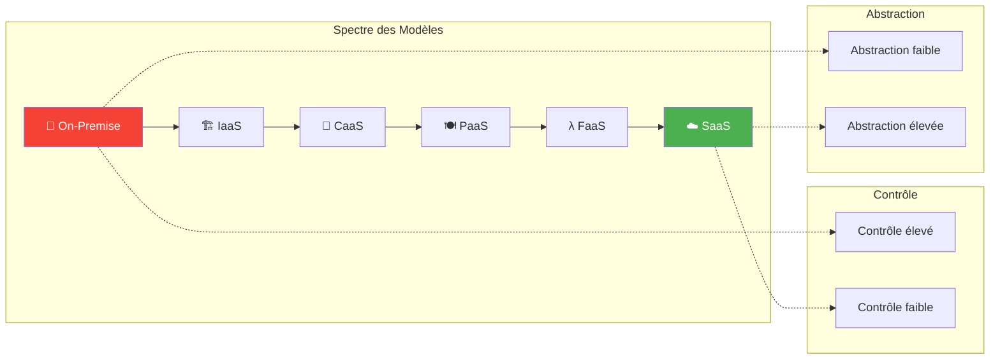
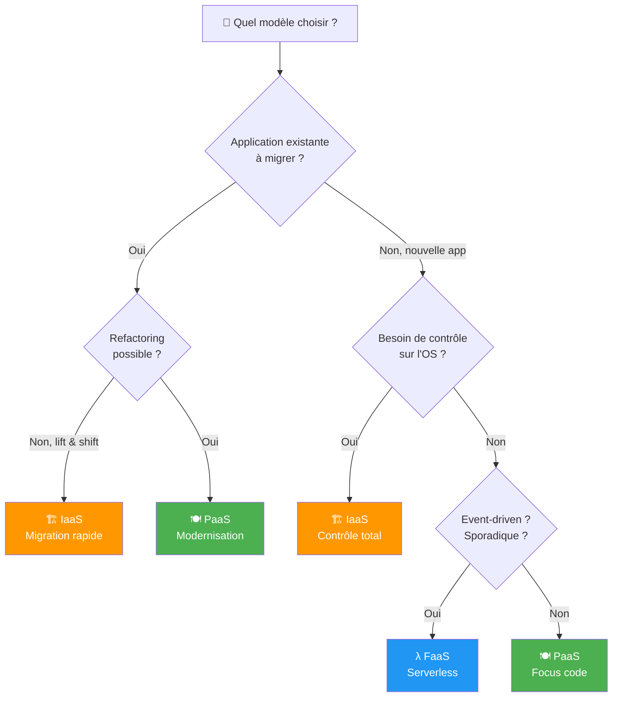
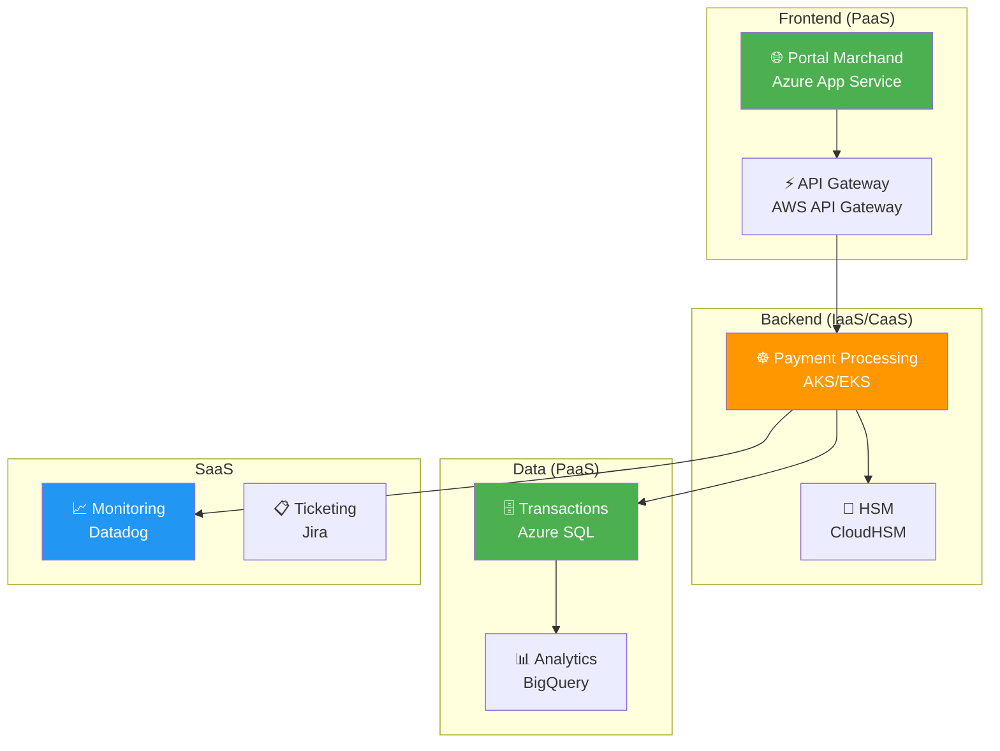

---
tags:
  - formation
  - cloud
  - iaas
  - paas
  - saas
  - modeles
---

# Module 2 : Les Modèles de Service (IaaS, PaaS, SaaS)

## Objectifs du Module

À la fin de ce module, vous serez capable de :

- :fontawesome-solid-layer-group: Distinguer IaaS, PaaS et SaaS
- :fontawesome-solid-handshake: Comprendre le modèle de responsabilité partagée
- :fontawesome-solid-lightbulb: Choisir le bon modèle pour un cas d'usage
- :fontawesome-solid-code-compare: Comparer les offres AWS, Azure et GCP

---

## 1. L'Analogie de la Pizza

### 1.1 Les 4 Façons de Manger une Pizza



| Modèle | Analogie Pizza | En informatique |
|--------|----------------|-----------------|
| **On-Premise** | Vous faites tout vous-même | Vous gérez serveurs, OS, middleware, app |
| **IaaS** | Kit pizza : ingrédients + four fournis | Serveurs virtuels fournis, vous gérez le reste |
| **PaaS** | Pizza à emporter | Plateforme prête, vous déployez votre app |
| **SaaS** | Restaurant | Application prête à utiliser |

---

## 2. Définitions Détaillées

### 2.1 Infrastructure as a Service (IaaS)

!!! info "Définition"
    **IaaS** fournit des ressources informatiques virtualisées via Internet : serveurs, stockage, réseau. Vous gardez le contrôle sur l'OS et les applications.



**Exemples de services IaaS :**

| Provider | Service | Description |
|----------|---------|-------------|
| **AWS** | EC2 | Machines virtuelles |
| **Azure** | Virtual Machines | Machines virtuelles |
| **GCP** | Compute Engine | Machines virtuelles |
| **Tous** | VPC/VNet | Réseaux virtuels |
| **Tous** | Block Storage | Disques virtuels |

**Cas d'usage IaaS :**
- Migration "lift & shift" d'applications existantes
- Environnements de développement/test
- Applications nécessitant un contrôle complet
- Workloads avec des exigences OS spécifiques

### 2.2 Platform as a Service (PaaS)

!!! info "Définition"
    **PaaS** fournit une plateforme complète pour développer, exécuter et gérer des applications sans gérer l'infrastructure sous-jacente.



**Exemples de services PaaS :**

| Provider | Service | Description |
|----------|---------|-------------|
| **AWS** | Elastic Beanstalk | Déploiement d'apps web |
| **AWS** | RDS | Base de données managée |
| **Azure** | App Service | Hébergement d'apps web |
| **Azure** | SQL Database | Base de données managée |
| **GCP** | App Engine | Déploiement d'apps web |
| **GCP** | Cloud SQL | Base de données managée |

**Cas d'usage PaaS :**
- Développement d'applications web/mobile
- Bases de données sans administration
- API et microservices
- Applications avec scaling automatique

### 2.3 Software as a Service (SaaS)

!!! info "Définition"
    **SaaS** fournit des applications complètes accessibles via Internet. L'utilisateur n'a rien à installer ni à maintenir.



**Exemples de SaaS :**

| Catégorie | Exemples |
|-----------|----------|
| **Email** | Gmail, Outlook 365 |
| **CRM** | Salesforce, HubSpot |
| **Collaboration** | Slack, Microsoft Teams |
| **Stockage** | Dropbox, Google Drive |
| **ERP** | SAP S/4HANA Cloud, Oracle Cloud |
| **DevOps** | GitHub, GitLab, Jira |

**Cas d'usage SaaS :**
- Outils de productivité (email, calendrier)
- Applications métier standard
- Collaboration d'équipe
- Pas de ressources IT pour gérer des serveurs

---

## 3. Le Modèle de Responsabilité Partagée

### 3.1 Vue d'Ensemble

```mermaid
graph TB
    subgraph "Responsabilité Client"
        direction TB
        C1["Données"]
        C2["Identités & Accès"]
        C3["Applications"]
        C4["Configuration"]
    end

    subgraph "Responsabilité Partagée"
        direction TB
        S1["Réseau"]
        S2["Chiffrement"]
        S3["OS (selon modèle)"]
    end

    subgraph "Responsabilité Provider"
        direction TB
        P1["Infrastructure physique"]
        P2["Datacenters"]
        P3["Réseau global"]
        P4["Hyperviseur"]
    end

    style C1 fill:#ff9800,color:#fff
    style C2 fill:#ff9800,color:#fff
    style C3 fill:#ff9800,color:#fff
    style C4 fill:#ff9800,color:#fff
    style S1 fill:#9c27b0,color:#fff
    style S2 fill:#9c27b0,color:#fff
    style S3 fill:#9c27b0,color:#fff
    style P1 fill:#4caf50,color:#fff
    style P2 fill:#4caf50,color:#fff
    style P3 fill:#4caf50,color:#fff
    style P4 fill:#4caf50,color:#fff
```



### 3.2 Responsabilités par Modèle

| Composant | On-Premise | IaaS | PaaS | SaaS |
|-----------|------------|------|------|------|
| **Données** | Client | Client | Client | Client |
| **Applications** | Client | Client | Client | Provider |
| **Runtime** | Client | Client | Provider | Provider |
| **Middleware** | Client | Client | Provider | Provider |
| **OS** | Client | Client | Provider | Provider |
| **Virtualisation** | Client | Provider | Provider | Provider |
| **Serveurs** | Client | Provider | Provider | Provider |
| **Stockage** | Client | Provider | Provider | Provider |
| **Réseau** | Client | Provider | Provider | Provider |
| **Datacenter** | Client | Provider | Provider | Provider |

!!! warning "Point Clé Sécurité"
    **La sécurité DES données reste TOUJOURS votre responsabilité**, quel que soit le modèle !

    Le provider sécurise l'infrastructure (sécurité **du** cloud), vous sécurisez vos données et accès (sécurité **dans** le cloud).

---

## 4. Nouveaux Modèles Émergents

### 4.1 FaaS (Function as a Service) / Serverless



| Provider | Service | Description |
|----------|---------|-------------|
| **AWS** | Lambda | Fonctions serverless |
| **Azure** | Functions | Fonctions serverless |
| **GCP** | Cloud Functions | Fonctions serverless |

**Caractéristiques :**
- Facturation à l'exécution (milliseconde)
- Scaling automatique de 0 à millions
- Pas de serveur à gérer
- Idéal pour : APIs, event-driven, batch

### 4.2 CaaS (Container as a Service)



| Provider | Service | Description |
|----------|---------|-------------|
| **AWS** | EKS, ECS, Fargate | Kubernetes/Containers managés |
| **Azure** | AKS, Container Apps | Kubernetes/Containers managés |
| **GCP** | GKE, Cloud Run | Kubernetes/Containers managés |

### 4.3 Comparatif des Modèles



---

## 5. Comparatif Multi-Cloud

### 5.1 Services Équivalents par Provider

| Catégorie | AWS | Azure | GCP |
|-----------|-----|-------|-----|
| **VM** | EC2 | Virtual Machines | Compute Engine |
| **Containers** | ECS, EKS | AKS, Container Apps | GKE, Cloud Run |
| **Serverless** | Lambda | Functions | Cloud Functions |
| **Object Storage** | S3 | Blob Storage | Cloud Storage |
| **SQL Database** | RDS | SQL Database | Cloud SQL |
| **NoSQL** | DynamoDB | Cosmos DB | Firestore, Bigtable |
| **Data Warehouse** | Redshift | Synapse | BigQuery |
| **ML/AI** | SageMaker | ML Studio | Vertex AI |
| **CDN** | CloudFront | CDN | Cloud CDN |
| **DNS** | Route 53 | DNS | Cloud DNS |

### 5.2 Quand Choisir Quel Modèle ?



---

## 6. Cas Pratique : Worldline Payment Gateway

### 6.1 Architecture Mixte



### 6.2 Justification des Choix

| Composant | Modèle | Justification |
|-----------|--------|---------------|
| Portal Marchand | **PaaS** | Scaling auto, pas d'admin serveur |
| Payment Processing | **CaaS** | Contrôle, portabilité, compliance |
| HSM | **IaaS** | Sécurité maximale, dédié |
| Database transactions | **PaaS** | HA automatique, backups |
| Analytics | **PaaS** | BigQuery pour volumes massifs |
| Monitoring | **SaaS** | Pas de valeur à le faire soi-même |

---

## 7. Quiz de Validation

!!! question "Question 1"
    Vous devez migrer rapidement une application legacy sans modification. Quel modèle ?

    ??? success "Réponse"
        **IaaS** - Migration "lift & shift"

        L'application tourne sur une VM comme elle tournait sur un serveur physique. Pas de modification du code nécessaire.

!!! question "Question 2"
    Vous développez une nouvelle API REST. Vous voulez vous concentrer uniquement sur le code. Quel modèle ?

    ??? success "Réponse"
        **PaaS** ou **FaaS**

        - PaaS (App Service, App Engine) : si l'API tourne en continu
        - FaaS (Lambda, Functions) : si l'API est appelée sporadiquement

!!! question "Question 3"
    Qui est responsable de la sécurité des données stockées dans S3 ?

    ??? success "Réponse"
        **Le client (vous)**

        AWS sécurise l'infrastructure S3 (disponibilité, intégrité physique), mais vous êtes responsable du chiffrement, des permissions d'accès et de la classification des données.

!!! question "Question 4"
    Votre équipe utilise Salesforce pour le CRM. Quel modèle de service est-ce ?

    ??? success "Réponse"
        **SaaS** (Software as a Service)

        Salesforce est une application complète accessible via navigateur. Vous n'installez rien, ne gérez aucune infrastructure.

---

## 8. Résumé

| Modèle | Vous gérez | Provider gère | Idéal pour |
|--------|------------|---------------|------------|
| **IaaS** | App, Data, OS | Infra, Réseau | Migration, contrôle |
| **PaaS** | App, Data | Tout le reste | Développement, agilité |
| **SaaS** | Config, Users | Application complète | Productivité, standard |
| **FaaS** | Code | Exécution, scaling | Event-driven, APIs |
| **CaaS** | Containers | Orchestration | Microservices |

---

## Exercice : À Vous de Jouer

!!! example "Mise en Pratique"
    **Objectif** : Choisir le bon modèle de service cloud pour différents scénarios

    **Contexte** : Vous êtes architecte cloud et devez conseiller trois équipes projet sur le choix du modèle de service approprié (IaaS, PaaS, SaaS, FaaS) selon leurs besoins spécifiques.

    **Tâches à réaliser** :

    1. **Projet A** : Migration d'une application legacy Java/Oracle vers le cloud sans modification du code
    2. **Projet B** : Développement d'une nouvelle API REST pour un portail marchand
    3. **Projet C** : Remplacement de l'outil CRM actuel vieillissant

    Pour chaque projet, identifiez :
    - Le modèle de service recommandé (IaaS/PaaS/SaaS/FaaS)
    - Les services équivalents sur AWS, Azure et GCP
    - Les responsabilités client vs provider selon le modèle de responsabilité partagée

    **Critères de validation** :

    - [ ] Le modèle de service choisi est adapté à chaque scénario
    - [ ] Les services cloud des 3 providers sont identifiés correctement
    - [ ] Les responsabilités sont clairement définies pour chaque cas

??? quote "Solution"
    **Projet A : Migration legacy Java/Oracle (sans modification)**

    **Modèle recommandé : IaaS**

    **Justification :**
    - Approche "Lift & Shift" pour migration rapide
    - Pas de refactoring = pas de risque sur le code existant
    - Contrôle total sur l'OS et la configuration Oracle

    **Services cloud :**
    ```
    | Composant | AWS | Azure | GCP |
    |-----------|-----|-------|-----|
    | VMs       | EC2 | Virtual Machines | Compute Engine |
    | Oracle DB | EC2 + Oracle ou RDS Oracle | VM + Oracle | Compute Engine + Oracle |
    | Réseau    | VPC | VNet | VPC |
    | Stockage  | EBS | Managed Disks | Persistent Disk |
    ```

    **Responsabilités :**
    - **Vous gérez** : Application Java, configuration Oracle, OS, patching, sécurité applicative
    - **Provider gère** : Infrastructure physique, hyperviseur, réseau backbone, datacenter

    **Projet B : Nouvelle API REST pour portail marchand**

    **Modèle recommandé : PaaS (ou FaaS si charges sporadiques)**

    **Option 1 - PaaS (si API tourne en continu) :**
    ```bash
    # AWS
    aws elasticbeanstalk create-application --application-name merchant-api

    # Azure
    az webapp create --name merchant-api --resource-group prod-rg

    # GCP
    gcloud app deploy app.yaml
    ```

    **Services cloud :**
    | Provider | Service PaaS | Service FaaS |
    |----------|--------------|--------------|
    | AWS | Elastic Beanstalk, ECS | Lambda + API Gateway |
    | Azure | App Service | Functions + API Management |
    | GCP | App Engine, Cloud Run | Cloud Functions |

    **Responsabilités :**
    - **Vous gérez** : Code de l'API, configuration, données
    - **Provider gère** : Runtime, OS, scaling, load balancing, haute disponibilité

    **Avantages PaaS :**
    - Focus sur le code uniquement
    - Scaling automatique
    - Déploiement simplifié (git push)
    - Monitoring intégré

    **Option 2 - FaaS (si charges sporadiques) :**
    - Coût = 0 quand pas utilisé
    - Scaling automatique de 0 à millions
    - Facturation à la milliseconde

    **Projet C : Remplacement du CRM**

    **Modèle recommandé : SaaS**

    **Justification :**
    - CRM = besoin standard, pas de développement spécifique nécessaire
    - Pas de ressources IT pour maintenir un serveur
    - Mises à jour automatiques
    - Accès mobile natif

    **Solutions SaaS recommandées :**
    ```
    Leaders du marché :
    • Salesforce (leader, le plus complet)
    • HubSpot (PME, marketing intégré)
    • Microsoft Dynamics 365 (intégration Office 365)
    • Zoho CRM (rapport qualité/prix)
    ```

    **Responsabilités :**
    - **Vous gérez** : Configuration, utilisateurs, données métier, workflows
    - **Provider gère** : Application complète, infrastructure, sécurité, sauvegardes, mises à jour

    **Avantages :**
    - Déploiement immédiat (quelques jours vs mois)
    - Coût prévisible (abonnement mensuel/utilisateur)
    - Expertise CRM incluse
    - Intégrations pré-construites

    **Tableau récapitulatif :**

    | Projet | Modèle | Effort gestion | Time-to-market | Coût initial |
    |--------|--------|----------------|----------------|--------------|
    | A - Migration legacy | IaaS | Élevé | Moyen (semaines) | Moyen |
    | B - Nouvelle API | PaaS/FaaS | Faible | Rapide (jours) | Faible |
    | C - CRM | SaaS | Minimal | Immédiat | Très faible |

---

## Navigation

| Précédent | Suivant |
|-----------|---------|
| [← Module 1 : Qu'est-ce que le Cloud ?](01-module.md) | [Module 3 : Infrastructure Cloud →](03-module.md) |
