---
tags:
  - formation
  - cloud
  - iaas
  - paas
  - saas
  - modeles
---

# Module 2 : Les Modèles de Service (IaaS, PaaS, SaaS)

## Objectifs du Module

À la fin de ce module, vous serez capable de :

- :fontawesome-solid-layer-group: Distinguer IaaS, PaaS et SaaS
- :fontawesome-solid-handshake: Comprendre le modèle de responsabilité partagée
- :fontawesome-solid-lightbulb: Choisir le bon modèle pour un cas d'usage
- :fontawesome-solid-code-compare: Comparer les offres AWS, Azure et GCP

---

## 1. L'Analogie de la Pizza

### 1.1 Les 4 Façons de Manger une Pizza

```mermaid
graph TB
    subgraph "🏠 On-Premise<br/>(Fait maison)"
        OP1["🍅 Ingrédients"]
        OP2["🔥 Four"]
        OP3["🍕 Préparation"]
        OP4["🍽️ Table"]
        OP5["👨‍🍳 Vous faites TOUT"]
    end

    subgraph "🏗️ IaaS<br/>(Kit pizza)"
        IAAS1["🍅 Ingrédients<br/>(fournis)"]
        IAAS2["🔥 Four<br/>(fourni)"]
        IAAS3["🍕 Préparation<br/>(vous)"]
        IAAS4["🍽️ Table<br/>(vous)"]
    end

    subgraph "🍽️ PaaS<br/>(Pizza à emporter)"
        PAAS1["🍅 Ingrédients<br/>(fournis)"]
        PAAS2["🔥 Four<br/>(fourni)"]
        PAAS3["🍕 Pizza prête<br/>(fournie)"]
        PAAS4["🍽️ Table<br/>(vous)"]
    end

    subgraph "🍕 SaaS<br/>(Restaurant)"
        SAAS1["🍅 Tout"]
        SAAS2["🔥 Fourni"]
        SAAS3["🍕 Fourni"]
        SAAS4["🍽️ Fourni"]
        SAAS5["Vous mangez !"]
    end

    style OP5 fill:#f44336,color:#fff
    style IAAS3 fill:#ff9800,color:#fff
    style PAAS4 fill:#4caf50,color:#fff
    style SAAS5 fill:#2196f3,color:#fff
```

| Modèle | Analogie Pizza | En informatique |
|--------|----------------|-----------------|
| **On-Premise** | Vous faites tout vous-même | Vous gérez serveurs, OS, middleware, app |
| **IaaS** | Kit pizza : ingrédients + four fournis | Serveurs virtuels fournis, vous gérez le reste |
| **PaaS** | Pizza à emporter | Plateforme prête, vous déployez votre app |
| **SaaS** | Restaurant | Application prête à utiliser |

---

## 2. Définitions Détaillées

### 2.1 Infrastructure as a Service (IaaS)

!!! info "Définition"
    **IaaS** fournit des ressources informatiques virtualisées via Internet : serveurs, stockage, réseau. Vous gardez le contrôle sur l'OS et les applications.

```mermaid
graph TB
    subgraph "Ce que VOUS gérez"
        APP["📱 Applications"]
        DATA["📊 Données"]
        RUNTIME["⚙️ Runtime"]
        MIDDLEWARE["🔧 Middleware"]
        OS["💻 OS"]
    end

    subgraph "Ce que le PROVIDER gère"
        VIRT["🖥️ Virtualisation"]
        SERVERS["🗄️ Serveurs"]
        STORAGE["💾 Stockage"]
        NETWORK["🌐 Réseau"]
    end

    style APP fill:#ff9800,color:#fff
    style DATA fill:#ff9800,color:#fff
    style RUNTIME fill:#ff9800,color:#fff
    style MIDDLEWARE fill:#ff9800,color:#fff
    style OS fill:#ff9800,color:#fff
    style VIRT fill:#4caf50,color:#fff
    style SERVERS fill:#4caf50,color:#fff
    style STORAGE fill:#4caf50,color:#fff
    style NETWORK fill:#4caf50,color:#fff
```

**Exemples de services IaaS :**

| Provider | Service | Description |
|----------|---------|-------------|
| **AWS** | EC2 | Machines virtuelles |
| **Azure** | Virtual Machines | Machines virtuelles |
| **GCP** | Compute Engine | Machines virtuelles |
| **Tous** | VPC/VNet | Réseaux virtuels |
| **Tous** | Block Storage | Disques virtuels |

**Cas d'usage IaaS :**
- Migration "lift & shift" d'applications existantes
- Environnements de développement/test
- Applications nécessitant un contrôle complet
- Workloads avec des exigences OS spécifiques

### 2.2 Platform as a Service (PaaS)

!!! info "Définition"
    **PaaS** fournit une plateforme complète pour développer, exécuter et gérer des applications sans gérer l'infrastructure sous-jacente.

```mermaid
graph TB
    subgraph "Ce que VOUS gérez"
        APP["📱 Applications"]
        DATA["📊 Données"]
    end

    subgraph "Ce que le PROVIDER gère"
        RUNTIME["⚙️ Runtime"]
        MIDDLEWARE["🔧 Middleware"]
        OS["💻 OS"]
        VIRT["🖥️ Virtualisation"]
        SERVERS["🗄️ Serveurs"]
        STORAGE["💾 Stockage"]
        NETWORK["🌐 Réseau"]
    end

    style APP fill:#ff9800,color:#fff
    style DATA fill:#ff9800,color:#fff
    style RUNTIME fill:#4caf50,color:#fff
    style MIDDLEWARE fill:#4caf50,color:#fff
    style OS fill:#4caf50,color:#fff
    style VIRT fill:#4caf50,color:#fff
    style SERVERS fill:#4caf50,color:#fff
    style STORAGE fill:#4caf50,color:#fff
    style NETWORK fill:#4caf50,color:#fff
```

**Exemples de services PaaS :**

| Provider | Service | Description |
|----------|---------|-------------|
| **AWS** | Elastic Beanstalk | Déploiement d'apps web |
| **AWS** | RDS | Base de données managée |
| **Azure** | App Service | Hébergement d'apps web |
| **Azure** | SQL Database | Base de données managée |
| **GCP** | App Engine | Déploiement d'apps web |
| **GCP** | Cloud SQL | Base de données managée |

**Cas d'usage PaaS :**
- Développement d'applications web/mobile
- Bases de données sans administration
- API et microservices
- Applications avec scaling automatique

### 2.3 Software as a Service (SaaS)

!!! info "Définition"
    **SaaS** fournit des applications complètes accessibles via Internet. L'utilisateur n'a rien à installer ni à maintenir.

```mermaid
graph TB
    subgraph "Ce que VOUS gérez"
        CONFIG["⚙️ Configuration"]
        USERS["👥 Utilisateurs"]
    end

    subgraph "Ce que le PROVIDER gère"
        APP["📱 Applications"]
        DATA["📊 Données"]
        RUNTIME["⚙️ Runtime"]
        MIDDLEWARE["🔧 Middleware"]
        OS["💻 OS"]
        VIRT["🖥️ Virtualisation"]
        INFRA["🏗️ Infrastructure"]
    end

    style CONFIG fill:#ff9800,color:#fff
    style USERS fill:#ff9800,color:#fff
    style APP fill:#4caf50,color:#fff
    style DATA fill:#4caf50,color:#fff
    style RUNTIME fill:#4caf50,color:#fff
    style MIDDLEWARE fill:#4caf50,color:#fff
    style OS fill:#4caf50,color:#fff
    style VIRT fill:#4caf50,color:#fff
    style INFRA fill:#4caf50,color:#fff
```

**Exemples de SaaS :**

| Catégorie | Exemples |
|-----------|----------|
| **Email** | Gmail, Outlook 365 |
| **CRM** | Salesforce, HubSpot |
| **Collaboration** | Slack, Microsoft Teams |
| **Stockage** | Dropbox, Google Drive |
| **ERP** | SAP S/4HANA Cloud, Oracle Cloud |
| **DevOps** | GitHub, GitLab, Jira |

**Cas d'usage SaaS :**
- Outils de productivité (email, calendrier)
- Applications métier standard
- Collaboration d'équipe
- Pas de ressources IT pour gérer des serveurs

---

## 3. Le Modèle de Responsabilité Partagée

### 3.1 Vue d'Ensemble

```mermaid
graph TB
    subgraph "Responsabilité Client"
        direction TB
        C1["Données"]
        C2["Identités & Accès"]
        C3["Applications"]
        C4["Configuration"]
    end

    subgraph "Responsabilité Partagée"
        direction TB
        S1["Réseau"]
        S2["Chiffrement"]
        S3["OS (selon modèle)"]
    end

    subgraph "Responsabilité Provider"
        direction TB
        P1["Infrastructure physique"]
        P2["Datacenters"]
        P3["Réseau global"]
        P4["Hyperviseur"]
    end

    style C1 fill:#ff9800,color:#fff
    style C2 fill:#ff9800,color:#fff
    style C3 fill:#ff9800,color:#fff
    style C4 fill:#ff9800,color:#fff
    style S1 fill:#9c27b0,color:#fff
    style S2 fill:#9c27b0,color:#fff
    style S3 fill:#9c27b0,color:#fff
    style P1 fill:#4caf50,color:#fff
    style P2 fill:#4caf50,color:#fff
    style P3 fill:#4caf50,color:#fff
    style P4 fill:#4caf50,color:#fff
```

### 3.2 Responsabilités par Modèle

| Composant | On-Premise | IaaS | PaaS | SaaS |
|-----------|------------|------|------|------|
| **Données** | Client | Client | Client | Client |
| **Applications** | Client | Client | Client | Provider |
| **Runtime** | Client | Client | Provider | Provider |
| **Middleware** | Client | Client | Provider | Provider |
| **OS** | Client | Client | Provider | Provider |
| **Virtualisation** | Client | Provider | Provider | Provider |
| **Serveurs** | Client | Provider | Provider | Provider |
| **Stockage** | Client | Provider | Provider | Provider |
| **Réseau** | Client | Provider | Provider | Provider |
| **Datacenter** | Client | Provider | Provider | Provider |

!!! warning "Point Clé Sécurité"
    **La sécurité DES données reste TOUJOURS votre responsabilité**, quel que soit le modèle !

    Le provider sécurise l'infrastructure (sécurité **du** cloud), vous sécurisez vos données et accès (sécurité **dans** le cloud).

---

## 4. Nouveaux Modèles Émergents

### 4.1 FaaS (Function as a Service) / Serverless

```mermaid
graph LR
    EVENT["⚡ Événement"] --> FUNCTION["λ Fonction"]
    FUNCTION --> RESULT["📤 Résultat"]

    subgraph "Vous gérez"
        CODE["📝 Code de la fonction"]
    end

    subgraph "Provider gère"
        SCALE["📈 Scaling"]
        INFRA["🏗️ Infrastructure"]
        RUNTIME["⚙️ Runtime"]
    end

    style FUNCTION fill:#ff9800,color:#fff
    style CODE fill:#ff9800,color:#fff
```

| Provider | Service | Description |
|----------|---------|-------------|
| **AWS** | Lambda | Fonctions serverless |
| **Azure** | Functions | Fonctions serverless |
| **GCP** | Cloud Functions | Fonctions serverless |

**Caractéristiques :**
- Facturation à l'exécution (milliseconde)
- Scaling automatique de 0 à millions
- Pas de serveur à gérer
- Idéal pour : APIs, event-driven, batch

### 4.2 CaaS (Container as a Service)

```mermaid
graph LR
    subgraph "Vous gérez"
        CONTAINER["🐳 Containers"]
        APP["📱 Applications"]
    end

    subgraph "Provider gère"
        ORCH["☸️ Orchestration"]
        NODES["🖥️ Nodes"]
        NETWORK["🌐 Network"]
    end

    style CONTAINER fill:#ff9800,color:#fff
    style APP fill:#ff9800,color:#fff
    style ORCH fill:#4caf50,color:#fff
```

| Provider | Service | Description |
|----------|---------|-------------|
| **AWS** | EKS, ECS, Fargate | Kubernetes/Containers managés |
| **Azure** | AKS, Container Apps | Kubernetes/Containers managés |
| **GCP** | GKE, Cloud Run | Kubernetes/Containers managés |

### 4.3 Comparatif des Modèles

```mermaid
graph LR
    subgraph "Spectre des Modèles"
        ONPREM["🏢 On-Premise"] --> IAAS["🏗️ IaaS"]
        IAAS --> CAAS["🐳 CaaS"]
        CAAS --> PAAS["🍽️ PaaS"]
        PAAS --> FAAS["λ FaaS"]
        FAAS --> SAAS["☁️ SaaS"]
    end

    subgraph "Contrôle"
        HIGH["Contrôle élevé"]
        LOW["Contrôle faible"]
    end

    subgraph "Abstraction"
        LOW2["Abstraction faible"]
        HIGH2["Abstraction élevée"]
    end

    ONPREM -.-> HIGH
    SAAS -.-> LOW
    ONPREM -.-> LOW2
    SAAS -.-> HIGH2

    style ONPREM fill:#f44336,color:#fff
    style SAAS fill:#4caf50,color:#fff
```

---

## 5. Comparatif Multi-Cloud

### 5.1 Services Équivalents par Provider

| Catégorie | AWS | Azure | GCP |
|-----------|-----|-------|-----|
| **VM** | EC2 | Virtual Machines | Compute Engine |
| **Containers** | ECS, EKS | AKS, Container Apps | GKE, Cloud Run |
| **Serverless** | Lambda | Functions | Cloud Functions |
| **Object Storage** | S3 | Blob Storage | Cloud Storage |
| **SQL Database** | RDS | SQL Database | Cloud SQL |
| **NoSQL** | DynamoDB | Cosmos DB | Firestore, Bigtable |
| **Data Warehouse** | Redshift | Synapse | BigQuery |
| **ML/AI** | SageMaker | ML Studio | Vertex AI |
| **CDN** | CloudFront | CDN | Cloud CDN |
| **DNS** | Route 53 | DNS | Cloud DNS |

### 5.2 Quand Choisir Quel Modèle ?

```mermaid
flowchart TD
    START["🤔 Quel modèle choisir ?"] --> Q1{"Application existante<br/>à migrer ?"}

    Q1 -->|Oui| Q2{"Refactoring<br/>possible ?"}
    Q1 -->|Non, nouvelle app| Q3{"Besoin de contrôle<br/>sur l'OS ?"}

    Q2 -->|Non, lift & shift| IAAS["🏗️ IaaS<br/>Migration rapide"]
    Q2 -->|Oui| PAAS["🍽️ PaaS<br/>Modernisation"]

    Q3 -->|Oui| IAAS2["🏗️ IaaS<br/>Contrôle total"]
    Q3 -->|Non| Q4{"Event-driven ?<br/>Sporadique ?"}

    Q4 -->|Oui| FAAS["λ FaaS<br/>Serverless"]
    Q4 -->|Non| PAAS2["🍽️ PaaS<br/>Focus code"]

    style IAAS fill:#ff9800,color:#fff
    style IAAS2 fill:#ff9800,color:#fff
    style PAAS fill:#4caf50,color:#fff
    style PAAS2 fill:#4caf50,color:#fff
    style FAAS fill:#2196f3,color:#fff
```

---

## 6. Cas Pratique : Worldline Payment Gateway

### 6.1 Architecture Mixte

```mermaid
graph TB
    subgraph "Frontend (PaaS)"
        WEB["🌐 Portal Marchand<br/>Azure App Service"]
        API["⚡ API Gateway<br/>AWS API Gateway"]
    end

    subgraph "Backend (IaaS/CaaS)"
        K8S["☸️ Payment Processing<br/>AKS/EKS"]
        HSM["🔐 HSM<br/>CloudHSM"]
    end

    subgraph "Data (PaaS)"
        SQL["🗄️ Transactions<br/>Azure SQL"]
        NOSQL["📊 Analytics<br/>BigQuery"]
    end

    subgraph "SaaS"
        MONITOR["📈 Monitoring<br/>Datadog"]
        JIRA["📋 Ticketing<br/>Jira"]
    end

    WEB --> API
    API --> K8S
    K8S --> HSM
    K8S --> SQL
    SQL --> NOSQL
    K8S --> MONITOR

    style WEB fill:#4caf50,color:#fff
    style K8S fill:#ff9800,color:#fff
    style SQL fill:#4caf50,color:#fff
    style MONITOR fill:#2196f3,color:#fff
```

### 6.2 Justification des Choix

| Composant | Modèle | Justification |
|-----------|--------|---------------|
| Portal Marchand | **PaaS** | Scaling auto, pas d'admin serveur |
| Payment Processing | **CaaS** | Contrôle, portabilité, compliance |
| HSM | **IaaS** | Sécurité maximale, dédié |
| Database transactions | **PaaS** | HA automatique, backups |
| Analytics | **PaaS** | BigQuery pour volumes massifs |
| Monitoring | **SaaS** | Pas de valeur à le faire soi-même |

---

## 7. Quiz de Validation

!!! question "Question 1"
    Vous devez migrer rapidement une application legacy sans modification. Quel modèle ?

    ??? success "Réponse"
        **IaaS** - Migration "lift & shift"

        L'application tourne sur une VM comme elle tournait sur un serveur physique. Pas de modification du code nécessaire.

!!! question "Question 2"
    Vous développez une nouvelle API REST. Vous voulez vous concentrer uniquement sur le code. Quel modèle ?

    ??? success "Réponse"
        **PaaS** ou **FaaS**

        - PaaS (App Service, App Engine) : si l'API tourne en continu
        - FaaS (Lambda, Functions) : si l'API est appelée sporadiquement

!!! question "Question 3"
    Qui est responsable de la sécurité des données stockées dans S3 ?

    ??? success "Réponse"
        **Le client (vous)**

        AWS sécurise l'infrastructure S3 (disponibilité, intégrité physique), mais vous êtes responsable du chiffrement, des permissions d'accès et de la classification des données.

!!! question "Question 4"
    Votre équipe utilise Salesforce pour le CRM. Quel modèle de service est-ce ?

    ??? success "Réponse"
        **SaaS** (Software as a Service)

        Salesforce est une application complète accessible via navigateur. Vous n'installez rien, ne gérez aucune infrastructure.

---

## 8. Résumé

| Modèle | Vous gérez | Provider gère | Idéal pour |
|--------|------------|---------------|------------|
| **IaaS** | App, Data, OS | Infra, Réseau | Migration, contrôle |
| **PaaS** | App, Data | Tout le reste | Développement, agilité |
| **SaaS** | Config, Users | Application complète | Productivité, standard |
| **FaaS** | Code | Exécution, scaling | Event-driven, APIs |
| **CaaS** | Containers | Orchestration | Microservices |

---

## Navigation

| Précédent | Suivant |
|-----------|---------|
| [← Module 1 : Qu'est-ce que le Cloud ?](01-module.md) | [Module 3 : Infrastructure Cloud →](03-module.md) |
