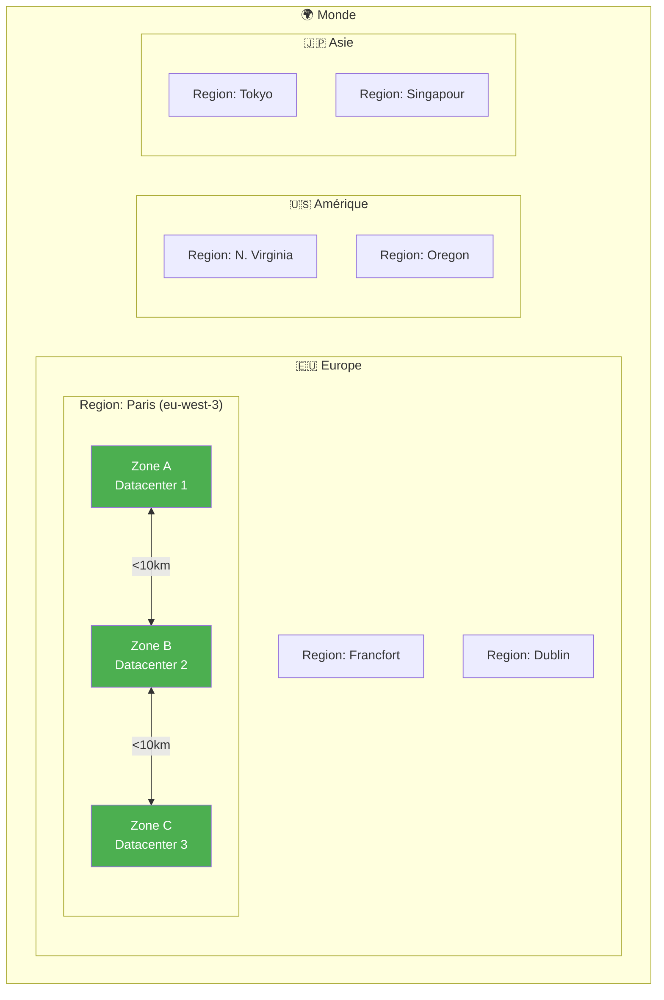
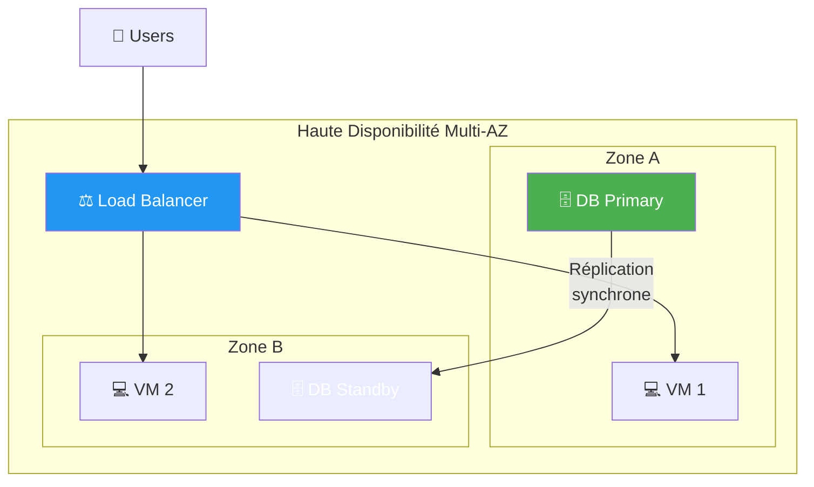
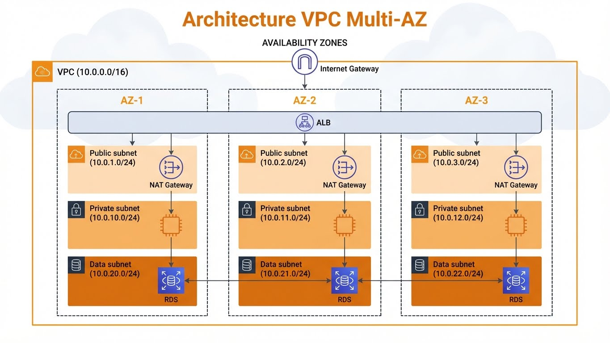
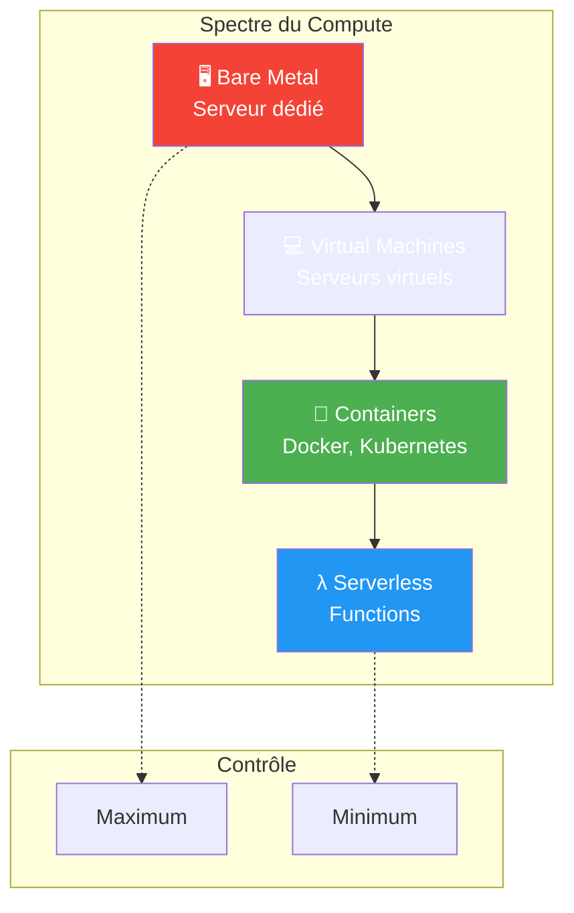
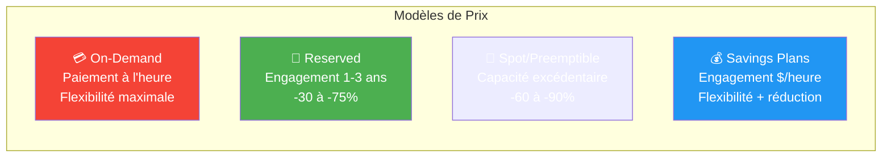
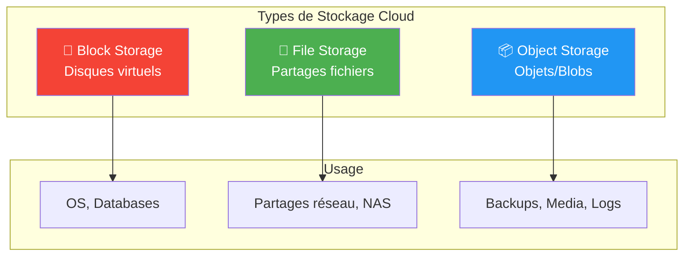
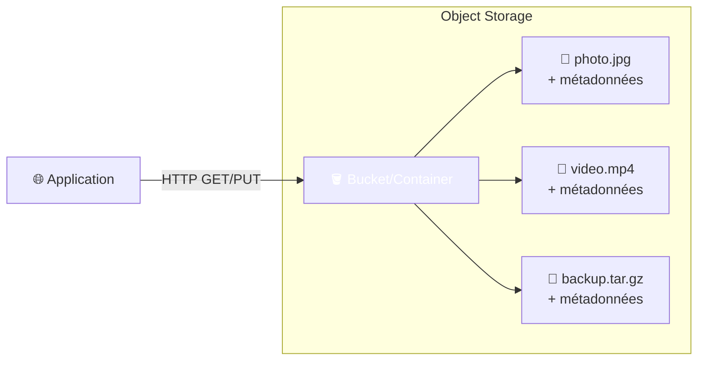
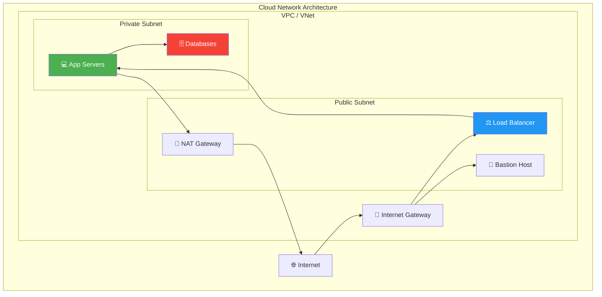
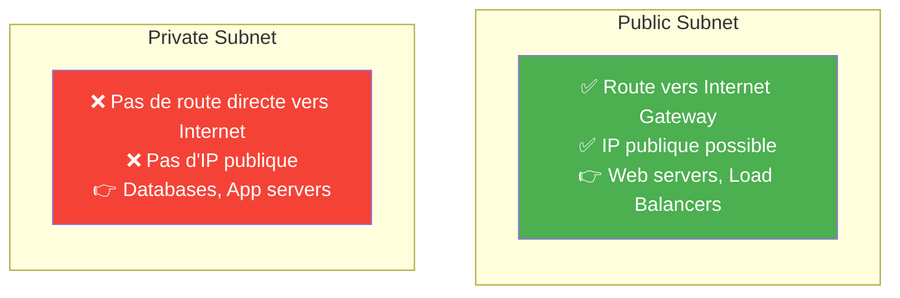
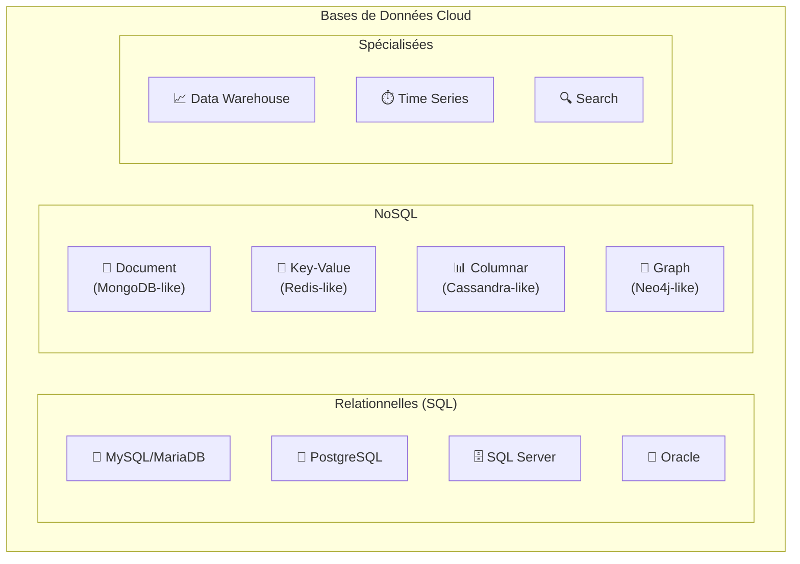

---
tags:
  - formation
  - cloud
  - compute
  - storage
  - network
  - infrastructure
---

# Module 3 : Infrastructure Cloud (Compute, Storage, Network)

## Objectifs du Module

À la fin de ce module, vous serez capable de :

- :fontawesome-solid-server: Comprendre les types de ressources compute
- :fontawesome-solid-hard-drive: Différencier les types de stockage cloud
- :fontawesome-solid-network-wired: Expliquer les concepts réseau cloud
- :fontawesome-solid-globe: Comprendre les régions et zones de disponibilité
- :fontawesome-solid-code-compare: Mapper les services entre AWS, Azure et GCP

---

## 1. Régions et Zones de Disponibilité

### 1.1 Géographie du Cloud



### 1.2 Concepts Clés

| Concept | Description | Distance | Latence |
|---------|-------------|----------|---------|
| **Zone de Disponibilité** | Un ou plusieurs datacenters isolés | < 100 km | < 2 ms |
| **Région** | Ensemble de zones dans une zone géographique | - | - |
| **Edge Location** | Points de présence pour CDN | Mondial | Variable |

### 1.3 Pourquoi Plusieurs Zones ?



!!! success "Bénéfice"
    Si une zone tombe (panne électrique, catastrophe naturelle), les autres zones continuent de fonctionner. Le service reste disponible.



### 1.4 Régions par Provider

| Provider | Nb Régions | Régions France | Régions Europe |
|----------|------------|----------------|----------------|
| **AWS** | 33+ | Paris (eu-west-3) | Dublin, Francfort, Londres, Milan, Stockholm... |
| **Azure** | 60+ | France Central, France South | West Europe, North Europe, Germany... |
| **GCP** | 37+ | - | Belgium, Netherlands, Zurich, Frankfurt... |

---

## 2. Compute (Calcul)

### 2.1 Types de Ressources Compute



### 2.2 Virtual Machines (IaaS)

#### Familles d'Instances

| Type | Usage | Caractéristiques |
|------|-------|------------------|
| **General Purpose** | Workloads équilibrés | CPU/RAM équilibrés |
| **Compute Optimized** | Calcul intensif | Plus de CPU |
| **Memory Optimized** | Bases de données | Plus de RAM |
| **Storage Optimized** | Big Data, Data Warehouse | I/O élevé |
| **GPU** | ML, rendu graphique | Cartes graphiques |

#### Équivalences Multi-Cloud

| Catégorie | AWS | Azure | GCP |
|-----------|-----|-------|-----|
| **General** | t3, m6i | B, D | e2, n2 |
| **Compute** | c6i | F | c2 |
| **Memory** | r6i | E | m2 |
| **Storage** | i3, d2 | L | - |
| **GPU** | p4, g5 | NC, ND | a2 |

#### Exemple de Tailles

```text
AWS EC2 : t3.micro → t3.small → t3.medium → t3.large → t3.xlarge → t3.2xlarge

         1 vCPU     2 vCPU      2 vCPU       2 vCPU      4 vCPU       8 vCPU
         1 GB       2 GB        4 GB         8 GB        16 GB        32 GB
```

### 2.3 Options de Facturation



| Modèle | Réduction | Engagement | Risque |
|--------|-----------|------------|--------|
| **On-Demand** | 0% | Aucun | Aucun |
| **Reserved** | 30-75% | 1-3 ans | Si besoin change |
| **Spot** | 60-90% | Aucun | Interruption possible |
| **Savings Plans** | 20-50% | $/heure pendant 1-3 ans | Modéré |

!!! tip "Conseil Worldline"
    - **Production critique** : Reserved Instances
    - **Dev/Test** : On-Demand ou Spot
    - **Batch processing** : Spot Instances

---

## 3. Storage (Stockage)

### 3.1 Types de Stockage



### 3.2 Block Storage (Disques)

!!! info "Définition"
    Équivalent d'un disque dur attaché à une VM. Données organisées en blocs.

| Provider | Service | Description |
|----------|---------|-------------|
| **AWS** | EBS (Elastic Block Store) | Disques persistants |
| **Azure** | Managed Disks | Disques managés |
| **GCP** | Persistent Disk | Disques persistants |

**Types de disques :**

| Type | IOPS | Latence | Usage |
|------|------|---------|-------|
| **SSD Standard** | 3000 | ~1ms | Usage général |
| **SSD Provisioned** | 64000+ | <1ms | Bases de données |
| **HDD** | 500 | ~10ms | Archivage, logs |

### 3.3 Object Storage (Objets)

!!! info "Définition"
    Stockage d'objets (fichiers) avec métadonnées. Accès via HTTP/API. Capacité quasi-illimitée.



| Provider | Service | Durabilité |
|----------|---------|------------|
| **AWS** | S3 | 99.999999999% (11 nines) |
| **Azure** | Blob Storage | 99.999999999% |
| **GCP** | Cloud Storage | 99.999999999% |

**Classes de stockage :**

| Classe | Accès | Coût stockage | Coût accès | Usage |
|--------|-------|---------------|------------|-------|
| **Standard** | Fréquent | $$$ | $ | Données actives |
| **Infrequent** | Mensuel | $$ | $$ | Backups récents |
| **Archive** | Rare | $ | $$$ | Archives long terme |

### 3.4 File Storage (Fichiers)

!!! info "Définition"
    Partages de fichiers accessibles via NFS ou SMB. Équivalent d'un NAS.

| Provider | Service | Protocoles |
|----------|---------|------------|
| **AWS** | EFS, FSx | NFS, SMB |
| **Azure** | Azure Files | SMB, NFS |
| **GCP** | Filestore | NFS |

---

## 4. Network (Réseau)

### 4.1 Concepts Fondamentaux



### 4.2 Glossaire Réseau Cloud

| Concept | Description | Équivalent On-Premise |
|---------|-------------|----------------------|
| **VPC / VNet** | Réseau virtuel isolé | VLAN |
| **Subnet** | Sous-réseau dans un VPC | Sous-réseau |
| **Internet Gateway** | Connexion vers Internet | Routeur edge |
| **NAT Gateway** | Accès Internet sortant pour subnets privés | NAT |
| **Security Group** | Firewall stateful au niveau instance | Firewall |
| **NACL** | Firewall stateless au niveau subnet | ACL |
| **Load Balancer** | Distribution de trafic | F5, HAProxy |
| **VPN Gateway** | Connexion VPN site-to-site | Concentrateur VPN |
| **Peering** | Connexion entre VPCs | Interconnexion |

### 4.3 Public vs Private Subnets



### 4.4 Services Réseau par Provider

| Service | AWS | Azure | GCP |
|---------|-----|-------|-----|
| **Réseau virtuel** | VPC | VNet | VPC |
| **Load Balancer L4** | NLB | Load Balancer | Network LB |
| **Load Balancer L7** | ALB | Application Gateway | HTTP(S) LB |
| **CDN** | CloudFront | CDN | Cloud CDN |
| **DNS** | Route 53 | DNS | Cloud DNS |
| **VPN** | Site-to-Site VPN | VPN Gateway | Cloud VPN |
| **Connexion privée** | Direct Connect | ExpressRoute | Cloud Interconnect |

---

## 5. Bases de Données

### 5.1 Types de Bases de Données Cloud



### 5.2 Services par Provider

| Type | AWS | Azure | GCP |
|------|-----|-------|-----|
| **MySQL/PostgreSQL** | RDS, Aurora | Azure Database | Cloud SQL |
| **SQL Server** | RDS SQL Server | SQL Database | Cloud SQL |
| **Document** | DocumentDB | Cosmos DB | Firestore |
| **Key-Value** | DynamoDB | Cosmos DB | Bigtable |
| **Cache** | ElastiCache | Cache for Redis | Memorystore |
| **Data Warehouse** | Redshift | Synapse | BigQuery |
| **Search** | OpenSearch | Cognitive Search | - |

### 5.3 Managed vs Self-Managed

| Aspect | Self-Managed (VM) | Managed (PaaS) |
|--------|-------------------|----------------|
| **Installation** | Vous | Provider |
| **Patching** | Vous | Provider |
| **Backups** | Vous | Automatique |
| **Haute Dispo** | Vous (complexe) | Quelques clics |
| **Scaling** | Vous | Automatique |
| **Coût** | Moins cher | Plus cher mais moins d'effort |
| **Contrôle** | Total | Limité |

---

## 6. Récapitulatif Multi-Cloud

### 6.1 Tableau de Correspondance

| Catégorie | AWS | Azure | GCP |
|-----------|-----|-------|-----|
| **VM** | EC2 | Virtual Machines | Compute Engine |
| **Containers** | ECS, EKS | AKS | GKE |
| **Serverless** | Lambda | Functions | Cloud Functions |
| **Block Storage** | EBS | Managed Disks | Persistent Disk |
| **Object Storage** | S3 | Blob Storage | Cloud Storage |
| **File Storage** | EFS | Azure Files | Filestore |
| **VPC** | VPC | VNet | VPC |
| **Load Balancer** | ALB/NLB | Load Balancer | Cloud Load Balancing |
| **SQL Database** | RDS | SQL Database | Cloud SQL |
| **NoSQL** | DynamoDB | Cosmos DB | Firestore |
| **CDN** | CloudFront | CDN | Cloud CDN |
| **DNS** | Route 53 | DNS | Cloud DNS |

---

## 7. Quiz de Validation

!!! question "Question 1"
    Pourquoi déployer une application sur plusieurs zones de disponibilité ?

    ??? success "Réponse"
        **Haute disponibilité**

        Si une zone tombe (panne datacenter, catastrophe), les autres zones continuent de fonctionner. Le service reste disponible pour les utilisateurs.

!!! question "Question 2"
    Quel type de stockage utiliseriez-vous pour stocker des millions de photos uploadées par des utilisateurs ?

    ??? success "Réponse"
        **Object Storage** (S3, Blob Storage, Cloud Storage)

        - Capacité quasi-illimitée
        - Accès HTTP/API
        - Coût optimisé pour gros volumes
        - Durabilité 11 nines

!!! question "Question 3"
    Quelle est la différence entre un Security Group et une NACL ?

    ??? success "Réponse"
        | Security Group | NACL |
        |----------------|------|
        | Niveau instance/VM | Niveau subnet |
        | Stateful (retour auto) | Stateless (règles explicites) |
        | Allow only | Allow et Deny |

!!! question "Question 4"
    Quel type d'instance choisir pour une base de données en mémoire (Redis) ?

    ??? success "Réponse"
        **Memory Optimized** (AWS: r6i, Azure: E-series, GCP: m2)

        Ces instances ont un ratio RAM/CPU élevé, idéal pour les bases de données en mémoire.

---

## 8. Pour Aller Plus Loin

| Ressource | Description |
|-----------|-------------|
| [AWS Well-Architected](https://aws.amazon.com/architecture/well-architected/) | Best practices architecture AWS |
| [Azure Architecture Center](https://docs.microsoft.com/azure/architecture/) | Patterns et guides Azure |
| [GCP Architecture Framework](https://cloud.google.com/architecture/framework) | Framework architecture GCP |

---

## Exercice : À Vous de Jouer

!!! example "Mise en Pratique"
    **Objectif** : Concevoir l'infrastructure cloud pour une application web

    **Contexte** : Vous devez déployer une application e-commerce dans le cloud avec les exigences suivantes :
    - 3 serveurs web (2 vCPU, 4 Go RAM chacun)
    - 1 base de données PostgreSQL haute disponibilité
    - Stockage pour 5 To de photos produits
    - Haute disponibilité obligatoire (multi-AZ)
    - Région : Europe (France ou proche)

    **Tâches à réaliser** :

    1. Choisissez un cloud provider (AWS, Azure ou GCP) et justifiez votre choix
    2. Définissez l'architecture réseau (VPC, subnets publics/privés)
    3. Sélectionnez les types d'instances et services appropriés
    4. Calculez le coût mensuel estimé

    **Critères de validation** :

    - [ ] Architecture multi-AZ avec au moins 2 zones de disponibilité
    - [ ] Segmentation réseau correcte (DMZ, application, données)
    - [ ] Services de stockage adaptés (block vs object)
    - [ ] Estimation de coûts réaliste

??? quote "Solution"
    **1. Choix du cloud provider : AWS**

    **Justification :**
    - Région Paris (eu-west-3) disponible pour conformité RGPD
    - Services matures et bien documentés
    - Bon rapport fonctionnalités/coûts pour ce cas d'usage
    - (Note : Azure et GCP seraient aussi valides)

    **2. Architecture réseau**

    ```bash
    # Création VPC
    aws ec2 create-vpc --cidr-block 10.0.0.0/16 --region eu-west-3

    # Subnets publics (pour load balancer)
    aws ec2 create-subnet --vpc-id vpc-xxx --cidr-block 10.0.1.0/24 --availability-zone eu-west-3a
    aws ec2 create-subnet --vpc-id vpc-xxx --cidr-block 10.0.2.0/24 --availability-zone eu-west-3b

    # Subnets privés (pour serveurs web)
    aws ec2 create-subnet --vpc-id vpc-xxx --cidr-block 10.0.11.0/24 --availability-zone eu-west-3a
    aws ec2 create-subnet --vpc-id vpc-xxx --cidr-block 10.0.12.0/24 --availability-zone eu-west-3b

    # Subnets data (pour base de données)
    aws ec2 create-subnet --vpc-id vpc-xxx --cidr-block 10.0.21.0/24 --availability-zone eu-west-3a
    aws ec2 create-subnet --vpc-id vpc-xxx --cidr-block 10.0.22.0/24 --availability-zone eu-west-3b
    ```

    **Architecture complète :**
    ```text
    ┌─────────────────────────────────────────────────────────────┐
    │                    VPC 10.0.0.0/16                          │
    │                                                             │
    │  ┌─────────────────────┬─────────────────────┐             │
    │  │  Zone A (eu-west-3a)│  Zone B (eu-west-3b)│             │
    │  ├─────────────────────┼─────────────────────┤             │
    │  │ Public Subnet       │ Public Subnet       │             │
    │  │ 10.0.1.0/24        │ 10.0.2.0/24        │             │
    │  │     ALB ────────────┼────── ALB          │             │
    │  ├─────────────────────┼─────────────────────┤             │
    │  │ Private Subnet      │ Private Subnet      │             │
    │  │ 10.0.11.0/24       │ 10.0.12.0/24       │             │
    │  │  Web Server 1      │  Web Server 2       │             │
    │  │  Web Server 3      │                     │             │
    │  ├─────────────────────┼─────────────────────┤             │
    │  │ Data Subnet         │ Data Subnet         │             │
    │  │ 10.0.21.0/24       │ 10.0.22.0/24       │             │
    │  │  RDS Primary ──────┼───▶ RDS Standby     │             │
    │  └─────────────────────┴─────────────────────┘             │
    └─────────────────────────────────────────────────────────────┘
    ```

    **3. Services sélectionnés**

    **Compute :**
    ```bash
    # Instances EC2 pour les serveurs web
    # Type : t3.medium (2 vCPU, 4 Go RAM)
    aws ec2 run-instances \
      --image-id ami-xxx \
      --instance-type t3.medium \
      --count 3 \
      --subnet-id subnet-private-a
    ```
    - **3x EC2 t3.medium** (2 vCPU, 4 Go RAM)
    - Placement : 2 en Zone A, 1 en Zone B

    **Load Balancer :**
    ```bash
    # Application Load Balancer
    aws elbv2 create-load-balancer \
      --name ecommerce-alb \
      --subnets subnet-public-a subnet-public-b \
      --security-groups sg-alb
    ```
    - **Application Load Balancer** (ALB) multi-AZ

    **Base de données :**
    ```bash
    # RDS PostgreSQL Multi-AZ
    aws rds create-db-instance \
      --db-instance-identifier ecommerce-db \
      --db-instance-class db.t3.large \
      --engine postgres \
      --allocated-storage 100 \
      --multi-az \
      --db-subnet-group-name db-subnet-group
    ```
    - **RDS PostgreSQL** (db.t3.large : 2 vCPU, 8 Go RAM)
    - Multi-AZ activé (standby automatique)
    - 100 Go SSD

    **Stockage photos :**
    ```bash
    # S3 bucket pour les photos
    aws s3 mb s3://ecommerce-products-photos-eu

    # Lifecycle policy pour optimiser les coûts
    aws s3api put-bucket-lifecycle-configuration \
      --bucket ecommerce-products-photos-eu \
      --lifecycle-configuration file://lifecycle.json
    ```
    - **S3 Standard** pour 5 To d'images
    - CloudFront (CDN) devant S3 pour la performance

    **4. Estimation des coûts mensuels (région Paris)**

    | Service | Détail | Coût mensuel |
    |---------|--------|--------------|
    | **EC2** | 3x t3.medium (24/7) | 3 × 42€ = 126€ |
    | **ALB** | Load balancer + data | 23€ + 10€ = 33€ |
    | **RDS PostgreSQL** | db.t3.large Multi-AZ | 156€ |
    | **RDS Storage** | 100 Go SSD | 12€ |
    | **S3 Standard** | 5 To stockage | 5000 Go × 0.023€ = 115€ |
    | **CloudFront** | 2 To data transfer | 85€ |
    | **Data Transfer** | Sortant 1 To | 90€ |
    | **Backup** | Snapshots EBS + RDS | 20€ |
    | **VPC** | NAT Gateway | 33€ |
    | **Total** | | **≈ 670€/mois** |
    | **Total annuel** | | **≈ 8 040€/an** |

    **Optimisations possibles :**
    - Reserved Instances 1 an : **-30%** sur EC2 et RDS → économie de 84€/mois
    - S3 Intelligent-Tiering pour photos anciennes : **-20%** → économie de 23€/mois
    - Total optimisé : **≈ 563€/mois** (**6 756€/an**)

    **Comparaison vs On-Premise :**
    ```text
    Coûts on-premise sur 3 ans :
    • Hardware (serveurs, storage, network) : 45 000€
    • Datacenter (espace, énergie) : 18 000€
    • Licences (OS, DB) : 12 000€
    • Personnel (admin) : 45 000€
    • Total 3 ans : 120 000€ (soit 40 000€/an)

    Cloud (optimisé) :
    • Total 3 ans : 20 268€ (soit 6 756€/an)
    • Économie : 100 000€ sur 3 ans !
    ```

    **Points clés de l'architecture :**
    - ✅ Haute disponibilité : multi-AZ sur tous les composants critiques
    - ✅ Scalabilité : Auto Scaling Group peut être ajouté sur les EC2
    - ✅ Performance : CDN CloudFront pour les images
    - ✅ Sécurité : Segmentation réseau en 3 tiers (public/app/data)
    - ✅ Coûts : Bien inférieur à l'on-premise

---

## Navigation

| Précédent | Suivant |
|-----------|---------|
| [← Module 2 : Modèles de Service](02-module.md) | [Module 4 : Sécurité & Conformité →](04-module.md) |

---

## Navigation

| | |
|:---|---:|
| [← Module 2 : Les Modèles de Service (Ia...](02-module.md) | [Module 4 : Sécurité & Conformité dans... →](04-module.md) |

[Retour au Programme](index.md){ .md-button }
