---
tags:
  - formation
  - cloud
  - compute
  - storage
  - network
  - infrastructure
---

# Module 3 : Infrastructure Cloud (Compute, Storage, Network)

## Objectifs du Module

À la fin de ce module, vous serez capable de :

- :fontawesome-solid-server: Comprendre les types de ressources compute
- :fontawesome-solid-hard-drive: Différencier les types de stockage cloud
- :fontawesome-solid-network-wired: Expliquer les concepts réseau cloud
- :fontawesome-solid-globe: Comprendre les régions et zones de disponibilité
- :fontawesome-solid-code-compare: Mapper les services entre AWS, Azure et GCP

---

## 1. Régions et Zones de Disponibilité

### 1.1 Géographie du Cloud


### 1.2 Concepts Clés

| Concept | Description | Distance | Latence |
|---------|-------------|----------|---------|
| **Zone de Disponibilité** | Un ou plusieurs datacenters isolés | < 100 km | < 2 ms |
| **Région** | Ensemble de zones dans une zone géographique | - | - |
| **Edge Location** | Points de présence pour CDN | Mondial | Variable |

### 1.3 Pourquoi Plusieurs Zones ?

```mermaid
graph TB
    subgraph "Haute Disponibilité Multi-AZ"
        LB["⚖️ Load Balancer"]

        subgraph "Zone A"
            VM1["💻 VM 1"]
            DB1["🗄️ DB Primary"]
        end

        subgraph "Zone B"
            VM2["💻 VM 2"]
            DB2["🗄️ DB Standby"]
        end
    end

    USER["👥 Users"] --> LB
    LB --> VM1
    LB --> VM2
    DB1 -->|"Réplication<br/>synchrone"| DB2

    style LB fill:#2196f3,color:#fff
    style DB1 fill:#4caf50,color:#fff
    style DB2 fill:#ff9800,color:#fff
```



!!! success "Bénéfice"
    Si une zone tombe (panne électrique, catastrophe naturelle), les autres zones continuent de fonctionner. Le service reste disponible.

### 1.4 Régions par Provider

| Provider | Nb Régions | Régions France | Régions Europe |
|----------|------------|----------------|----------------|
| **AWS** | 33+ | Paris (eu-west-3) | Dublin, Francfort, Londres, Milan, Stockholm... |
| **Azure** | 60+ | France Central, France South | West Europe, North Europe, Germany... |
| **GCP** | 37+ | - | Belgium, Netherlands, Zurich, Frankfurt... |

---

## 2. Compute (Calcul)

### 2.1 Types de Ressources Compute

```mermaid
graph TB
    subgraph "Spectre du Compute"
        BARE["🖥️ Bare Metal<br/>Serveur dédié"]
        VM["💻 Virtual Machines<br/>Serveurs virtuels"]
        CONTAINER["🐳 Containers<br/>Docker, Kubernetes"]
        SERVERLESS["λ Serverless<br/>Functions"]
    end

    BARE --> VM --> CONTAINER --> SERVERLESS

    subgraph "Contrôle"
        HIGH["Maximum"]
        LOW["Minimum"]
    end

    BARE -.-> HIGH
    SERVERLESS -.-> LOW

    style BARE fill:#f44336,color:#fff
    style VM fill:#ff9800,color:#fff
    style CONTAINER fill:#4caf50,color:#fff
    style SERVERLESS fill:#2196f3,color:#fff
```



### 2.2 Virtual Machines (IaaS)

#### Familles d'Instances

| Type | Usage | Caractéristiques |
|------|-------|------------------|
| **General Purpose** | Workloads équilibrés | CPU/RAM équilibrés |
| **Compute Optimized** | Calcul intensif | Plus de CPU |
| **Memory Optimized** | Bases de données | Plus de RAM |
| **Storage Optimized** | Big Data, Data Warehouse | I/O élevé |
| **GPU** | ML, rendu graphique | Cartes graphiques |

#### Équivalences Multi-Cloud

| Catégorie | AWS | Azure | GCP |
|-----------|-----|-------|-----|
| **General** | t3, m6i | B, D | e2, n2 |
| **Compute** | c6i | F | c2 |
| **Memory** | r6i | E | m2 |
| **Storage** | i3, d2 | L | - |
| **GPU** | p4, g5 | NC, ND | a2 |

#### Exemple de Tailles

```
AWS EC2 : t3.micro → t3.small → t3.medium → t3.large → t3.xlarge → t3.2xlarge

         1 vCPU     2 vCPU      2 vCPU       2 vCPU      4 vCPU       8 vCPU
         1 GB       2 GB        4 GB         8 GB        16 GB        32 GB
```

### 2.3 Options de Facturation

```mermaid
graph LR
    subgraph "Modèles de Prix"
        OD["💳 On-Demand<br/>Paiement à l'heure<br/>Flexibilité maximale"]
        RI["📅 Reserved<br/>Engagement 1-3 ans<br/>-30 à -75%"]
        SPOT["🎯 Spot/Preemptible<br/>Capacité excédentaire<br/>-60 à -90%"]
        SAVING["💰 Savings Plans<br/>Engagement $/heure<br/>Flexibilité + réduction"]
    end

    style OD fill:#f44336,color:#fff
    style RI fill:#4caf50,color:#fff
    style SPOT fill:#ff9800,color:#fff
    style SAVING fill:#2196f3,color:#fff
```



| Modèle | Réduction | Engagement | Risque |
|--------|-----------|------------|--------|
| **On-Demand** | 0% | Aucun | Aucun |
| **Reserved** | 30-75% | 1-3 ans | Si besoin change |
| **Spot** | 60-90% | Aucun | Interruption possible |
| **Savings Plans** | 20-50% | $/heure pendant 1-3 ans | Modéré |

!!! tip "Conseil Worldline"
    - **Production critique** : Reserved Instances
    - **Dev/Test** : On-Demand ou Spot
    - **Batch processing** : Spot Instances

---

## 3. Storage (Stockage)

### 3.1 Types de Stockage

```mermaid
graph TB
    subgraph "Types de Stockage Cloud"
        BLOCK["💾 Block Storage<br/>Disques virtuels"]
        FILE["📁 File Storage<br/>Partages fichiers"]
        OBJECT["📦 Object Storage<br/>Objets/Blobs"]
    end

    subgraph "Usage"
        BLOCK --> U1["OS, Databases"]
        FILE --> U2["Partages réseau, NAS"]
        OBJECT --> U3["Backups, Media, Logs"]
    end

    style BLOCK fill:#f44336,color:#fff
    style FILE fill:#4caf50,color:#fff
    style OBJECT fill:#2196f3,color:#fff
```



### 3.2 Block Storage (Disques)

!!! info "Définition"
    Équivalent d'un disque dur attaché à une VM. Données organisées en blocs.

| Provider | Service | Description |
|----------|---------|-------------|
| **AWS** | EBS (Elastic Block Store) | Disques persistants |
| **Azure** | Managed Disks | Disques managés |
| **GCP** | Persistent Disk | Disques persistants |

**Types de disques :**

| Type | IOPS | Latence | Usage |
|------|------|---------|-------|
| **SSD Standard** | 3000 | ~1ms | Usage général |
| **SSD Provisioned** | 64000+ | <1ms | Bases de données |
| **HDD** | 500 | ~10ms | Archivage, logs |

### 3.3 Object Storage (Objets)

!!! info "Définition"
    Stockage d'objets (fichiers) avec métadonnées. Accès via HTTP/API. Capacité quasi-illimitée.

```mermaid
graph LR
    subgraph "Object Storage"
        BUCKET["🪣 Bucket/Container"]
        OBJ1["📄 photo.jpg<br/>+ métadonnées"]
        OBJ2["📄 video.mp4<br/>+ métadonnées"]
        OBJ3["📄 backup.tar.gz<br/>+ métadonnées"]
    end

    BUCKET --> OBJ1
    BUCKET --> OBJ2
    BUCKET --> OBJ3

    APP["🌐 Application"] -->|"HTTP GET/PUT"| BUCKET

    style BUCKET fill:#ff9800,color:#fff
```



| Provider | Service | Durabilité |
|----------|---------|------------|
| **AWS** | S3 | 99.999999999% (11 nines) |
| **Azure** | Blob Storage | 99.999999999% |
| **GCP** | Cloud Storage | 99.999999999% |

**Classes de stockage :**

| Classe | Accès | Coût stockage | Coût accès | Usage |
|--------|-------|---------------|------------|-------|
| **Standard** | Fréquent | $$$ | $ | Données actives |
| **Infrequent** | Mensuel | $$ | $$ | Backups récents |
| **Archive** | Rare | $ | $$$ | Archives long terme |

### 3.4 File Storage (Fichiers)

!!! info "Définition"
    Partages de fichiers accessibles via NFS ou SMB. Équivalent d'un NAS.

| Provider | Service | Protocoles |
|----------|---------|------------|
| **AWS** | EFS, FSx | NFS, SMB |
| **Azure** | Azure Files | SMB, NFS |
| **GCP** | Filestore | NFS |

---

## 4. Network (Réseau)

### 4.1 Concepts Fondamentaux

```mermaid
graph TB
    subgraph "Cloud Network Architecture"
        INTERNET["🌐 Internet"]

        subgraph "VPC / VNet"
            IGW["🚪 Internet Gateway"]

            subgraph "Public Subnet"
                NAT["🔄 NAT Gateway"]
                BASTION["🔐 Bastion Host"]
                LB["⚖️ Load Balancer"]
            end

            subgraph "Private Subnet"
                APP["💻 App Servers"]
                DB["🗄️ Databases"]
            end
        end
    end

    INTERNET --> IGW
    IGW --> LB
    IGW --> BASTION
    LB --> APP
    APP --> NAT
    NAT --> INTERNET
    APP --> DB

    style LB fill:#2196f3,color:#fff
    style APP fill:#4caf50,color:#fff
    style DB fill:#f44336,color:#fff
```



### 4.2 Glossaire Réseau Cloud

| Concept | Description | Équivalent On-Premise |
|---------|-------------|----------------------|
| **VPC / VNet** | Réseau virtuel isolé | VLAN |
| **Subnet** | Sous-réseau dans un VPC | Sous-réseau |
| **Internet Gateway** | Connexion vers Internet | Routeur edge |
| **NAT Gateway** | Accès Internet sortant pour subnets privés | NAT |
| **Security Group** | Firewall stateful au niveau instance | Firewall |
| **NACL** | Firewall stateless au niveau subnet | ACL |
| **Load Balancer** | Distribution de trafic | F5, HAProxy |
| **VPN Gateway** | Connexion VPN site-to-site | Concentrateur VPN |
| **Peering** | Connexion entre VPCs | Interconnexion |

### 4.3 Public vs Private Subnets

```mermaid
graph TB
    subgraph "Public Subnet"
        direction TB
        PUB["✅ Route vers Internet Gateway<br/>✅ IP publique possible<br/>👉 Web servers, Load Balancers"]
    end

    subgraph "Private Subnet"
        direction TB
        PRIV["❌ Pas de route directe vers Internet<br/>❌ Pas d'IP publique<br/>👉 Databases, App servers"]
    end

    style PUB fill:#4caf50,color:#fff
    style PRIV fill:#f44336,color:#fff
```



### 4.4 Services Réseau par Provider

| Service | AWS | Azure | GCP |
|---------|-----|-------|-----|
| **Réseau virtuel** | VPC | VNet | VPC |
| **Load Balancer L4** | NLB | Load Balancer | Network LB |
| **Load Balancer L7** | ALB | Application Gateway | HTTP(S) LB |
| **CDN** | CloudFront | CDN | Cloud CDN |
| **DNS** | Route 53 | DNS | Cloud DNS |
| **VPN** | Site-to-Site VPN | VPN Gateway | Cloud VPN |
| **Connexion privée** | Direct Connect | ExpressRoute | Cloud Interconnect |

---

## 5. Bases de Données

### 5.1 Types de Bases de Données Cloud

```mermaid
graph TB
    subgraph "Bases de Données Cloud"
        subgraph "Relationnelles (SQL)"
            MYSQL["🐬 MySQL/MariaDB"]
            POSTGRES["🐘 PostgreSQL"]
            SQLSERVER["🗄️ SQL Server"]
            ORACLE["🔶 Oracle"]
        end

        subgraph "NoSQL"
            DOCUMENT["📄 Document<br/>(MongoDB-like)"]
            KEYVALUE["🔑 Key-Value<br/>(Redis-like)"]
            COLUMNAR["📊 Columnar<br/>(Cassandra-like)"]
            GRAPH["🔗 Graph<br/>(Neo4j-like)"]
        end

        subgraph "Spécialisées"
            DWH["📈 Data Warehouse"]
            TIMESERIES["⏱️ Time Series"]
            SEARCH["🔍 Search"]
        end
    end
```



### 5.2 Services par Provider

| Type | AWS | Azure | GCP |
|------|-----|-------|-----|
| **MySQL/PostgreSQL** | RDS, Aurora | Azure Database | Cloud SQL |
| **SQL Server** | RDS SQL Server | SQL Database | Cloud SQL |
| **Document** | DocumentDB | Cosmos DB | Firestore |
| **Key-Value** | DynamoDB | Cosmos DB | Bigtable |
| **Cache** | ElastiCache | Cache for Redis | Memorystore |
| **Data Warehouse** | Redshift | Synapse | BigQuery |
| **Search** | OpenSearch | Cognitive Search | - |

### 5.3 Managed vs Self-Managed

| Aspect | Self-Managed (VM) | Managed (PaaS) |
|--------|-------------------|----------------|
| **Installation** | Vous | Provider |
| **Patching** | Vous | Provider |
| **Backups** | Vous | Automatique |
| **Haute Dispo** | Vous (complexe) | Quelques clics |
| **Scaling** | Vous | Automatique |
| **Coût** | Moins cher | Plus cher mais moins d'effort |
| **Contrôle** | Total | Limité |

---

## 6. Récapitulatif Multi-Cloud

### 6.1 Tableau de Correspondance

| Catégorie | AWS | Azure | GCP |
|-----------|-----|-------|-----|
| **VM** | EC2 | Virtual Machines | Compute Engine |
| **Containers** | ECS, EKS | AKS | GKE |
| **Serverless** | Lambda | Functions | Cloud Functions |
| **Block Storage** | EBS | Managed Disks | Persistent Disk |
| **Object Storage** | S3 | Blob Storage | Cloud Storage |
| **File Storage** | EFS | Azure Files | Filestore |
| **VPC** | VPC | VNet | VPC |
| **Load Balancer** | ALB/NLB | Load Balancer | Cloud Load Balancing |
| **SQL Database** | RDS | SQL Database | Cloud SQL |
| **NoSQL** | DynamoDB | Cosmos DB | Firestore |
| **CDN** | CloudFront | CDN | Cloud CDN |
| **DNS** | Route 53 | DNS | Cloud DNS |

---

## 7. Quiz de Validation

!!! question "Question 1"
    Pourquoi déployer une application sur plusieurs zones de disponibilité ?

    ??? success "Réponse"
        **Haute disponibilité**

        Si une zone tombe (panne datacenter, catastrophe), les autres zones continuent de fonctionner. Le service reste disponible pour les utilisateurs.

!!! question "Question 2"
    Quel type de stockage utiliseriez-vous pour stocker des millions de photos uploadées par des utilisateurs ?

    ??? success "Réponse"
        **Object Storage** (S3, Blob Storage, Cloud Storage)

        - Capacité quasi-illimitée
        - Accès HTTP/API
        - Coût optimisé pour gros volumes
        - Durabilité 11 nines

!!! question "Question 3"
    Quelle est la différence entre un Security Group et une NACL ?

    ??? success "Réponse"
        | Security Group | NACL |
        |----------------|------|
        | Niveau instance/VM | Niveau subnet |
        | Stateful (retour auto) | Stateless (règles explicites) |
        | Allow only | Allow et Deny |

!!! question "Question 4"
    Quel type d'instance choisir pour une base de données en mémoire (Redis) ?

    ??? success "Réponse"
        **Memory Optimized** (AWS: r6i, Azure: E-series, GCP: m2)

        Ces instances ont un ratio RAM/CPU élevé, idéal pour les bases de données en mémoire.

---

## 8. Pour Aller Plus Loin

| Ressource | Description |
|-----------|-------------|
| [AWS Well-Architected](https://aws.amazon.com/architecture/well-architected/) | Best practices architecture AWS |
| [Azure Architecture Center](https://docs.microsoft.com/azure/architecture/) | Patterns et guides Azure |
| [GCP Architecture Framework](https://cloud.google.com/architecture/framework) | Framework architecture GCP |

---

## Navigation

| Précédent | Suivant |
|-----------|---------|
| [← Module 2 : Modèles de Service](02-module.md) | [Module 4 : Sécurité & Conformité →](04-module.md) |
