---
tags:
  - formation
  - cloud
  - securite
  - iam
  - pci-dss
  - conformite
---

# Module 4 : Sécurité & Conformité dans le Cloud

## Objectifs du Module

À la fin de ce module, vous serez capable de :

- :fontawesome-solid-user-shield: Comprendre l'IAM (Identity & Access Management)
- :fontawesome-solid-lock: Expliquer les mécanismes de chiffrement
- :fontawesome-solid-shield-halved: Identifier les contrôles de sécurité réseau
- :fontawesome-solid-certificate: Comprendre les certifications cloud (PCI-DSS, ISO)
- :fontawesome-solid-scale-balanced: Appliquer le modèle de responsabilité partagée à la sécurité

---

## 1. Rappel : Responsabilité Partagée en Sécurité

### 1.1 Qui Sécurise Quoi ?

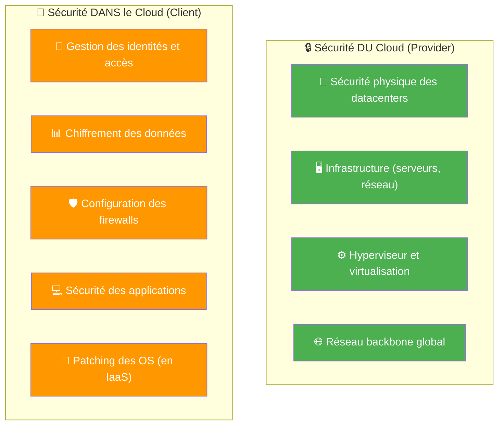

!!! warning "Point Clé"
    **Le provider ne verra jamais vos données** (sauf mandat légal). Mais si vous configurez mal vos accès, vos données peuvent être exposées. La majorité des incidents cloud viennent d'erreurs de configuration client.

---

## 2. IAM (Identity & Access Management)

### 2.1 Concepts Fondamentaux

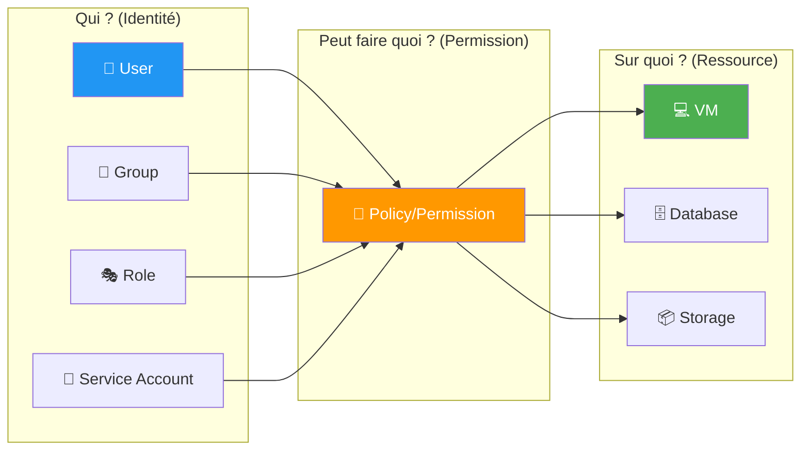

### 2.2 Glossaire IAM

| Concept | Description | Exemple |
|---------|-------------|---------|
| **User** | Identité humaine avec credentials | Marie de l'équipe DevOps |
| **Group** | Ensemble d'utilisateurs | Groupe "Développeurs" |
| **Role** | Identité assumable temporairement | Role "AdminDB" assumé pendant une intervention |
| **Service Account** | Identité pour applications/services | Compte utilisé par l'app de paiement |
| **Policy** | Document définissant les permissions | "Peut lire les buckets S3 commençant par logs-" |
| **Permission** | Action autorisée sur une ressource | s3:GetObject, ec2:StartInstance |

### 2.3 Principe du Moindre Privilège

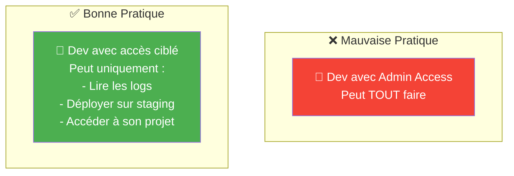

!!! tip "Règle d'Or"
    **Donnez uniquement les permissions nécessaires pour accomplir une tâche, rien de plus.**

    Exemples :
    - Un développeur n'a pas besoin d'accès production
    - Une application de lecture n'a pas besoin d'écrire
    - Un compte de backup n'a pas besoin de supprimer

### 2.4 Équivalences IAM Multi-Cloud

| Concept | AWS | Azure | GCP |
|---------|-----|-------|-----|
| **Utilisateur** | IAM User | Azure AD User | Google Account |
| **Groupe** | IAM Group | Azure AD Group | Google Group |
| **Rôle** | IAM Role | Azure Role | IAM Role |
| **Service Account** | IAM Role (assumé) | Service Principal, Managed Identity | Service Account |
| **Policy** | IAM Policy (JSON) | Role Definition + Assignment | IAM Policy |
| **MFA** | MFA Device | Azure MFA | 2-Step Verification |

### 2.5 Authentification Forte (MFA)

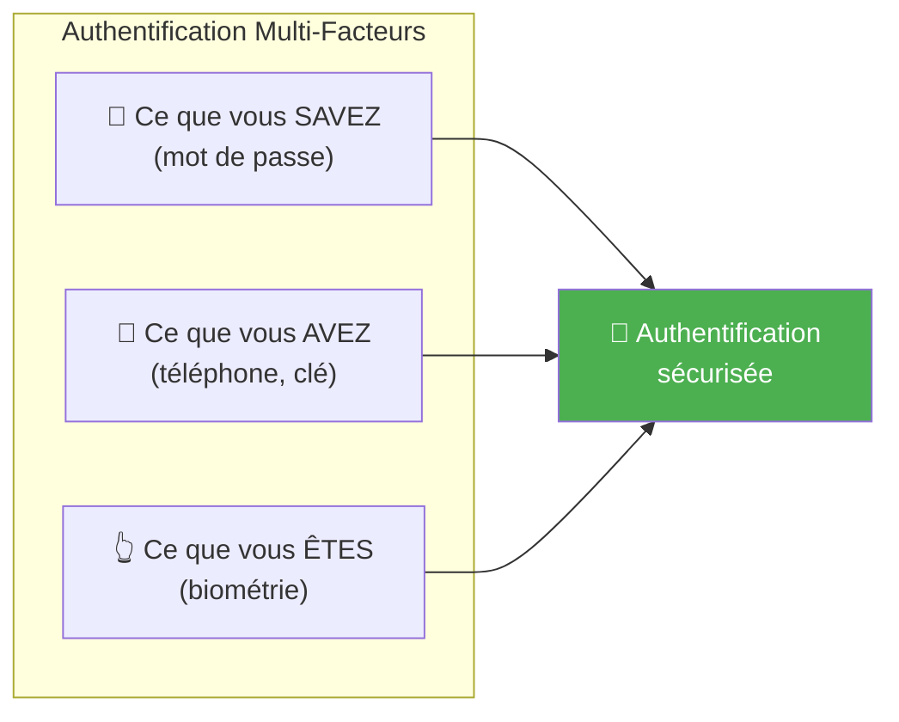

!!! danger "Obligatoire"
    **Le MFA doit être activé pour tous les comptes humains**, particulièrement les admins. C'est la première ligne de défense contre le vol de credentials.

---

## 3. Chiffrement des Données

### 3.1 Les Deux Types de Chiffrement

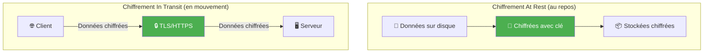

### 3.2 Chiffrement At Rest

| Niveau | Description | Géré par |
|--------|-------------|----------|
| **Server-Side Encryption** | Le provider chiffre automatiquement | Provider |
| **Client-Side Encryption** | Vous chiffrez avant d'envoyer | Vous |
| **Key Management** | Gestion des clés de chiffrement | Provider ou Vous |

**Options de gestion des clés :**

| Option | Description | Contrôle | Usage |
|--------|-------------|----------|-------|
| **Provider-managed keys** | Clés gérées par AWS/Azure/GCP | Faible | Par défaut, simple |
| **Customer-managed keys (CMK)** | Vous créez/contrôlez les clés dans le cloud | Moyen | Conformité, audit |
| **Customer-provided keys** | Vous fournissez vos propres clés | Maximum | Réglementaire strict |

### 3.3 Services de Gestion des Clés

| Provider | Service | Description |
|----------|---------|-------------|
| **AWS** | KMS | Key Management Service |
| **Azure** | Key Vault | Gestion clés, secrets, certificats |
| **GCP** | Cloud KMS | Key Management Service |

### 3.4 Chiffrement In Transit

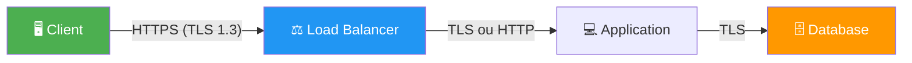

!!! success "Best Practices"
    - **TLS 1.2 minimum**, TLS 1.3 recommandé
    - **HTTPS partout**, même en interne
    - **Certificats valides** (Let's Encrypt gratuit)
    - **HSTS** pour forcer HTTPS

---

## 4. Sécurité Réseau

### 4.1 Defense in Depth

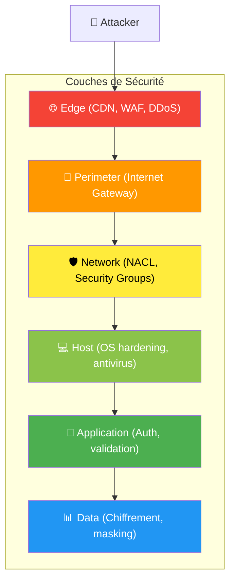

### 4.2 Contrôles Réseau

| Contrôle | Niveau | Description |
|----------|--------|-------------|
| **WAF** | Application (L7) | Filtre requêtes HTTP (SQL injection, XSS) |
| **DDoS Protection** | Réseau (L3/L4) | Absorbe les attaques volumétriques |
| **Security Group** | Instance | Firewall stateful par VM |
| **NACL** | Subnet | Firewall stateless par sous-réseau |
| **Private Subnet** | Réseau | Isolation complète d'Internet |
| **VPN/Private Link** | Connexion | Accès privé sans Internet |

### 4.3 Architecture Sécurisée Type

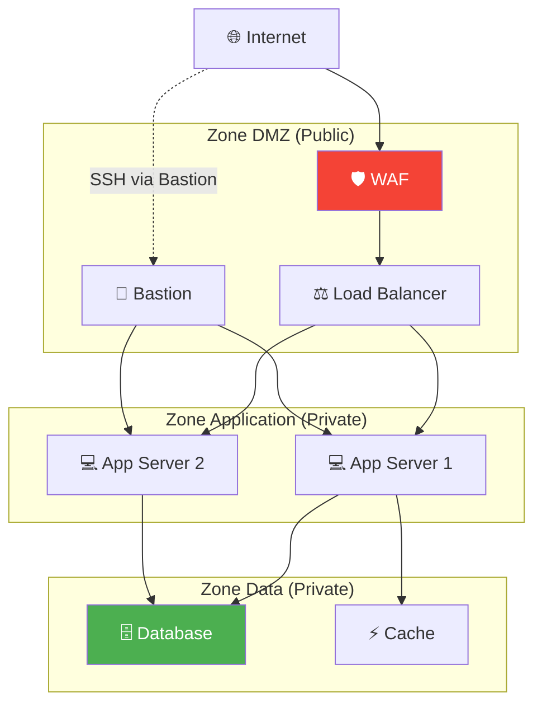

---

## 5. Conformité et Certifications

### 5.1 Les Providers Sont Certifiés

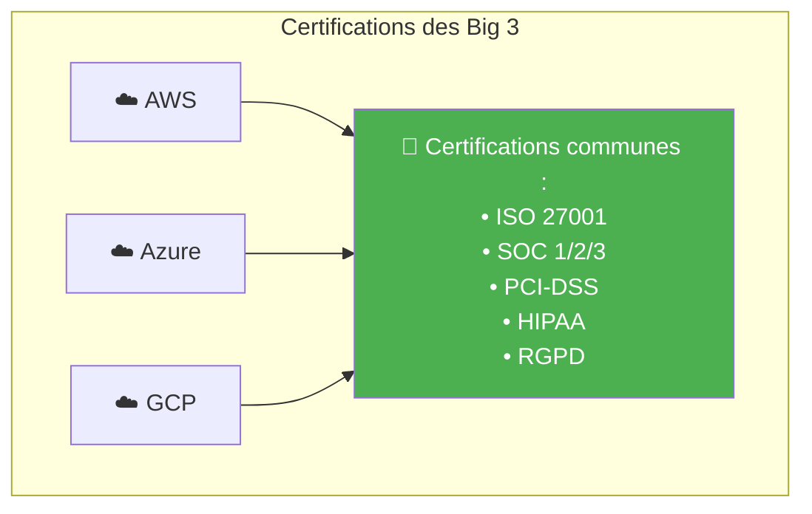

### 5.2 PCI-DSS dans le Cloud

!!! info "PCI-DSS"
    **Payment Card Industry Data Security Standard** - Norme de sécurité pour le traitement des cartes bancaires. Obligatoire pour Worldline.

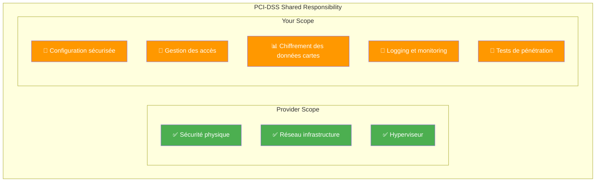

**Les 12 exigences PCI-DSS :**

| # | Exigence | Application Cloud |
|---|----------|-------------------|
| 1 | Installer et maintenir un firewall | Security Groups, NACL, WAF |
| 2 | Ne pas utiliser les paramètres par défaut | Hardening, custom configs |
| 3 | Protéger les données stockées | Chiffrement at rest, tokenisation |
| 4 | Chiffrer les transmissions | TLS 1.2+, VPN |
| 5 | Protéger contre les malwares | Antivirus, EDR |
| 6 | Développer de façon sécurisée | SAST, DAST, code review |
| 7 | Restreindre l'accès aux données | IAM, moindre privilège |
| 8 | Identifier et authentifier les accès | MFA, comptes nominatifs |
| 9 | Restreindre l'accès physique | Géré par le provider |
| 10 | Tracer tous les accès | CloudTrail, Azure Monitor, Cloud Audit |
| 11 | Tester régulièrement la sécurité | Pentests, scans vulnerabilités |
| 12 | Maintenir une politique de sécurité | Documentation, formation |

### 5.3 Localisation des Données (RGPD)

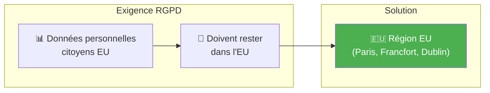

!!! tip "Conseil Worldline"
    - Toujours choisir des **régions européennes** pour les données personnelles
    - Activer les **policies** pour empêcher la création de ressources hors EU
    - Vérifier les **sous-traitants** (où vont les backups ?)

---

## 6. Outils de Sécurité Cloud

### 6.1 Services de Sécurité par Provider

| Catégorie | AWS | Azure | GCP |
|-----------|-----|-------|-----|
| **SIEM/Audit** | CloudTrail, GuardDuty | Sentinel, Defender | Security Command Center |
| **WAF** | AWS WAF | Azure WAF | Cloud Armor |
| **Secrets** | Secrets Manager | Key Vault | Secret Manager |
| **DDoS** | Shield | DDoS Protection | Cloud Armor |
| **Compliance** | Audit Manager | Compliance Manager | Assured Workloads |
| **Vulnerability** | Inspector | Defender for Cloud | Security Command Center |

### 6.2 Logging et Monitoring

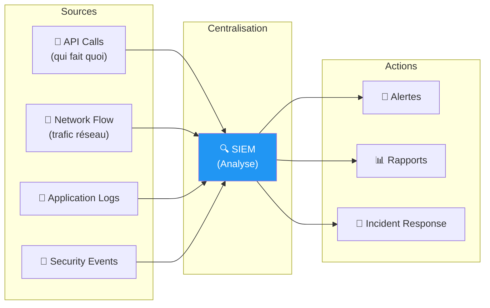

---

## 7. Quiz de Validation

!!! question "Question 1"
    Qui est responsable du chiffrement des données stockées dans S3/Blob Storage ?

    ??? success "Réponse"
        **Le client (vous)**

        Le provider peut fournir le chiffrement par défaut, mais c'est votre responsabilité de :
        - Vérifier qu'il est activé
        - Choisir le niveau de gestion des clés
        - Chiffrer les données sensibles avant upload si nécessaire

!!! question "Question 2"
    Qu'est-ce que le principe du moindre privilège ?

    ??? success "Réponse"
        **Donner uniquement les permissions minimales nécessaires** pour accomplir une tâche.

        Exemples :
        - Un dev n'a pas besoin d'accès admin
        - Une app de lecture n'a pas besoin d'écrire
        - Un accès temporaire plutôt que permanent

!!! question "Question 3"
    Un Security Group est-il stateful ou stateless ?

    ??? success "Réponse"
        **Stateful**

        Si vous autorisez le trafic entrant sur le port 443, le trafic de retour est automatiquement autorisé. Pas besoin de règle sortante explicite.

        (Une NACL est stateless : il faut des règles dans les deux sens)

!!! question "Question 4"
    Dans le cadre PCI-DSS, qui gère la sécurité physique des datacenters ?

    ??? success "Réponse"
        **Le provider cloud**

        C'est dans son scope de certification PCI-DSS. Vous héritez de cette conformité. Par contre, tout ce qui touche à la configuration et aux données reste votre responsabilité.

---

## 8. Checklist Sécurité Cloud

!!! success "À Vérifier Systématiquement"

    **Identité & Accès**

    - [ ] MFA activé sur tous les comptes humains
    - [ ] Pas de clés API en dur dans le code
    - [ ] Principe du moindre privilège appliqué
    - [ ] Comptes de service avec permissions minimales

    **Réseau**

    - [ ] Resources sensibles en subnet privé
    - [ ] Security Groups restrictifs (pas de 0.0.0.0/0)
    - [ ] WAF devant les applications web
    - [ ] VPN ou Private Link pour accès admin

    **Données**

    - [ ] Chiffrement at rest activé
    - [ ] TLS 1.2+ pour toutes les communications
    - [ ] Backups chiffrés
    - [ ] Pas de données sensibles dans les logs

    **Monitoring**

    - [ ] Logging activé sur toutes les ressources
    - [ ] Alertes sur activités suspectes
    - [ ] Revue régulière des accès

---

## Exercice : À Vous de Jouer

!!! example "Mise en Pratique"
    **Objectif** : Sécuriser une application de paiement selon les standards PCI-DSS

    **Contexte** : Vous êtes responsable de la sécurité d'une API de paiement déployée sur AWS. Un audit PCI-DSS approche et vous devez vérifier que toutes les exigences de sécurité sont respectées.

    **Tâches à réaliser** :

    1. Configurez IAM avec le principe du moindre privilège pour 3 rôles : admin, développeur, auditeur
    2. Définissez les règles de Security Groups pour isoler l'application de paiement
    3. Activez le chiffrement pour les données au repos et en transit
    4. Configurez le logging et les alertes de sécurité

    **Critères de validation** :

    - [ ] Politiques IAM respectent le moindre privilège
    - [ ] Architecture réseau segmentée (DMZ, app, données)
    - [ ] Chiffrement activé partout
    - [ ] Logging centralisé avec alertes sur événements critiques

??? quote "Solution"
    **1. Configuration IAM avec moindre privilège**

    ```bash
    # Rôle Admin (accès complet, MFA obligatoire)
    aws iam create-role --role-name PaymentAdmin \
      --assume-role-policy-document file://trust-policy.json

    # Policy Admin avec MFA forcé
    {
      "Version": "2012-10-17",
      "Statement": [
        {
          "Effect": "Allow",
          "Action": "*",
          "Resource": "*",
          "Condition": {
            "Bool": {"aws:MultiFactorAuthPresent": "true"}
          }
        }
      ]
    }

    # Rôle Développeur (lecture seule prod, écriture dev/test)
    {
      "Version": "2012-10-17",
      "Statement": [
        {
          "Effect": "Allow",
          "Action": ["ec2:Describe*", "rds:Describe*", "s3:Get*", "s3:List*"],
          "Resource": "*",
          "Condition": {"StringEquals": {"aws:RequestedRegion": "eu-west-3"}}
        },
        {
          "Effect": "Allow",
          "Action": "s3:*",
          "Resource": "arn:aws:s3:::dev-*"
        }
      ]
    }

    # Rôle Auditeur (lecture seule, logs uniquement)
    {
      "Version": "2012-10-17",
      "Statement": [
        {
          "Effect": "Allow",
          "Action": ["cloudtrail:LookupEvents", "logs:FilterLogEvents"],
          "Resource": "*"
        }
      ]
    }
    ```

    **2. Security Groups avec isolation réseau**

    ```bash
    # SG Load Balancer (Internet → ALB)
    aws ec2 create-security-group --group-name sg-alb-payment \
      --description "ALB for payment API"

    aws ec2 authorize-security-group-ingress \
      --group-id sg-xxx \
      --protocol tcp --port 443 --cidr 0.0.0.0/0  # HTTPS uniquement

    # SG Application (ALB → App)
    aws ec2 create-security-group --group-name sg-app-payment \
      --description "Payment application tier"

    aws ec2 authorize-security-group-ingress \
      --group-id sg-yyy \
      --protocol tcp --port 8080 \
      --source-group sg-alb-payment  # Uniquement depuis ALB

    # SG Database (App → DB)
    aws ec2 create-security-group --group-name sg-db-payment \
      --description "Payment database tier"

    aws ec2 authorize-security-group-ingress \
      --group-id sg-zzz \
      --protocol tcp --port 5432 \
      --source-group sg-app-payment  # Uniquement depuis App
    ```

    **Architecture réseau sécurisée :**
    ```
    Internet → [WAF] → [ALB (HTTPS)] → [App Servers] → [RDS (privé)]
               🛡️        🔐               🔒              🔐
    ```

    **3. Activation du chiffrement**

    **Chiffrement at rest :**
    ```bash
    # RDS avec chiffrement
    aws rds create-db-instance \
      --db-instance-identifier payment-db \
      --storage-encrypted \
      --kms-key-id arn:aws:kms:eu-west-3:xxx:key/xxx

    # S3 avec chiffrement par défaut
    aws s3api put-bucket-encryption \
      --bucket payment-data \
      --server-side-encryption-configuration \
      '{"Rules": [{"ApplyServerSideEncryptionByDefault": {"SSEAlgorithm": "aws:kms"}}]}'

    # EBS volumes chiffrés
    aws ec2 create-volume \
      --size 100 \
      --encrypted \
      --kms-key-id arn:aws:kms:eu-west-3:xxx:key/xxx
    ```

    **Chiffrement in transit :**
    ```bash
    # ALB avec certificat SSL/TLS
    aws elbv2 create-listener \
      --load-balancer-arn arn:aws:elasticloadbalancing:xxx \
      --protocol HTTPS \
      --port 443 \
      --certificates CertificateArn=arn:aws:acm:xxx \
      --ssl-policy ELBSecurityPolicy-TLS-1-2-2017-01

    # RDS avec SSL obligatoire
    aws rds modify-db-instance \
      --db-instance-identifier payment-db \
      --option-group-name require-ssl
    ```

    **4. Logging et alertes**

    ```bash
    # Activer CloudTrail (logs API)
    aws cloudtrail create-trail \
      --name payment-audit-trail \
      --s3-bucket-name payment-logs-bucket \
      --is-multi-region-trail

    # VPC Flow Logs (trafic réseau)
    aws ec2 create-flow-logs \
      --resource-type VPC \
      --resource-ids vpc-xxx \
      --traffic-type ALL \
      --log-destination-type cloud-watch-logs

    # CloudWatch Alarm sur échecs d'authentification
    aws cloudwatch put-metric-alarm \
      --alarm-name auth-failures \
      --alarm-description "Alert on failed login attempts" \
      --metric-name UnauthorizedAPICalls \
      --threshold 10 \
      --comparison-operator GreaterThanThreshold \
      --evaluation-periods 1 \
      --alarm-actions arn:aws:sns:eu-west-3:xxx:security-alerts
    ```

    **Checklist PCI-DSS couverte :**
    - ✅ Exigence 1 : Firewall (Security Groups, WAF)
    - ✅ Exigence 3 : Chiffrement données (KMS)
    - ✅ Exigence 4 : Chiffrement transit (TLS 1.2+)
    - ✅ Exigence 7 : Moindre privilège (IAM)
    - ✅ Exigence 8 : MFA (IAM policy)
    - ✅ Exigence 10 : Logging (CloudTrail, VPC Flow Logs)

---

## Navigation

| Précédent | Suivant |
|-----------|---------|
| [← Module 3 : Infrastructure Cloud](03-module.md) | [Module 5 : Architecture Cloud →](05-module.md) |
