---
tags:
  - formation
  - cloud
  - architecture
  - haute-disponibilite
  - disaster-recovery
  - scalabilite
---

# Module 5 : Architecture Cloud (HA, DR, Scalabilité)

## Objectifs du Module

À la fin de ce module, vous serez capable de :

- :fontawesome-solid-heart-pulse: Concevoir une architecture haute disponibilité
- :fontawesome-solid-rotate: Planifier une stratégie de Disaster Recovery
- :fontawesome-solid-arrows-up-down: Comprendre les types de scalabilité
- :fontawesome-solid-diagram-project: Reconnaître les patterns d'architecture cloud
- :fontawesome-solid-calculator: Calculer et interpréter les SLA

---

## 1. Haute Disponibilité (HA)

### 1.1 Qu'est-ce que la Haute Disponibilité ?

!!! info "Définition"
    La **haute disponibilité** est la capacité d'un système à rester opérationnel malgré la défaillance de certains composants.

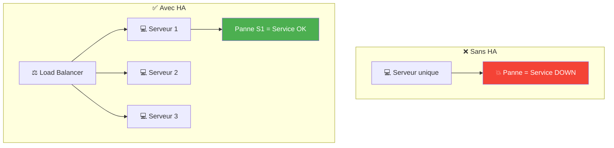

### 1.2 Les Niveaux de Disponibilité (SLA)

| Disponibilité | Downtime/an | Downtime/mois | Catégorie |
|---------------|-------------|---------------|-----------|
| **99%** | 3.65 jours | 7.3 heures | Standard |
| **99.9%** | 8.76 heures | 43.8 minutes | Élevé |
| **99.95%** | 4.38 heures | 21.9 minutes | Très élevé |
| **99.99%** | 52.6 minutes | 4.38 minutes | Critique |
| **99.999%** | 5.26 minutes | 26.3 secondes | Mission critique |

!!! example "SLA Cloud Providers"
    | Service | AWS | Azure | GCP |
    |---------|-----|-------|-----|
    | **VM unique** | 99.5% | 99.9% | 99.5% |
    | **VM multi-AZ** | 99.99% | 99.99% | 99.99% |
    | **Object Storage** | 99.99% | 99.99% | 99.99% |
    | **Managed DB multi-AZ** | 99.95% | 99.99% | 99.95% |

### 1.3 Calcul du SLA Composite

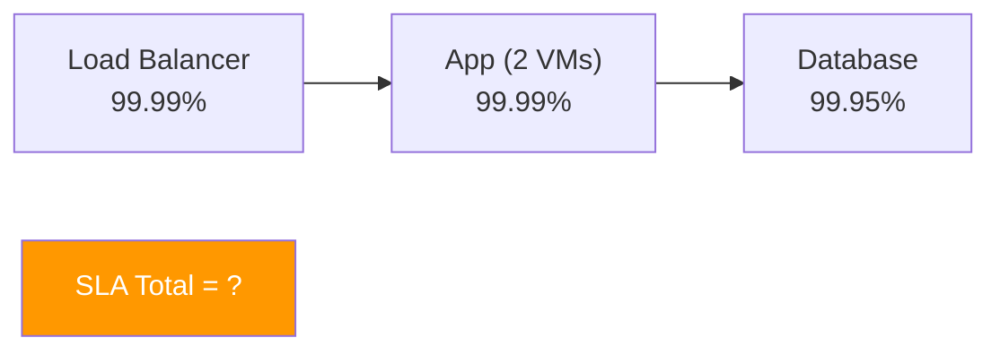

**Formule** : SLA composite = SLA1 × SLA2 × SLA3

```
SLA = 99.99% × 99.99% × 99.95% = 99.93%
```

!!! warning "Attention"
    Chaque composant **diminue** la disponibilité globale. Plus vous avez de composants, plus le SLA baisse.

### 1.4 Patterns de Haute Disponibilité

#### Active-Active

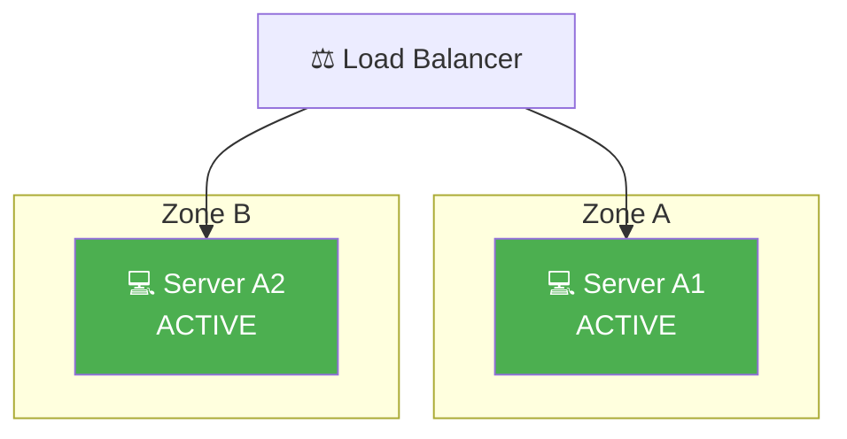

- Les deux serveurs traitent le trafic
- Capacité = Server1 + Server2
- Si un tombe, l'autre absorbe la charge

#### Active-Passive (Standby)

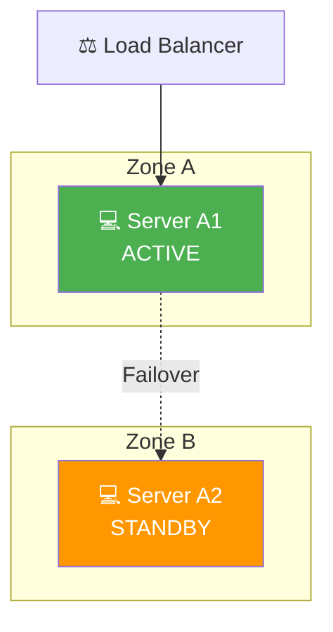

- Un seul serveur traite le trafic
- Le second attend en standby
- Bascule automatique en cas de panne

---

## 2. Disaster Recovery (DR)

### 2.1 RPO et RTO

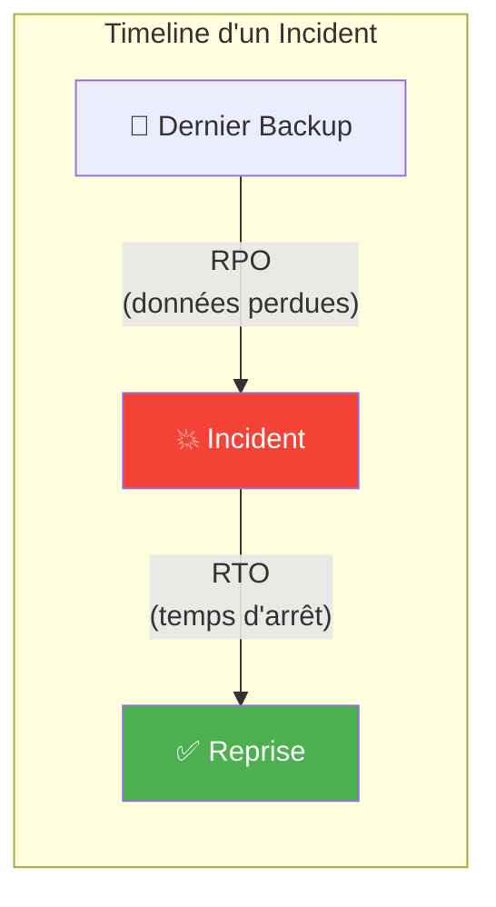

| Métrique | Définition | Question |
|----------|------------|----------|
| **RPO** (Recovery Point Objective) | Quantité de données qu'on accepte de perdre | "Combien de temps de données perdues est acceptable ?" |
| **RTO** (Recovery Time Objective) | Temps pour rétablir le service | "En combien de temps doit-on être de nouveau opérationnel ?" |

### 2.2 Stratégies de DR

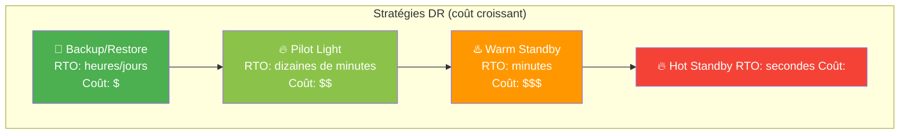

| Stratégie | Description | RTO | RPO | Coût |
|-----------|-------------|-----|-----|------|
| **Backup/Restore** | Données sauvegardées, infra recréée | Heures/Jours | Heures | $ |
| **Pilot Light** | Core infra tourne, reste à démarrer | 10-30 min | Minutes | $$ |
| **Warm Standby** | Infra complète tourne à échelle réduite | Minutes | Minutes | $$$ |
| **Hot Standby** | Infra identique en active-active | Secondes | Temps réel | $$$$ |

### 2.3 Architecture Multi-Région

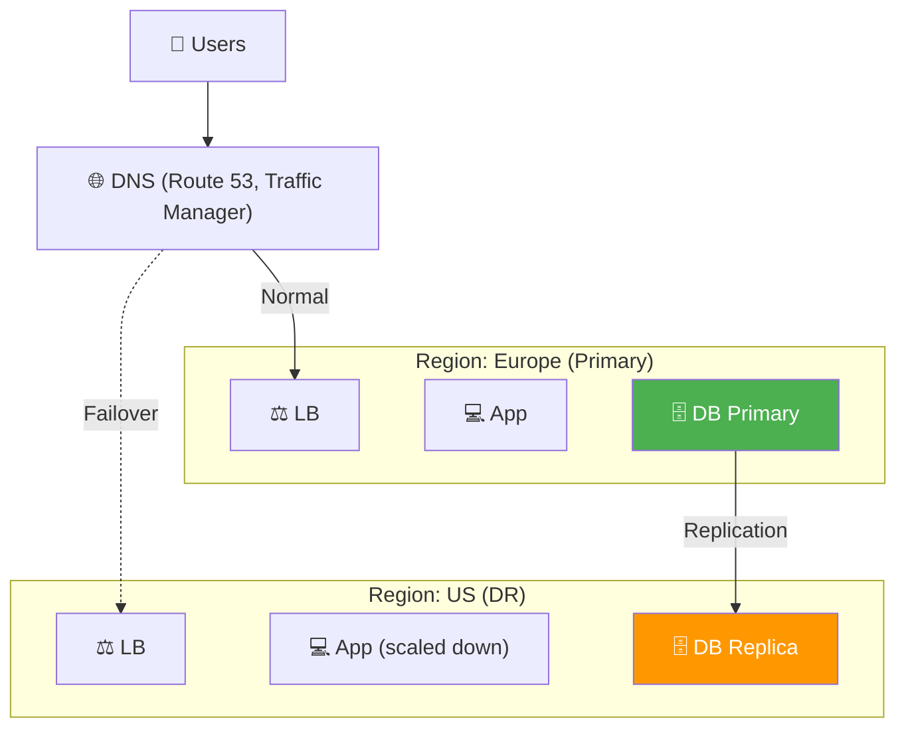

---

## 3. Scalabilité

### 3.1 Scaling Vertical vs Horizontal

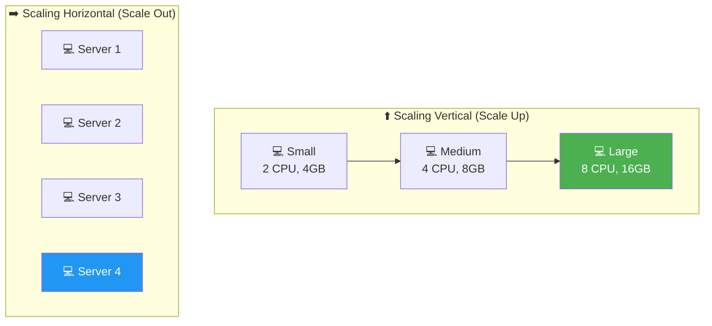

| Type | Description | Avantages | Inconvénients |
|------|-------------|-----------|---------------|
| **Vertical** | Augmenter la taille d'une machine | Simple, pas de changement d'archi | Limite physique, downtime |
| **Horizontal** | Ajouter plus de machines | Pas de limite, HA naturelle | Complexité (stateless, LB) |

### 3.2 Auto Scaling

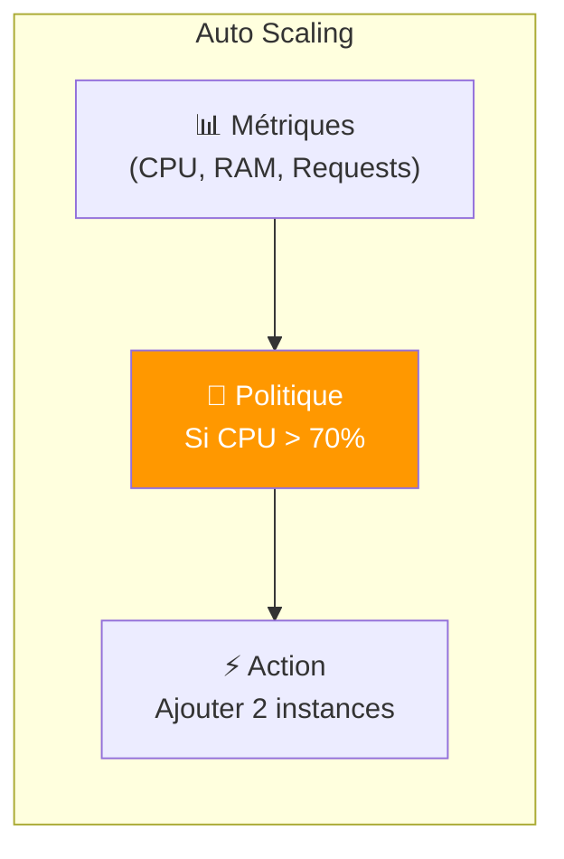

**Métriques courantes pour le scaling :**

| Métrique | Description | Exemple de seuil |
|----------|-------------|------------------|
| **CPU** | Utilisation processeur | > 70% → scale up |
| **Memory** | Utilisation mémoire | > 80% → scale up |
| **Requests/sec** | Nombre de requêtes | > 1000 req/s → scale up |
| **Queue depth** | Messages en attente | > 100 messages → scale up |
| **Custom** | Métrique business | > X transactions/min |

### 3.3 Stateless vs Stateful

!!! warning "Clé du Scaling Horizontal"
    Pour scaler horizontalement, votre application doit être **stateless** (sans état local).

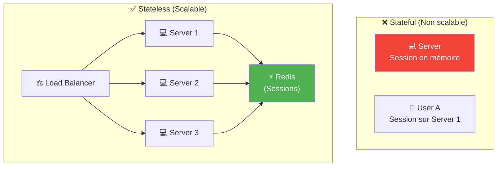

**Comment rendre une app stateless :**

- Sessions → Store externe (Redis, DynamoDB)
- Fichiers uploadés → Object Storage (S3)
- Cache → Cache distribué (ElastiCache)
- Base de données → Service managé (RDS)

---

## 4. Patterns d'Architecture Cloud

### 4.1 Architecture N-Tier

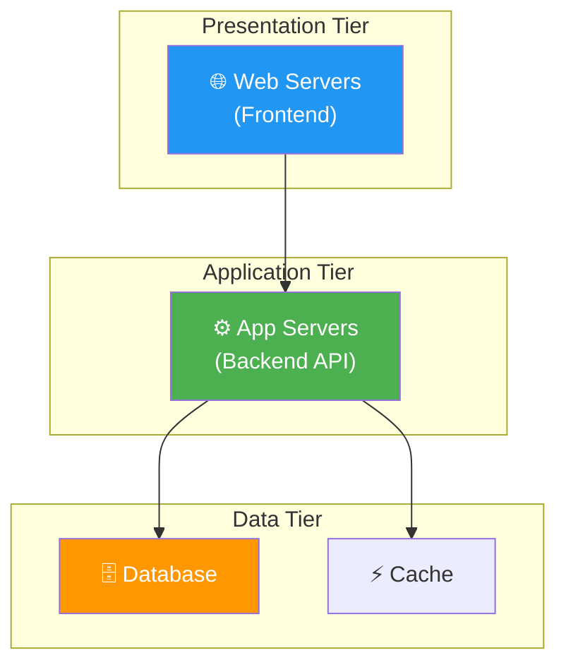

### 4.2 Microservices

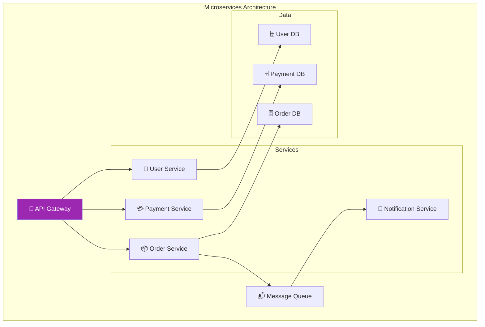

**Avantages :**
- Scaling indépendant par service
- Déploiement indépendant
- Technologie adaptée par service
- Équipes autonomes

### 4.3 Event-Driven Architecture

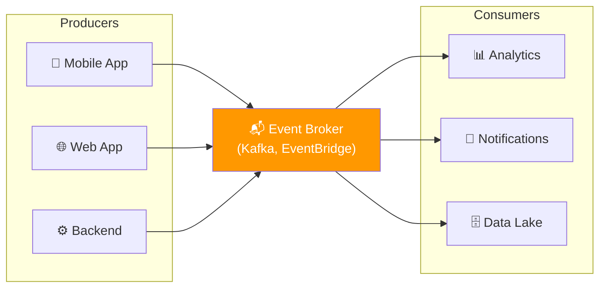

---

## 5. Well-Architected Framework

### 5.1 Les 6 Piliers

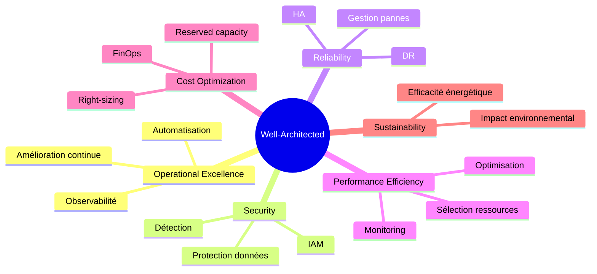

### 5.2 Questions Clés par Pilier

| Pilier | Questions à se poser |
|--------|----------------------|
| **Operational Excellence** | Comment déployez-vous ? Comment détectez-vous les problèmes ? |
| **Security** | Qui a accès ? Comment protégez-vous les données ? |
| **Reliability** | Que se passe-t-il si X tombe ? Quel est votre RTO/RPO ? |
| **Performance** | Comment gérez-vous les pics ? Avez-vous des goulots ? |
| **Cost Optimization** | Payez-vous pour des ressources inutilisées ? |
| **Sustainability** | Quel est l'impact carbone ? Pouvez-vous optimiser ? |

---

## 6. Quiz de Validation

!!! question "Question 1"
    Quelle est la différence entre RPO et RTO ?

    ??? success "Réponse"
        - **RPO** (Recovery Point Objective) : Quantité de données acceptable à perdre (temps depuis le dernier backup)
        - **RTO** (Recovery Time Objective) : Temps acceptable pour restaurer le service

        Exemple : RPO de 1h signifie qu'on accepte de perdre 1h de données. RTO de 30min signifie qu'on doit être opérationnel en 30 minutes.

!!! question "Question 2"
    Si vous avez 3 composants avec des SLA de 99.9%, 99.95% et 99.9%, quel est le SLA composite ?

    ??? success "Réponse"
        SLA = 99.9% × 99.95% × 99.9% = **99.75%**

        Le SLA composite est toujours inférieur au SLA le plus faible.

!!! question "Question 3"
    Quelle stratégie DR a le RTO le plus court ?

    ??? success "Réponse"
        **Hot Standby** (Active-Active)

        L'infrastructure de DR est identique et tourne en permanence. Le failover est quasi-instantané (secondes).

!!! question "Question 4"
    Pourquoi une application doit-elle être stateless pour scaler horizontalement ?

    ??? success "Réponse"
        Si l'état (session, fichiers) est stocké localement sur un serveur, les requêtes suivantes doivent aller sur le même serveur. Impossible de distribuer la charge.

        Avec une app stateless, n'importe quel serveur peut traiter n'importe quelle requête.

---

## 7. Résumé

| Concept | Description | Métrique clé |
|---------|-------------|--------------|
| **Haute Disponibilité** | Service reste up malgré pannes | SLA (99.9%, 99.99%...) |
| **Disaster Recovery** | Reprise après sinistre majeur | RTO, RPO |
| **Scalabilité Verticale** | Augmenter la taille | Limite physique |
| **Scalabilité Horizontale** | Ajouter des instances | Stateless requis |
| **Auto Scaling** | Scaling automatique | Métriques, seuils |

---

## Exercice : À Vous de Jouer

!!! example "Mise en Pratique"
    **Objectif** : Concevoir une architecture haute disponibilité avec stratégie DR

    **Contexte** : Une application critique de paiement en ligne nécessite un SLA de 99.99% et des objectifs RPO=15min / RTO=1h. L'application traite 10 000 transactions/jour en temps normal, mais jusqu'à 100 000 lors des soldes.

    **Tâches à réaliser** :

    1. Calculez le SLA composite de l'architecture : ALB (99.99%) + App servers (99.99%) + RDS (99.95%)
    2. Proposez une architecture multi-AZ pour garantir la haute disponibilité
    3. Définissez la stratégie DR adaptée (Backup/Pilot Light/Warm/Hot) pour respecter RPO/RTO
    4. Configurez l'auto-scaling pour gérer les pics de charge (x10)

    **Critères de validation** :

    - [ ] SLA composite calculé correctement
    - [ ] Architecture multi-AZ avec failover automatique
    - [ ] Stratégie DR justifiée avec RPO/RTO respectés
    - [ ] Configuration auto-scaling adaptée aux pics

??? quote "Solution"
    **1. Calcul du SLA composite**

    ```
    SLA composite = SLA1 × SLA2 × SLA3
    SLA = 99.99% × 99.99% × 99.95%
    SLA = 0.9999 × 0.9999 × 0.9995
    SLA = 0.9993 = 99.93%

    Downtime annuel = (1 - 0.9993) × 365 × 24 × 60
    Downtime = 6.13 heures/an ≈ 30 minutes/mois
    ```

    **⚠️ Le SLA de 99.93% ne respecte pas l'objectif 99.99%**
    → Solution : Dupliquer les composants critiques

    **2. Architecture multi-AZ haute disponibilité**

    ```bash
    # Auto Scaling Group multi-AZ
    aws autoscaling create-auto-scaling-group \
      --auto-scaling-group-name payment-api-asg \
      --launch-template payment-api-template \
      --min-size 4 \
      --max-size 40 \
      --desired-capacity 6 \
      --availability-zones eu-west-3a eu-west-3b eu-west-3c \
      --target-group-arns arn:aws:elasticloadbalancing:xxx

    # RDS Multi-AZ avec read replicas
    aws rds create-db-instance \
      --db-instance-identifier payment-db \
      --multi-az \
      --backup-retention-period 7
    ```

    **Architecture :**
    ```
    ┌─────────────────────────────────────────────────┐
    │           Region: eu-west-3 (Paris)             │
    ├─────────────┬─────────────┬─────────────────────┤
    │   Zone A    │   Zone B    │       Zone C        │
    ├─────────────┼─────────────┼─────────────────────┤
    │  App x2     │  App x2     │      App x2         │
    │  RDS        │  RDS        │                     │
    │  Primary    │  Standby    │   Read Replica      │
    └─────────────┴─────────────┴─────────────────────┘
    ```

    **3. Stratégie DR : Warm Standby**

    **Justification :**
    - RPO 15min → Réplication continue nécessaire
    - RTO 1h → Infrastructure pré-déployée mais réduite
    - Warm Standby = meilleur compromis coût/performance

    ```bash
    # Région DR (eu-central-1 Frankfurt)
    # Infra réduite : 2 instances (vs 6 en prod)
    aws autoscaling create-auto-scaling-group \
      --auto-scaling-group-name payment-api-dr \
      --min-size 2 \
      --max-size 40 \
      --region eu-central-1

    # RDS avec réplication cross-region
    aws rds create-db-instance-read-replica \
      --db-instance-identifier payment-db-dr \
      --source-db-instance-identifier payment-db \
      --region eu-central-1

    # Route 53 health check et failover
    aws route53 change-resource-record-sets \
      --hosted-zone-id Z123 \
      --change-batch file://failover-config.json
    ```

    **En cas de disaster :**
    1. Route 53 détecte la panne (healthcheck KO)
    2. Bascule DNS automatique vers DR (2-3 min)
    3. ASG scale up en DR (5-10 min)
    4. RDS replica promoted en primary (5 min)
    → **RTO total : 15-20 min** ✅ (objectif : 1h)

    **4. Configuration auto-scaling (pics x10)**

    ```bash
    # Policy: Scale up si CPU > 70%
    aws autoscaling put-scaling-policy \
      --auto-scaling-group-name payment-api-asg \
      --policy-name scale-up \
      --scaling-adjustment 3 \
      --adjustment-type ChangeInCapacity

    # CloudWatch alarm trigger
    aws cloudwatch put-metric-alarm \
      --alarm-name high-cpu \
      --metric-name CPUUtilization \
      --threshold 70 \
      --comparison-operator GreaterThanThreshold \
      --evaluation-periods 2 \
      --alarm-actions arn:aws:autoscaling:xxx:policy/scale-up

    # Policy: Scale down si CPU < 30%
    aws autoscaling put-scaling-policy \
      --policy-name scale-down \
      --scaling-adjustment -1 \
      --adjustment-type ChangeInCapacity \
      --cooldown 300
    ```

    **Paramètres pour gérer x10 :**
    - Normal : 6 instances (10 000 tx/jour = ~417 tx/h/instance)
    - Pic : jusqu'à 40 instances (100 000 tx/jour)
    - Scaling progressif : +3 instances toutes les 2 min si besoin
    - Warmup period : 180s (le temps que l'app démarre)

---

## Navigation

| Précédent | Suivant |
|-----------|---------|
| [← Module 4 : Sécurité & Conformité](04-module.md) | [Module 6 : FinOps & Coûts →](06-module.md) |
