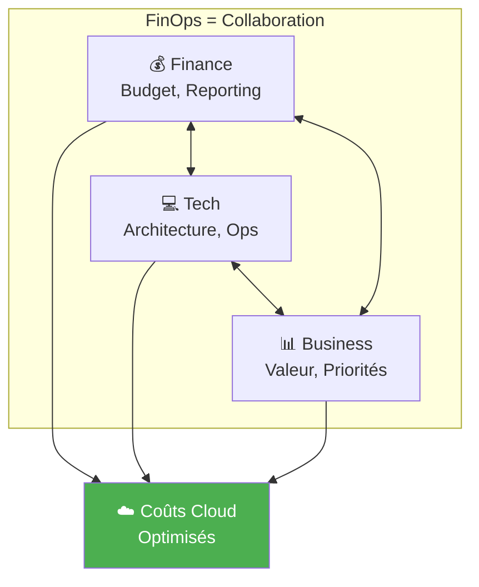
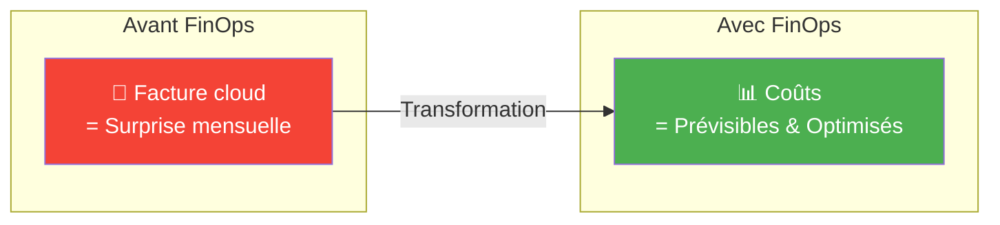
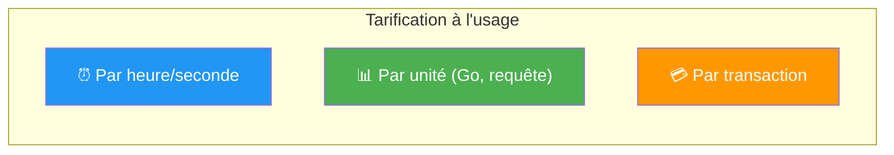
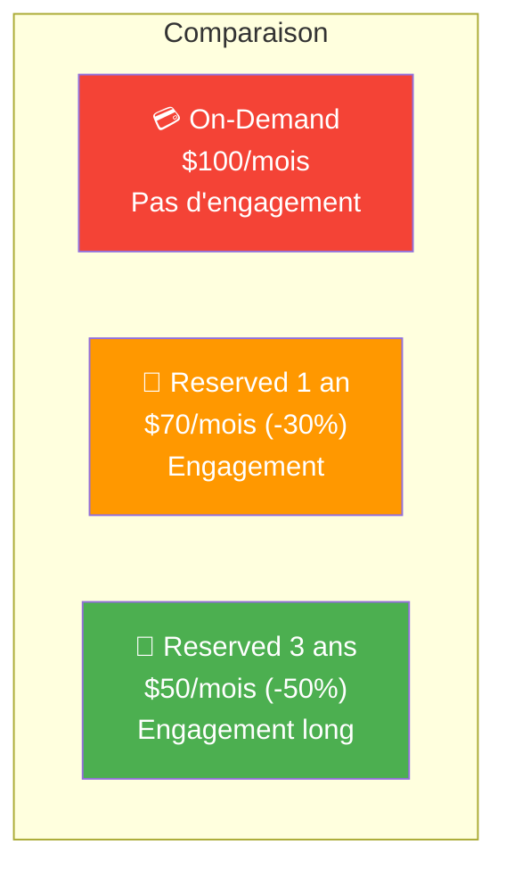
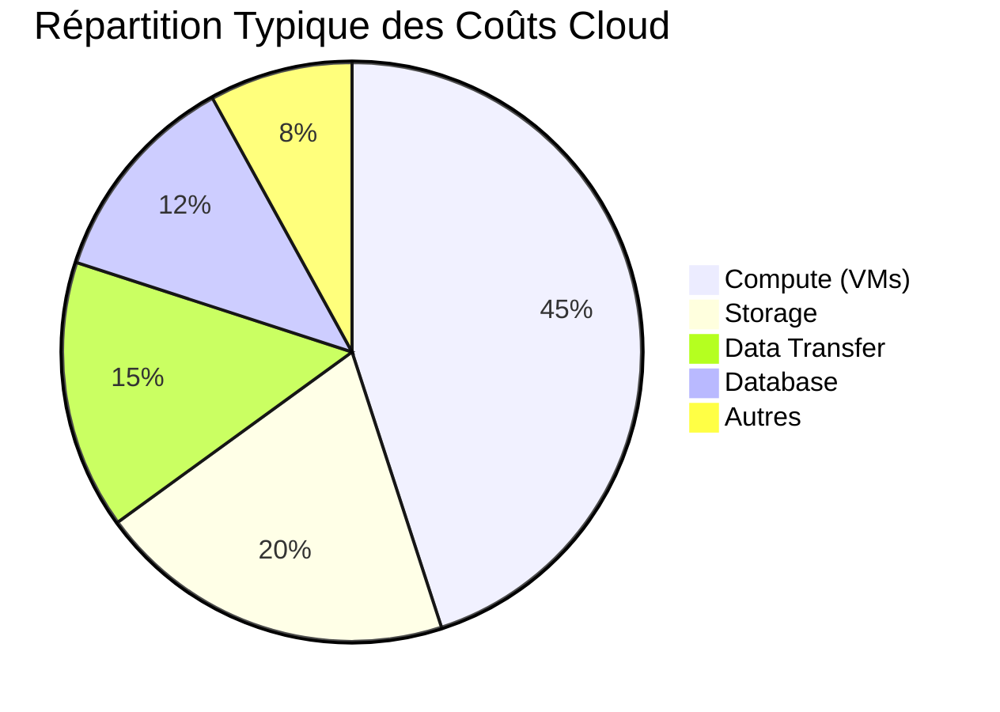
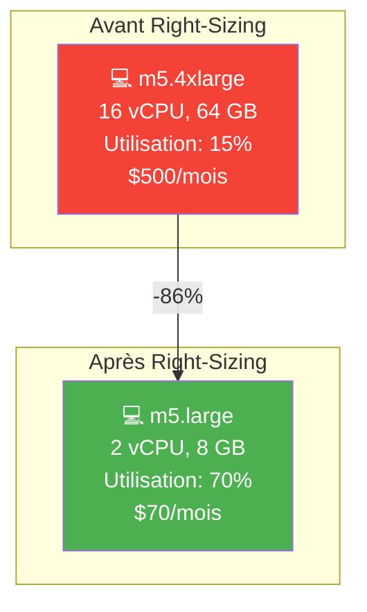
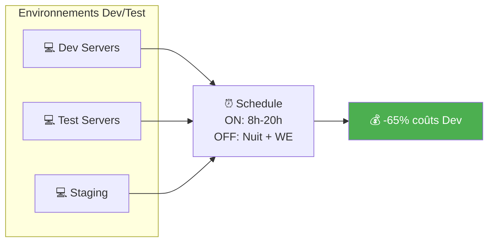
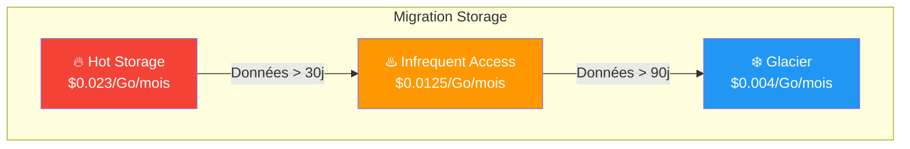
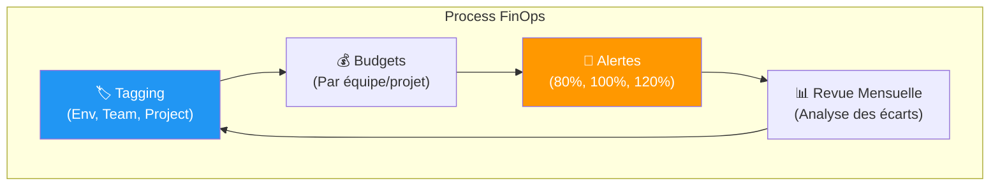

---
tags:
  - formation
  - cloud
  - finops
  - couts
  - pricing
  - optimisation
---

# Module 6 : FinOps & Coûts Cloud

## Objectifs du Module

À la fin de ce module, vous serez capable de :

- :fontawesome-solid-coins: Comprendre les modèles de tarification cloud
- :fontawesome-solid-chart-pie: Identifier les principaux postes de coûts
- :fontawesome-solid-piggy-bank: Appliquer les techniques d'optimisation
- :fontawesome-solid-calculator: Estimer le coût d'une architecture
- :fontawesome-solid-users: Comprendre la démarche FinOps

---

## 1. Introduction au FinOps

### 1.1 Qu'est-ce que le FinOps ?

!!! info "Définition"
    **FinOps** (Financial Operations) est une pratique culturelle et une discipline qui rapproche les équipes Finance, Tech et Business pour une gestion optimale des coûts cloud.



### 1.2 Pourquoi le FinOps est Important ?



**Problèmes typiques sans FinOps :**
- Facture qui double d'un mois à l'autre
- Ressources inutilisées qui tournent
- Pas de visibilité sur qui consomme quoi
- Environnements de dev qui coûtent autant que la prod

---

## 2. Modèles de Tarification Cloud

### 2.1 Pay-As-You-Go (À la demande)



| Service | Unité de facturation | Exemple de prix |
|---------|----------------------|-----------------|
| **VM (EC2, Azure VM)** | Par heure/seconde | $0.10/heure |
| **Object Storage (S3)** | Par Go stocké + requêtes | $0.023/Go/mois |
| **Data Transfer** | Par Go sortant | $0.09/Go |
| **Serverless (Lambda)** | Par exécution + durée | $0.0000002/requête |
| **Database (RDS)** | Par heure + stockage | $0.05/heure + $0.10/Go |

### 2.2 Reserved Instances / Savings Plans



| Type | Engagement | Réduction | Flexibilité |
|------|------------|-----------|-------------|
| **On-Demand** | Aucun | 0% | Maximale |
| **Reserved 1 an** | 1 an | 20-40% | Instance fixe |
| **Reserved 3 ans** | 3 ans | 40-60% | Instance fixe |
| **Savings Plans** | $/heure pendant 1-3 ans | 20-50% | Flexible |
| **Spot Instances** | Aucun | 60-90% | Peut être interrompu |

### 2.3 Spot/Preemptible Instances

!!! warning "Attention"
    Les Spot Instances peuvent être **interrompues à tout moment** (préavis de 2 minutes). À utiliser uniquement pour des workloads tolérants aux interruptions.

**Cas d'usage Spot :**
- Batch processing
- CI/CD (builds)
- Big Data / Analytics
- Rendering
- Tests de charge

**À éviter pour :**
- Bases de données
- Applications critiques
- Services temps réel

---

## 3. Anatomie d'une Facture Cloud

### 3.1 Les Principaux Postes de Coûts



### 3.2 Les Coûts Cachés

| Coût caché | Description | Comment éviter |
|------------|-------------|----------------|
| **Data Transfer** | Trafic sortant facturé | Utiliser CDN, régions proches |
| **Snapshots/Backups** | S'accumulent | Politique de rétention |
| **IPs publiques** | Facturées si non attachées | Libérer les IPs inutilisées |
| **Load Balancers** | Facturés même sans trafic | Supprimer en dev |
| **NAT Gateway** | Par heure + par Go | Optimiser le trafic |
| **Logs/Monitoring** | Volume de données | Filtrer, échantillonner |

### 3.3 Exemple de Facture Détaillée

```
╔══════════════════════════════════════════════════════════╗
║                    FACTURE CLOUD - Mars 2024              ║
╠══════════════════════════════════════════════════════════╣
║ COMPUTE                                                   ║
║   EC2 On-Demand (Production)          $2,340.00          ║
║   EC2 Reserved (Production)           $1,200.00          ║
║   EC2 On-Demand (Dev/Test)              $890.00  ⚠️      ║
║   Lambda                                 $45.00          ║
╠══════════════════════════════════════════════════════════╣
║ STORAGE                                                   ║
║   S3 Standard                           $230.00          ║
║   S3 Glacier                             $12.00          ║
║   EBS Volumes                           $456.00          ║
║   EBS Snapshots                         $189.00  ⚠️      ║
╠══════════════════════════════════════════════════════════╣
║ DATABASE                                                  ║
║   RDS PostgreSQL                        $567.00          ║
║   ElastiCache                           $234.00          ║
╠══════════════════════════════════════════════════════════╣
║ NETWORK                                                   ║
║   Data Transfer Out                     $345.00  ⚠️      ║
║   NAT Gateway                           $123.00          ║
║   Load Balancers                         $89.00          ║
╠══════════════════════════════════════════════════════════╣
║ TOTAL                                   $6,720.00         ║
╚══════════════════════════════════════════════════════════╝

⚠️ = Opportunités d'optimisation identifiées
```

---

## 4. Techniques d'Optimisation

### 4.1 Right-Sizing

!!! info "Définition"
    **Right-sizing** = Adapter la taille des ressources à l'usage réel.



**Comment identifier :**
- Utilisation CPU moyenne < 20%
- Utilisation mémoire moyenne < 30%
- Pics rarement atteints

### 4.2 Arrêt des Ressources Non Utilisées



**Actions rapides :**
- Arrêter les VMs dev la nuit et le weekend
- Supprimer les environnements de POC/tests terminés
- Identifier les ressources orphelines (IPs, disques, snapshots)

### 4.3 Choix du Bon Storage Tier



### 4.4 Tableau Récapitulatif des Optimisations

| Technique | Économie potentielle | Effort | Impact |
|-----------|----------------------|--------|--------|
| **Right-sizing** | 30-50% | Moyen | Immédiat |
| **Reserved Instances** | 30-60% | Faible | Immédiat |
| **Spot Instances** | 60-90% | Élevé | Variable |
| **Arrêt nuit/weekend** | 65% sur Dev | Faible | Immédiat |
| **Storage tiering** | 50-80% storage | Moyen | Progressif |
| **Suppression orphelins** | 5-15% | Faible | Immédiat |
| **Optimisation data transfer** | 20-40% | Élevé | Progressif |

---

## 5. Outils de Gestion des Coûts

### 5.1 Outils Natifs par Provider

| Provider | Outil | Fonctionnalités |
|----------|-------|-----------------|
| **AWS** | Cost Explorer | Analyse, prévisions, recommandations |
| **AWS** | Budgets | Alertes, actions automatiques |
| **Azure** | Cost Management | Analyse, budgets, optimisation |
| **GCP** | Billing Reports | Analyse, export, budgets |
| **GCP** | Recommender | Suggestions d'optimisation |

### 5.2 Outils Tiers

| Outil | Description |
|-------|-------------|
| **CloudHealth** | Multi-cloud, reporting avancé |
| **Spot.io** | Optimisation Spot/Reserved |
| **Kubecost** | Coûts Kubernetes |
| **Infracost** | Estimation coûts IaC (Terraform) |

### 5.3 Bonnes Pratiques de Suivi



**Tags essentiels à mettre en place :**

| Tag | Exemple | Usage |
|-----|---------|-------|
| `Environment` | prod, staging, dev | Filtrer par environnement |
| `Team` | payment, fraud, mobile | Répartir les coûts |
| `Project` | phoenix, atlas | Coût par projet |
| `Owner` | marie.dupont@worldline.com | Responsable |
| `CostCenter` | CC-1234 | Imputation comptable |

---

## 6. Estimation des Coûts

### 6.1 Calculateurs de Prix

| Provider | Outil | URL |
|----------|-------|-----|
| **AWS** | Pricing Calculator | calculator.aws |
| **Azure** | Pricing Calculator | azure.microsoft.com/pricing/calculator |
| **GCP** | Pricing Calculator | cloud.google.com/products/calculator |

### 6.2 Exemple d'Estimation

**Scénario** : Application web avec 10 000 utilisateurs

```
╔══════════════════════════════════════════════════════════╗
║           ESTIMATION MENSUELLE - App Web Standard         ║
╠══════════════════════════════════════════════════════════╣
║ COMPUTE                                                   ║
║   2x m5.large (On-Demand)               $140.00          ║
║   Load Balancer                          $20.00          ║
╠══════════════════════════════════════════════════════════╣
║ DATABASE                                                  ║
║   RDS PostgreSQL (db.t3.medium)         $100.00          ║
║   100 GB storage                         $12.00          ║
╠══════════════════════════════════════════════════════════╣
║ STORAGE                                                   ║
║   S3 (50 GB)                              $1.15          ║
║   Data Transfer (100 GB out)              $9.00          ║
╠══════════════════════════════════════════════════════════╣
║ TOTAL ESTIMÉ                            $282.15/mois     ║
╚══════════════════════════════════════════════════════════╝

Avec Reserved Instances 1 an : ~$200/mois (-29%)
```

---

## 7. Quiz de Validation

!!! question "Question 1"
    Quelle option offre la plus grande réduction de coûts sur les VMs ?

    ??? success "Réponse"
        **Spot Instances** (60-90% de réduction)

        Mais attention : elles peuvent être interrompues. Pour des workloads stables, les Reserved Instances (30-60%) sont plus adaptées.

!!! question "Question 2"
    Vous avez une VM avec 10% d'utilisation CPU moyenne. Que recommandez-vous ?

    ??? success "Réponse"
        **Right-sizing** : Réduire la taille de la VM

        Une VM utilisée à 10% est surdimensionnée. Passez à une taille inférieure (par exemple de m5.xlarge à m5.medium) pour économiser 50-75%.

!!! question "Question 3"
    Quel est le coût caché le plus souvent oublié ?

    ??? success "Réponse"
        **Data Transfer sortant**

        Le trafic entrant est souvent gratuit, mais le trafic sortant est facturé ($0.05-0.15/Go). Cela peut représenter 15-25% de la facture.

!!! question "Question 4"
    Comment réduire les coûts des environnements Dev/Test de 65% ?

    ??? success "Réponse"
        **Arrêt automatique nuit et weekend**

        Si les VMs tournent uniquement 8h-20h en semaine :
        - 12h × 5 jours = 60h actives
        - vs 168h (24×7)
        - Économie : 64%

---

## 8. Checklist FinOps

!!! success "Actions Prioritaires"

    **Visibilité**

    - [ ] Tagging obligatoire sur toutes les ressources
    - [ ] Budgets définis par équipe/projet
    - [ ] Alertes à 80%, 100%, 120% du budget
    - [ ] Revue mensuelle des coûts

    **Quick Wins**

    - [ ] Identifier et supprimer les ressources orphelines
    - [ ] Right-sizing des VMs sous-utilisées (<30% CPU)
    - [ ] Arrêt automatique des environnements Dev la nuit
    - [ ] Migration des vieux snapshots vers Glacier

    **Optimisation Long Terme**

    - [ ] Analyse pour Reserved Instances (workloads stables)
    - [ ] Évaluation Spot pour batch/CI
    - [ ] Politique de lifecycle storage
    - [ ] Optimisation data transfer (CDN, régions)

---

## Navigation

| Précédent | Suivant |
|-----------|---------|
| [← Module 5 : Architecture Cloud](05-module.md) | [Module 7 : Cas d'Usage Worldline →](07-module.md) |
