---
tags:
  - formation
  - cloud
  - finops
  - couts
  - pricing
  - optimisation
---

# Module 6 : FinOps & Coûts Cloud

## Objectifs du Module

À la fin de ce module, vous serez capable de :

- :fontawesome-solid-coins: Comprendre les modèles de tarification cloud
- :fontawesome-solid-chart-pie: Identifier les principaux postes de coûts
- :fontawesome-solid-piggy-bank: Appliquer les techniques d'optimisation
- :fontawesome-solid-calculator: Estimer le coût d'une architecture
- :fontawesome-solid-users: Comprendre la démarche FinOps

---

## 1. Introduction au FinOps

### 1.1 Qu'est-ce que le FinOps ?

!!! info "Définition"
    **FinOps** (Financial Operations) est une pratique culturelle et une discipline qui rapproche les équipes Finance, Tech et Business pour une gestion optimale des coûts cloud.

```mermaid
graph TB
    subgraph "FinOps = Collaboration"
        FINANCE["💰 Finance<br/>Budget, Reporting"]
        TECH["💻 Tech<br/>Architecture, Ops"]
        BUSINESS["📊 Business<br/>Valeur, Priorités"]
    end

    FINANCE <--> TECH
    TECH <--> BUSINESS
    BUSINESS <--> FINANCE

    CENTER["☁️ Coûts Cloud<br/>Optimisés"]

    FINANCE --> CENTER
    TECH --> CENTER
    BUSINESS --> CENTER

    style CENTER fill:#4caf50,color:#fff
```



### 1.2 Pourquoi le FinOps est Important ?

```mermaid
graph LR
    subgraph "Avant FinOps"
        BEFORE["💸 Facture cloud<br/>= Surprise mensuelle"]
    end

    subgraph "Avec FinOps"
        AFTER["📊 Coûts<br/>= Prévisibles & Optimisés"]
    end

    BEFORE -->|"Transformation"| AFTER

    style BEFORE fill:#f44336,color:#fff
    style AFTER fill:#4caf50,color:#fff
```



**Problèmes typiques sans FinOps :**
- Facture qui double d'un mois à l'autre
- Ressources inutilisées qui tournent
- Pas de visibilité sur qui consomme quoi
- Environnements de dev qui coûtent autant que la prod

---

## 2. Modèles de Tarification Cloud

### 2.1 Pay-As-You-Go (À la demande)

```mermaid
graph LR
    subgraph "Tarification à l'usage"
        HOUR["⏰ Par heure/seconde"]
        UNIT["📊 Par unité (Go, requête)"]
        TRANS["💳 Par transaction"]
    end

    style HOUR fill:#2196f3,color:#fff
    style UNIT fill:#4caf50,color:#fff
    style TRANS fill:#FF9800800800,color:#fff
```



| Service | Unité de facturation | Exemple de prix |
|---------|----------------------|-----------------|
| **VM (EC2, Azure VM)** | Par heure/seconde | $0.10/heure |
| **Object Storage (S3)** | Par Go stocké + requêtes | $0.023/Go/mois |
| **Data Transfer** | Par Go sortant | $0.09/Go |
| **Serverless (Lambda)** | Par exécution + durée | $0.0000002/requête |
| **Database (RDS)** | Par heure + stockage | $0.05/heure + $0.10/Go |

### 2.2 Reserved Instances / Savings Plans

```mermaid
graph TB
    subgraph "Comparaison"
        OD["💳 On-Demand<br/>$100/mois<br/>Pas d'engagement"]
        RI["📅 Reserved 1 an<br/>$70/mois (-30%)<br/>Engagement"]
        RI3["📅 Reserved 3 ans<br/>$50/mois (-50%)<br/>Engagement long"]
    end

    style OD fill:#f44336,color:#fff
    style RI fill:#FF9800800800,color:#fff
    style RI3 fill:#4caf50,color:#fff
```



| Type | Engagement | Réduction | Flexibilité |
|------|------------|-----------|-------------|
| **On-Demand** | Aucun | 0% | Maximale |
| **Reserved 1 an** | 1 an | 20-40% | Instance fixe |
| **Reserved 3 ans** | 3 ans | 40-60% | Instance fixe |
| **Savings Plans** | $/heure pendant 1-3 ans | 20-50% | Flexible |
| **Spot Instances** | Aucun | 60-90% | Peut être interrompu |

### 2.3 Spot/Preemptible Instances

!!! warning "Attention"
    Les Spot Instances peuvent être **interrompues à tout moment** (préavis de 2 minutes). À utiliser uniquement pour des workloads tolérants aux interruptions.

**Cas d'usage Spot :**
- Batch processing
- CI/CD (builds)
- Big Data / Analytics
- Rendering
- Tests de charge

**À éviter pour :**
- Bases de données
- Applications critiques
- Services temps réel

---

## 3. Anatomie d'une Facture Cloud

### 3.1 Les Principaux Postes de Coûts

```mermaid
pie title Répartition Typique des Coûts Cloud
    "Compute (VMs)" : 45
    "Storage" : 20
    "Data Transfer" : 15
    "Database" : 12
    "Autres" : 8
```



### 3.2 Les Coûts Cachés

| Coût caché | Description | Comment éviter |
|------------|-------------|----------------|
| **Data Transfer** | Trafic sortant facturé | Utiliser CDN, régions proches |
| **Snapshots/Backups** | S'accumulent | Politique de rétention |
| **IPs publiques** | Facturées si non attachées | Libérer les IPs inutilisées |
| **Load Balancers** | Facturés même sans trafic | Supprimer en dev |
| **NAT Gateway** | Par heure + par Go | Optimiser le trafic |
| **Logs/Monitoring** | Volume de données | Filtrer, échantillonner |

### 3.3 Exemple de Facture Détaillée

```text
╔══════════════════════════════════════════════════════════╗
║                    FACTURE CLOUD - Mars 2024              ║
╠══════════════════════════════════════════════════════════╣
║ COMPUTE                                                   ║
║   EC2 On-Demand (Production)          $2,340.00          ║
║   EC2 Reserved (Production)           $1,200.00          ║
║   EC2 On-Demand (Dev/Test)              $890.00  ⚠️      ║
║   Lambda                                 $45.00          ║
╠══════════════════════════════════════════════════════════╣
║ STORAGE                                                   ║
║   S3 Standard                           $230.00          ║
║   S3 Glacier                             $12.00          ║
║   EBS Volumes                           $456.00          ║
║   EBS Snapshots                         $189.00  ⚠️      ║
╠══════════════════════════════════════════════════════════╣
║ DATABASE                                                  ║
║   RDS PostgreSQL                        $567.00          ║
║   ElastiCache                           $234.00          ║
╠══════════════════════════════════════════════════════════╣
║ NETWORK                                                   ║
║   Data Transfer Out                     $345.00  ⚠️      ║
║   NAT Gateway                           $123.00          ║
║   Load Balancers                         $89.00          ║
╠══════════════════════════════════════════════════════════╣
║ TOTAL                                   $6,720.00         ║
╚══════════════════════════════════════════════════════════╝

⚠️ = Opportunités d'optimisation identifiées
```

---

## 4. Techniques d'Optimisation

### 4.1 Right-Sizing

!!! info "Définition"
    **Right-sizing** = Adapter la taille des ressources à l'usage réel.

```mermaid
graph TB
    subgraph "Avant Right-Sizing"
        BIG["💻 m5.4xlarge<br/>16 vCPU, 64 GB<br/>Utilisation: 15%<br/>$500/mois"]
    end

    subgraph "Après Right-Sizing"
        SMALL["💻 m5.large<br/>2 vCPU, 8 GB<br/>Utilisation: 70%<br/>$70/mois"]
    end

    BIG -->|"-86%"| SMALL

    style BIG fill:#f44336,color:#fff
    style SMALL fill:#4caf50,color:#fff
```



**Comment identifier :**
- Utilisation CPU moyenne < 20%
- Utilisation mémoire moyenne < 30%
- Pics rarement atteints

### 4.2 Arrêt des Ressources Non Utilisées

```mermaid
graph LR
    subgraph "Environnements Dev/Test"
        DEV["💻 Dev Servers"]
        TEST["💻 Test Servers"]
        STAGING["💻 Staging"]
    end

    SCHEDULE["⏰ Schedule<br/>ON: 8h-20h<br/>OFF: Nuit + WE"]

    DEV --> SCHEDULE
    TEST --> SCHEDULE
    STAGING --> SCHEDULE

    SAVINGS["💰 -65% coûts Dev"]

    SCHEDULE --> SAVINGS

    style SAVINGS fill:#4caf50,color:#fff
```



**Actions rapides :**
- Arrêter les VMs dev la nuit et le weekend
- Supprimer les environnements de POC/tests terminés
- Identifier les ressources orphelines (IPs, disques, snapshots)

### 4.3 Choix du Bon Storage Tier

```mermaid
graph TB
    subgraph "Migration Storage"
        HOT["🔥 Hot Storage<br/>$0.023/Go/mois"]
        WARM["♨️ Infrequent Access<br/>$0.0125/Go/mois"]
        COLD["❄️ Glacier<br/>$0.004/Go/mois"]
    end

    HOT -->|"Données > 30j"| WARM
    WARM -->|"Données > 90j"| COLD

    style HOT fill:#f44336,color:#fff
    style WARM fill:#FF9800800800,color:#fff
    style COLD fill:#2196f3,color:#fff
```



### 4.4 Tableau Récapitulatif des Optimisations

| Technique | Économie potentielle | Effort | Impact |
|-----------|----------------------|--------|--------|
| **Right-sizing** | 30-50% | Moyen | Immédiat |
| **Reserved Instances** | 30-60% | Faible | Immédiat |
| **Spot Instances** | 60-90% | Élevé | Variable |
| **Arrêt nuit/weekend** | 65% sur Dev | Faible | Immédiat |
| **Storage tiering** | 50-80% storage | Moyen | Progressif |
| **Suppression orphelins** | 5-15% | Faible | Immédiat |
| **Optimisation data transfer** | 20-40% | Élevé | Progressif |

---

## 5. Outils de Gestion des Coûts

### 5.1 Outils Natifs par Provider

| Provider | Outil | Fonctionnalités |
|----------|-------|-----------------|
| **AWS** | Cost Explorer | Analyse, prévisions, recommandations |
| **AWS** | Budgets | Alertes, actions automatiques |
| **Azure** | Cost Management | Analyse, budgets, optimisation |
| **GCP** | Billing Reports | Analyse, export, budgets |
| **GCP** | Recommender | Suggestions d'optimisation |

### 5.2 Outils Tiers

| Outil | Description |
|-------|-------------|
| **CloudHealth** | Multi-cloud, reporting avancé |
| **Spot.io** | Optimisation Spot/Reserved |
| **Kubecost** | Coûts Kubernetes |
| **Infracost** | Estimation coûts IaC (Terraform) |

### 5.3 Bonnes Pratiques de Suivi

```mermaid
graph TB
    subgraph "Process FinOps"
        TAG["🏷️ Tagging<br/>(Env, Team, Project)"]
        BUDGET["💰 Budgets<br/>(Par équipe/projet)"]
        ALERT["🚨 Alertes<br/>(80%, 100%, 120%)"]
        REVIEW["📊 Revue Mensuelle<br/>(Analyse des écarts)"]
    end

    TAG --> BUDGET --> ALERT --> REVIEW
    REVIEW --> TAG

    style TAG fill:#2196f3,color:#fff
    style ALERT fill:#FF9800800800,color:#fff
```



**Tags essentiels à mettre en place :**

| Tag | Exemple | Usage |
|-----|---------|-------|
| `Environment` | prod, staging, dev | Filtrer par environnement |
| `Team` | payment, fraud, mobile | Répartir les coûts |
| `Project` | phoenix, atlas | Coût par projet |
| `Owner` | marie.dupont@worldline.com | Responsable |
| `CostCenter` | CC-1234 | Imputation comptable |

---

## 6. Estimation des Coûts

### 6.1 Calculateurs de Prix

| Provider | Outil | URL |
|----------|-------|-----|
| **AWS** | Pricing Calculator | calculator.aws |
| **Azure** | Pricing Calculator | azure.microsoft.com/pricing/calculator |
| **GCP** | Pricing Calculator | cloud.google.com/products/calculator |

### 6.2 Exemple d'Estimation

**Scénario** : Application web avec 10 000 utilisateurs

```text
╔══════════════════════════════════════════════════════════╗
║           ESTIMATION MENSUELLE - App Web Standard         ║
╠══════════════════════════════════════════════════════════╣
║ COMPUTE                                                   ║
║   2x m5.large (On-Demand)               $140.00          ║
║   Load Balancer                          $20.00          ║
╠══════════════════════════════════════════════════════════╣
║ DATABASE                                                  ║
║   RDS PostgreSQL (db.t3.medium)         $100.00          ║
║   100 GB storage                         $12.00          ║
╠══════════════════════════════════════════════════════════╣
║ STORAGE                                                   ║
║   S3 (50 GB)                              $1.15          ║
║   Data Transfer (100 GB out)              $9.00          ║
╠══════════════════════════════════════════════════════════╣
║ TOTAL ESTIMÉ                            $282.15/mois     ║
╚══════════════════════════════════════════════════════════╝

Avec Reserved Instances 1 an : ~$200/mois (-29%)
```

---

## 7. Quiz de Validation

!!! question "Question 1"
    Quelle option offre la plus grande réduction de coûts sur les VMs ?

    ??? success "Réponse"
        **Spot Instances** (60-90% de réduction)

        Mais attention : elles peuvent être interrompues. Pour des workloads stables, les Reserved Instances (30-60%) sont plus adaptées.

!!! question "Question 2"
    Vous avez une VM avec 10% d'utilisation CPU moyenne. Que recommandez-vous ?

    ??? success "Réponse"
        **Right-sizing** : Réduire la taille de la VM

        Une VM utilisée à 10% est surdimensionnée. Passez à une taille inférieure (par exemple de m5.xlarge à m5.medium) pour économiser 50-75%.

!!! question "Question 3"
    Quel est le coût caché le plus souvent oublié ?

    ??? success "Réponse"
        **Data Transfer sortant**

        Le trafic entrant est souvent gratuit, mais le trafic sortant est facturé ($0.05-0.15/Go). Cela peut représenter 15-25% de la facture.

!!! question "Question 4"
    Comment réduire les coûts des environnements Dev/Test de 65% ?

    ??? success "Réponse"
        **Arrêt automatique nuit et weekend**

        Si les VMs tournent uniquement 8h-20h en semaine :
        - 12h × 5 jours = 60h actives
        - vs 168h (24×7)
        - Économie : 64%

---

## 8. Checklist FinOps

!!! success "Actions Prioritaires"

    **Visibilité**

    - [ ] Tagging obligatoire sur toutes les ressources
    - [ ] Budgets définis par équipe/projet
    - [ ] Alertes à 80%, 100%, 120% du budget
    - [ ] Revue mensuelle des coûts

    **Quick Wins**

    - [ ] Identifier et supprimer les ressources orphelines
    - [ ] Right-sizing des VMs sous-utilisées (<30% CPU)
    - [ ] Arrêt automatique des environnements Dev la nuit
    - [ ] Migration des vieux snapshots vers Glacier

    **Optimisation Long Terme**

    - [ ] Analyse pour Reserved Instances (workloads stables)
    - [ ] Évaluation Spot pour batch/CI
    - [ ] Politique de lifecycle storage
    - [ ] Optimisation data transfer (CDN, régions)

---

## Exercice : À Vous de Jouer

!!! example "Mise en Pratique"
    **Objectif** : Analyser et optimiser la facture cloud d'une entreprise

    **Contexte** : Vous recevez la facture AWS du mois dernier qui atteint 12 000€, alors que le budget prévu était de 8 000€. Le directeur financier vous demande d'analyser les dérives et de proposer un plan d'optimisation pour revenir dans le budget.

    **Facture actuelle :**
    - EC2 On-Demand (24/7) : 5 400€
    - RDS PostgreSQL : 2 100€
    - S3 Standard (200 To) : 4 600€
    - Data Transfer sortant : 1 900€

    **Tâches à réaliser** :

    1. Identifiez les 3 principaux postes de dérives par rapport aux bonnes pratiques FinOps
    2. Proposez des optimisations concrètes pour chaque poste avec économies estimées
    3. Calculez le nouveau coût mensuel après optimisations
    4. Mettez en place des alertes budgétaires pour éviter les dérives futures

    **Critères de validation** :

    - [ ] Identification correcte des dérives (right-sizing, storage tiering, data transfer)
    - [ ] Optimisations chiffrées et réalistes
    - [ ] Retour dans le budget de 8 000€
    - [ ] Plan d'alertes et de gouvernance

??? quote "Solution"
    **1. Analyse des dérives**

    **Dérive #1 : EC2 On-Demand 24/7 (5 400€)**
    - ❌ Pas de Reserved Instances malgré usage constant
    - ❌ Potentiellement surdimensionné (pas de right-sizing)
    - ❌ Environnements dev/test qui tournent la nuit

    **Dérive #2 : S3 Standard pour tout (4 600€)**
    - ❌ 200 To en classe Standard alors que tout n'est pas chaud
    - ❌ Pas de lifecycle policy
    - ❌ Probablement des données anciennes jamais accédées

    **Dérive #3 : Data Transfer élevé (1 900€)**
    - ❌ Pas de CloudFront CDN
    - ❌ Transferts inter-régions non optimisés

    **2. Plan d'optimisation**

    **Optimisation #1 : EC2 (5 400€ → 2 700€, -50%)**

    ```bash
    # 1a. Reserved Instances 1 an pour la prod (économie -40%)
    aws ec2 purchase-reserved-instances-offering \
      --instance-count 10 \
      --offering-id ri-offering-xxx
    # Économie : 5 400€ × 40% = 2 160€

    # 1b. Arrêt auto des environnements dev/test
    # Scheduler Lambda qui arrête les instances tagged "env=dev"
    aws lambda create-function \
      --function-name ec2-scheduler \
      --runtime python3.9 \
      --handler lambda_function.lambda_handler
    # Économie supplémentaire : -65% sur dev = 540€

    # 1c. Right-sizing (analyser CPU < 20%)
    aws compute-optimizer get-ec2-instance-recommendations
    # Potentiel : -10% supplémentaire = 270€

    # Total économisé sur EC2 : 2 970€
    # Nouveau coût : 2 430€
    ```

    **Optimisation #2 : S3 (4 600€ → 1 840€, -60%)**

    ```bash
    # 2a. S3 Intelligent-Tiering pour migration auto
    aws s3api put-bucket-intelligent-tiering-configuration \
      --bucket my-bucket \
      --id auto-archive \
      --intelligent-tiering-configuration file://tiering.json

    # 2b. Lifecycle policy pour archivage
    {
      "Rules": [{
        "Status": "Enabled",
        "Transitions": [
          {
            "Days": 90,
            "StorageClass": "INTELLIGENT_TIERING"
          },
          {
            "Days": 365,
            "StorageClass": "GLACIER"
          }
        ]
      }]
    }

    # Estimation économies :
    # - 150 To rarement accédés → Intelligent-Tiering
    #   4 600€ × (150/200) × 50% = 1 725€ économisés
    # - 50 To archives → Glacier
    #   4 600€ × (50/200) × 80% = 920€ économisés
    # Total économisé : 2 645€
    # Nouveau coût S3 : 1 955€
    ```

    **Optimisation #3 : Data Transfer (1 900€ → 950€, -50%)**

    ```bash
    # 3a. CloudFront devant S3
    aws cloudfront create-distribution \
      --origin-domain-name mybucket.s3.amazonaws.com \
      --default-root-object index.html

    # 3b. Optimiser les régions (tout en eu-west-3)
    # Éviter les transferts inter-régions

    # Économie estimée :
    # - CDN cache 70% du trafic : 1 900€ × 50% = 950€
    # Nouveau coût Data Transfer : 950€
    ```

    **3. Calcul du nouveau coût mensuel**

    | Poste | Avant | Après | Économie |
    |-------|-------|-------|----------|
    | EC2 | 5 400€ | 2 430€ | -2 970€ (-55%) |
    | RDS | 2 100€ | 2 100€ | 0€ (déjà optimisé) |
    | S3 | 4 600€ | 1 955€ | -2 645€ (-58%) |
    | Data Transfer | 1 900€ | 950€ | -950€ (-50%) |
    | **TOTAL** | **12 000€** | **7 435€** | **-4 565€ (-38%)** |

    ✅ **Objectif atteint : 7 435€ < 8 000€ budget**

    **4. Mise en place des alertes**

    ```bash
    # Budget AWS avec alertes à 80%, 100%, 120%
    aws budgets create-budget \
      --account-id 123456789012 \
      --budget file://budget.json \
      --notifications-with-subscribers file://notifications.json

    # budget.json
    {
      "BudgetName": "Monthly-Cloud-Budget",
      "BudgetLimit": {
        "Amount": "8000",
        "Unit": "EUR"
      },
      "TimeUnit": "MONTHLY",
      "BudgetType": "COST"
    }

    # notifications.json (alerte à 80% = 6 400€)
    {
      "Notification": {
        "ComparisonOperator": "GREATER_THAN",
        "Threshold": 80,
        "ThresholdType": "PERCENTAGE",
        "NotificationType": "ACTUAL"
      },
      "Subscribers": [{
        "Address": "finops-team@company.com",
        "SubscriptionType": "EMAIL"
      }]
    }

    # Tags obligatoires pour la traçabilité
    aws organizations enable-policy-type \
      --policy-type TAG_POLICY

    # Tag Policy : Environment, Owner, CostCenter obligatoires
    ```

    **Gouvernance FinOps mise en place :**
    - 📊 Dashboard Cout Explorer activé avec drill-down par tag
    - 🚨 Alertes à 80%, 100%, 120% du budget
    - 📋 Revue mensuelle des coûts par équipe
    - 🏷️ Tagging obligatoire sur toutes les ressources
    - 📈 Rapport hebdomadaire des Top 10 ressources coûteuses

---

## Navigation

| Précédent | Suivant |
|-----------|---------|
| [← Module 5 : Architecture Cloud](05-module.md) | [Module 7 : Cas d'Usage Worldline →](07-module.md) |

---

## Navigation

| | |
|:---|---:|
| [← Module 5 : Architecture Cloud (HA, DR...](05-module.md) | [Module 7 : Cas d'Usage Worldline →](07-module.md) |

[Retour au Programme](index.md){ .md-button }
