---
tags:
  - formation
  - cloud
  - worldline
  - paiement
  - fintech
  - pci-dss
---

# Module 7 : Cas d'Usage Worldline

## Objectifs du Module

À la fin de ce module, vous serez capable de :

- :fontawesome-solid-credit-card: Comprendre les contraintes spécifiques du secteur du paiement
- :fontawesome-solid-shield-halved: Appliquer les exigences PCI-DSS au cloud
- :fontawesome-solid-building: Identifier les architectures cloud adaptées à Worldline
- :fontawesome-solid-lightbulb: Reconnaître les opportunités d'innovation cloud
- :fontawesome-solid-route: Choisir votre parcours de spécialisation

---

## 1. Worldline et le Cloud

### 1.1 Contexte Worldline

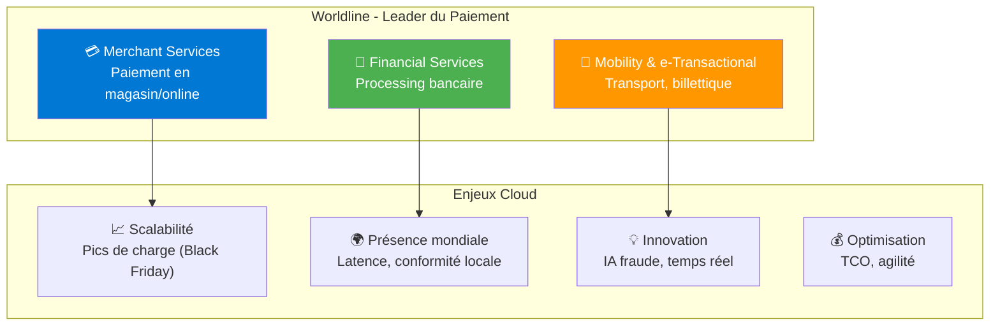

### 1.2 Pourquoi le Cloud pour le Paiement ?

| Bénéfice | Description | Exemple Worldline |
|----------|-------------|-------------------|
| **Élasticité** | Absorber les pics de trafic | Black Friday : x10 transactions |
| **Résilience** | Multi-AZ, multi-région | SLA 99.99% exigé |
| **Time-to-market** | Déployer de nouveaux services | Lancement rapide nouvelles APIs |
| **Innovation** | Accès aux services IA/ML | Détection fraude temps réel |
| **Conformité** | Certifications héritées | PCI-DSS Level 1 |

---

## 2. Contraintes du Secteur Paiement

### 2.1 Les Données Sensibles

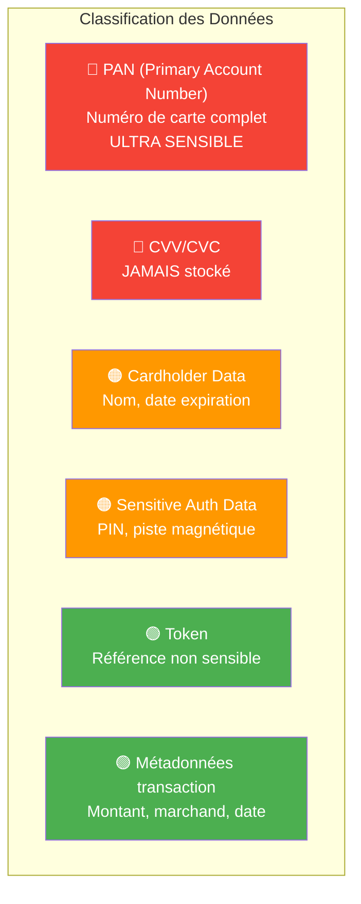

### 2.2 Exigences PCI-DSS dans le Cloud

!!! warning "Rappel"
    PCI-DSS s'applique à **tout environnement** qui stocke, traite ou transmet des données de carte.

**Scope Cloud :**

| Zone | Données | Exigences |
|------|---------|-----------|
| **CDE** (Cardholder Data Environment) | PAN, CHD | PCI-DSS complet |
| **Connected-to-CDE** | Accès au CDE | Contrôles stricts |
| **Out-of-scope** | Données tokenisées | Standard |

### 2.3 Architecture PCI-DSS Typique

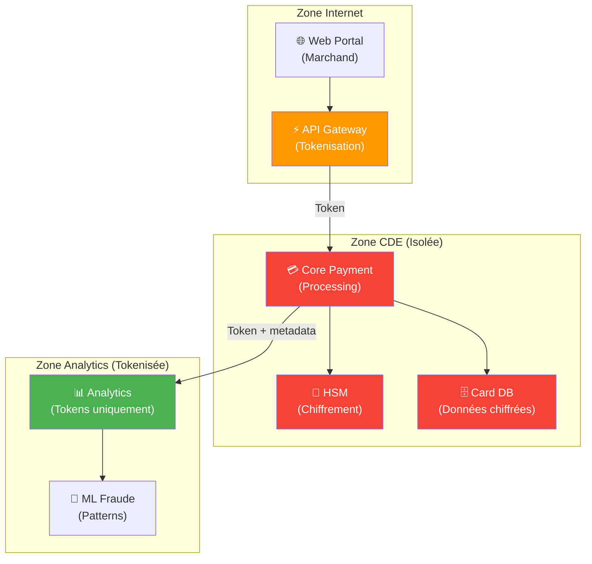

---

## 3. Patterns Cloud pour Worldline

### 3.1 Hybrid Cloud pour le Paiement

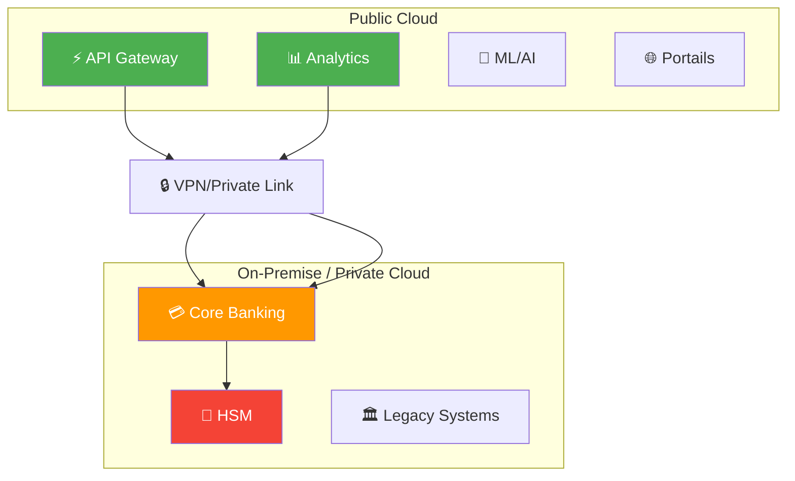

**Pourquoi hybride ?**
- HSM physiques pour les clés de chiffrement
- Systèmes legacy difficiles à migrer
- Contrôle maximal sur les données sensibles
- Conformité réglementaire

### 3.2 Multi-Région pour la Latence

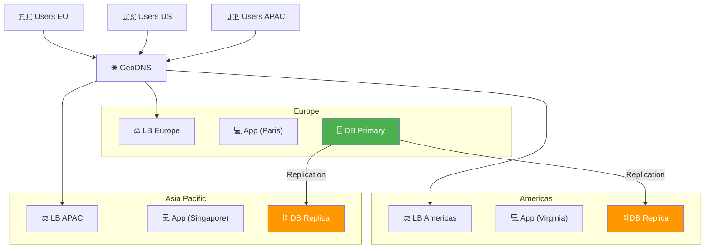

**Exigence** : Latence < 100ms pour l'autorisation

### 3.3 Event-Driven pour le Temps Réel

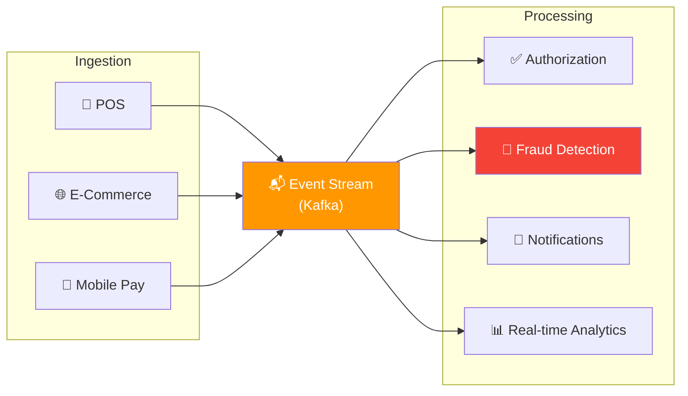

---

## 4. Cas d'Usage Concrets

### 4.1 Détection de Fraude en Temps Réel

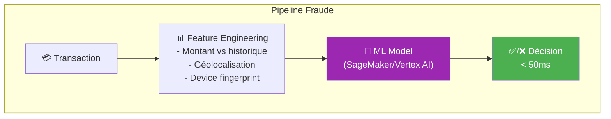

**Services Cloud utilisés :**
- **Streaming** : Kafka (MSK), Event Hubs, Pub/Sub
- **ML** : SageMaker, Azure ML, Vertex AI
- **Stockage features** : Redis, DynamoDB
- **Monitoring** : CloudWatch, Datadog

### 4.2 Portal Marchand Multi-Tenant

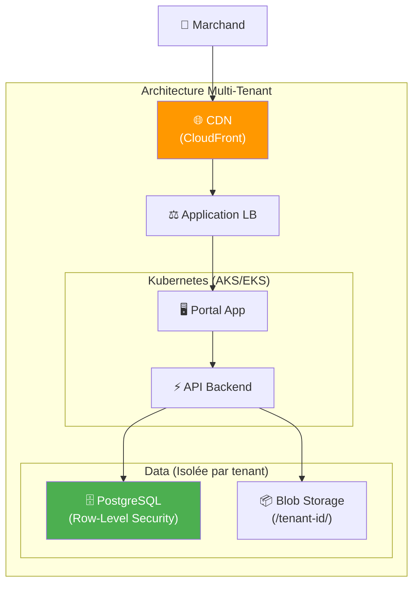

**Isolation des données :**
- Row-Level Security en base
- Préfixes par tenant dans le stockage
- Tokens JWT avec tenant_id

### 4.3 Analytics & Reporting

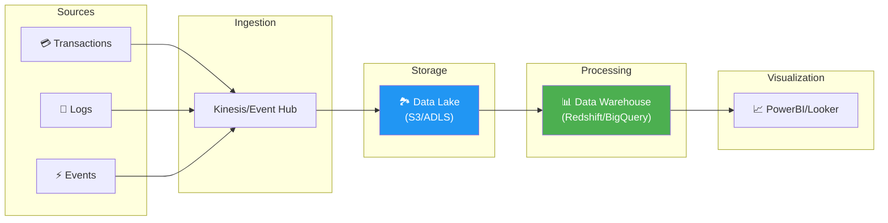

---

## 5. Checklist Projet Cloud Worldline

### 5.1 Questions à Se Poser

!!! warning "Avant de Démarrer"

    **Données**

    - [ ] Quelles données sont manipulées ? (PAN, CHD, tokens ?)
    - [ ] Où doivent-elles résider ? (RGPD, souveraineté)
    - [ ] Comment sont-elles chiffrées ?

    **Conformité**

    - [ ] Le projet entre-t-il dans le scope PCI-DSS ?
    - [ ] Quelles certifications le provider possède-t-il ?
    - [ ] Qui est responsable de quoi ? (RACI)

    **Architecture**

    - [ ] Quel SLA est requis ?
    - [ ] Quelle stratégie DR ? (RPO/RTO)
    - [ ] Comment gérer les pics de charge ?

    **Coûts**

    - [ ] Budget estimé ?
    - [ ] Qui paie ? (cost center, tagging)
    - [ ] Optimisations possibles ?

### 5.2 Matrice de Décision Cloud

| Critère | Public Cloud | Private Cloud | Hybrid |
|---------|--------------|---------------|--------|
| **Données PAN** | ⚠️ Avec précautions | ✅ Recommandé | ✅ Best practice |
| **Analytics tokenisées** | ✅ Idéal | ❌ Surcoût | ✅ OK |
| **Portails web** | ✅ Idéal | ❌ Surcoût | ✅ OK |
| **HSM** | ⚠️ CloudHSM | ✅ Recommandé | ✅ Best practice |
| **Legacy** | ❌ Difficile | ✅ En place | ✅ Progressive |

---

## 6. Votre Parcours de Spécialisation

### 6.1 Quel Provider Choisir ?

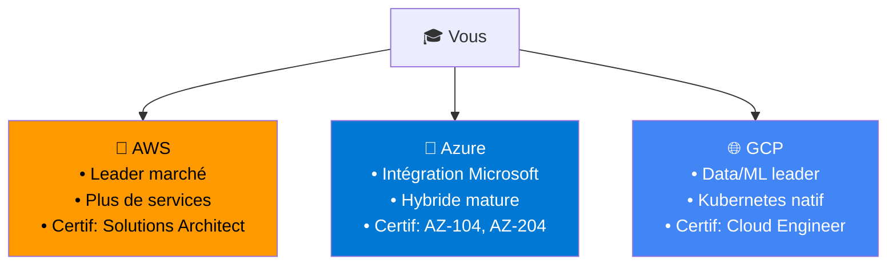

**Recommandations par profil :**

| Profil | Provider suggéré | Raison |
|--------|------------------|--------|
| **Environnement Microsoft** | Azure | Intégration AD, Office 365, licences |
| **Big Data / ML** | GCP | BigQuery, Vertex AI, leadership |
| **Polyvalent / Général** | AWS | Maturité, documentation, communauté |
| **Multi-cloud** | Tous | Kubernetes comme abstraction |

### 6.2 Formations Spécialisées ShellBook

<div class="grid cards" markdown>

-   :material-aws:{ .lg .middle } **AWS Fundamentals**

    ---

    10 modules, 35h - EC2, VPC, S3, EKS, Lambda, CloudWatch...

    [:octicons-arrow-right-24: Accéder](../aws-fundamentals/)

-   :material-microsoft-azure:{ .lg .middle } **Azure Fundamentals**

    ---

    10 modules, 35h - VMs, VNet, AKS, Functions, DevOps...

    [:octicons-arrow-right-24: Accéder](../azure-fundamentals/)

-   :material-google-cloud:{ .lg .middle } **GCP Fundamentals**

    ---

    10 modules, 35h - Compute Engine, GKE, BigQuery, Cloud Run...

    [:octicons-arrow-right-24: Accéder](../gcp-fundamentals/)

</div>

---

## 7. Quiz Final

!!! question "Question 1"
    Dans une architecture Worldline, où placer les données PAN ?

    ??? success "Réponse"
        **Dans une zone CDE isolée**, idéalement en cloud privé ou dans une zone dédiée du cloud public avec :
        - Chiffrement HSM
        - Réseau isolé (pas d'accès Internet direct)
        - Logging et monitoring renforcé
        - Accès restreint (need-to-know)

!!! question "Question 2"
    Pourquoi utiliser un modèle hybride pour le paiement ?

    ??? success "Réponse"
        - **HSM physiques** : Clés de chiffrement critiques
        - **Systèmes legacy** : Difficiles à migrer
        - **Contrôle** : Données ultra-sensibles (PAN)
        - **Conformité** : Certains régulateurs l'exigent

        Le cloud public est utilisé pour : Analytics, Portails, APIs, Innovation (ML).

!!! question "Question 3"
    Quelle latence maximale pour une autorisation de paiement ?

    ??? success "Réponse"
        **< 100ms** idéalement, **< 500ms** maximum.

        C'est pourquoi le déploiement multi-région avec GeoDNS est important pour minimiser la latence réseau.

---

## 8. Conclusion

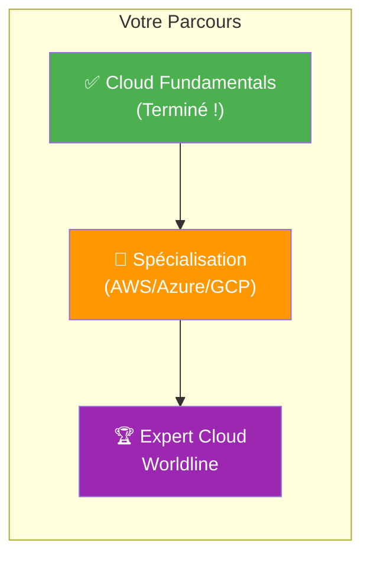

!!! success "Félicitations !"
    Vous avez terminé la formation **Cloud Fundamentals**. Vous avez maintenant les bases pour :

    - Comprendre et expliquer le cloud computing
    - Dialoguer avec les équipes techniques
    - Identifier les opportunités et risques
    - Choisir votre spécialisation

    **Prochaine étape** : Choisissez une formation spécialisée (AWS, Azure ou GCP) selon votre contexte projet.

---

## Exercice : À Vous de Jouer

!!! example "Mise en Pratique"
    **Objectif** : Concevoir l'architecture cloud hybride d'un système de paiement conforme PCI-DSS

    **Contexte** : Worldline doit déployer une nouvelle plateforme de paiement e-commerce avec conformité PCI-DSS Level 1.

    **Tâches à réaliser** :

    1. Proposez une architecture hybride (cloud public + privé) séparant zones PCI et non-PCI
    2. Placez correctement : HSM, Core Payment, API Gateway, Analytics, ML Fraude
    3. Sécurisez la connexion hybride (Direct Connect/ExpressRoute)

    **Critères de validation** :

    - [ ] Données PAN isolées dans environnement dédié
    - [ ] Connexion sécurisée entre cloud et on-prem
    - [ ] Multi-région pour latence < 100ms

??? quote "Solution"
    **Répartition des composants :**

    | Composant | Localisation | Justification |
    |-----------|--------------|---------------|
    | API Gateway | Cloud Public | Scaling élastique |
    | Portail marchand | Cloud Public | Agilité |
    | HSM | On-Premise | PCI-DSS, clés crypto |
    | Core Payment | On-Premise | Données PAN |
    | Analytics | Cloud Public | Données tokenisées |
    | ML Fraude | Cloud Public | Scaling GPU |

    **Sécurisation :**
    ```bash
    # Direct Connect 10Gbps + TLS 1.3 + Firewall
    aws directconnect create-connection \
      --location EqLD5 \
      --bandwidth 10Gbps
    ```

---

## Navigation

| Précédent | Retour au Catalogue |
|-----------|---------------------|
| [← Module 6 : FinOps & Coûts](06-module.md) | [Catalogue des Formations](../index.md) |

---

## Navigation

| | |
|:---|---:|
| [← Module 6 : FinOps & Coûts Cloud](06-module.md) | [Module 8 : Introduction aux Conteneur... →](08-module.md) |

[Retour au Programme](index.md){ .md-button }
