---
tags:
  - formation
  - cloud
  - conteneurs
  - docker
  - kubernetes
  - orchestration
---

# Module 8 : Introduction aux Conteneurs & Kubernetes

## Objectifs du Module

A la fin de ce module, vous serez capable de :

- :fontawesome-solid-box: Comprendre ce qu'est un conteneur et ses avantages
- :fontawesome-solid-docker: Connaître les concepts de base de Docker
- :fontawesome-solid-dharmachakra: Expliquer le rôle de Kubernetes
- :fontawesome-solid-scale-balanced: Comparer les services conteneurs des cloud providers
- :fontawesome-solid-lightbulb: Identifier les cas d'usage adaptés

---

## 1. Le Problème que Résolvent les Conteneurs

### 1.1 Le Cauchemar du "Ça Marche Sur Ma Machine"

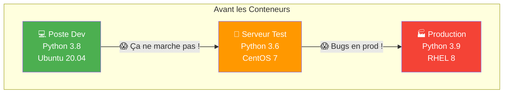

**Problèmes classiques :**
- Versions de langages différentes
- Librairies manquantes ou incompatibles
- Configuration OS différente
- "Ça marche chez moi" devient la phrase la plus prononcée

### 1.2 La Solution : Les Conteneurs

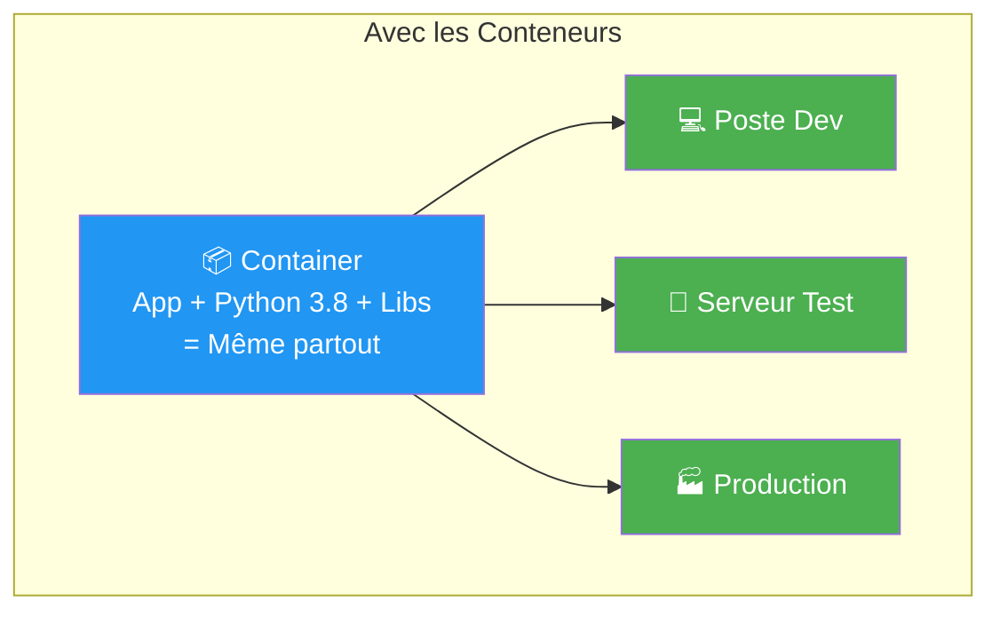

!!! success "Principe Clé"
    Un conteneur embarque l'application **ET** tout son environnement d'exécution. Ce qui tourne en dev tourne de façon identique en production.

---

## 2. Conteneurs vs Machines Virtuelles

### 2.1 Comparaison Visuelle

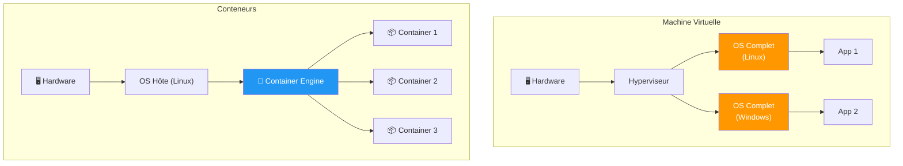

### 2.2 Tableau Comparatif

| Caractéristique | Machine Virtuelle | Conteneur |
|-----------------|-------------------|-----------|
| **Isolation** | Complète (OS séparé) | Processus isolés |
| **Taille** | Go (OS complet) | Mo (juste l'app) |
| **Démarrage** | Minutes | Secondes |
| **Ressources** | Lourdes (RAM, CPU réservés) | Légères (partagées) |
| **Portabilité** | Moyenne (format VM) | Excellente (images) |
| **Densité** | 10-20 VMs/serveur | 100+ containers/serveur |
| **Usage** | Workloads isolés, multi-OS | Microservices, CI/CD |

### 2.3 Analogie du Transport

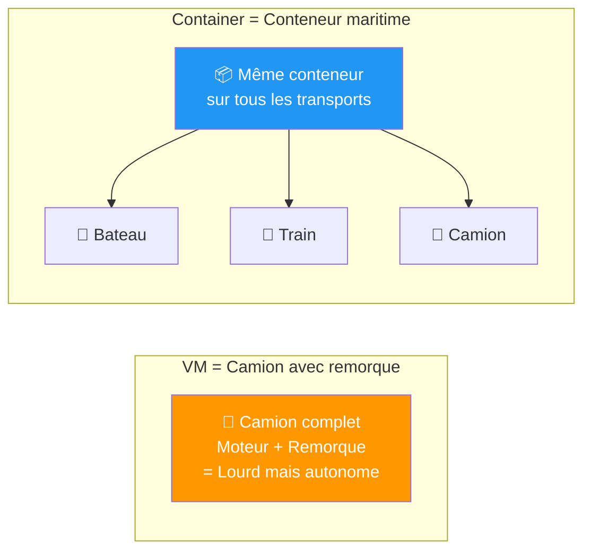

!!! info "Analogie"
    Un conteneur Docker est comme un conteneur maritime : standardisé, empilable, et transportable sur n'importe quelle infrastructure (bateau, train, camion = laptop, serveur, cloud).

---

## 3. Docker : Les Concepts de Base

### 3.1 Vocabulaire Essentiel

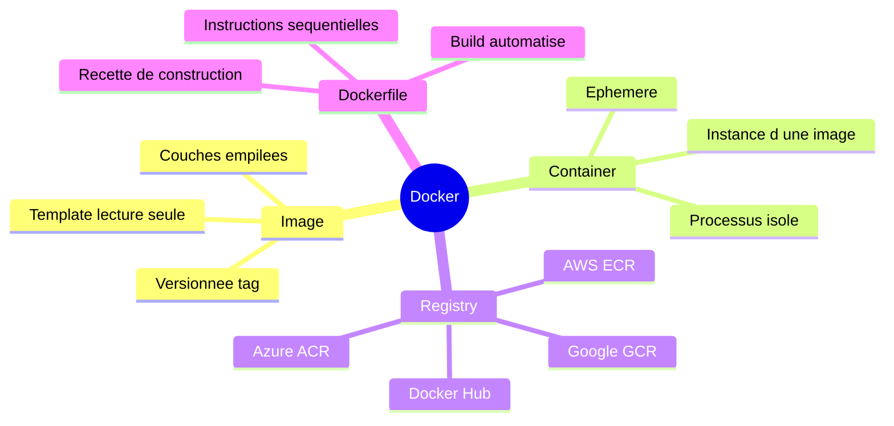

### 3.2 Définitions Simples

| Concept | Définition Simple | Analogie |
|---------|-------------------|----------|
| **Image** | Modèle pour créer des conteneurs | Classe en programmation |
| **Container** | Instance en cours d'exécution | Objet instancié |
| **Dockerfile** | Recette pour construire une image | Makefile |
| **Registry** | Bibliothèque d'images | GitHub pour les images |
| **Volume** | Stockage persistant | Disque externe |
| **Network** | Réseau entre conteneurs | LAN virtuel |

### 3.3 Cycle de Vie d'un Conteneur

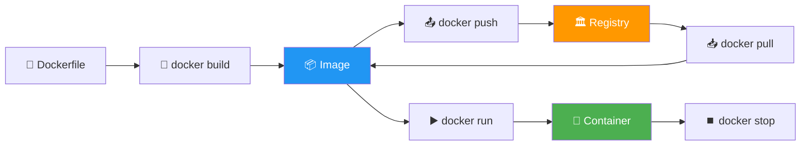

### 3.4 Exemple Concret (Sans Code)

**Scénario** : Vous avez une application Python Flask

**Étapes simplifiées :**

1. **Écrire un Dockerfile** (recette) :
   - Partir d'une image Python officielle
   - Copier le code de l'application
   - Installer les dépendances
   - Définir la commande de démarrage

2. **Construire l'image** : `docker build`
   - Crée une image avec un tag (version)

3. **Tester localement** : `docker run`
   - Lance un conteneur basé sur l'image

4. **Publier** : `docker push`
   - Envoie l'image vers un registry

5. **Déployer** : Le serveur de production récupère la même image

!!! tip "Avantage"
    L'image est **identique** partout. Pas de surprise en production.

---

## 4. Kubernetes : L'Orchestrateur

### 4.1 Pourquoi un Orchestrateur ?

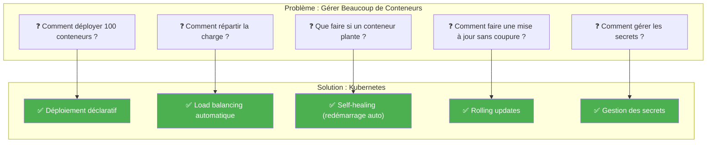

### 4.2 Architecture Simplifiée

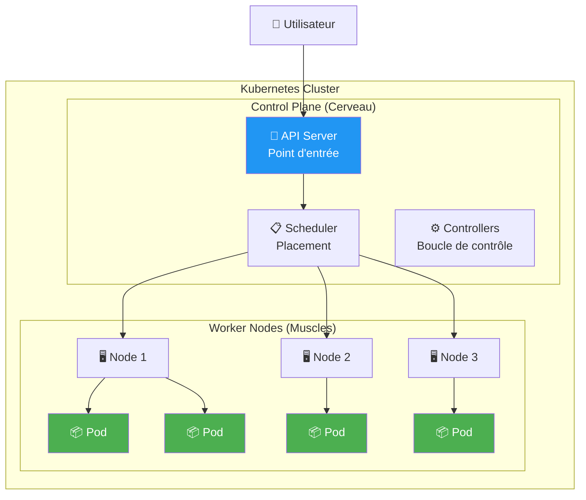

### 4.3 Concepts Clés Kubernetes

| Concept | Description Simple | Analogie |
|---------|-------------------|----------|
| **Cluster** | Ensemble de machines (nodes) | Datacenter |
| **Node** | Une machine (physique ou VM) | Serveur |
| **Pod** | Plus petite unité, 1+ conteneurs | Appartement |
| **Deployment** | Gère les réplicas de Pods | Manager d'équipe |
| **Service** | Point d'entrée stable vers Pods | Numéro de téléphone |
| **Namespace** | Isolation logique | Dossier |
| **Ingress** | Routage HTTP/HTTPS externe | Réceptionniste |

### 4.4 Self-Healing en Action

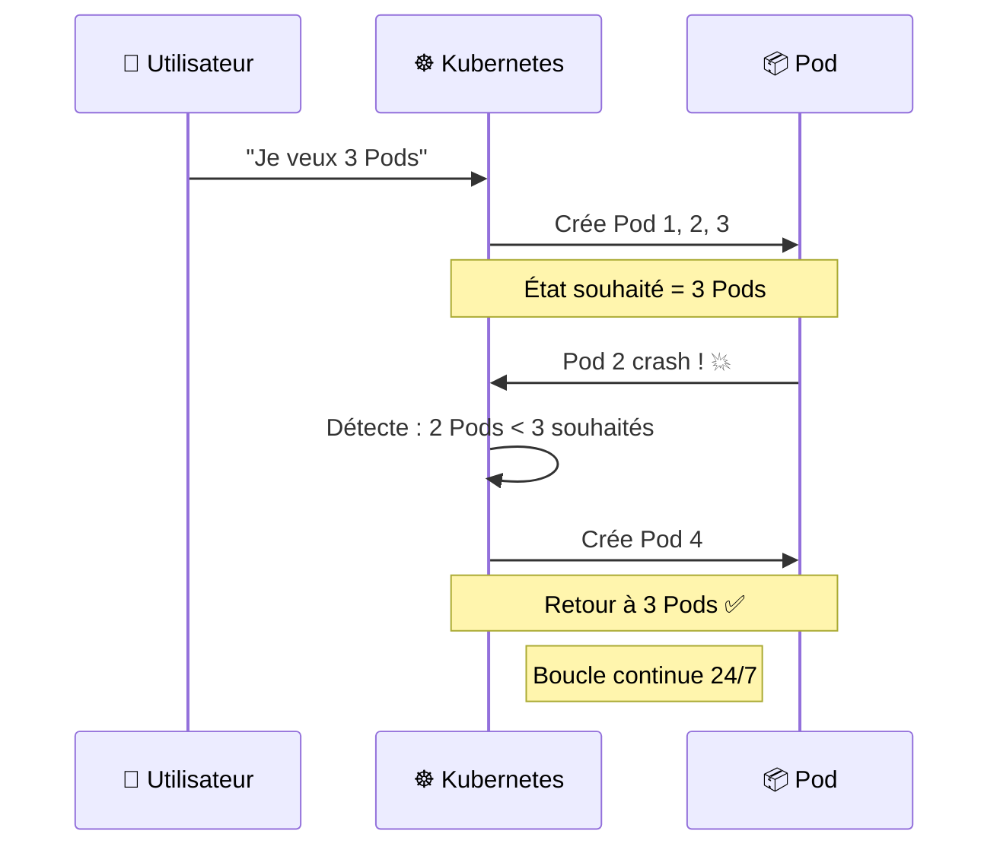

!!! success "Magie de Kubernetes"
    Vous déclarez l'état souhaité ("je veux 3 instances"), Kubernetes s'assure que cet état est maintenu en permanence.

---

## 5. Services Conteneurs Cloud

### 5.1 Panorama des Options

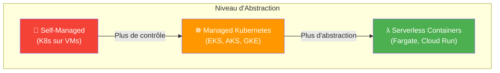

### 5.2 Services par Provider

| Catégorie | AWS | Azure | GCP |
|-----------|-----|-------|-----|
| **Managed Kubernetes** | EKS | AKS | GKE |
| **Container Registry** | ECR | ACR | GCR / Artifact Registry |
| **Serverless Containers** | Fargate, App Runner | Container Apps | Cloud Run |
| **Container Instances** | - | Container Instances | - |

### 5.3 Quand Utiliser Quoi ?

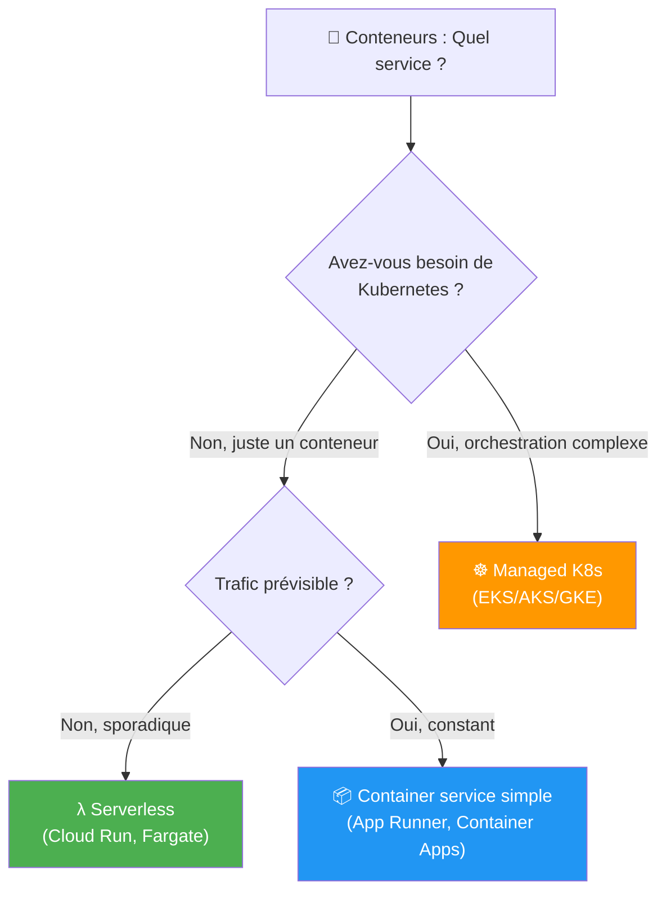

| Cas d'Usage | Service Recommandé |
|-------------|-------------------|
| **Application simple, peu de trafic** | Serverless (Cloud Run, Fargate) |
| **Microservices complexes** | Managed Kubernetes |
| **Migration d'apps existantes** | Managed Kubernetes |
| **Batch processing** | Serverless containers |
| **Besoin de contrôle total** | Self-managed K8s (rare) |

---

## 6. Cas d'Usage Worldline

### 6.1 Microservices Payment Gateway

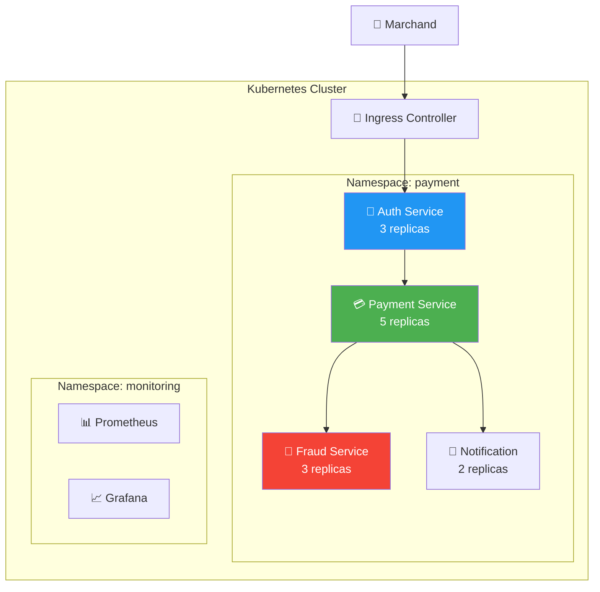

### 6.2 Avantages pour Worldline

| Avantage | Application |
|----------|-------------|
| **Scaling automatique** | Black Friday : x10 replicas automatiquement |
| **Déploiement sans coupure** | Rolling updates pendant les heures de pointe |
| **Isolation** | Chaque service peut scaler indépendamment |
| **Multi-cloud** | Même manifeste K8s sur AWS, Azure ou GCP |
| **Self-healing** | Si un pod crash, redémarrage automatique |

---

## 7. Quiz de Validation

!!! question "Question 1"
    Quelle est la principale différence entre une VM et un conteneur ?

    ??? success "Réponse"
        **Le conteneur partage le kernel de l'OS hôte**, alors que la VM embarque un OS complet.

        Conséquences :
        - Conteneur plus léger (Mo vs Go)
        - Démarrage plus rapide (secondes vs minutes)
        - Plus dense (plus de conteneurs par serveur)

!!! question "Question 2"
    Qu'est-ce qu'un Pod dans Kubernetes ?

    ??? success "Réponse"
        **La plus petite unité déployable**, contenant un ou plusieurs conteneurs qui partagent :
        - Le même réseau (localhost)
        - Le même stockage
        - La même IP

        Généralement, 1 Pod = 1 conteneur applicatif.

!!! question "Question 3"
    Pourquoi utiliser un orchestrateur comme Kubernetes ?

    ??? success "Réponse"
        Pour gérer automatiquement :
        - **Déploiement** : Déclaratif, reproductible
        - **Scaling** : Horizontal auto
        - **Self-healing** : Redémarrage auto des conteneurs crashés
        - **Load balancing** : Répartition du trafic
        - **Rolling updates** : Mises à jour sans downtime

!!! question "Question 4"
    Quel service cloud choisir pour un conteneur simple avec trafic sporadique ?

    ??? success "Réponse"
        **Serverless containers** : Cloud Run (GCP), Fargate (AWS), Container Apps (Azure)

        Avantages :
        - Pas de cluster à gérer
        - Scale to zero (économies)
        - Paiement à l'exécution

---

## 8. Pour Aller Plus Loin

### 8.1 Ressources Recommandées

| Ressource | Type | Description |
|-----------|------|-------------|
| [Docker 101](https://www.docker.com/101-tutorial/) | Tutoriel | Introduction officielle Docker |
| [Kubernetes Basics](https://kubernetes.io/docs/tutorials/kubernetes-basics/) | Tutoriel | Tutoriel interactif K8s |
| [Play with Docker](https://labs.play-with-docker.com/) | Lab gratuit | Environnement Docker en ligne |
| [Katacoda](https://www.katacoda.com/courses/kubernetes) | Lab gratuit | Labs Kubernetes interactifs |

### 8.2 Formations ShellBook Avancées

- [Kubernetes Survival Guide](../../devops/kubernetes-survival.md)
- [Kubernetes CKA](../../devops/kubernetes-cka.md)
- [Docker Advanced](../../devops/docker-advanced.md)

---

## 9. Glossaire Conteneurs

| Terme | Définition |
|-------|------------|
| **Container** | Environnement isolé contenant une application et ses dépendances |
| **Image** | Template immutable pour créer des conteneurs |
| **Registry** | Dépôt d'images (Docker Hub, ECR, ACR, GCR) |
| **Orchestrateur** | Outil de gestion de conteneurs à grande échelle |
| **Pod** | Groupe de conteneurs partageant ressources (K8s) |
| **Cluster** | Ensemble de machines exécutant Kubernetes |
| **Node** | Machine (physique ou VM) dans un cluster |
| **Namespace** | Isolation logique dans Kubernetes |
| **Deployment** | Ressource K8s gérant le cycle de vie des Pods |
| **Service** | Abstraction réseau exposant des Pods |

---

## Navigation

| Précédent | Suivant |
|-----------|---------|
| [Module 7 : Cas d'Usage Worldline](07-module.md) | [Module 9 : DevOps & CI/CD](09-module.md) |
