---
tags:
  - formation
  - cloud
  - devops
  - cicd
  - pipeline
  - automatisation
---

# Module 9 : DevOps & CI/CD pour Débutants

## Objectifs du Module

A la fin de ce module, vous serez capable de :

- :fontawesome-solid-infinity: Comprendre la philosophie DevOps
- :fontawesome-solid-code-branch: Expliquer le workflow Git de base
- :fontawesome-solid-gears: Décrire les concepts CI/CD
- :fontawesome-solid-rocket: Identifier les outils et services cloud
- :fontawesome-solid-shield-halved: Comprendre les bonnes pratiques de sécurité (DevSecOps)

---

## 1. Qu'est-ce que DevOps ?

### 1.1 Le Problème Historique

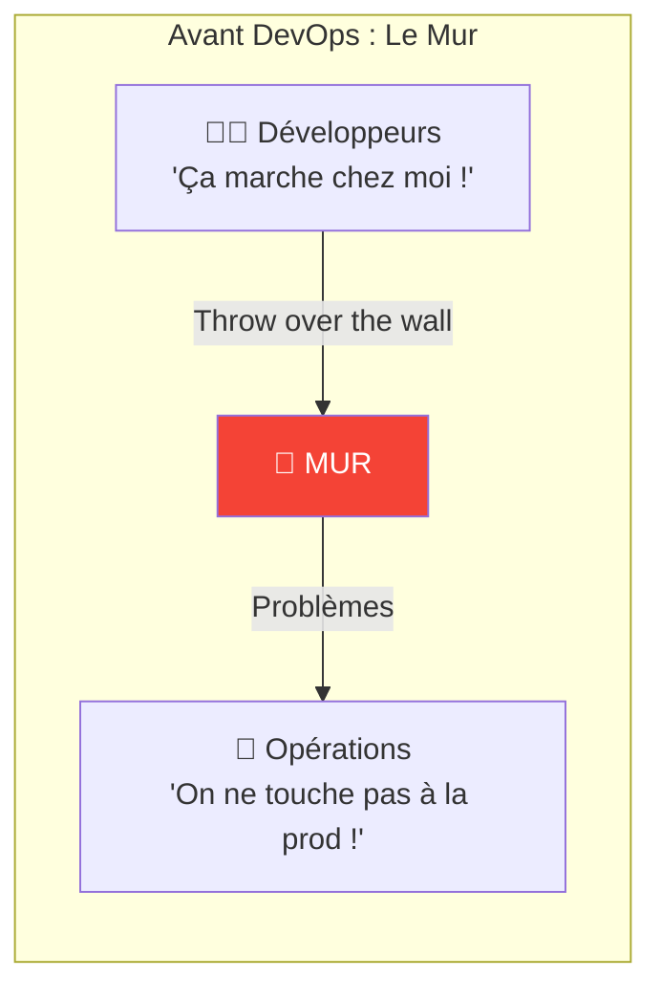

**Symptômes :**
- Déploiements rares et risqués (tous les 6 mois)
- "Ça marche en dev, pas en prod"
- Blame game entre équipes
- Correction de bugs lente
- Innovation freinée

### 1.2 La Culture DevOps

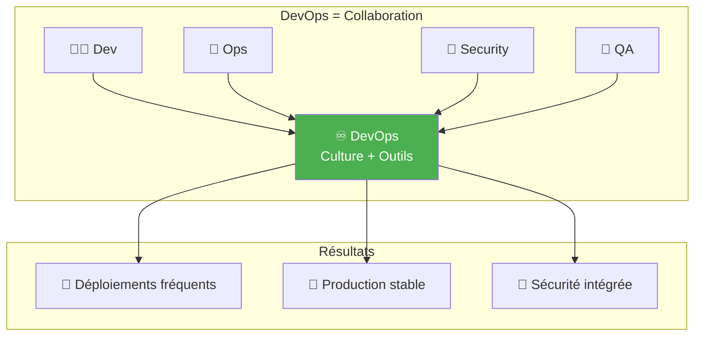

### 1.3 Les Piliers DevOps (CALMS)

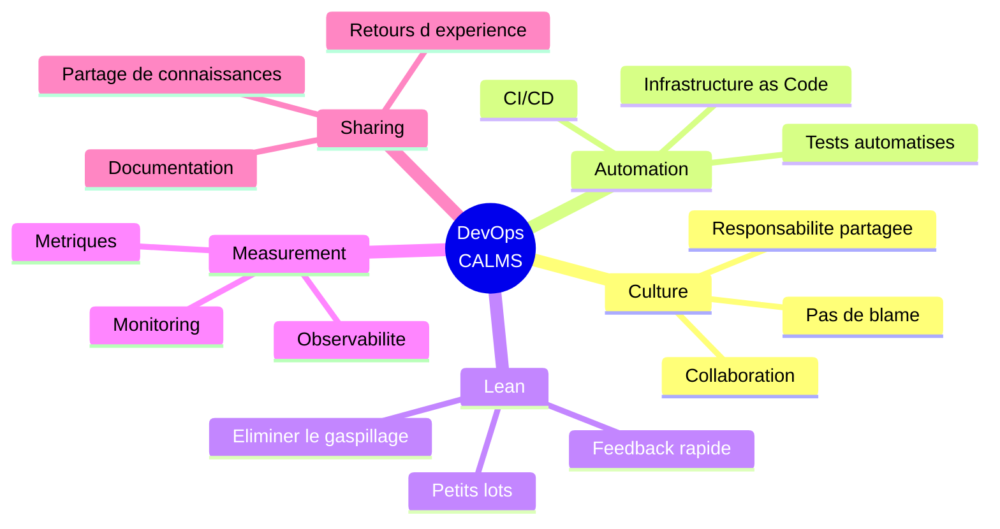

---

## 2. Git : Le Fondement

### 2.1 Pourquoi Git ?

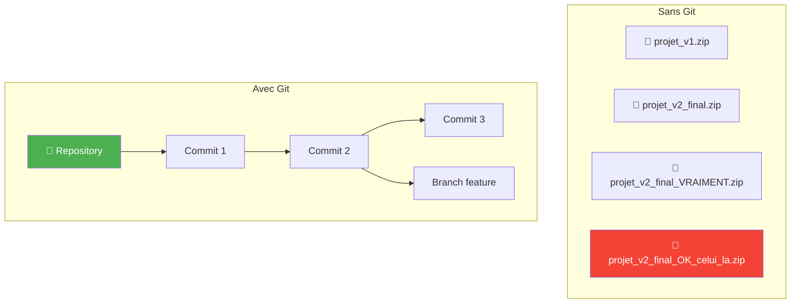

### 2.2 Concepts Git Essentiels

| Concept | Description | Analogie |
|---------|-------------|----------|
| **Repository** | Projet versionné | Dossier avec historique |
| **Commit** | Snapshot du code | Point de sauvegarde |
| **Branch** | Ligne de développement parallèle | Univers alternatif |
| **Merge** | Fusionner deux branches | Réunir deux univers |
| **Pull Request** | Demande de fusion avec revue | "Pouvez-vous valider ?" |
| **Clone** | Copier un repo distant | Télécharger le projet |
| **Push** | Envoyer ses commits | Sauvegarder en ligne |
| **Pull** | Récupérer les changements | Mettre à jour |

### 2.3 Workflow Git Simplifié

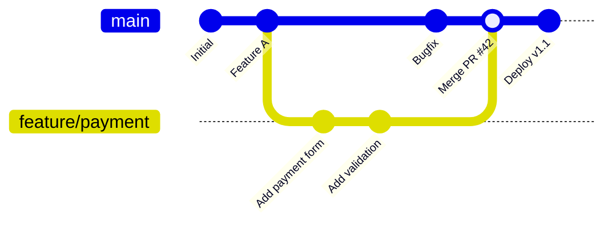

**Étapes typiques :**

1. **Clone** : Récupérer le projet
2. **Branch** : Créer une branche pour votre travail
3. **Commit** : Sauvegarder régulièrement
4. **Push** : Envoyer sur le serveur
5. **Pull Request** : Demander une revue
6. **Merge** : Fusionner après validation

### 2.4 Plateformes Git

| Plateforme | Type | Usage |
|------------|------|-------|
| **GitHub** | SaaS | Open source, CI/CD intégré |
| **GitLab** | SaaS / Self-hosted | CI/CD avancé, DevOps complet |
| **Azure DevOps** | SaaS | Intégration Microsoft |
| **Bitbucket** | SaaS | Intégration Atlassian (Jira) |
| **AWS CodeCommit** | SaaS | Intégration AWS |

---

## 3. CI/CD : L'Automatisation

### 3.1 Définitions

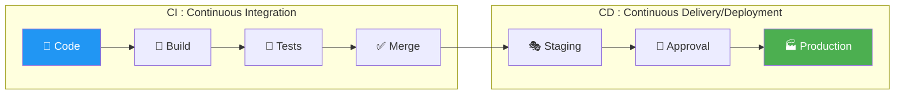

| Terme | Définition |
|-------|------------|
| **Continuous Integration (CI)** | Intégrer et tester le code automatiquement à chaque commit |
| **Continuous Delivery (CD)** | Code toujours prêt à être déployé (validation manuelle) |
| **Continuous Deployment** | Déploiement automatique jusqu'en production |

### 3.2 Pipeline CI/CD Typique

```mermaid
graph TB
    subgraph "Pipeline"
        TRIGGER["⚡ Trigger<br/>(Push/PR)"]

        subgraph "CI"
            CHECKOUT["📥 Checkout"]
            BUILD["🔨 Build"]
            UNIT["🧪 Unit Tests"]
            LINT["📋 Lint/Quality"]
            SCAN["🔐 Security Scan"]
        end

        subgraph "CD"
            ARTIFACT["📦 Package"]
            DEPLOY_DEV["🚀 Deploy Dev"]
            INTEGRATION["🔗 Integration Tests"]
            DEPLOY_STAGING["🎭 Deploy Staging"]
            E2E["🧪 E2E Tests"]
            APPROVAL["👤 Approval"]
            DEPLOY_PROD["🏭 Deploy Prod"]
        end
    end

    TRIGGER --> CHECKOUT --> BUILD --> UNIT --> LINT --> SCAN
    SCAN --> ARTIFACT --> DEPLOY_DEV --> INTEGRATION
    INTEGRATION --> DEPLOY_STAGING --> E2E --> APPROVAL --> DEPLOY_PROD

    style TRIGGER fill:#ff9800,color:#fff
    style DEPLOY_PROD fill:#4caf50,color:#fff
```

### 3.3 Exemple Concret

**Scénario** : Un développeur corrige un bug

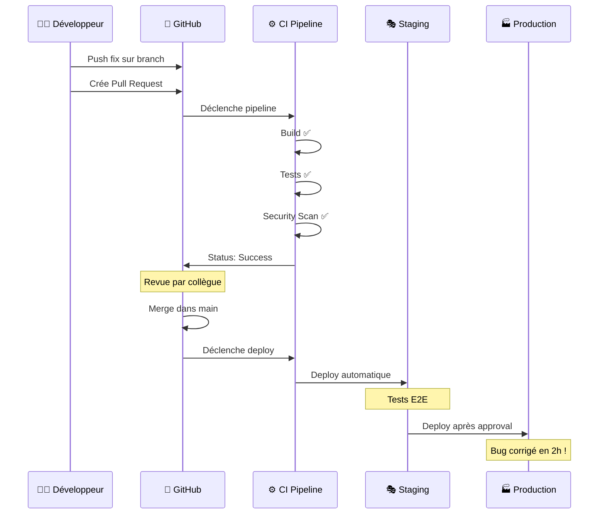

### 3.4 Services CI/CD Cloud

| Provider | Service | Description |
|----------|---------|-------------|
| **GitHub** | GitHub Actions | CI/CD intégré à GitHub |
| **GitLab** | GitLab CI | CI/CD intégré à GitLab |
| **AWS** | CodePipeline, CodeBuild | Pipeline managé AWS |
| **Azure** | Azure Pipelines | CI/CD Azure DevOps |
| **GCP** | Cloud Build | CI/CD Google Cloud |

---

## 4. Infrastructure as Code (IaC)

### 4.1 Le Problème du Provisioning Manuel

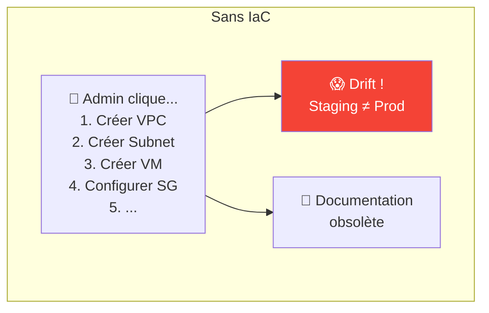

### 4.2 La Solution IaC

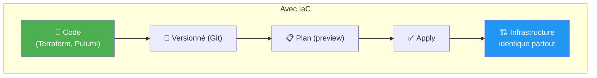

### 4.3 Outils IaC

| Outil | Type | Description |
|-------|------|-------------|
| **Terraform** | Déclaratif, Multi-cloud | Standard de l'industrie |
| **Pulumi** | Impératif, Multi-cloud | Code réel (Python, TypeScript) |
| **CloudFormation** | Déclaratif, AWS only | Natif AWS |
| **ARM/Bicep** | Déclaratif, Azure only | Natif Azure |
| **Ansible** | Configuration | Idempotent, agentless |

### 4.4 Exemple Terraform (Simplifié)

```
# Ce que vous écrivez (déclaratif)
"Je veux :
  - 1 VPC
  - 2 Subnets (public + private)
  - 1 VM t3.medium
  - 1 Security Group autorisant HTTPS"

# Terraform s'occupe de :
  - Créer les ressources dans le bon ordre
  - Gérer les dépendances
  - Mettre à jour si changement
  - Documenter l'état actuel
```

!!! success "Avantages IaC"
    - **Reproductible** : Dev, Staging, Prod identiques
    - **Versionné** : Historique des changements
    - **Revue** : Pull Request sur l'infra
    - **Automatisable** : Déploiement via CI/CD

---

## 5. DevSecOps : Sécurité Intégrée

### 5.1 Shift Left Security

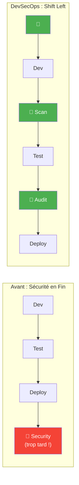

### 5.2 Contrôles de Sécurité dans le Pipeline

| Phase | Contrôle | Outils |
|-------|----------|--------|
| **Code** | Secrets scanning | git-secrets, trufflehog |
| **Build** | SAST (code statique) | SonarQube, Checkmarx |
| **Build** | Dependency scan | Snyk, Dependabot |
| **Image** | Container scan | Trivy, Clair |
| **Deploy** | DAST (dynamique) | OWASP ZAP |
| **Runtime** | RASP, monitoring | Datadog, Falco |

### 5.3 Pipeline DevSecOps

```mermaid
graph TB
    subgraph "Pipeline Sécurisé"
        CODE["📝 Code"]
        SECRETS["🔑 Secrets Scan"]
        BUILD["🔨 Build"]
        SAST["🔍 SAST"]
        DEPS["📦 Dependency Scan"]
        IMAGE["🐳 Container Scan"]
        DEPLOY_DEV["🚀 Deploy Dev"]
        DAST["🌐 DAST"]
        STAGING["🎭 Staging"]
        PENTEST["🔓 Pentest"]
        PROD["🏭 Production"]
        MONITOR["📊 Monitoring"]
    end

    CODE --> SECRETS --> BUILD --> SAST --> DEPS --> IMAGE
    IMAGE --> DEPLOY_DEV --> DAST --> STAGING --> PENTEST --> PROD --> MONITOR

    style SECRETS fill:#ff9800,color:#fff
    style SAST fill:#ff9800,color:#fff
    style DEPS fill:#ff9800,color:#fff
    style IMAGE fill:#ff9800,color:#fff
    style DAST fill:#ff9800,color:#fff
    style PENTEST fill:#ff9800,color:#fff
```

---

## 6. Métriques DevOps (DORA)

### 6.1 Les 4 Métriques DORA

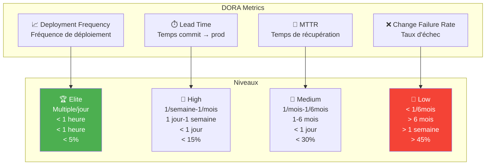

### 6.2 Objectifs par Niveau

| Métrique | Elite | High | Medium | Low |
|----------|-------|------|--------|-----|
| **Deploy Frequency** | Multiple/jour | 1/semaine-1/mois | 1/mois-6mois | < 1/6mois |
| **Lead Time** | < 1 heure | 1 jour-1 semaine | 1-6 mois | > 6 mois |
| **MTTR** | < 1 heure | < 1 jour | < 1 jour | > 1 semaine |
| **Change Failure Rate** | < 5% | < 15% | < 30% | > 45% |

!!! tip "Objectif Worldline"
    Viser le niveau **High** minimum, **Elite** pour les services critiques.

---

## 7. Cas d'Usage Worldline

### 7.1 Pipeline Payment API

```mermaid
graph TB
    subgraph "Pipeline Payment API"
        PR["📝 Pull Request"]

        subgraph "CI (5 min)"
            BUILD["🔨 Build"]
            UNIT["🧪 Tests unitaires"]
            SAST["🔍 SonarQube"]
            SECRETS["🔑 Secrets scan"]
            DEPS["📦 Snyk (CVE)"]
        end

        subgraph "CD Dev (10 min)"
            DOCKER["🐳 Build image"]
            TRIVY["🔍 Trivy scan"]
            DEV["🚀 Deploy Dev"]
            CONTRACT["📋 Contract tests"]
        end

        subgraph "CD Staging (30 min)"
            STAGING["🎭 Deploy Staging"]
            E2E["🧪 E2E tests"]
            PERF["📊 Performance tests"]
            DAST["🌐 DAST scan"]
        end

        subgraph "CD Production"
            APPROVAL["👤 Approval"]
            CANARY["🐤 Canary 5%"]
            ROLLOUT["🚀 Rollout 100%"]
        end
    end

    PR --> BUILD --> UNIT --> SAST --> SECRETS --> DEPS
    DEPS --> DOCKER --> TRIVY --> DEV --> CONTRACT
    CONTRACT --> STAGING --> E2E --> PERF --> DAST
    DAST --> APPROVAL --> CANARY --> ROLLOUT

    style ROLLOUT fill:#4caf50,color:#fff
```

### 7.2 Bénéfices Observés

| Avant DevOps | Après DevOps |
|--------------|--------------|
| 1 release / 6 mois | 10+ releases / jour |
| Lead time : 3 mois | Lead time : 2 heures |
| MTTR : 1 semaine | MTTR : 15 minutes |
| Tests manuels : 2 semaines | Tests auto : 30 minutes |
| Incidents prod : fréquents | Incidents : rares, vite résolus |

---

## 8. Quiz de Validation

!!! question "Question 1"
    Quelle est la différence entre CI et CD ?

    ??? success "Réponse"
        - **CI (Continuous Integration)** : Intégrer et tester automatiquement le code à chaque commit
        - **CD (Continuous Delivery)** : Code toujours prêt à être déployé en production
        - **Continuous Deployment** : Déploiement automatique sans intervention manuelle

!!! question "Question 2"
    Qu'est-ce que "Shift Left" en sécurité ?

    ??? success "Réponse"
        **Intégrer la sécurité plus tôt** dans le cycle de développement (à gauche sur la timeline).

        Au lieu de tester la sécurité à la fin, on scanne :
        - Le code (SAST)
        - Les dépendances (Snyk)
        - Les images (Trivy)
        - Dès le début du pipeline

!!! question "Question 3"
    Qu'est-ce que l'Infrastructure as Code ?

    ??? success "Réponse"
        **Définir l'infrastructure dans des fichiers de code** versionnés (Git), plutôt que de cliquer manuellement dans une console.

        Avantages :
        - Reproductible
        - Versionné
        - Revue possible (PR)
        - Automatisable

!!! question "Question 4"
    Quelle métrique DORA mesure la stabilité ?

    ??? success "Réponse"
        **Change Failure Rate** et **MTTR** (Mean Time To Recovery)

        - CFR : % de déploiements causant un incident
        - MTTR : Temps pour restaurer le service après incident

        Les deux autres (Deploy Frequency, Lead Time) mesurent la vélocité.

---

## 9. Glossaire DevOps

| Terme | Définition |
|-------|------------|
| **CI** | Intégration continue : build et tests automatiques |
| **CD** | Livraison/Déploiement continu |
| **Pipeline** | Séquence d'étapes automatisées |
| **Artifact** | Livrable produit par le build |
| **IaC** | Infrastructure as Code |
| **GitOps** | Infrastructure gérée via Git |
| **SAST** | Analyse de sécurité statique (code) |
| **DAST** | Analyse de sécurité dynamique (runtime) |
| **SCA** | Analyse des composants/dépendances |
| **Canary** | Déploiement progressif (% trafic) |
| **Blue/Green** | Deux environnements, bascule instantanée |
| **Rollback** | Retour à la version précédente |

---

## 10. Pour Aller Plus Loin

### Ressources Recommandées

| Ressource | Type | Description |
|-----------|------|-------------|
| [The Phoenix Project](https://itrevolution.com/the-phoenix-project/) | Livre | Roman DevOps (accessible) |
| [DORA Report](https://dora.dev/) | Rapport | State of DevOps annuel |
| [GitHub Actions Docs](https://docs.github.com/actions) | Doc | Tutoriels CI/CD GitHub |
| [GitLab CI Tutorial](https://docs.gitlab.com/ee/ci/) | Doc | Tutoriels CI/CD GitLab |

### Formations ShellBook

- [Git pour SysOps](../../devops/git-sysops.md)
- [GitLab CI/CD](../../devops/cicd-gitlab.md)
- [GitHub Actions](../../devops/cicd-github-actions.md)
- [Formation DevOps Foundation](../devops-foundation/)

---

## Navigation

| Précédent | Suivant |
|-----------|---------|
| [Module 8 : Conteneurs & Kubernetes](08-module.md) | [Module 10 : Data & IA/ML Cloud](10-module.md) |
