---
tags:
  - formation
  - cloud
  - data
  - ia
  - ml
  - analytics
  - big-data
---

# Module 10 : Data & IA/ML dans le Cloud

## Objectifs du Module

A la fin de ce module, vous serez capable de :

- :fontawesome-solid-database: Comprendre l'écosystème data cloud
- :fontawesome-solid-brain: Expliquer les concepts de base IA/ML
- :fontawesome-solid-chart-line: Identifier les services analytics des providers
- :fontawesome-solid-robot: Connaître les services ML managés
- :fontawesome-solid-credit-card: Appliquer ces concepts au secteur paiement

---

## 1. L'Écosystème Data dans le Cloud

### 1.1 La Révolution Data

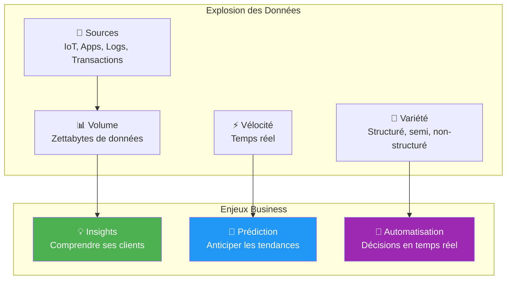

### 1.2 Pipeline Data Typique

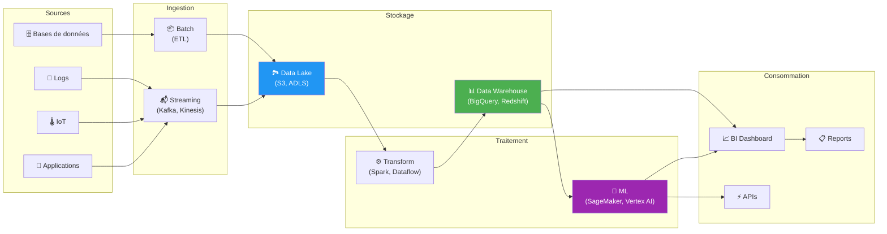

---

## 2. Concepts Data Fondamentaux

### 2.1 Data Lake vs Data Warehouse

```mermaid
graph TB
    subgraph "Data Lake"
        LAKE_DEF["🏞️ Data Lake"]
        LAKE_RAW["Données brutes<br/>(raw)"]
        LAKE_FORMAT["Tous formats<br/>(JSON, CSV, images...)"]
        LAKE_SCHEMA["Schema-on-read<br/>(flexible)"]
        LAKE_COST["💰 Coût faible"]
    end

    subgraph "Data Warehouse"
        DWH_DEF["📊 Data Warehouse"]
        DWH_PROC["Données traitées<br/>(curated)"]
        DWH_FORMAT["Format structuré<br/>(tables)"]
        DWH_SCHEMA["Schema-on-write<br/>(défini)"]
        DWH_PERF["⚡ Haute performance"]
    end

    LAKE_DEF --> LAKE_RAW --> LAKE_FORMAT --> LAKE_SCHEMA --> LAKE_COST
    DWH_DEF --> DWH_PROC --> DWH_FORMAT --> DWH_SCHEMA --> DWH_PERF

    style LAKE_DEF fill:#2196f3,color:#fff
    style DWH_DEF fill:#4caf50,color:#fff
```

| Critère | Data Lake | Data Warehouse |
|---------|-----------|----------------|
| **Données** | Brutes, non transformées | Nettoyées, organisées |
| **Format** | Tous (structuré, semi, non) | Structuré uniquement |
| **Schéma** | Schema-on-read | Schema-on-write |
| **Utilisateurs** | Data Scientists, Engineers | Analystes, Business |
| **Usage** | Exploration, ML | Reporting, BI |
| **Coût** | Faible (stockage objet) | Plus élevé (optimisé) |

### 2.2 ETL vs ELT

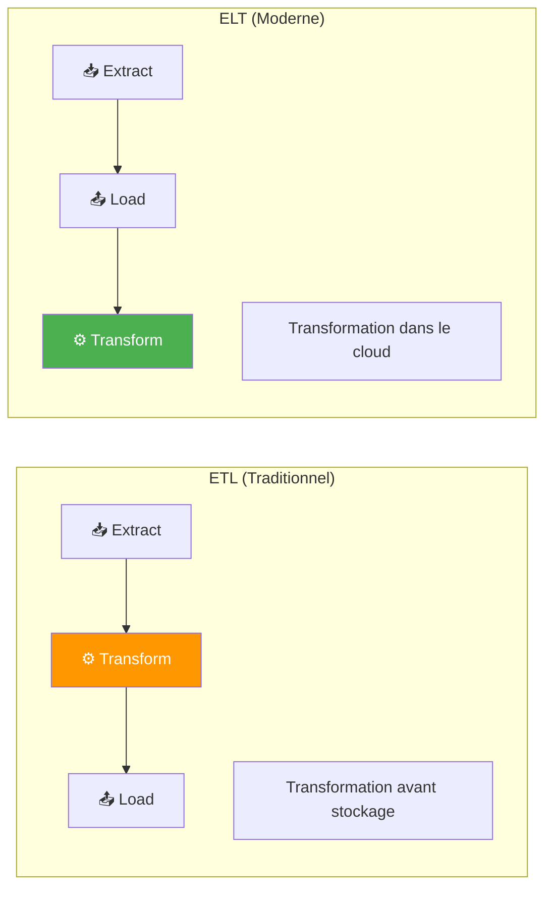

!!! tip "Tendance"
    **ELT** est privilégié dans le cloud car :
    - Le stockage cloud est bon marché
    - La puissance de calcul est élastique
    - On garde les données brutes pour réanalyse

### 2.3 Services par Provider

| Catégorie | AWS | Azure | GCP |
|-----------|-----|-------|-----|
| **Data Lake** | S3 + Lake Formation | ADLS + Synapse | Cloud Storage + BigLake |
| **Data Warehouse** | Redshift | Synapse Analytics | BigQuery |
| **ETL/ELT** | Glue | Data Factory | Dataflow |
| **Streaming** | Kinesis | Event Hubs | Pub/Sub + Dataflow |
| **Catalogue** | Glue Catalog | Purview | Data Catalog |
| **Orchestration** | Step Functions, MWAA | Logic Apps | Cloud Composer |

---

## 3. Introduction à l'IA/ML

### 3.1 IA, ML, Deep Learning : Quelle Différence ?

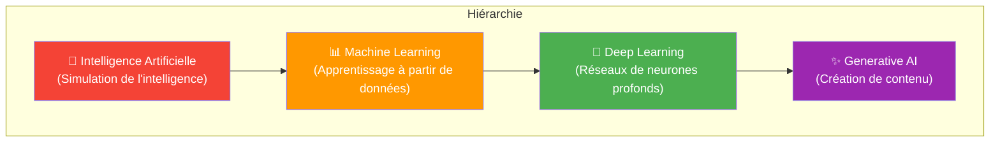

| Concept | Définition | Exemple |
|---------|------------|---------|
| **IA** | Machines qui simulent l'intelligence | Chatbot, recommandation |
| **Machine Learning** | Algorithmes qui apprennent des données | Prédiction de fraude |
| **Deep Learning** | ML avec réseaux de neurones profonds | Reconnaissance d'images |
| **Generative AI** | IA qui crée du contenu | ChatGPT, DALL-E |

### 3.2 Types d'Apprentissage

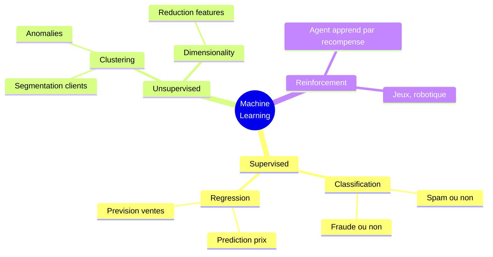

### 3.3 Workflow ML Simplifié

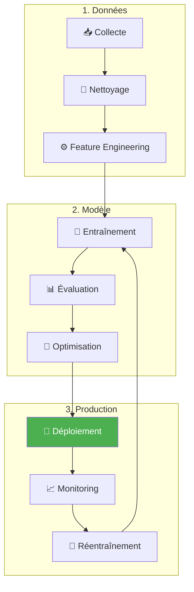

---

## 4. Services ML Cloud

### 4.1 Niveaux d'Abstraction

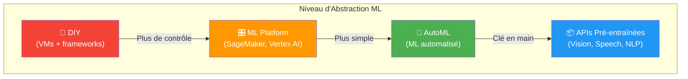

### 4.2 Services par Provider

| Catégorie | AWS | Azure | GCP |
|-----------|-----|-------|-----|
| **ML Platform** | SageMaker | Azure ML | Vertex AI |
| **AutoML** | SageMaker Autopilot | Automated ML | AutoML |
| **Vision** | Rekognition | Computer Vision | Vision AI |
| **Speech** | Transcribe, Polly | Speech Services | Speech-to-Text |
| **NLP** | Comprehend | Text Analytics | Natural Language |
| **Translation** | Translate | Translator | Translation |
| **Chatbot** | Lex | Bot Service | Dialogflow |
| **Gen AI** | Bedrock | OpenAI Service | Vertex AI (PaLM) |

### 4.3 Quand Utiliser Quoi ?

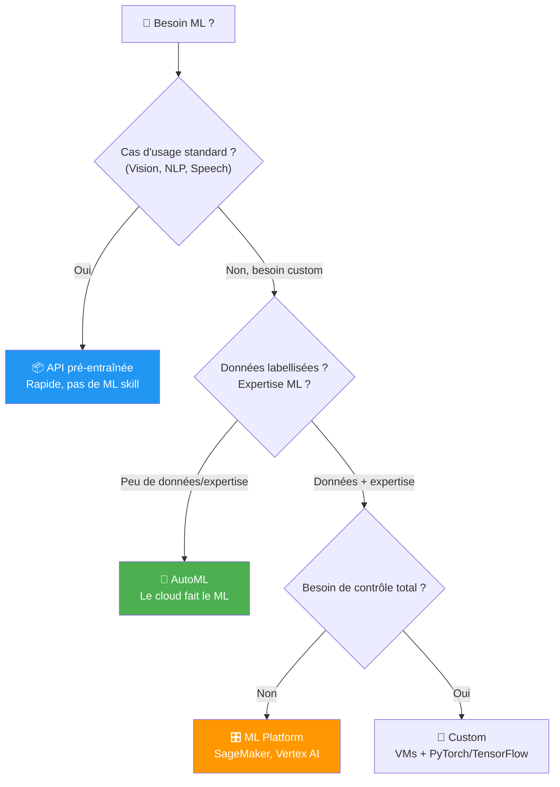

| Cas d'Usage | Solution Recommandée |
|-------------|---------------------|
| Reconnaissance de texte dans images | API Vision pré-entraînée |
| Détection de fraude (custom) | ML Platform ou AutoML |
| Chatbot support client | API Chatbot (Lex, Dialogflow) |
| Prédiction de churn | AutoML |
| Modèle de trading complexe | ML Platform avec expertise |

---

## 5. Generative AI dans le Cloud

### 5.1 Qu'est-ce que la Gen AI ?

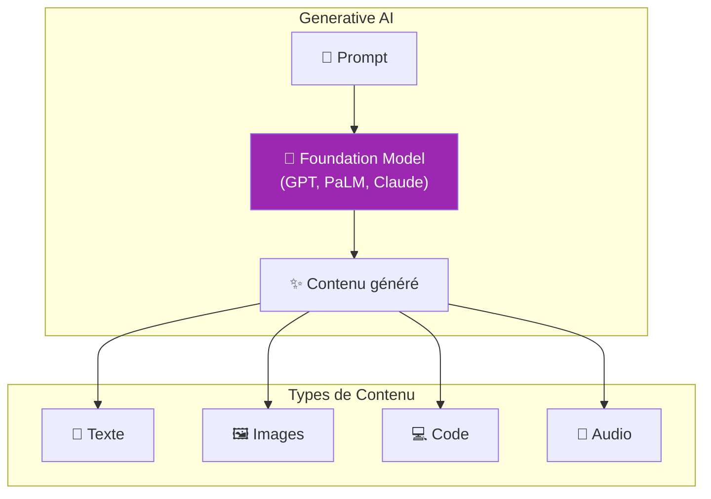

### 5.2 Services Gen AI Cloud

| Provider | Service | Modèles |
|----------|---------|---------|
| **AWS** | Bedrock | Claude, Llama, Titan |
| **Azure** | OpenAI Service | GPT-4, DALL-E |
| **GCP** | Vertex AI | Gemini, PaLM |

### 5.3 Cas d'Usage Entreprise

| Cas d'Usage | Description |
|-------------|-------------|
| **Support Client** | Chatbot intelligent, résumé tickets |
| **Documentation** | Génération de docs techniques |
| **Code** | Assistance développement, review |
| **Analyse** | Résumé de documents, extraction |
| **Personnalisation** | Contenu marketing ciblé |

---

## 6. Cas d'Usage Worldline

### 6.1 Détection de Fraude en Temps Réel

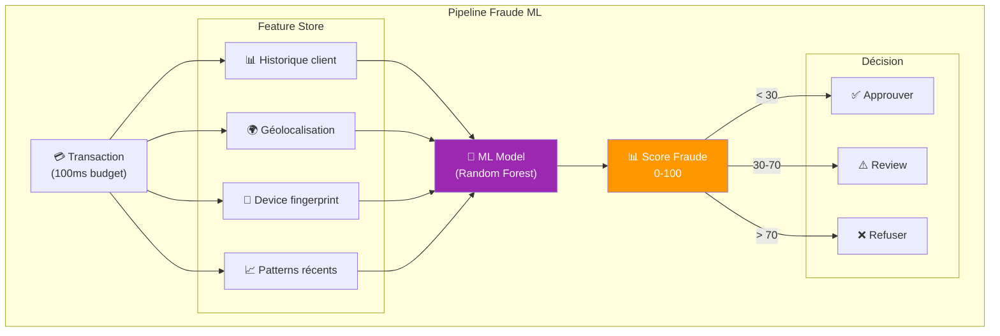

**Features utilisées :**
- Montant vs historique client
- Distance depuis dernière transaction
- Heure inhabituelle
- Nouveau device
- Pays différent
- Vélocité (nb transactions/heure)

### 6.2 Analytics Marchand

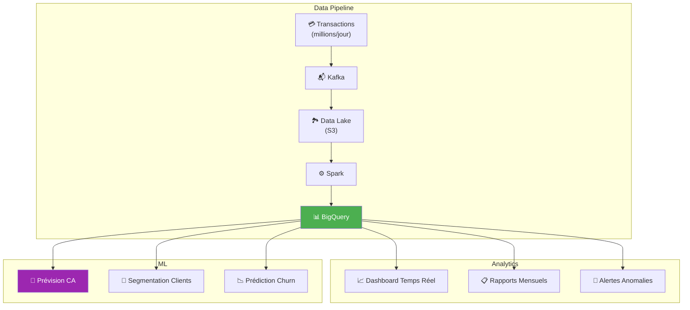

### 6.3 Chatbot Support Marchand

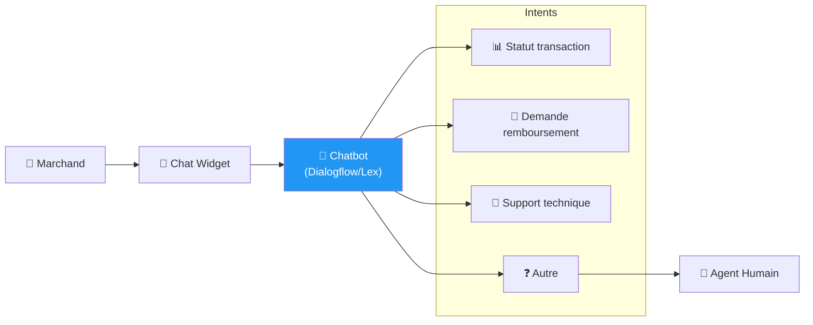

---

## 7. Quiz de Validation

!!! question "Question 1"
    Quelle est la différence entre un Data Lake et un Data Warehouse ?

    ??? success "Réponse"
        | Data Lake | Data Warehouse |
        |-----------|----------------|
        | Données brutes | Données transformées |
        | Tous formats | Structuré uniquement |
        | Schema-on-read | Schema-on-write |
        | Data Scientists | Analystes Business |
        | Exploration, ML | Reporting, BI |

!!! question "Question 2"
    Qu'est-ce que l'AutoML ?

    ??? success "Réponse"
        **Machine Learning automatisé** : le service cloud sélectionne automatiquement :
        - Le meilleur algorithme
        - Les hyperparamètres optimaux
        - Le preprocessing des données

        Idéal quand on a peu d'expertise ML mais des données labellisées.

!!! question "Question 3"
    Pour détecter de la fraude en temps réel, quel type de service ML utiliser ?

    ??? success "Réponse"
        **ML Platform** (SageMaker, Vertex AI) avec un modèle custom car :
        - Besoin de latence faible (< 100ms)
        - Features spécifiques au paiement
        - Modèle entraîné sur vos données
        - Pas un cas d'usage "standard"

!!! question "Question 4"
    Qu'est-ce qu'un Foundation Model ?

    ??? success "Réponse"
        Un **modèle pré-entraîné massif** (GPT, PaLM, Claude) capable de :
        - Comprendre et générer du texte
        - S'adapter à différentes tâches via prompting
        - Être fine-tuné pour des cas spécifiques

        Base de la Generative AI.

---

## 8. Glossaire Data & ML

| Terme | Définition |
|-------|------------|
| **Data Lake** | Stockage de données brutes tous formats |
| **Data Warehouse** | Base optimisée pour l'analyse (BI) |
| **ETL** | Extract, Transform, Load |
| **Feature** | Variable d'entrée d'un modèle ML |
| **Training** | Entraînement d'un modèle sur des données |
| **Inference** | Utilisation d'un modèle entraîné |
| **AutoML** | ML automatisé |
| **Foundation Model** | Grand modèle pré-entraîné (GPT, PaLM) |
| **Fine-tuning** | Adaptation d'un modèle à un cas spécifique |
| **Feature Store** | Base de features réutilisables |
| **MLOps** | DevOps appliqué au ML |
| **LLM** | Large Language Model |

---

## 9. Pour Aller Plus Loin

### Ressources Recommandées

| Ressource | Type | Description |
|-----------|------|-------------|
| [Google ML Crash Course](https://developers.google.com/machine-learning/crash-course) | Cours gratuit | Introduction ML par Google |
| [AWS ML University](https://aws.amazon.com/machine-learning/mlu/) | Cours gratuit | Fondamentaux ML AWS |
| [Azure AI Fundamentals](https://learn.microsoft.com/training/paths/get-started-with-artificial-intelligence-on-azure/) | Parcours | Préparation AI-900 |
| [Kaggle Learn](https://www.kaggle.com/learn) | Tutoriels | Cours pratiques ML |

### Formations ShellBook Avancées

- [Observability Stack](../../devops/observability-stack.md)
- Formation Big Data (à venir)
- Formation MLOps (à venir)

---

## Navigation

| Précédent | Suivant |
|-----------|---------|
| [Module 9 : DevOps & CI/CD](09-module.md) | [Module 11 : Migration Cloud](11-module.md) |
