---
tags:
  - formation
  - cloud
  - data
  - ia
  - ml
  - analytics
  - big-data
---

# Module 10 : Data & IA/ML dans le Cloud

## Objectifs du Module

A la fin de ce module, vous serez capable de :

- :fontawesome-solid-database: Comprendre l'écosystème data cloud
- :fontawesome-solid-brain: Expliquer les concepts de base IA/ML
- :fontawesome-solid-chart-line: Identifier les services analytics des providers
- :fontawesome-solid-robot: Connaître les services ML managés
- :fontawesome-solid-credit-card: Appliquer ces concepts au secteur paiement

---

## 1. L'Écosystème Data dans le Cloud

### 1.1 La Révolution Data

```mermaid
graph TB
    subgraph "Explosion des Données"
        SOURCES["📱 Sources<br/>IoT, Apps, Logs, Transactions"]
        VOLUME["📊 Volume<br/>Zettabytes de données"]
        VELOCITY["⚡ Vélocité<br/>Temps réel"]
        VARIETY["🎨 Variété<br/>Structuré, semi, non-structuré"]
    end

    subgraph "Enjeux Business"
        INSIGHT["💡 Insights<br/>Comprendre ses clients"]
        PREDICT["🔮 Prédiction<br/>Anticiper les tendances"]
        AUTOMATE["🤖 Automatisation<br/>Décisions en temps réel"]
    end

    SOURCES --> VOLUME
    VOLUME --> INSIGHT
    VELOCITY --> PREDICT
    VARIETY --> AUTOMATE

    style INSIGHT fill:#4caf50,color:#fff
    style PREDICT fill:#2196f3,color:#fff
    style AUTOMATE fill:#9c27b0,color:#fff
```

### 1.2 Pipeline Data Typique

```mermaid
graph LR
    subgraph "Sources"
        APP["📱 Applications"]
        IOT["🌡️ IoT"]
        DB["🗄️ Bases de données"]
        LOGS["📝 Logs"]
    end

    subgraph "Ingestion"
        STREAM["📬 Streaming<br/>(Kafka, Kinesis)"]
        BATCH["📦 Batch<br/>(ETL)"]
    end

    subgraph "Stockage"
        LAKE["🏞️ Data Lake<br/>(S3, ADLS)"]
        DWH["📊 Data Warehouse<br/>(BigQuery, Redshift)"]
    end

    subgraph "Traitement"
        TRANSFORM["⚙️ Transform<br/>(Spark, Dataflow)"]
        ML["🤖 ML<br/>(SageMaker, Vertex AI)"]
    end

    subgraph "Consommation"
        BI["📈 BI Dashboard"]
        API["⚡ APIs"]
        REPORT["📋 Reports"]
    end

    APP --> STREAM
    IOT --> STREAM
    DB --> BATCH
    LOGS --> STREAM

    STREAM --> LAKE
    BATCH --> LAKE

    LAKE --> TRANSFORM
    TRANSFORM --> DWH
    DWH --> ML

    ML --> BI
    DWH --> BI
    ML --> API
    BI --> REPORT

    style LAKE fill:#2196f3,color:#fff
    style DWH fill:#4caf50,color:#fff
    style ML fill:#9c27b0,color:#fff
```

---

## 2. Concepts Data Fondamentaux

### 2.1 Data Lake vs Data Warehouse

```mermaid
graph TB
    subgraph "Data Lake"
        LAKE_DEF["🏞️ Data Lake"]
        LAKE_RAW["Données brutes<br/>(raw)"]
        LAKE_FORMAT["Tous formats<br/>(JSON, CSV, images...)"]
        LAKE_SCHEMA["Schema-on-read<br/>(flexible)"]
        LAKE_COST["💰 Coût faible"]
    end

    subgraph "Data Warehouse"
        DWH_DEF["📊 Data Warehouse"]
        DWH_PROC["Données traitées<br/>(curated)"]
        DWH_FORMAT["Format structuré<br/>(tables)"]
        DWH_SCHEMA["Schema-on-write<br/>(défini)"]
        DWH_PERF["⚡ Haute performance"]
    end

    LAKE_DEF --> LAKE_RAW --> LAKE_FORMAT --> LAKE_SCHEMA --> LAKE_COST
    DWH_DEF --> DWH_PROC --> DWH_FORMAT --> DWH_SCHEMA --> DWH_PERF

    style LAKE_DEF fill:#2196f3,color:#fff
    style DWH_DEF fill:#4caf50,color:#fff
```

| Critère | Data Lake | Data Warehouse |
|---------|-----------|----------------|
| **Données** | Brutes, non transformées | Nettoyées, organisées |
| **Format** | Tous (structuré, semi, non) | Structuré uniquement |
| **Schéma** | Schema-on-read | Schema-on-write |
| **Utilisateurs** | Data Scientists, Engineers | Analystes, Business |
| **Usage** | Exploration, ML | Reporting, BI |
| **Coût** | Faible (stockage objet) | Plus élevé (optimisé) |

### 2.2 ETL vs ELT

```mermaid
graph LR
    subgraph "ETL (Traditionnel)"
        E1["📥 Extract"] --> T1["⚙️ Transform"] --> L1["📤 Load"]
        NOTE1["Transformation avant stockage"]
    end

    subgraph "ELT (Moderne)"
        E2["📥 Extract"] --> L2["📤 Load"] --> T2["⚙️ Transform"]
        NOTE2["Transformation dans le cloud"]
    end

    style T1 fill:#ff9800,color:#fff
    style T2 fill:#4caf50,color:#fff
```

!!! tip "Tendance"
    **ELT** est privilégié dans le cloud car :
    - Le stockage cloud est bon marché
    - La puissance de calcul est élastique
    - On garde les données brutes pour réanalyse

### 2.3 Services par Provider

| Catégorie | AWS | Azure | GCP |
|-----------|-----|-------|-----|
| **Data Lake** | S3 + Lake Formation | ADLS + Synapse | Cloud Storage + BigLake |
| **Data Warehouse** | Redshift | Synapse Analytics | BigQuery |
| **ETL/ELT** | Glue | Data Factory | Dataflow |
| **Streaming** | Kinesis | Event Hubs | Pub/Sub + Dataflow |
| **Catalogue** | Glue Catalog | Purview | Data Catalog |
| **Orchestration** | Step Functions, MWAA | Logic Apps | Cloud Composer |

---

## 3. Introduction à l'IA/ML

### 3.1 IA, ML, Deep Learning : Quelle Différence ?

```mermaid
graph TB
    subgraph "Hiérarchie"
        AI["🧠 Intelligence Artificielle<br/>(Simulation de l'intelligence)"]
        ML["📊 Machine Learning<br/>(Apprentissage à partir de données)"]
        DL["🔮 Deep Learning<br/>(Réseaux de neurones profonds)"]
        GENAI["✨ Generative AI<br/>(Création de contenu)"]
    end

    AI --> ML --> DL --> GENAI

    style AI fill:#f44336,color:#fff
    style ML fill:#ff9800,color:#fff
    style DL fill:#4caf50,color:#fff
    style GENAI fill:#9c27b0,color:#fff
```

| Concept | Définition | Exemple |
|---------|------------|---------|
| **IA** | Machines qui simulent l'intelligence | Chatbot, recommandation |
| **Machine Learning** | Algorithmes qui apprennent des données | Prédiction de fraude |
| **Deep Learning** | ML avec réseaux de neurones profonds | Reconnaissance d'images |
| **Generative AI** | IA qui crée du contenu | ChatGPT, DALL-E |

### 3.2 Types d'Apprentissage

### 3.3 Workflow ML Simplifié

```mermaid
graph TB
    subgraph "1. Données"
        COLLECT["📥 Collecte"]
        CLEAN["🧹 Nettoyage"]
        FEATURE["⚙️ Feature Engineering"]
    end

    subgraph "2. Modèle"
        TRAIN["🎯 Entraînement"]
        EVAL["📊 Évaluation"]
        TUNE["🔧 Optimisation"]
    end

    subgraph "3. Production"
        DEPLOY["🚀 Déploiement"]
        MONITOR["📈 Monitoring"]
        RETRAIN["🔄 Réentraînement"]
    end

    COLLECT --> CLEAN --> FEATURE
    FEATURE --> TRAIN --> EVAL --> TUNE
    TUNE --> DEPLOY --> MONITOR --> RETRAIN
    RETRAIN --> TRAIN

    style DEPLOY fill:#4caf50,color:#fff
```

---

## 4. Services ML Cloud

### 4.1 Niveaux d'Abstraction

```mermaid
graph TB
    subgraph "Niveau d'Abstraction ML"
        DIY["🔧 DIY<br/>(VMs + frameworks)"]
        PLATFORM["🎛️ ML Platform<br/>(SageMaker, Vertex AI)"]
        AUTOML["🤖 AutoML<br/>(ML automatisé)"]
        PREBUILT["📦 APIs Pré-entraînées<br/>(Vision, Speech, NLP)"]
    end

    DIY -->|"Plus de contrôle"| PLATFORM
    PLATFORM -->|"Plus simple"| AUTOML
    AUTOML -->|"Clé en main"| PREBUILT

    style DIY fill:#f44336,color:#fff
    style PLATFORM fill:#ff9800,color:#fff
    style AUTOML fill:#4caf50,color:#fff
    style PREBUILT fill:#2196f3,color:#fff
```

### 4.2 Services par Provider

| Catégorie | AWS | Azure | GCP |
|-----------|-----|-------|-----|
| **ML Platform** | SageMaker | Azure ML | Vertex AI |
| **AutoML** | SageMaker Autopilot | Automated ML | AutoML |
| **Vision** | Rekognition | Computer Vision | Vision AI |
| **Speech** | Transcribe, Polly | Speech Services | Speech-to-Text |
| **NLP** | Comprehend | Text Analytics | Natural Language |
| **Translation** | Translate | Translator | Translation |
| **Chatbot** | Lex | Bot Service | Dialogflow |
| **Gen AI** | Bedrock | OpenAI Service | Vertex AI (PaLM) |

### 4.3 Quand Utiliser Quoi ?

```mermaid
flowchart TD
    START["🤔 Besoin ML ?"] --> Q1{"Cas d'usage standard ?<br/>(Vision, NLP, Speech)"}

    Q1 -->|"Oui"| PREBUILT["📦 API pré-entraînée<br/>Rapide, pas de ML skill"]
    Q1 -->|"Non, besoin custom"| Q2{"Données labellisées ?<br/>Expertise ML ?"}

    Q2 -->|"Peu de données/expertise"| AUTOML["🤖 AutoML<br/>Le cloud fait le ML"]
    Q2 -->|"Données + expertise"| Q3{"Besoin de contrôle total ?"}

    Q3 -->|"Non"| PLATFORM["🎛️ ML Platform<br/>SageMaker, Vertex AI"]
    Q3 -->|"Oui"| DIY["🔧 Custom<br/>VMs + PyTorch/TensorFlow"]

    style PREBUILT fill:#2196f3,color:#fff
    style AUTOML fill:#4caf50,color:#fff
    style PLATFORM fill:#ff9800,color:#fff
```

| Cas d'Usage | Solution Recommandée |
|-------------|---------------------|
| Reconnaissance de texte dans images | API Vision pré-entraînée |
| Détection de fraude (custom) | ML Platform ou AutoML |
| Chatbot support client | API Chatbot (Lex, Dialogflow) |
| Prédiction de churn | AutoML |
| Modèle de trading complexe | ML Platform avec expertise |

---

## 5. Generative AI dans le Cloud

### 5.1 Qu'est-ce que la Gen AI ?

```mermaid
graph TB
    subgraph "Generative AI"
        INPUT["📝 Prompt"]
        MODEL["🧠 Foundation Model<br/>(GPT, PaLM, Claude)"]
        OUTPUT["✨ Contenu généré"]
    end

    subgraph "Types de Contenu"
        TEXT["📝 Texte"]
        IMAGE["🖼️ Images"]
        CODE["💻 Code"]
        AUDIO["🎵 Audio"]
    end

    INPUT --> MODEL --> OUTPUT
    OUTPUT --> TEXT
    OUTPUT --> IMAGE
    OUTPUT --> CODE
    OUTPUT --> AUDIO

    style MODEL fill:#9c27b0,color:#fff
```

### 5.2 Services Gen AI Cloud

| Provider | Service | Modèles |
|----------|---------|---------|
| **AWS** | Bedrock | Claude, Llama, Titan |
| **Azure** | OpenAI Service | GPT-4, DALL-E |
| **GCP** | Vertex AI | Gemini, PaLM |

### 5.3 Cas d'Usage Entreprise

| Cas d'Usage | Description |
|-------------|-------------|
| **Support Client** | Chatbot intelligent, résumé tickets |
| **Documentation** | Génération de docs techniques |
| **Code** | Assistance développement, review |
| **Analyse** | Résumé de documents, extraction |
| **Personnalisation** | Contenu marketing ciblé |

---

## 6. Cas d'Usage Worldline

### 6.1 Détection de Fraude en Temps Réel

```mermaid
graph TB
    subgraph "Pipeline Fraude ML"
        TX["💳 Transaction<br/>(100ms budget)"]

        subgraph "Feature Store"
            HIST["📊 Historique client"]
            GEO["🌍 Géolocalisation"]
            DEVICE["📱 Device fingerprint"]
            PATTERN["📈 Patterns récents"]
        end

        MODEL["🤖 ML Model<br/>(Random Forest)"]
        SCORE["📊 Score Fraude<br/>0-100"]

        subgraph "Décision"
            APPROVE["✅ Approuver"]
            REVIEW["⚠️ Review"]
            DECLINE["❌ Refuser"]
        end
    end

    TX --> HIST
    TX --> GEO
    TX --> DEVICE
    TX --> PATTERN

    HIST --> MODEL
    GEO --> MODEL
    DEVICE --> MODEL
    PATTERN --> MODEL

    MODEL --> SCORE

    SCORE -->|"< 30"| APPROVE
    SCORE -->|"30-70"| REVIEW
    SCORE -->|"> 70"| DECLINE

    style MODEL fill:#9c27b0,color:#fff
    style SCORE fill:#ff9800,color:#fff
```

**Features utilisées :**
- Montant vs historique client
- Distance depuis dernière transaction
- Heure inhabituelle
- Nouveau device
- Pays différent
- Vélocité (nb transactions/heure)

### 6.2 Analytics Marchand

```mermaid
graph TB
    subgraph "Data Pipeline"
        TRANSACTIONS["💳 Transactions<br/>(millions/jour)"]
        STREAM["📬 Kafka"]
        LAKE["🏞️ Data Lake<br/>(S3)"]
        TRANSFORM["⚙️ Spark"]
        DWH["📊 BigQuery"]
    end

    subgraph "Analytics"
        DASHBOARD["📈 Dashboard Temps Réel"]
        REPORTS["📋 Rapports Mensuels"]
        ALERTS["🚨 Alertes Anomalies"]
    end

    subgraph "ML"
        FORECAST["🔮 Prévision CA"]
        SEGMENT["👥 Segmentation Clients"]
        CHURN["📉 Prédiction Churn"]
    end

    TRANSACTIONS --> STREAM --> LAKE --> TRANSFORM --> DWH
    DWH --> DASHBOARD
    DWH --> REPORTS
    DWH --> ALERTS
    DWH --> FORECAST
    DWH --> SEGMENT
    DWH --> CHURN

    style DWH fill:#4caf50,color:#fff
    style FORECAST fill:#9c27b0,color:#fff
```

### 6.3 Chatbot Support Marchand

```mermaid
graph LR
    MERCHANT["🏪 Marchand"]
    CHAT["💬 Chat Widget"]
    BOT["🤖 Chatbot<br/>(Dialogflow/Lex)"]

    subgraph "Intents"
        STATUS["📊 Statut transaction"]
        REFUND["💸 Demande remboursement"]
        TECH["🔧 Support technique"]
        OTHER["❓ Autre"]
    end

    HUMAN["👤 Agent Humain"]

    MERCHANT --> CHAT --> BOT
    BOT --> STATUS
    BOT --> REFUND
    BOT --> TECH
    BOT --> OTHER --> HUMAN

    style BOT fill:#2196f3,color:#fff
```

---

## 7. Quiz de Validation

!!! question "Question 1"
    Quelle est la différence entre un Data Lake et un Data Warehouse ?

    ??? success "Réponse"
        | Data Lake | Data Warehouse |
        |-----------|----------------|
        | Données brutes | Données transformées |
        | Tous formats | Structuré uniquement |
        | Schema-on-read | Schema-on-write |
        | Data Scientists | Analystes Business |
        | Exploration, ML | Reporting, BI |

!!! question "Question 2"
    Qu'est-ce que l'AutoML ?

    ??? success "Réponse"
        **Machine Learning automatisé** : le service cloud sélectionne automatiquement :
        - Le meilleur algorithme
        - Les hyperparamètres optimaux
        - Le preprocessing des données

        Idéal quand on a peu d'expertise ML mais des données labellisées.

!!! question "Question 3"
    Pour détecter de la fraude en temps réel, quel type de service ML utiliser ?

    ??? success "Réponse"
        **ML Platform** (SageMaker, Vertex AI) avec un modèle custom car :
        - Besoin de latence faible (< 100ms)
        - Features spécifiques au paiement
        - Modèle entraîné sur vos données
        - Pas un cas d'usage "standard"

!!! question "Question 4"
    Qu'est-ce qu'un Foundation Model ?

    ??? success "Réponse"
        Un **modèle pré-entraîné massif** (GPT, PaLM, Claude) capable de :
        - Comprendre et générer du texte
        - S'adapter à différentes tâches via prompting
        - Être fine-tuné pour des cas spécifiques

        Base de la Generative AI.

---

## 8. Glossaire Data & ML

| Terme | Définition |
|-------|------------|
| **Data Lake** | Stockage de données brutes tous formats |
| **Data Warehouse** | Base optimisée pour l'analyse (BI) |
| **ETL** | Extract, Transform, Load |
| **Feature** | Variable d'entrée d'un modèle ML |
| **Training** | Entraînement d'un modèle sur des données |
| **Inference** | Utilisation d'un modèle entraîné |
| **AutoML** | ML automatisé |
| **Foundation Model** | Grand modèle pré-entraîné (GPT, PaLM) |
| **Fine-tuning** | Adaptation d'un modèle à un cas spécifique |
| **Feature Store** | Base de features réutilisables |
| **MLOps** | DevOps appliqué au ML |
| **LLM** | Large Language Model |

---

## 9. Pour Aller Plus Loin

### Ressources Recommandées

| Ressource | Type | Description |
|-----------|------|-------------|
| [Google ML Crash Course](https://developers.google.com/machine-learning/crash-course) | Cours gratuit | Introduction ML par Google |
| [AWS ML University](https://aws.amazon.com/machine-learning/mlu/) | Cours gratuit | Fondamentaux ML AWS |
| [Azure AI Fundamentals](https://learn.microsoft.com/training/paths/get-started-with-artificial-intelligence-on-azure/) | Parcours | Préparation AI-900 |
| [Kaggle Learn](https://www.kaggle.com/learn) | Tutoriels | Cours pratiques ML |

### Formations ShellBook Avancées

- [Observability Stack](../../devops/observability-stack.md)
- Formation Big Data (à venir)
- Formation MLOps (à venir)

---

## Navigation

| Précédent | Suivant |
|-----------|---------|
| [Module 9 : DevOps & CI/CD](09-module.md) | [Module 11 : Migration Cloud](11-module.md) |
