---
tags:
  - formation
  - cloud
  - migration
  - strategie
  - tco
  - 6r
---

# Module 11 : Migration Cloud

## Objectifs du Module

A la fin de ce module, vous serez capable de :

- :fontawesome-solid-route: Comprendre les stratégies de migration (6R)
- :fontawesome-solid-calculator: Estimer un TCO (Total Cost of Ownership)
- :fontawesome-solid-map: Planifier un projet de migration
- :fontawesome-solid-triangle-exclamation: Identifier les risques et pièges
- :fontawesome-solid-check: Appliquer les bonnes pratiques Worldline

---

## 1. Pourquoi Migrer vers le Cloud ?

### 1.1 Motivations Typiques

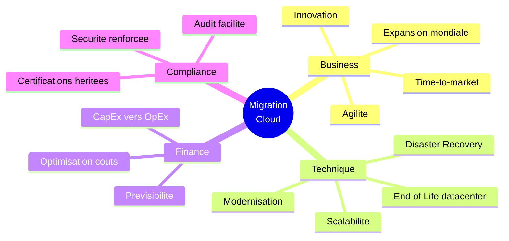

### 1.2 Signaux d'Alerte On-Premise

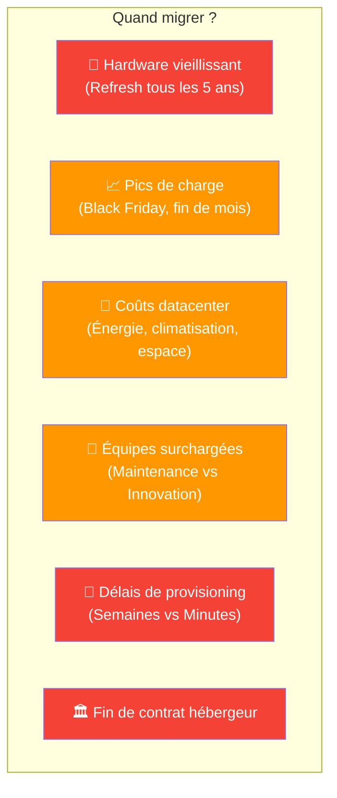

---

## 2. Les 6R de la Migration

### 2.1 Vue d'Ensemble

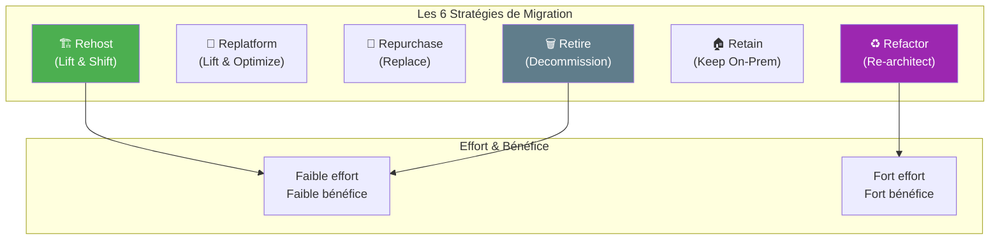

### 2.2 Détail des 6R

| Stratégie | Description | Effort | Bénéfice Cloud | Quand l'utiliser |
|-----------|-------------|--------|----------------|------------------|
| **Rehost** | Copier tel quel sur VM cloud | Faible | Faible | Migration rapide, legacy |
| **Replatform** | Quelques optimisations (DB managée) | Moyen | Moyen | Quick wins sans refonte |
| **Repurchase** | Remplacer par SaaS | Variable | Variable | Alternative SaaS existe |
| **Refactor** | Réécrire pour le cloud | Élevé | Élevé | Applications stratégiques |
| **Retain** | Garder on-premise | Nul | Nul | Contraintes réglementaires |
| **Retire** | Supprimer | Nul | Économies | Applications obsolètes |

### 2.3 Exemples Concrets

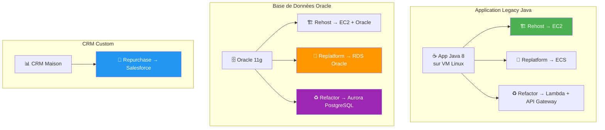

### 2.4 Arbre de Décision

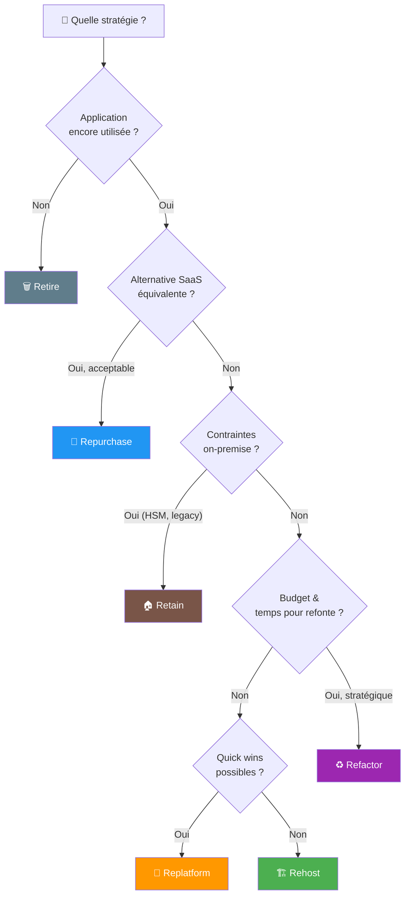

---

## 3. TCO : Calculer le Vrai Coût

### 3.1 TCO On-Premise vs Cloud

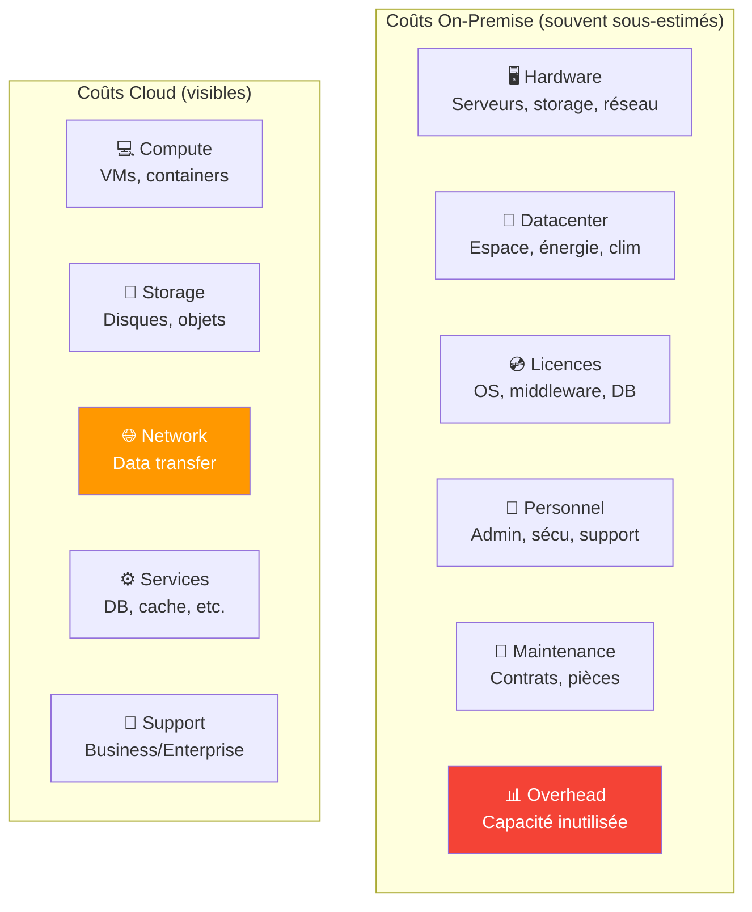

### 3.2 Éléments du TCO

| Catégorie | On-Premise | Cloud |
|-----------|------------|-------|
| **Hardware** | Achat serveurs (CapEx) | Inclus dans pricing |
| **Datacenter** | Location, énergie, clim | Inclus |
| **Licences** | À payer | Souvent incluses (BYOL option) |
| **Personnel** | Admin, sécu, support | Réduit (services managés) |
| **Overprovisioning** | 30-50% typique | Scaling dynamique |
| **Data Transfer** | Inclus/négligeable | **Attention : coût sortant** |
| **Support** | Contrats maintenance | Plans de support ($$) |

### 3.3 Pièges Courants du TCO Cloud

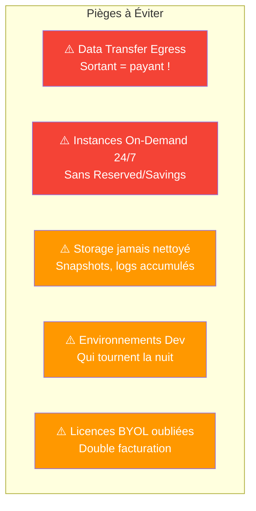

### 3.4 Outils de Calcul TCO

| Provider | Outil | URL |
|----------|-------|-----|
| **AWS** | Migration Evaluator, TCO Calculator | calculator.aws |
| **Azure** | TCO Calculator | azure.microsoft.com/pricing/tco |
| **GCP** | TCO Tool | cloud.google.com/tco |
| **Multi** | Flexera, CloudHealth | - |

---

## 4. Phases d'un Projet Migration

### 4.1 Les 5 Phases

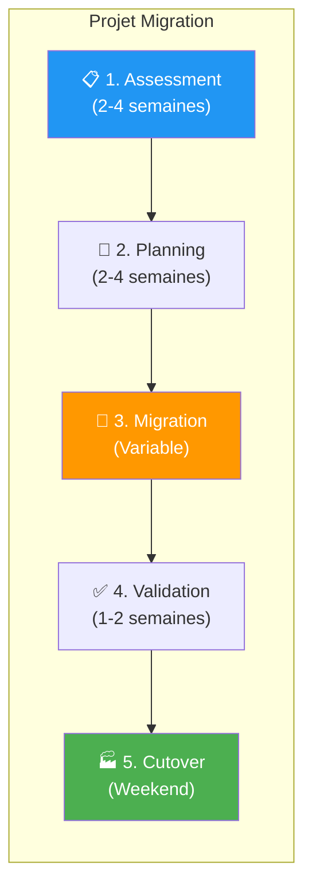

### 4.2 Phase 1 : Assessment

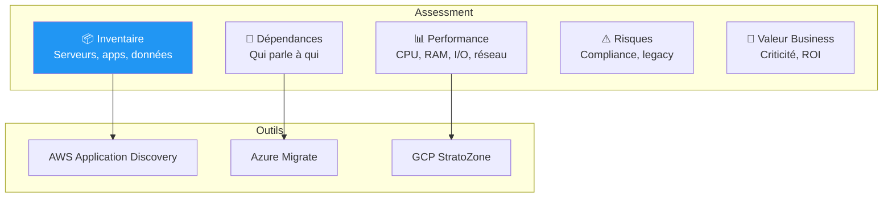

**Livrables :**
- Inventaire complet des applications
- Carte des dépendances
- Métriques de performance
- Classification par stratégie (6R)
- Business case / TCO

### 4.3 Phase 2 : Planning

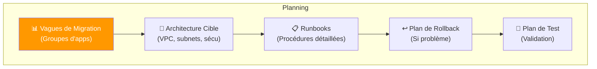

**Bonnes pratiques :**
- Commencer par des apps simples (quick wins)
- Regrouper les apps qui communiquent ensemble
- Prévoir des fenêtres de migration (weekend)
- Documenter les critères de rollback

### 4.4 Phase 3 : Migration

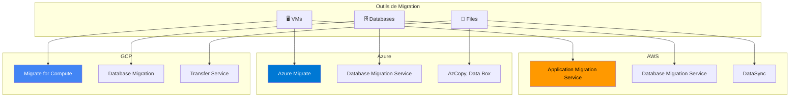

### 4.5 Phases 4 & 5 : Validation et Cutover

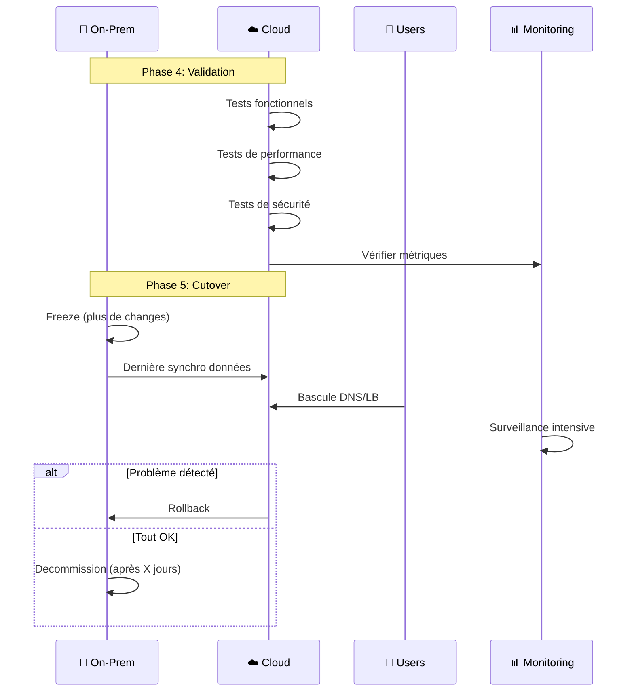

---

## 5. Risques et Pièges

### 5.1 Risques Courants

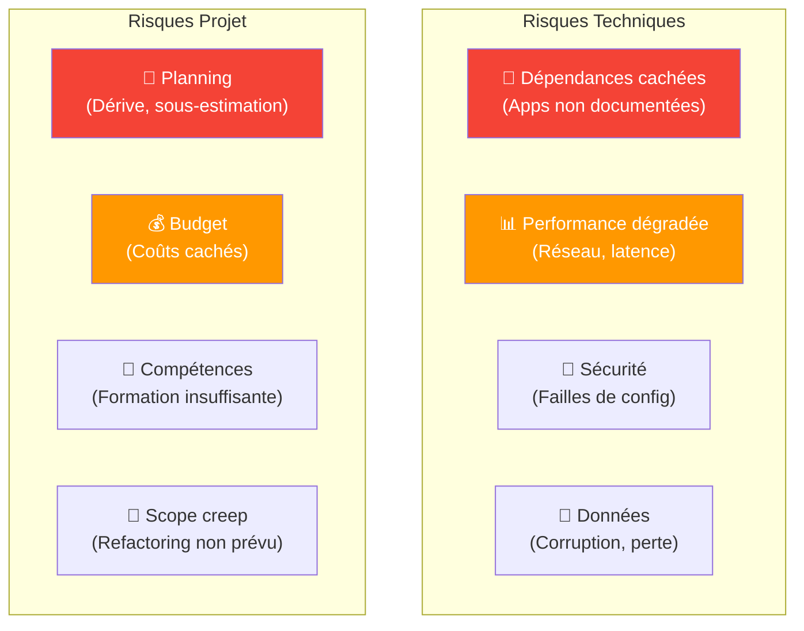

### 5.2 Erreurs Classiques

| Erreur | Impact | Mitigation |
|--------|--------|------------|
| **Lift & shift tout** | Coûts élevés, pas d'optimisation | Évaluer chaque app, replatform si possible |
| **Pas de discovery** | Dépendances cassées | Outils de discovery automatique |
| **Cutover Big Bang** | Risque élevé | Migration par vagues |
| **Pas de rollback plan** | Bloqué si problème | Toujours prévoir le retour arrière |
| **Oublier le data transfer** | Facture surprise | Estimer les coûts réseau |
| **Pas de formation** | Équipes perdues | Former avant de migrer |

### 5.3 Checklist Pré-Migration

!!! warning "Avant de Migrer"

    **Assessment**

    - [ ] Inventaire complet des applications
    - [ ] Dépendances documentées
    - [ ] Métriques de performance collectées
    - [ ] Business case validé

    **Planning**

    - [ ] Architecture cible définie
    - [ ] Vagues de migration planifiées
    - [ ] Runbooks rédigés
    - [ ] Plan de rollback testé
    - [ ] Fenêtres de migration réservées

    **Équipe**

    - [ ] Équipes formées sur le cloud cible
    - [ ] Support provider activé
    - [ ] RACI défini (qui fait quoi)

    **Sécurité**

    - [ ] IAM configuré
    - [ ] Réseau sécurisé (VPC, SG)
    - [ ] Compliance vérifiée (PCI-DSS si applicable)

---

## 6. Cas Worldline

### 6.1 Migration Progressive

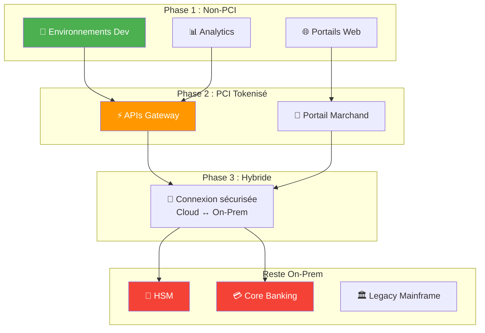

### 6.2 Critères de Succès

| KPI | Cible | Mesure |
|-----|-------|--------|
| **Disponibilité** | 99.99% | Monitoring |
| **Latence** | < 100ms (P95) | APM |
| **Coûts** | -20% vs on-prem | FinOps |
| **Time-to-deploy** | Heures vs semaines | Pipeline metrics |
| **Incidents** | -50% | Ticketing |

---

## 7. Quiz de Validation

!!! question "Question 1"
    Quelle stratégie de migration pour une app legacy qu'on veut migrer vite ?

    ??? success "Réponse"
        **Rehost (Lift & Shift)**

        - Copie de la VM telle quelle vers le cloud
        - Minimum de changements
        - Rapide à exécuter
        - Permet de fermer le datacenter vite

        Attention : ne profite pas des avantages cloud (scaling, managed services)

!!! question "Question 2"
    Quel coût cloud est souvent sous-estimé ?

    ??? success "Réponse"
        **Data Transfer Egress** (sortant)

        - Le trafic entrant est généralement gratuit
        - Le trafic **sortant** est facturé ($0.05-0.15/Go)
        - Peut représenter 10-20% de la facture

        Solutions : CDN, régions proches des utilisateurs, caching

!!! question "Question 3"
    Pourquoi commencer par des apps non-critiques ?

    ??? success "Réponse"
        **Réduire le risque et apprendre :**

        - L'équipe monte en compétence
        - On découvre les pièges sans impact business
        - On affine les runbooks
        - On valide l'architecture cible

        Les apps critiques viennent ensuite avec une équipe rodée.

!!! question "Question 4"
    Qu'est-ce qu'un plan de rollback ?

    ??? success "Réponse"
        **Procédure pour revenir en arrière** si la migration échoue :

        - Critères de déclenchement (ex: latence > 500ms)
        - Étapes de retour (DNS, sync inverse)
        - Temps estimé
        - Responsables

        Doit être testé AVANT le cutover réel.

---

## 8. Glossaire Migration

| Terme | Définition |
|-------|------------|
| **Lift & Shift** | Migration telle quelle sans modification |
| **Replatform** | Migration avec optimisations mineures |
| **Refactor** | Réécriture pour le cloud natif |
| **TCO** | Total Cost of Ownership |
| **Assessment** | Évaluation de l'existant |
| **Discovery** | Inventaire automatique |
| **Cutover** | Bascule finale vers le cloud |
| **Rollback** | Retour arrière en cas de problème |
| **Wave** | Groupe d'applications migrées ensemble |
| **Runbook** | Procédure détaillée de migration |
| **BYOL** | Bring Your Own License |

---

## 9. Pour Aller Plus Loin

### Ressources Recommandées

| Ressource | Type | Description |
|-----------|------|-------------|
| [AWS Migration Hub](https://aws.amazon.com/migration-hub/) | Service | Portail migration AWS |
| [Azure Migration Guide](https://azure.microsoft.com/migration/) | Guide | Guide complet Azure |
| [GCP Migration Center](https://cloud.google.com/migration-center) | Service | Outils migration GCP |
| [Cloud Adoption Framework](https://docs.microsoft.com/azure/cloud-adoption-framework/) | Framework | Méthodologie Microsoft |

### Outils de Discovery

| Outil | Description |
|-------|-------------|
| **AWS Application Discovery** | Agent/Agentless pour inventaire |
| **Azure Migrate** | Discovery et assessment |
| **GCP StratoZone** | Assessment on-prem |
| **Flexera** | Multi-cloud, licences |
| **Cloudamize** | Assessment détaillé |

---

## 10. Conclusion

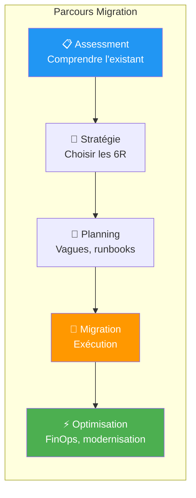

!!! success "Points Clés à Retenir"

    1. **Pas de Big Bang** : Migrer par vagues, commencer simple
    2. **Assessment d'abord** : Comprendre avant de bouger
    3. **6R pour chaque app** : Pas de stratégie unique
    4. **TCO réaliste** : Inclure tous les coûts (data transfer !)
    5. **Plan de rollback** : Toujours prévoir le retour arrière
    6. **Former les équipes** : Le cloud demande de nouvelles compétences

---

## Navigation

| Précédent | Retour au Catalogue |
|-----------|---------------------|
| [Module 10 : Data & IA/ML](10-module.md) | [Catalogue des Formations](../index.md) |
