---
tags:
  - formation
  - cloud
  - migration
  - strategie
  - tco
  - 6r
---

# Module 11 : Migration Cloud

## Objectifs du Module

A la fin de ce module, vous serez capable de :

- :fontawesome-solid-route: Comprendre les stratégies de migration (6R)
- :fontawesome-solid-calculator: Estimer un TCO (Total Cost of Ownership)
- :fontawesome-solid-map: Planifier un projet de migration
- :fontawesome-solid-triangle-exclamation: Identifier les risques et pièges
- :fontawesome-solid-check: Appliquer les bonnes pratiques Worldline

---

## 1. Pourquoi Migrer vers le Cloud ?

### 1.1 Motivations Typiques

### 1.2 Signaux d'Alerte On-Premise

```mermaid
graph TB
    subgraph "Quand migrer ?"
        S1["🔧 Hardware vieillissant<br/>(Refresh tous les 5 ans)"]
        S2["📈 Pics de charge<br/>(Black Friday, fin de mois)"]
        S3["💸 Coûts datacenter<br/>(Énergie, climatisation, espace)"]
        S4["👥 Équipes surchargées<br/>(Maintenance vs Innovation)"]
        S5["🐌 Délais de provisioning<br/>(Semaines vs Minutes)"]
        S6["🏛️ Fin de contrat hébergeur"]
    end

    style S1 fill:#f44336,color:#fff
    style S2 fill:#ff9800,color:#fff
    style S3 fill:#ff9800,color:#fff
    style S4 fill:#ff9800,color:#fff
    style S5 fill:#f44336,color:#fff
    style S6 fill:#f44336,color:#fff
```

---

## 2. Les 6R de la Migration

### 2.1 Vue d'Ensemble

```mermaid
graph TB
    subgraph "Les 6 Stratégies de Migration"
        REHOST["🏗️ Rehost<br/>(Lift & Shift)"]
        REPLATFORM["🔄 Replatform<br/>(Lift & Optimize)"]
        REPURCHASE["🛒 Repurchase<br/>(Replace)"]
        REFACTOR["♻️ Refactor<br/>(Re-architect)"]
        RETAIN["🏠 Retain<br/>(Keep On-Prem)"]
        RETIRE["🗑️ Retire<br/>(Decommission)"]
    end

    subgraph "Effort & Bénéfice"
        LOW["Faible effort<br/>Faible bénéfice"]
        HIGH["Fort effort<br/>Fort bénéfice"]
    end

    REHOST --> LOW
    RETIRE --> LOW
    REFACTOR --> HIGH

    style REHOST fill:#4caf50,color:#fff
    style REFACTOR fill:#9c27b0,color:#fff
    style RETIRE fill:#607d8b,color:#fff
```

### 2.2 Détail des 6R

| Stratégie | Description | Effort | Bénéfice Cloud | Quand l'utiliser |
|-----------|-------------|--------|----------------|------------------|
| **Rehost** | Copier tel quel sur VM cloud | Faible | Faible | Migration rapide, legacy |
| **Replatform** | Quelques optimisations (DB managée) | Moyen | Moyen | Quick wins sans refonte |
| **Repurchase** | Remplacer par SaaS | Variable | Variable | Alternative SaaS existe |
| **Refactor** | Réécrire pour le cloud | Élevé | Élevé | Applications stratégiques |
| **Retain** | Garder on-premise | Nul | Nul | Contraintes réglementaires |
| **Retire** | Supprimer | Nul | Économies | Applications obsolètes |

### 2.3 Exemples Concrets

```mermaid
graph TB
    subgraph "Application Legacy Java"
        APP1["☕ App Java 8<br/>sur VM Linux"]
        R1["🏗️ Rehost → EC2"]
        R1B["🔄 Replatform → ECS"]
        R1C["♻️ Refactor → Lambda + API Gateway"]
    end

    subgraph "Base de Données Oracle"
        APP2["🗄️ Oracle 11g"]
        R2["🏗️ Rehost → EC2 + Oracle"]
        R2B["🔄 Replatform → RDS Oracle"]
        R2C["♻️ Refactor → Aurora PostgreSQL"]
    end

    subgraph "CRM Custom"
        APP3["📊 CRM Maison"]
        R3["🛒 Repurchase → Salesforce"]
    end

    APP1 --> R1
    APP1 --> R1B
    APP1 --> R1C
    APP2 --> R2
    APP2 --> R2B
    APP2 --> R2C
    APP3 --> R3

    style R1 fill:#4caf50,color:#fff
    style R2B fill:#ff9800,color:#fff
    style R2C fill:#9c27b0,color:#fff
    style R3 fill:#2196f3,color:#fff
```

### 2.4 Arbre de Décision

---

## 3. TCO : Calculer le Vrai Coût

### 3.1 TCO On-Premise vs Cloud

```mermaid
graph TB
    subgraph "Coûts On-Premise (souvent sous-estimés)"
        HW["🖥️ Hardware<br/>Serveurs, storage, réseau"]
        DC["🏢 Datacenter<br/>Espace, énergie, clim"]
        SW["💿 Licences<br/>OS, middleware, DB"]
        STAFF["👥 Personnel<br/>Admin, sécu, support"]
        MAINT["🔧 Maintenance<br/>Contrats, pièces"]
        OVER["📊 Overhead<br/>Capacité inutilisée"]
    end

    subgraph "Coûts Cloud (visibles)"
        COMPUTE["💻 Compute<br/>VMs, containers"]
        STORAGE["💾 Storage<br/>Disques, objets"]
        NETWORK["🌐 Network<br/>Data transfer"]
        SERVICES["⚙️ Services<br/>DB, cache, etc."]
        SUPPORT["🎫 Support<br/>Business/Enterprise"]
    end

    style OVER fill:#f44336,color:#fff
    style NETWORK fill:#ff9800,color:#fff
```

### 3.2 Éléments du TCO

| Catégorie | On-Premise | Cloud |
|-----------|------------|-------|
| **Hardware** | Achat serveurs (CapEx) | Inclus dans pricing |
| **Datacenter** | Location, énergie, clim | Inclus |
| **Licences** | À payer | Souvent incluses (BYOL option) |
| **Personnel** | Admin, sécu, support | Réduit (services managés) |
| **Overprovisioning** | 30-50% typique | Scaling dynamique |
| **Data Transfer** | Inclus/négligeable | **Attention : coût sortant** |
| **Support** | Contrats maintenance | Plans de support ($$) |

### 3.3 Pièges Courants du TCO Cloud

```mermaid
graph TB
    subgraph "Pièges à Éviter"
        TRAP1["⚠️ Data Transfer Egress<br/>Sortant = payant !"]
        TRAP2["⚠️ Instances On-Demand 24/7<br/>Sans Reserved/Savings"]
        TRAP3["⚠️ Storage jamais nettoyé<br/>Snapshots, logs accumulés"]
        TRAP4["⚠️ Environnements Dev<br/>Qui tournent la nuit"]
        TRAP5["⚠️ Licences BYOL oubliées<br/>Double facturation"]
    end

    style TRAP1 fill:#f44336,color:#fff
    style TRAP2 fill:#f44336,color:#fff
    style TRAP3 fill:#ff9800,color:#fff
    style TRAP4 fill:#ff9800,color:#fff
    style TRAP5 fill:#ff9800,color:#fff
```

### 3.4 Outils de Calcul TCO

| Provider | Outil | URL |
|----------|-------|-----|
| **AWS** | Migration Evaluator, TCO Calculator | calculator.aws |
| **Azure** | TCO Calculator | azure.microsoft.com/pricing/tco |
| **GCP** | TCO Tool | cloud.google.com/tco |
| **Multi** | Flexera, CloudHealth | - |

---

## 4. Phases d'un Projet Migration

### 4.1 Les 5 Phases

```mermaid
graph LR
    subgraph "Projet Migration"
        P1["📋 1. Assessment<br/>(2-4 semaines)"]
        P2["📐 2. Planning<br/>(2-4 semaines)"]
        P3["🔨 3. Migration<br/>(Variable)"]
        P4["✅ 4. Validation<br/>(1-2 semaines)"]
        P5["🏭 5. Cutover<br/>(Weekend)"]
    end

    P1 --> P2 --> P3 --> P4 --> P5

    style P1 fill:#2196f3,color:#fff
    style P3 fill:#ff9800,color:#fff
    style P5 fill:#4caf50,color:#fff
```

### 4.2 Phase 1 : Assessment

```mermaid
graph TB
    subgraph "Assessment"
        INV["📦 Inventaire<br/>Serveurs, apps, données"]
        DEP["🔗 Dépendances<br/>Qui parle à qui"]
        PERF["📊 Performance<br/>CPU, RAM, I/O, réseau"]
        RISK["⚠️ Risques<br/>Compliance, legacy"]
        BUS["💼 Valeur Business<br/>Criticité, ROI"]
    end

    subgraph "Outils"
        TOOL1["AWS Application Discovery"]
        TOOL2["Azure Migrate"]
        TOOL3["GCP StratoZone"]
    end

    INV --> TOOL1
    DEP --> TOOL2
    PERF --> TOOL3

    style INV fill:#2196f3,color:#fff
```

**Livrables :**
- Inventaire complet des applications
- Carte des dépendances
- Métriques de performance
- Classification par stratégie (6R)
- Business case / TCO

### 4.3 Phase 2 : Planning

```mermaid
graph TB
    subgraph "Planning"
        WAVE["📊 Vagues de Migration<br/>(Groupes d'apps)"]
        ARCH["📐 Architecture Cible<br/>(VPC, subnets, sécu)"]
        RUNBOOK["📋 Runbooks<br/>(Procédures détaillées)"]
        ROLLBACK["↩️ Plan de Rollback<br/>(Si problème)"]
        TEST["🧪 Plan de Test<br/>(Validation)"]
    end

    WAVE --> ARCH --> RUNBOOK --> ROLLBACK --> TEST

    style WAVE fill:#ff9800,color:#fff
```

**Bonnes pratiques :**
- Commencer par des apps simples (quick wins)
- Regrouper les apps qui communiquent ensemble
- Prévoir des fenêtres de migration (weekend)
- Documenter les critères de rollback

### 4.4 Phase 3 : Migration

### 4.5 Phases 4 & 5 : Validation et Cutover

```mermaid
sequenceDiagram
    participant Source as 🏢 On-Prem
    participant Cloud as ☁️ Cloud
    participant Users as 👥 Users
    participant Monitor as 📊 Monitoring

    Note over Source,Cloud: Phase 4: Validation
    Cloud->>Cloud: Tests fonctionnels
    Cloud->>Cloud: Tests de performance
    Cloud->>Cloud: Tests de sécurité
    Cloud->>Monitor: Vérifier métriques

    Note over Source,Cloud: Phase 5: Cutover
    Source->>Source: Freeze (plus de changes)
    Source->>Cloud: Dernière synchro données
    Users->>Cloud: Bascule DNS/LB
    Monitor->>Monitor: Surveillance intensive

    alt Problème détecté
        Cloud->>Source: Rollback
    else Tout OK
        Source->>Source: Decommission (après X jours)
    end
```

---

## 5. Risques et Pièges

### 5.1 Risques Courants

```mermaid
graph TB
    subgraph "Risques Techniques"
        R1["🔗 Dépendances cachées<br/>(Apps non documentées)"]
        R2["📊 Performance dégradée<br/>(Réseau, latence)"]
        R3["🔐 Sécurité<br/>(Failles de config)"]
        R4["💾 Données<br/>(Corruption, perte)"]
    end

    subgraph "Risques Projet"
        R5["📅 Planning<br/>(Dérive, sous-estimation)"]
        R6["💰 Budget<br/>(Coûts cachés)"]
        R7["👥 Compétences<br/>(Formation insuffisante)"]
        R8["🔄 Scope creep<br/>(Refactoring non prévu)"]
    end

    style R1 fill:#f44336,color:#fff
    style R2 fill:#ff9800,color:#fff
    style R5 fill:#f44336,color:#fff
    style R6 fill:#ff9800,color:#fff
```

### 5.2 Erreurs Classiques

| Erreur | Impact | Mitigation |
|--------|--------|------------|
| **Lift & shift tout** | Coûts élevés, pas d'optimisation | Évaluer chaque app, replatform si possible |
| **Pas de discovery** | Dépendances cassées | Outils de discovery automatique |
| **Cutover Big Bang** | Risque élevé | Migration par vagues |
| **Pas de rollback plan** | Bloqué si problème | Toujours prévoir le retour arrière |
| **Oublier le data transfer** | Facture surprise | Estimer les coûts réseau |
| **Pas de formation** | Équipes perdues | Former avant de migrer |

### 5.3 Checklist Pré-Migration

!!! warning "Avant de Migrer"

    **Assessment**

    - [ ] Inventaire complet des applications
    - [ ] Dépendances documentées
    - [ ] Métriques de performance collectées
    - [ ] Business case validé

    **Planning**

    - [ ] Architecture cible définie
    - [ ] Vagues de migration planifiées
    - [ ] Runbooks rédigés
    - [ ] Plan de rollback testé
    - [ ] Fenêtres de migration réservées

    **Équipe**

    - [ ] Équipes formées sur le cloud cible
    - [ ] Support provider activé
    - [ ] RACI défini (qui fait quoi)

    **Sécurité**

    - [ ] IAM configuré
    - [ ] Réseau sécurisé (VPC, SG)
    - [ ] Compliance vérifiée (PCI-DSS si applicable)

---

## 6. Cas Worldline

### 6.1 Migration Progressive

```mermaid
graph TB
    subgraph "Phase 1 : Non-PCI"
        DEV["🔧 Environnements Dev"]
        ANALYTICS["📊 Analytics"]
        PORTALS["🌐 Portails Web"]
    end

    subgraph "Phase 2 : PCI Tokenisé"
        API["⚡ APIs Gateway"]
        MERCHANT["🏪 Portail Marchand"]
    end

    subgraph "Phase 3 : Hybride"
        HYBRID["🔀 Connexion sécurisée<br/>Cloud ↔ On-Prem"]
    end

    subgraph "Reste On-Prem"
        HSM["🔐 HSM"]
        CORE["💳 Core Banking"]
        LEGACY["🏛️ Legacy Mainframe"]
    end

    DEV --> API
    ANALYTICS --> API
    PORTALS --> MERCHANT
    API --> HYBRID
    MERCHANT --> HYBRID
    HYBRID --> HSM
    HYBRID --> CORE

    style DEV fill:#4caf50,color:#fff
    style API fill:#ff9800,color:#fff
    style HSM fill:#f44336,color:#fff
    style CORE fill:#f44336,color:#fff
```

### 6.2 Critères de Succès

| KPI | Cible | Mesure |
|-----|-------|--------|
| **Disponibilité** | 99.99% | Monitoring |
| **Latence** | < 100ms (P95) | APM |
| **Coûts** | -20% vs on-prem | FinOps |
| **Time-to-deploy** | Heures vs semaines | Pipeline metrics |
| **Incidents** | -50% | Ticketing |

---

## 7. Quiz de Validation

!!! question "Question 1"
    Quelle stratégie de migration pour une app legacy qu'on veut migrer vite ?

    ??? success "Réponse"
        **Rehost (Lift & Shift)**

        - Copie de la VM telle quelle vers le cloud
        - Minimum de changements
        - Rapide à exécuter
        - Permet de fermer le datacenter vite

        Attention : ne profite pas des avantages cloud (scaling, managed services)

!!! question "Question 2"
    Quel coût cloud est souvent sous-estimé ?

    ??? success "Réponse"
        **Data Transfer Egress** (sortant)

        - Le trafic entrant est généralement gratuit
        - Le trafic **sortant** est facturé ($0.05-0.15/Go)
        - Peut représenter 10-20% de la facture

        Solutions : CDN, régions proches des utilisateurs, caching

!!! question "Question 3"
    Pourquoi commencer par des apps non-critiques ?

    ??? success "Réponse"
        **Réduire le risque et apprendre :**

        - L'équipe monte en compétence
        - On découvre les pièges sans impact business
        - On affine les runbooks
        - On valide l'architecture cible

        Les apps critiques viennent ensuite avec une équipe rodée.

!!! question "Question 4"
    Qu'est-ce qu'un plan de rollback ?

    ??? success "Réponse"
        **Procédure pour revenir en arrière** si la migration échoue :

        - Critères de déclenchement (ex: latence > 500ms)
        - Étapes de retour (DNS, sync inverse)
        - Temps estimé
        - Responsables

        Doit être testé AVANT le cutover réel.

---

## 8. Glossaire Migration

| Terme | Définition |
|-------|------------|
| **Lift & Shift** | Migration telle quelle sans modification |
| **Replatform** | Migration avec optimisations mineures |
| **Refactor** | Réécriture pour le cloud natif |
| **TCO** | Total Cost of Ownership |
| **Assessment** | Évaluation de l'existant |
| **Discovery** | Inventaire automatique |
| **Cutover** | Bascule finale vers le cloud |
| **Rollback** | Retour arrière en cas de problème |
| **Wave** | Groupe d'applications migrées ensemble |
| **Runbook** | Procédure détaillée de migration |
| **BYOL** | Bring Your Own License |

---

## 9. Pour Aller Plus Loin

### Ressources Recommandées

| Ressource | Type | Description |
|-----------|------|-------------|
| [AWS Migration Hub](https://aws.amazon.com/migration-hub/) | Service | Portail migration AWS |
| [Azure Migration Guide](https://azure.microsoft.com/migration/) | Guide | Guide complet Azure |
| [GCP Migration Center](https://cloud.google.com/migration-center) | Service | Outils migration GCP |
| [Cloud Adoption Framework](https://docs.microsoft.com/azure/cloud-adoption-framework/) | Framework | Méthodologie Microsoft |

### Outils de Discovery

| Outil | Description |
|-------|-------------|
| **AWS Application Discovery** | Agent/Agentless pour inventaire |
| **Azure Migrate** | Discovery et assessment |
| **GCP StratoZone** | Assessment on-prem |
| **Flexera** | Multi-cloud, licences |
| **Cloudamize** | Assessment détaillé |

---

## 10. Conclusion

```mermaid
graph LR
    subgraph "Parcours Migration"
        ASSESS["📋 Assessment<br/>Comprendre l'existant"]
        STRAT["🎯 Stratégie<br/>Choisir les 6R"]
        PLAN["📐 Planning<br/>Vagues, runbooks"]
        MIGRATE["🚀 Migration<br/>Exécution"]
        OPTIMIZE["⚡ Optimisation<br/>FinOps, modernisation"]
    end

    ASSESS --> STRAT --> PLAN --> MIGRATE --> OPTIMIZE

    style ASSESS fill:#2196f3,color:#fff
    style MIGRATE fill:#ff9800,color:#fff
    style OPTIMIZE fill:#4caf50,color:#fff
```

!!! success "Points Clés à Retenir"

    1. **Pas de Big Bang** : Migrer par vagues, commencer simple
    2. **Assessment d'abord** : Comprendre avant de bouger
    3. **6R pour chaque app** : Pas de stratégie unique
    4. **TCO réaliste** : Inclure tous les coûts (data transfer !)
    5. **Plan de rollback** : Toujours prévoir le retour arrière
    6. **Former les équipes** : Le cloud demande de nouvelles compétences

---

## Navigation

| Précédent | Retour au Catalogue |
|-----------|---------------------|
| [Module 10 : Data & IA/ML](10-module.md) | [Catalogue des Formations](../index.md) |
