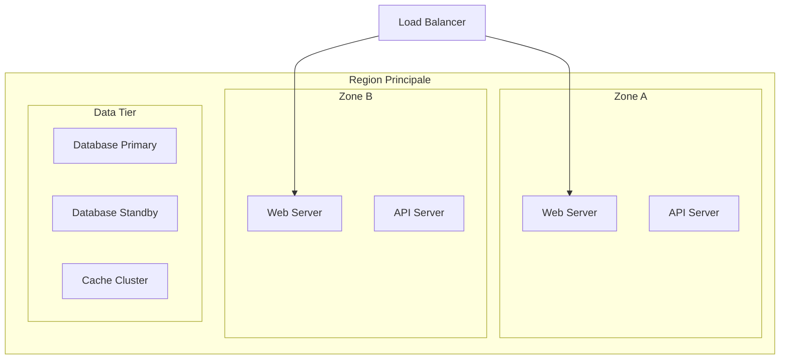

---
tags:
  - formation
  - cloud
  - tp
  - architecture
---

# TP Final : Étude de Cas - Migration Cloud d'une Application Métier

## Objectifs

À la fin de ce TP, vous aurez validé les compétences suivantes :

- Analyser une architecture on-premise et identifier les composants cloud équivalents
- Choisir le modèle de service approprié (IaaS, PaaS, SaaS) pour chaque composant
- Concevoir une architecture cloud haute disponibilité
- Estimer les coûts et proposer des optimisations FinOps
- Identifier les enjeux de sécurité et conformité (PCI-DSS)
- Comparer les solutions AWS, Azure et GCP

**Durée :** 3 heures

---

## Contexte

Vous êtes consultant Cloud chez un intégrateur partenaire de Worldline. Un client du secteur e-commerce vous sollicite pour étudier la migration de son application de paiement vers le cloud.

### Situation Actuelle

L'application "PayShop" est actuellement hébergée dans un datacenter privé :

```
┌─────────────────────────────────────────────────────────────────────┐
│                    DATACENTER ON-PREMISE                             │
│                                                                      │
│  ┌──────────┐   ┌──────────┐   ┌──────────┐   ┌──────────┐        │
│  │   LB     │   │  Web x2  │   │  API x3  │   │  BDD x2  │        │
│  │  F5      │──▶│  Apache  │──▶│  Java    │──▶│ Oracle   │        │
│  └──────────┘   └──────────┘   └──────────┘   └──────────┘        │
│                                      │                              │
│                                      ▼                              │
│                              ┌──────────┐                          │
│                              │  Redis   │                          │
│                              │  Cache   │                          │
│                              └──────────┘                          │
│                                                                      │
│  Stockage : SAN 50 To    │    Backup : Bandes LTO                  │
│  Réseau : 10 Gbps        │    DR : Datacenter secondaire          │
└─────────────────────────────────────────────────────────────────────┘
```

### Chiffres Clés

| Métrique | Valeur |
|----------|--------|
| Transactions/jour | 500 000 |
| Utilisateurs concurrent max | 10 000 |
| Volume de données | 50 To |
| RPO (Recovery Point Objective) | 1 heure |
| RTO (Recovery Time Objective) | 4 heures |
| Budget IT annuel | 1,2 M€ |
| Certification requise | PCI-DSS niveau 1 |

### Problématiques du Client

1. **Coûts** : Renouvellement hardware prévu (800 K€)
2. **Scalabilité** : Pics de charge pendant les soldes (x5)
3. **Agilité** : Time-to-market trop long pour nouvelles fonctionnalités
4. **Disaster Recovery** : Datacenter DR sous-utilisé et coûteux

---

## Cahier des Charges

### Partie 1 : Analyse et Mapping Cloud (45 min)

**Objectif :** Identifier les services cloud équivalents pour chaque composant.

#### 1.1 Tableau de Correspondance

Complétez le tableau suivant pour **chaque provider** (AWS, Azure, GCP) :

| Composant On-Premise | Modèle Cloud | AWS | Azure | GCP |
|---------------------|--------------|-----|-------|-----|
| Load Balancer F5 | ? | ? | ? | ? |
| Serveurs Web Apache | ? | ? | ? | ? |
| Serveurs API Java | ? | ? | ? | ? |
| Base de données Oracle | ? | ? | ? | ? |
| Cache Redis | ? | ? | ? | ? |
| Stockage SAN | ? | ? | ? | ? |
| Backup | ? | ? | ? | ? |

#### 1.2 Choix du Modèle de Service

Pour chaque composant, justifiez le choix entre IaaS et PaaS :

| Composant | Recommandation | Justification |
|-----------|----------------|---------------|
| Web | IaaS / PaaS ? | ... |
| API | IaaS / PaaS ? | ... |
| Database | IaaS / PaaS ? | ... |
| Cache | IaaS / PaaS ? | ... |

---

### Partie 2 : Architecture Cloud Cible (1h)

**Objectif :** Concevoir une architecture cloud haute disponibilité.

#### 2.1 Diagramme d'Architecture

Dessinez l'architecture cible en incluant :

- Minimum 2 zones de disponibilité
- Réseau privé (VPC/VNet)
- Segmentation des sous-réseaux (public, privé, data)
- Points d'accès sécurisés
- Solution de backup et DR

**Template Mermaid à compléter :**



#### 2.2 Haute Disponibilité

Répondez aux questions suivantes :

1. **Comment garantir le RPO de 1 heure ?**
   - Solution de réplication proposée :
   - Fréquence des backups :

2. **Comment garantir le RTO de 4 heures ?**
   - Stratégie de failover :
   - Tests de DR prévus :

3. **Comment gérer les pics de charge x5 ?**
   - Mécanisme d'auto-scaling :
   - Métriques de déclenchement :

#### 2.3 Sécurité et Conformité PCI-DSS

Identifiez les mesures à mettre en place pour chaque exigence :

| Exigence PCI-DSS | Mesure Cloud |
|------------------|--------------|
| Chiffrement des données au repos | ? |
| Chiffrement en transit | ? |
| Gestion des accès (IAM) | ? |
| Journalisation des accès | ? |
| Segmentation réseau | ? |
| Protection contre les intrusions | ? |

---

### Partie 3 : Estimation des Coûts (45 min)

**Objectif :** Calculer le TCO et proposer des optimisations.

#### 3.1 Estimation Mensuelle

Utilisez les calculateurs officiels pour estimer les coûts :

- [AWS Pricing Calculator](https://calculator.aws/)
- [Azure Pricing Calculator](https://azure.microsoft.com/pricing/calculator/)
- [GCP Pricing Calculator](https://cloud.google.com/products/calculator)

**Hypothèses de sizing :**

| Ressource | Spécifications |
|-----------|----------------|
| Web Servers | 2x vCPU, 4 Go RAM |
| API Servers | 4x vCPU, 8 Go RAM |
| Database | 8x vCPU, 32 Go RAM, 500 Go SSD |
| Cache | 2 nœuds, 6 Go RAM |
| Stockage | 50 To |
| Réseau | 10 To/mois sortant |

**Tableau comparatif à compléter :**

| Poste | AWS | Azure | GCP |
|-------|-----|-------|-----|
| Compute | $ | $ | $ |
| Database | $ | $ | $ |
| Storage | $ | $ | $ |
| Network | $ | $ | $ |
| Support | $ | $ | $ |
| **Total mensuel** | $ | $ | $ |
| **Total annuel** | $ | $ | $ |

#### 3.2 Optimisations FinOps

Proposez des optimisations pour réduire les coûts de 20% :

| Optimisation | Économie estimée | Risque/Impact |
|--------------|------------------|---------------|
| Reserved Instances | ? % | ? |
| Spot Instances (batch jobs) | ? % | ? |
| Rightsizing | ? % | ? |
| Storage tiering | ? % | ? |

#### 3.3 Comparaison TCO 3 ans

| Scénario | Année 1 | Année 2 | Année 3 | Total |
|----------|---------|---------|---------|-------|
| On-Premise (statu quo) | 400 K€ + 800 K€ HW | 400 K€ | 400 K€ | 2 M€ |
| Cloud AWS | ? | ? | ? | ? |
| Cloud Azure | ? | ? | ? | ? |
| Cloud GCP | ? | ? | ? | ? |

---

### Partie 4 : Stratégie de Migration (30 min)

**Objectif :** Définir le plan de migration selon les 6R.

#### 4.1 Classification des Composants

Pour chaque composant, identifiez la stratégie de migration :

| Composant | Stratégie 6R | Justification |
|-----------|--------------|---------------|
| Load Balancer | Replatform | Service managé cloud |
| Serveurs Web | ? | ? |
| API Java | ? | ? |
| Oracle DB | ? | ? |
| Redis Cache | ? | ? |
| Stockage | ? | ? |

**Rappel des 6R :**

- **Rehost** : Lift & Shift (IaaS)
- **Replatform** : Lift, Tinker & Shift (PaaS léger)
- **Repurchase** : Remplacer par SaaS
- **Refactor** : Rearchitecture cloud-native
- **Retire** : Décommissionner
- **Retain** : Garder on-premise

#### 4.2 Planning de Migration

Proposez un planning en phases :

| Phase | Durée | Composants | Actions |
|-------|-------|------------|---------|
| Phase 1 | ? semaines | ? | ? |
| Phase 2 | ? semaines | ? | ? |
| Phase 3 | ? semaines | ? | ? |
| Phase 4 | ? semaines | ? | ? |

---

## Livrables Attendus

- [ ] Tableau de mapping composants → services cloud (3 providers)
- [ ] Diagramme d'architecture cloud cible
- [ ] Analyse de conformité PCI-DSS
- [ ] Estimation des coûts comparée (AWS, Azure, GCP)
- [ ] Plan d'optimisation FinOps
- [ ] Stratégie de migration avec planning
- [ ] Recommandation finale avec justification

---

## Critères d'Évaluation

| Critère | Points |
|---------|--------|
| Mapping composants/services cloud complet et correct | /3 |
| Architecture cible respectant HA et DR | /4 |
| Analyse sécurité et conformité PCI-DSS | /3 |
| Estimation des coûts réaliste et comparée | /3 |
| Propositions d'optimisation FinOps pertinentes | /2 |
| Stratégie de migration cohérente (6R) | /3 |
| Qualité de la présentation et des justifications | /2 |
| **Total** | **/20** |

---

## Présentation Orale (Optionnel)

Si réalisé en groupe, préparez une présentation de 15 minutes :

1. **Contexte et enjeux** (2 min)
2. **Architecture proposée** (5 min)
3. **Analyse des coûts** (3 min)
4. **Plan de migration** (3 min)
5. **Recommandation finale** (2 min)

---

## Ressources

- [Module 1 - Qu'est-ce que le Cloud ?](01-module.md)
- [Module 2 - Modèles de Service](02-module.md)
- [Module 3 - Infrastructure Cloud](03-module.md)
- [Module 4 - Sécurité & Conformité](04-module.md)
- [Module 5 - Architecture Cloud](05-module.md)
- [Module 6 - FinOps & Coûts](06-module.md)
- [Module 11 - Migration Cloud](11-module.md)
- [Glossaire](glossaire.md)
- [Fiches Mémo](fiches-memo.md)

---

## Annexe : Grille de Réponses Type

### A1 - Mapping Services (Exemple)

| Composant | Modèle | AWS | Azure | GCP |
|-----------|--------|-----|-------|-----|
| Load Balancer | PaaS | ALB/NLB | Azure LB | Cloud Load Balancing |
| Web Apache | IaaS/PaaS | EC2 / ECS | VM / App Service | Compute Engine / Cloud Run |
| API Java | PaaS | ECS / EKS | AKS / App Service | GKE / Cloud Run |
| Oracle DB | PaaS | RDS Oracle | Azure SQL | Cloud SQL (PostgreSQL) |
| Redis | PaaS | ElastiCache | Azure Cache for Redis | Memorystore |
| Stockage | PaaS | S3 / EBS | Blob Storage | Cloud Storage |
| Backup | PaaS | AWS Backup | Azure Backup | Cloud Backup |

---

**Précédent :** [Module 11 - Migration Cloud](11-module.md)

**Retour au programme :** [Index](index.md)
