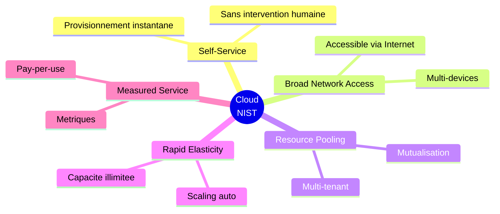

---
tags:
  - formation
  - cloud
  - memo
  - reference
  - cheatsheet
---

# Fiches Mémo Cloud Fundamentals

Fiches de révision rapide pour retenir l'essentiel de la formation.

---

## Fiche 1 : Les 5 Caractéristiques NIST



!!! tip "Mnémotechnique"
    **S**elf - **B**road - **R**esource - **R**apid - **M**easured = **SBRRM** ("Super Bien, Rapide, Rapide, Magnifique")

---

## Fiche 2 : IaaS vs PaaS vs SaaS

| Modèle | Vous gérez | Provider gère | Exemple |
|--------|------------|---------------|---------|
| **IaaS** | App, Data, Runtime, OS | Infra, Réseau, Virtualisation | EC2, Azure VM |
| **PaaS** | App, Data | Tout le reste | App Service, Cloud Run |
| **SaaS** | Configuration | Tout | Office 365, Salesforce |

```
Plus d'abstraction →
IaaS ────────────► PaaS ────────────► SaaS
← Plus de contrôle
```

---

## Fiche 3 : Responsabilité Partagée

```
┌─────────────────────────────────────────────────┐
│              TOUJOURS CLIENT                     │
│  • Données                                       │
│  • Identités & Accès                            │
│  • Configuration                                 │
├─────────────────────────────────────────────────┤
│           DÉPEND DU MODÈLE                       │
│  • Application (IaaS, PaaS: client)             │
│  • OS (IaaS: client, PaaS: provider)            │
├─────────────────────────────────────────────────┤
│              TOUJOURS PROVIDER                   │
│  • Infrastructure physique                       │
│  • Réseau backbone                               │
│  • Datacenters                                   │
└─────────────────────────────────────────────────┘
```

!!! danger "À retenir"
    **La sécurité DES données est TOUJOURS votre responsabilité !**

---

## Fiche 4 : Les 6R de Migration

| R | Stratégie | Action | Effort | Usage |
|---|-----------|--------|--------|-------|
| 1 | **Rehost** | Lift & Shift | Faible | Migration rapide |
| 2 | **Replatform** | Lift & Optimize | Moyen | Quick wins |
| 3 | **Repurchase** | Remplacer par SaaS | Variable | Alternative existe |
| 4 | **Refactor** | Réécrire cloud-native | Élevé | Apps stratégiques |
| 5 | **Retain** | Garder on-prem | Nul | Contraintes |
| 6 | **Retire** | Supprimer | Nul | Obsolète |

---

## Fiche 5 : HA / DR Essentiels

### SLA Courants

| SLA | Downtime/an | Downtime/mois |
|-----|-------------|---------------|
| 99% | 3.65 jours | 7.3 heures |
| 99.9% | 8.76 heures | 43 minutes |
| 99.99% | 52 minutes | 4.4 minutes |
| 99.999% | 5 minutes | 26 secondes |

### RPO vs RTO

```
         ◄───── RPO ─────►◄───── RTO ─────►
Dernier                                    Reprise
Backup ──────────────── INCIDENT ──────────────── OK
              Données                  Temps
              perdues                  d'arrêt
```

---

## Fiche 6 : Équivalences Multi-Cloud

| Service | AWS | Azure | GCP |
|---------|-----|-------|-----|
| **VM** | EC2 | Virtual Machines | Compute Engine |
| **Kubernetes** | EKS | AKS | GKE |
| **Serverless** | Lambda | Functions | Cloud Functions |
| **Object Storage** | S3 | Blob Storage | Cloud Storage |
| **SQL DB** | RDS | SQL Database | Cloud SQL |
| **NoSQL** | DynamoDB | Cosmos DB | Firestore |
| **Container Registry** | ECR | ACR | GCR |
| **Load Balancer** | ALB/NLB | Load Balancer | Cloud LB |
| **CDN** | CloudFront | CDN | Cloud CDN |
| **DNS** | Route 53 | DNS | Cloud DNS |
| **IAM** | IAM | Entra ID | IAM |
| **Key Vault** | KMS | Key Vault | Cloud KMS |
| **ML Platform** | SageMaker | Azure ML | Vertex AI |

---

## Fiche 7 : FinOps Quick Wins

### Optimisations Rapides

| Action | Économie | Effort |
|--------|----------|--------|
| Arrêt VMs Dev nuit/weekend | -65% sur Dev | Faible |
| Right-sizing (CPU < 20%) | -30-50% | Moyen |
| Reserved Instances (1 an) | -30-40% | Faible |
| Supprimer orphelins (IPs, disques) | -5-15% | Faible |
| Storage tiering (Glacier) | -50-80% storage | Moyen |

### Tags Essentiels

```yaml
Environment: prod | staging | dev
Team: payment | fraud | mobile
Project: phoenix | atlas
Owner: marie.dupont@worldline.com
CostCenter: CC-1234
```

---

## Fiche 8 : Sécurité Checklist

### IAM

- [ ] MFA sur tous les comptes humains
- [ ] Pas de clés API en dur dans le code
- [ ] Principe du moindre privilège
- [ ] Rotation des credentials

### Réseau

- [ ] Resources sensibles en subnet privé
- [ ] Security Groups restrictifs
- [ ] WAF devant les apps web
- [ ] VPN pour accès admin

### Données

- [ ] Chiffrement at rest activé
- [ ] TLS 1.2+ partout
- [ ] Backups chiffrés
- [ ] Pas de données sensibles dans les logs

---

## Fiche 9 : Kubernetes Essentiel

### Concepts Clés

```
Cluster = Ensemble de Nodes
Node = Machine (VM)
Pod = 1+ Containers partageant IP
Deployment = Gère les réplicas de Pods
Service = Point d'entrée stable
Namespace = Isolation logique
```

### Commandes Utiles (kubectl)

```bash
kubectl get pods                  # Lister les pods
kubectl get deployments           # Lister les deployments
kubectl describe pod <name>       # Détails d'un pod
kubectl logs <pod>                # Logs d'un pod
kubectl scale deployment <name> --replicas=3
```

---

## Fiche 10 : DevOps/CI-CD

### Pipeline Typique

```
Code → Build → Test → Scan → Deploy Dev → Test → Deploy Staging → Approval → Prod
```

### Métriques DORA

| Métrique | Elite | Low |
|----------|-------|-----|
| Deploy Frequency | Multiple/jour | < 1/6mois |
| Lead Time | < 1 heure | > 6 mois |
| MTTR | < 1 heure | > 1 semaine |
| Change Failure Rate | < 5% | > 45% |

---

## Fiche 11 : Data & ML

### Data Lake vs Data Warehouse

| Data Lake | Data Warehouse |
|-----------|----------------|
| Données brutes | Données transformées |
| Tous formats | Structuré |
| Schema-on-read | Schema-on-write |
| Data Scientists | Analystes |
| Exploration, ML | Reporting, BI |

### Quand Utiliser Quel Service ML

| Besoin | Solution |
|--------|----------|
| Vision, Speech, NLP standard | API pré-entraînée |
| ML custom, peu d'expertise | AutoML |
| ML custom, expertise + données | ML Platform |
| Contrôle total | Custom (VMs + frameworks) |

---

## Fiche 12 : Worldline Specifics

### Architecture Hybride Paiement

```
┌─────────────────────────────────────────┐
│           PUBLIC CLOUD                   │
│  • Portails marchands                    │
│  • APIs Gateway                          │
│  • Analytics (tokenisé)                  │
│  • ML Fraude                             │
└─────────────────────────────────────────┘
              │
         VPN/Private Link
              │
┌─────────────────────────────────────────┐
│           ON-PREMISE                     │
│  • HSM (clés cryptographiques)          │
│  • Core Banking                          │
│  • Données PAN (scope PCI-DSS)          │
└─────────────────────────────────────────┘
```

### PCI-DSS Scope

| Zone | Données | Hébergement |
|------|---------|-------------|
| CDE | PAN, CHD | On-prem ou isolé |
| Connected | Accès CDE | Contrôles stricts |
| Out-of-scope | Tokens | Cloud public OK |

---

## Checklist Fin de Formation

!!! success "Validation des Acquis"

    **Concepts Cloud**

    - [ ] Je peux expliquer les 5 caractéristiques NIST
    - [ ] Je différencie IaaS, PaaS, SaaS
    - [ ] Je comprends la responsabilité partagée

    **Infrastructure**

    - [ ] Je connais Régions et Zones de disponibilité
    - [ ] Je différencie les types de stockage (block, object, file)
    - [ ] Je comprends VPC, Subnets, Security Groups

    **Architecture**

    - [ ] Je peux expliquer HA, DR, RPO, RTO
    - [ ] Je connais les stratégies de scaling
    - [ ] Je comprends les 6R de migration

    **Sécurité**

    - [ ] Je peux expliquer l'IAM et le moindre privilège
    - [ ] Je connais les bases du chiffrement (at rest, in transit)
    - [ ] Je comprends PCI-DSS dans le cloud

    **DevOps & Data**

    - [ ] Je comprends CI/CD et ses bénéfices
    - [ ] Je différencie conteneurs et VMs
    - [ ] Je connais les bases du Data Lake et ML cloud

---

## Navigation

[Retour au Catalogue](../index.md) | [Index Cloud Fundamentals](index.md) | [Glossaire](glossaire.md)
