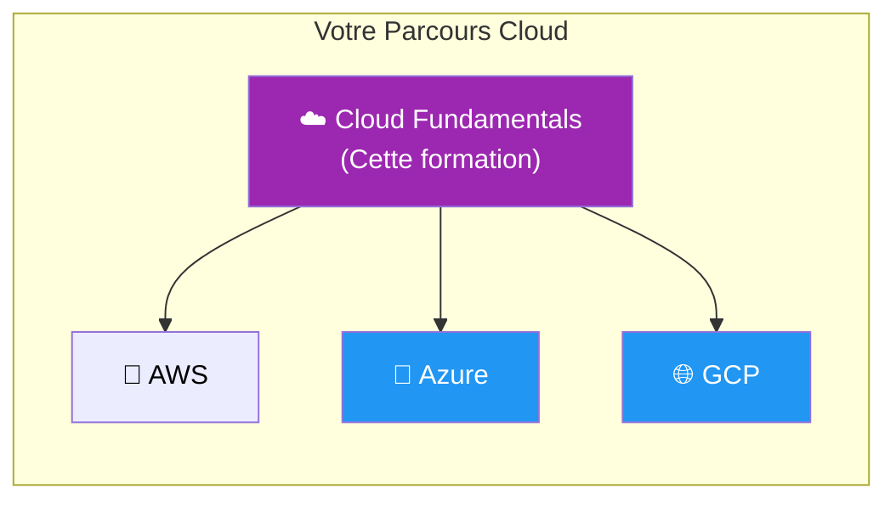
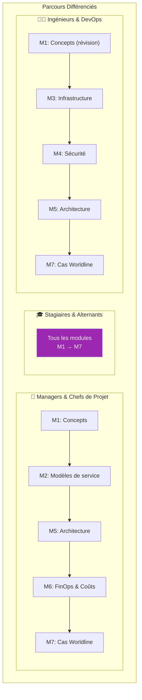

---
tags:
  - formation
  - cloud
  - fondamentaux
  - debutant
  - worldline
---

# Cloud Fundamentals : Les Bases du Cloud Computing

## Présentation

Cette formation constitue le **socle commun** avant toute spécialisation sur un provider cloud (AWS, Azure, GCP). Conçue pour tous les profils Worldline, elle démystifie le cloud computing avec une approche progressive et contextualisée au métier du paiement.

**Durée : 5 jours (35h) - 11 modules**

---

## Pourquoi Cette Formation ?

!!! question "Vous vous reconnaissez ?"
    - "Le cloud, c'est juste des serveurs chez quelqu'un d'autre ?"
    - "IaaS, PaaS, SaaS... je confonds toujours"
    - "Pourquoi on parle de régions et de zones ?"
    - "C'est quoi la différence entre AWS, Azure et GCP ?"
    - "Comment le cloud impacte nos contraintes PCI-DSS ?"

Cette formation répond à **toutes ces questions** avec des explications claires, des analogies concrètes et des exemples Worldline.

---

## Public Cible & Parcours

### Parcours par Profil

| Profil | Modules recommandés | Durée | Focus |
|--------|---------------------|-------|-------|
| **Managers / Chefs de projet** | 1, 2, 5, 6, 7, 11 | 2 jours | Vision stratégique, coûts, migration |
| **Stagiaires / Alternants** | Tous (1-11) | 5 jours | Formation complète |
| **Ingénieurs / DevOps** | 1, 3, 4, 5, 7, 8, 9, 10 | 3.5 jours | Technique + contexte métier |
| **Commerciaux / Avant-vente** | 1, 2, 6, 7, 11 | 1.5 jours | Discours client, pricing, migration |
| **Data Engineers** | 1, 3, 5, 10 | 2 jours | Infrastructure + Data/IA |

---

## Objectifs de la Formation

À l'issue de cette formation, vous serez capable de :

### Comprendre
- :fontawesome-solid-cloud: Expliquer ce qu'est le cloud et ses avantages
- :fontawesome-solid-layer-group: Différencier IaaS, PaaS et SaaS
- :fontawesome-solid-building: Comprendre l'infrastructure cloud (régions, zones, VPC)
- :fontawesome-solid-scale-balanced: Évaluer les forces de chaque provider (AWS, Azure, GCP)

### Appliquer
- :fontawesome-solid-shield-halved: Identifier les enjeux de sécurité et conformité (PCI-DSS)
- :fontawesome-solid-coins: Estimer et optimiser les coûts cloud
- :fontawesome-solid-diagram-project: Reconnaître les patterns d'architecture cloud
- :fontawesome-solid-comments: Dialoguer efficacement avec les équipes techniques

### Décider
- :fontawesome-solid-code-branch: Choisir le bon modèle de service pour un projet
- :fontawesome-solid-arrow-right-arrow-left: Évaluer une migration vers le cloud
- :fontawesome-solid-chart-line: Anticiper les impacts sur l'organisation

---

## Programme Détaillé (5 jours - 35h)

!!! info "Formation Enrichie"
    Cette formation a été enrichie avec 4 modules supplémentaires couvrant les conteneurs, DevOps, Data/IA et la migration cloud.

### Jour 1 : Fondamentaux (7h)

| Module | Titre | Durée | Contenu |
|--------|-------|-------|---------|
| **1** | [Qu'est-ce que le Cloud ?](01-module.md) | 3h | Histoire, définition, caractéristiques NIST, avantages/inconvénients, acteurs du marché |
| **2** | [Modèles de Service](02-module.md) | 4h | IaaS vs PaaS vs SaaS, responsabilité partagée, cas d'usage, comparatif providers |

### Jour 2 : Infrastructure & Sécurité (7h)

| Module | Titre | Durée | Contenu |
|--------|-------|-------|---------|
| **3** | [Infrastructure Cloud](03-module.md) | 4h | Compute, Storage, Network, bases de données, régions et zones |
| **4** | [Sécurité & Conformité](04-module.md) | 3h | IAM, chiffrement, réseau, PCI-DSS dans le cloud, certifications |

### Jour 3 : Architecture & Business (7h)

| Module | Titre | Durée | Contenu |
|--------|-------|-------|---------|
| **5** | [Architecture Cloud](05-module.md) | 3h | Haute disponibilité, disaster recovery, scalabilité, patterns |
| **6** | [FinOps & Coûts](06-module.md) | 2h | Modèles de pricing, optimisation, budgets, TCO |
| **7** | [Cas d'Usage Worldline](07-module.md) | 2h | Paiement, fintech, contraintes métier, exemples concrets |

### Jour 4 : Technologies Modernes (7h)

| Module | Titre | Durée | Contenu |
|--------|-------|-------|---------|
| **8** | [Conteneurs & Kubernetes](08-module.md) | 4h | Docker, conteneurs vs VMs, Kubernetes, services cloud (EKS/AKS/GKE) |
| **9** | [DevOps & CI/CD](09-module.md) | 3h | Culture DevOps, Git, pipelines CI/CD, Infrastructure as Code, DevSecOps |

### Jour 5 : Data, IA & Migration (7h)

| Module | Titre | Durée | Contenu |
|--------|-------|-------|---------|
| **10** | [Data & IA/ML Cloud](10-module.md) | 4h | Data Lake, Data Warehouse, services ML, Generative AI, cas d'usage |
| **11** | [Migration Cloud](11-module.md) | 3h | Stratégies 6R, TCO, phases de migration, risques et bonnes pratiques |

### Ressources Complémentaires

| Ressource | Description |
|-----------|-------------|
| [Glossaire](glossaire.md) | Tous les termes cloud essentiels |
| [Fiches Mémo](fiches-memo.md) | Fiches de révision rapide |

---

## Prérequis

!!! success "Aucun prérequis technique"
    Cette formation est accessible à tous. Les seuls prérequis sont :

    - Curiosité et envie d'apprendre
    - Connaissance basique de l'informatique (ce qu'est un serveur, une base de données)
    - Optionnel : expérience avec des services en ligne (Gmail, Office 365, Salesforce...)

---

## Méthode Pédagogique

### Approche "Mixte"

Cette formation combine :

| Méthode | Description | Exemple |
|---------|-------------|---------|
| **Concepts illustrés** | Schémas Mermaid, analogies du quotidien | "Le cloud, c'est comme l'électricité..." |
| **Démos visuelles** | Captures d'écran des consoles cloud | Navigation dans AWS/Azure/GCP |
| **Comparatifs** | Tableaux multi-providers | EC2 vs Azure VM vs Compute Engine |
| **Quiz interactifs** | Questions de validation | À la fin de chaque module |
| **Cas Worldline** | Exemples métier paiement | Architecture PCI-DSS dans le cloud |

### Structure des Modules

Chaque module suit ce format :

1. **Objectifs** : Ce que vous saurez à la fin
2. **Concepts** : Explications avec schémas
3. **Comparatif** : AWS vs Azure vs GCP
4. **Quiz** : Validation des acquis
5. **Pour aller plus loin** : Ressources complémentaires

!!! tip "Conseil"
    Prenez le temps de faire les quiz avant de passer au module suivant. Ils sont conçus pour renforcer la mémorisation.

---

## Et Après ?

### Formations Spécialisées

Après Cloud Fundamentals, choisissez votre spécialisation :

-   :material-aws:{ .lg .middle } **AWS Fundamentals**

    ---

    Maîtrisez Amazon Web Services : EC2, S3, VPC, EKS, Lambda, et plus.

    [:octicons-arrow-right-24: Accéder](../aws-fundamentals/)

-   :material-microsoft-azure:{ .lg .middle } **Azure Fundamentals**

    ---

    Maîtrisez Microsoft Azure : VMs, VNet, AKS, Functions, DevOps.

    [:octicons-arrow-right-24: Accéder](../azure-fundamentals/)

-   :material-google-cloud:{ .lg .middle } **GCP Fundamentals**

    ---

    Maîtrisez Google Cloud Platform : Compute Engine, GKE, Cloud Run.

    [:octicons-arrow-right-24: Accéder](../gcp-fundamentals/)

### Certifications Possibles

Cette formation prépare aux certifications d'entrée :

| Provider | Certification | Niveau |
|----------|---------------|--------|
| **AWS** | Cloud Practitioner (CLF-C02) | Fondamental |
| **Azure** | Azure Fundamentals (AZ-900) | Fondamental |
| **GCP** | Cloud Digital Leader | Fondamental |

---

## Ressources Complémentaires

| Ressource | Description |
|-----------|-------------|
| [Cloud Computing - Wikipedia](https://fr.wikipedia.org/wiki/Cloud_computing) | Définition et histoire |
| [NIST Cloud Definition](https://nvlpubs.nist.gov/nistpubs/Legacy/SP/nistspecialpublication800-145.pdf) | Définition officielle |
| [AWS vs Azure vs GCP](https://www.techtarget.com/searchcloudcomputing/tip/AWS-vs-Azure-vs-Google-Cloud-Which-is-best) | Comparatif détaillé |

---

## Navigation

| Module | Suivant |
|--------|---------|
| Introduction | [Module 1 : Qu'est-ce que le Cloud ? →](01-module.md) |
