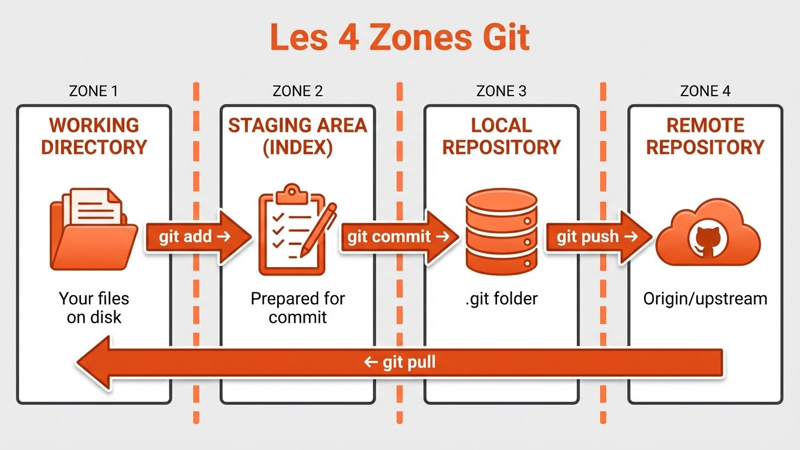
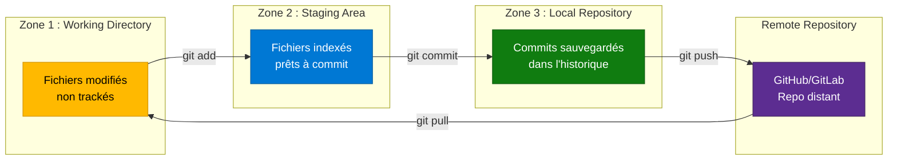

---
tags:
  - formation
  - devops
  - git
  - versionning
---

# Module 1 : Comprendre Git

## Objectif du Module

Maîtriser les concepts fondamentaux de Git (commit, push, pull) et comprendre le workflow entre le répertoire local, la staging area et le repository distant.

**Durée :** 45 minutes

## Concept : Qu'est-ce que Git ?

### Définition

**Git** est un système de **gestion de versions décentralisé** (DVCS - Distributed Version Control System). Créé en 2005 par Linus Torvalds pour le développement du noyau Linux, Git est devenu le standard de facto pour la collaboration sur du code.

### Git vs SVN : Pourquoi Git ?

| Critère | SVN (Centralisé) | Git (Décentralisé) |
|---------|------------------|-------------------|
| Architecture | Serveur central unique | Chaque clone = repo complet |
| Travail hors-ligne | ❌ Impossible | ✅ Possible (commit local) |
| Branches | Lourdes (copie répertoire) | Légères (pointeur) |
| Performance | Dépend du réseau | Ultra-rapide (local) |
| Historique | Serveur uniquement | Chaque développeur a l'historique complet |

### Les 4 Zones de Git

Git organise le travail en **4 zones distinctes** :





**Explication du flux :**

1. **Working Directory** (Répertoire de travail) : Fichiers que vous modifiez (non trackés par défaut)
2. **Staging Area** (Index) : Zone intermédiaire où vous préparez le prochain commit avec `git add`
3. **Local Repository** (Repo local) : Historique des commits sauvegardés avec `git commit`
4. **Remote Repository** (Repo distant) : Serveur GitHub/GitLab synchronisé avec `git push`/`git pull`

!!! info "Pourquoi une Staging Area ?"
    La staging area permet de **composer des commits atomiques**. Vous pouvez modifier 10 fichiers, mais ne commiter que 3 fichiers liés à une même fonctionnalité.

    **Exemple :** Vous travaillez sur un bug et découvrez une faute de frappe dans la doc. Vous pouvez faire 2 commits distincts :

    - Commit 1 : Fix du bug (fichiers métier)
    - Commit 2 : Correction typo (fichier doc)

## Pratique : Commandes Essentielles

### Initialiser un Dépôt Git

```bash
# Créer un nouveau dépôt Git local
mkdir mon-projet
cd mon-projet
git init

# Résultat :
# Initialized empty Git repository in /home/user/mon-projet/.git/

# Vérifier le statut
git status
# On branch main
# No commits yet
# nothing to commit (create/copy files and use "git add" to track)
```

### Workflow Basique : Add → Commit → Push

```bash
# 1. Créer un fichier
echo "# Mon Projet" > README.md

# 2. Vérifier le statut (Working Directory)
git status
# Untracked files:
#   README.md

# 3. Ajouter à la Staging Area
git add README.md

# 4. Vérifier le statut (Staging Area)
git status
# Changes to be committed:
#   new file:   README.md

# 5. Créer un commit (Local Repository)
git commit -m "docs: Ajout du README initial"
# [main (root-commit) abc123] docs: Ajout du README initial
#  1 file changed, 1 insertion(+)

# 6. Vérifier l'historique
git log --oneline
# abc123 (HEAD -> main) docs: Ajout du README initial

# 7. Lier à un remote et pousser (Remote Repository)
git remote add origin git@github.com:user/mon-projet.git
git push -u origin main
# Enumerating objects: 3, done.
# Writing objects: 100% (3/3), 242 bytes | 242.00 KiB/s, done.
# To github.com:user/mon-projet.git
#  * [new branch]      main -> main
```

### Commandes Utiles

```bash
# Voir les différences avant staging
git diff

# Voir les différences dans la staging area
git diff --staged

# Annuler un git add (unstage)
git restore --staged fichier.txt

# Annuler les modifications locales (⚠️ Destructif)
git restore fichier.txt

# Voir l'historique détaillé
git log --graph --oneline --all

# Voir qui a modifié quoi (blame)
git blame README.md
```

## Exercice : Premier Workflow Git

!!! example "À Vous de Jouer"
    **Contexte :** Vous créez un projet de documentation technique pour votre équipe.

    **Tâche :**

    1. Créer un répertoire `docs-projet`
    2. Initialiser un dépôt Git
    3. Créer un fichier `index.md` contenant "# Documentation Technique"
    4. Créer un fichier `.gitignore` contenant `*.log`
    5. Ajouter les 2 fichiers à la staging area
    6. Créer un commit avec le message : "feat: Initialisation de la documentation"
    7. Afficher l'historique avec `git log --oneline`

    **Bonus :**

    - Modifier `index.md` pour ajouter une section "## Installation"
    - Créer un second commit avec le message : "docs: Ajout section installation"
    - Vérifier que vous avez bien 2 commits dans l'historique

    **Durée estimée :** 10 minutes

    **Critères de réussite :**

    - ✅ Dépôt Git initialisé (présence du dossier `.git/`)
    - ✅ 2 fichiers commités (`index.md`, `.gitignore`)
    - ✅ Message de commit respectant le format Conventional Commits
    - ✅ 2 commits visibles dans `git log`

## Solution : Correction de l'Exercice

??? quote "Solution Détaillée"
    ### Étape 1 : Initialisation

    ```bash
    # Créer le répertoire et initialiser Git
    mkdir docs-projet
    cd docs-projet
    git init

    # Résultat attendu :
    # Initialized empty Git repository in /home/user/docs-projet/.git/
    ```

    ### Étape 2 : Créer les fichiers

    ```bash
    # Créer index.md
    echo "# Documentation Technique" > index.md

    # Créer .gitignore
    echo "*.log" > .gitignore

    # Vérifier le statut
    git status
    # On branch main
    # No commits yet
    # Untracked files:
    #   .gitignore
    #   index.md
    ```

    ### Étape 3 : Add + Commit

    ```bash
    # Ajouter à la staging area
    git add index.md .gitignore

    # Vérifier le statut
    git status
    # Changes to be committed:
    #   new file:   .gitignore
    #   new file:   index.md

    # Créer le commit
    git commit -m "feat: Initialisation de la documentation"
    # [main (root-commit) a1b2c3d] feat: Initialisation de la documentation
    #  2 files changed, 2 insertions(+)

    # Vérifier l'historique
    git log --oneline
    # a1b2c3d (HEAD -> main) feat: Initialisation de la documentation
    ```

    ### Étape 4 : Modification et Second Commit (Bonus)

    ```bash
    # Modifier index.md
    echo -e "\n## Installation\n\nÀ compléter..." >> index.md

    # Vérifier les différences
    git diff
    # diff --git a/index.md b/index.md
    # index 123...
    # --- a/index.md
    # +++ b/index.md
    # @@ -1 +1,3 @@
    #  # Documentation Technique
    # +
    # +## Installation

    # Ajouter et commiter
    git add index.md
    git commit -m "docs: Ajout section installation"
    # [main e4f5g6h] docs: Ajout section installation
    #  1 file changed, 3 insertions(+)

    # Vérifier l'historique complet
    git log --oneline
    # e4f5g6h (HEAD -> main) docs: Ajout section installation
    # a1b2c3d feat: Initialisation de la documentation
    ```

    **Explications :**

    - `git init` : Crée le dossier `.git/` contenant toute la base de données Git
    - `git add` : Déplace les fichiers vers la staging area (Zone 2)
    - `git commit -m "message"` : Sauvegarde un snapshot dans l'historique (Zone 3)
    - `git log --oneline` : Affiche l'historique condensé (1 ligne par commit)
    - **Conventional Commits** : Format `type: description` (feat, docs, fix, refactor, etc.)

    !!! success "Validation"
        Vous avez maintenant un dépôt Git fonctionnel avec 2 commits dans l'historique. Vous maîtrisez le workflow basique **Working Directory → Staging Area → Repository**.

## Points Clés à Retenir

**Ce module vous a appris :**

- 🔀 **Git = DVCS** : Chaque clone est un repo complet (vs SVN centralisé)
- 📂 **3 Zones** : Working Directory → Staging Area → Local Repository → Remote
- ➕ **git add** : Prépare les fichiers pour le commit (staging)
- 💾 **git commit** : Sauvegarde un snapshot dans l'historique
- 🚀 **git push** : Synchronise avec le serveur distant (GitHub/GitLab)
- 📜 **Conventional Commits** : Format standardisé pour les messages (`feat:`, `docs:`, `fix:`)
- 🔍 **git status** : Commande la plus importante (toujours vérifier l'état)

**Prochaine étape :** [Module 2 : Branches & Pull Requests](#) (en cours de rédaction)

---

**Retour au :** [Programme de la Formation](index.md) | [Catalogue](../index.md)

---

## Navigation

| | |
|:---|---:|
| [← Programme](index.md) | [Module 2 : Branches & Pull Requests →](02-module.md) |

[Retour au Programme](index.md){ .md-button }
