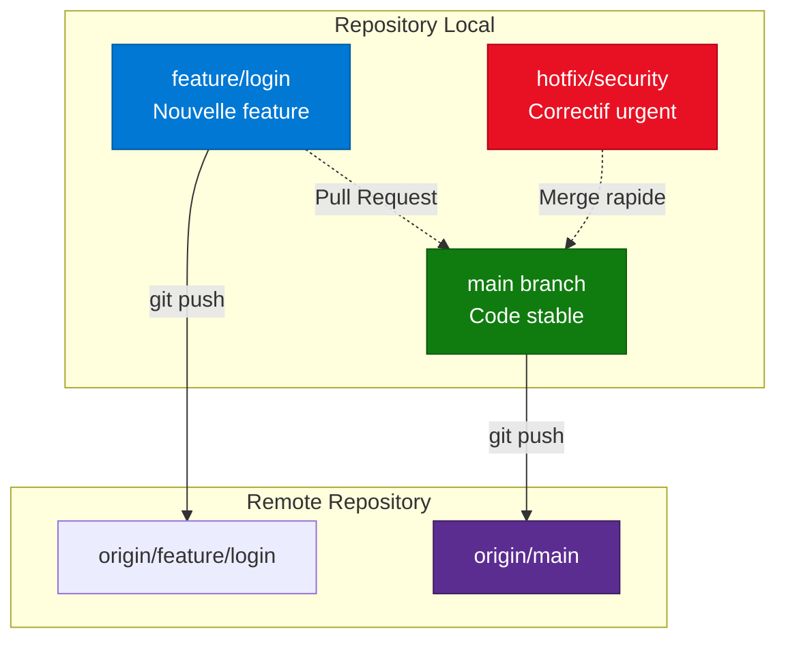
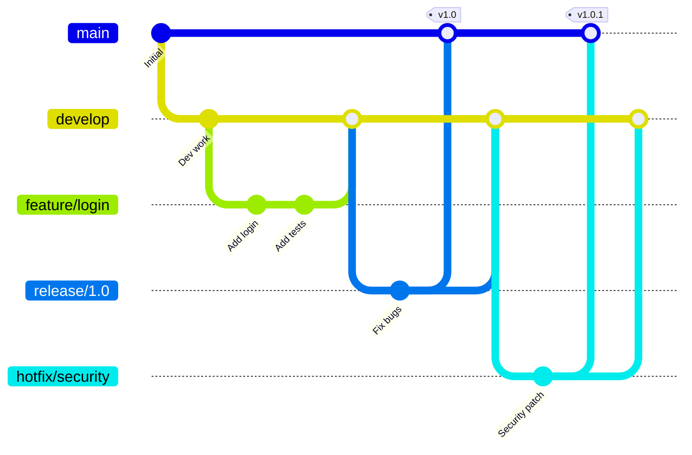
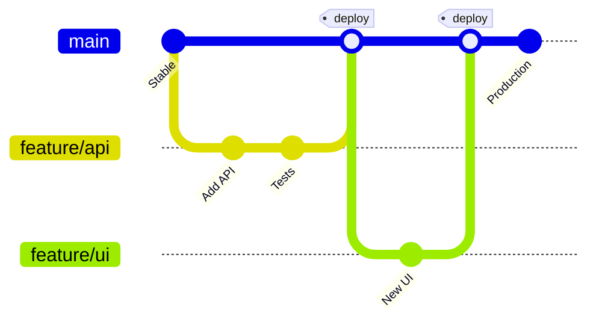

---
tags:
  - formation
  - devops
  - git
  - branches
  - pull-request
---

# Module 2 : Branches & Pull Requests

## Objectif du Module

Maîtriser le travail collaboratif avec Git : créer des branches, gérer les Pull Requests, résoudre les conflits, et comprendre les stratégies de branching (Git Flow, GitHub Flow).

**Durée :** 1 heure

## Concept : Pourquoi les Branches ?

### Le Problème du Développement Linéaire

Imaginez une équipe de 5 développeurs travaillant sur la **même branche `main`** :

- ❌ Développeur A pousse du code cassé → Tout le monde est bloqué
- ❌ Développeur B et C modifient le même fichier → Conflits constants
- ❌ Impossible de tester une feature isolée sans merger du code non fini

**Solution : Les Branches Git**

Les branches permettent de créer des **lignes de développement parallèles** :

- ✅ Chaque feature/bug se développe dans sa propre branche
- ✅ La branche `main` reste stable (production-ready)
- ✅ Les features sont testées avant d'être mergées
- ✅ Plusieurs développeurs travaillent sans se bloquer

### Les 3 Zones + Branches



**Explication :**

- **main** : Branche principale (code de production)
- **feature/login** : Branche de développement pour une nouvelle fonctionnalité
- **hotfix/security** : Branche pour un correctif urgent
- **Pull Request** : Demande de fusion après review

## Pratique : Commandes de Branches

### Créer et Naviguer entre Branches

```bash
# Lister les branches locales
git branch
# * main

# Créer une nouvelle branche
git branch feature/user-auth

# Lister à nouveau
git branch
#   feature/user-auth
# * main
# (L'étoile * indique la branche active)

# Basculer vers la nouvelle branche (ancienne méthode)
git checkout feature/user-auth
# Switched to branch 'feature/user-auth'

# Ou avec la commande moderne (Git 2.23+)
git switch feature/user-auth

# Créer ET basculer en une seule commande
git checkout -b feature/password-reset
# Ou
git switch -c feature/password-reset

# Vérifier la branche active
git branch
#   feature/user-auth
# * feature/password-reset
#   main
```

### Workflow Complet : Feature Branch

```bash
# 1. Partir de main à jour
git switch main
git pull origin main

# 2. Créer une branche feature
git switch -c feature/dark-mode

# 3. Travailler sur la feature
echo "body { background: #1e1e1e; }" > style.css
git add style.css
git commit -m "feat: Ajout du mode sombre"

# 4. Pousser la branche vers le remote
git push -u origin feature/dark-mode
# -u (ou --set-upstream) lie la branche locale à la remote

# 5. Créer une Pull Request sur GitHub/GitLab (via l'interface web)

# 6. Après validation, merger dans main (via l'interface ou CLI)
git switch main
git pull origin main
git merge feature/dark-mode
# Updating abc123..def456
# Fast-forward

# 7. Supprimer la branche locale (optionnel)
git branch -d feature/dark-mode
# Deleted branch feature/dark-mode (was def456)

# 8. Supprimer la branche remote (optionnel)
git push origin --delete feature/dark-mode
```

### Résoudre un Conflit de Merge

**Scénario :** Deux développeurs modifient le même fichier `README.md`.

```bash
# Développeur A (sur main)
echo "Version 1.0" >> README.md
git add README.md
git commit -m "docs: Version 1.0"
git push origin main

# Développeur B (sur feature/update-readme, créée AVANT le commit de A)
git switch -c feature/update-readme
echo "Version 2.0 Beta" >> README.md
git add README.md
git commit -m "docs: Version 2.0 Beta"

# Développeur B essaie de merger main dans sa branche
git switch feature/update-readme
git merge main
# CONFLICT (content): Merge conflict in README.md
# Automatic merge failed; fix conflicts and then commit the result.

# Ouvrir README.md (le fichier contient maintenant)
cat README.md
# <<<<<<< HEAD
# Version 2.0 Beta
# =======
# Version 1.0
# >>>>>>> main

# Résoudre manuellement (choisir l'une des versions ou combiner)
echo "Version 2.0" > README.md  # Décision : garder 2.0

# Ajouter le fichier résolu
git add README.md
git commit -m "merge: Résolution conflit version"

# Maintenant le merge est clean
git log --oneline --graph
# *   abc123 (HEAD -> feature/update-readme) merge: Résolution conflit version
# |\
# | * def456 (main) docs: Version 1.0
# * | ghi789 docs: Version 2.0 Beta
```

## Concept : Stratégies de Branching

### Git Flow (Classique)

**Utilisé pour :** Projets avec releases planifiées (logiciels desktop, mobile apps).



**Branches :**

- **main** : Code en production (tags de version)
- **develop** : Branche d'intégration (pre-production)
- **feature/\*** : Nouvelles fonctionnalités (partent de develop)
- **release/\*** : Préparation d'une release (partent de develop)
- **hotfix/\*** : Correctifs urgents (partent de main)

**Avantages :**
- ✅ Contrôle total sur les releases
- ✅ Historique clair (features, releases, hotfixes distincts)

**Inconvénients :**
- ❌ Complexe (5 types de branches)
- ❌ Lent (merges multiples)

### GitHub Flow (Simplifié)

**Utilisé pour :** SaaS, applications web en déploiement continu.



**Branches :**

- **main** : Toujours déployable (= production)
- **feature/\*** : Branches éphémères pour chaque feature/bug

**Workflow :**

1. Créer une branche depuis `main`
2. Commit + Push
3. Ouvrir une Pull Request
4. Code Review
5. Merger dans `main` → Déploiement automatique (CI/CD)
6. Supprimer la branche

**Avantages :**
- ✅ Simple (2 types de branches)
- ✅ Rapide (déploiement continu)

**Inconvénients :**
- ❌ Pas de releases planifiées
- ❌ Nécessite une CI/CD robuste

### Comparaison

| Critère | Git Flow | GitHub Flow |
|---------|----------|-------------|
| Complexité | ⚠️ Élevée (5 branches) | ✅ Faible (2 branches) |
| Releases | ✅ Planifiées (v1.0, v2.0) | ❌ Continues |
| Hotfixes | ✅ Branches dédiées | ⚠️ Comme des features |
| Déploiement | Manuel (tags) | Automatique (merge = deploy) |
| Cas d'usage | Logiciels packagés | SaaS, Web apps |

## Exercice : Workflow Feature Branch

!!! example "À Vous de Jouer"
    **Contexte :** Vous travaillez sur un projet de documentation technique. Votre équipe utilise **GitHub Flow**.

    **Tâche :**

    1. Cloner le repo (ou utiliser un repo existant)
    2. Créer une branche `feature/ajout-section-docker`
    3. Ajouter un fichier `docker.md` contenant "# Guide Docker"
    4. Commiter avec le message : "docs: Ajout section Docker"
    5. Pousser la branche vers le remote
    6. Simuler une Pull Request en mergeant dans `main` localement
    7. Supprimer la branche `feature/ajout-section-docker`

    **Bonus :**

    - Créer une seconde branche `feature/ajout-section-k8s` depuis `main`
    - Modifier `docker.md` dans cette branche (ajouter une ligne)
    - Créer un conflit en modifiant `docker.md` aussi dans `main`
    - Résoudre le conflit lors du merge

    **Durée estimée :** 15 minutes

    **Critères de réussite :**

    - ✅ Branche feature créée et poussée
    - ✅ Commit respectant Conventional Commits
    - ✅ Merge dans main sans erreur
    - ✅ Branche feature supprimée après merge
    - ✅ (Bonus) Conflit résolu correctement

## Solution : Correction de l'Exercice

??? quote "Solution Détaillée"
    ### Étape 1 : Initialiser le Projet

    ```bash
    # Créer un repo (ou utiliser un existant)
    mkdir projet-docs
    cd projet-docs
    git init
    echo "# Documentation Technique" > README.md
    git add README.md
    git commit -m "docs: Initialisation"

    # Simuler un remote (optionnel pour l'exercice)
    # git remote add origin git@github.com:user/projet-docs.git
    # git push -u origin main
    ```

    ### Étape 2 : Créer la Feature Branch

    ```bash
    # Vérifier qu'on est sur main
    git branch
    # * main

    # Créer et basculer vers la branche feature
    git switch -c feature/ajout-section-docker

    # Vérifier
    git branch
    #   main
    # * feature/ajout-section-docker
    ```

    ### Étape 3 : Ajouter le Contenu

    ```bash
    # Créer le fichier docker.md
    echo "# Guide Docker" > docker.md

    # Vérifier le statut
    git status
    # On branch feature/ajout-section-docker
    # Untracked files:
    #   docker.md

    # Ajouter et commiter
    git add docker.md
    git commit -m "docs: Ajout section Docker"
    # [feature/ajout-section-docker abc123] docs: Ajout section Docker
    #  1 file changed, 1 insertion(+)
    ```

    ### Étape 4 : Pousser la Branche

    ```bash
    # Pousser vers le remote (si configuré)
    git push -u origin feature/ajout-section-docker
    # Si pas de remote, cette commande échoue, c'est normal pour l'exercice local

    # Pour cet exercice local, on passe directement au merge
    ```

    ### Étape 5 : Merger dans Main

    ```bash
    # Basculer vers main
    git switch main

    # Merger la feature branch
    git merge feature/ajout-section-docker
    # Updating def456..abc123
    # Fast-forward
    #  docker.md | 1 +
    #  1 file changed, 1 insertion(+)

    # Vérifier l'historique
    git log --oneline
    # abc123 (HEAD -> main, feature/ajout-section-docker) docs: Ajout section Docker
    # def456 docs: Initialisation
    ```

    ### Étape 6 : Supprimer la Feature Branch

    ```bash
    # Supprimer la branche locale
    git branch -d feature/ajout-section-docker
    # Deleted branch feature/ajout-section-docker (was abc123)

    # Supprimer la branche remote (si elle existe)
    # git push origin --delete feature/ajout-section-docker

    # Vérifier
    git branch
    # * main
    ```

    ### Bonus : Créer et Résoudre un Conflit

    ```bash
    # 1. Modifier docker.md dans main
    git switch main
    echo "## Installation" >> docker.md
    git add docker.md
    git commit -m "docs: Ajout section installation"

    # 2. Créer une branche depuis un point AVANT ce commit
    # (On va simuler un développeur qui part d'une version plus ancienne)
    git switch -c feature/ajout-section-k8s HEAD~1
    # HEAD~1 = commit parent (avant "Ajout section installation")

    # 3. Modifier le même fichier dans la branche
    echo "## Configuration" >> docker.md
    git add docker.md
    git commit -m "docs: Ajout section configuration"

    # 4. Essayer de merger main (CONFLIT!)
    git merge main
    # Auto-merging docker.md
    # CONFLICT (content): Merge conflict in docker.md

    # 5. Voir le conflit
    cat docker.md
    # # Guide Docker
    # <<<<<<< HEAD
    # ## Configuration
    # =======
    # ## Installation
    # >>>>>>> main

    # 6. Résoudre (garder les deux sections)
    cat > docker.md <<EOF
    # Guide Docker

    ## Installation

    ## Configuration
    EOF

    # 7. Finaliser le merge
    git add docker.md
    git commit -m "merge: Résolution conflit docker.md"

    # 8. Merger dans main
    git switch main
    git merge feature/ajout-section-k8s
    # Merge made by the 'ort' strategy.

    # 9. Supprimer la branche
    git branch -d feature/ajout-section-k8s

    # 10. Historique final
    git log --oneline --graph
    # *   ghi789 (HEAD -> main) Merge branch 'feature/ajout-section-k8s'
    # |\
    # | * jkl012 merge: Résolution conflit docker.md
    # | * mno345 docs: Ajout section configuration
    # * | pqr678 docs: Ajout section installation
    # |/
    # * abc123 docs: Ajout section Docker
    ```

    **Explications :**

    - `git switch -c` : Créer et basculer vers une branche
    - `git merge` : Fusionner une branche dans la branche active
    - **Fast-forward** : Merge simple (pas de divergence)
    - **Merge commit** : Commit spécial créé lors d'un merge avec divergence
    - `HEAD~1` : Référence au commit parent (1 commit avant HEAD)
    - Marqueurs de conflit : `<<<<<<< HEAD` (votre version) vs `>>>>>>> branch` (version à merger)

    !!! success "Validation"
        Vous maîtrisez maintenant le workflow feature branch ! Vous savez créer des branches, les merger, et résoudre des conflits.

## Points Clés à Retenir

**Ce module vous a appris :**

- 🌿 **Branches** : Lignes de développement parallèles pour isoler le travail
- 🔀 **git switch** : Commande moderne pour changer de branche (remplace checkout)
- 🚀 **Feature Branch Workflow** : Créer → Commit → Push → PR → Merge → Delete
- ⚠️ **Conflits** : Se produisent quand 2 branches modifient les mêmes lignes
- 🔧 **Résolution** : Éditer manuellement, choisir une version, puis `git add` + `git commit`
- 📊 **Git Flow** : Stratégie complexe avec 5 types de branches (main, develop, feature, release, hotfix)
- ⚡ **GitHub Flow** : Stratégie simple avec 2 types (main, feature) pour déploiement continu
- 🎯 **Pull Request** : Mécanisme de review avant merge (GitHub/GitLab)

**Commandes Essentielles :**

```bash
git branch                    # Lister les branches
git switch -c feature/nom     # Créer et basculer
git merge feature/nom         # Merger dans la branche active
git branch -d feature/nom     # Supprimer une branche locale
git push origin --delete nom  # Supprimer une branche remote
```

**Prochaine étape :** [Module 3 : Pipeline CI/CD avec GitLab](#) (en cours de rédaction)

---

**Retour au :** [Programme de la Formation](index.md) | [Catalogue](../index.md)
