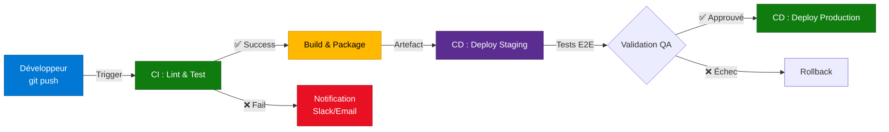

---
tags:
  - formation
  - devops
  - cicd
  - github-actions
  - automation
---

# Module 3 : Mon Premier Pipeline CI/CD

## Objectif du Module

Comprendre les concepts de CI/CD (Continuous Integration / Continuous Delivery) et créer son premier pipeline automatisé avec GitHub Actions pour tester et valider du code automatiquement.

**Durée :** 1h30

## Introduction : Du Manuel à l'Automatisé

### Le Problème du Workflow Manuel

Imaginez un développeur qui termine une fonctionnalité :

1. ✍️ **Commit** : Il pousse son code sur GitHub
2. 🧪 **Tests manuels** : Il lance `npm test` en local (parfois il oublie...)
3. 🔍 **Linting** : Il vérifie la syntaxe avec `eslint` (s'il y pense...)
4. 📦 **Build** : Il compile avec `npm run build`
5. 🚀 **Déploiement** : Il copie les fichiers sur le serveur via FTP

**Problèmes :**

- ❌ **Oublis** : Le développeur peut oublier une étape (tests, linting)
- ❌ **Incohérence** : Chaque développeur a son propre processus
- ❌ **Erreurs humaines** : Déployer le mauvais fichier, la mauvaise branche
- ❌ **Lenteur** : Chaque étape est manuelle et répétitive
- ❌ **Pas de traçabilité** : Impossible de savoir qui a déployé quoi et quand

### La Solution : CI/CD Pipeline

Un pipeline CI/CD **automatise toutes ces étapes** :

- ✅ **Déclenchement automatique** : À chaque push sur GitHub
- ✅ **Tests systématiques** : Impossible de merger du code qui échoue
- ✅ **Linting obligatoire** : Le code suit les standards de qualité
- ✅ **Build automatique** : Compilation dans un environnement propre
- ✅ **Déploiement sécurisé** : Depuis le pipeline, pas manuellement
- ✅ **Traçabilité complète** : Logs de chaque exécution

## Concept : CI vs CD

### Continuous Integration (CI)

**Définition :** Intégrer le code fréquemment (plusieurs fois par jour) et le tester automatiquement.

**Objectif :** Détecter les bugs tôt, avant qu'ils ne se propagent.

**Étapes typiques :**

1. **Checkout** : Récupérer le code depuis Git
2. **Install** : Installer les dépendances (`npm install`, `pip install`)
3. **Lint** : Vérifier la syntaxe (yamllint, eslint, shellcheck)
4. **Test** : Exécuter les tests unitaires (`pytest`, `jest`)
5. **Build** : Compiler le code (si applicable)

### Continuous Delivery (CD)

**Définition :** Automatiser le déploiement vers un environnement (staging, production).

**Objectif :** Livrer rapidement et fréquemment de nouvelles versions.

**Étapes typiques :**

1. **Package** : Créer un artefact (Docker image, fichier .zip)
2. **Deploy** : Pousser vers un serveur (Kubernetes, VM, S3)
3. **Smoke Test** : Vérifier que l'application répond (health check)

### Diagramme : Pipeline CI/CD Complet



**Explication du flux :**

1. **Dev push** : Le développeur pousse du code sur GitHub
2. **CI : Lint & Test** : Pipeline exécute les tests automatiquement
3. **Build** : Si les tests passent, création d'un artefact (Docker image, binaire)
4. **Deploy Staging** : Déploiement automatique en environnement de test
5. **Validation QA** : Tests manuels ou automatisés (E2E)
6. **Deploy Production** : Si validation OK, déploiement en production
7. **Notification** : En cas d'échec, alerte Slack/Email

## L'Outil : GitHub Actions

### Pourquoi GitHub Actions ?

**Avantages :**

- ✅ **Intégré à GitHub** : Pas besoin de serveur Jenkins/GitLab CI externe
- ✅ **YAML simple** : Configuration lisible et versionnable
- ✅ **Marketplace** : 10 000+ actions prêtes à l'emploi (checkout, setup-node, docker, etc.)
- ✅ **Runners gratuits** : GitHub fournit des machines (Linux, Windows, macOS)
- ✅ **Matrix builds** : Tester sur plusieurs versions (Python 3.8, 3.9, 3.10)

**Alternatives :**

| Outil | Avantages | Inconvénients |
|-------|-----------|---------------|
| **GitHub Actions** | Intégré, gratuit (2000 min/mois) | Limité aux repos GitHub |
| **GitLab CI** | Intégré GitLab, Docker natif | Syntaxe différente |
| **Jenkins** | Très flexible, self-hosted | Complexe à configurer |
| **CircleCI** | Rapide, cache intelligent | Payant au-delà du free tier |

### Emplacement des Fichiers

Les workflows GitHub Actions se placent dans :

```
.github/
└── workflows/
    ├── ci.yml              # Pipeline CI (tests, lint)
    ├── deploy.yml          # Pipeline CD (déploiement)
    └── release.yml         # Création de releases GitHub
```

**Déclenchement :** Dès qu'un fichier `.yml` est présent dans `.github/workflows/`, GitHub Actions le détecte et l'exécute selon les triggers définis.

## Pratique : Anatomie d'un Fichier YAML

### Mots-Clés Essentiels

```yaml
name: Mon Pipeline CI          # Nom du workflow (affiché dans l'UI GitHub)

on:                            # Événements déclencheurs
  push:                        # À chaque push
    branches: [main, dev]      # Seulement sur ces branches
  pull_request:                # À chaque Pull Request
    branches: [main]

jobs:                          # Liste des jobs (peuvent s'exécuter en parallèle)
  build:                       # Nom du job
    runs-on: ubuntu-latest     # OS de la machine virtuelle (runner)

    steps:                     # Liste des étapes (exécutées séquentiellement)
      - name: Checkout code    # Nom de l'étape
        uses: actions/checkout@v4   # Action prédéfinie (depuis le Marketplace)

      - name: Install dependencies
        run: npm install       # Commande shell à exécuter

      - name: Run tests
        run: npm test          # Exécuter les tests
```

### Exemple : Pipeline "Hello World"

```yaml
# .github/workflows/hello.yml
name: Hello World CI

on:
  push:
    branches: [main]

jobs:
  say-hello:
    runs-on: ubuntu-latest

    steps:
      # Étape 1 : Récupérer le code
      - name: Checkout repository
        uses: actions/checkout@v4

      # Étape 2 : Afficher un message
      - name: Say hello
        run: echo "Hello from GitHub Actions!"

      # Étape 3 : Afficher des infos système
      - name: System info
        run: |
          echo "OS: $(uname -a)"
          echo "User: $(whoami)"
          echo "PWD: $(pwd)"

      # Étape 4 : Lister les fichiers
      - name: List files
        run: ls -lah
```

**Résultat attendu dans l'UI GitHub :**

```
✅ say-hello
  ✅ Checkout repository
  ✅ Say hello
     Hello from GitHub Actions!
  ✅ System info
     OS: Linux runner-abc123
     User: runner
     PWD: /home/runner/work/mon-projet/mon-projet
  ✅ List files
     total 24K
     drwxr-xr-x  4 runner runner 4.0K Nov 22 10:30 .
     drwxr-xr-x  3 runner runner 4.0K Nov 22 10:30 ..
     drwxr-xr-x  8 runner runner 4.0K Nov 22 10:30 .git
     -rw-r--r--  1 runner runner  123 Nov 22 10:30 README.md
```

### Actions Prédéfinies Utiles

```yaml
# Checkout code (obligatoire pour accéder au repo)
- uses: actions/checkout@v4

# Setup Node.js
- uses: actions/setup-node@v4
  with:
    node-version: '20'

# Setup Python
- uses: actions/setup-python@v5
  with:
    python-version: '3.11'

# Cache dependencies (accélérer les builds)
- uses: actions/cache@v4
  with:
    path: ~/.npm
    key: ${{ runner.os }}-node-${{ hashFiles('**/package-lock.json') }}

# Upload artifacts (sauvegarder des fichiers)
- uses: actions/upload-artifact@v4
  with:
    name: build-output
    path: dist/
```

## Exercice : Pipeline de Linting Markdown

!!! example "À Vous de Jouer"
    **Contexte :** Vous gérez un projet de documentation technique (comme ShellBook). Vous voulez garantir que tous les fichiers Markdown respectent les standards de syntaxe.

    **Objectif :** Créer un pipeline CI qui vérifie automatiquement la syntaxe Markdown à chaque push.

    **Tâches :**

    1. Créer le répertoire `.github/workflows/` dans votre projet
    2. Créer le fichier `.github/workflows/ci.yml`
    3. Définir un job `lint` qui :
       - S'exécute sur `ubuntu-latest`
       - Se déclenche sur `push` et `pull_request`
       - Utilise l'action `actions/checkout@v4` pour récupérer le code
       - Installe `markdownlint-cli` via npm
       - Exécute `markdownlint '**/*.md'` pour vérifier tous les fichiers Markdown

    **Bonus :**

    - Ajouter un second job `shellcheck` qui vérifie les scripts Shell (`.sh`)
    - Faire en sorte que les deux jobs s'exécutent en parallèle

    **Durée estimée :** 20 minutes

    **Critères de réussite :**

    - ✅ Fichier `.github/workflows/ci.yml` créé
    - ✅ Pipeline se déclenche automatiquement sur push
    - ✅ Job `lint` exécute markdownlint
    - ✅ (Bonus) Job `shellcheck` fonctionne en parallèle

## Solution : Pipeline CI Complet

??? quote "Solution Détaillée"
    ### Fichier `.github/workflows/ci.yml`

    ```yaml
    name: CI - Lint & Quality Checks

    # Déclencheurs
    on:
      push:
        branches: [main, dev]
      pull_request:
        branches: [main]

    # Jobs (s'exécutent en parallèle par défaut)
    jobs:
      # Job 1 : Vérification Markdown
      markdown-lint:
        runs-on: ubuntu-latest

        steps:
          # Étape 1 : Récupérer le code
          - name: Checkout repository
            uses: actions/checkout@v4

          # Étape 2 : Setup Node.js (requis pour markdownlint-cli)
          - name: Setup Node.js
            uses: actions/setup-node@v4
            with:
              node-version: '20'

          # Étape 3 : Installer markdownlint-cli
          - name: Install markdownlint-cli
            run: npm install -g markdownlint-cli

          # Étape 4 : Exécuter le linting
          - name: Run markdownlint
            run: markdownlint '**/*.md' --ignore node_modules

      # Job 2 : Vérification Shell Scripts (Bonus)
      shellcheck:
        runs-on: ubuntu-latest

        steps:
          # Étape 1 : Récupérer le code
          - name: Checkout repository
            uses: actions/checkout@v4

          # Étape 2 : Installer shellcheck
          - name: Install shellcheck
            run: |
              # Sur les runners GitHub (Ubuntu), on utilise apt
              sudo apt-get update && sudo apt-get install -y shellcheck

          # Étape 3 : Trouver et vérifier tous les scripts .sh
          - name: Run shellcheck
            run: |
              echo "Checking shell scripts..."
              find . -name "*.sh" -type f | while read -r script; do
                echo "Checking $script"
                shellcheck "$script"
              done

      # Job 3 : Vérification YAML (Bonus supplémentaire)
      yaml-lint:
        runs-on: ubuntu-latest

        steps:
          - name: Checkout repository
            uses: actions/checkout@v4

          - name: Setup Python
            uses: actions/setup-python@v5
            with:
              python-version: '3.11'

          - name: Install yamllint
            run: pip install yamllint

          - name: Run yamllint
            run: yamllint .
    ```

    ### Structure du Projet

    ```
    mon-projet/
    ├── .github/
    │   └── workflows/
    │       └── ci.yml              ← Fichier créé
    ├── docs/
    │   ├── guide.md
    │   └── tutorial.md
    ├── scripts/
    │   └── deploy.sh
    └── README.md
    ```

    ### Résultat Attendu dans GitHub

    Après un push, l'interface GitHub Actions affiche :

    ```
    ✅ CI - Lint & Quality Checks
      ✅ markdown-lint (20s)
        ✅ Checkout repository
        ✅ Setup Node.js
        ✅ Install markdownlint-cli
        ✅ Run markdownlint
           ✓ docs/guide.md
           ✓ docs/tutorial.md
           ✓ README.md

      ✅ shellcheck (15s)
        ✅ Checkout repository
        ✅ Install shellcheck
        ✅ Run shellcheck
           Checking ./scripts/deploy.sh
           ✓ No issues found

      ✅ yaml-lint (18s)
        ✅ Checkout repository
        ✅ Setup Python
        ✅ Install yamllint
        ✅ Run yamllint
           ✓ .github/workflows/ci.yml
    ```

    ### Exemple d'Échec

    Si un fichier Markdown contient une erreur :

    ```
    ❌ CI - Lint & Quality Checks
      ❌ markdown-lint (22s)
        ✅ Checkout repository
        ✅ Setup Node.js
        ✅ Install markdownlint-cli
        ❌ Run markdownlint
           docs/guide.md:15 MD013/line-length Line length [Expected: 80; Actual: 120]
           docs/tutorial.md:42 MD029/ol-prefix Ordered list item prefix [Expected: 1; Actual: 2]
    ```

    **Explication des erreurs :**

    - **MD013** : Ligne trop longue (>80 caractères)
    - **MD029** : Numérotation de liste incorrecte

    **Correction :**

    ```bash
    # Corriger les fichiers localement
    vim docs/guide.md   # Couper la ligne 15
    vim docs/tutorial.md # Corriger la numérotation

    # Re-commiter
    git add docs/
    git commit -m "fix: Correction erreurs markdownlint"
    git push

    # Le pipeline se relance automatiquement et passe ✅
    ```

    ### Configuration Avancée : Matrix Strategy

    Pour tester sur plusieurs versions de Node.js :

    ```yaml
    jobs:
      test:
        runs-on: ubuntu-latest
        strategy:
          matrix:
            node-version: [18, 20, 22]

        steps:
          - uses: actions/checkout@v4
          - uses: actions/setup-node@v4
            with:
              node-version: ${{ matrix.node-version }}
          - run: npm test
    ```

    **Résultat :** 3 jobs en parallèle (Node 18, 20, 22)

    !!! success "Validation"
        Vous maîtrisez maintenant les bases de GitHub Actions ! Vous savez créer un pipeline CI pour automatiser les vérifications de qualité. Prochaine étape : Déploiement automatisé (CD).

## Points Clés à Retenir

**Ce module vous a appris :**

- 🔄 **CI/CD** : Continuous Integration (tests auto) + Continuous Delivery (déploiement auto)
- 🚀 **GitHub Actions** : Outil intégré à GitHub pour créer des pipelines YAML
- 📂 **Emplacement** : `.github/workflows/*.yml`
- 🔑 **Mots-clés** : `name`, `on`, `jobs`, `runs-on`, `steps`, `uses`, `run`
- ⚡ **Actions** : Blocs réutilisables depuis le Marketplace (`actions/checkout`, `setup-node`)
- 🧪 **Linting** : Vérification automatique de qualité (Markdown, YAML, Shell)
- 🔀 **Parallélisation** : Plusieurs jobs s'exécutent simultanément (gain de temps)
- 🛡️ **Quality Gates** : Empêcher le merge si les tests échouent

**Commandes Essentielles :**

```bash
# Créer la structure
mkdir -p .github/workflows
touch .github/workflows/ci.yml

# Vérifier localement avant de commiter
markdownlint '**/*.md'
yamllint .
shellcheck scripts/*.sh

# Commiter et pousser (déclenche le pipeline)
git add .github/
git commit -m "ci: Ajout pipeline GitHub Actions"
git push
```

**Workflow Typique :**

1. Créer `.github/workflows/ci.yml`
2. Définir les triggers (`on: push`)
3. Ajouter des jobs (`lint`, `test`, `build`)
4. Pousser sur GitHub
5. Vérifier l'exécution dans l'onglet "Actions"
6. Corriger les erreurs si le pipeline échoue ❌
7. Re-pousser jusqu'à ce que tout passe ✅

**Prochaine étape :** [Module 4 : Linting & Quality Gates](#) (en cours de rédaction)

---

**Retour au :** [Programme de la Formation](index.md) | [Catalogue](../index.md)

---

## Navigation

| | |
|:---|---:|
| [← Module 2 : Branches & Pull Requests](02-module.md) | [Module 4 : Qualité de Code & Linting →](04-module.md) |

[Retour au Programme](index.md){ .md-button }
