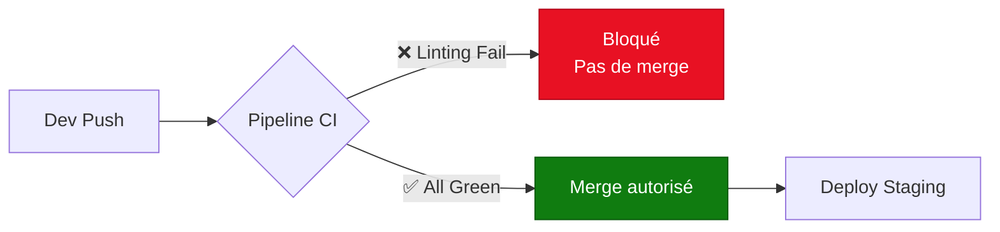

---
tags:
  - formation
  - devops
  - linting
  - quality
  - shellcheck
  - yamllint
---

# Module 4 : Qualité de Code & Linting

## Objectif du Module

Comprendre l'importance de l'analyse statique du code (linting) et intégrer des quality gates dans le pipeline CI/CD pour garantir des standards de qualité élevés avant chaque déploiement.

**Durée :** 1 heure

## Introduction : Pourquoi les Tests Automatisés ?

### Le Coût d'un Bug en Production

Le principe **"Shift Left"** (décalage à gauche) signifie détecter les bugs **le plus tôt possible** dans le cycle de développement.


**Coût croissant d'un bug :**

| Phase | Coût de correction | Exemple |
|-------|-------------------|---------|
| **Développement** | 10€ (5 min) | Le dev corrige immédiatement |
| **CI Pipeline** | 100€ (30 min) | Le pipeline échoue, il faut débugger |
| **Staging** | 1 000€ (2h) | QA trouve un bug, retour dev |
| **Production** | 10 000€ (1 jour) | Rollback, hotfix, communication |
| **Downtime** | 100 000€ (incident) | Perte de revenus, atteinte réputation |

**Conclusion :** Un bug détecté **localement** coûte 10 000 fois moins cher qu'un incident en production !

### Le Paradigme "Shift Left"

**Principe :** Déplacer les tests et validations vers la **gauche** du cycle de vie (le plus tôt possible).

**Avant (Shift Right - ❌) :**

1. Dev → Commit → Merge
2. QA teste manuellement
3. Bug trouvé en production
4. Hotfix urgent

**Après (Shift Left - ✅) :**

1. Dev → **Linting local** → Commit
2. **CI Pipeline** : Tests auto + Linting
3. **Quality Gates** : Impossible de merger si échec
4. QA teste uniquement la logique métier (pas les bugs de syntaxe)

## Concept : Analyse Statique vs Dynamique

### Analyse Statique (Linting)

**Définition :** Examiner le code **sans l'exécuter** pour détecter des erreurs potentielles.

**Exemples d'erreurs détectées :**

- 🐛 **Syntaxe incorrecte** : Guillemets manquants, parenthèses mal fermées
- 🔒 **Failles de sécurité** : Variables non quotées (risque d'injection)
- 💡 **Mauvaises pratiques** : Variables non utilisées, code mort
- 📏 **Non-respect des standards** : Indentation, longueur de ligne

**Outils de linting :**

| Langage/Format | Linter | Exemple d'erreur détectée |
|----------------|--------|---------------------------|
| **Bash** | ShellCheck | `SC2086: Variable non quotée` |
| **YAML** | yamllint | `Indentation incorrecte (2 espaces requis)` |
| **Python** | pylint, flake8 | `E501: Ligne trop longue (>79 caractères)` |
| **JavaScript** | eslint | `no-unused-vars: Variable 'x' déclarée mais non utilisée` |
| **Markdown** | markdownlint | `MD013: Ligne trop longue` |

### Analyse Dynamique (Tests)

**Définition :** Exécuter le code et vérifier son comportement.

**Exemples :**

- **Tests unitaires** : `pytest`, `jest`
- **Tests d'intégration** : API, base de données
- **Tests E2E** : Selenium, Playwright

!!! tip "Complémentarité"
    **Linting** (statique) et **Tests** (dynamique) sont **complémentaires** :

    - **Linting** : Détecte les erreurs de syntaxe et de style (rapide, avant exécution)
    - **Tests** : Vérifie la logique métier (plus lent, nécessite l'exécution)

    **Best Practice :** Exécuter le linting **avant** les tests dans le pipeline (fail fast).

### Quality Gates

**Définition :** Points de contrôle obligatoires dans le pipeline CI/CD. Si un critère n'est pas respecté, le pipeline **échoue**.

**Exemples de Quality Gates :**

- ✅ **Linting** : 0 erreur ShellCheck
- ✅ **Tests** : Couverture de code ≥ 80%
- ✅ **Sécurité** : 0 vulnérabilité critique (Snyk, Trivy)
- ✅ **Performance** : Temps de réponse API < 200ms

**Principe :** **"Red Pipeline = No Merge"**



## Les Outils du SysAdmin

### ShellCheck : Le Standard pour Bash

**ShellCheck** est le linter de référence pour les scripts Bash. Il détecte plus de **300 types d'erreurs** courantes.

**Installation :**

=== "RHEL/Rocky"

    ```bash
    sudo dnf install epel-release -y
    sudo dnf install ShellCheck -y

    # Vérifier l'installation
    shellcheck --version
    ```

=== "Debian/Ubuntu"

    ```bash
    sudo apt install shellcheck -y

    # Vérifier l'installation
    shellcheck --version
    ```

=== "macOS"

    ```bash
    brew install shellcheck

    # Vérifier l'installation
    shellcheck --version
    ```

#### Exemple : Script Avec Erreurs (❌)

```bash
#!/bin/bash
# deploy.sh - Script de déploiement (MAUVAISES PRATIQUES)

APP_NAME=mon-app
ENV=$1

# Erreur 1 : Variable non quotée (SC2086)
echo Deploying $APP_NAME to $ENV

# Erreur 2 : Variable non utilisée (SC2034)
UNUSED_VAR="test"

# Erreur 3 : Condition incorrecte (SC2166)
if [ $ENV = "production" -o $ENV = "staging" ]; then
  echo "Environment valide"
fi

# Erreur 4 : Commande non vérifiée (SC2181)
cp app.tar.gz /tmp/
if [ $? -ne 0 ]; then
  echo "Erreur de copie"
  exit 1
fi

# Erreur 5 : Variable dans rm non quotée (DANGER!)
FILES_TO_DELETE=$2
rm -rf $FILES_TO_DELETE  # Risque d'injection si $2 contient des espaces
```

**Exécution ShellCheck :**

```bash
shellcheck deploy.sh
```

**Sortie :**

```
In deploy.sh line 7:
echo Deploying $APP_NAME to $ENV
               ^--------^ SC2086: Double quote to prevent globbing and word splitting.
                             ^--^ SC2086: Double quote to prevent globbing and word splitting.

In deploy.sh line 10:
UNUSED_VAR="test"
^--------^ SC2034: UNUSED_VAR appears unused. Verify use (or export if used externally).

In deploy.sh line 13:
if [ $ENV = "production" -o $ENV = "staging" ]; then
     ^--^ SC2086: Double quote to prevent globbing and word splitting.
                            ^--^ SC2086: Double quote to prevent globbing and word splitting.
     ^-- SC2166: Prefer [ p ] || [ q ] as [ p -o q ] is not well defined.

In deploy.sh line 19:
if [ $? -ne 0 ]; then
     ^-- SC2181: Check exit code directly with e.g. 'if ! mycmd;', not indirectly with $?.

In deploy.sh line 25:
rm -rf $FILES_TO_DELETE
       ^--------------^ SC2086: Double quote to prevent globbing and word splitting.
```

#### Script Corrigé (✅)

```bash
#!/bin/bash
# deploy.sh - Script de déploiement (BONNES PRATIQUES)

set -euo pipefail  # Arrêter sur erreur, variables non définies, erreurs de pipe

APP_NAME="mon-app"
ENV="${1:-staging}"  # Valeur par défaut si $1 vide

# ✅ Variables quotées
echo "Deploying ${APP_NAME} to ${ENV}"

# ✅ Variable supprimée (non utilisée)

# ✅ Condition moderne avec [[
if [[ "${ENV}" == "production" ]] || [[ "${ENV}" == "staging" ]]; then
  echo "Environment valide"
else
  echo "Erreur: Environment doit être production ou staging"
  exit 1
fi

# ✅ Vérification d'erreur directe
if ! cp app.tar.gz /tmp/; then
  echo "Erreur de copie"
  exit 1
fi

# ✅ Variable quotée et vérification
FILES_TO_DELETE="${2:-}"
if [[ -n "${FILES_TO_DELETE}" ]]; then
  rm -rf "${FILES_TO_DELETE}"
fi
```

**Vérification :**

```bash
shellcheck deploy.sh
# (Aucune sortie = 0 erreur)
```

!!! success "Améliorations Appliquées"
    - ✅ `set -euo pipefail` : Arrêter le script sur toute erreur
    - ✅ Variables quotées : `"${VAR}"` prévient les injections
    - ✅ `[[` au lieu de `[` : Syntaxe moderne et plus sûre
    - ✅ Vérification directe : `if ! cmd` au lieu de `if [ $? -ne 0 ]`
    - ✅ Valeurs par défaut : `${VAR:-default}`

### Yamllint : Essentiel pour Ansible/Kubernetes

**Yamllint** vérifie la syntaxe et le style des fichiers YAML (utilisés partout : Ansible, Kubernetes, GitHub Actions).

**Installation :**

```bash
pip install yamllint

# Vérifier l'installation
yamllint --version
# yamllint 1.35.0
```

#### Exemple : YAML avec Erreurs (❌)

```yaml
# playbook.yml (MAUVAISES PRATIQUES)
---
- name: Install Nginx
  hosts: webservers
  tasks:
  - name: Install nginx package
    yum:
      name: nginx
      state: present
    - name: Start nginx  # Indentation incorrecte (4 espaces au lieu de 2)
      service:
        name: nginx
        state: started

  - name: Copy config
    copy:
      src: /tmp/nginx.conf
      dest: /etc/nginx/nginx.conf
      # Commentaire trop long qui dépasse la limite de 80 caractères recommandée pour la lisibilité
```

**Exécution yamllint :**

```bash
yamllint playbook.yml
```

**Sortie :**

```
playbook.yml
  10:5      error    wrong indentation: expected 2 but found 4  (indentation)
  18:7      warning  line too long (106 > 80 characters)  (line-length)
```

#### YAML Corrigé (✅)

```yaml
# playbook.yml (BONNES PRATIQUES)
---
- name: Install Nginx
  hosts: webservers
  tasks:
    - name: Install nginx package
      yum:
        name: nginx
        state: present

    - name: Start nginx
      service:
        name: nginx
        state: started

    - name: Copy config
      copy:
        src: /tmp/nginx.conf
        dest: /etc/nginx/nginx.conf
        # Config Nginx principale
```

**Vérification :**

```bash
yamllint playbook.yml
# (Aucune sortie = 0 erreur)
```

## Pratique : Intégration dans GitHub Actions

### Pipeline avec Job Linting Parallèle

```yaml
# .github/workflows/ci.yml
name: CI - Quality Checks

on:
  push:
    branches: [main, dev]
  pull_request:
    branches: [main]

jobs:
  # Job 1 : Linting (s'exécute en parallèle)
  lint:
    runs-on: ubuntu-latest
    steps:
      - name: Checkout code
        uses: actions/checkout@v4

      - name: Install ShellCheck
        run: sudo apt-get update && sudo apt-get install -y shellcheck

      - name: Install yamllint
        run: pip install yamllint

      - name: Run ShellCheck
        run: |
          echo "Checking shell scripts..."
          find . -name "*.sh" -type f | while read -r script; do
            echo "Checking $script"
            shellcheck "$script"
          done

      - name: Run yamllint
        run: yamllint .

  # Job 2 : Tests (s'exécute en parallèle)
  test:
    runs-on: ubuntu-latest
    steps:
      - name: Checkout code
        uses: actions/checkout@v4

      - name: Setup Python
        uses: actions/setup-python@v5
        with:
          python-version: '3.11'

      - name: Install dependencies
        run: pip install -r requirements.txt

      - name: Run tests
        run: pytest

  # Job 3 : Build (dépend du succès de lint et test)
  build:
    runs-on: ubuntu-latest
    needs: [lint, test]  # Attend que lint ET test soient ✅
    steps:
      - name: Checkout code
        uses: actions/checkout@v4

      - name: Build application
        run: ./build.sh

      - name: Upload artifact
        uses: actions/upload-artifact@v4
        with:
          name: app-build
          path: dist/
```

**Workflow :**

1. **lint** et **test** s'exécutent **en parallèle** (gain de temps)
2. **build** attend que **lint** ET **test** soient ✅
3. Si **lint** échoue → **build** ne s'exécute jamais (fail fast)

## Exercice : Scénario "Red-to-Green"

!!! example "À Vous de Jouer - Cycle Red → Green"
    **Contexte :** Vous développez un script de déploiement. Vous voulez garantir qu'aucun script avec des mauvaises pratiques ne soit mergé.

    **Objectif :** Expérimenter le cycle **Red → Fix → Green** en intégrant ShellCheck dans le pipeline.

    **Étapes :**

    **Step 1 : Créer un script avec mauvaises pratiques**

    Créez `scripts/deploy.sh` :

    ```bash
    #!/bin/bash
    APP=$1
    echo Deploying $APP
    rm -rf $2
    ```

    **Step 2 : Créer le pipeline CI**

    Créez `.github/workflows/lint.yml` :

    ```yaml
    name: Lint

    on: [push]

    jobs:
      shellcheck:
        runs-on: ubuntu-latest
        steps:
          - uses: actions/checkout@v4
          - run: sudo apt-get install -y shellcheck
          - run: shellcheck scripts/deploy.sh
    ```

    **Step 3 : Push et observer l'ÉCHEC (🔴 Red)**

    ```bash
    git add scripts/deploy.sh .github/workflows/lint.yml
    git commit -m "ci: Ajout script deploy (avec erreurs)"
    git push
    ```

    → Le pipeline **échoue** 🔴 avec des erreurs ShellCheck.

    **Step 4 : Corriger le script**

    Modifiez `scripts/deploy.sh` :

    ```bash
    #!/bin/bash
    set -euo pipefail
    APP="${1:-app}"
    echo "Deploying ${APP}"
    FILES="${2:-}"
    if [[ -n "${FILES}" ]]; then
      rm -rf "${FILES}"
    fi
    ```

    **Step 5 : Re-push et observer le SUCCÈS (🟢 Green)**

    ```bash
    git add scripts/deploy.sh
    git commit -m "fix: Correction erreurs ShellCheck"
    git push
    ```

    → Le pipeline **passe** 🟢 sans erreur.

    **Bonus :**

    - Ajouter `yamllint` au pipeline pour vérifier `.github/workflows/lint.yml`
    - Ajouter un badge GitHub Actions dans `README.md`

    **Durée estimée :** 20 minutes

    **Critères de réussite :**

    - ✅ Pipeline échoue initialement (Red)
    - ✅ Erreurs ShellCheck identifiées et corrigées
    - ✅ Pipeline passe après correction (Green)
    - ✅ Aucune erreur de linting restante

## Solution : Configuration Complète

??? quote "Solution Détaillée"
    ### Fichier `scripts/deploy.sh` (Corrigé)

    ```bash
    #!/bin/bash
    # deploy.sh - Script de déploiement sécurisé

    # Arrêter sur erreur, variables non définies, erreurs de pipe
    set -euo pipefail

    # Variables avec valeurs par défaut
    APP_NAME="${1:-mon-app}"
    FILES_TO_DELETE="${2:-}"

    # Logging
    echo "===================================="
    echo "Déploiement de l'application"
    echo "===================================="
    echo "Application: ${APP_NAME}"
    echo "Date: $(date '+%Y-%m-%d %H:%M:%S')"

    # Vérification que l'artefact existe
    ARTIFACT="build/${APP_NAME}.tar.gz"
    if [[ ! -f "${ARTIFACT}" ]]; then
      echo "Erreur: Artefact ${ARTIFACT} introuvable"
      exit 1
    fi

    # Copie sécurisée
    if ! cp "${ARTIFACT}" /tmp/; then
      echo "Erreur: Impossible de copier ${ARTIFACT}"
      exit 1
    fi

    echo "✅ Copie réussie vers /tmp/"

    # Nettoyage optionnel (avec vérification)
    if [[ -n "${FILES_TO_DELETE}" ]]; then
      echo "Nettoyage: ${FILES_TO_DELETE}"
      rm -rf "${FILES_TO_DELETE}"
    fi

    echo "✅ Déploiement terminé avec succès"
    ```

    ### Fichier `.github/workflows/lint.yml` (Complet)

    ```yaml
    name: Lint & Quality

    on:
      push:
        branches: [main, dev]
      pull_request:
        branches: [main]

    jobs:
      shellcheck:
        name: ShellCheck
        runs-on: ubuntu-latest
        steps:
          - name: Checkout code
            uses: actions/checkout@v4

          - name: Install ShellCheck
            run: sudo apt-get update && sudo apt-get install -y shellcheck

          - name: Run ShellCheck on all scripts
            run: |
              echo "🔍 Vérification des scripts Shell..."
              find . -name "*.sh" -type f | while read -r script; do
                echo "Checking: $script"
                shellcheck "$script"
              done
              echo "✅ Tous les scripts sont conformes"

      yamllint:
        name: Yamllint
        runs-on: ubuntu-latest
        steps:
          - name: Checkout code
            uses: actions/checkout@v4

          - name: Setup Python
            uses: actions/setup-python@v5
            with:
              python-version: '3.11'

          - name: Install yamllint
            run: pip install yamllint

          - name: Run yamllint
            run: |
              echo "🔍 Vérification des fichiers YAML..."
              yamllint .
              echo "✅ Tous les fichiers YAML sont conformes"

      summary:
        name: Quality Summary
        runs-on: ubuntu-latest
        needs: [shellcheck, yamllint]
        steps:
          - name: Success
            run: |
              echo "=================================="
              echo "✅ Tous les checks de qualité passent"
              echo "=================================="
    ```

    ### Workflow Git

    ```bash
    # 1. Créer la structure
    mkdir -p scripts .github/workflows

    # 2. Créer le script (version avec erreurs)
    cat > scripts/deploy.sh <<'EOF'
    #!/bin/bash
    APP=$1
    echo Deploying $APP
    rm -rf $2
    EOF

    chmod +x scripts/deploy.sh

    # 3. Créer le pipeline
    cat > .github/workflows/lint.yml <<'EOF'
    # (Contenu du YAML ci-dessus)
    EOF

    # 4. Premier commit (Red)
    git add scripts/ .github/
    git commit -m "ci: Ajout script deploy et pipeline lint"
    git push

    # Observer l'échec dans GitHub Actions ❌

    # 5. Corriger le script
    cat > scripts/deploy.sh <<'EOF'
    #!/bin/bash
    set -euo pipefail
    APP="${1:-mon-app}"
    echo "Deploying ${APP}"
    FILES="${2:-}"
    if [[ -n "${FILES}" ]]; then
      rm -rf "${FILES}"
    fi
    EOF

    # 6. Second commit (Green)
    git add scripts/deploy.sh
    git commit -m "fix: Correction erreurs ShellCheck (SC2086)"
    git push

    # Observer le succès dans GitHub Actions ✅
    ```

    ### Résultat GitHub Actions (Red → Green)

    **Premier Push (Red) :**

    ```
    ❌ Lint & Quality
      ❌ ShellCheck (12s)
        ✅ Checkout code
        ✅ Install ShellCheck
        ❌ Run ShellCheck on all scripts
           Checking: ./scripts/deploy.sh

           In scripts/deploy.sh line 3:
           echo Deploying $APP
                          ^--^ SC2086: Double quote to prevent globbing

           In scripts/deploy.sh line 4:
           rm -rf $2
                  ^-- SC2086: Double quote to prevent globbing
    ```

    **Second Push (Green) :**

    ```
    ✅ Lint & Quality
      ✅ ShellCheck (10s)
        ✅ Checkout code
        ✅ Install ShellCheck
        ✅ Run ShellCheck on all scripts
           Checking: ./scripts/deploy.sh
           ✅ Tous les scripts sont conformes

      ✅ Yamllint (8s)
        ✅ Checkout code
        ✅ Setup Python
        ✅ Install yamllint
        ✅ Run yamllint
           ✅ Tous les fichiers YAML sont conformes

      ✅ Quality Summary (2s)
        ✅ Success
           ==================================
           ✅ Tous les checks de qualité passent
           ==================================
    ```

    !!! success "Apprentissage du Cycle Red-Green"
        Vous avez expérimenté le workflow DevOps typique :

        1. **Écrire du code** (avec erreurs potentielles)
        2. **Pipeline échoue** 🔴 (détection automatique)
        3. **Lire les logs** (comprendre les erreurs)
        4. **Corriger le code** (appliquer les bonnes pratiques)
        5. **Pipeline passe** 🟢 (validation automatique)

        Ce cycle **Red → Fix → Green** est au cœur du TDD (Test-Driven Development) et du DevOps.

## Points Clés à Retenir

**Ce module vous a appris :**

- 📊 **Shift Left** : Détecter les bugs tôt coûte 10 000x moins cher
- 🔍 **Analyse Statique** : Linting (ShellCheck, yamllint) détecte les erreurs sans exécution
- 🚦 **Quality Gates** : Pipeline doit échouer si standards non respectés
- 🐚 **ShellCheck** : Linter pour Bash (300+ règles, détecte injections)
- 📄 **Yamllint** : Vérification syntaxe/style YAML (Ansible, K8s, GitHub Actions)
- 🔴🟢 **Cycle Red-Green** : Échec → Correction → Succès (apprentissage par la pratique)
- ⚡ **Parallélisation** : Jobs lint/test en parallèle (gain de temps)
- 🛡️ **Sécurité** : Variables quotées préviennent les injections de commande

**Commandes Essentielles :**

```bash
# Installer les linters
sudo apt install shellcheck
pip install yamllint

# Vérifier localement (avant commit)
shellcheck script.sh
yamllint playbook.yml

# Corriger automatiquement (si possible)
shellcheck --format=diff script.sh | git apply
```

**Règles ShellCheck Critiques :**

- **SC2086** : Toujours quoter les variables (`"${VAR}"`)
- **SC2046** : Quoter `$(commandes)` pour éviter word splitting
- **SC2181** : Vérifier `if ! cmd` au lieu de `if [ $? -ne 0 ]`
- **SC2034** : Supprimer les variables non utilisées

**Best Practices :**

1. ✅ **Toujours** utiliser `set -euo pipefail` en début de script
2. ✅ Quoter **toutes** les variables : `"${VAR}"`
3. ✅ Préférer `[[` à `[` (syntaxe moderne)
4. ✅ Fournir valeurs par défaut : `${VAR:-default}`
5. ✅ Exécuter linting **avant** les tests (fail fast)
6. ✅ Intégrer linting dans pre-commit hooks (localement)

**Prochaine étape :** [Module 5 : TP Final - Projet Complet](#) (en cours de rédaction)

---

**Retour au :** [Programme de la Formation](index.md) | [Catalogue](../index.md)
