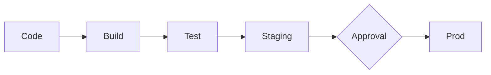

---
tags:
  - formation
  - devops
  - glossaire
  - definitions
---

# Glossaire DevOps

Ce glossaire regroupe les termes essentiels du monde DevOps. Utilisez-le comme référence rapide pendant et après la formation.

## A

### Artefact
Fichier produit par un build ou un pipeline CI/CD (binaire, package, image Docker). Les artefacts sont versionnés et stockés pour déploiement.

```yaml
# Exemple GitHub Actions
- uses: actions/upload-artifact@v4
  with:
    name: app-build
    path: dist/
```

### Automatisation
Principe fondamental DevOps : remplacer les tâches manuelles répétitives par des scripts et pipelines. Réduit les erreurs humaines et accélère les livraisons.

## B

### Branch (Branche)
Ligne de développement parallèle dans Git. Permet de travailler sur une feature sans impacter le code principal (`main`).

```bash
git switch -c feature/login  # Créer et basculer
git branch -d feature/login  # Supprimer après merge
```

### Build
Processus de compilation/packaging du code source en artefact déployable. Étape centrale du pipeline CI.

## C

### CD (Continuous Delivery)
Pratique d'automatisation où chaque changement est **prêt à être déployé** en production après validation manuelle.



### CD (Continuous Deployment)
Extension du Continuous Delivery où le déploiement en production est **automatique** (sans validation manuelle).

### CI (Continuous Integration)
Pratique de merger fréquemment le code dans une branche partagée, avec build et tests automatiques à chaque push.

### Commit
Snapshot du code à un instant T dans Git. Chaque commit a un identifiant unique (SHA) et un message descriptif.

```bash
git commit -m "feat: Ajout authentification OAuth"
```

### Conventional Commits
Convention de nommage des commits pour un historique lisible et automatisation (changelog, versioning).

| Préfixe | Usage |
|---------|-------|
| `feat:` | Nouvelle fonctionnalité |
| `fix:` | Correction de bug |
| `docs:` | Documentation |
| `chore:` | Maintenance |
| `ci:` | Pipeline CI/CD |
| `refactor:` | Refactoring sans changement fonctionnel |

## D

### Deploy (Déploiement)
Action de mettre du code en environnement (staging, production). Peut être manuel ou automatisé.

### DevOps
Culture et pratiques unissant **Dev**eloppement et **Op**erations pour livrer du logiciel plus rapidement et de manière plus fiable.

**Piliers DevOps :**

- Automatisation
- Collaboration
- Intégration Continue
- Livraison Continue
- Monitoring
- Feedback loops

### Dockerfile
Fichier de configuration pour construire une image Docker. Définit l'environnement d'exécution d'une application.

```dockerfile
FROM python:3.11-slim
WORKDIR /app
COPY . .
RUN pip install -r requirements.txt
CMD ["python", "app.py"]
```

## E

### Environment (Environnement)
Instance d'infrastructure où le code s'exécute : développement, staging, production.

| Env | Usage |
|-----|-------|
| **dev** | Développeurs locaux |
| **staging** | Tests pré-production |
| **prod** | Utilisateurs finaux |

## F

### Fail Fast
Principe de conception où les erreurs sont détectées le plus tôt possible dans le pipeline. Le linting avant les tests est un exemple.

### Feature Branch
Branche Git dédiée au développement d'une fonctionnalité spécifique. Fusionnée dans `main` via Pull Request après review.

### Feature Flag
Mécanisme permettant d'activer/désactiver une fonctionnalité sans redéploiement. Utile pour les releases progressives.

## G

### Git
Système de contrôle de version distribué. Standard de facto pour le versioning de code.

### Git Flow
Stratégie de branching avec 5 types de branches : `main`, `develop`, `feature/*`, `release/*`, `hotfix/*`. Adapté aux releases planifiées.

### GitHub Actions
Plateforme CI/CD intégrée à GitHub. Définition des workflows en YAML.

```yaml
on: [push]
jobs:
  build:
    runs-on: ubuntu-latest
    steps:
      - uses: actions/checkout@v4
      - run: npm test
```

### GitHub Flow
Stratégie de branching simplifiée : `main` + feature branches. Adapté au déploiement continu.

### GitOps
Pratique où Git est la **source de vérité** pour l'infrastructure et les applications. Tout changement passe par un commit Git.

## H

### Hook (Git Hook)
Script exécuté automatiquement lors d'événements Git (pre-commit, post-merge). Permet la validation locale avant push.

```bash
# .git/hooks/pre-commit
#!/bin/bash
shellcheck scripts/*.sh
```

### Hotfix
Correction urgente d'un bug en production. Dans Git Flow, les hotfixes partent de `main` et sont mergés dans `main` ET `develop`.

## I

### IaC (Infrastructure as Code)
Pratique de gérer l'infrastructure via du code versionné (Terraform, Ansible, Pulumi) plutôt que manuellement.

### Image (Docker)
Template immuable pour créer des conteneurs. Construite à partir d'un Dockerfile.

## J

### Job
Unité d'exécution dans un pipeline CI/CD. Un workflow contient plusieurs jobs qui peuvent s'exécuter en parallèle ou séquentiellement.

```yaml
jobs:
  lint:
    runs-on: ubuntu-latest
  test:
    runs-on: ubuntu-latest
    needs: lint  # Séquentiel
```

## L

### Linting
Analyse statique du code pour détecter erreurs de syntaxe, mauvaises pratiques, et problèmes de style **sans exécuter** le code.

| Langage | Linter |
|---------|--------|
| Bash | ShellCheck |
| YAML | yamllint |
| Python | pylint, flake8 |
| JavaScript | ESLint |

## M

### Main (Branche)
Branche principale d'un repository Git. Contient le code stable, prêt pour production.

### Merge
Action de fusionner une branche dans une autre. Peut être fast-forward (linéaire) ou avec merge commit (divergence).

```bash
git merge feature/login
```

### Merge Conflict
Situation où Git ne peut pas fusionner automatiquement car les mêmes lignes ont été modifiées dans les deux branches.

## O

### Observability (Observabilité)
Capacité à comprendre l'état interne d'un système via ses outputs : logs, métriques, traces.

## P

### Pipeline
Séquence automatisée d'étapes (build, test, deploy) déclenchée par un événement (push, PR, schedule).

### Pull Request (PR)
Demande de fusion d'une branche dans une autre. Permet la code review et la validation par le pipeline avant merge.

### Push
Action d'envoyer des commits locaux vers un repository distant.

```bash
git push origin main
```

## Q

### Quality Gate
Point de contrôle dans le pipeline qui bloque la progression si des critères ne sont pas respectés (tests, couverture, linting).

**Principe : "Red Pipeline = No Merge"**

## R

### Rebase
Alternative au merge : réécrit l'historique en appliquant les commits d'une branche sur une autre. Produit un historique linéaire.

```bash
git rebase main  # Attention : réécrit l'historique
```

### Release
Version packagée et taggée du logiciel, prête pour déploiement.

```bash
git tag v1.0.0
git push origin v1.0.0
```

### Repository (Repo)
Dépôt Git contenant le code source, l'historique des commits, et les branches.

### Rollback
Action de revenir à une version précédente en cas de problème avec le déploiement actuel.

### Runner
Machine (physique ou virtuelle) qui exécute les jobs d'un pipeline CI/CD. GitHub propose des runners hébergés (`ubuntu-latest`).

## S

### SemVer (Semantic Versioning)
Convention de versioning : `MAJOR.MINOR.PATCH`

- **MAJOR** : Breaking changes
- **MINOR** : Nouvelles features (rétrocompatible)
- **PATCH** : Bug fixes

Exemple : `v2.1.3`

### Shift Left
Principe de déplacer les tests et validations le plus tôt possible dans le cycle de développement (vers la "gauche" de la timeline).

### Stage (Zone de Staging Git)
Zone intermédiaire où les fichiers sont préparés avant un commit.

```bash
git add file.txt      # Working → Staging
git commit -m "msg"   # Staging → Repository
```

### Staging (Environnement)
Environnement de pré-production pour les tests finaux avant le déploiement en production.

## T

### Tag
Marqueur Git pour identifier une version spécifique du code. Utilisé pour les releases.

```bash
git tag -a v1.0.0 -m "Release 1.0.0"
```

### Test
Vérification automatisée du comportement du code. Types : unitaire, intégration, E2E.

### Trigger
Événement qui déclenche l'exécution d'un pipeline (push, pull_request, schedule, workflow_dispatch).

## W

### Workflow
Ensemble de jobs formant un pipeline CI/CD complet. Défini en YAML pour GitHub Actions.

### Working Directory
Répertoire local où vous modifiez les fichiers. Première des 3 zones Git.

## Y

### YAML
Format de sérialisation de données utilisé pour les fichiers de configuration CI/CD, Kubernetes, Ansible.

```yaml
name: CI Pipeline
on: [push]
jobs:
  build:
    runs-on: ubuntu-latest
```

---

## Acronymes Courants

| Acronyme | Signification |
|----------|---------------|
| **CI** | Continuous Integration |
| **CD** | Continuous Delivery / Deployment |
| **IaC** | Infrastructure as Code |
| **PR** | Pull Request |
| **MR** | Merge Request (GitLab) |
| **SemVer** | Semantic Versioning |
| **YAML** | YAML Ain't Markup Language |
| **SHA** | Secure Hash Algorithm (ID commit) |
| **E2E** | End-to-End (tests) |
| **SAST** | Static Application Security Testing |
| **DAST** | Dynamic Application Security Testing |

---

**Retour au :** [Programme de la Formation](index.md) | [Catalogue](../index.md)
