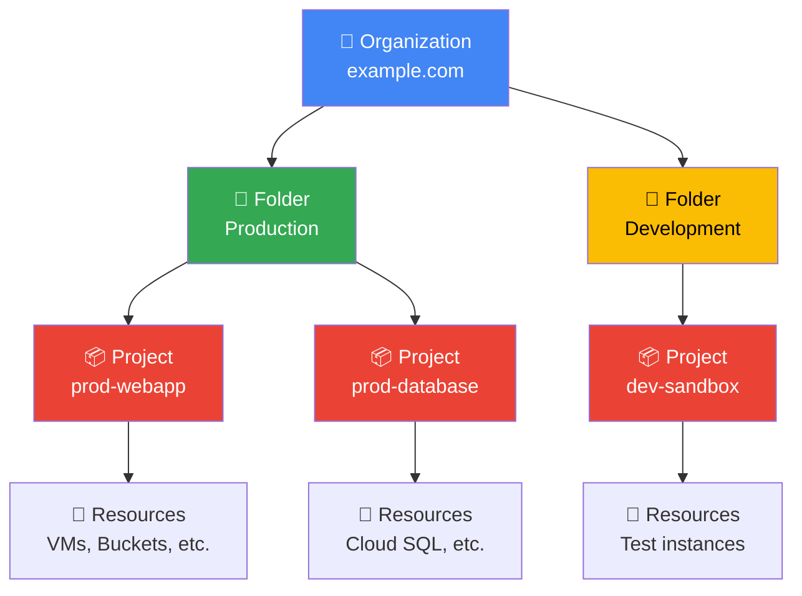
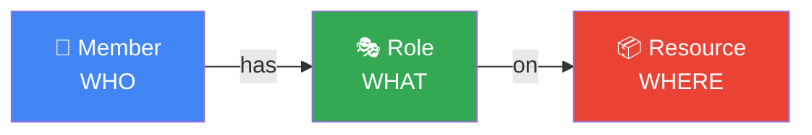
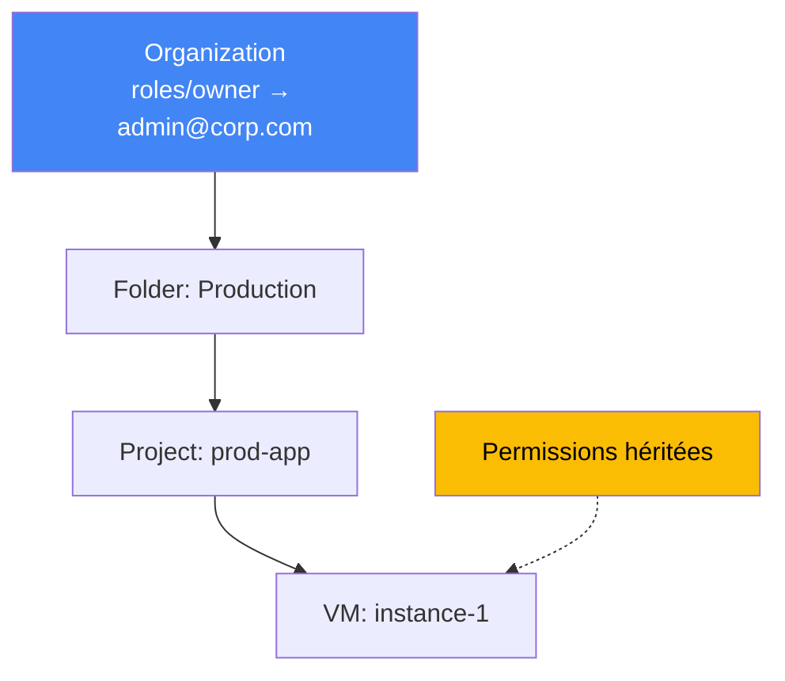
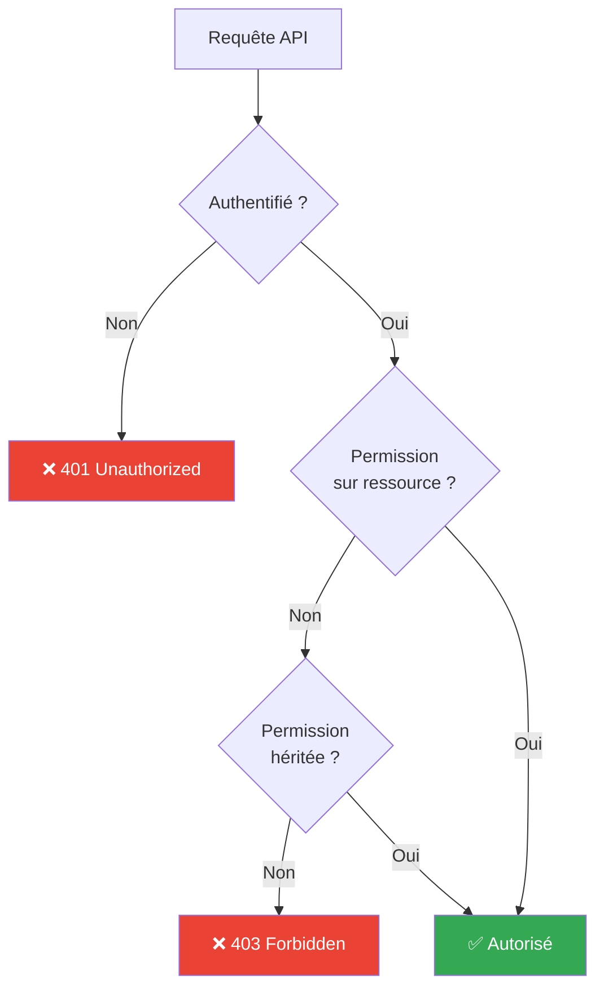
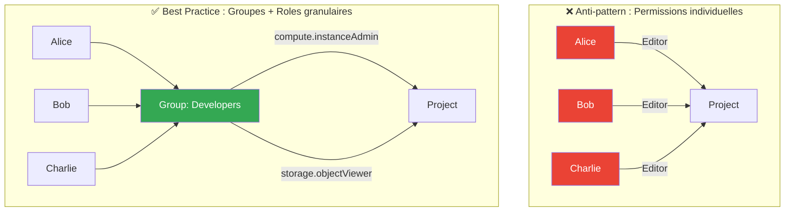
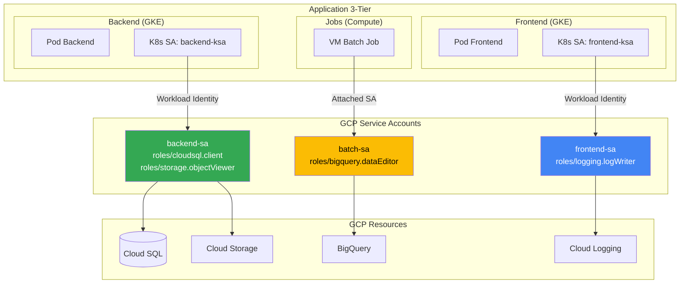

---
tags:
  - formation
  - gcp
  - iam
  - console
  - gcloud
  - security
---

# Module 1 : Console GCP, Projets & IAM

## Objectifs du Module

À la fin de ce module, vous serez capable de :

- :material-folder-account: Comprendre la hiérarchie Organisation → Folders → Projects
- :material-console: Naviguer efficacement dans la Console GCP
- :fontawesome-solid-user-shield: Configurer IAM avec le principe du moindre privilège
- :material-robot: Créer et utiliser des Service Accounts
- :fontawesome-solid-terminal: Maîtriser les commandes `gcloud` essentielles

---

## 1. La Hiérarchie des Ressources GCP

### Vue d'ensemble

Google Cloud organise les ressources dans une **hiérarchie à 4 niveaux** :



### Les 4 niveaux expliqués

| Niveau | Description | Exemple |
|--------|-------------|---------|
| **Organization** | Racine liée à un domaine Google Workspace ou Cloud Identity | `example.com` |
| **Folder** | Regroupement logique (département, environnement) | `Production`, `Finance` |
| **Project** | Conteneur de ressources avec billing | `my-project-123456` |
| **Resource** | Services GCP (VMs, buckets, databases) | `instance-1`, `my-bucket` |

!!! info "Sans Organisation"
    Si vous n'avez pas Google Workspace ou Cloud Identity, vos projets sont directement rattachés à votre compte Google. C'est suffisant pour l'apprentissage mais pas recommandé en entreprise.

### Le Project : Unité fondamentale

Un **Project** est l'unité de base pour :

- **Billing** : Facturation des ressources
- **IAM** : Permissions et accès
- **APIs** : Activation des services GCP
- **Quotas** : Limites de ressources

```bash
# Anatomie d'un Project
Project Name: My Web Application     # Nom lisible (modifiable)
Project ID:   my-web-app-123456      # Identifiant unique (immuable)
Project Number: 123456789012         # Numéro interne GCP
```

!!! warning "Project ID"
    Le **Project ID** est unique globalement et ne peut pas être changé après création. Choisissez-le soigneusement !

---

## 2. La Console Google Cloud

### Accès et Navigation

1. Accédez à [console.cloud.google.com](https://console.cloud.google.com)
2. Connectez-vous avec votre compte Google
3. Sélectionnez ou créez un projet

### Éléments principaux de l'interface

```
┌─────────────────────────────────────────────────────────────────┐
│  ☰  │ Google Cloud          │ 🔍 Search │ [Project ▼] │ 🔔 👤  │
├─────┼───────────────────────┴───────────┴─────────────┴────────┤
│     │                                                          │
│ N   │                    Main Content Area                     │
│ A   │                                                          │
│ V   │    - Dashboard                                           │
│     │    - Resource lists                                      │
│ M   │    - Configuration forms                                 │
│ E   │                                                          │
│ N   │                                                          │
│ U   │                                                          │
│     │                                                          │
├─────┴──────────────────────────────────────────────────────────┤
│  [>_] Activate Cloud Shell                                     │
└────────────────────────────────────────────────────────────────┘
```

### Cloud Shell : Terminal intégré

Cloud Shell est une VM Debian avec :

- `gcloud`, `kubectl`, `terraform` préinstallés
- 5 GB de stockage persistant (`$HOME`)
- Éditeur de code intégré (Theia)

```bash
# Activer Cloud Shell : cliquez sur [>_] en haut à droite

# Vérifier la configuration
gcloud config list

# Votre home directory est persistant
ls -la ~
```

!!! tip "Cloud Shell vs Installation locale"
    Cloud Shell est parfait pour débuter. Pour un usage quotidien, installez le SDK localement.

---

## 3. Installation du SDK gcloud (Local)

### Linux / macOS

```bash
# Télécharger et installer
curl https://sdk.cloud.google.com | bash

# Redémarrer le shell ou sourcer
exec -l $SHELL

# Initialiser
gcloud init
```

### Windows

```powershell
# Télécharger l'installateur
# https://cloud.google.com/sdk/docs/install#windows

# Ou via Chocolatey
choco install gcloudsdk

# Initialiser
gcloud init
```

### Configuration initiale

```bash
# Authentification interactive
gcloud auth login
# Ouvre un navigateur pour OAuth

# Définir le projet par défaut
gcloud config set project PROJECT_ID

# Définir la région/zone par défaut
gcloud config set compute/region europe-west1
gcloud config set compute/zone europe-west1-b

# Vérifier la configuration
gcloud config list
```

### Configurations multiples

```bash
# Créer une configuration nommée
gcloud config configurations create prod-config
gcloud config set project prod-project-123
gcloud config set compute/region europe-west1

# Créer une autre configuration
gcloud config configurations create dev-config
gcloud config set project dev-project-456
gcloud config set compute/region us-central1

# Lister les configurations
gcloud config configurations list

# Basculer entre configurations
gcloud config configurations activate prod-config
```

---

## 4. IAM : Identity and Access Management

### Le modèle IAM GCP

IAM répond à la question : **"Qui peut faire quoi sur quelle ressource ?"**



### Members (Qui ?)

| Type | Format | Exemple |
|------|--------|---------|
| Google Account | `user:email` | `user:alice@example.com` |
| Service Account | `serviceAccount:email` | `serviceAccount:my-sa@project.iam.gserviceaccount.com` |
| Google Group | `group:email` | `group:devops-team@example.com` |
| Google Workspace Domain | `domain:domain` | `domain:example.com` |
| All authenticated users | `allAuthenticatedUsers` | Tout compte Google |
| All users | `allUsers` | Inclut anonyme (public) |

!!! danger "allUsers"
    N'utilisez `allUsers` que pour des ressources intentionnellement publiques (sites web statiques, APIs publiques).

### Roles (Quoi ?)

#### Types de Roles

| Type | Description | Exemple |
|------|-------------|---------|
| **Basic** | Roles historiques larges | `roles/owner`, `roles/editor`, `roles/viewer` |
| **Predefined** | Roles granulaires par service | `roles/compute.instanceAdmin`, `roles/storage.objectViewer` |
| **Custom** | Roles sur mesure | `projects/my-project/roles/myCustomRole` |

#### Basic Roles (à éviter en production)

```
roles/owner    → Accès total + IAM + billing
roles/editor   → Lecture/écriture sur toutes les ressources
roles/viewer   → Lecture seule sur toutes les ressources
```

!!! warning "Basic Roles"
    Les Basic Roles sont trop permissifs. En production, utilisez des **Predefined Roles** granulaires.

#### Predefined Roles courants

```bash
# Compute Engine
roles/compute.viewer           # Voir les VMs
roles/compute.instanceAdmin.v1 # Gérer les VMs (sans réseau/firewall)
roles/compute.networkAdmin     # Gérer le réseau VPC

# Cloud Storage
roles/storage.objectViewer     # Lire les objets
roles/storage.objectCreator    # Créer des objets
roles/storage.admin            # Administration complète

# Cloud SQL
roles/cloudsql.viewer          # Voir les instances
roles/cloudsql.client          # Se connecter aux instances
roles/cloudsql.admin           # Administration complète

# GKE
roles/container.viewer         # Voir les clusters
roles/container.developer      # Déployer des workloads
roles/container.admin          # Administration complète
```

### Policies (Où ?)

Une **Policy** est un ensemble de **bindings** (membre → role) attachés à une ressource :

```yaml
# Structure d'une IAM Policy
bindings:
  - role: roles/compute.instanceAdmin.v1
    members:
      - user:alice@example.com
      - group:devops@example.com
  - role: roles/compute.viewer
    members:
      - user:bob@example.com
```

### Héritage des permissions

Les permissions sont **héritées** du haut vers le bas :



!!! info "Héritage additif"
    L'héritage est **additif** : on ne peut pas retirer une permission héritée au niveau inférieur, seulement en ajouter.

### Flux de décision IAM



### Comparaison des stratégies IAM



---

## 5. Commandes IAM avec gcloud

### Voir les permissions actuelles

```bash
# Policy IAM d'un projet
gcloud projects get-iam-policy PROJECT_ID

# Format plus lisible
gcloud projects get-iam-policy PROJECT_ID --format="table(bindings.role, bindings.members)"

# Filtrer par membre
gcloud projects get-iam-policy PROJECT_ID \
    --flatten="bindings[].members" \
    --filter="bindings.members:user:alice@example.com" \
    --format="table(bindings.role)"
```

### Ajouter des permissions

```bash
# Ajouter un role à un utilisateur
gcloud projects add-iam-policy-binding PROJECT_ID \
    --member="user:alice@example.com" \
    --role="roles/compute.instanceAdmin.v1"

# Ajouter un role à un groupe
gcloud projects add-iam-policy-binding PROJECT_ID \
    --member="group:devops@example.com" \
    --role="roles/container.developer"

# Ajouter un role à un Service Account
gcloud projects add-iam-policy-binding PROJECT_ID \
    --member="serviceAccount:my-sa@PROJECT_ID.iam.gserviceaccount.com" \
    --role="roles/storage.objectViewer"
```

### Retirer des permissions

```bash
# Retirer un role
gcloud projects remove-iam-policy-binding PROJECT_ID \
    --member="user:alice@example.com" \
    --role="roles/compute.instanceAdmin.v1"
```

---

## 6. Service Accounts

### Qu'est-ce qu'un Service Account ?

Un **Service Account** est une identité pour les **applications et services** (pas les humains) :

- VMs qui accèdent à Cloud Storage
- Applications qui appellent les APIs GCP
- Pipelines CI/CD qui déploient sur GKE

### Types de Service Accounts

| Type | Description |
|------|-------------|
| **User-managed** | Créés par vous, gérés par vous |
| **Default** | Créés automatiquement par GCP (Compute Engine, App Engine) |
| **Google-managed** | Utilisés par les services Google en interne |

!!! warning "Default Service Accounts"
    Les Service Accounts par défaut ont souvent des permissions trop larges (`roles/editor`). Créez des SA dédiés avec des permissions minimales.

### Créer un Service Account

```bash
# Créer le Service Account
gcloud iam service-accounts create my-app-sa \
    --display-name="My Application Service Account" \
    --description="SA for my web application"

# Vérifier la création
gcloud iam service-accounts list

# Email du SA : my-app-sa@PROJECT_ID.iam.gserviceaccount.com
```

### Attribuer des roles à un Service Account

```bash
# Donner accès à Cloud Storage
gcloud projects add-iam-policy-binding PROJECT_ID \
    --member="serviceAccount:my-app-sa@PROJECT_ID.iam.gserviceaccount.com" \
    --role="roles/storage.objectViewer"

# Donner accès à Cloud SQL
gcloud projects add-iam-policy-binding PROJECT_ID \
    --member="serviceAccount:my-app-sa@PROJECT_ID.iam.gserviceaccount.com" \
    --role="roles/cloudsql.client"
```

### Utiliser un Service Account

#### Option 1 : Attacher à une VM

```bash
# Créer une VM avec le Service Account
gcloud compute instances create my-vm \
    --service-account=my-app-sa@PROJECT_ID.iam.gserviceaccount.com \
    --scopes=cloud-platform

# La VM hérite des permissions du SA
# Les applications sur la VM peuvent appeler les APIs GCP sans clé
```

#### Option 2 : Clé JSON (à éviter si possible)

```bash
# Créer une clé (stockée localement)
gcloud iam service-accounts keys create key.json \
    --iam-account=my-app-sa@PROJECT_ID.iam.gserviceaccount.com

# Utiliser la clé
export GOOGLE_APPLICATION_CREDENTIALS="/path/to/key.json"
gcloud auth activate-service-account --key-file=key.json
```

!!! danger "Clés JSON"
    Les clés JSON sont un risque de sécurité :

    - Peuvent être commitées par erreur dans Git
    - N'expirent pas automatiquement
    - Difficiles à auditer

    **Préférez** : Workload Identity (GKE), Instance SA (Compute), ou OIDC (CI/CD externe).

---

## 7. Best Practices IAM

### Principe du moindre privilège

```bash
# ❌ Mauvais : Basic role trop large
gcloud projects add-iam-policy-binding PROJECT_ID \
    --member="user:dev@example.com" \
    --role="roles/editor"

# ✅ Bon : Predefined role spécifique
gcloud projects add-iam-policy-binding PROJECT_ID \
    --member="user:dev@example.com" \
    --role="roles/compute.instanceAdmin.v1"
```

### Utiliser des groupes

```bash
# ❌ Mauvais : Permissions individuelles
gcloud projects add-iam-policy-binding PROJECT_ID \
    --member="user:alice@example.com" \
    --role="roles/container.developer"
gcloud projects add-iam-policy-binding PROJECT_ID \
    --member="user:bob@example.com" \
    --role="roles/container.developer"

# ✅ Bon : Gérer via Google Groups
gcloud projects add-iam-policy-binding PROJECT_ID \
    --member="group:k8s-developers@example.com" \
    --role="roles/container.developer"
```

### Audit régulier

```bash
# Exporter la policy pour audit
gcloud projects get-iam-policy PROJECT_ID --format=json > iam-policy.json

# Rechercher les Basic Roles
gcloud projects get-iam-policy PROJECT_ID \
    --flatten="bindings[]" \
    --filter="bindings.role:(roles/owner OR roles/editor)" \
    --format="table(bindings.role, bindings.members)"

# Activer les audit logs
# Console > IAM & Admin > Audit Logs > Enable Data Access logs
```

### Architecture Service Account pour une application



---

## 8. Exercices Pratiques

### Exercice 1 : Configuration initiale

!!! example "Exercice"
    1. Créez un nouveau projet GCP nommé `gcp-training-VOTRENOM`
    2. Configurez `gcloud` pour utiliser ce projet par défaut
    3. Définissez `europe-west1` comme région par défaut
    4. Vérifiez votre configuration avec `gcloud config list`

??? quote "Solution"
    ```bash
    # Créer le projet (si vous avez les droits)
    gcloud projects create gcp-training-julien --name="GCP Training Julien"

    # Ou via la Console : https://console.cloud.google.com/projectcreate

    # Configurer gcloud
    gcloud config set project gcp-training-julien
    gcloud config set compute/region europe-west1
    gcloud config set compute/zone europe-west1-b

    # Vérifier
    gcloud config list
    # [compute]
    # region = europe-west1
    # zone = europe-west1-b
    # [core]
    # project = gcp-training-julien
    ```

### Exercice 2 : Service Account

!!! example "Exercice"
    1. Créez un Service Account `backup-sa` pour les sauvegardes
    2. Attribuez-lui uniquement le role `roles/storage.objectCreator`
    3. Listez les Service Accounts du projet
    4. Affichez les roles de ce Service Account

??? quote "Solution"
    ```bash
    # Créer le Service Account
    gcloud iam service-accounts create backup-sa \
        --display-name="Backup Service Account" \
        --description="SA for automated backups to Cloud Storage"

    # Attribuer le role
    PROJECT_ID=$(gcloud config get-value project)
    gcloud projects add-iam-policy-binding $PROJECT_ID \
        --member="serviceAccount:backup-sa@${PROJECT_ID}.iam.gserviceaccount.com" \
        --role="roles/storage.objectCreator"

    # Lister les Service Accounts
    gcloud iam service-accounts list

    # Voir les roles du SA
    gcloud projects get-iam-policy $PROJECT_ID \
        --flatten="bindings[].members" \
        --filter="bindings.members:backup-sa@" \
        --format="table(bindings.role)"
    ```

### Exercice 3 : Audit IAM

!!! example "Exercice"
    1. Listez tous les membres ayant un Basic Role sur votre projet
    2. Identifiez les Service Accounts par défaut
    3. Exportez la policy IAM complète en JSON

??? quote "Solution"
    ```bash
    PROJECT_ID=$(gcloud config get-value project)

    # Basic Roles
    gcloud projects get-iam-policy $PROJECT_ID \
        --flatten="bindings[]" \
        --filter="bindings.role:(roles/owner OR roles/editor OR roles/viewer)" \
        --format="table(bindings.role, bindings.members)"

    # Service Accounts par défaut (contiennent @developer ou compute@)
    gcloud iam service-accounts list --filter="email:developer OR email:compute@"

    # Export JSON
    gcloud projects get-iam-policy $PROJECT_ID --format=json > iam-audit.json
    cat iam-audit.json
    ```

### Exercice 4 : Custom Role (avancé)

!!! example "Exercice"
    Créez un Custom Role `customStorageReader` qui permet uniquement de :

    - Lister les buckets
    - Lister les objets dans un bucket
    - Télécharger des objets

    Mais PAS de supprimer ou modifier.

??? quote "Solution"
    ```bash
    PROJECT_ID=$(gcloud config get-value project)

    # Créer le custom role
    gcloud iam roles create customStorageReader \
        --project=$PROJECT_ID \
        --title="Custom Storage Reader" \
        --description="Read-only access to Cloud Storage without delete" \
        --permissions=storage.buckets.list,storage.buckets.get,storage.objects.list,storage.objects.get \
        --stage=GA

    # Vérifier
    gcloud iam roles describe customStorageReader --project=$PROJECT_ID

    # Utiliser le custom role
    gcloud projects add-iam-policy-binding $PROJECT_ID \
        --member="user:reader@example.com" \
        --role="projects/${PROJECT_ID}/roles/customStorageReader"
    ```

### Exercice 5 : Simulation de scénario entreprise

!!! example "Exercice"
    Vous êtes Cloud Admin. Configurez les accès pour :

    1. **Équipe Dev** (groupe `devs@company.com`) :
        - Créer/gérer des VMs dans le projet `dev-sandbox`
        - Accès lecture aux logs

    2. **Équipe Ops** (groupe `ops@company.com`) :
        - Accès complet au monitoring
        - Peut redémarrer les VMs (mais pas les supprimer)

    3. **Service Account CI/CD** (`cicd-sa`) :
        - Peut déployer sur GKE
        - Peut push des images vers Artifact Registry

??? quote "Solution"
    ```bash
    PROJECT_ID="dev-sandbox"

    # Équipe Dev
    gcloud projects add-iam-policy-binding $PROJECT_ID \
        --member="group:devs@company.com" \
        --role="roles/compute.instanceAdmin.v1"

    gcloud projects add-iam-policy-binding $PROJECT_ID \
        --member="group:devs@company.com" \
        --role="roles/logging.viewer"

    # Équipe Ops
    gcloud projects add-iam-policy-binding $PROJECT_ID \
        --member="group:ops@company.com" \
        --role="roles/monitoring.admin"

    gcloud projects add-iam-policy-binding $PROJECT_ID \
        --member="group:ops@company.com" \
        --role="roles/compute.instanceAdmin.v1"  # Inclut restart

    # CI/CD Service Account
    gcloud iam service-accounts create cicd-sa \
        --display-name="CI/CD Pipeline SA"

    gcloud projects add-iam-policy-binding $PROJECT_ID \
        --member="serviceAccount:cicd-sa@${PROJECT_ID}.iam.gserviceaccount.com" \
        --role="roles/container.developer"

    gcloud projects add-iam-policy-binding $PROJECT_ID \
        --member="serviceAccount:cicd-sa@${PROJECT_ID}.iam.gserviceaccount.com" \
        --role="roles/artifactregistry.writer"
    ```

---

## Exercice : À Vous de Jouer

!!! example "Mise en Pratique"
    **Objectif** : Configurer un environnement multi-projets avec une gouvernance IAM complète

    **Contexte** : Vous êtes administrateur cloud pour une entreprise qui démarre sur GCP. L'entreprise a besoin de trois environnements (dev, staging, prod) avec une séparation stricte des accès et une traçabilité complète des actions.

    **Tâches à réaliser** :

    1. Créer trois projets GCP : `mon-app-dev`, `mon-app-staging`, `mon-app-prod`
    2. Configurer des configurations gcloud séparées pour chaque environnement
    3. Créer trois Service Accounts dédiés :
        - `dev-deployer-sa` pour les déploiements en dev
        - `staging-deployer-sa` pour les déploiements en staging
        - `prod-readonly-sa` pour la lecture seule en production
    4. Configurer les rôles IAM appropriés pour chaque Service Account
    5. Créer un groupe Google `devops-team@votredomaine.com` et lui donner accès aux trois environnements avec des permissions différenciées
    6. Activer les audit logs sur les trois projets
    7. Effectuer un audit de sécurité et générer un rapport listant tous les membres avec des Basic Roles

    **Critères de validation** :

    - [ ] Les trois projets sont créés et configurés
    - [ ] Les Service Accounts ont uniquement les permissions nécessaires (principe du moindre privilège)
    - [ ] Le groupe devops-team a `roles/editor` sur dev, `roles/viewer` sur staging, et `roles/viewer` sur prod
    - [ ] Aucun utilisateur individuel n'a de permissions directes (tout passe par des groupes)
    - [ ] Les audit logs sont activés et accessibles dans Cloud Logging
    - [ ] Le rapport d'audit identifie tous les Basic Roles (si présents)

??? quote "Solution"
    **Étape 1 : Création des projets**

    ```bash
    # Définir les variables
    PREFIX="mon-app"
    ENVIRONMENTS=("dev" "staging" "prod")

    # Créer les projets
    for ENV in "${ENVIRONMENTS[@]}"; do
        PROJECT_ID="${PREFIX}-${ENV}"
        gcloud projects create $PROJECT_ID --name="${PREFIX^^} ${ENV^}"
        echo "✓ Projet $PROJECT_ID créé"
    done
    ```

    **Étape 2 : Configurations gcloud**

    ```bash
    # Créer une configuration par environnement
    for ENV in "${ENVIRONMENTS[@]}"; do
        PROJECT_ID="${PREFIX}-${ENV}"

        gcloud config configurations create ${PREFIX}-${ENV}
        gcloud config set project $PROJECT_ID --configuration=${PREFIX}-${ENV}
        gcloud config set compute/region europe-west1 --configuration=${PREFIX}-${ENV}
        gcloud config set compute/zone europe-west1-b --configuration=${PREFIX}-${ENV}

        echo "✓ Configuration ${PREFIX}-${ENV} créée"
    done

    # Lister les configurations
    gcloud config configurations list

    # Basculer vers une configuration
    gcloud config configurations activate mon-app-dev
    ```

    **Étape 3 : Service Accounts**

    ```bash
    # Dev deployer
    gcloud iam service-accounts create dev-deployer-sa \
        --project=mon-app-dev \
        --display-name="Dev Deployer Service Account"

    gcloud projects add-iam-policy-binding mon-app-dev \
        --member="serviceAccount:dev-deployer-sa@mon-app-dev.iam.gserviceaccount.com" \
        --role="roles/compute.admin"

    gcloud projects add-iam-policy-binding mon-app-dev \
        --member="serviceAccount:dev-deployer-sa@mon-app-dev.iam.gserviceaccount.com" \
        --role="roles/container.developer"

    # Staging deployer
    gcloud iam service-accounts create staging-deployer-sa \
        --project=mon-app-staging \
        --display-name="Staging Deployer Service Account"

    gcloud projects add-iam-policy-binding mon-app-staging \
        --member="serviceAccount:staging-deployer-sa@mon-app-staging.iam.gserviceaccount.com" \
        --role="roles/compute.instanceAdmin.v1"

    gcloud projects add-iam-policy-binding mon-app-staging \
        --member="serviceAccount:staging-deployer-sa@mon-app-staging.iam.gserviceaccount.com" \
        --role="roles/container.developer"

    # Prod readonly
    gcloud iam service-accounts create prod-readonly-sa \
        --project=mon-app-prod \
        --display-name="Production Read-Only Service Account"

    gcloud projects add-iam-policy-binding mon-app-prod \
        --member="serviceAccount:prod-readonly-sa@mon-app-prod.iam.gserviceaccount.com" \
        --role="roles/viewer"
    ```

    **Étape 4 : Configuration du groupe DevOps**

    ```bash
    # Permissions pour le groupe DevOps
    GROUP_EMAIL="devops-team@votredomaine.com"

    # Dev: Editor
    gcloud projects add-iam-policy-binding mon-app-dev \
        --member="group:${GROUP_EMAIL}" \
        --role="roles/editor"

    # Staging: Viewer + Compute Viewer
    gcloud projects add-iam-policy-binding mon-app-staging \
        --member="group:${GROUP_EMAIL}" \
        --role="roles/viewer"

    gcloud projects add-iam-policy-binding mon-app-staging \
        --member="group:${GROUP_EMAIL}" \
        --role="roles/compute.viewer"

    # Prod: Viewer seulement
    gcloud projects add-iam-policy-binding mon-app-prod \
        --member="group:${GROUP_EMAIL}" \
        --role="roles/viewer"
    ```

    **Étape 5 : Activer les audit logs**

    ```bash
    # Les audit logs Admin Activity sont activés par défaut
    # Pour Data Access logs, il faut les activer via la Console ou une policy

    # Vérifier les audit logs
    for ENV in "${ENVIRONMENTS[@]}"; do
        PROJECT_ID="${PREFIX}-${ENV}"
        echo "=== Audit logs pour $PROJECT_ID ==="
        gcloud logging read "logName:cloudaudit.googleapis.com" \
            --project=$PROJECT_ID \
            --limit=5 \
            --format="table(timestamp,protoPayload.methodName,protoPayload.authenticationInfo.principalEmail)"
    done
    ```

    **Étape 6 : Audit de sécurité**

    ```bash
    # Script d'audit
    cat > audit-iam.sh << 'SCRIPT'
    #!/bin/bash

    echo "=== AUDIT IAM MULTI-PROJETS ==="
    echo ""

    for PROJECT in mon-app-dev mon-app-staging mon-app-prod; do
        echo "━━━━━━━━━━━━━━━━━━━━━━━━━━━━━━━━━━━━━━━━━"
        echo "Projet: $PROJECT"
        echo "━━━━━━━━━━━━━━━━━━━━━━━━━━━━━━━━━━━━━━━━━"

        # Basic Roles (à éviter)
        echo ""
        echo "⚠️  BASIC ROLES (à remplacer) :"
        gcloud projects get-iam-policy $PROJECT \
            --flatten="bindings[]" \
            --filter="bindings.role:(roles/owner OR roles/editor OR roles/viewer)" \
            --format="table(bindings.role, bindings.members)" \
            2>/dev/null || echo "Aucun Basic Role trouvé"

        # Service Accounts
        echo ""
        echo "🤖 SERVICE ACCOUNTS :"
        gcloud iam service-accounts list --project=$PROJECT \
            --format="table(email,displayName)" 2>/dev/null

        # Membres avec permissions
        echo ""
        echo "👥 TOUS LES MEMBRES :"
        gcloud projects get-iam-policy $PROJECT \
            --flatten="bindings[]" \
            --format="table(bindings.members, bindings.role)" | head -20

        echo ""
    done
    SCRIPT

    chmod +x audit-iam.sh
    ./audit-iam.sh
    ```

    **Validation finale**

    ```bash
    # Vérifier la configuration complète
    echo "=== VALIDATION ==="

    # 1. Projets créés
    echo "Projets :"
    gcloud projects list --filter="projectId:mon-app-*"

    # 2. Configurations gcloud
    echo ""
    echo "Configurations gcloud :"
    gcloud config configurations list

    # 3. Service Accounts
    echo ""
    echo "Service Accounts par projet :"
    for ENV in dev staging prod; do
        echo "  - mon-app-$ENV :"
        gcloud iam service-accounts list --project=mon-app-$ENV \
            --format="value(email)" --filter="email~deployer OR email~readonly"
    done

    # 4. Test de basculement
    echo ""
    echo "Test de basculement d'environnement :"
    gcloud config configurations activate mon-app-dev
    echo "  Config active : $(gcloud config configurations list --filter='is_active:true' --format='value(name)')"
    echo "  Projet actuel : $(gcloud config get-value project)"
    ```

---

## 9. Quiz de validation

!!! question "Question 1"
    Quel est le niveau de la hiérarchie GCP où la facturation est gérée ?

    - [ ] Organization
    - [ ] Folder
    - [x] Project
    - [ ] Resource

!!! question "Question 2"
    Quel type de role IAM est recommandé en production ?

    - [ ] Basic Roles
    - [x] Predefined Roles
    - [ ] Custom Roles
    - [ ] All of the above

!!! question "Question 3"
    Comment une VM peut-elle accéder à Cloud Storage sans clé JSON ?

    - [ ] Via les credentials de l'utilisateur qui l'a créée
    - [x] Via un Service Account attaché à la VM
    - [ ] Via le default service account avec roles/editor
    - [ ] Ce n'est pas possible

---

## Résumé du Module

| Concept | Points clés |
|---------|-------------|
| **Hiérarchie** | Organization → Folders → Projects → Resources |
| **Project** | Unité de billing, IAM, APIs (Project ID immuable) |
| **IAM** | Member + Role + Resource = Permission |
| **Roles** | Préférer Predefined, éviter Basic |
| **Service Accounts** | Identités pour applications, pas pour humains |
| **Best Practices** | Moindre privilège, groupes, audit régulier |

---

**[← Retour au Programme](index.md)** | **[Continuer vers le Module 2 : Compute Engine →](02-module.md)**

---

**Retour au :** [Programme de la Formation](index.md) | [Catalogue des Formations](../index.md)
