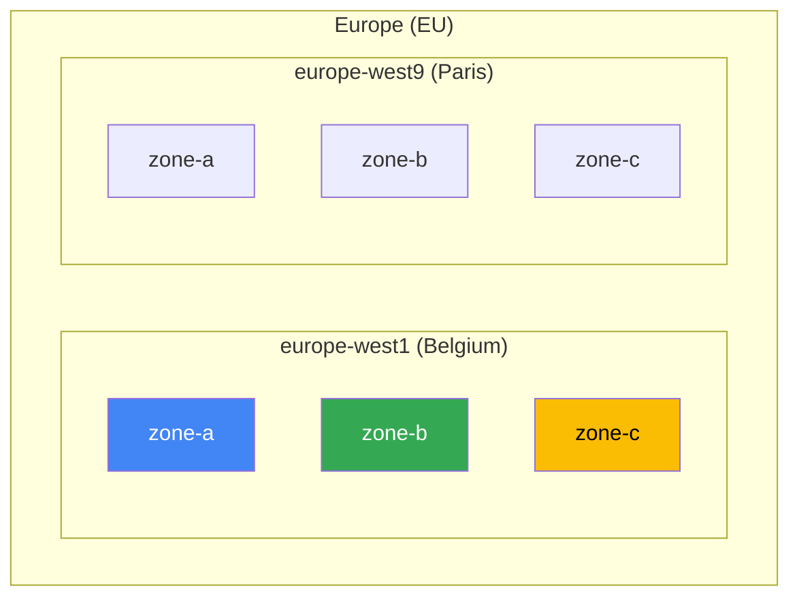
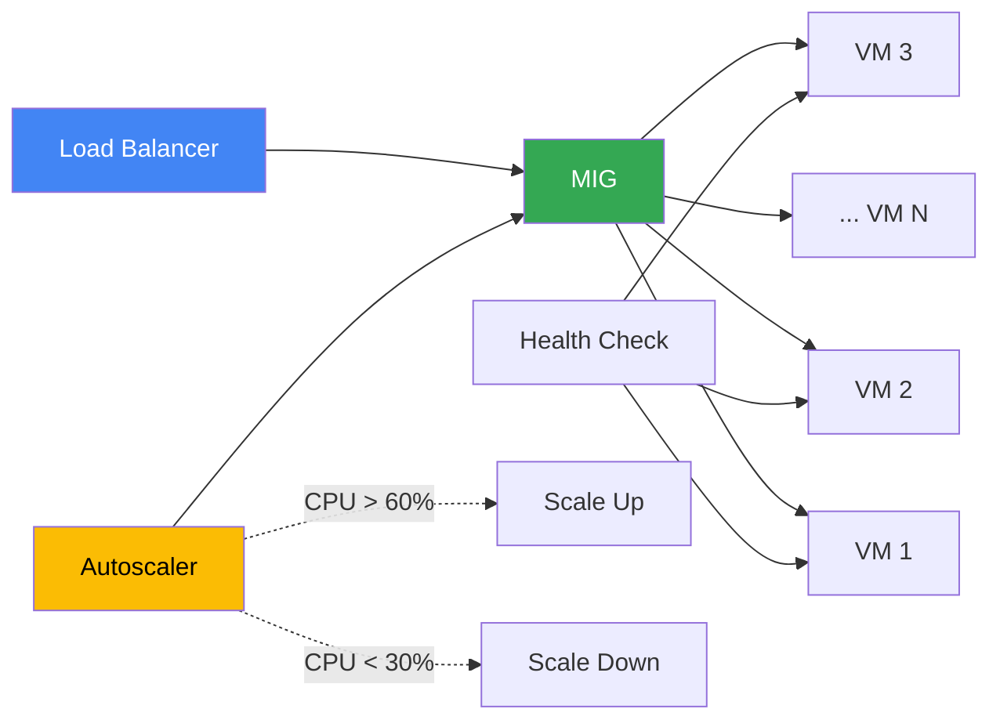
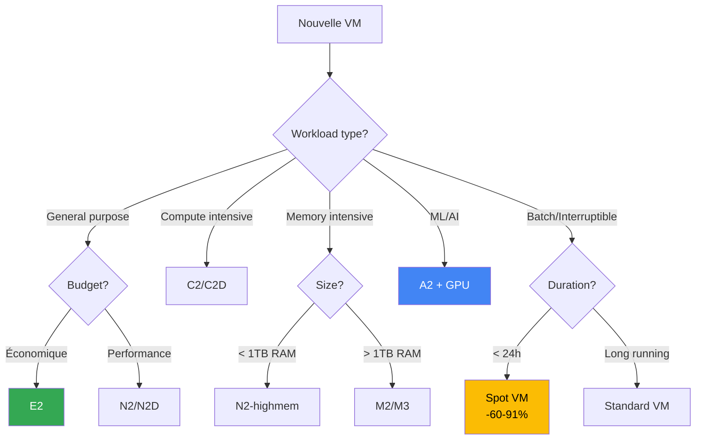

---
tags:
  - formation
  - gcp
  - compute-engine
  - vm
  - instance-groups
  - autoscaling
---

# Module 2 : Compute Engine - VMs dans le Cloud

## Objectifs du Module

À la fin de ce module, vous serez capable de :

- :fontawesome-solid-server: Créer des VMs avec différents machine types
- :fontawesome-solid-hard-drive: Gérer les disques (Persistent Disks, snapshots)
- :material-file-document: Utiliser startup scripts et metadata
- :fontawesome-solid-copy: Créer des Instance Templates réutilisables
- :material-trending-up: Configurer des Managed Instance Groups avec autoscaling

---

## 1. Concepts Fondamentaux

### Qu'est-ce que Compute Engine ?

Compute Engine est le service **IaaS** (Infrastructure as a Service) de GCP pour les machines virtuelles :

- VMs Linux ou Windows
- Machines customs ou prédéfinies
- Facturation à la seconde (minimum 1 minute)
- SLA 99.99% pour les instances individuelles

### Régions et Zones



| Concept | Description | Exemple |
|---------|-------------|---------|
| **Region** | Zone géographique (data centers proches) | `europe-west1` (Belgique) |
| **Zone** | Data center individuel dans une région | `europe-west1-b` |

!!! tip "Choix de région"
    - **Latence** : Choisir proche des utilisateurs
    - **Prix** : Varie selon les régions (~10-20%)
    - **Services** : Certains services pas disponibles partout
    - **Conformité** : RGPD → préférer régions EU

---

## 2. Machine Types

### Familles de machines

| Famille | Usage | vCPU | Mémoire |
|---------|-------|------|---------|
| **E2** | Usage général, économique | 2-32 | 0.5-128 GB |
| **N2/N2D** | Usage général, balanced | 2-128 | 0.5-864 GB |
| **C2/C2D** | Compute-intensive | 4-112 | 8-896 GB |
| **M2/M3** | Memory-intensive | 12-416 | 340 GB-12 TB |
| **A2** | GPU (ML/AI) | 12-96 | 85-1360 GB |
| **T2D** | Scale-out workloads (AMD) | 1-60 | 1-240 GB |

### Nomenclature

```
e2-standard-4
│    │       │
│    │       └── 4 vCPUs
│    └────────── standard (ratio mémoire/CPU équilibré)
└─────────────── E2 (famille)

Variations:
- standard : 4 GB/vCPU
- highmem  : 8 GB/vCPU
- highcpu  : 0.9 GB/vCPU
```

### Lister les machine types disponibles

```bash
# Tous les types dans une zone
gcloud compute machine-types list --zones=europe-west1-b

# Filtrer par famille
gcloud compute machine-types list --zones=europe-west1-b \
    --filter="name~^e2"

# Détails d'un type
gcloud compute machine-types describe e2-standard-4 \
    --zone=europe-west1-b
```

### Custom Machine Types

```bash
# Machine custom : 6 vCPU, 24 GB RAM
gcloud compute instances create my-custom-vm \
    --custom-cpu=6 \
    --custom-memory=24GB \
    --zone=europe-west1-b
```

---

## 3. Images

### Images publiques

```bash
# Lister les familles d'images
gcloud compute images list --no-standard-images

# Images Debian/Ubuntu
gcloud compute images list --filter="family~debian OR family~ubuntu"

# Images RHEL/Rocky
gcloud compute images list --filter="family~rhel OR family~rocky"

# Images Windows
gcloud compute images list --filter="family~windows"
```

### Images courantes

| OS | Image Family | Project |
|----|--------------|---------|
| Debian 12 | `debian-12` | `debian-cloud` |
| Ubuntu 22.04 LTS | `ubuntu-2204-lts` | `ubuntu-os-cloud` |
| Rocky Linux 9 | `rocky-linux-9` | `rocky-linux-cloud` |
| RHEL 9 | `rhel-9` | `rhel-cloud` |
| Windows Server 2022 | `windows-2022` | `windows-cloud` |

### Images custom

```bash
# Créer une image depuis un disque
gcloud compute images create my-golden-image \
    --source-disk=my-configured-vm \
    --source-disk-zone=europe-west1-b \
    --family=my-app-images \
    --description="Image with app v1.2.3 preinstalled"

# Utiliser l'image
gcloud compute instances create new-vm \
    --image=my-golden-image
```

---

## 4. Créer des Instances

### Via gcloud CLI

```bash
# Instance basique
gcloud compute instances create my-vm \
    --zone=europe-west1-b \
    --machine-type=e2-medium \
    --image-family=debian-12 \
    --image-project=debian-cloud

# Instance avec options
gcloud compute instances create web-server \
    --zone=europe-west1-b \
    --machine-type=e2-standard-2 \
    --image-family=ubuntu-2204-lts \
    --image-project=ubuntu-os-cloud \
    --boot-disk-size=50GB \
    --boot-disk-type=pd-ssd \
    --tags=http-server,https-server \
    --metadata=enable-oslogin=true
```

### Startup Scripts

Les startup scripts s'exécutent au premier démarrage :

```bash
# Script inline
gcloud compute instances create web-server \
    --zone=europe-west1-b \
    --machine-type=e2-small \
    --image-family=debian-12 \
    --image-project=debian-cloud \
    --metadata=startup-script='#!/bin/bash
apt-get update
apt-get install -y nginx
systemctl enable nginx
systemctl start nginx
echo "Hello from $(hostname)" > /var/www/html/index.html'

# Script depuis un fichier
gcloud compute instances create web-server \
    --zone=europe-west1-b \
    --metadata-from-file=startup-script=startup.sh

# Script depuis Cloud Storage
gcloud compute instances create web-server \
    --zone=europe-west1-b \
    --metadata=startup-script-url=gs://my-bucket/startup.sh
```

### Metadata

```bash
# Ajouter des metadata custom
gcloud compute instances create app-server \
    --zone=europe-west1-b \
    --metadata=environment=production,version=1.2.3

# Récupérer metadata depuis la VM
curl -H "Metadata-Flavor: Google" \
    http://metadata.google.internal/computeMetadata/v1/instance/attributes/environment

# Metadata du projet (disponible sur toutes les VMs)
gcloud compute project-info add-metadata \
    --metadata=db-host=10.0.1.5
```

---

## 5. Accès SSH

### Via gcloud (recommandé)

```bash
# SSH simple
gcloud compute ssh my-vm --zone=europe-west1-b

# SSH avec commande
gcloud compute ssh my-vm --zone=europe-west1-b --command="uptime"

# SSH avec tunnel de port
gcloud compute ssh my-vm --zone=europe-west1-b \
    --ssh-flag="-L 8080:localhost:80"

# SCP pour transférer des fichiers
gcloud compute scp ./local-file.txt my-vm:~/remote-file.txt \
    --zone=europe-west1-b
```

### OS Login (best practice)

OS Login utilise les comptes Google pour l'authentification SSH :

```bash
# Activer OS Login au niveau projet
gcloud compute project-info add-metadata \
    --metadata=enable-oslogin=TRUE

# Ou au niveau instance
gcloud compute instances add-metadata my-vm \
    --metadata=enable-oslogin=TRUE \
    --zone=europe-west1-b

# Donner l'accès SSH à un utilisateur
gcloud projects add-iam-policy-binding PROJECT_ID \
    --member="user:alice@example.com" \
    --role="roles/compute.osLogin"

# Pour accès sudo
gcloud projects add-iam-policy-binding PROJECT_ID \
    --member="user:alice@example.com" \
    --role="roles/compute.osAdminLogin"
```

---

## 6. Disques

### Types de disques

| Type | Code | IOPS | Throughput | Usage |
|------|------|------|------------|-------|
| **Standard** | `pd-standard` | 0.75/GB | 12 MB/s | Archives, backups |
| **Balanced** | `pd-balanced` | 6/GB | 28 MB/s | Usage général |
| **SSD** | `pd-ssd` | 30/GB | 48 MB/s | Databases, OLTP |
| **Extreme** | `pd-extreme` | Configurable | 1.2 GB/s | SAP HANA, Oracle |
| **Local SSD** | `local-ssd` | 900K | 9.4 GB/s | Cache, temp data |

!!! warning "Local SSD"
    Les Local SSDs sont **éphémères** : les données sont perdues si la VM s'arrête ou est préemptée.

### Gérer les disques

```bash
# Créer un disque
gcloud compute disks create data-disk \
    --zone=europe-west1-b \
    --size=100GB \
    --type=pd-ssd

# Attacher à une VM (nécessite redémarrage ou attachment à chaud)
gcloud compute instances attach-disk my-vm \
    --disk=data-disk \
    --zone=europe-west1-b

# Détacher
gcloud compute instances detach-disk my-vm \
    --disk=data-disk \
    --zone=europe-west1-b

# Redimensionner (online, sans downtime)
gcloud compute disks resize data-disk \
    --size=200GB \
    --zone=europe-west1-b
```

### Monter un disque dans la VM

```bash
# SSH dans la VM
gcloud compute ssh my-vm --zone=europe-west1-b

# Identifier le disque
lsblk
# sda      8:0    0   10G  0 disk
# └─sda1   8:1    0   10G  0 part /
# sdb      8:16   0  100G  0 disk  <- nouveau disque

# Formater (première utilisation)
sudo mkfs.ext4 -F /dev/sdb

# Monter
sudo mkdir -p /mnt/data
sudo mount /dev/sdb /mnt/data

# Montage permanent (fstab)
echo "UUID=$(sudo blkid -s UUID -o value /dev/sdb) /mnt/data ext4 defaults 0 2" | sudo tee -a /etc/fstab
```

### Snapshots

```bash
# Créer un snapshot
gcloud compute disks snapshot my-vm \
    --zone=europe-west1-b \
    --snapshot-names=my-vm-snapshot-$(date +%Y%m%d)

# Lister les snapshots
gcloud compute snapshots list

# Créer un disque depuis un snapshot
gcloud compute disks create restored-disk \
    --source-snapshot=my-vm-snapshot-20240115 \
    --zone=europe-west1-b

# Snapshot schedule (automatique)
gcloud compute resource-policies create snapshot-schedule daily-backup \
    --region=europe-west1 \
    --max-retention-days=7 \
    --start-time=02:00 \
    --daily-schedule

# Appliquer au disque
gcloud compute disks add-resource-policies my-vm \
    --resource-policies=daily-backup \
    --zone=europe-west1-b
```

---

## 7. Instance Templates

### Créer un template

```bash
# Template basique
gcloud compute instance-templates create web-template \
    --machine-type=e2-small \
    --image-family=debian-12 \
    --image-project=debian-cloud \
    --boot-disk-size=20GB \
    --boot-disk-type=pd-balanced \
    --tags=http-server \
    --metadata=startup-script='#!/bin/bash
apt-get update && apt-get install -y nginx'

# Lister les templates
gcloud compute instance-templates list

# Créer une VM depuis un template
gcloud compute instances create web-1 \
    --source-instance-template=web-template \
    --zone=europe-west1-b
```

### Templates avec Service Account

```bash
gcloud compute instance-templates create app-template \
    --machine-type=e2-medium \
    --image-family=ubuntu-2204-lts \
    --image-project=ubuntu-os-cloud \
    --service-account=my-app-sa@PROJECT_ID.iam.gserviceaccount.com \
    --scopes=cloud-platform \
    --metadata=enable-oslogin=TRUE
```

---

## 8. Managed Instance Groups (MIG)

### Créer un MIG

```bash
# MIG zonal
gcloud compute instance-groups managed create web-mig \
    --template=web-template \
    --size=3 \
    --zone=europe-west1-b

# MIG régional (multi-zone HA)
gcloud compute instance-groups managed create web-mig-regional \
    --template=web-template \
    --size=3 \
    --region=europe-west1 \
    --zones=europe-west1-b,europe-west1-c,europe-west1-d
```

### Health Checks

```bash
# Créer un health check HTTP
gcloud compute health-checks create http web-health-check \
    --port=80 \
    --request-path=/health \
    --check-interval=10s \
    --timeout=5s \
    --healthy-threshold=2 \
    --unhealthy-threshold=3

# Appliquer au MIG
gcloud compute instance-groups managed set-autohealing web-mig \
    --health-check=web-health-check \
    --initial-delay=120 \
    --zone=europe-west1-b
```

### Autoscaling

```bash
# Autoscaling basé sur CPU
gcloud compute instance-groups managed set-autoscaling web-mig \
    --zone=europe-west1-b \
    --min-num-replicas=2 \
    --max-num-replicas=10 \
    --target-cpu-utilization=0.6 \
    --cool-down-period=60

# Autoscaling basé sur Load Balancing
gcloud compute instance-groups managed set-autoscaling web-mig \
    --zone=europe-west1-b \
    --min-num-replicas=2 \
    --max-num-replicas=10 \
    --target-load-balancing-utilization=0.8
```



### Rolling Updates

```bash
# Créer un nouveau template
gcloud compute instance-templates create web-template-v2 \
    --machine-type=e2-small \
    --image-family=debian-12 \
    --image-project=debian-cloud \
    --metadata=startup-script='#!/bin/bash
apt-get update && apt-get install -y nginx
echo "Version 2.0" > /var/www/html/version.txt'

# Rolling update (mise à jour progressive)
gcloud compute instance-groups managed rolling-action start-update web-mig \
    --version=template=web-template-v2 \
    --zone=europe-west1-b \
    --max-surge=1 \
    --max-unavailable=0

# Vérifier le status
gcloud compute instance-groups managed list-instances web-mig \
    --zone=europe-west1-b
```

---

## 9. Preemptible & Spot VMs

### VMs préemptibles (économies jusqu'à 80%)

```bash
# Créer une VM préemptible
gcloud compute instances create batch-worker \
    --zone=europe-west1-b \
    --machine-type=e2-standard-4 \
    --preemptible \
    --maintenance-policy=TERMINATE \
    --no-restart-on-failure

# Spot VMs (évolution des preemptibles)
gcloud compute instances create spot-worker \
    --zone=europe-west1-b \
    --machine-type=e2-standard-4 \
    --provisioning-model=SPOT \
    --instance-termination-action=STOP
```

!!! warning "Limitations"
    - Durée max : 24h (arrêt automatique)
    - Peut être préempté à tout moment (préavis 30s)
    - Pas de SLA de disponibilité
    - Pas de live migration

**Cas d'usage** : Batch processing, CI/CD runners, rendering, ML training

### Arbre de décision : Choisir le bon type de VM



### Architecture MIG avec Load Balancer

```mermaid
graph TB
    subgraph "Internet"
        Users((Users))
    end

    subgraph "Global"
        GLB[Global HTTP(S)<br/>Load Balancer]
    end

    subgraph "europe-west1"
        subgraph "MIG EU"
            EU1[VM eu-1]
            EU2[VM eu-2]
            EU3[VM eu-3]
        end
        HC_EU[Health Check]
        AS_EU[Autoscaler<br/>CPU: 60%]
    end

    subgraph "us-central1"
        subgraph "MIG US"
            US1[VM us-1]
            US2[VM us-2]
        end
        HC_US[Health Check]
        AS_US[Autoscaler<br/>CPU: 60%]
    end

    Users --> GLB
    GLB -->|EU users| EU1
    GLB -->|EU users| EU2
    GLB -->|EU users| EU3
    GLB -->|US users| US1
    GLB -->|US users| US2

    HC_EU --> EU1
    HC_EU --> EU2
    HC_EU --> EU3
    HC_US --> US1
    HC_US --> US2

    AS_EU -.-> EU1
    AS_US -.-> US1

    style GLB fill:#4285F4,color:#fff
    style AS_EU fill:#FBBC04,color:#000
    style AS_US fill:#FBBC04,color:#000
```

---

## 10. Exercices Pratiques

### Exercice 1 : Déployer un serveur web

!!! example "Exercice"
    1. Créez une VM `web-server` avec :
        - Machine type : `e2-small`
        - Image : `debian-12`
        - Disque : 20 GB SSD
        - Tag : `http-server`
    2. Utilisez un startup script pour installer nginx
    3. Vérifiez que nginx fonctionne

??? quote "Solution"
    ```bash
    # Créer la VM
    gcloud compute instances create web-server \
        --zone=europe-west1-b \
        --machine-type=e2-small \
        --image-family=debian-12 \
        --image-project=debian-cloud \
        --boot-disk-size=20GB \
        --boot-disk-type=pd-ssd \
        --tags=http-server \
        --metadata=startup-script='#!/bin/bash
    apt-get update
    apt-get install -y nginx
    systemctl enable nginx
    systemctl start nginx
    echo "Hello from $(hostname)" > /var/www/html/index.html'

    # Créer une règle firewall (si pas déjà existante)
    gcloud compute firewall-rules create allow-http \
        --direction=INGRESS \
        --priority=1000 \
        --network=default \
        --action=ALLOW \
        --rules=tcp:80 \
        --target-tags=http-server

    # Obtenir l'IP externe
    gcloud compute instances describe web-server \
        --zone=europe-west1-b \
        --format="get(networkInterfaces[0].accessConfigs[0].natIP)"

    # Tester
    curl http://EXTERNAL_IP
    ```

### Exercice 2 : MIG avec autoscaling

!!! example "Exercice"
    1. Créez un Instance Template `stress-template` basé sur Debian
    2. Créez un MIG `stress-mig` avec 1 instance
    3. Configurez l'autoscaling (min: 1, max: 5, CPU: 50%)
    4. Générez de la charge CPU et observez le scale-up

??? quote "Solution"
    ```bash
    # Template avec stress tool
    gcloud compute instance-templates create stress-template \
        --machine-type=e2-small \
        --image-family=debian-12 \
        --image-project=debian-cloud \
        --metadata=startup-script='#!/bin/bash
    apt-get update && apt-get install -y stress-ng'

    # MIG
    gcloud compute instance-groups managed create stress-mig \
        --template=stress-template \
        --size=1 \
        --zone=europe-west1-b

    # Autoscaling
    gcloud compute instance-groups managed set-autoscaling stress-mig \
        --zone=europe-west1-b \
        --min-num-replicas=1 \
        --max-num-replicas=5 \
        --target-cpu-utilization=0.5 \
        --cool-down-period=60

    # Identifier l'instance et y accéder
    gcloud compute instance-groups managed list-instances stress-mig \
        --zone=europe-west1-b

    # SSH et générer de la charge
    gcloud compute ssh stress-mig-xxxx --zone=europe-west1-b
    stress-ng --cpu 2 --timeout 300s

    # Observer le scale-up (dans un autre terminal)
    watch -n5 "gcloud compute instance-groups managed list-instances stress-mig --zone=europe-west1-b"
    ```

### Exercice 3 : Snapshot et restauration

!!! example "Exercice"
    1. Créez un snapshot du disque de `web-server`
    2. Créez un nouveau disque depuis ce snapshot
    3. Créez une nouvelle VM utilisant ce disque

??? quote "Solution"
    ```bash
    # Créer le snapshot
    gcloud compute disks snapshot web-server \
        --zone=europe-west1-b \
        --snapshot-names=web-server-snap

    # Créer un disque depuis le snapshot
    gcloud compute disks create web-server-restored \
        --source-snapshot=web-server-snap \
        --zone=europe-west1-b

    # Créer une VM avec ce disque
    gcloud compute instances create web-server-clone \
        --zone=europe-west1-b \
        --machine-type=e2-small \
        --disk=name=web-server-restored,boot=yes

    # Vérifier
    gcloud compute ssh web-server-clone --zone=europe-west1-b \
        --command="cat /var/www/html/index.html"
    ```

### Exercice 4 : Blue-Green Deployment avec MIG

!!! example "Exercice"
    Simulez un déploiement Blue-Green :

    1. Créez deux templates : `blue-template` (v1) et `green-template` (v2)
    2. Créez un MIG avec `blue-template`
    3. Effectuez un rolling update vers `green-template`
    4. Vérifiez que le rollback fonctionne

??? quote "Solution"
    ```bash
    # Template Blue (v1)
    gcloud compute instance-templates create blue-template \
        --machine-type=e2-micro \
        --image-family=debian-12 \
        --image-project=debian-cloud \
        --metadata=startup-script='#!/bin/bash
    apt-get update && apt-get install -y nginx
    echo "<h1>Version BLUE (v1)</h1>" > /var/www/html/index.html
    systemctl start nginx'

    # Template Green (v2)
    gcloud compute instance-templates create green-template \
        --machine-type=e2-micro \
        --image-family=debian-12 \
        --image-project=debian-cloud \
        --metadata=startup-script='#!/bin/bash
    apt-get update && apt-get install -y nginx
    echo "<h1>Version GREEN (v2)</h1>" > /var/www/html/index.html
    systemctl start nginx'

    # MIG avec Blue
    gcloud compute instance-groups managed create deploy-mig \
        --template=blue-template \
        --size=3 \
        --zone=europe-west1-b

    # Attendre que les instances soient prêtes
    gcloud compute instance-groups managed wait-until --stable deploy-mig \
        --zone=europe-west1-b

    # Rolling update vers Green (canary: 1 instance d'abord)
    gcloud compute instance-groups managed rolling-action start-update deploy-mig \
        --version=template=green-template \
        --zone=europe-west1-b \
        --max-surge=1 \
        --max-unavailable=0

    # Observer le déploiement
    watch -n2 "gcloud compute instance-groups managed list-instances deploy-mig --zone=europe-west1-b"

    # Rollback si problème
    gcloud compute instance-groups managed rolling-action start-update deploy-mig \
        --version=template=blue-template \
        --zone=europe-west1-b
    ```

### Exercice 5 : Optimisation des coûts

!!! example "Exercice"
    Analysez et optimisez les coûts d'un environnement :

    1. Listez toutes les VMs avec leur type et leur statut
    2. Identifiez les VMs qui pourraient être des Spot VMs
    3. Calculez les économies potentielles
    4. Créez un script de rightsizing

??? quote "Solution"
    ```bash
    # Lister toutes les VMs avec détails
    gcloud compute instances list \
        --format="table(name,zone,machineType.basename(),status,scheduling.preemptible)"

    # Identifier les VMs sous-utilisées (nécessite monitoring)
    # Via Console : Monitoring > Dashboards > VM Instances
    # Chercher CPU < 10% sur 7 jours

    # Script de rightsizing
    cat > rightsizing.sh << 'EOF'
    #!/bin/bash
    # Analyse des recommendations de rightsizing

    PROJECT_ID=$(gcloud config get-value project)

    echo "=== VMs actuelles ==="
    gcloud compute instances list --format="table(name,machineType.basename(),zone)"

    echo ""
    echo "=== Recommendations ==="
    # Via Recommender API
    gcloud recommender recommendations list \
        --project=$PROJECT_ID \
        --location=europe-west1-b \
        --recommender=google.compute.instance.MachineTypeRecommender \
        --format="table(content.overview.resourceName,content.overview.recommendedMachineType.name)"

    echo ""
    echo "=== Économies Spot potentielles ==="
    echo "VMs batch/dev qui pourraient être Spot :"
    gcloud compute instances list \
        --filter="name~batch OR name~dev OR name~test" \
        --format="table(name,machineType.basename())"

    echo ""
    echo "Économie estimée avec Spot : 60-91% sur ces VMs"
    EOF

    chmod +x rightsizing.sh
    ./rightsizing.sh
    ```

---

## Exercice : À Vous de Jouer

!!! example "Mise en Pratique"
    **Objectif** : Déployer une infrastructure de calcul évolutive et résiliente avec autoscaling automatique

    **Contexte** : Votre équipe développe une application de traitement d'images qui doit gérer des charges variables. Pendant les heures creuses, le trafic est minimal (2-3 requêtes/minute), mais pendant les pics (campagnes marketing), le trafic peut monter à 200 requêtes/minute. Vous devez déployer une infrastructure qui s'adapte automatiquement.

    **Tâches à réaliser** :

    1. Créer un Instance Template `image-processor-template` avec :
        - Machine type : e2-standard-2
        - Image : Debian 12
        - Disque boot : 30 GB SSD
        - Script de démarrage qui installe nginx et simule un service de traitement
        - Tags réseau appropriés
    2. Créer un Managed Instance Group régional `image-processor-mig` :
        - Déployé dans 3 zones de europe-west1 (b, c, d)
        - Taille initiale : 2 instances
    3. Configurer un Health Check HTTP sur le port 80 et le path `/health`
    4. Configurer l'autoscaling avec les paramètres :
        - Min : 2 instances
        - Max : 10 instances
        - Cible CPU : 60%
        - Cool-down : 90 secondes
    5. Créer un snapshot schedule automatique pour les instances :
        - Fréquence : quotidienne à 2h00
        - Rétention : 7 jours
    6. Tester le scale-up en générant de la charge
    7. Effectuer un rolling update en changeant le message de la page d'accueil

    **Critères de validation** :

    - [ ] Le MIG démarre avec 2 instances réparties sur plusieurs zones
    - [ ] Le health check détecte correctement les instances saines
    - [ ] L'autoscaling scale-up quand la CPU dépasse 60%
    - [ ] L'autoscaling scale-down après la fin de la charge
    - [ ] Les snapshots automatiques sont configurés et fonctionnels
    - [ ] Le rolling update se déroule sans downtime
    - [ ] Les instances sont dans des zones différentes pour la haute disponibilité

??? quote "Solution"
    **Étape 1 : Créer le startup script**

    ```bash
    # Créer le script de démarrage
    cat > startup-script.sh << 'EOF'
    #!/bin/bash

    # Mise à jour et installation
    apt-get update
    apt-get install -y nginx stress-ng

    # Configuration nginx avec health check
    cat > /etc/nginx/sites-available/default << 'NGINX_CONF'
    server {
        listen 80 default_server;
        root /var/www/html;
        index index.html;

        location / {
            try_files $uri $uri/ =404;
        }

        location /health {
            access_log off;
            return 200 "healthy\n";
            add_header Content-Type text/plain;
        }

        location /process {
            # Simule un traitement CPU-intensive
            return 200 "Processing...\n";
            add_header Content-Type text/plain;
        }
    }
    NGINX_CONF

    # Page d'accueil v1
    cat > /var/www/html/index.html << 'HTML'
    <!DOCTYPE html>
    <html><head><title>Image Processor v1</title></head>
    <body style="font-family: Arial; margin: 40px;">
        <h1>Image Processor Service v1.0</h1>
        <p>Hostname: <code>HOSTNAME</code></p>
        <p>Status: <span style="color: green;">Ready</span></p>
        <p>Version: 1.0.0</p>
    </body></html>
    HTML

    sed -i "s/HOSTNAME/$(hostname)/g" /var/www/html/index.html

    # Démarrer nginx
    systemctl restart nginx
    systemctl enable nginx

    echo "Startup script completed" | systemctl status nginx
    EOF

    chmod +x startup-script.sh
    ```

    **Étape 2 : Créer l'Instance Template**

    ```bash
    # Variables
    REGION="europe-west1"
    TEMPLATE_NAME="image-processor-template"

    # Créer le template
    gcloud compute instance-templates create $TEMPLATE_NAME \
        --machine-type=e2-standard-2 \
        --image-family=debian-12 \
        --image-project=debian-cloud \
        --boot-disk-size=30GB \
        --boot-disk-type=pd-ssd \
        --tags=http-server,image-processor \
        --metadata-from-file=startup-script=startup-script.sh \
        --scopes=cloud-platform

    # Vérifier
    gcloud compute instance-templates describe $TEMPLATE_NAME
    ```

    **Étape 3 : Créer le Health Check**

    ```bash
    # Health check HTTP
    gcloud compute health-checks create http image-processor-hc \
        --port=80 \
        --request-path=/health \
        --check-interval=10s \
        --timeout=5s \
        --healthy-threshold=2 \
        --unhealthy-threshold=3

    # Vérifier
    gcloud compute health-checks describe image-processor-hc
    ```

    **Étape 4 : Créer le MIG régional**

    ```bash
    MIG_NAME="image-processor-mig"

    # Créer le MIG
    gcloud compute instance-groups managed create $MIG_NAME \
        --template=$TEMPLATE_NAME \
        --size=2 \
        --region=$REGION \
        --zones=${REGION}-b,${REGION}-c,${REGION}-d \
        --health-check=image-processor-hc \
        --initial-delay=120

    # Vérifier les instances
    gcloud compute instance-groups managed list-instances $MIG_NAME \
        --region=$REGION

    # Attendre que les instances soient prêtes
    echo "Attente du démarrage des instances..."
    sleep 60
    ```

    **Étape 5 : Configurer l'autoscaling**

    ```bash
    # Autoscaling basé sur CPU
    gcloud compute instance-groups managed set-autoscaling $MIG_NAME \
        --region=$REGION \
        --min-num-replicas=2 \
        --max-num-replicas=10 \
        --target-cpu-utilization=0.6 \
        --cool-down-period=90

    # Vérifier la configuration
    gcloud compute instance-groups managed describe $MIG_NAME \
        --region=$REGION \
        --format="yaml(autoscaler)"
    ```

    **Étape 6 : Règle firewall pour HTTP**

    ```bash
    # Si pas déjà créée
    gcloud compute firewall-rules create allow-http-image-processor \
        --direction=INGRESS \
        --priority=1000 \
        --network=default \
        --action=ALLOW \
        --rules=tcp:80 \
        --source-ranges=0.0.0.0/0 \
        --target-tags=http-server \
        2>/dev/null || echo "Règle firewall existe déjà"
    ```

    **Étape 7 : Snapshot Schedule**

    ```bash
    # Créer le snapshot schedule
    gcloud compute resource-policies create snapshot-schedule daily-snapshots \
        --region=$REGION \
        --start-time=02:00 \
        --daily-schedule \
        --max-retention-days=7 \
        --on-source-disk-delete=apply-retention-policy

    # Appliquer aux disques (via le MIG, pas directement possible)
    # Alternative : configurer via le template pour les futures instances
    echo "⚠️  Note: Pour appliquer le snapshot schedule, il faut l'attacher manuellement aux disques existants"

    # Lister les instances pour référence
    gcloud compute instance-groups managed list-instances $MIG_NAME \
        --region=$REGION \
        --format="value(instance)"
    ```

    **Étape 8 : Tester l'autoscaling**

    ```bash
    # Obtenir les IPs des instances
    echo "=== Instances du MIG ==="
    gcloud compute instance-groups managed list-instances $MIG_NAME \
        --region=$REGION \
        --format="table(instance,status,currentAction)"

    # Surveiller le MIG (dans un terminal)
    watch -n 5 'gcloud compute instance-groups managed list-instances image-processor-mig --region=europe-west1'

    # Dans un autre terminal, générer de la charge
    # Se connecter à une instance et lancer stress
    FIRST_INSTANCE=$(gcloud compute instance-groups managed list-instances $MIG_NAME \
        --region=$REGION --format="value(instance)" | head -1)

    INSTANCE_ZONE=$(gcloud compute instances list --filter="name=$FIRST_INSTANCE" --format="value(zone)")

    echo "Génération de charge sur $FIRST_INSTANCE..."
    gcloud compute ssh $FIRST_INSTANCE --zone=$INSTANCE_ZONE --command="
        sudo stress-ng --cpu 2 --timeout 300s &
        echo 'Charge CPU générée pendant 5 minutes'
    "

    # Observer le scale-up dans les logs
    echo ""
    echo "📊 Observez le scale-up dans le terminal avec 'watch'"
    echo "Les nouvelles instances devraient apparaître dans ~2-3 minutes"
    ```

    **Étape 9 : Rolling Update**

    ```bash
    # Créer une nouvelle version du template
    cat > startup-script-v2.sh << 'EOF'
    #!/bin/bash
    apt-get update
    apt-get install -y nginx stress-ng

    cat > /etc/nginx/sites-available/default << 'NGINX_CONF'
    server {
        listen 80 default_server;
        root /var/www/html;
        index index.html;
        location / { try_files $uri $uri/ =404; }
        location /health { access_log off; return 200 "healthy\n"; }
    }
    NGINX_CONF

    cat > /var/www/html/index.html << 'HTML'
    <!DOCTYPE html>
    <html><head><title>Image Processor v2</title></head>
    <body style="font-family: Arial; margin: 40px; background: #e8f5e9;">
        <h1>🚀 Image Processor Service v2.0</h1>
        <p>Hostname: <code>HOSTNAME</code></p>
        <p>Status: <span style="color: green;">✓ Ready</span></p>
        <p>Version: <strong>2.0.0 - Enhanced</strong></p>
    </body></html>
    HTML

    sed -i "s/HOSTNAME/$(hostname)/g" /var/www/html/index.html
    systemctl restart nginx && systemctl enable nginx
    EOF

    chmod +x startup-script-v2.sh

    # Nouveau template
    gcloud compute instance-templates create image-processor-template-v2 \
        --machine-type=e2-standard-2 \
        --image-family=debian-12 \
        --image-project=debian-cloud \
        --boot-disk-size=30GB \
        --boot-disk-type=pd-ssd \
        --tags=http-server,image-processor \
        --metadata-from-file=startup-script=startup-script-v2.sh \
        --scopes=cloud-platform

    # Rolling update
    gcloud compute instance-groups managed rolling-action start-update $MIG_NAME \
        --region=$REGION \
        --version=template=image-processor-template-v2 \
        --max-surge=1 \
        --max-unavailable=0

    # Suivre le progrès
    echo "📦 Rolling update en cours..."
    watch -n 10 'gcloud compute instance-groups managed list-instances image-processor-mig --region=europe-west1 --format="table(instance,status,currentAction,version.instanceTemplate.basename())"'
    ```

    **Validation finale**

    ```bash
    echo "=== VALIDATION FINALE ==="
    echo ""

    # 1. MIG status
    echo "1. Status du MIG :"
    gcloud compute instance-groups managed describe $MIG_NAME \
        --region=$REGION \
        --format="yaml(status,currentActions,targetSize)"

    # 2. Distribution des instances
    echo ""
    echo "2. Distribution des instances par zone :"
    gcloud compute instance-groups managed list-instances $MIG_NAME \
        --region=$REGION \
        --format="table(instance,zone,status)"

    # 3. Autoscaler status
    echo ""
    echo "3. Configuration autoscaler :"
    gcloud compute instance-groups managed describe $MIG_NAME \
        --region=$REGION \
        --format="yaml(autoscaler.autoscalingPolicy)"

    # 4. Health check
    echo ""
    echo "4. Status des health checks :"
    gcloud compute instance-groups managed list-instances $MIG_NAME \
        --region=$REGION \
        --format="table(instance,instanceStatus,instanceHealth[0].healthState)"

    # 5. Tester HTTP
    echo ""
    echo "5. Test HTTP des instances :"
    for INSTANCE in $(gcloud compute instance-groups managed list-instances $MIG_NAME --region=$REGION --format="value(instance)"); do
        ZONE=$(gcloud compute instances list --filter="name=$INSTANCE" --format="value(zone)")
        IP=$(gcloud compute instances describe $INSTANCE --zone=$ZONE --format="get(networkInterfaces[0].accessConfigs[0].natIP)")
        echo "  Instance $INSTANCE ($IP):"
        curl -s http://$IP | grep -o '<h1>.*</h1>' || echo "    Erreur de connexion"
    done

    echo ""
    echo "✅ Validation terminée!"
    ```

---

## 11. Nettoyage

```bash
# Supprimer les ressources créées
gcloud compute instances delete web-server web-server-clone \
    --zone=europe-west1-b --quiet

gcloud compute instance-groups managed delete stress-mig \
    --zone=europe-west1-b --quiet

gcloud compute instance-templates delete web-template stress-template --quiet

gcloud compute disks delete data-disk web-server-restored \
    --zone=europe-west1-b --quiet

gcloud compute snapshots delete web-server-snap --quiet

gcloud compute firewall-rules delete allow-http --quiet
```

---

## Résumé du Module

| Concept | Points clés |
|---------|-------------|
| **Machine Types** | E2 (économique), N2 (balanced), C2 (compute), M2 (memory) |
| **Images** | Publiques (Debian, Ubuntu, RHEL) ou custom |
| **Startup Scripts** | Automatiser la configuration au boot |
| **Disques** | pd-standard, pd-balanced, pd-ssd, local-ssd |
| **Snapshots** | Backup incrémental, restauration rapide |
| **Templates** | Configuration réutilisable pour VMs identiques |
| **MIG** | Autoscaling, health checks, rolling updates |
| **Spot/Preemptible** | -80% de coût, pour workloads interruptibles |

---

**[← Retour au Module 1](01-module.md)** | **[Continuer vers le Module 3 : Networking →](03-module.md)**

---

**Retour au :** [Programme de la Formation](index.md) | [Catalogue des Formations](../index.md)
