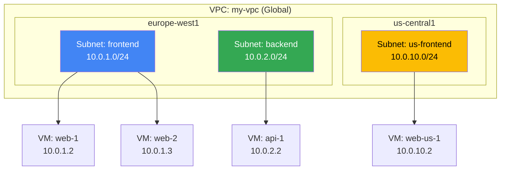
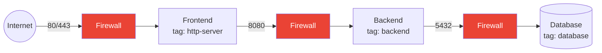
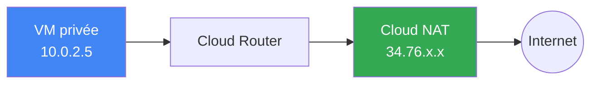
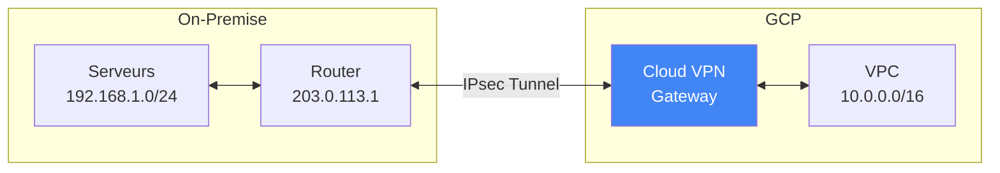
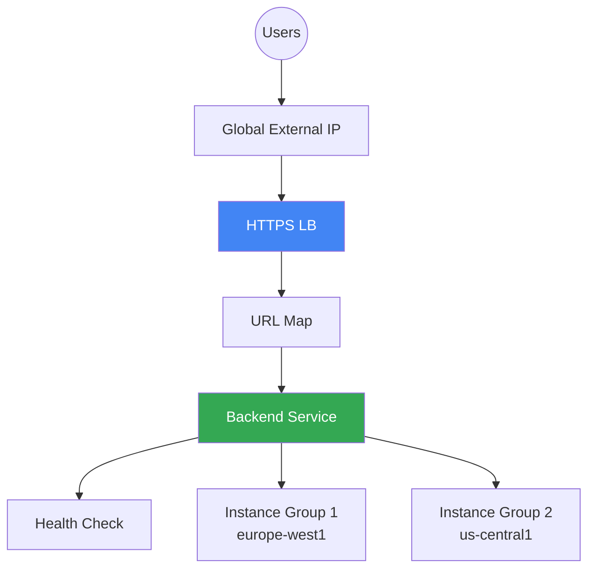

---
tags:
  - formation
  - gcp
  - vpc
  - networking
  - firewall
  - load-balancer
---

# Module 3 : Networking - VPC & Connectivité

## Objectifs du Module

À la fin de ce module, vous serez capable de :

- :material-lan: Concevoir des VPC avec subnets personnalisés
- :fontawesome-solid-shield-halved: Configurer des firewall rules granulaires
- :material-earth: Mettre en place Cloud NAT pour l'accès Internet
- :material-vpn: Établir une connectivité hybride (VPN)
- :material-scale-balance: Déployer des Load Balancers HTTP(S) et TCP

---

## 1. VPC (Virtual Private Cloud)

### Qu'est-ce qu'un VPC ?

Un **VPC** est un réseau privé virtuel global dans GCP :

- **Global** : Un VPC s'étend sur toutes les régions
- **Isolé** : Par défaut, les VPCs ne communiquent pas entre eux
- **Privé** : Les ressources ont des IPs privées (RFC 1918)



### VPC Default vs Custom

| Aspect | Default VPC | Custom VPC |
|--------|-------------|------------|
| **Création** | Automatique par projet | Manuelle |
| **Subnets** | Auto-mode (1 par région) | Custom-mode (vous définissez) |
| **Firewall** | Règles permissives | Deny all par défaut |
| **Usage** | Dev/test rapide | Production |

!!! tip "Best Practice"
    En production, créez toujours des **Custom VPCs** avec des subnets et firewall explicitement définis.

### Créer un VPC Custom

```bash
# Créer le VPC (sans subnets auto)
gcloud compute networks create prod-vpc \
    --subnet-mode=custom \
    --description="Production VPC"

# Créer des subnets
gcloud compute networks subnets create frontend-subnet \
    --network=prod-vpc \
    --region=europe-west1 \
    --range=10.0.1.0/24 \
    --description="Frontend tier"

gcloud compute networks subnets create backend-subnet \
    --network=prod-vpc \
    --region=europe-west1 \
    --range=10.0.2.0/24 \
    --description="Backend tier"

gcloud compute networks subnets create database-subnet \
    --network=prod-vpc \
    --region=europe-west1 \
    --range=10.0.3.0/24 \
    --description="Database tier" \
    --enable-private-ip-google-access
```

### Private Google Access

Permet aux VMs sans IP publique d'accéder aux APIs Google (Cloud Storage, etc.) :

```bash
# Activer sur un subnet existant
gcloud compute networks subnets update backend-subnet \
    --region=europe-west1 \
    --enable-private-ip-google-access
```

---

## 2. Firewall Rules

### Concepts

Les firewall rules GCP sont **stateful** et s'appliquent au niveau VPC :

| Attribut | Description |
|----------|-------------|
| **Direction** | INGRESS (entrant) ou EGRESS (sortant) |
| **Priority** | 0-65535 (plus bas = plus prioritaire) |
| **Action** | ALLOW ou DENY |
| **Target** | All instances, tags, ou service accounts |
| **Source/Dest** | IP ranges, tags, ou service accounts |

### Règles implicites

Chaque VPC a des règles implicites (non supprimables) :

```
Priority 65534: Allow all egress          # VMs peuvent sortir
Priority 65535: Deny all ingress          # Tout bloqué en entrée
```

### Créer des firewall rules

```bash
# Autoriser SSH depuis Internet (pour admin)
gcloud compute firewall-rules create allow-ssh \
    --network=prod-vpc \
    --direction=INGRESS \
    --priority=1000 \
    --action=ALLOW \
    --rules=tcp:22 \
    --source-ranges=0.0.0.0/0 \
    --target-tags=ssh-allowed \
    --description="Allow SSH from anywhere"

# Autoriser HTTP/HTTPS vers le frontend
gcloud compute firewall-rules create allow-http-https \
    --network=prod-vpc \
    --direction=INGRESS \
    --priority=1000 \
    --action=ALLOW \
    --rules=tcp:80,tcp:443 \
    --source-ranges=0.0.0.0/0 \
    --target-tags=http-server

# Autoriser le backend depuis le frontend uniquement
gcloud compute firewall-rules create allow-frontend-to-backend \
    --network=prod-vpc \
    --direction=INGRESS \
    --priority=1000 \
    --action=ALLOW \
    --rules=tcp:8080 \
    --source-tags=frontend \
    --target-tags=backend

# Autoriser la DB depuis le backend uniquement
gcloud compute firewall-rules create allow-backend-to-db \
    --network=prod-vpc \
    --direction=INGRESS \
    --priority=1000 \
    --action=ALLOW \
    --rules=tcp:5432 \
    --source-tags=backend \
    --target-tags=database
```

### Architecture Firewall 3-tier



### Firewall avec Service Accounts (recommandé)

```bash
# Plus sécurisé que les tags (ne peuvent pas être modifiés par l'utilisateur)
gcloud compute firewall-rules create allow-api-to-db \
    --network=prod-vpc \
    --direction=INGRESS \
    --priority=1000 \
    --action=ALLOW \
    --rules=tcp:5432 \
    --source-service-accounts=api-sa@PROJECT_ID.iam.gserviceaccount.com \
    --target-service-accounts=db-sa@PROJECT_ID.iam.gserviceaccount.com
```

### Logging des firewall rules

```bash
# Activer les logs sur une règle
gcloud compute firewall-rules update allow-http-https \
    --enable-logging \
    --logging-metadata=include-all

# Voir les logs dans Cloud Logging
# Console > Logging > Logs Explorer
# resource.type="gce_subnetwork"
# logName="projects/PROJECT_ID/logs/compute.googleapis.com%2Ffirewall"
```

---

## 3. IP Addresses

### Types d'IP

| Type | Scope | Persistence | Usage |
|------|-------|-------------|-------|
| **Internal IP** | Régional | Permanent | Communication interne |
| **External Ephemeral** | Régional | Temporaire (reboot) | Dev/test |
| **External Static** | Régional/Global | Permanent | Production |

### Réserver des IPs statiques

```bash
# IP externe régionale
gcloud compute addresses create web-ip \
    --region=europe-west1 \
    --description="Static IP for web server"

# IP externe globale (pour Load Balancers)
gcloud compute addresses create global-lb-ip \
    --global \
    --description="Global IP for HTTP LB"

# IP interne statique
gcloud compute addresses create internal-api-ip \
    --region=europe-west1 \
    --subnet=backend-subnet \
    --addresses=10.0.2.100

# Lister les IPs
gcloud compute addresses list
```

### Assigner une IP statique

```bash
# À la création
gcloud compute instances create web-server \
    --zone=europe-west1-b \
    --network=prod-vpc \
    --subnet=frontend-subnet \
    --address=web-ip  # IP réservée

# VM sans IP externe (privée uniquement)
gcloud compute instances create internal-server \
    --zone=europe-west1-b \
    --network=prod-vpc \
    --subnet=backend-subnet \
    --no-address
```

---

## 4. Cloud NAT

### Pourquoi Cloud NAT ?

Cloud NAT permet aux VMs **sans IP publique** d'accéder à Internet :

- Pas d'IP externe exposée (sécurité)
- Accès sortant pour updates, APIs externes
- IPs NAT partagées (économique)



### Configurer Cloud NAT

```bash
# 1. Créer un Cloud Router
gcloud compute routers create nat-router \
    --network=prod-vpc \
    --region=europe-west1

# 2. Créer la configuration NAT
gcloud compute routers nats create prod-nat \
    --router=nat-router \
    --region=europe-west1 \
    --nat-all-subnet-ip-ranges \
    --auto-allocate-nat-external-ips

# Options avancées
gcloud compute routers nats create prod-nat \
    --router=nat-router \
    --region=europe-west1 \
    --nat-custom-subnet-ip-ranges=backend-subnet,database-subnet \
    --nat-external-ip-pool=nat-ip-1,nat-ip-2 \
    --min-ports-per-vm=64 \
    --max-ports-per-vm=4096 \
    --enable-logging
```

### Vérifier Cloud NAT

```bash
# Status du NAT
gcloud compute routers nats describe prod-nat \
    --router=nat-router \
    --region=europe-west1

# Depuis une VM privée
gcloud compute ssh internal-server --zone=europe-west1-b
curl ifconfig.me  # Devrait afficher l'IP NAT
```

---

## 5. Cloud VPN

### VPN Site-to-Site

Connecter un réseau on-premise à GCP via IPsec :



### Créer un VPN HA (High Availability)

```bash
# 1. Créer le VPN Gateway
gcloud compute vpn-gateways create vpn-gateway \
    --network=prod-vpc \
    --region=europe-west1

# 2. Créer le Peer Gateway (représente le routeur on-premise)
gcloud compute external-vpn-gateways create on-prem-gateway \
    --interfaces=0=203.0.113.1,1=203.0.113.2

# 3. Créer les tunnels
gcloud compute vpn-tunnels create tunnel-0 \
    --vpn-gateway=vpn-gateway \
    --peer-external-gateway=on-prem-gateway \
    --peer-external-gateway-interface=0 \
    --region=europe-west1 \
    --ike-version=2 \
    --shared-secret=SHARED_SECRET \
    --router=nat-router \
    --vpn-gateway-interface=0

gcloud compute vpn-tunnels create tunnel-1 \
    --vpn-gateway=vpn-gateway \
    --peer-external-gateway=on-prem-gateway \
    --peer-external-gateway-interface=1 \
    --region=europe-west1 \
    --ike-version=2 \
    --shared-secret=SHARED_SECRET \
    --router=nat-router \
    --vpn-gateway-interface=1

# 4. Configurer BGP sur le Cloud Router
gcloud compute routers add-interface nat-router \
    --interface-name=bgp-if-0 \
    --vpn-tunnel=tunnel-0 \
    --region=europe-west1 \
    --ip-address=169.254.0.1 \
    --mask-length=30

gcloud compute routers add-bgp-peer nat-router \
    --peer-name=on-prem-peer-0 \
    --interface=bgp-if-0 \
    --peer-ip-address=169.254.0.2 \
    --peer-asn=65001 \
    --region=europe-west1
```

---

## 6. VPC Peering

### Connecter deux VPCs

```bash
# Dans le projet A : peering vers B
gcloud compute networks peerings create peer-to-project-b \
    --network=vpc-project-a \
    --peer-project=project-b \
    --peer-network=vpc-project-b

# Dans le projet B : peering vers A (les deux sont nécessaires)
gcloud compute networks peerings create peer-to-project-a \
    --network=vpc-project-b \
    --peer-project=project-a \
    --peer-network=vpc-project-a
```

!!! warning "Limitations du Peering"
    - Pas de transitivité : A↔B et B↔C n'implique pas A↔C
    - Les CIDR ne doivent pas se chevaucher
    - Limité à 25 peerings par VPC

---

## 7. Load Balancing

### Types de Load Balancers

| Type | Scope | Layer | Protocol | Usage |
|------|-------|-------|----------|-------|
| **HTTP(S) LB** | Global | L7 | HTTP/HTTPS | Web apps |
| **SSL Proxy** | Global | L4 | SSL/TLS | Legacy SSL |
| **TCP Proxy** | Global | L4 | TCP | Stateful TCP |
| **Network LB** | Regional | L4 | TCP/UDP | Gaming, VoIP |
| **Internal LB** | Regional | L4 | TCP/UDP | Internal services |

### HTTP(S) Load Balancer



```bash
# 1. Health check
gcloud compute health-checks create http http-health-check \
    --port=80 \
    --request-path=/health

# 2. Backend service
gcloud compute backend-services create web-backend \
    --protocol=HTTP \
    --health-checks=http-health-check \
    --global

# 3. Ajouter les backends (MIGs)
gcloud compute backend-services add-backend web-backend \
    --instance-group=web-mig-eu \
    --instance-group-zone=europe-west1-b \
    --balancing-mode=UTILIZATION \
    --max-utilization=0.8 \
    --global

gcloud compute backend-services add-backend web-backend \
    --instance-group=web-mig-us \
    --instance-group-zone=us-central1-a \
    --balancing-mode=UTILIZATION \
    --max-utilization=0.8 \
    --global

# 4. URL map (routing)
gcloud compute url-maps create web-map \
    --default-service=web-backend

# 5. Target proxy (HTTP)
gcloud compute target-http-proxies create http-proxy \
    --url-map=web-map

# 6. Forwarding rule (frontend)
gcloud compute forwarding-rules create http-rule \
    --address=global-lb-ip \
    --global \
    --target-http-proxy=http-proxy \
    --ports=80
```

### HTTPS avec certificat managé

```bash
# Certificat SSL managé par Google
gcloud compute ssl-certificates create my-cert \
    --domains=www.example.com \
    --global

# Target HTTPS proxy
gcloud compute target-https-proxies create https-proxy \
    --url-map=web-map \
    --ssl-certificates=my-cert

# Forwarding rule HTTPS
gcloud compute forwarding-rules create https-rule \
    --address=global-lb-ip \
    --global \
    --target-https-proxy=https-proxy \
    --ports=443
```

### Internal Load Balancer

```bash
# Health check
gcloud compute health-checks create tcp internal-hc \
    --port=8080

# Backend service (internal)
gcloud compute backend-services create internal-api \
    --protocol=TCP \
    --health-checks=internal-hc \
    --region=europe-west1 \
    --load-balancing-scheme=INTERNAL

# Ajouter le backend
gcloud compute backend-services add-backend internal-api \
    --instance-group=api-mig \
    --instance-group-zone=europe-west1-b \
    --region=europe-west1

# Forwarding rule interne
gcloud compute forwarding-rules create internal-api-rule \
    --network=prod-vpc \
    --subnet=backend-subnet \
    --region=europe-west1 \
    --ip-protocol=TCP \
    --ports=8080 \
    --backend-service=internal-api \
    --load-balancing-scheme=INTERNAL
```

---

## 8. Exercices Pratiques

### Exercice 1 : VPC 3-tier

!!! example "Exercice"
    Créez une architecture réseau 3-tier :

    1. VPC `webapp-vpc` en mode custom
    2. Subnets : `web` (10.0.1.0/24), `app` (10.0.2.0/24), `db` (10.0.3.0/24)
    3. Firewall rules :
        - HTTP/HTTPS vers `web` depuis Internet
        - Port 8080 de `web` vers `app`
        - Port 5432 de `app` vers `db`
        - SSH via IAP uniquement

??? quote "Solution"
    ```bash
    # VPC
    gcloud compute networks create webapp-vpc \
        --subnet-mode=custom

    # Subnets
    gcloud compute networks subnets create web-subnet \
        --network=webapp-vpc \
        --region=europe-west1 \
        --range=10.0.1.0/24

    gcloud compute networks subnets create app-subnet \
        --network=webapp-vpc \
        --region=europe-west1 \
        --range=10.0.2.0/24 \
        --enable-private-ip-google-access

    gcloud compute networks subnets create db-subnet \
        --network=webapp-vpc \
        --region=europe-west1 \
        --range=10.0.3.0/24

    # Firewall: HTTP/HTTPS vers web
    gcloud compute firewall-rules create allow-web-http \
        --network=webapp-vpc \
        --direction=INGRESS \
        --action=ALLOW \
        --rules=tcp:80,tcp:443 \
        --source-ranges=0.0.0.0/0 \
        --target-tags=web-tier

    # Firewall: web → app
    gcloud compute firewall-rules create allow-web-to-app \
        --network=webapp-vpc \
        --direction=INGRESS \
        --action=ALLOW \
        --rules=tcp:8080 \
        --source-tags=web-tier \
        --target-tags=app-tier

    # Firewall: app → db
    gcloud compute firewall-rules create allow-app-to-db \
        --network=webapp-vpc \
        --direction=INGRESS \
        --action=ALLOW \
        --rules=tcp:5432 \
        --source-tags=app-tier \
        --target-tags=db-tier

    # Firewall: SSH via IAP uniquement
    gcloud compute firewall-rules create allow-iap-ssh \
        --network=webapp-vpc \
        --direction=INGRESS \
        --action=ALLOW \
        --rules=tcp:22 \
        --source-ranges=35.235.240.0/20 \
        --description="Allow SSH from IAP"
    ```

### Exercice 2 : Cloud NAT

!!! example "Exercice"
    1. Créez une VM sans IP externe dans `app-subnet`
    2. Configurez Cloud NAT pour permettre l'accès Internet
    3. Vérifiez que la VM peut accéder à Internet

??? quote "Solution"
    ```bash
    # VM sans IP externe
    gcloud compute instances create app-server \
        --zone=europe-west1-b \
        --machine-type=e2-small \
        --network=webapp-vpc \
        --subnet=app-subnet \
        --no-address \
        --tags=app-tier \
        --image-family=debian-12 \
        --image-project=debian-cloud

    # Cloud Router
    gcloud compute routers create webapp-router \
        --network=webapp-vpc \
        --region=europe-west1

    # Cloud NAT
    gcloud compute routers nats create webapp-nat \
        --router=webapp-router \
        --region=europe-west1 \
        --nat-custom-subnet-ip-ranges=app-subnet \
        --auto-allocate-nat-external-ips

    # Vérifier (via IAP)
    gcloud compute ssh app-server --zone=europe-west1-b --tunnel-through-iap
    # Dans la VM :
    curl -s ifconfig.me
    apt-get update  # Devrait fonctionner
    ```

### Exercice 3 : HTTP Load Balancer

!!! example "Exercice"
    1. Créez un MIG de 2 VMs nginx dans `web-subnet`
    2. Configurez un HTTP Load Balancer devant le MIG
    3. Testez l'accès via l'IP du Load Balancer

??? quote "Solution"
    ```bash
    # Instance template
    gcloud compute instance-templates create nginx-template \
        --machine-type=e2-small \
        --network=webapp-vpc \
        --subnet=web-subnet \
        --tags=web-tier \
        --image-family=debian-12 \
        --image-project=debian-cloud \
        --metadata=startup-script='#!/bin/bash
    apt-get update && apt-get install -y nginx
    echo "Server: $(hostname)" > /var/www/html/index.html'

    # MIG
    gcloud compute instance-groups managed create web-mig \
        --template=nginx-template \
        --size=2 \
        --zone=europe-west1-b

    # Named port pour le LB
    gcloud compute instance-groups set-named-ports web-mig \
        --named-ports=http:80 \
        --zone=europe-west1-b

    # Health check
    gcloud compute health-checks create http web-hc \
        --port=80

    # Backend service
    gcloud compute backend-services create web-bs \
        --protocol=HTTP \
        --health-checks=web-hc \
        --global

    gcloud compute backend-services add-backend web-bs \
        --instance-group=web-mig \
        --instance-group-zone=europe-west1-b \
        --global

    # URL map
    gcloud compute url-maps create web-urlmap \
        --default-service=web-bs

    # HTTP proxy
    gcloud compute target-http-proxies create web-proxy \
        --url-map=web-urlmap

    # Forwarding rule
    gcloud compute forwarding-rules create web-fw \
        --global \
        --target-http-proxy=web-proxy \
        --ports=80

    # Obtenir l'IP
    gcloud compute forwarding-rules describe web-fw --global \
        --format="get(IPAddress)"

    # Tester (attendre ~5 min pour propagation)
    curl http://LB_IP
    ```

---

## Exercice : À Vous de Jouer

!!! example "Mise en Pratique"
    **Objectif** : Déployer une architecture réseau sécurisée avec Load Balancer global et isolation 3-tier

    **Contexte** : Vous déployez une application e-commerce avec trois environnements isolés (web, api, database). L'application doit être accessible depuis Internet via un Load Balancer HTTPS global, mais les tiers internes ne doivent avoir aucune IP publique et doivent communiquer uniquement via des chemins réseau définis.

    **Tâches à réaliser** :

    1. Créer un VPC custom `ecommerce-vpc` avec trois subnets (web: 10.10.1.0/24, api: 10.10.2.0/24, db: 10.10.3.0/24)
    2. Configurer Cloud NAT pour les subnets api et db
    3. Créer des règles firewall granulaires (Internet→web:HTTP, web→api:8080, api→db:5432, IAP→all:SSH)
    4. Déployer un MIG dans web-subnet avec nginx (2 instances, sans IP externe)
    5. Configurer un HTTP(S) Load Balancer global avec une IP statique
    6. Vérifier l'isolation réseau et l'accès SSH via IAP uniquement

    **Critères de validation** :

    - [ ] Les trois subnets sont créés avec Private Google Access activé
    - [ ] Cloud NAT fonctionne pour les instances privées
    - [ ] Le Load Balancer est accessible depuis Internet
    - [ ] Les instances du MIG n'ont pas d'IP externe
    - [ ] Les règles firewall suivent le principe du moindre privilège
    - [ ] L'accès SSH fonctionne uniquement via IAP

??? quote "Solution"
    Voir le fichier `/tmp/module3_exercise.md` pour la solution complète avec toutes les étapes détaillées incluant la création du VPC, des subnets, Cloud NAT, règles firewall, MIG, Load Balancer, et les tests de validation.

---

## 9. Nettoyage

```bash
# Load Balancer
gcloud compute forwarding-rules delete web-fw --global --quiet
gcloud compute target-http-proxies delete web-proxy --quiet
gcloud compute url-maps delete web-urlmap --quiet
gcloud compute backend-services delete web-bs --global --quiet
gcloud compute health-checks delete web-hc --quiet

# MIG et template
gcloud compute instance-groups managed delete web-mig --zone=europe-west1-b --quiet
gcloud compute instance-templates delete nginx-template --quiet

# NAT et Router
gcloud compute routers nats delete webapp-nat --router=webapp-router --region=europe-west1 --quiet
gcloud compute routers delete webapp-router --region=europe-west1 --quiet

# VMs
gcloud compute instances delete app-server --zone=europe-west1-b --quiet

# Firewall
gcloud compute firewall-rules delete allow-web-http allow-web-to-app allow-app-to-db allow-iap-ssh --quiet

# Subnets
gcloud compute networks subnets delete web-subnet app-subnet db-subnet --region=europe-west1 --quiet

# VPC
gcloud compute networks delete webapp-vpc --quiet
```

---

## Résumé du Module

| Concept | Points clés |
|---------|-------------|
| **VPC** | Réseau global, subnets régionaux, custom-mode en production |
| **Firewall** | Stateful, priority, tags ou service accounts |
| **Cloud NAT** | Accès Internet pour VMs privées |
| **Cloud VPN** | Connectivité IPsec vers on-premise |
| **VPC Peering** | Connecter VPCs entre projets (non transitif) |
| **HTTP(S) LB** | Global, Layer 7, SSL managé |
| **Internal LB** | Regional, Layer 4, services internes |

---

**[← Retour au Module 2](02-module.md)** | **[Continuer vers le Module 4 : Storage →](04-module.md)**

---

**Retour au :** [Programme de la Formation](index.md) | [Catalogue des Formations](../index.md)
