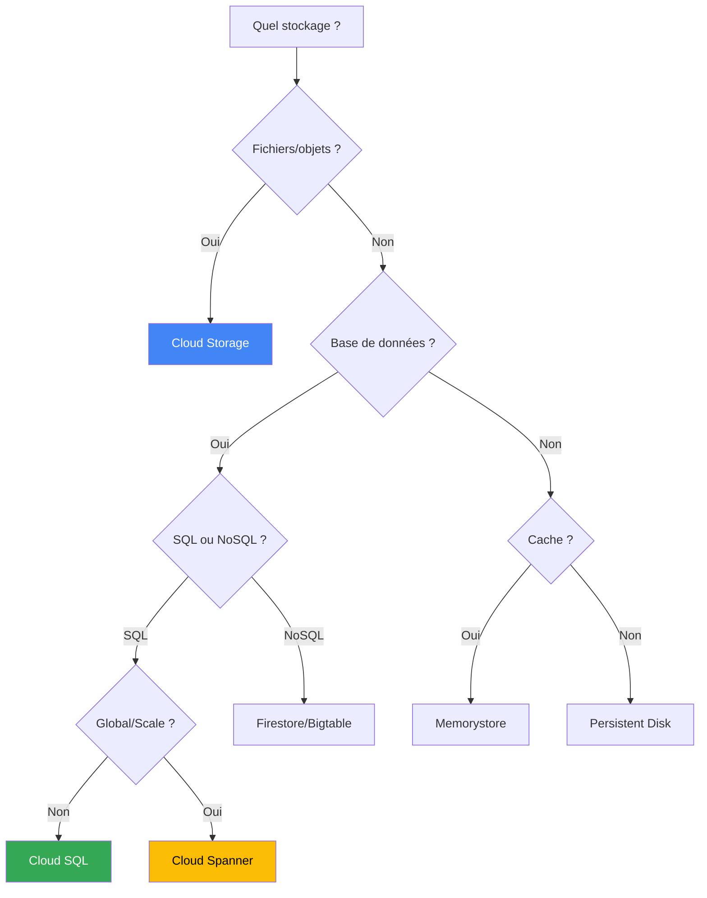

---
tags:
  - formation
  - gcp
  - cloud-storage
  - cloud-sql
  - persistent-disk
  - database
---

# Module 4 : Storage & Databases

## Objectifs du Module

À la fin de ce module, vous serez capable de :

- :material-bucket: Gérer des buckets Cloud Storage avec lifecycle policies
- :fontawesome-solid-hard-drive: Optimiser les Persistent Disks (types, snapshots)
- :material-database: Déployer Cloud SQL (PostgreSQL/MySQL) en haute disponibilité
- :material-chart-line: Choisir la solution de stockage adaptée à chaque cas d'usage

---

## 1. Cloud Storage (Object Storage)

### Concepts

Cloud Storage est le service de **stockage objet** de GCP :

- **Buckets** : Conteneurs pour les objets
- **Objects** : Fichiers avec metadata
- **Global** : Nom de bucket unique mondialement
- **Durabilité** : 99.999999999% (11 nines)

### Classes de stockage

| Classe | SLA Dispo | Min Duration | Usage | Prix/GB/mois |
|--------|-----------|--------------|-------|--------------|
| **Standard** | 99.95% | Aucune | Données fréquentes | ~$0.020 |
| **Nearline** | 99.9% | 30 jours | Accès mensuel | ~$0.010 |
| **Coldline** | 99.9% | 90 jours | Accès trimestriel | ~$0.004 |
| **Archive** | 99.9% | 365 jours | Accès annuel | ~$0.0012 |

!!! info "Coûts de récupération"
    Les classes Nearline/Coldline/Archive ont des coûts de récupération par GB. Choisir en fonction de la fréquence d'accès réelle.

### Location Types

| Type | Exemple | Usage |
|------|---------|-------|
| **Region** | `europe-west1` | Données proches du compute |
| **Dual-region** | `eur4` (NL + FI) | Géo-redondance automatique |
| **Multi-region** | `eu` (toute l'Europe) | Contenu global, max disponibilité |

### Créer et gérer des buckets

```bash
# Créer un bucket régional
gcloud storage buckets create gs://my-app-data-PROJECT_ID \
    --location=europe-west1 \
    --default-storage-class=standard \
    --uniform-bucket-level-access

# Créer un bucket multi-régional
gcloud storage buckets create gs://my-static-assets-PROJECT_ID \
    --location=eu \
    --default-storage-class=standard

# Lister les buckets
gcloud storage buckets list

# Détails d'un bucket
gcloud storage buckets describe gs://my-app-data-PROJECT_ID
```

### Opérations sur les objets

```bash
# Upload
gcloud storage cp local-file.txt gs://my-bucket/
gcloud storage cp -r local-folder/ gs://my-bucket/folder/

# Download
gcloud storage cp gs://my-bucket/file.txt ./
gcloud storage cp -r gs://my-bucket/folder/ ./local-folder/

# Lister
gcloud storage ls gs://my-bucket/
gcloud storage ls -l gs://my-bucket/  # Avec détails

# Supprimer
gcloud storage rm gs://my-bucket/file.txt
gcloud storage rm -r gs://my-bucket/folder/  # Récursif

# Sync (comme rsync)
gcloud storage rsync -r ./local-folder gs://my-bucket/folder/
gcloud storage rsync -r gs://my-bucket/folder/ ./local-folder/
```

### gsutil (legacy mais encore utilisé)

```bash
# gsutil fonctionne aussi
gsutil mb gs://my-bucket
gsutil cp file.txt gs://my-bucket/
gsutil ls gs://my-bucket/
gsutil rsync -r ./folder gs://my-bucket/folder/
```

### Lifecycle Policies

Automatiser le déplacement ou la suppression d'objets :

```bash
# Créer un fichier lifecycle.json
cat > lifecycle.json << 'EOF'
{
  "rule": [
    {
      "action": {"type": "SetStorageClass", "storageClass": "NEARLINE"},
      "condition": {"age": 30, "matchesStorageClass": ["STANDARD"]}
    },
    {
      "action": {"type": "SetStorageClass", "storageClass": "COLDLINE"},
      "condition": {"age": 90, "matchesStorageClass": ["NEARLINE"]}
    },
    {
      "action": {"type": "Delete"},
      "condition": {"age": 365}
    }
  ]
}
EOF

# Appliquer au bucket
gcloud storage buckets update gs://my-bucket --lifecycle-file=lifecycle.json

# Voir la lifecycle policy
gcloud storage buckets describe gs://my-bucket --format="yaml(lifecycle)"
```

### Versioning

```bash
# Activer le versioning
gcloud storage buckets update gs://my-bucket --versioning

# Lister les versions
gcloud storage ls -a gs://my-bucket/file.txt

# Restaurer une version
gcloud storage cp gs://my-bucket/file.txt#1234567890 gs://my-bucket/file.txt
```

### Contrôle d'accès

#### Uniform bucket-level access (recommandé)

```bash
# IAM uniquement (pas d'ACLs)
gcloud storage buckets update gs://my-bucket --uniform-bucket-level-access

# Donner accès en lecture à un service account
gcloud storage buckets add-iam-policy-binding gs://my-bucket \
    --member="serviceAccount:my-app@PROJECT_ID.iam.gserviceaccount.com" \
    --role="roles/storage.objectViewer"

# Donner accès en écriture
gcloud storage buckets add-iam-policy-binding gs://my-bucket \
    --member="serviceAccount:my-app@PROJECT_ID.iam.gserviceaccount.com" \
    --role="roles/storage.objectCreator"
```

#### Signed URLs (accès temporaire)

```bash
# Créer une signed URL (nécessite une clé de service account)
gcloud storage sign-url gs://my-bucket/private-file.pdf \
    --private-key-file=key.json \
    --duration=1h

# L'URL générée permet un accès temporaire sans authentification
```

### Rendre un bucket public (site statique)

```bash
# Rendre tous les objets publics
gcloud storage buckets add-iam-policy-binding gs://my-static-site \
    --member="allUsers" \
    --role="roles/storage.objectViewer"

# Configurer comme site web
gcloud storage buckets update gs://my-static-site \
    --web-main-page-suffix=index.html \
    --web-error-page=404.html

# L'URL publique sera : https://storage.googleapis.com/my-static-site/
```

---

## 2. Persistent Disks

### Types et performances

| Type | Code | IOPS/GB | Throughput | Use Case |
|------|------|---------|------------|----------|
| **Standard** | `pd-standard` | 0.75 | 12 MB/s | Logs, backups |
| **Balanced** | `pd-balanced` | 6 | 28 MB/s | General purpose |
| **SSD** | `pd-ssd` | 30 | 48 MB/s | Databases |
| **Extreme** | `pd-extreme` | Custom | 1.2 GB/s | SAP HANA |

!!! tip "Formule de performance"
    Performance = IOPS/GB × Taille du disque (avec un cap max)

    Exemple `pd-ssd` 100GB : 30 × 100 = 3000 IOPS

### Opérations sur les disques

```bash
# Créer un disque
gcloud compute disks create app-data \
    --size=100GB \
    --type=pd-ssd \
    --zone=europe-west1-b

# Attacher à une VM
gcloud compute instances attach-disk my-vm \
    --disk=app-data \
    --zone=europe-west1-b

# Redimensionner (online)
gcloud compute disks resize app-data \
    --size=200GB \
    --zone=europe-west1-b

# Dans la VM, étendre le filesystem
sudo resize2fs /dev/sdb  # ext4
sudo xfs_growfs /mnt/data  # xfs
```

### Regional Persistent Disks

Pour la haute disponibilité (répliqué dans 2 zones) :

```bash
gcloud compute disks create ha-disk \
    --size=100GB \
    --type=pd-ssd \
    --region=europe-west1 \
    --replica-zones=europe-west1-b,europe-west1-c
```

### Snapshots

```bash
# Créer un snapshot
gcloud compute disks snapshot app-data \
    --snapshot-names=app-data-$(date +%Y%m%d) \
    --zone=europe-west1-b

# Snapshot schedule automatique
gcloud compute resource-policies create snapshot-schedule daily-snapshots \
    --region=europe-west1 \
    --start-time=03:00 \
    --daily-schedule \
    --max-retention-days=14 \
    --on-source-disk-delete=apply-retention-policy

# Attacher la policy au disque
gcloud compute disks add-resource-policies app-data \
    --resource-policies=daily-snapshots \
    --zone=europe-west1-b

# Créer un disque depuis snapshot
gcloud compute disks create app-data-restored \
    --source-snapshot=app-data-20240115 \
    --zone=europe-west1-b
```

---

## 3. Cloud SQL

### Services supportés

| Engine | Versions | Max Storage | Max RAM |
|--------|----------|-------------|---------|
| **MySQL** | 5.6, 5.7, 8.0 | 64 TB | 624 GB |
| **PostgreSQL** | 9.6 - 16 | 64 TB | 624 GB |
| **SQL Server** | 2017, 2019, 2022 | 64 TB | 624 GB |

### Créer une instance Cloud SQL

```bash
# PostgreSQL basique
gcloud sql instances create my-postgres \
    --database-version=POSTGRES_15 \
    --tier=db-custom-2-4096 \
    --region=europe-west1 \
    --storage-type=SSD \
    --storage-size=20GB \
    --storage-auto-increase

# MySQL avec HA
gcloud sql instances create my-mysql \
    --database-version=MYSQL_8_0 \
    --tier=db-n1-standard-2 \
    --region=europe-west1 \
    --availability-type=REGIONAL \
    --storage-type=SSD \
    --storage-size=50GB \
    --backup-start-time=02:00 \
    --enable-point-in-time-recovery
```

### Machine Types Cloud SQL

```bash
# Tiers prédéfinis
db-f1-micro    # Shared, 0.6 GB RAM
db-g1-small    # Shared, 1.7 GB RAM
db-n1-standard-1  # 1 vCPU, 3.75 GB
db-n1-standard-2  # 2 vCPU, 7.5 GB
...

# Custom (recommandé)
db-custom-VCPU-RAM
# Exemple : db-custom-4-16384 (4 vCPU, 16 GB RAM)

# Lister les tiers
gcloud sql tiers list
```

### Configuration réseau

```bash
# Option 1 : IP publique avec authorized networks
gcloud sql instances patch my-postgres \
    --authorized-networks=203.0.113.0/24

# Option 2 : Private IP (recommandé en production)
gcloud sql instances patch my-postgres \
    --network=projects/PROJECT_ID/global/networks/prod-vpc \
    --no-assign-ip

# Créer une connexion Private Service Access (prérequis)
gcloud compute addresses create google-managed-services-prod-vpc \
    --global \
    --purpose=VPC_PEERING \
    --prefix-length=16 \
    --network=prod-vpc

gcloud services vpc-peerings connect \
    --service=servicenetworking.googleapis.com \
    --network=prod-vpc \
    --ranges=google-managed-services-prod-vpc
```

### Gestion des bases et utilisateurs

```bash
# Créer une base de données
gcloud sql databases create myapp \
    --instance=my-postgres

# Créer un utilisateur
gcloud sql users create appuser \
    --instance=my-postgres \
    --password=SecurePassword123!

# Se connecter via Cloud SQL Proxy (recommandé)
# 1. Télécharger le proxy
curl -o cloud-sql-proxy https://storage.googleapis.com/cloud-sql-connectors/cloud-sql-proxy/v2.8.0/cloud-sql-proxy.linux.amd64
chmod +x cloud-sql-proxy

# 2. Lancer le proxy
./cloud-sql-proxy PROJECT_ID:europe-west1:my-postgres &

# 3. Se connecter
psql -h 127.0.0.1 -U appuser -d myapp
```

### Backups et restauration

```bash
# Backup manuel
gcloud sql backups create \
    --instance=my-postgres \
    --description="Pre-migration backup"

# Lister les backups
gcloud sql backups list --instance=my-postgres

# Restaurer depuis backup
gcloud sql backups restore BACKUP_ID \
    --restore-instance=my-postgres \
    --backup-instance=my-postgres

# Point-in-Time Recovery
gcloud sql instances restore-backup my-postgres \
    --restore-instance=my-postgres-restored \
    --restore-time="2024-01-15T10:30:00Z"
```

### Réplicas de lecture

```bash
# Créer un read replica
gcloud sql instances create my-postgres-replica \
    --master-instance-name=my-postgres \
    --region=europe-west1

# Promouvoir en standalone (failover manuel)
gcloud sql instances promote-replica my-postgres-replica
```

---

## 4. Autres Solutions de Stockage

### Comparatif rapide

| Service | Type | Usage | Latence |
|---------|------|-------|---------|
| **Cloud Storage** | Object | Fichiers, backups, statique | ~100ms |
| **Persistent Disk** | Block | Disques VM | <1ms |
| **Cloud SQL** | SQL managé | OLTP, apps traditionnelles | <10ms |
| **Cloud Spanner** | SQL distribué | Global, 99.999% SLA | <10ms |
| **Firestore** | NoSQL document | Mobile, web apps | <100ms |
| **BigQuery** | Data warehouse | Analytics, BI | Secondes |
| **Memorystore** | Cache (Redis) | Sessions, cache | <1ms |

### Cloud Spanner (SQL global)

```bash
# Créer une instance Spanner
gcloud spanner instances create my-spanner \
    --config=regional-europe-west1 \
    --nodes=1 \
    --description="My Spanner instance"

# Créer une base
gcloud spanner databases create mydb \
    --instance=my-spanner

# Exécuter du SQL
gcloud spanner databases execute-sql mydb \
    --instance=my-spanner \
    --sql="CREATE TABLE Users (UserId INT64 NOT NULL, Name STRING(100)) PRIMARY KEY (UserId)"
```

### Memorystore (Redis)

```bash
# Créer une instance Redis
gcloud redis instances create my-cache \
    --size=1 \
    --region=europe-west1 \
    --network=prod-vpc \
    --tier=standard \
    --redis-version=redis_7_0

# Obtenir l'IP
gcloud redis instances describe my-cache \
    --region=europe-west1 \
    --format="get(host)"
```

---

## 5. Exercices Pratiques

### Exercice 1 : Bucket avec Lifecycle

!!! example "Exercice"
    1. Créez un bucket `logs-PROJECT_ID` en région `europe-west1`
    2. Activez le versioning
    3. Configurez une lifecycle policy :
        - Standard → Nearline après 30 jours
        - Nearline → Coldline après 90 jours
        - Supprimer après 365 jours
    4. Uploadez quelques fichiers de test

??? quote "Solution"
    ```bash
    PROJECT_ID=$(gcloud config get-value project)

    # Créer le bucket
    gcloud storage buckets create gs://logs-$PROJECT_ID \
        --location=europe-west1 \
        --default-storage-class=standard \
        --uniform-bucket-level-access

    # Activer versioning
    gcloud storage buckets update gs://logs-$PROJECT_ID --versioning

    # Lifecycle policy
    cat > lifecycle-logs.json << 'EOF'
    {
      "rule": [
        {
          "action": {"type": "SetStorageClass", "storageClass": "NEARLINE"},
          "condition": {"age": 30, "matchesStorageClass": ["STANDARD"]}
        },
        {
          "action": {"type": "SetStorageClass", "storageClass": "COLDLINE"},
          "condition": {"age": 90, "matchesStorageClass": ["NEARLINE"]}
        },
        {
          "action": {"type": "Delete"},
          "condition": {"age": 365}
        }
      ]
    }
    EOF

    gcloud storage buckets update gs://logs-$PROJECT_ID \
        --lifecycle-file=lifecycle-logs.json

    # Upload test files
    echo "Log entry 1" > test-log.txt
    gcloud storage cp test-log.txt gs://logs-$PROJECT_ID/

    # Vérifier
    gcloud storage ls gs://logs-$PROJECT_ID/
    gcloud storage buckets describe gs://logs-$PROJECT_ID \
        --format="yaml(lifecycle)"
    ```

### Exercice 2 : Cloud SQL PostgreSQL

!!! example "Exercice"
    1. Créez une instance Cloud SQL PostgreSQL (petite, pour économiser)
    2. Créez une base de données `webapp`
    3. Créez un utilisateur `appuser`
    4. Connectez-vous et créez une table de test
    5. Activez les backups automatiques

??? quote "Solution"
    ```bash
    # Créer l'instance (tier minimal)
    gcloud sql instances create training-postgres \
        --database-version=POSTGRES_15 \
        --tier=db-f1-micro \
        --region=europe-west1 \
        --storage-type=SSD \
        --storage-size=10GB \
        --backup-start-time=03:00

    # Créer la base
    gcloud sql databases create webapp \
        --instance=training-postgres

    # Créer l'utilisateur
    gcloud sql users create appuser \
        --instance=training-postgres \
        --password=Training123!

    # Autoriser votre IP (pour le test)
    MY_IP=$(curl -s ifconfig.me)
    gcloud sql instances patch training-postgres \
        --authorized-networks=$MY_IP/32

    # Se connecter
    gcloud sql connect training-postgres --user=appuser --database=webapp

    # Dans psql :
    CREATE TABLE users (
        id SERIAL PRIMARY KEY,
        email VARCHAR(255) NOT NULL,
        created_at TIMESTAMP DEFAULT CURRENT_TIMESTAMP
    );
    INSERT INTO users (email) VALUES ('test@example.com');
    SELECT * FROM users;
    \q

    # Vérifier les backups
    gcloud sql instances describe training-postgres \
        --format="yaml(settings.backupConfiguration)"
    ```

### Exercice 3 : Snapshot automatique

!!! example "Exercice"
    1. Créez un disque `data-disk` de 10GB SSD
    2. Configurez un snapshot schedule quotidien à 4h00, rétention 7 jours
    3. Attachez la policy au disque
    4. Vérifiez la configuration

??? quote "Solution"
    ```bash
    # Créer le disque
    gcloud compute disks create data-disk \
        --size=10GB \
        --type=pd-ssd \
        --zone=europe-west1-b

    # Créer la snapshot policy
    gcloud compute resource-policies create snapshot-schedule daily-7d \
        --region=europe-west1 \
        --start-time=04:00 \
        --daily-schedule \
        --max-retention-days=7

    # Attacher au disque
    gcloud compute disks add-resource-policies data-disk \
        --resource-policies=daily-7d \
        --zone=europe-west1-b

    # Vérifier
    gcloud compute disks describe data-disk \
        --zone=europe-west1-b \
        --format="yaml(resourcePolicies)"

    gcloud compute resource-policies describe daily-7d \
        --region=europe-west1
    ```

---

## 6. Nettoyage

```bash
# Cloud SQL
gcloud sql instances delete training-postgres --quiet

# Bucket
gcloud storage rm -r gs://logs-$PROJECT_ID

# Disque et policy
gcloud compute disks delete data-disk --zone=europe-west1-b --quiet
gcloud compute resource-policies delete daily-7d --region=europe-west1 --quiet

# Fichiers locaux
rm -f lifecycle-logs.json test-log.txt
```

---

## Résumé du Module

| Service | Type | Key Features |
|---------|------|--------------|
| **Cloud Storage** | Object | Lifecycle, versioning, classes (S/N/C/A) |
| **Persistent Disk** | Block | pd-standard/balanced/ssd, snapshots |
| **Cloud SQL** | SQL managé | HA, backups, replicas, Private IP |
| **Spanner** | SQL distribué | Global, 99.999%, horizontal scale |
| **Memorystore** | Cache | Redis/Memcached managé |

### Arbre de décision



---

**[← Retour au Module 3](03-module.md)** | **[Continuer vers le Module 5 : GKE →](05-module.md)**

---

**Retour au :** [Programme de la Formation](index.md) | [Catalogue des Formations](../index.md)
