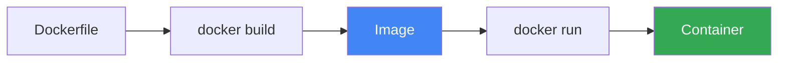
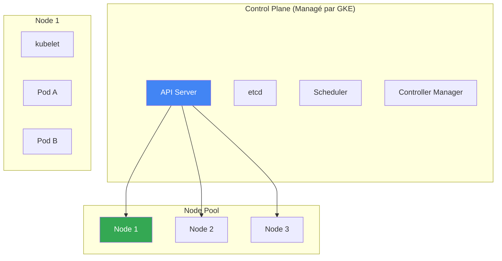
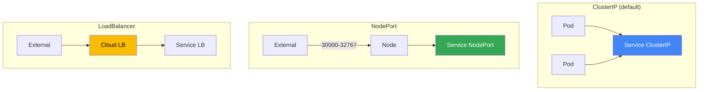
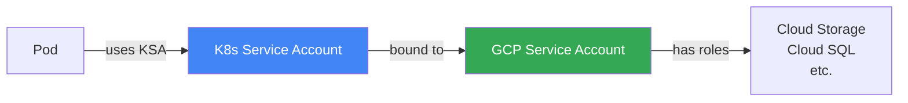

---
tags:
  - formation
  - gcp
  - gke
  - kubernetes
  - containers
  - docker
---

# Module 5 : GKE - Kubernetes sur GCP

## Objectifs du Module

À la fin de ce module, vous serez capable de :

- :material-docker: Comprendre les concepts Docker et Kubernetes
- :material-kubernetes: Créer et gérer des clusters GKE (Standard et Autopilot)
- :fontawesome-solid-cubes: Déployer des applications avec `kubectl`
- :material-shield-account: Configurer Workload Identity pour la sécurité
- :material-scale-balance: Exposer des services avec Ingress et Load Balancers

---

## 1. Concepts Fondamentaux

### Docker : Les bases



| Concept | Description |
|---------|-------------|
| **Image** | Template immuable contenant l'app et ses dépendances |
| **Container** | Instance en cours d'exécution d'une image |
| **Registry** | Dépôt pour stocker les images (Artifact Registry) |
| **Dockerfile** | Recette pour construire une image |

### Kubernetes : Architecture



| Composant | Rôle |
|-----------|------|
| **Pod** | Plus petite unité déployable (1+ containers) |
| **Deployment** | Gère les replicas et les mises à jour de Pods |
| **Service** | Expose les Pods (ClusterIP, NodePort, LoadBalancer) |
| **Ingress** | Routage HTTP/HTTPS (Layer 7) |
| **ConfigMap** | Configuration non sensible |
| **Secret** | Configuration sensible (chiffrée) |

### GKE vs Kubernetes self-managed

| Aspect | Self-managed | GKE |
|--------|--------------|-----|
| Control Plane | À gérer | Managé (gratuit) |
| Upgrades | Manuels | Automatiques |
| Scaling | Manuel | Node auto-provisioning |
| Logging/Monitoring | À configurer | Cloud Operations intégré |
| Sécurité | À implémenter | Workload Identity, Binary Auth |

---

## 2. Créer un Cluster GKE

### Standard vs Autopilot

| Aspect | Standard | Autopilot |
|--------|----------|-----------|
| **Gestion nodes** | Vous | Google |
| **Facturation** | Par node (VM) | Par Pod (CPU/RAM) |
| **Configuration** | Flexible | Prédéfinie |
| **Cas d'usage** | Contrôle fin | Simplicité |

### Cluster Standard

```bash
# Créer un cluster Standard
gcloud container clusters create my-cluster \
    --zone=europe-west1-b \
    --num-nodes=3 \
    --machine-type=e2-medium \
    --disk-size=50GB \
    --enable-autoscaling \
    --min-nodes=1 \
    --max-nodes=5 \
    --enable-autorepair \
    --enable-autoupgrade \
    --release-channel=regular

# Avec VPC custom et private nodes
gcloud container clusters create prod-cluster \
    --zone=europe-west1-b \
    --network=prod-vpc \
    --subnetwork=gke-subnet \
    --enable-private-nodes \
    --master-ipv4-cidr=172.16.0.0/28 \
    --enable-ip-alias \
    --num-nodes=3 \
    --machine-type=e2-standard-2
```

### Cluster Autopilot

```bash
# Cluster Autopilot (recommandé pour débuter)
gcloud container clusters create-auto autopilot-cluster \
    --region=europe-west1 \
    --release-channel=regular

# Avec VPC custom
gcloud container clusters create-auto autopilot-cluster \
    --region=europe-west1 \
    --network=prod-vpc \
    --subnetwork=gke-subnet
```

### Se connecter au cluster

```bash
# Configurer kubectl
gcloud container clusters get-credentials my-cluster \
    --zone=europe-west1-b

# Vérifier la connexion
kubectl cluster-info
kubectl get nodes

# Pour Autopilot
gcloud container clusters get-credentials autopilot-cluster \
    --region=europe-west1
```

---

## 3. Artifact Registry

### Créer un repository

```bash
# Créer un repo Docker
gcloud artifacts repositories create my-repo \
    --repository-format=docker \
    --location=europe-west1 \
    --description="Docker repository"

# Configurer Docker pour utiliser AR
gcloud auth configure-docker europe-west1-docker.pkg.dev

# Lister les repos
gcloud artifacts repositories list --location=europe-west1
```

### Push une image

```bash
# Construire et tagger l'image
docker build -t europe-west1-docker.pkg.dev/PROJECT_ID/my-repo/myapp:v1 .

# Push vers Artifact Registry
docker push europe-west1-docker.pkg.dev/PROJECT_ID/my-repo/myapp:v1

# Lister les images
gcloud artifacts docker images list \
    europe-west1-docker.pkg.dev/PROJECT_ID/my-repo
```

---

## 4. Déployer des Applications

### Structure YAML de base

```yaml
# deployment.yaml
apiVersion: apps/v1
kind: Deployment
metadata:
  name: nginx-deployment
  labels:
    app: nginx
spec:
  replicas: 3
  selector:
    matchLabels:
      app: nginx
  template:
    metadata:
      labels:
        app: nginx
    spec:
      containers:
      - name: nginx
        image: nginx:1.25
        ports:
        - containerPort: 80
        resources:
          requests:
            cpu: 100m
            memory: 128Mi
          limits:
            cpu: 200m
            memory: 256Mi
---
# service.yaml
apiVersion: v1
kind: Service
metadata:
  name: nginx-service
spec:
  type: LoadBalancer
  selector:
    app: nginx
  ports:
  - port: 80
    targetPort: 80
```

### Commandes kubectl essentielles

```bash
# Appliquer des manifests
kubectl apply -f deployment.yaml
kubectl apply -f service.yaml
# Ou tout un dossier
kubectl apply -f ./k8s/

# Voir les ressources
kubectl get pods
kubectl get deployments
kubectl get services
kubectl get all

# Détails et logs
kubectl describe pod nginx-deployment-xxx
kubectl logs nginx-deployment-xxx
kubectl logs -f nginx-deployment-xxx  # Follow

# Exécuter une commande dans un pod
kubectl exec -it nginx-deployment-xxx -- /bin/bash

# Scaler
kubectl scale deployment nginx-deployment --replicas=5

# Supprimer
kubectl delete -f deployment.yaml
kubectl delete deployment nginx-deployment
```

### ConfigMaps et Secrets

```yaml
# configmap.yaml
apiVersion: v1
kind: ConfigMap
metadata:
  name: app-config
data:
  DATABASE_HOST: "10.0.3.5"
  LOG_LEVEL: "info"
---
# secret.yaml
apiVersion: v1
kind: Secret
metadata:
  name: app-secrets
type: Opaque
stringData:
  DATABASE_PASSWORD: "SuperSecret123"
  API_KEY: "abc123xyz"
```

```yaml
# Utilisation dans un Deployment
spec:
  containers:
  - name: myapp
    image: myapp:v1
    envFrom:
    - configMapRef:
        name: app-config
    - secretRef:
        name: app-secrets
    # Ou variables individuelles
    env:
    - name: DB_HOST
      valueFrom:
        configMapKeyRef:
          name: app-config
          key: DATABASE_HOST
    - name: DB_PASSWORD
      valueFrom:
        secretKeyRef:
          name: app-secrets
          key: DATABASE_PASSWORD
```

```bash
# Créer depuis la CLI
kubectl create configmap app-config \
    --from-literal=DATABASE_HOST=10.0.3.5 \
    --from-literal=LOG_LEVEL=info

kubectl create secret generic app-secrets \
    --from-literal=DATABASE_PASSWORD=SuperSecret123

# Depuis un fichier
kubectl create configmap nginx-config --from-file=nginx.conf
```

---

## 5. Services et Ingress

### Types de Services



| Type | Accès | Usage |
|------|-------|-------|
| **ClusterIP** | Interne cluster | Communication inter-services |
| **NodePort** | IP Node + port | Debug, tests |
| **LoadBalancer** | IP externe | Exposer à Internet |

### GKE Ingress

```yaml
# ingress.yaml
apiVersion: networking.k8s.io/v1
kind: Ingress
metadata:
  name: web-ingress
  annotations:
    kubernetes.io/ingress.class: "gce"
    kubernetes.io/ingress.global-static-ip-name: "web-ip"
spec:
  defaultBackend:
    service:
      name: nginx-service
      port:
        number: 80
  rules:
  - host: www.example.com
    http:
      paths:
      - path: /
        pathType: Prefix
        backend:
          service:
            name: frontend-service
            port:
              number: 80
      - path: /api
        pathType: Prefix
        backend:
          service:
            name: api-service
            port:
              number: 8080
```

### HTTPS avec certificat managé

```yaml
apiVersion: networking.k8s.io/v1
kind: Ingress
metadata:
  name: secure-ingress
  annotations:
    kubernetes.io/ingress.class: "gce"
    networking.gke.io/managed-certificates: "web-cert"
spec:
  rules:
  - host: www.example.com
    http:
      paths:
      - path: /
        pathType: Prefix
        backend:
          service:
            name: web-service
            port:
              number: 80
---
apiVersion: networking.gke.io/v1
kind: ManagedCertificate
metadata:
  name: web-cert
spec:
  domains:
  - www.example.com
```

---

## 6. Workload Identity

### Pourquoi Workload Identity ?

Workload Identity permet aux Pods d'accéder aux APIs GCP **sans clé JSON** :



### Configuration

```bash
# 1. Activer Workload Identity sur le cluster
gcloud container clusters update my-cluster \
    --zone=europe-west1-b \
    --workload-pool=PROJECT_ID.svc.id.goog

# 2. Créer un GCP Service Account
gcloud iam service-accounts create gke-app-sa \
    --display-name="GKE Application SA"

# 3. Donner les permissions nécessaires
gcloud projects add-iam-policy-binding PROJECT_ID \
    --member="serviceAccount:gke-app-sa@PROJECT_ID.iam.gserviceaccount.com" \
    --role="roles/storage.objectViewer"

# 4. Créer un Kubernetes Service Account
kubectl create serviceaccount app-ksa

# 5. Lier KSA au GSA
gcloud iam service-accounts add-iam-policy-binding \
    gke-app-sa@PROJECT_ID.iam.gserviceaccount.com \
    --role="roles/iam.workloadIdentityUser" \
    --member="serviceAccount:PROJECT_ID.svc.id.goog[default/app-ksa]"

# 6. Annoter le KSA
kubectl annotate serviceaccount app-ksa \
    iam.gke.io/gcp-service-account=gke-app-sa@PROJECT_ID.iam.gserviceaccount.com
```

### Utilisation dans un Deployment

```yaml
apiVersion: apps/v1
kind: Deployment
metadata:
  name: myapp
spec:
  template:
    spec:
      serviceAccountName: app-ksa  # Utilise Workload Identity
      containers:
      - name: myapp
        image: myapp:v1
```

---

## 7. Autoscaling

### Horizontal Pod Autoscaler (HPA)

```yaml
apiVersion: autoscaling/v2
kind: HorizontalPodAutoscaler
metadata:
  name: nginx-hpa
spec:
  scaleTargetRef:
    apiVersion: apps/v1
    kind: Deployment
    name: nginx-deployment
  minReplicas: 2
  maxReplicas: 10
  metrics:
  - type: Resource
    resource:
      name: cpu
      target:
        type: Utilization
        averageUtilization: 50
  - type: Resource
    resource:
      name: memory
      target:
        type: Utilization
        averageUtilization: 70
```

```bash
# Via kubectl
kubectl autoscale deployment nginx-deployment \
    --min=2 --max=10 --cpu-percent=50

# Vérifier
kubectl get hpa
kubectl describe hpa nginx-hpa
```

### Cluster Autoscaler

```bash
# Activer sur un node pool existant
gcloud container clusters update my-cluster \
    --zone=europe-west1-b \
    --enable-autoscaling \
    --min-nodes=1 \
    --max-nodes=10 \
    --node-pool=default-pool

# Vérifier
kubectl get nodes
kubectl describe configmap cluster-autoscaler-status -n kube-system
```

---

## 8. Exercices Pratiques

### Exercice 1 : Déployer nginx sur GKE

!!! example "Exercice"
    1. Créez un cluster Autopilot `training-cluster`
    2. Déployez nginx avec 3 replicas
    3. Exposez via un Service LoadBalancer
    4. Accédez à l'application depuis Internet

??? quote "Solution"
    ```bash
    # Cluster Autopilot
    gcloud container clusters create-auto training-cluster \
        --region=europe-west1

    # Credentials
    gcloud container clusters get-credentials training-cluster \
        --region=europe-west1

    # Deployment
    cat > nginx-deployment.yaml << 'EOF'
    apiVersion: apps/v1
    kind: Deployment
    metadata:
      name: nginx
    spec:
      replicas: 3
      selector:
        matchLabels:
          app: nginx
      template:
        metadata:
          labels:
            app: nginx
        spec:
          containers:
          - name: nginx
            image: nginx:1.25
            ports:
            - containerPort: 80
            resources:
              requests:
                cpu: 100m
                memory: 128Mi
    ---
    apiVersion: v1
    kind: Service
    metadata:
      name: nginx-lb
    spec:
      type: LoadBalancer
      selector:
        app: nginx
      ports:
      - port: 80
        targetPort: 80
    EOF

    kubectl apply -f nginx-deployment.yaml

    # Attendre le LoadBalancer
    kubectl get svc nginx-lb -w
    # Quand EXTERNAL-IP est assignée, tester
    curl http://EXTERNAL_IP
    ```

### Exercice 2 : ConfigMap et mise à jour

!!! example "Exercice"
    1. Créez un ConfigMap avec un message personnalisé
    2. Modifiez le Deployment pour monter le ConfigMap
    3. Vérifiez que le contenu est visible dans le Pod
    4. Mettez à jour le ConfigMap et observez

??? quote "Solution"
    ```bash
    # ConfigMap avec contenu HTML
    cat > custom-nginx.yaml << 'EOF'
    apiVersion: v1
    kind: ConfigMap
    metadata:
      name: nginx-content
    data:
      index.html: |
        <!DOCTYPE html>
        <html>
        <head><title>GKE Training</title></head>
        <body>
        <h1>Hello from GKE!</h1>
        <p>Server: ${HOSTNAME}</p>
        </body>
        </html>
    ---
    apiVersion: apps/v1
    kind: Deployment
    metadata:
      name: custom-nginx
    spec:
      replicas: 2
      selector:
        matchLabels:
          app: custom-nginx
      template:
        metadata:
          labels:
            app: custom-nginx
        spec:
          containers:
          - name: nginx
            image: nginx:1.25
            ports:
            - containerPort: 80
            volumeMounts:
            - name: html-volume
              mountPath: /usr/share/nginx/html
            resources:
              requests:
                cpu: 100m
                memory: 128Mi
          volumes:
          - name: html-volume
            configMap:
              name: nginx-content
    ---
    apiVersion: v1
    kind: Service
    metadata:
      name: custom-nginx-lb
    spec:
      type: LoadBalancer
      selector:
        app: custom-nginx
      ports:
      - port: 80
    EOF

    kubectl apply -f custom-nginx.yaml

    # Vérifier
    kubectl get pods
    kubectl exec -it custom-nginx-xxx -- cat /usr/share/nginx/html/index.html

    # Tester via LB
    kubectl get svc custom-nginx-lb
    curl http://EXTERNAL_IP

    # Mettre à jour le ConfigMap
    kubectl edit configmap nginx-content
    # Modifier le contenu HTML

    # Restart pour appliquer (ConfigMap n'est pas hot-reloaded par défaut)
    kubectl rollout restart deployment custom-nginx
    ```

### Exercice 3 : HPA

!!! example "Exercice"
    1. Configurez un HPA pour `custom-nginx` (CPU 50%, min 2, max 10)
    2. Générez de la charge avec un outil comme `hey` ou des boucles curl
    3. Observez le scale-up

??? quote "Solution"
    ```bash
    # HPA
    kubectl autoscale deployment custom-nginx \
        --min=2 --max=10 --cpu-percent=50

    # Vérifier
    kubectl get hpa

    # Générer de la charge (depuis Cloud Shell ou local)
    # Option 1: avec hey (installer si nécessaire)
    # go install github.com/rakyll/hey@latest
    hey -z 2m -c 50 http://EXTERNAL_IP/

    # Option 2: boucle simple
    while true; do curl -s http://EXTERNAL_IP/ > /dev/null; done

    # Observer dans un autre terminal
    watch kubectl get hpa,pods

    # Après quelques minutes, vous verrez le nombre de pods augmenter
    ```

---

## Exercice : À Vous de Jouer

!!! example "Mise en Pratique"
    **Objectif** : Déployer une application multi-tier sur GKE Autopilot avec autoscaling, monitoring et secrets management

    **Contexte** : Vous déployez une application web 2-tier (frontend + backend) sur GKE. Le frontend doit scaler horizontalement en fonction du trafic, et le backend doit accéder à des secrets de manière sécurisée via Workload Identity. L'application doit être accessible via un Load Balancer avec une IP publique réservée.

    **Tâches à réaliser** :

    1. Créer un cluster GKE Autopilot `prod-app-cluster` dans `europe-west1`
    2. Créer un namespace `production`
    3. Créer un Secret Kubernetes `api-credentials` avec une clé API fictive
    4. Déployer un frontend (nginx) avec 2 replicas minimum
    5. Déployer un backend (application simple) qui utilise le secret
    6. Configurer un Service ClusterIP pour le backend
    7. Configurer un Ingress avec LoadBalancer pour exposer le frontend
    8. Configurer HPA (Horizontal Pod Autoscaler) pour le frontend (target: 70% CPU, max: 10 pods)
    9. Tester le scaling en générant de la charge
    10. Configurer les resource requests/limits appropriées

    **Critères de validation** :

    - [ ] Le cluster GKE Autopilot est créé et fonctionnel
    - [ ] Le namespace `production` existe
    - [ ] Les deux applications (frontend + backend) sont déployées
    - [ ] Le backend accède au secret correctement
    - [ ] Le frontend est accessible via le Load Balancer
    - [ ] Le HPA est configuré et fonctionne
    - [ ] Les pods scalent automatiquement sous charge
    - [ ] Les resource requests/limits sont définis

??? quote "Solution"
    ```bash
    # 1. Créer le cluster Autopilot
    gcloud container clusters create-auto prod-app-cluster \
        --region=europe-west1 \
        --release-channel=regular

    gcloud container clusters get-credentials prod-app-cluster --region=europe-west1

    # 2. Namespace
    kubectl create namespace production
    kubectl config set-context --current --namespace=production

    # 3. Secret
    kubectl create secret generic api-credentials \
        --from-literal=api-key='sk-test-1234567890abcdef' \
        --from-literal=api-endpoint='https://api.example.com' \
        -n production

    # 4. Déployer le Backend
    cat > backend-deployment.yaml << 'EOF'
    apiVersion: apps/v1
    kind: Deployment
    metadata:
      name: backend
      namespace: production
    spec:
      replicas: 2
      selector:
        matchLabels:
          app: backend
          tier: api
      template:
        metadata:
          labels:
            app: backend
            tier: api
        spec:
          containers:
          - name: api
            image: nginx:alpine
            ports:
            - containerPort: 80
            env:
            - name: API_KEY
              valueFrom:
                secretKeyRef:
                  name: api-credentials
                  key: api-key
            - name: API_ENDPOINT
              valueFrom:
                secretKeyRef:
                  name: api-credentials
                  key: api-endpoint
            resources:
              requests:
                cpu: 100m
                memory: 128Mi
              limits:
                cpu: 200m
                memory: 256Mi
            livenessProbe:
              httpGet:
                path: /
                port: 80
              initialDelaySeconds: 10
              periodSeconds: 5
            readinessProbe:
              httpGet:
                path: /
                port: 80
              initialDelaySeconds: 5
              periodSeconds: 3
    ---
    apiVersion: v1
    kind: Service
    metadata:
      name: backend-svc
      namespace: production
    spec:
      type: ClusterIP
      selector:
        app: backend
        tier: api
      ports:
      - port: 8080
        targetPort: 80
    EOF

    kubectl apply -f backend-deployment.yaml

    # 5. Déployer le Frontend
    cat > frontend-deployment.yaml << 'EOF'
    apiVersion: apps/v1
    kind: Deployment
    metadata:
      name: frontend
      namespace: production
    spec:
      replicas: 2
      selector:
        matchLabels:
          app: frontend
          tier: web
      template:
        metadata:
          labels:
            app: frontend
            tier: web
        spec:
          containers:
          - name: web
            image: nginx:alpine
            ports:
            - containerPort: 80
            resources:
              requests:
                cpu: 200m
                memory: 128Mi
              limits:
                cpu: 500m
                memory: 256Mi
    ---
    apiVersion: v1
    kind: Service
    metadata:
      name: frontend-svc
      namespace: production
    spec:
      type: LoadBalancer
      selector:
        app: frontend
        tier: web
      ports:
      - port: 80
        targetPort: 80
    EOF

    kubectl apply -f frontend-deployment.yaml

    # 6. HPA pour le frontend
    kubectl autoscale deployment frontend \
        --cpu-percent=70 \
        --min=2 \
        --max=10 \
        -n production

    # 7. Attendre le LoadBalancer
    echo "Attente de l'IP du LoadBalancer..."
    kubectl get svc frontend-svc -n production --watch

    # 8. Tester
    LB_IP=$(kubectl get svc frontend-svc -n production -o jsonpath='{.status.loadBalancer.ingress[0].ip}')
    echo "Application accessible sur: http://$LB_IP"
    curl http://$LB_IP

    # 9. Générer de la charge (dans un terminal séparé)
    kubectl run -it --rm load-generator \
        --image=busybox \
        --namespace=production \
        -- /bin/sh -c "while true; do wget -q -O- http://frontend-svc; done"

    # 10. Observer le scaling
    watch kubectl get hpa,pods -n production

    # Validation
    echo "=== VALIDATION ==="
    kubectl get all -n production
    kubectl describe hpa frontend -n production
    kubectl get pods -n production -o wide
    ```

---

## 9. Nettoyage

```bash
# Supprimer les ressources K8s
kubectl delete -f nginx-deployment.yaml
kubectl delete -f custom-nginx.yaml
kubectl delete hpa custom-nginx

# Supprimer le cluster
gcloud container clusters delete training-cluster \
    --region=europe-west1 --quiet

# Supprimer Artifact Registry (si créé)
gcloud artifacts repositories delete my-repo \
    --location=europe-west1 --quiet
```

---

## Résumé du Module

| Concept | Points clés |
|---------|-------------|
| **GKE Standard** | Contrôle nodes, facturation par VM |
| **GKE Autopilot** | Nodes managés, facturation par Pod |
| **Deployment** | Gère replicas et rolling updates |
| **Service** | ClusterIP, NodePort, LoadBalancer |
| **Ingress** | HTTP(S) routing, certificats managés |
| **Workload Identity** | Accès GCP sans clés JSON |
| **HPA** | Autoscaling basé sur métriques |

---

**[← Retour au Module 4](04-module.md)** | **[Continuer vers le TP Final →](06-tp-final.md)**

---

**Retour au :** [Programme de la Formation](index.md) | [Catalogue des Formations](../index.md)
