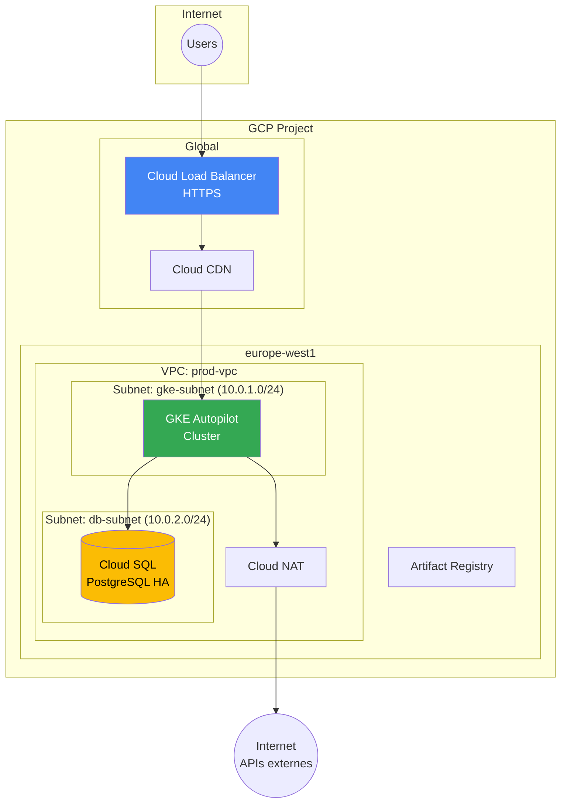

---
tags:
  - formation
  - gcp
  - tp-final
  - projet
  - architecture
---

# Module 6 : TP Final - Infrastructure Production-Ready

## Contexte du Projet

Vous êtes **Cloud Engineer** chez TechStartup Inc. L'entreprise migre son application web vers Google Cloud Platform. Votre mission : déployer une infrastructure **production-ready** en appliquant les best practices apprises dans cette formation.

### L'Application

Une application web 3-tier composée de :

- **Frontend** : Site statique (HTML/CSS/JS) servi par nginx
- **Backend API** : Application Node.js
- **Database** : PostgreSQL

### Exigences Non-Fonctionnelles

- :fontawesome-solid-shield-halved: **Sécurité** : Pas d'IP publique sur les workloads internes
- :material-scale-balance: **Haute Disponibilité** : Multi-zone, autoscaling
- :material-speedometer: **Performance** : CDN pour le contenu statique
- :material-currency-usd: **Coût** : Optimisation (Autopilot, Committed Use si pertinent)
- :material-file-document-outline: **Observabilité** : Logging et Monitoring

---

## Architecture Cible



---

## Phase 1 : Fondations (45 min)

### 1.1 Projet et APIs

!!! example "Tâches"
    1. Créez un projet `tp-gcp-VOTRENOM` ou utilisez votre projet existant
    2. Activez les APIs nécessaires
    3. Configurez `gcloud` pour ce projet

??? quote "Solution"
    ```bash
    # Variables
    export PROJECT_ID="tp-gcp-$(whoami | tr '[:upper:]' '[:lower:]')"
    export REGION="europe-west1"
    export ZONE="europe-west1-b"

    # Créer le projet (optionnel si déjà existant)
    gcloud projects create $PROJECT_ID --name="GCP TP Final"
    gcloud config set project $PROJECT_ID

    # Activer les APIs
    gcloud services enable \
        compute.googleapis.com \
        container.googleapis.com \
        sqladmin.googleapis.com \
        artifactregistry.googleapis.com \
        servicenetworking.googleapis.com \
        cloudresourcemanager.googleapis.com

    # Configurer les defaults
    gcloud config set compute/region $REGION
    gcloud config set compute/zone $ZONE
    ```

### 1.2 Réseau VPC

!!! example "Tâches"
    1. Créez un VPC `prod-vpc` en mode custom
    2. Créez les subnets :
        - `gke-subnet` : 10.0.1.0/24 (pour GKE)
        - `db-subnet` : 10.0.2.0/24 (pour Cloud SQL)
    3. Configurez Cloud NAT pour l'accès Internet sortant
    4. Créez les règles firewall de base

??? quote "Solution"
    ```bash
    # VPC
    gcloud compute networks create prod-vpc \
        --subnet-mode=custom

    # Subnets
    gcloud compute networks subnets create gke-subnet \
        --network=prod-vpc \
        --region=$REGION \
        --range=10.0.1.0/24 \
        --enable-private-ip-google-access \
        --secondary-range=pods=10.1.0.0/16,services=10.2.0.0/20

    gcloud compute networks subnets create db-subnet \
        --network=prod-vpc \
        --region=$REGION \
        --range=10.0.2.0/24

    # Cloud Router et NAT
    gcloud compute routers create prod-router \
        --network=prod-vpc \
        --region=$REGION

    gcloud compute routers nats create prod-nat \
        --router=prod-router \
        --region=$REGION \
        --nat-all-subnet-ip-ranges \
        --auto-allocate-nat-external-ips

    # Firewall: Allow internal
    gcloud compute firewall-rules create allow-internal \
        --network=prod-vpc \
        --direction=INGRESS \
        --action=ALLOW \
        --rules=tcp,udp,icmp \
        --source-ranges=10.0.0.0/8

    # Firewall: Allow IAP SSH
    gcloud compute firewall-rules create allow-iap-ssh \
        --network=prod-vpc \
        --direction=INGRESS \
        --action=ALLOW \
        --rules=tcp:22 \
        --source-ranges=35.235.240.0/20

    # Firewall: Allow health checks
    gcloud compute firewall-rules create allow-health-checks \
        --network=prod-vpc \
        --direction=INGRESS \
        --action=ALLOW \
        --rules=tcp \
        --source-ranges=35.191.0.0/16,130.211.0.0/22
    ```

### 1.3 Private Service Access (pour Cloud SQL)

!!! example "Tâches"
    Configurez Private Service Access pour que Cloud SQL ait une IP privée dans le VPC.

??? quote "Solution"
    ```bash
    # Réserver une plage IP pour les services Google
    gcloud compute addresses create google-managed-services \
        --global \
        --purpose=VPC_PEERING \
        --prefix-length=16 \
        --network=prod-vpc

    # Créer la connexion de peering
    gcloud services vpc-peerings connect \
        --service=servicenetworking.googleapis.com \
        --network=prod-vpc \
        --ranges=google-managed-services
    ```

---

## Phase 2 : Base de Données (30 min)

### 2.1 Cloud SQL PostgreSQL

!!! example "Tâches"
    1. Créez une instance Cloud SQL PostgreSQL en HA
    2. Utilisez une IP privée uniquement
    3. Créez une base de données `webapp`
    4. Créez un utilisateur `appuser`
    5. Configurez les backups automatiques

??? quote "Solution"
    ```bash
    # Instance Cloud SQL (HA, Private IP)
    gcloud sql instances create prod-postgres \
        --database-version=POSTGRES_15 \
        --tier=db-custom-2-4096 \
        --region=$REGION \
        --availability-type=REGIONAL \
        --storage-type=SSD \
        --storage-size=20GB \
        --storage-auto-increase \
        --backup-start-time=03:00 \
        --enable-point-in-time-recovery \
        --network=projects/$PROJECT_ID/global/networks/prod-vpc \
        --no-assign-ip

    # Base de données
    gcloud sql databases create webapp \
        --instance=prod-postgres

    # Utilisateur (générer un mot de passe sécurisé)
    DB_PASSWORD=$(openssl rand -base64 24)
    gcloud sql users create appuser \
        --instance=prod-postgres \
        --password="$DB_PASSWORD"

    # Sauvegarder le mot de passe (à stocker dans Secret Manager en prod)
    echo "DB_PASSWORD=$DB_PASSWORD" > .env.db
    echo "⚠️  Mot de passe sauvegardé dans .env.db - NE PAS COMMITER"

    # Obtenir l'IP privée
    gcloud sql instances describe prod-postgres \
        --format="get(ipAddresses[0].ipAddress)"
    ```

---

## Phase 3 : Kubernetes (45 min)

### 3.1 Cluster GKE Autopilot

!!! example "Tâches"
    1. Créez un cluster GKE Autopilot `prod-cluster`
    2. Utilisez le VPC et subnet créés
    3. Activez Workload Identity
    4. Connectez-vous au cluster

??? quote "Solution"
    ```bash
    # Cluster Autopilot
    gcloud container clusters create-auto prod-cluster \
        --region=$REGION \
        --network=prod-vpc \
        --subnetwork=gke-subnet \
        --cluster-secondary-range-name=pods \
        --services-secondary-range-name=services \
        --enable-private-nodes

    # Credentials
    gcloud container clusters get-credentials prod-cluster \
        --region=$REGION

    # Vérifier
    kubectl get nodes
    ```

### 3.2 Artifact Registry

!!! example "Tâches"
    1. Créez un repository Docker `prod-repo`
    2. Configurez Docker pour l'utiliser

??? quote "Solution"
    ```bash
    # Repository
    gcloud artifacts repositories create prod-repo \
        --repository-format=docker \
        --location=$REGION \
        --description="Production Docker images"

    # Configurer Docker
    gcloud auth configure-docker ${REGION}-docker.pkg.dev
    ```

### 3.3 Workload Identity et Service Account

!!! example "Tâches"
    1. Créez un GCP Service Account `gke-app-sa`
    2. Donnez-lui accès à Cloud SQL
    3. Créez un Kubernetes Service Account et liez-le

??? quote "Solution"
    ```bash
    # GCP Service Account
    gcloud iam service-accounts create gke-app-sa \
        --display-name="GKE Application SA"

    # Permissions Cloud SQL
    gcloud projects add-iam-policy-binding $PROJECT_ID \
        --member="serviceAccount:gke-app-sa@${PROJECT_ID}.iam.gserviceaccount.com" \
        --role="roles/cloudsql.client"

    # K8s Service Account
    kubectl create serviceaccount app-ksa

    # Binding Workload Identity
    gcloud iam service-accounts add-iam-policy-binding \
        gke-app-sa@${PROJECT_ID}.iam.gserviceaccount.com \
        --role="roles/iam.workloadIdentityUser" \
        --member="serviceAccount:${PROJECT_ID}.svc.id.goog[default/app-ksa]"

    # Annoter le KSA
    kubectl annotate serviceaccount app-ksa \
        iam.gke.io/gcp-service-account=gke-app-sa@${PROJECT_ID}.iam.gserviceaccount.com
    ```

---

## Phase 4 : Application (45 min)

### 4.1 Déployer l'application

!!! example "Tâches"
    Déployez une application de démo avec :

    1. **Frontend** : nginx servant une page statique
    2. **Backend** : Service simulé (nginx avec health endpoint)
    3. ConfigMaps et Secrets appropriés
    4. HPA pour autoscaling

??? quote "Solution"
    ```bash
    # Créer les manifests
    mkdir -p k8s && cd k8s

    # Secret pour la DB
    DB_HOST=$(gcloud sql instances describe prod-postgres \
        --format="get(ipAddresses[0].ipAddress)")

    kubectl create secret generic db-credentials \
        --from-literal=DB_HOST=$DB_HOST \
        --from-literal=DB_NAME=webapp \
        --from-literal=DB_USER=appuser \
        --from-literal=DB_PASSWORD="$DB_PASSWORD"

    # ConfigMap pour le frontend
    cat > frontend-config.yaml << 'EOF'
    apiVersion: v1
    kind: ConfigMap
    metadata:
      name: frontend-content
    data:
      index.html: |
        <!DOCTYPE html>
        <html lang="en">
        <head>
            <meta charset="UTF-8">
            <meta name="viewport" content="width=device-width, initial-scale=1.0">
            <title>TechStartup - GCP TP Final</title>
            <style>
                body { font-family: 'Segoe UI', sans-serif; margin: 0; padding: 40px; background: linear-gradient(135deg, #667eea 0%, #764ba2 100%); min-height: 100vh; color: white; }
                .container { max-width: 800px; margin: 0 auto; }
                h1 { font-size: 3em; margin-bottom: 0.5em; }
                .card { background: rgba(255,255,255,0.1); padding: 20px; border-radius: 10px; margin: 20px 0; backdrop-filter: blur(10px); }
                .status { display: inline-block; padding: 5px 15px; border-radius: 20px; background: #34A853; }
                code { background: rgba(0,0,0,0.3); padding: 2px 8px; border-radius: 4px; }
            </style>
        </head>
        <body>
            <div class="container">
                <h1>🚀 TechStartup</h1>
                <p>Application déployée sur <strong>Google Cloud Platform</strong></p>

                <div class="card">
                    <h2>Infrastructure</h2>
                    <ul>
                        <li>✅ GKE Autopilot Cluster</li>
                        <li>✅ Cloud SQL PostgreSQL (HA)</li>
                        <li>✅ Cloud Load Balancer</li>
                        <li>✅ Workload Identity</li>
                    </ul>
                </div>

                <div class="card">
                    <h2>Status</h2>
                    <p><span class="status">Healthy</span></p>
                    <p>Pod: <code id="hostname">Loading...</code></p>
                </div>
            </div>
            <script>
                fetch('/api/health').then(r => r.json()).then(d => {
                    document.getElementById('hostname').textContent = d.hostname || 'N/A';
                }).catch(() => {});
            </script>
        </body>
        </html>
    EOF

    kubectl apply -f frontend-config.yaml

    # Deployment Frontend
    cat > frontend-deployment.yaml << 'EOF'
    apiVersion: apps/v1
    kind: Deployment
    metadata:
      name: frontend
    spec:
      replicas: 2
      selector:
        matchLabels:
          app: frontend
      template:
        metadata:
          labels:
            app: frontend
        spec:
          containers:
          - name: nginx
            image: nginx:1.25-alpine
            ports:
            - containerPort: 80
            volumeMounts:
            - name: html
              mountPath: /usr/share/nginx/html
            resources:
              requests:
                cpu: 100m
                memory: 128Mi
              limits:
                cpu: 200m
                memory: 256Mi
            readinessProbe:
              httpGet:
                path: /
                port: 80
              initialDelaySeconds: 5
              periodSeconds: 5
            livenessProbe:
              httpGet:
                path: /
                port: 80
              initialDelaySeconds: 10
              periodSeconds: 10
          volumes:
          - name: html
            configMap:
              name: frontend-content
    ---
    apiVersion: v1
    kind: Service
    metadata:
      name: frontend-svc
    spec:
      type: ClusterIP
      selector:
        app: frontend
      ports:
      - port: 80
        targetPort: 80
    EOF

    kubectl apply -f frontend-deployment.yaml

    # Backend (simulé avec nginx + health endpoint)
    cat > backend-deployment.yaml << 'EOF'
    apiVersion: apps/v1
    kind: Deployment
    metadata:
      name: backend
    spec:
      replicas: 2
      selector:
        matchLabels:
          app: backend
      template:
        metadata:
          labels:
            app: backend
        spec:
          serviceAccountName: app-ksa
          containers:
          - name: nginx
            image: nginx:1.25-alpine
            ports:
            - containerPort: 80
            env:
            - name: DB_HOST
              valueFrom:
                secretKeyRef:
                  name: db-credentials
                  key: DB_HOST
            resources:
              requests:
                cpu: 100m
                memory: 128Mi
            readinessProbe:
              httpGet:
                path: /
                port: 80
              initialDelaySeconds: 5
    ---
    apiVersion: v1
    kind: Service
    metadata:
      name: backend-svc
    spec:
      type: ClusterIP
      selector:
        app: backend
      ports:
      - port: 8080
        targetPort: 80
    EOF

    kubectl apply -f backend-deployment.yaml

    # HPA
    cat > hpa.yaml << 'EOF'
    apiVersion: autoscaling/v2
    kind: HorizontalPodAutoscaler
    metadata:
      name: frontend-hpa
    spec:
      scaleTargetRef:
        apiVersion: apps/v1
        kind: Deployment
        name: frontend
      minReplicas: 2
      maxReplicas: 10
      metrics:
      - type: Resource
        resource:
          name: cpu
          target:
            type: Utilization
            averageUtilization: 70
    ---
    apiVersion: autoscaling/v2
    kind: HorizontalPodAutoscaler
    metadata:
      name: backend-hpa
    spec:
      scaleTargetRef:
        apiVersion: apps/v1
        kind: Deployment
        name: backend
      minReplicas: 2
      maxReplicas: 10
      metrics:
      - type: Resource
        resource:
          name: cpu
          target:
            type: Utilization
            averageUtilization: 70
    EOF

    kubectl apply -f hpa.yaml

    # Vérifier
    kubectl get pods,svc,hpa
    ```

### 4.2 Ingress et Load Balancer

!!! example "Tâches"
    1. Réservez une IP globale statique
    2. Créez un Ingress avec GKE Ingress Controller
    3. Testez l'accès

??? quote "Solution"
    ```bash
    # IP globale statique
    gcloud compute addresses create webapp-ip --global

    # Ingress
    cat > ingress.yaml << 'EOF'
    apiVersion: networking.k8s.io/v1
    kind: Ingress
    metadata:
      name: webapp-ingress
      annotations:
        kubernetes.io/ingress.class: "gce"
        kubernetes.io/ingress.global-static-ip-name: "webapp-ip"
    spec:
      defaultBackend:
        service:
          name: frontend-svc
          port:
            number: 80
      rules:
      - http:
          paths:
          - path: /
            pathType: Prefix
            backend:
              service:
                name: frontend-svc
                port:
                  number: 80
          - path: /api
            pathType: Prefix
            backend:
              service:
                name: backend-svc
                port:
                  number: 8080
    EOF

    kubectl apply -f ingress.yaml

    # Attendre la propagation (~5-10 min)
    kubectl get ingress webapp-ingress -w

    # Obtenir l'IP
    INGRESS_IP=$(gcloud compute addresses describe webapp-ip --global --format="get(address)")
    echo "Application accessible sur : http://$INGRESS_IP"

    # Tester
    curl http://$INGRESS_IP
    ```

---

## Phase 5 : Monitoring (30 min)

### 5.1 Cloud Operations

!!! example "Tâches"
    1. Vérifiez que Cloud Logging capture les logs GKE
    2. Créez un dashboard basique dans Cloud Monitoring
    3. Créez une alerte pour les erreurs 5xx

??? quote "Solution"
    ```bash
    # Les logs sont automatiquement collectés avec GKE Autopilot
    # Voir dans la Console : Logging > Logs Explorer

    # Query pour les logs des pods
    # resource.type="k8s_container"
    # resource.labels.cluster_name="prod-cluster"

    # Créer une métrique basée sur les logs (via Console ou API)
    # Monitoring > Metrics Explorer > Create Metric

    # Alerte pour erreurs HTTP 5xx (via Console)
    # Monitoring > Alerting > Create Policy
    # Metric: loadbalancing.googleapis.com/https/request_count
    # Filter: response_code_class="500"
    # Threshold: > 10 per minute

    echo "📊 Monitoring disponible sur :"
    echo "https://console.cloud.google.com/monitoring?project=$PROJECT_ID"
    echo ""
    echo "📋 Logs disponibles sur :"
    echo "https://console.cloud.google.com/logs?project=$PROJECT_ID"
    ```

---

## Phase 6 : Documentation (15 min)

### 6.1 Diagramme d'architecture

Créez un fichier `ARCHITECTURE.md` avec :

1. Diagramme Mermaid de l'architecture
2. Liste des ressources créées
3. Estimation des coûts

??? quote "Solution"
    ```markdown
    # Architecture GCP - TechStartup

    ## Diagramme

    ```mermaid
    graph TB
        subgraph "Internet"
            Users((Users))
        end

        subgraph "GCP - europe-west1"
            subgraph "Global LB"
                GLB[HTTPS Load Balancer]
            end

            subgraph "prod-vpc"
                subgraph "gke-subnet"
                    GKE[GKE Autopilot]
                    FE[Frontend x2]
                    BE[Backend x2]
                end
                subgraph "db-subnet"
                    SQL[(Cloud SQL HA)]
                end
                NAT[Cloud NAT]
            end
        end

        Users --> GLB
        GLB --> FE
        FE --> BE
        BE --> SQL
        BE --> NAT
    ```

    ## Ressources

    | Service | Ressource | Configuration |
    |---------|-----------|---------------|
    | VPC | prod-vpc | Custom mode |
    | Subnet | gke-subnet | 10.0.1.0/24 |
    | Subnet | db-subnet | 10.0.2.0/24 |
    | Cloud NAT | prod-nat | Auto IPs |
    | GKE | prod-cluster | Autopilot, regional |
    | Cloud SQL | prod-postgres | PostgreSQL 15, HA |
    | Load Balancer | webapp-ingress | Global HTTP(S) |

    ## Estimation des coûts

    | Service | Estimation/mois |
    |---------|-----------------|
    | GKE Autopilot | ~$50-100 |
    | Cloud SQL (HA) | ~$80-150 |
    | Load Balancer | ~$20 |
    | Cloud NAT | ~$5 |
    | Egress | ~$10 |
    | **Total** | **~$165-285** |
    ```

---

## Nettoyage

!!! danger "Attention aux coûts"
    Supprimez les ressources après le TP pour éviter les frais.

```bash
# GKE
gcloud container clusters delete prod-cluster \
    --region=$REGION --quiet

# Cloud SQL
gcloud sql instances delete prod-postgres --quiet

# Artifact Registry
gcloud artifacts repositories delete prod-repo \
    --location=$REGION --quiet

# IP statique
gcloud compute addresses delete webapp-ip --global --quiet

# Cloud NAT et Router
gcloud compute routers nats delete prod-nat \
    --router=prod-router --region=$REGION --quiet
gcloud compute routers delete prod-router --region=$REGION --quiet

# Firewall rules
gcloud compute firewall-rules delete \
    allow-internal allow-iap-ssh allow-health-checks --quiet

# VPC Peering (Private Service Access)
gcloud compute addresses delete google-managed-services --global --quiet

# Subnets
gcloud compute networks subnets delete gke-subnet db-subnet \
    --region=$REGION --quiet

# VPC
gcloud compute networks delete prod-vpc --quiet

# Fichiers locaux
rm -rf k8s/ .env.db
```

---

## Critères d'évaluation

| Critère | Points |
|---------|--------|
| VPC et réseau correctement configurés | 20 |
| Cloud SQL en HA avec IP privée | 15 |
| GKE Autopilot fonctionnel | 15 |
| Workload Identity configuré | 10 |
| Application déployée et accessible | 20 |
| Ingress avec Load Balancer | 10 |
| Documentation (diagramme, coûts) | 10 |
| **Total** | **100** |

---

## Pour aller plus loin

- [ ] Ajouter un certificat SSL managé
- [ ] Configurer Cloud Armor (WAF)
- [ ] Implémenter CI/CD avec Cloud Build
- [ ] Ajouter Secret Manager pour les credentials
- [ ] Configurer des alertes de budget
- [ ] Mettre en place Cloud CDN pour le frontend

---

**Félicitations !** Vous avez déployé une infrastructure GCP production-ready. 🎉

---

**[← Retour au Module 5](05-module.md)** | **[Retour au Programme](index.md)**

---

**Retour au :** [Programme de la Formation](index.md) | [Catalogue des Formations](../index.md)

---

## Navigation

| | |
|:---|---:|
| [← Module 5 : GKE - Kubernetes sur GCP](05-module.md) | [Module 7 : CI/CD avec Cloud Build & A... →](07-module.md) |

[Retour au Programme](index.md){ .md-button }
