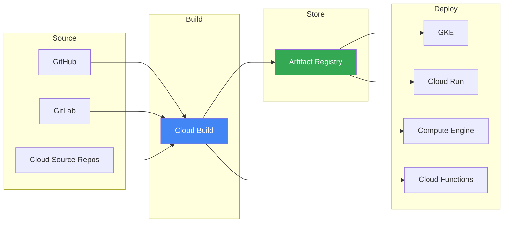
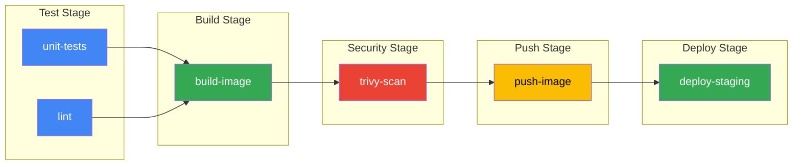

---
tags:
  - formation
  - gcp
  - cloud-build
  - ci-cd
  - artifact-registry
  - devops
---

# Module 7 : CI/CD avec Cloud Build & Artifact Registry

## Objectifs du Module

À la fin de ce module, vous serez capable de :

- :material-source-repository: Configurer Cloud Build pour l'intégration continue
- :material-docker: Stocker et gérer des images Docker avec Artifact Registry
- :material-pipe: Créer des pipelines multi-étapes avec `cloudbuild.yaml`
- :material-source-branch: Déclencher des builds automatiques (triggers)
- :material-rocket-launch: Déployer automatiquement sur GKE et Cloud Run

---

## 1. Vue d'ensemble CI/CD sur GCP

### Architecture CI/CD native GCP



### Services CI/CD GCP

| Service | Rôle | Équivalent |
|---------|------|------------|
| **Cloud Build** | CI/CD serverless | Jenkins, GitLab CI |
| **Artifact Registry** | Registre d'artefacts | Docker Hub, Nexus |
| **Cloud Source Repositories** | Git hosting | GitHub, GitLab |
| **Cloud Deploy** | CD GitOps | ArgoCD, Flux |

---

## 2. Artifact Registry

### Créer un repository

```bash
# Repository Docker
gcloud artifacts repositories create docker-repo \
    --repository-format=docker \
    --location=europe-west1 \
    --description="Production Docker images"

# Repository npm
gcloud artifacts repositories create npm-repo \
    --repository-format=npm \
    --location=europe-west1

# Repository Python (PyPI)
gcloud artifacts repositories create python-repo \
    --repository-format=python \
    --location=europe-west1

# Repository Maven
gcloud artifacts repositories create maven-repo \
    --repository-format=maven \
    --location=europe-west1

# Lister les repositories
gcloud artifacts repositories list --location=europe-west1
```

### Configurer l'authentification

```bash
# Docker
gcloud auth configure-docker europe-west1-docker.pkg.dev

# npm
gcloud artifacts print-settings npm \
    --repository=npm-repo \
    --location=europe-west1

# Python (pip)
gcloud artifacts print-settings python \
    --repository=python-repo \
    --location=europe-west1
```

### Push/Pull d'images Docker

```bash
# Format de l'URL
# LOCATION-docker.pkg.dev/PROJECT_ID/REPO_NAME/IMAGE:TAG

PROJECT_ID=$(gcloud config get-value project)
REGION="europe-west1"

# Tagger une image locale
docker tag myapp:latest ${REGION}-docker.pkg.dev/${PROJECT_ID}/docker-repo/myapp:v1.0.0
docker tag myapp:latest ${REGION}-docker.pkg.dev/${PROJECT_ID}/docker-repo/myapp:latest

# Push
docker push ${REGION}-docker.pkg.dev/${PROJECT_ID}/docker-repo/myapp:v1.0.0
docker push ${REGION}-docker.pkg.dev/${PROJECT_ID}/docker-repo/myapp:latest

# Pull
docker pull ${REGION}-docker.pkg.dev/${PROJECT_ID}/docker-repo/myapp:v1.0.0

# Lister les images
gcloud artifacts docker images list \
    ${REGION}-docker.pkg.dev/${PROJECT_ID}/docker-repo

# Lister les tags d'une image
gcloud artifacts docker tags list \
    ${REGION}-docker.pkg.dev/${PROJECT_ID}/docker-repo/myapp
```

### Politiques de nettoyage

```bash
# Supprimer les images non taggées de plus de 7 jours
gcloud artifacts docker images delete \
    ${REGION}-docker.pkg.dev/${PROJECT_ID}/docker-repo/myapp \
    --delete-tags \
    --filter="createTime<-P7D AND tags=''"

# Cleanup policy automatique (via Console ou Terraform)
# Artifacts Registry > Repository > Settings > Cleanup policies
```

### Scan de vulnérabilités

```bash
# Activer le scan automatique
gcloud services enable containeranalysis.googleapis.com
gcloud services enable containerscanning.googleapis.com

# Les images sont scannées automatiquement au push

# Voir les vulnérabilités
gcloud artifacts docker images list \
    ${REGION}-docker.pkg.dev/${PROJECT_ID}/docker-repo \
    --show-occurrences \
    --format="table(package,version,location,vulnerability.severity)"
```

---

## 3. Cloud Build Basics

### Premier build manuel

```bash
# Build une image depuis un Dockerfile
gcloud builds submit --tag ${REGION}-docker.pkg.dev/${PROJECT_ID}/docker-repo/myapp:v1

# Build avec un Dockerfile spécifique
gcloud builds submit --tag ${REGION}-docker.pkg.dev/${PROJECT_ID}/docker-repo/myapp:v1 \
    --dockerfile=Dockerfile.prod

# Build depuis une URL Git
gcloud builds submit \
    --tag ${REGION}-docker.pkg.dev/${PROJECT_ID}/docker-repo/myapp:v1 \
    https://github.com/user/repo.git#branch
```

### Configuration cloudbuild.yaml

```yaml
# cloudbuild.yaml - Pipeline basique
steps:
  # Étape 1 : Build l'image Docker
  - name: 'gcr.io/cloud-builders/docker'
    args: ['build', '-t', '${_REGION}-docker.pkg.dev/$PROJECT_ID/${_REPO}/myapp:$SHORT_SHA', '.']

  # Étape 2 : Push vers Artifact Registry
  - name: 'gcr.io/cloud-builders/docker'
    args: ['push', '${_REGION}-docker.pkg.dev/$PROJECT_ID/${_REPO}/myapp:$SHORT_SHA']

  # Étape 3 : Tag "latest"
  - name: 'gcr.io/cloud-builders/docker'
    args: ['tag',
           '${_REGION}-docker.pkg.dev/$PROJECT_ID/${_REPO}/myapp:$SHORT_SHA',
           '${_REGION}-docker.pkg.dev/$PROJECT_ID/${_REPO}/myapp:latest']

  - name: 'gcr.io/cloud-builders/docker'
    args: ['push', '${_REGION}-docker.pkg.dev/$PROJECT_ID/${_REPO}/myapp:latest']

# Images à stocker
images:
  - '${_REGION}-docker.pkg.dev/$PROJECT_ID/${_REPO}/myapp:$SHORT_SHA'
  - '${_REGION}-docker.pkg.dev/$PROJECT_ID/${_REPO}/myapp:latest'

# Variables de substitution
substitutions:
  _REGION: europe-west1
  _REPO: docker-repo

# Options
options:
  logging: CLOUD_LOGGING_ONLY
  machineType: 'E2_HIGHCPU_8'
```

### Exécuter un build avec cloudbuild.yaml

```bash
# Build local
gcloud builds submit --config=cloudbuild.yaml .

# Avec substitutions custom
gcloud builds submit --config=cloudbuild.yaml \
    --substitutions=_REGION=us-central1,_REPO=my-repo .

# Voir les logs
gcloud builds log BUILD_ID

# Lister les builds
gcloud builds list --limit=10
```

---

## 4. Pipelines Avancés

### Pipeline multi-étapes avec tests

```yaml
# cloudbuild.yaml - Pipeline complet
steps:
  # === STAGE: Test ===
  - id: 'unit-tests'
    name: 'node:18'
    entrypoint: 'npm'
    args: ['test']
    dir: 'app'

  - id: 'lint'
    name: 'node:18'
    entrypoint: 'npm'
    args: ['run', 'lint']
    dir: 'app'
    waitFor: ['-']  # Parallèle avec unit-tests

  # === STAGE: Build ===
  - id: 'build-image'
    name: 'gcr.io/cloud-builders/docker'
    args:
      - 'build'
      - '-t'
      - '${_REGION}-docker.pkg.dev/$PROJECT_ID/${_REPO}/myapp:$SHORT_SHA'
      - '-t'
      - '${_REGION}-docker.pkg.dev/$PROJECT_ID/${_REPO}/myapp:$BRANCH_NAME'
      - '--cache-from'
      - '${_REGION}-docker.pkg.dev/$PROJECT_ID/${_REPO}/myapp:latest'
      - '.'
    waitFor: ['unit-tests', 'lint']

  # === STAGE: Security Scan ===
  - id: 'trivy-scan'
    name: 'aquasec/trivy'
    args:
      - 'image'
      - '--exit-code'
      - '1'
      - '--severity'
      - 'HIGH,CRITICAL'
      - '${_REGION}-docker.pkg.dev/$PROJECT_ID/${_REPO}/myapp:$SHORT_SHA'
    waitFor: ['build-image']

  # === STAGE: Push ===
  - id: 'push-image'
    name: 'gcr.io/cloud-builders/docker'
    args: ['push', '--all-tags', '${_REGION}-docker.pkg.dev/$PROJECT_ID/${_REPO}/myapp']
    waitFor: ['trivy-scan']

  # === STAGE: Deploy to Staging ===
  - id: 'deploy-staging'
    name: 'gcr.io/cloud-builders/gke-deploy'
    args:
      - 'run'
      - '--filename=k8s/'
      - '--image=${_REGION}-docker.pkg.dev/$PROJECT_ID/${_REPO}/myapp:$SHORT_SHA'
      - '--cluster=staging-cluster'
      - '--location=europe-west1'
    waitFor: ['push-image']

images:
  - '${_REGION}-docker.pkg.dev/$PROJECT_ID/${_REPO}/myapp:$SHORT_SHA'
  - '${_REGION}-docker.pkg.dev/$PROJECT_ID/${_REPO}/myapp:$BRANCH_NAME'

substitutions:
  _REGION: europe-west1
  _REPO: docker-repo

options:
  machineType: 'E2_HIGHCPU_8'
  logging: CLOUD_LOGGING_ONLY

timeout: '1200s'
```

### Visualisation du pipeline



### Pipeline avec secrets

```yaml
steps:
  - id: 'deploy'
    name: 'gcr.io/cloud-builders/gcloud'
    entrypoint: 'bash'
    args:
      - '-c'
      - |
        # Le secret est monté comme variable d'environnement
        echo "Using API key: $${API_KEY:0:4}..."
        # Deploy avec le secret
        gcloud run deploy myapp \
          --image=${_IMAGE} \
          --set-env-vars="API_KEY=$$API_KEY"
    secretEnv: ['API_KEY']

availableSecrets:
  secretManager:
    - versionName: projects/$PROJECT_ID/secrets/api-key/versions/latest
      env: 'API_KEY'
```

---

## 5. Build Triggers

### Types de triggers

| Type | Déclencheur | Usage |
|------|-------------|-------|
| **Push to branch** | Push sur une branche | CI sur develop/feature |
| **Push to tag** | Tag créé | Release builds |
| **Pull Request** | PR ouverte/mise à jour | Validation PR |
| **Manual** | Invocation manuelle | Deploys manuels |
| **Pub/Sub** | Message Pub/Sub | Événements externes |
| **Webhook** | HTTP POST | Intégrations custom |

### Créer un trigger

```bash
# Trigger sur push vers main
gcloud builds triggers create github \
    --name="deploy-prod" \
    --repo-owner="myorg" \
    --repo-name="myapp" \
    --branch-pattern="^main$" \
    --build-config="cloudbuild.yaml" \
    --substitutions="_ENV=prod"

# Trigger sur tag (release)
gcloud builds triggers create github \
    --name="release-build" \
    --repo-owner="myorg" \
    --repo-name="myapp" \
    --tag-pattern="^v[0-9]+\.[0-9]+\.[0-9]+$" \
    --build-config="cloudbuild-release.yaml"

# Trigger sur PR
gcloud builds triggers create github \
    --name="pr-validation" \
    --repo-owner="myorg" \
    --repo-name="myapp" \
    --pull-request-pattern="^main$" \
    --build-config="cloudbuild-pr.yaml" \
    --comment-control="COMMENTS_ENABLED"

# Lister les triggers
gcloud builds triggers list

# Exécuter manuellement
gcloud builds triggers run deploy-prod --branch=main
```

### Fichier de configuration par environnement

```yaml
# cloudbuild-prod.yaml
steps:
  - id: 'build'
    name: 'gcr.io/cloud-builders/docker'
    args: ['build', '-t', '$_IMAGE:$SHORT_SHA', '.']

  - id: 'push'
    name: 'gcr.io/cloud-builders/docker'
    args: ['push', '$_IMAGE:$SHORT_SHA']

  # Approval Gate (via Cloud Deploy ou manuel)
  - id: 'deploy-prod'
    name: 'gcr.io/cloud-builders/gke-deploy'
    args:
      - 'run'
      - '--filename=k8s/prod/'
      - '--image=$_IMAGE:$SHORT_SHA'
      - '--cluster=prod-cluster'
      - '--location=europe-west1'

substitutions:
  _IMAGE: europe-west1-docker.pkg.dev/${PROJECT_ID}/docker-repo/myapp

options:
  logging: CLOUD_LOGGING_ONLY
```

---

## 6. Déploiement sur GKE

### Pipeline GKE complet

```yaml
# cloudbuild-gke.yaml
steps:
  # Build
  - id: 'build'
    name: 'gcr.io/cloud-builders/docker'
    args: ['build', '-t', '$_IMAGE:$SHORT_SHA', '.']

  # Push
  - id: 'push'
    name: 'gcr.io/cloud-builders/docker'
    args: ['push', '$_IMAGE:$SHORT_SHA']

  # Update Kubernetes manifests
  - id: 'update-manifests'
    name: 'gcr.io/cloud-builders/gcloud'
    entrypoint: 'bash'
    args:
      - '-c'
      - |
        sed -i "s|IMAGE_TAG|$SHORT_SHA|g" k8s/deployment.yaml
        cat k8s/deployment.yaml

  # Get GKE credentials
  - id: 'get-credentials'
    name: 'gcr.io/cloud-builders/gcloud'
    args:
      - 'container'
      - 'clusters'
      - 'get-credentials'
      - '$_CLUSTER'
      - '--region=$_REGION'

  # Apply Kubernetes manifests
  - id: 'deploy'
    name: 'gcr.io/cloud-builders/kubectl'
    args: ['apply', '-f', 'k8s/']
    env:
      - 'CLOUDSDK_COMPUTE_REGION=$_REGION'
      - 'CLOUDSDK_CONTAINER_CLUSTER=$_CLUSTER'

  # Wait for rollout
  - id: 'wait-rollout'
    name: 'gcr.io/cloud-builders/kubectl'
    args: ['rollout', 'status', 'deployment/myapp', '-n', 'default', '--timeout=300s']
    env:
      - 'CLOUDSDK_COMPUTE_REGION=$_REGION'
      - 'CLOUDSDK_CONTAINER_CLUSTER=$_CLUSTER'

substitutions:
  _IMAGE: europe-west1-docker.pkg.dev/${PROJECT_ID}/docker-repo/myapp
  _CLUSTER: prod-cluster
  _REGION: europe-west1

images:
  - '$_IMAGE:$SHORT_SHA'

options:
  logging: CLOUD_LOGGING_ONLY
```

### Manifests Kubernetes pour CI/CD

```yaml
# k8s/deployment.yaml
apiVersion: apps/v1
kind: Deployment
metadata:
  name: myapp
  labels:
    app: myapp
spec:
  replicas: 3
  selector:
    matchLabels:
      app: myapp
  template:
    metadata:
      labels:
        app: myapp
    spec:
      containers:
      - name: myapp
        image: europe-west1-docker.pkg.dev/PROJECT_ID/docker-repo/myapp:IMAGE_TAG
        ports:
        - containerPort: 8080
        resources:
          requests:
            cpu: 100m
            memory: 128Mi
          limits:
            cpu: 500m
            memory: 512Mi
        livenessProbe:
          httpGet:
            path: /health
            port: 8080
          initialDelaySeconds: 10
        readinessProbe:
          httpGet:
            path: /ready
            port: 8080
          initialDelaySeconds: 5
```

---

## 7. Déploiement sur Cloud Run

### Pipeline Cloud Run

```yaml
# cloudbuild-cloudrun.yaml
steps:
  # Build
  - id: 'build'
    name: 'gcr.io/cloud-builders/docker'
    args:
      - 'build'
      - '-t'
      - '$_IMAGE:$SHORT_SHA'
      - '-t'
      - '$_IMAGE:latest'
      - '.'

  # Push
  - id: 'push'
    name: 'gcr.io/cloud-builders/docker'
    args: ['push', '--all-tags', '$_IMAGE']

  # Deploy to Cloud Run
  - id: 'deploy'
    name: 'gcr.io/cloud-builders/gcloud'
    args:
      - 'run'
      - 'deploy'
      - 'myapp'
      - '--image=$_IMAGE:$SHORT_SHA'
      - '--region=$_REGION'
      - '--platform=managed'
      - '--allow-unauthenticated'
      - '--cpu=1'
      - '--memory=512Mi'
      - '--min-instances=0'
      - '--max-instances=10'
      - '--set-env-vars=ENV=production'

substitutions:
  _IMAGE: europe-west1-docker.pkg.dev/${PROJECT_ID}/docker-repo/myapp
  _REGION: europe-west1

images:
  - '$_IMAGE:$SHORT_SHA'
  - '$_IMAGE:latest'
```

### Traffic splitting pour canary deployments

```yaml
steps:
  # Deploy nouvelle revision sans traffic
  - id: 'deploy-canary'
    name: 'gcr.io/cloud-builders/gcloud'
    args:
      - 'run'
      - 'deploy'
      - 'myapp'
      - '--image=$_IMAGE:$SHORT_SHA'
      - '--region=$_REGION'
      - '--no-traffic'
      - '--tag=canary'

  # Envoyer 10% du traffic vers canary
  - id: 'traffic-split'
    name: 'gcr.io/cloud-builders/gcloud'
    args:
      - 'run'
      - 'services'
      - 'update-traffic'
      - 'myapp'
      - '--region=$_REGION'
      - '--to-tags=canary=10'
```

---

## 8. Exercices Pratiques

### Exercice 1 : Pipeline basique

!!! example "Exercice"
    1. Créez un repository Artifact Registry `training-repo`
    2. Créez une application Node.js simple avec Dockerfile
    3. Écrivez un `cloudbuild.yaml` qui build et push l'image
    4. Exécutez le build manuellement

??? quote "Solution"
    ```bash
    # Créer le repository
    gcloud artifacts repositories create training-repo \
        --repository-format=docker \
        --location=europe-west1

    # Créer l'application
    mkdir myapp && cd myapp

    cat > package.json << 'EOF'
    {
      "name": "myapp",
      "version": "1.0.0",
      "scripts": {
        "start": "node server.js",
        "test": "echo 'Tests passed'"
      }
    }
    EOF

    cat > server.js << 'EOF'
    const http = require('http');
    const server = http.createServer((req, res) => {
      res.writeHead(200);
      res.end('Hello from Cloud Build!');
    });
    server.listen(8080, () => console.log('Server running on port 8080'));
    EOF

    cat > Dockerfile << 'EOF'
    FROM node:18-alpine
    WORKDIR /app
    COPY package*.json ./
    RUN npm install --production
    COPY . .
    EXPOSE 8080
    CMD ["npm", "start"]
    EOF

    cat > cloudbuild.yaml << 'EOF'
    steps:
      - name: 'gcr.io/cloud-builders/docker'
        args: ['build', '-t', '${_REGION}-docker.pkg.dev/$PROJECT_ID/${_REPO}/myapp:$SHORT_SHA', '.']

      - name: 'gcr.io/cloud-builders/docker'
        args: ['push', '${_REGION}-docker.pkg.dev/$PROJECT_ID/${_REPO}/myapp:$SHORT_SHA']

    images:
      - '${_REGION}-docker.pkg.dev/$PROJECT_ID/${_REPO}/myapp:$SHORT_SHA'

    substitutions:
      _REGION: europe-west1
      _REPO: training-repo
    EOF

    # Exécuter le build
    gcloud builds submit --config=cloudbuild.yaml .

    # Vérifier l'image
    gcloud artifacts docker images list \
        europe-west1-docker.pkg.dev/$(gcloud config get-value project)/training-repo
    ```

### Exercice 2 : Pipeline avec tests et déploiement Cloud Run

!!! example "Exercice"
    1. Ajoutez des tests à l'application
    2. Modifiez le `cloudbuild.yaml` pour :
        - Exécuter les tests
        - Builder l'image
        - Déployer sur Cloud Run
    3. Créez un trigger sur la branche `main`

??? quote "Solution"
    ```bash
    # cloudbuild.yaml amélioré
    cat > cloudbuild.yaml << 'EOF'
    steps:
      # Tests
      - id: 'test'
        name: 'node:18'
        entrypoint: 'npm'
        args: ['test']

      # Build
      - id: 'build'
        name: 'gcr.io/cloud-builders/docker'
        args:
          - 'build'
          - '-t'
          - '${_REGION}-docker.pkg.dev/$PROJECT_ID/${_REPO}/myapp:$SHORT_SHA'
          - '.'
        waitFor: ['test']

      # Push
      - id: 'push'
        name: 'gcr.io/cloud-builders/docker'
        args: ['push', '${_REGION}-docker.pkg.dev/$PROJECT_ID/${_REPO}/myapp:$SHORT_SHA']

      # Deploy Cloud Run
      - id: 'deploy'
        name: 'gcr.io/cloud-builders/gcloud'
        args:
          - 'run'
          - 'deploy'
          - 'myapp'
          - '--image=${_REGION}-docker.pkg.dev/$PROJECT_ID/${_REPO}/myapp:$SHORT_SHA'
          - '--region=${_REGION}'
          - '--platform=managed'
          - '--allow-unauthenticated'

    substitutions:
      _REGION: europe-west1
      _REPO: training-repo

    images:
      - '${_REGION}-docker.pkg.dev/$PROJECT_ID/${_REPO}/myapp:$SHORT_SHA'
    EOF

    # Exécuter
    gcloud builds submit --config=cloudbuild.yaml .

    # Obtenir l'URL Cloud Run
    gcloud run services describe myapp --region=europe-west1 --format="get(status.url)"
    ```

### Exercice 3 : Canary deployment

!!! example "Exercice"
    Implémentez un canary deployment sur Cloud Run :

    1. Déployez une v1 avec 100% du traffic
    2. Déployez une v2 avec tag "canary" sans traffic
    3. Routez 20% du traffic vers canary
    4. Observez puis faites un rollout complet ou rollback

??? quote "Solution"
    ```bash
    # V1 avec 100% traffic
    gcloud run deploy myapp \
        --image=europe-west1-docker.pkg.dev/$PROJECT_ID/training-repo/myapp:v1 \
        --region=europe-west1 \
        --platform=managed

    # V2 sans traffic, tag canary
    gcloud run deploy myapp \
        --image=europe-west1-docker.pkg.dev/$PROJECT_ID/training-repo/myapp:v2 \
        --region=europe-west1 \
        --no-traffic \
        --tag=canary

    # 20% vers canary
    gcloud run services update-traffic myapp \
        --region=europe-west1 \
        --to-tags=canary=20

    # Observer (générer du traffic et voir les logs)
    URL=$(gcloud run services describe myapp --region=europe-west1 --format="get(status.url)")
    for i in {1..100}; do curl -s $URL; done

    # Rollout complet vers canary
    gcloud run services update-traffic myapp \
        --region=europe-west1 \
        --to-latest

    # OU Rollback (100% vers revision précédente)
    gcloud run services update-traffic myapp \
        --region=europe-west1 \
        --to-revisions=myapp-00001-xxx=100
    ```

---

## Exercice : À Vous de Jouer

!!! example "Mise en Pratique"
    **Objectif** : Mettre en place un pipeline CI/CD complet avec Cloud Build, Artifact Registry et déploiement automatique sur Cloud Run

    **Contexte** : Vous devez automatiser le déploiement d'une application web conteneurisée. À chaque push sur la branche `main`, l'application doit être buildée, testée, son image stockée dans Artifact Registry, et déployée automatiquement sur Cloud Run en production.

    **Tâches à réaliser** :

    1. Créer un repository Artifact Registry `cicd-repo` pour Docker
    2. Créer une application web simple (Node.js ou Python) avec un Dockerfile
    3. Builder l'image manuellement et la pousser dans Artifact Registry
    4. Déployer manuellement sur Cloud Run pour valider l'image
    5. Créer un fichier `cloudbuild.yaml` avec 4 étapes :
        - Build de l'image Docker
        - Push vers Artifact Registry
        - Tests (basiques)
        - Déploiement sur Cloud Run
    6. Créer un Build Trigger lié à un repository GitHub/Cloud Source
    7. Effectuer un push et vérifier le déploiement automatique
    8. Configurer une deuxième révision avec traffic splitting (50/50)

    **Critères de validation** :

    - [ ] Artifact Registry repository créé
    - [ ] Image Docker buildée et poussée
    - [ ] Application déployée sur Cloud Run
    - [ ] Fichier `cloudbuild.yaml` fonctionnel avec toutes les étapes
    - [ ] Build trigger configuré
    - [ ] Pipeline déclenché automatiquement au push
    - [ ] Traffic splitting configuré entre deux révisions
    - [ ] Logs du build accessibles et sans erreur

??? quote "Solution"
    ```bash
    # 1. Créer Artifact Registry
    REGION="europe-west1"
    PROJECT_ID=$(gcloud config get-value project)

    gcloud artifacts repositories create cicd-repo \
        --repository-format=docker \
        --location=$REGION \
        --description="CI/CD Pipeline Repository"

    gcloud auth configure-docker ${REGION}-docker.pkg.dev

    # 2. Créer l'application
    mkdir my-cicd-app && cd my-cicd-app

    cat > app.js << 'EOF'
    const express = require('express');
    const app = express();
    const PORT = process.env.PORT || 8080;

    app.get('/', (req, res) => {
        res.json({
            message: 'Hello from CI/CD Pipeline!',
            version: process.env.VERSION || '1.0',
            timestamp: new Date().toISOString()
        });
    });

    app.get('/health', (req, res) => res.json({ status: 'healthy' }));

    app.listen(PORT, () => {
        console.log(`Server running on port ${PORT}`);
    });
    EOF

    cat > package.json << 'EOF'
    {
      "name": "cicd-app",
      "version": "1.0.0",
      "main": "app.js",
      "scripts": {
        "start": "node app.js",
        "test": "echo 'Tests passed!'"
      },
      "dependencies": {
        "express": "^4.18.0"
      }
    }
    EOF

    cat > Dockerfile << 'EOF'
    FROM node:18-alpine
    WORKDIR /app
    COPY package*.json ./
    RUN npm install --production
    COPY . .
    EXPOSE 8080
    CMD ["npm", "start"]
    EOF

    # 3. Build et push manuel
    IMAGE="${REGION}-docker.pkg.dev/${PROJECT_ID}/cicd-repo/myapp:v1"

    gcloud builds submit --tag=$IMAGE

    # 4. Déployer sur Cloud Run
    gcloud run deploy myapp \
        --image=$IMAGE \
        --region=$REGION \
        --platform=managed \
        --allow-unauthenticated \
        --port=8080

    # Tester
    URL=$(gcloud run services describe myapp --region=$REGION --format="get(status.url)")
    curl $URL

    # 5. Créer cloudbuild.yaml
    cat > cloudbuild.yaml << 'EOF'
    steps:
      # Step 1: Build
      - id: 'build'
        name: 'gcr.io/cloud-builders/docker'
        args: [
          'build',
          '-t', '${_REGION}-docker.pkg.dev/$PROJECT_ID/${_REPO}/myapp:$SHORT_SHA',
          '-t', '${_REGION}-docker.pkg.dev/$PROJECT_ID/${_REPO}/myapp:latest',
          '.'
        ]

      # Step 2: Push
      - id: 'push'
        name: 'gcr.io/cloud-builders/docker'
        args: [
          'push',
          '--all-tags',
          '${_REGION}-docker.pkg.dev/$PROJECT_ID/${_REPO}/myapp'
        ]

      # Step 3: Test
      - id: 'test'
        name: 'node:18-alpine'
        entrypoint: 'sh'
        args:
          - '-c'
          - |
            npm install
            npm test

      # Step 4: Deploy
      - id: 'deploy'
        name: 'gcr.io/cloud-builders/gcloud'
        args: [
          'run', 'deploy', 'myapp',
          '--image', '${_REGION}-docker.pkg.dev/$PROJECT_ID/${_REPO}/myapp:$SHORT_SHA',
          '--region', '${_REGION}',
          '--platform', 'managed',
          '--allow-unauthenticated'
        ]

    substitutions:
      _REGION: europe-west1
      _REPO: cicd-repo

    images:
      - '${_REGION}-docker.pkg.dev/$PROJECT_ID/${_REPO}/myapp:$SHORT_SHA'
      - '${_REGION}-docker.pkg.dev/$PROJECT_ID/${_REPO}/myapp:latest'

    options:
      logging: CLOUD_LOGGING_ONLY
    EOF

    # 6. Créer un trigger (si repository Git disponible)
    # gcloud builds triggers create github \
    #     --repo-name=my-repo \
    #     --repo-owner=my-github \
    #     --branch-pattern="^main$" \
    #     --build-config=cloudbuild.yaml

    # Alternative: Build manuel avec cloudbuild.yaml
    gcloud builds submit --config=cloudbuild.yaml

    # 7. Traffic splitting (v1 vs v2)
    # Modifier app.js avec version 2.0
    sed -i "s/version: '1.0'/version: '2.0'/g" app.js

    # Build v2
    IMAGE_V2="${REGION}-docker.pkg.dev/${PROJECT_ID}/cicd-repo/myapp:v2"
    gcloud builds submit --tag=$IMAGE_V2

    # Déployer v2 sans traffic
    gcloud run deploy myapp \
        --image=$IMAGE_V2 \
        --region=$REGION \
        --no-traffic \
        --tag=v2

    # Split traffic 50/50
    gcloud run services update-traffic myapp \
        --region=$REGION \
        --to-revisions=LATEST=50,v2=50

    # Validation
    echo "=== VALIDATION ==="
    gcloud run services describe myapp --region=$REGION
    gcloud builds list --limit=5

    echo ""
    echo "✅ Pipeline CI/CD configuré!"
    echo "URL: $URL"
    ```

---

## 9. Nettoyage

```bash
# Cloud Run
gcloud run services delete myapp --region=europe-west1 --quiet

# Artifact Registry (attention : supprime toutes les images)
gcloud artifacts repositories delete training-repo \
    --location=europe-west1 --quiet

# Build triggers
gcloud builds triggers list --format="value(id)" | \
    xargs -I {} gcloud builds triggers delete {} --quiet
```

---

## Résumé du Module

| Concept | Points clés |
|---------|-------------|
| **Artifact Registry** | Registre multi-format (Docker, npm, Maven, Python) |
| **Cloud Build** | CI/CD serverless, fichier `cloudbuild.yaml` |
| **Triggers** | Push, tag, PR, webhook, Pub/Sub |
| **Secrets** | Intégration Secret Manager |
| **GKE Deploy** | kubectl, gke-deploy builders |
| **Cloud Run** | Déploiement serverless, canary avec traffic splitting |

---

**[← Retour au Module 6](06-tp-final.md)** | **[Continuer vers le Module 8 : Serverless →](08-module.md)**

---

**Retour au :** [Programme de la Formation](index.md) | [Catalogue des Formations](../index.md)
