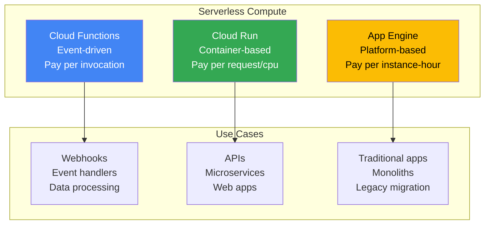
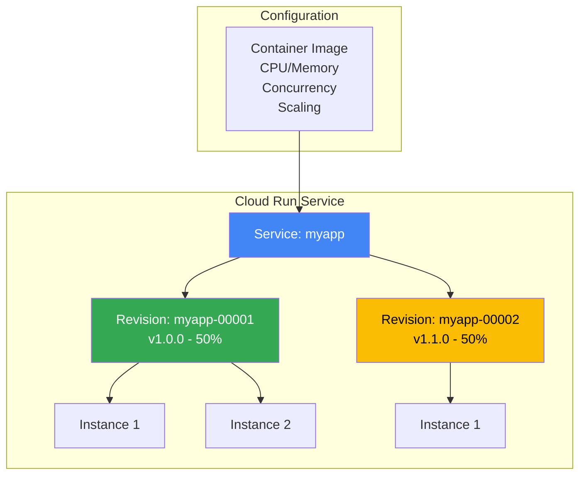
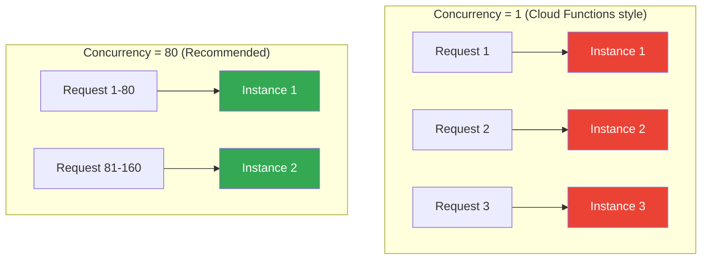
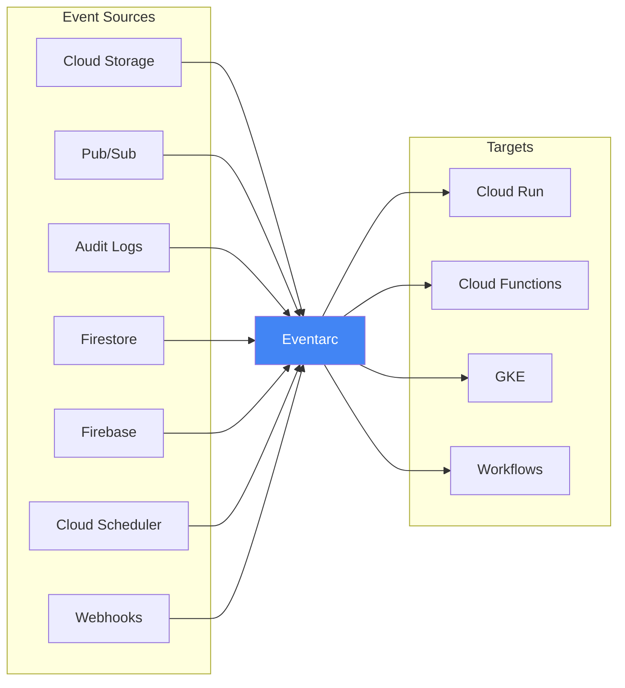
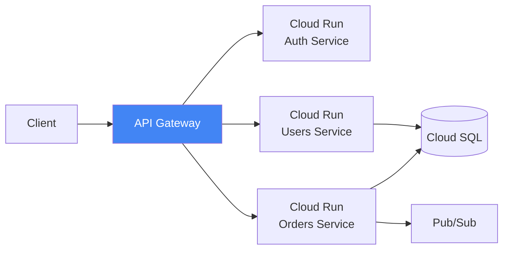
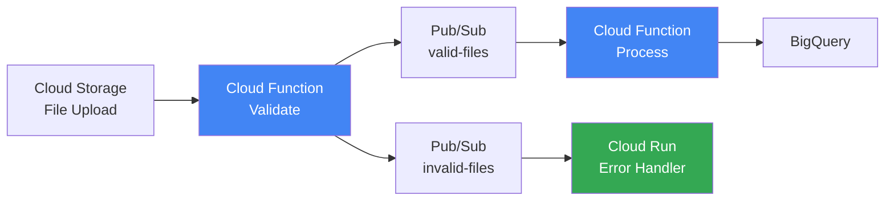
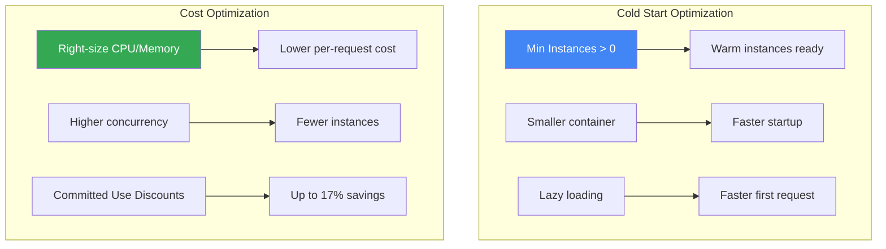

---
tags:
  - formation
  - gcp
  - serverless
  - cloud-functions
  - cloud-run
  - event-driven
---

# Module 8 : Serverless - Cloud Functions & Cloud Run

## Objectifs du Module

À la fin de ce module, vous serez capable de :

- :material-function: Créer des Cloud Functions (1st et 2nd gen)
- :material-docker: Déployer des applications containerisées sur Cloud Run
- :material-lightning-bolt: Comprendre les triggers et événements GCP
- :material-scale-balance: Configurer l'autoscaling et la concurrence
- :material-currency-usd: Optimiser les coûts serverless

---

## 1. Introduction au Serverless sur GCP

### Comparaison des services serverless



| Service | Runtime | Scaling | Cold Start | Max Duration |
|---------|---------|---------|------------|--------------|
| **Cloud Functions** | Code | 0 to 1000 | ~500ms-2s | 9min (1st gen) / 60min (2nd gen) |
| **Cloud Run** | Container | 0 to 1000 | ~1-3s | 60min |
| **App Engine** | Code/Container | 0 to N | ~3-10s | Unlimited |

---

## 2. Cloud Functions

### Générations de Cloud Functions

| Aspect | 1st Gen | 2nd Gen |
|--------|---------|---------|
| Infrastructure | Propriétaire | Cloud Run |
| Max instances | 1000 | 1000 |
| Max timeout | 9 min | 60 min |
| Min instances | 0 | 0+ (warm) |
| Concurrence | 1 req/instance | Configurable |
| Triggers | HTTP, GCS, Pub/Sub, Firestore | + Eventarc (2nd gen) |

### Cloud Function HTTP (Python)

```python
# main.py
import functions_framework
from flask import jsonify

@functions_framework.http
def hello_http(request):
    """HTTP Cloud Function."""
    request_json = request.get_json(silent=True)
    name = request_json.get('name', 'World') if request_json else 'World'

    return jsonify({
        'message': f'Hello, {name}!',
        'status': 'success'
    })
```

```txt
# requirements.txt
functions-framework==3.*
flask==2.*
```

### Déployer une Cloud Function

```bash
# 1st Gen - HTTP
gcloud functions deploy hello-http \
    --gen1 \
    --runtime=python311 \
    --trigger-http \
    --allow-unauthenticated \
    --region=europe-west1 \
    --entry-point=hello_http \
    --memory=256MB \
    --timeout=60s

# 2nd Gen - HTTP (recommandé)
gcloud functions deploy hello-http-v2 \
    --gen2 \
    --runtime=python311 \
    --trigger-http \
    --allow-unauthenticated \
    --region=europe-west1 \
    --entry-point=hello_http \
    --memory=256Mi \
    --timeout=60s \
    --min-instances=0 \
    --max-instances=10

# Tester
FUNCTION_URL=$(gcloud functions describe hello-http-v2 --region=europe-west1 --format="get(url)")
curl -X POST $FUNCTION_URL \
    -H "Content-Type: application/json" \
    -d '{"name": "GCP Developer"}'
```

### Cloud Function avec Pub/Sub trigger

```python
# main.py
import base64
import functions_framework
from cloudevents.http import CloudEvent

@functions_framework.cloud_event
def process_pubsub(cloud_event: CloudEvent):
    """Triggered by Pub/Sub message."""
    # Décoder le message
    message_data = base64.b64decode(cloud_event.data["message"]["data"]).decode()

    print(f"Received message: {message_data}")
    print(f"Event ID: {cloud_event['id']}")
    print(f"Event Type: {cloud_event['type']}")

    # Traitement du message
    # ...
```

```bash
# Créer un topic Pub/Sub
gcloud pubsub topics create my-topic

# Déployer la function (2nd gen)
gcloud functions deploy process-pubsub \
    --gen2 \
    --runtime=python311 \
    --trigger-topic=my-topic \
    --region=europe-west1 \
    --entry-point=process_pubsub

# Tester
gcloud pubsub topics publish my-topic --message="Hello from Pub/Sub!"

# Voir les logs
gcloud functions logs read process-pubsub --region=europe-west1
```

### Cloud Function avec Cloud Storage trigger

```python
# main.py
import functions_framework
from cloudevents.http import CloudEvent

@functions_framework.cloud_event
def process_gcs(cloud_event: CloudEvent):
    """Triggered by Cloud Storage event."""
    data = cloud_event.data

    bucket = data["bucket"]
    name = data["name"]
    event_type = cloud_event["type"]

    print(f"Event: {event_type}")
    print(f"Bucket: {bucket}")
    print(f"File: {name}")

    if event_type == "google.cloud.storage.object.v1.finalized":
        print(f"New file uploaded: gs://{bucket}/{name}")
        # Process the file...
```

```bash
# Créer un bucket
gsutil mb -l europe-west1 gs://my-trigger-bucket-$PROJECT_ID

# Déployer
gcloud functions deploy process-gcs \
    --gen2 \
    --runtime=python311 \
    --trigger-bucket=my-trigger-bucket-$PROJECT_ID \
    --region=europe-west1 \
    --entry-point=process_gcs

# Tester
echo "test content" > test.txt
gsutil cp test.txt gs://my-trigger-bucket-$PROJECT_ID/

# Logs
gcloud functions logs read process-gcs --region=europe-west1
```

---

## 3. Cloud Run

### Concepts Cloud Run



### Déployer sur Cloud Run

```bash
# Depuis une image existante
gcloud run deploy myapp \
    --image=europe-west1-docker.pkg.dev/$PROJECT_ID/docker-repo/myapp:v1 \
    --region=europe-west1 \
    --platform=managed \
    --allow-unauthenticated \
    --port=8080

# Depuis le code source (avec buildpacks)
gcloud run deploy myapp \
    --source=. \
    --region=europe-west1 \
    --platform=managed \
    --allow-unauthenticated

# Options avancées
gcloud run deploy myapp \
    --image=europe-west1-docker.pkg.dev/$PROJECT_ID/docker-repo/myapp:v1 \
    --region=europe-west1 \
    --platform=managed \
    --cpu=2 \
    --memory=1Gi \
    --min-instances=1 \
    --max-instances=100 \
    --concurrency=80 \
    --timeout=300 \
    --set-env-vars="DB_HOST=10.0.0.5,ENV=production" \
    --service-account=myapp-sa@$PROJECT_ID.iam.gserviceaccount.com \
    --vpc-connector=my-connector \
    --vpc-egress=all-traffic
```

### Application Cloud Run (Go)

```go
// main.go
package main

import (
    "encoding/json"
    "log"
    "net/http"
    "os"
)

type Response struct {
    Message string `json:"message"`
    Service string `json:"service"`
    Version string `json:"version"`
}

func handler(w http.ResponseWriter, r *http.Request) {
    response := Response{
        Message: "Hello from Cloud Run!",
        Service: os.Getenv("K_SERVICE"),
        Version: os.Getenv("K_REVISION"),
    }

    w.Header().Set("Content-Type", "application/json")
    json.NewEncoder(w).Encode(response)
}

func main() {
    port := os.Getenv("PORT")
    if port == "" {
        port = "8080"
    }

    http.HandleFunc("/", handler)

    log.Printf("Starting server on port %s", port)
    log.Fatal(http.ListenAndServe(":"+port, nil))
}
```

```dockerfile
# Dockerfile
FROM golang:1.21-alpine AS builder
WORKDIR /app
COPY . .
RUN go build -o server .

FROM alpine:3.18
COPY --from=builder /app/server /server
EXPOSE 8080
CMD ["/server"]
```

### Configuration de la concurrence



```bash
# Concurrence élevée = moins d'instances = moins coûteux
gcloud run services update myapp \
    --region=europe-west1 \
    --concurrency=80

# Pour workloads CPU-bound, réduire la concurrence
gcloud run services update myapp \
    --region=europe-west1 \
    --concurrency=1 \
    --cpu=2
```

### Traffic splitting

```bash
# Déployer nouvelle version sans traffic
gcloud run deploy myapp \
    --image=europe-west1-docker.pkg.dev/$PROJECT_ID/docker-repo/myapp:v2 \
    --region=europe-west1 \
    --no-traffic \
    --tag=v2

# Canary : 10% vers v2
gcloud run services update-traffic myapp \
    --region=europe-west1 \
    --to-tags=v2=10

# Gradual rollout : 50%
gcloud run services update-traffic myapp \
    --region=europe-west1 \
    --to-tags=v2=50

# Full rollout
gcloud run services update-traffic myapp \
    --region=europe-west1 \
    --to-latest

# Rollback immédiat
gcloud run services update-traffic myapp \
    --region=europe-west1 \
    --to-revisions=myapp-00001-xxx=100
```

---

## 4. Eventarc - Event-Driven Architecture

### Sources d'événements



### Créer des triggers Eventarc

```bash
# Trigger sur Cloud Storage
gcloud eventarc triggers create gcs-trigger \
    --location=europe-west1 \
    --service-account=my-sa@$PROJECT_ID.iam.gserviceaccount.com \
    --destination-run-service=myapp \
    --destination-run-region=europe-west1 \
    --event-filters="type=google.cloud.storage.object.v1.finalized" \
    --event-filters="bucket=my-bucket"

# Trigger sur Audit Logs (ex: création de VM)
gcloud eventarc triggers create vm-created-trigger \
    --location=europe-west1 \
    --service-account=my-sa@$PROJECT_ID.iam.gserviceaccount.com \
    --destination-run-service=myapp \
    --destination-run-region=europe-west1 \
    --event-filters="type=google.cloud.audit.log.v1.written" \
    --event-filters="serviceName=compute.googleapis.com" \
    --event-filters="methodName=v1.compute.instances.insert"

# Trigger périodique avec Cloud Scheduler
gcloud scheduler jobs create http daily-job \
    --location=europe-west1 \
    --schedule="0 9 * * *" \
    --uri="https://myapp-xxx.run.app/cron" \
    --http-method=POST \
    --oidc-service-account-email=scheduler-sa@$PROJECT_ID.iam.gserviceaccount.com

# Lister les triggers
gcloud eventarc triggers list --location=europe-west1
```

---

## 5. Patterns Serverless

### Pattern 1 : API Gateway avec Cloud Run



### Pattern 2 : Event Processing Pipeline



### Pattern 3 : Scheduled Batch Processing

```yaml
# Cloud Scheduler → Cloud Run Jobs
apiVersion: run.googleapis.com/v1
kind: Job
metadata:
  name: batch-processor
spec:
  template:
    spec:
      containers:
      - image: europe-west1-docker.pkg.dev/PROJECT/repo/batch:v1
        resources:
          limits:
            cpu: "2"
            memory: "4Gi"
      maxRetries: 3
      taskCount: 10  # Parallel tasks
      parallelism: 5
```

```bash
# Créer un Cloud Run Job
gcloud run jobs create batch-processor \
    --image=europe-west1-docker.pkg.dev/$PROJECT_ID/docker-repo/batch:v1 \
    --region=europe-west1 \
    --cpu=2 \
    --memory=4Gi \
    --task-timeout=3600 \
    --max-retries=3

# Exécuter manuellement
gcloud run jobs execute batch-processor --region=europe-west1

# Scheduler pour exécution quotidienne
gcloud scheduler jobs create http batch-daily \
    --location=europe-west1 \
    --schedule="0 2 * * *" \
    --uri="https://europe-west1-run.googleapis.com/apis/run.googleapis.com/v1/namespaces/$PROJECT_ID/jobs/batch-processor:run" \
    --http-method=POST \
    --oauth-service-account-email=scheduler-sa@$PROJECT_ID.iam.gserviceaccount.com
```

---

## 6. Optimisation des Coûts

### Stratégies d'optimisation



### Configuration optimale Cloud Run

```bash
# Production : Min instances pour éviter cold starts
gcloud run services update myapp \
    --region=europe-west1 \
    --min-instances=1 \
    --max-instances=100 \
    --concurrency=80 \
    --cpu=1 \
    --memory=512Mi \
    --cpu-throttling  # CPU alloué seulement pendant les requêtes

# Dev/Test : Scale to zero
gcloud run services update myapp-dev \
    --region=europe-west1 \
    --min-instances=0 \
    --max-instances=10 \
    --concurrency=80 \
    --cpu=0.5 \
    --memory=256Mi
```

### Comparaison des coûts

| Scénario | Cloud Functions | Cloud Run |
|----------|-----------------|-----------|
| 1M requests/mois, 200ms avg | ~$0.40 | ~$0.36 |
| 10M requests/mois, 200ms avg | ~$4.00 | ~$3.60 |
| 100M requests/mois, 200ms avg | ~$40.00 | ~$36.00 |
| Avec min-instances=1 | N/A | +~$15/mois |

---

## 7. Exercices Pratiques

### Exercice 1 : Cloud Function HTTP

!!! example "Exercice"
    Créez une Cloud Function (2nd gen) qui :

    1. Reçoit un JSON avec `{"text": "..."}`
    2. Retourne le texte en majuscules et sa longueur
    3. Log le résultat dans Cloud Logging

??? quote "Solution"
    ```python
    # main.py
    import functions_framework
    from flask import jsonify
    import logging

    logging.basicConfig(level=logging.INFO)
    logger = logging.getLogger(__name__)

    @functions_framework.http
    def uppercase(request):
        request_json = request.get_json(silent=True)

        if not request_json or 'text' not in request_json:
            return jsonify({'error': 'Missing "text" field'}), 400

        text = request_json['text']
        upper_text = text.upper()
        length = len(text)

        logger.info(f"Processed: {text[:50]}... -> Length: {length}")

        return jsonify({
            'original': text,
            'uppercase': upper_text,
            'length': length
        })
    ```

    ```bash
    # requirements.txt
    functions-framework==3.*
    flask>=2.0

    # Déployer
    gcloud functions deploy uppercase \
        --gen2 \
        --runtime=python311 \
        --trigger-http \
        --allow-unauthenticated \
        --region=europe-west1 \
        --entry-point=uppercase

    # Tester
    FUNCTION_URL=$(gcloud functions describe uppercase --region=europe-west1 --format="get(url)")
    curl -X POST $FUNCTION_URL \
        -H "Content-Type: application/json" \
        -d '{"text": "hello serverless world"}'
    ```

### Exercice 2 : Event Processing avec Pub/Sub

!!! example "Exercice"
    Créez un système de traitement d'événements :

    1. Cloud Function qui reçoit des messages Pub/Sub
    2. Parse le message JSON et valide le format
    3. Publie vers un topic "processed" ou "errors"

??? quote "Solution"
    ```python
    # main.py
    import base64
    import json
    import functions_framework
    from google.cloud import pubsub_v1
    from cloudevents.http import CloudEvent
    import os

    publisher = pubsub_v1.PublisherClient()
    PROJECT_ID = os.environ.get('PROJECT_ID')

    @functions_framework.cloud_event
    def process_event(cloud_event: CloudEvent):
        # Décoder le message
        message_data = base64.b64decode(cloud_event.data["message"]["data"]).decode()

        try:
            data = json.loads(message_data)

            # Validation
            if 'id' not in data or 'value' not in data:
                raise ValueError("Missing required fields: id, value")

            # Traitement
            processed = {
                'id': data['id'],
                'value': data['value'],
                'processed': True,
                'original_event_id': cloud_event['id']
            }

            # Publier vers "processed"
            topic_path = publisher.topic_path(PROJECT_ID, 'processed')
            publisher.publish(topic_path, json.dumps(processed).encode())
            print(f"Successfully processed: {data['id']}")

        except Exception as e:
            # Publier vers "errors"
            error_data = {
                'original_message': message_data,
                'error': str(e),
                'event_id': cloud_event['id']
            }
            topic_path = publisher.topic_path(PROJECT_ID, 'errors')
            publisher.publish(topic_path, json.dumps(error_data).encode())
            print(f"Error processing message: {e}")
    ```

    ```bash
    # Créer les topics
    gcloud pubsub topics create input-events
    gcloud pubsub topics create processed
    gcloud pubsub topics create errors

    # Déployer
    gcloud functions deploy process-event \
        --gen2 \
        --runtime=python311 \
        --trigger-topic=input-events \
        --region=europe-west1 \
        --entry-point=process_event \
        --set-env-vars=PROJECT_ID=$PROJECT_ID

    # Tester
    gcloud pubsub topics publish input-events \
        --message='{"id": "123", "value": "test"}'

    gcloud pubsub topics publish input-events \
        --message='{"invalid": "data"}'

    # Voir les logs
    gcloud functions logs read process-event --region=europe-west1
    ```

### Exercice 3 : API REST avec Cloud Run

!!! example "Exercice"
    Déployez une API REST sur Cloud Run avec :

    1. Endpoints : GET /items, POST /items, GET /items/{id}
    2. Stockage en mémoire (dict Python)
    3. Health check endpoint

??? quote "Solution"
    ```python
    # main.py
    from flask import Flask, jsonify, request
    import uuid

    app = Flask(__name__)
    items = {}

    @app.route('/health')
    def health():
        return jsonify({'status': 'healthy'})

    @app.route('/items', methods=['GET'])
    def get_items():
        return jsonify(list(items.values()))

    @app.route('/items', methods=['POST'])
    def create_item():
        data = request.get_json()
        item_id = str(uuid.uuid4())
        item = {'id': item_id, **data}
        items[item_id] = item
        return jsonify(item), 201

    @app.route('/items/<item_id>', methods=['GET'])
    def get_item(item_id):
        if item_id not in items:
            return jsonify({'error': 'Not found'}), 404
        return jsonify(items[item_id])

    if __name__ == '__main__':
        import os
        port = int(os.environ.get('PORT', 8080))
        app.run(host='0.0.0.0', port=port)
    ```

    ```dockerfile
    FROM python:3.11-slim
    WORKDIR /app
    COPY requirements.txt .
    RUN pip install -r requirements.txt
    COPY . .
    CMD ["python", "main.py"]
    ```

    ```bash
    # Deploy
    gcloud run deploy items-api \
        --source=. \
        --region=europe-west1 \
        --allow-unauthenticated

    # Test
    URL=$(gcloud run services describe items-api --region=europe-west1 --format="get(status.url)")

    # Create item
    curl -X POST $URL/items -H "Content-Type: application/json" -d '{"name": "Widget"}'

    # List items
    curl $URL/items
    ```

---

## Exercice : À Vous de Jouer

!!! example "Mise en Pratique"
    **Objectif** : Construire une architecture serverless event-driven avec Cloud Functions, Pub/Sub et Cloud Run

    **Contexte** : Vous créez un système de traitement de fichiers. Quand un fichier est uploadé dans un bucket Cloud Storage, une Cloud Function est déclenchée pour valider le fichier. Si valide, un message est publié vers Pub/Sub, qui déclenche une seconde fonction de traitement. Parallèlement, une API REST sur Cloud Run permet de consulter les statuts.

    **Tâches à réaliser** :

    1. Créer un bucket Cloud Storage `uploads-VOTRENOM`
    2. Créer deux topics Pub/Sub : `file-validated` et `file-errors`
    3. Déployer une Cloud Function HTTP `api-upload` qui retourne le statut du service
    4. Déployer une Cloud Function déclenchée par Cloud Storage qui valide les fichiers
    5. Déployer une Cloud Function déclenchée par Pub/Sub qui traite les fichiers validés
    6. Déployer une API sur Cloud Run qui expose `/status` et `/files`
    7. Tester le flux complet : upload → validation → traitement
    8. Configurer l'autoscaling sur Cloud Run (min: 0, max: 10)

    **Critères de validation** :

    - [ ] Le bucket Cloud Storage est créé
    - [ ] Les topics Pub/Sub sont créés et fonctionnels
    - [ ] Les trois Cloud Functions sont déployées
    - [ ] L'API Cloud Run est accessible
    - [ ] Le flux event-driven fonctionne de bout en bout
    - [ ] Les logs montrent le traitement correct
    - [ ] L'autoscaling est configuré sur Cloud Run
    - [ ] Estimation des coûts documentée

??? quote "Solution"
    ```bash
    # 1. Bucket
    PROJECT_ID=$(gcloud config get-value project)
    BUCKET_NAME="uploads-$(whoami | tr '[:upper:]' '[:lower:]')"
    REGION="europe-west1"

    gsutil mb -l $REGION gs://$BUCKET_NAME

    # 2. Topics Pub/Sub
    gcloud pubsub topics create file-validated
    gcloud pubsub topics create file-errors

    # 3. Cloud Function HTTP
    mkdir -p cf-api && cd cf-api

    cat > main.py << 'EOF'
    import functions_framework
    from flask import jsonify

    @functions_framework.http
    def api_upload(request):
        return jsonify({
            'service': 'File Processing System',
            'status': 'operational',
            'version': '1.0'
        })
    EOF

    cat > requirements.txt << 'EOF'
    functions-framework==3.*
    flask==2.*
    EOF

    gcloud functions deploy api-upload \
        --gen2 \
        --runtime=python311 \
        --trigger-http \
        --allow-unauthenticated \
        --region=$REGION \
        --entry-point=api_upload

    cd ..

    # 4. Cloud Function GCS Trigger
    mkdir -p cf-validator && cd cf-validator

    cat > main.py << 'EOF'
    import functions_framework
    from google.cloud import pubsub_v1
    import os

    publisher = pubsub_v1.PublisherClient()
    PROJECT_ID = os.environ.get('PROJECT_ID')

    @functions_framework.cloud_event
    def validate_file(cloud_event):
        data = cloud_event.data
        file_name = data["name"]

        # Validation basique
        if file_name.endswith(('.txt', '.pdf', '.jpg')):
            topic_path = publisher.topic_path(PROJECT_ID, 'file-validated')
            message = f'{{"file": "{file_name}", "status": "valid"}}'
            publisher.publish(topic_path, message.encode())
            print(f'✓ File validated: {file_name}')
        else:
            topic_path = publisher.topic_path(PROJECT_ID, 'file-errors')
            message = f'{{"file": "{file_name}", "error": "Invalid format"}}'
            publisher.publish(topic_path, message.encode())
            print(f'✗ File rejected: {file_name}')
    EOF

    cat > requirements.txt << 'EOF'
    functions-framework==3.*
    google-cloud-pubsub==2.*
    EOF

    gcloud functions deploy validate-file \
        --gen2 \
        --runtime=python311 \
        --trigger-bucket=$BUCKET_NAME \
        --region=$REGION \
        --entry-point=validate_file \
        --set-env-vars=PROJECT_ID=$PROJECT_ID

    cd ..

    # 5. Cloud Function Pub/Sub Trigger
    mkdir -p cf-processor && cd cf-processor

    cat > main.py << 'EOF'
    import functions_framework
    import base64
    import json

    @functions_framework.cloud_event
    def process_file(cloud_event):
        message_data = base64.b64decode(cloud_event.data["message"]["data"]).decode()
        data = json.loads(message_data)

        print(f'Processing file: {data.get("file")}')
        # Simulation du traitement
        print(f'✓ File processed successfully')
    EOF

    cat > requirements.txt << 'EOF'
    functions-framework==3.*
    EOF

    gcloud functions deploy process-file \
        --gen2 \
        --runtime=python311 \
        --trigger-topic=file-validated \
        --region=$REGION \
        --entry-point=process_file

    cd ..

    # 6. API Cloud Run
    mkdir -p api-cloudrun && cd api-cloudrun

    cat > main.py << 'EOF'
    from flask import Flask, jsonify
    import os

    app = Flask(__name__)

    @app.route('/status')
    def status():
        return jsonify({'status': 'healthy', 'service': 'File API'})

    @app.route('/files')
    def files():
        return jsonify({'files': [], 'count': 0})

    if __name__ == '__main__':
        app.run(host='0.0.0.0', port=int(os.environ.get('PORT', 8080)))
    EOF

    cat > requirements.txt << 'EOF'
    flask==2.*
    EOF

    cat > Dockerfile << 'EOF'
    FROM python:3.11-slim
    WORKDIR /app
    COPY requirements.txt .
    RUN pip install -r requirements.txt
    COPY . .
    CMD ["python", "main.py"]
    EOF

    gcloud run deploy file-api \
        --source=. \
        --region=$REGION \
        --allow-unauthenticated \
        --min-instances=0 \
        --max-instances=10 \
        --cpu=1 \
        --memory=512Mi

    cd ..

    # 7. Tests
    echo "=== TESTS ==="

    # Upload fichier valide
    echo "Test file" > test.txt
    gsutil cp test.txt gs://$BUCKET_NAME/

    # Upload fichier invalide
    echo "Invalid" > test.exe
    gsutil cp test.exe gs://$BUCKET_NAME/

    sleep 10

    # Logs
    echo "Logs validation:"
    gcloud functions logs read validate-file --region=$REGION --limit=5

    echo ""
    echo "Logs processing:"
    gcloud functions logs read process-file --region=$REGION --limit=5

    # Test API
    API_URL=$(gcloud run services describe file-api --region=$REGION --format="get(status.url)")
    echo ""
    echo "Test API:"
    curl $API_URL/status

    echo ""
    echo "✅ Architecture serverless déployée!"
    ```

---

## 8. Nettoyage

```bash
# Cloud Functions
gcloud functions delete uppercase --region=europe-west1 --quiet
gcloud functions delete process-event --region=europe-west1 --quiet

# Cloud Run
gcloud run services delete myapp --region=europe-west1 --quiet
gcloud run services delete items-api --region=europe-west1 --quiet

# Pub/Sub topics
gcloud pubsub topics delete input-events processed errors --quiet

# Eventarc triggers
gcloud eventarc triggers list --location=europe-west1 --format="value(name)" | \
    xargs -I {} gcloud eventarc triggers delete {} --location=europe-west1 --quiet

# Cloud Scheduler jobs
gcloud scheduler jobs delete daily-job --location=europe-west1 --quiet
```

---

## Résumé du Module

| Concept | Points clés |
|---------|-------------|
| **Cloud Functions** | Event-driven, pay-per-invocation, 1st/2nd gen |
| **Cloud Run** | Container-based, pay-per-request, concurrency |
| **Eventarc** | Unified event routing (GCS, Pub/Sub, Audit Logs) |
| **Cold Start** | Min instances, smaller images, lazy loading |
| **Concurrency** | Higher = fewer instances = lower cost |
| **Patterns** | API Gateway, Event Pipeline, Batch Jobs |

---

**[← Retour au Module 7](07-module.md)** | **[Continuer vers le Module 9 : Security →](09-module.md)**

---

**Retour au :** [Programme de la Formation](index.md) | [Catalogue des Formations](../index.md)
