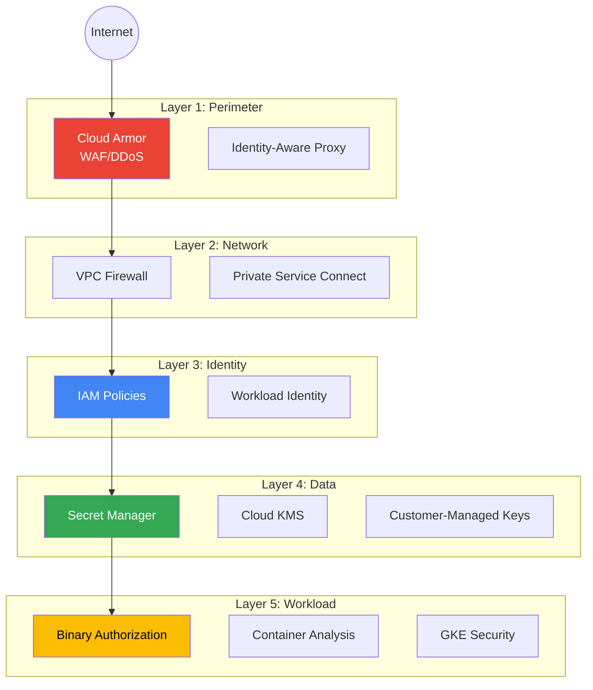
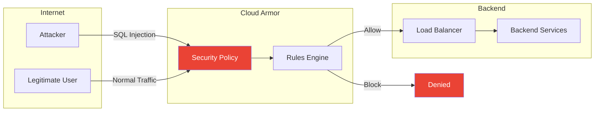
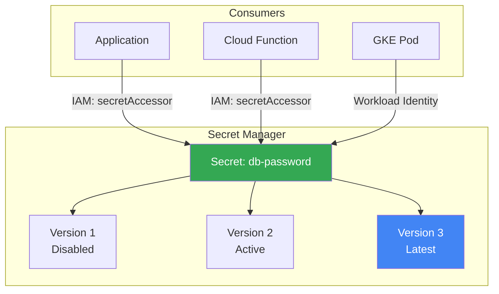
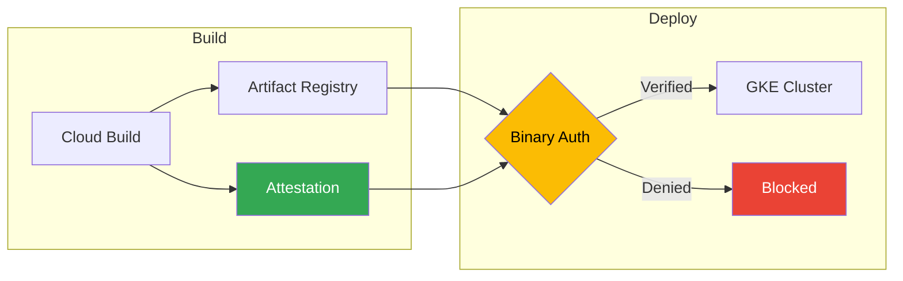
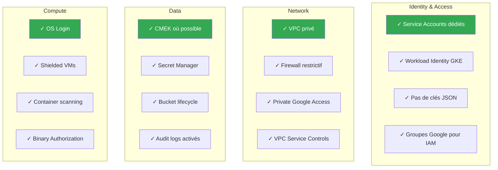

---
tags:
  - formation
  - gcp
  - security
  - cloud-armor
  - secret-manager
  - binary-authorization
---

# Module 9 : Sécurité - Cloud Armor, Secret Manager & Binary Auth

## Objectifs du Module

À la fin de ce module, vous serez capable de :

- :material-shield: Protéger vos applications avec Cloud Armor (WAF)
- :material-key: Gérer les secrets avec Secret Manager
- :material-certificate: Implémenter Binary Authorization pour GKE
- :material-account-lock: Appliquer les best practices de sécurité GCP
- :material-clipboard-check: Auditer et valider la conformité

---

## 1. Vue d'ensemble Sécurité GCP

### Defence in Depth



### Services de sécurité GCP

| Service | Fonction | Équivalent |
|---------|----------|------------|
| **Cloud Armor** | WAF, DDoS protection | AWS WAF, Cloudflare |
| **Secret Manager** | Gestion des secrets | HashiCorp Vault, AWS Secrets Manager |
| **Cloud KMS** | Gestion des clés | AWS KMS, Azure Key Vault |
| **Binary Authorization** | Contrôle d'admission K8s | Admission controllers |
| **Security Command Center** | CSPM, vulnerability detection | Prisma Cloud, Wiz |
| **Identity-Aware Proxy** | Zero Trust access | Cloudflare Access |

---

## 2. Cloud Armor

### Concepts Cloud Armor



### Créer une Security Policy

```bash
# Créer une policy
gcloud compute security-policies create my-policy \
    --description="WAF policy for web application"

# Règle par défaut : Allow (sera personnalisée)
gcloud compute security-policies rules update 2147483647 \
    --security-policy=my-policy \
    --action=allow

# Bloquer les pays (geo-blocking)
gcloud compute security-policies rules create 1000 \
    --security-policy=my-policy \
    --expression="origin.region_code == 'CN' || origin.region_code == 'RU'" \
    --action=deny-403 \
    --description="Block traffic from CN and RU"

# Rate limiting (100 req/min par IP)
gcloud compute security-policies rules create 2000 \
    --security-policy=my-policy \
    --expression="true" \
    --action=rate-based-ban \
    --rate-limit-threshold-count=100 \
    --rate-limit-threshold-interval-sec=60 \
    --ban-duration-sec=600 \
    --description="Rate limit 100 req/min"
```

### Règles WAF préconfigurées (OWASP Top 10)

```bash
# Bloquer SQL Injection
gcloud compute security-policies rules create 3000 \
    --security-policy=my-policy \
    --expression="evaluatePreconfiguredWaf('sqli-v33-stable')" \
    --action=deny-403 \
    --description="Block SQL Injection"

# Bloquer XSS
gcloud compute security-policies rules create 3001 \
    --security-policy=my-policy \
    --expression="evaluatePreconfiguredWaf('xss-v33-stable')" \
    --action=deny-403 \
    --description="Block XSS attacks"

# Bloquer LFI (Local File Inclusion)
gcloud compute security-policies rules create 3002 \
    --security-policy=my-policy \
    --expression="evaluatePreconfiguredWaf('lfi-v33-stable')" \
    --action=deny-403 \
    --description="Block LFI attacks"

# Bloquer RCE (Remote Code Execution)
gcloud compute security-policies rules create 3003 \
    --security-policy=my-policy \
    --expression="evaluatePreconfiguredWaf('rce-v33-stable')" \
    --action=deny-403 \
    --description="Block RCE attacks"

# Bloquer Scanner/Bots malveillants
gcloud compute security-policies rules create 3004 \
    --security-policy=my-policy \
    --expression="evaluatePreconfiguredWaf('scannerdetection-v33-stable')" \
    --action=deny-403 \
    --description="Block malicious scanners"
```

### Appliquer la policy au Load Balancer

```bash
# Appliquer à un backend service
gcloud compute backend-services update web-backend \
    --security-policy=my-policy \
    --global

# Vérifier
gcloud compute backend-services describe web-backend \
    --global \
    --format="get(securityPolicy)"
```

### Mode Adaptive Protection (ML-based)

```bash
# Activer la protection adaptative
gcloud compute security-policies update my-policy \
    --enable-layer7-ddos-defense \
    --layer7-ddos-defense-rule-visibility=STANDARD

# Cette fonctionnalité utilise le ML pour détecter les anomalies
# et suggérer des règles automatiquement
```

### Monitoring Cloud Armor

```bash
# Logs dans Cloud Logging
# resource.type="http_load_balancer"
# jsonPayload.enforcedSecurityPolicy.name="my-policy"

# Métriques dans Cloud Monitoring
# loadbalancing.googleapis.com/https/request_count
# Filtrer par : matched_url_path_rule, security_policy_outcome
```

---

## 3. Secret Manager

### Concepts



### Créer et gérer des secrets

```bash
# Créer un secret
echo -n "MySecretPassword123!" | gcloud secrets create db-password \
    --data-file=- \
    --replication-policy="automatic"

# Créer avec fichier
gcloud secrets create api-key --data-file=./api-key.txt

# Créer avec labels
gcloud secrets create prod-db-password \
    --data-file=- \
    --labels=env=prod,app=myapp \
    --replication-policy="user-managed" \
    --locations=europe-west1,europe-west4

# Ajouter une nouvelle version
echo -n "NewPassword456!" | gcloud secrets versions add db-password --data-file=-

# Lister les versions
gcloud secrets versions list db-password

# Accéder à un secret (version spécifique)
gcloud secrets versions access 1 --secret=db-password

# Accéder à la dernière version
gcloud secrets versions access latest --secret=db-password

# Désactiver une version
gcloud secrets versions disable 1 --secret=db-password

# Activer une version
gcloud secrets versions enable 1 --secret=db-password

# Supprimer une version
gcloud secrets versions destroy 1 --secret=db-password
```

### Permissions IAM

```bash
# Donner accès en lecture à un service account
gcloud secrets add-iam-policy-binding db-password \
    --member="serviceAccount:myapp@PROJECT_ID.iam.gserviceaccount.com" \
    --role="roles/secretmanager.secretAccessor"

# Roles disponibles
# - secretmanager.viewer : Voir metadata (pas les valeurs)
# - secretmanager.secretAccessor : Accéder aux valeurs
# - secretmanager.admin : Gérer les secrets
```

### Utilisation dans les applications

#### Python

```python
from google.cloud import secretmanager

def get_secret(project_id: str, secret_id: str, version_id: str = "latest") -> str:
    client = secretmanager.SecretManagerServiceClient()
    name = f"projects/{project_id}/secrets/{secret_id}/versions/{version_id}"
    response = client.access_secret_version(request={"name": name})
    return response.payload.data.decode("UTF-8")

# Usage
db_password = get_secret("my-project", "db-password")
```

#### Cloud Run / Cloud Functions

```bash
# Cloud Run - Variable d'environnement depuis Secret Manager
gcloud run deploy myapp \
    --image=myimage \
    --region=europe-west1 \
    --set-secrets="DB_PASSWORD=db-password:latest"

# Cloud Run - Fichier monté
gcloud run deploy myapp \
    --image=myimage \
    --region=europe-west1 \
    --set-secrets="/secrets/db-password=db-password:latest"

# Cloud Functions
gcloud functions deploy myfunction \
    --gen2 \
    --runtime=python311 \
    --set-secrets="DB_PASSWORD=db-password:latest"
```

#### GKE avec External Secrets Operator

```yaml
# ExternalSecret resource
apiVersion: external-secrets.io/v1beta1
kind: ExternalSecret
metadata:
  name: db-credentials
spec:
  refreshInterval: 1h
  secretStoreRef:
    kind: ClusterSecretStore
    name: gcp-secret-store
  target:
    name: db-credentials
    creationPolicy: Owner
  data:
    - secretKey: password
      remoteRef:
        key: db-password
        version: latest
```

### Rotation automatique

```bash
# Créer une Cloud Function pour la rotation
# La function génère un nouveau mot de passe et met à jour le secret

# Configurer un topic Pub/Sub pour les notifications
gcloud secrets update db-password \
    --topics=projects/PROJECT_ID/topics/secret-rotation

# Cloud Scheduler pour déclencher la rotation
gcloud scheduler jobs create http rotate-secrets \
    --location=europe-west1 \
    --schedule="0 0 1 * *" \
    --uri="https://REGION-PROJECT_ID.cloudfunctions.net/rotate-secret" \
    --http-method=POST
```

---

## 4. Binary Authorization

### Concepts



### Activer Binary Authorization

```bash
# Activer les APIs
gcloud services enable binaryauthorization.googleapis.com
gcloud services enable containeranalysis.googleapis.com

# Créer une policy
cat > policy.yaml << 'EOF'
admissionWhitelistPatterns:
- namePattern: gcr.io/google_containers/*
- namePattern: gcr.io/google-containers/*
- namePattern: k8s.gcr.io/*
- namePattern: gke.gcr.io/*
- namePattern: gcr.io/stackdriver-agents/*
defaultAdmissionRule:
  evaluationMode: REQUIRE_ATTESTATION
  enforcementMode: ENFORCED_BLOCK_AND_AUDIT_LOG
  requireAttestationsBy:
  - projects/PROJECT_ID/attestors/built-by-cloud-build
globalPolicyEvaluationMode: ENABLE
EOF

gcloud container binauthz policy import policy.yaml
```

### Créer un Attestor

```bash
# Créer une clé KMS pour signer
gcloud kms keyrings create attestor-keys --location=global

gcloud kms keys create build-signer \
    --keyring=attestor-keys \
    --location=global \
    --purpose=asymmetric-signing \
    --default-algorithm=ec-sign-p256-sha256

# Créer l'attestor
gcloud container binauthz attestors create built-by-cloud-build \
    --attestation-authority-note=built-by-cloud-build \
    --attestation-authority-note-project=PROJECT_ID

# Ajouter la clé publique
gcloud container binauthz attestors public-keys add \
    --attestor=built-by-cloud-build \
    --keyversion-project=PROJECT_ID \
    --keyversion-location=global \
    --keyversion-keyring=attestor-keys \
    --keyversion-key=build-signer \
    --keyversion=1
```

### Créer des attestations dans Cloud Build

```yaml
# cloudbuild.yaml avec attestation
steps:
  - id: 'build'
    name: 'gcr.io/cloud-builders/docker'
    args: ['build', '-t', '$_IMAGE:$SHORT_SHA', '.']

  - id: 'push'
    name: 'gcr.io/cloud-builders/docker'
    args: ['push', '$_IMAGE:$SHORT_SHA']

  - id: 'attest'
    name: 'gcr.io/google.com/cloudsdktool/cloud-sdk'
    entrypoint: 'bash'
    args:
      - '-c'
      - |
        gcloud container binauthz attestations sign-and-create \
          --project=$PROJECT_ID \
          --artifact-url=$_IMAGE:$SHORT_SHA \
          --attestor=built-by-cloud-build \
          --attestor-project=$PROJECT_ID \
          --keyversion-project=$PROJECT_ID \
          --keyversion-location=global \
          --keyversion-keyring=attestor-keys \
          --keyversion-key=build-signer \
          --keyversion=1

substitutions:
  _IMAGE: europe-west1-docker.pkg.dev/${PROJECT_ID}/docker-repo/myapp

images:
  - '$_IMAGE:$SHORT_SHA'
```

### Activer sur GKE

```bash
# Activer Binary Authorization sur un cluster existant
gcloud container clusters update my-cluster \
    --zone=europe-west1-b \
    --binauthz-evaluation-mode=PROJECT_SINGLETON_POLICY_ENFORCE

# Vérifier
gcloud container clusters describe my-cluster \
    --zone=europe-west1-b \
    --format="get(binaryAuthorization)"
```

---

## 5. Security Best Practices

### Checklist sécurité GCP



### Script d'audit sécurité

```bash
#!/bin/bash
# security-audit.sh

PROJECT_ID=$(gcloud config get-value project)
echo "=== Security Audit for $PROJECT_ID ==="

echo -e "\n--- Service Account Keys ---"
gcloud iam service-accounts list --format="value(email)" | while read sa; do
    keys=$(gcloud iam service-accounts keys list --iam-account=$sa --format="value(name)" | wc -l)
    if [ $keys -gt 1 ]; then
        echo "⚠️  $sa has $keys keys (user-managed keys detected)"
    fi
done

echo -e "\n--- Public Buckets ---"
gsutil ls | while read bucket; do
    iam=$(gsutil iam get $bucket 2>/dev/null | grep -c "allUsers\|allAuthenticatedUsers")
    if [ $iam -gt 0 ]; then
        echo "⚠️  $bucket is publicly accessible"
    fi
done

echo -e "\n--- VMs with External IPs ---"
gcloud compute instances list \
    --format="table(name,zone,networkInterfaces[0].accessConfigs[0].natIP)" \
    --filter="networkInterfaces[0].accessConfigs[0].natIP:*"

echo -e "\n--- Basic IAM Roles ---"
gcloud projects get-iam-policy $PROJECT_ID --flatten="bindings[]" \
    --filter="bindings.role:(roles/owner OR roles/editor)" \
    --format="table(bindings.role, bindings.members)"

echo -e "\n--- Firewall Rules allowing 0.0.0.0/0 ---"
gcloud compute firewall-rules list \
    --filter="sourceRanges:0.0.0.0/0 AND direction=INGRESS" \
    --format="table(name,allowed,targetTags)"

echo -e "\n--- Cloud SQL Public IPs ---"
gcloud sql instances list --format="table(name,ipAddresses[0].ipAddress)" \
    --filter="ipAddresses[0].type=PRIMARY"

echo -e "\n=== Audit Complete ==="
```

---

## 6. Exercices Pratiques

### Exercice 1 : Cloud Armor WAF

!!! example "Exercice"
    1. Créez une security policy `training-waf`
    2. Ajoutez des règles pour bloquer :
        - SQL Injection
        - XSS
        - Rate limit 50 req/min
    3. Appliquez à un backend service

??? quote "Solution"
    ```bash
    # Créer la policy
    gcloud compute security-policies create training-waf \
        --description="Training WAF policy"

    # SQL Injection
    gcloud compute security-policies rules create 1000 \
        --security-policy=training-waf \
        --expression="evaluatePreconfiguredWaf('sqli-v33-stable')" \
        --action=deny-403

    # XSS
    gcloud compute security-policies rules create 1001 \
        --security-policy=training-waf \
        --expression="evaluatePreconfiguredWaf('xss-v33-stable')" \
        --action=deny-403

    # Rate limiting
    gcloud compute security-policies rules create 2000 \
        --security-policy=training-waf \
        --expression="true" \
        --action=rate-based-ban \
        --rate-limit-threshold-count=50 \
        --rate-limit-threshold-interval-sec=60 \
        --ban-duration-sec=300

    # Appliquer (si backend existe)
    # gcloud compute backend-services update my-backend \
    #     --security-policy=training-waf --global

    # Vérifier
    gcloud compute security-policies describe training-waf
    ```

### Exercice 2 : Secret Manager

!!! example "Exercice"
    1. Créez un secret `api-credentials` avec vos initiales
    2. Créez 3 versions
    3. Désactivez la version 1
    4. Donnez accès en lecture à un service account

??? quote "Solution"
    ```bash
    # Créer le secret
    echo -n '{"api_key": "v1-secret-abc"}' | \
        gcloud secrets create api-credentials --data-file=-

    # Version 2
    echo -n '{"api_key": "v2-secret-def"}' | \
        gcloud secrets versions add api-credentials --data-file=-

    # Version 3
    echo -n '{"api_key": "v3-secret-ghi"}' | \
        gcloud secrets versions add api-credentials --data-file=-

    # Lister les versions
    gcloud secrets versions list api-credentials

    # Désactiver v1
    gcloud secrets versions disable 1 --secret=api-credentials

    # Créer un service account de test
    gcloud iam service-accounts create secret-reader \
        --display-name="Secret Reader SA"

    # Donner accès
    gcloud secrets add-iam-policy-binding api-credentials \
        --member="serviceAccount:secret-reader@$PROJECT_ID.iam.gserviceaccount.com" \
        --role="roles/secretmanager.secretAccessor"

    # Tester l'accès (avec impersonation)
    gcloud secrets versions access latest --secret=api-credentials \
        --impersonate-service-account=secret-reader@$PROJECT_ID.iam.gserviceaccount.com
    ```

### Exercice 3 : Audit de sécurité

!!! example "Exercice"
    Exécutez le script d'audit de sécurité et corrigez au moins un problème identifié.

??? quote "Solution"
    ```bash
    # Sauvegarder et exécuter le script
    cat > security-audit.sh << 'SCRIPT'
    #!/bin/bash
    PROJECT_ID=$(gcloud config get-value project)
    echo "=== Security Audit ==="

    # Vérifier les clés SA
    echo -e "\n--- Service Account Keys ---"
    for sa in $(gcloud iam service-accounts list --format="value(email)"); do
        keys=$(gcloud iam service-accounts keys list --iam-account=$sa \
            --filter="keyType=USER_MANAGED" --format="value(name)" | wc -l)
        if [ $keys -gt 0 ]; then
            echo "⚠️  $sa has $keys user-managed keys"
        fi
    done

    # Vérifier firewall
    echo -e "\n--- Open Firewall Rules ---"
    gcloud compute firewall-rules list \
        --filter="sourceRanges:0.0.0.0/0" \
        --format="table(name,allowed,targetTags)"
    SCRIPT

    chmod +x security-audit.sh
    ./security-audit.sh

    # Exemple de correction : restreindre une règle firewall
    # gcloud compute firewall-rules update allow-ssh \
    #     --source-ranges="35.235.240.0/20"  # IAP uniquement
    ```

---

## Exercice : À Vous de Jouer

!!! example "Mise en Pratique"
    **Objectif** : Sécuriser une infrastructure GCP avec Cloud Armor, Secret Manager et un audit de sécurité complet

    **Contexte** : Vous devez sécuriser une application web exposée publiquement. L'application doit être protégée contre les attaques OWASP Top 10, les secrets doivent être gérés de manière sécurisée, et vous devez effectuer un audit de sécurité complet pour identifier les vulnérabilités.

    **Tâches à réaliser** :

    1. Créer une security policy Cloud Armor `prod-security-policy` avec :
        - Protection contre SQL Injection
        - Protection contre XSS
        - Rate limiting : 100 requêtes/minute par IP
        - Blocage géographique (Chine et Russie)
    2. Créer 3 secrets dans Secret Manager :
        - `db-password` : mot de passe de base de données
        - `api-key` : clé API externe
        - `jwt-secret` : secret pour JWT
    3. Créer un Service Account `app-sa` avec accès aux secrets
    4. Configurer la rotation automatique des secrets (via notification Pub/Sub)
    5. Effectuer un audit de sécurité complet :
        - Lister tous les Service Accounts avec des clés
        - Identifier les buckets publics
        - Identifier les règles firewall trop permissives
        - Vérifier les Basic Roles
    6. Générer un rapport d'audit en JSON
    7. Corriger au moins 2 problèmes de sécurité identifiés

    **Critères de validation** :

    - [ ] Cloud Armor policy créée avec toutes les règles
    - [ ] Les 3 secrets sont créés et accessibles
    - [ ] Le Service Account a les permissions appropriées
    - [ ] La notification de rotation est configurée
    - [ ] L'audit de sécurité est complet
    - [ ] Le rapport JSON est généré
    - [ ] Au moins 2 problèmes corrigés
    - [ ] Documentation des best practices appliquées

??? quote "Solution"
    ```bash
    # Variables
    PROJECT_ID=$(gcloud config get-value project)
    REGION="europe-west1"

    # 1. Cloud Armor Security Policy
    gcloud compute security-policies create prod-security-policy \
        --description="Production WAF Policy"

    # SQL Injection
    gcloud compute security-policies rules create 1000 \
        --security-policy=prod-security-policy \
        --expression="evaluatePreconfiguredWaf('sqli-v33-stable')" \
        --action=deny-403 \
        --description="Block SQL Injection"

    # XSS
    gcloud compute security-policies rules create 1001 \
        --security-policy=prod-security-policy \
        --expression="evaluatePreconfiguredWaf('xss-v33-stable')" \
        --action=deny-403 \
        --description="Block XSS"

    # Rate limiting
    gcloud compute security-policies rules create 2000 \
        --security-policy=prod-security-policy \
        --expression="true" \
        --action=rate-based-ban \
        --rate-limit-threshold-count=100 \
        --rate-limit-threshold-interval-sec=60 \
        --ban-duration-sec=600 \
        --description="Rate limit 100 req/min"

    # Geo-blocking
    gcloud compute security-policies rules create 3000 \
        --security-policy=prod-security-policy \
        --expression="origin.region_code == 'CN' || origin.region_code == 'RU'" \
        --action=deny-403 \
        --description="Block CN and RU"

    # Vérifier
    gcloud compute security-policies describe prod-security-policy

    # 2. Secret Manager
    # Activer l'API
    gcloud services enable secretmanager.googleapis.com

    # Créer les secrets
    echo -n "MySecureP@ssw0rd123!" | gcloud secrets create db-password --data-file=-
    echo -n "sk-1234567890abcdef" | gcloud secrets create api-key --data-file=-
    echo -n "jwt_super_secret_key_$(openssl rand -hex 32)" | gcloud secrets create jwt-secret --data-file=-

    # Topic pour rotation
    gcloud pubsub topics create secret-rotation-topic

    # Configurer notification
    gcloud secrets update db-password \
        --topics=projects/$PROJECT_ID/topics/secret-rotation-topic

    # 3. Service Account
    gcloud iam service-accounts create app-sa \
        --display-name="Application Service Account"

    # Donner accès aux secrets
    for SECRET in db-password api-key jwt-secret; do
        gcloud secrets add-iam-policy-binding $SECRET \
            --member="serviceAccount:app-sa@${PROJECT_ID}.iam.gserviceaccount.com" \
            --role="roles/secretmanager.secretAccessor"
    done

    # Vérifier l'accès
    gcloud secrets versions access latest --secret=db-password \
        --impersonate-service-account=app-sa@${PROJECT_ID}.iam.gserviceaccount.com

    # 4. Audit de sécurité
    cat > security-audit.sh << 'SCRIPT'
    #!/bin/bash

    PROJECT_ID=$(gcloud config get-value project)
    AUDIT_FILE="security-audit-$(date +%Y%m%d-%H%M%S).json"

    echo "{" > $AUDIT_FILE
    echo '  "project": "'$PROJECT_ID'",' >> $AUDIT_FILE
    echo '  "audit_date": "'$(date -u +%Y-%m-%dT%H:%M:%SZ)'",' >> $AUDIT_FILE
    echo '  "findings": {' >> $AUDIT_FILE

    # Service Accounts avec clés
    echo '    "service_accounts_with_keys": [' >> $AUDIT_FILE
    gcloud iam service-accounts list --format="value(email)" | while read sa; do
        keys=$(gcloud iam service-accounts keys list --iam-account=$sa \
            --filter="keyType=USER_MANAGED" --format="value(name)" | wc -l)
        if [ $keys -gt 0 ]; then
            echo "      {\"account\": \"$sa\", \"keys_count\": $keys}," >> $AUDIT_FILE
        fi
    done
    echo '      {}],' >> $AUDIT_FILE

    # Buckets publics
    echo '    "public_buckets": [' >> $AUDIT_FILE
    for bucket in $(gsutil ls); do
        iam=$(gsutil iam get $bucket 2>/dev/null | grep -c "allUsers\|allAuthenticatedUsers") || true
        if [ $iam -gt 0 ]; then
            echo "      \"$bucket\"," >> $AUDIT_FILE
        fi
    done
    echo '      ""],' >> $AUDIT_FILE

    # Firewall rules permissives
    echo '    "permissive_firewall_rules": [' >> $AUDIT_FILE
    gcloud compute firewall-rules list \
        --filter="sourceRanges:0.0.0.0/0 AND direction=INGRESS" \
        --format="json(name,allowed,targetTags)" >> $AUDIT_FILE
    echo '    ],' >> $AUDIT_FILE

    # Basic Roles
    echo '    "basic_roles": [' >> $AUDIT_FILE
    gcloud projects get-iam-policy $PROJECT_ID \
        --flatten="bindings[]" \
        --filter="bindings.role:(roles/owner OR roles/editor OR roles/viewer)" \
        --format="json(bindings.members, bindings.role)" >> $AUDIT_FILE
    echo '    ]' >> $AUDIT_FILE

    echo '  }' >> $AUDIT_FILE
    echo '}' >> $AUDIT_FILE

    echo "✅ Audit terminé : $AUDIT_FILE"
    cat $AUDIT_FILE | jq '.'
    SCRIPT

    chmod +x security-audit.sh
    ./security-audit.sh

    # 5. Corrections de sécurité

    # Correction 1: Supprimer les clés de Service Account anciennes
    echo "=== CORRECTION 1: Nettoyage des clés SA ==="
    gcloud iam service-accounts list --format="value(email)" | while read sa; do
        gcloud iam service-accounts keys list --iam-account=$sa \
            --filter="keyType=USER_MANAGED AND validAfterTime<-P90D" \
            --format="value(name)" | while read key; do
            echo "Suppression de la clé ancienne : $key"
            # gcloud iam service-accounts keys delete $key --iam-account=$sa --quiet
        done
    done

    # Correction 2: Restreindre une règle firewall
    echo ""
    echo "=== CORRECTION 2: Restreindre firewall ==="
    # Exemple : remplacer 0.0.0.0/0 par des ranges spécifiques
    # gcloud compute firewall-rules update allow-ssh \
    #     --source-ranges=35.235.240.0/20  # IAP uniquement

    # 6. Validation finale
    echo ""
    echo "=== VALIDATION FINALE ==="

    echo "1. Cloud Armor:"
    gcloud compute security-policies describe prod-security-policy \
        --format="table(name,rules[].priority,rules[].description)"

    echo ""
    echo "2. Secrets:"
    gcloud secrets list --format="table(name,createTime)"

    echo ""
    echo "3. Service Account permissions:"
    gcloud secrets get-iam-policy db-password \
        --filter="bindings.members:app-sa" \
        --format="table(bindings.role,bindings.members)"

    echo ""
    echo "✅ Sécurité configurée et auditée!"
    ```

---

## 7. Nettoyage

```bash
# Cloud Armor
gcloud compute security-policies delete training-waf --quiet

# Secrets
gcloud secrets delete api-credentials --quiet

# Service Account
gcloud iam service-accounts delete secret-reader@$PROJECT_ID.iam.gserviceaccount.com --quiet

# Binary Authorization (si configuré)
# gcloud container binauthz attestors delete built-by-cloud-build --quiet
# gcloud kms keys versions destroy 1 --key=build-signer --keyring=attestor-keys --location=global
```

---

## Résumé du Module

| Concept | Points clés |
|---------|-------------|
| **Cloud Armor** | WAF, DDoS protection, OWASP rules, rate limiting |
| **Secret Manager** | Versioning, rotation, IAM granulaire |
| **Binary Authorization** | Attestations, contrôle d'admission GKE |
| **Best Practices** | Moindre privilège, VPC privé, audit logs |
| **Audit** | Scripts automatisés, Security Command Center |

---

**[← Retour au Module 8](08-module.md)** | **[Continuer vers le Module 10 : Observability →](10-module.md)**

---

**Retour au :** [Programme de la Formation](index.md) | [Catalogue des Formations](../index.md)

---

## Navigation

| | |
|:---|---:|
| [← Module 8 : Serverless - Cloud Functio...](08-module.md) | [Module 10 : Observability - Monitorin... →](10-module.md) |

[Retour au Programme](index.md){ .md-button }
